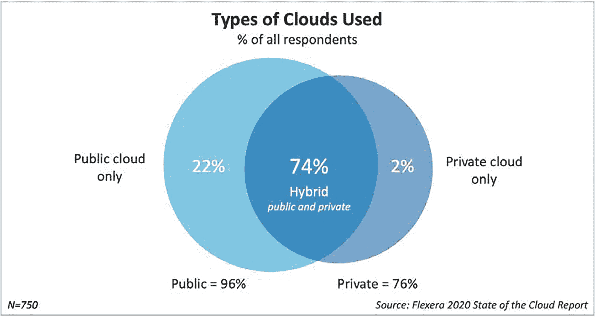
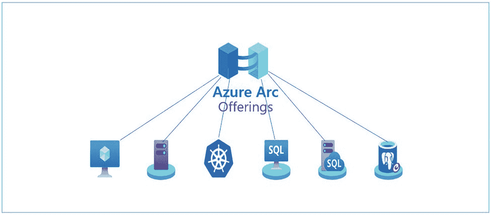
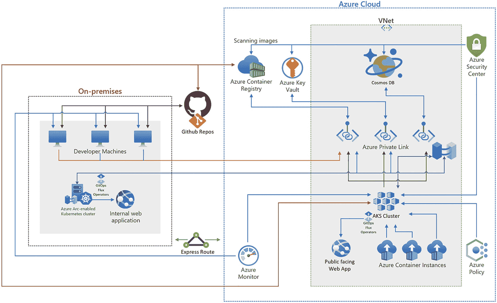

# 一、作为 Azure 控制平面的扩展的 Azure Arc 

欢迎阅读本 *Azure Arc 支持的 Kubernetes 和服务器*书的第一章。总的来说，这本书将带你进入支持 Azure Arc 的 Kubernetes 和支持 Azure Arc 的服务器的世界。Azure Arc 有许多产品，我们希望在本书中重点介绍 Azure Arc 的 Kubernetes 和服务器产品，以便在两个重点主题上为您提供最大的价值。

在我们深入 Azure Arc 产品本身之前，理解 Azure Arc 如何适合作为 Azure 控制平面的扩展是很重要的。这就是我们在本章要探讨的内容。这将有助于建立本书剩余章节的基础知识。

## 混合、多云和边缘

混合云、多云和边缘云计算都是快速增长的领域。让我们简要地定义一下它们是什么:

**混合云**

混合云将内部数据中心(私有云)与公共云相结合，为组织创建单一的云环境。混合云为您提供公共云和内部部署(也称为私有云)之间的工作负载可移植性。混合云允许企业根据需要为每个工作负载选择最佳计算位置。

**多层**

多云是指企业结合使用来自不同云提供商的两个或更多公共云。多云不是由单个云提供商提供的。多云通常是几个或更多主要云提供商的组合:亚马逊网络服务(Amazon Web Services)、谷歌云平台(Google Cloud Platform)、微软(Microsoft)、阿里巴巴(Alibaba)和 IBM。

**边缘云计算**

边缘云计算是将云服务、计算和数据存储扩展到数据源或其附近。边缘云计算节省带宽，非常适合有延迟问题的工作负载。物联网和数据密集型工作负载是边缘云计算的常见用例。

查看这些领域的一些统计数据以了解增长情况非常重要。每年发布的一个重要资源是《Flexera 云状态报告》。这份报告对所有与云相关的内容进行了细分，并给出了一些关于企业在云领域所发生的事情的硬性统计数据。让我们来看看 Flexera 2021 年云状态报告中的一些统计数据。

1.  **企业正在采用混合云**

    87%对 Flexera 2021 云状态报告做出回应的企业报告采用了混合云战略。

2.  **企业正在拥抱多云**

    93%对《Flexera 2021 年云状态报告》做出回应的企业表示拥有多云战略。他们还报告说，在他们的战略中结合了公共云和私有云。

3.  **企业正在拥抱边缘云计算**

    49%对 Flexera 2021 云状态报告做出回应的企业正在试验或计划使用边缘服务。

综上所述，大多数企业都采用混合云作为他们的云模型，其中包括多云。下图来自 Flexera 2021 年云状态报告，显示了这一点。

图 1-1

Flexera 2021 年云状态报告中使用的云类型图表

这证明了云计算的增长是在混合、多云和边缘云计算领域。

## Azure Arc 概述

正如我们在上一节中看到的，在当今的技术世界中，对混合云、多云和边缘云计算的需求日益增长。随着工作负载在混合云、多云和边缘云计算环境中运行，管理它们的复杂性也在增加。

2019 年，在微软的大型技术大会上，微软 Ignite 公布了 Azure Arc。Azure Arc 将 Azure 功能扩展到 Azure 之外的环境，如内部数据中心和其他私有云和公共云。Azure Arc 通过将 Azure Resource Manager (ARM)及其管理工具带到各种环境中来简化复杂的分布式环境，而不管它们在什么云上。Azure Arc 为技术团队提供了部署工作负载和管理资源的能力，无论它们位于何处。

Arc 是对企业内部和多云管理需求日益增加的复杂性的回应。Azure Arc 使您能够在上创建和管理资源以及工作负载

*   内部

*   非 Azure 云(即 GCP、AWS、阿里巴巴等。)

*   私有云

*   微软混合(Azure Stack Hub、Azure Stack HCI、Azure Stack Edge)

Arc all up 由多种产品组成，有助于满足组织的各种多环境需求。以下是 Azure Arc 提供价值的三个关键领域:

**一致性**

Arc 为您提供一致的资源和工作负载治理、库存和管理。

**零接触合规性和配置**

借助 Arc，您可以获得跨资源和工作负载(如服务器、Kubernetes 等)的零接触合规性和配置。

**统一体验**

Azure Arc 为您提供了跨环境和资源/工作负载的单一面板和单一控制平面的统一体验。通过 Azure 门户、Azure CLI、Azure PowerShell 或 Azure REST API 的管理，无论工作负载和资源在哪里运行，都使用相同的工具。

现在，Azure Arc 将 Azure 服务扩展到运行在 Azure 之外的资源和工作负载。基于 Azure Arc 产品，扩展的服务会有所不同。这里列出了许多可以通过 Azure Arc 扩展的 Azure 服务:

*   管理组

*   捐款

*   资源组

*   基于角色的访问控制

*   磨尖

*   安全中心/Azure Defender

*   蔚蓝哨兵报

*   Azure 密钥库

*   Azure 策略/Azure 策略来宾配置

*   Azure 备份

*   更新管理、变更跟踪和清单

*   Azure 监视器

*   Azure 自动化

*   在 Azure 门户中查看和访问

*   Azure SDK

*   ARM 模板

*   更多

目前，在管理支持 Azure Arc 的服务器和支持 Azure Arc 的 Kubernetes 时，Azure Arc 是免费提供的。Azure Arc 控制面板功能免费提供。被视为 Azure Arc 控制平面一部分的服务有

*   将服务器和 Kubernetes 集群附加到 Azure

*   通过 Azure 管理组和标记进行资源组织

*   通过资源图进行搜索和索引

*   通过 Azure RBAC 和 Azure 订阅的访问和安全性

*   通过修补程序管理进行补丁管理

*   通过 ARM 模板和 Azure 扩展的环境和自动化

## Azure Arc 产品

当 Azure Arc 推出时，它提供了一些产品，第一个是支持 Azure Arc 的服务器。自发布以来，微软一直在快速向 Arc 添加额外的产品，并扩展当前产品的功能。Azure Arc 产品分为两类。基础设施是您运行工作负载的基础设施。服务是通过 Arc 从 Azure 扩展出来的 Azure 服务。第一类是基础设施，第二类是服务。Azure Arc 产品及其能够管理的资源类型包括:

**基础设施**

*   **服务器:**支持 Linux 和 Windows，支持裸机服务器、本地服务器、AWS EC2 虚拟机、GCP 计算机引擎虚拟机、VMWare 虚拟机和 Hyper-V 虚拟机

*   **支持 Azure Arc 的 SQL Server:** 从 Azure 管理 SQL Server 的实例，将 Azure 服务扩展到 Azure 外部托管的 SQL Server 实例

*   **Kubernetes:** 内部 Kubernetes 集群、Rancher K3s、AWS EKS 集群、GCP GKE 集群

*   **Azure Arc 物联网:**通过支持 Azure Arc 的 Kubernetes，在边缘集中管理和部署物联网工作负载

**服务**

图 1-2

Azure Arc 产品

*   **数据服务:**在 Azure 之外运行 Azure 数据服务，包括 SQL 托管实例和 PostgreSQL。

*   **Azure Arc with light house:**Azure Arc 和 Azure Lighthouse 的组合，用于将灯塔管理功能扩展到非 Azure 环境。

*   **带有 Azure Arc 的 Azure 应用服务:** Azure 应用 PaaS 服务(App service，Functions，Logic Apps，Event Grid，API Management)和其他 PaaS 服务可以通过 Arc 在任何 Kubernetes 集群上运行。

## 我为什么要为我的组织使用 Azure Arc？

多云架构通常更加复杂，管理起来也更加困难。根据 Flexera 2021 年云状态报告，68%的受访企业目前没有使用多云管理工具。只有 32%的企业在利用多云管理工具。该报告还涵盖了多云治理、安全性和成本管理工具统计数据。这些其他领域的比例也很低。这意味着多云管理工具有巨大的增长机会。微软开始用 Azure Arc 来填补这一空白。

### 用例

以下是一些对使用 Azure Arc 有意义的用例:

**法定管辖权**

法律要求某些工作负载在特定地区、国家等地处理和保留数据。，需要跨多个数据中心和云提供商的基础架构。

**等待时间**

一些工作负载具有延迟要求，必须通过将工作负载定位在特定地理位置来满足这些要求。

**传统基础设施**

一些传统基础设施陈旧且具有挑战性，有时无法迁移到云中。Arc 可以将云扩展到本地传统基础设施。

**可用性**

能够跨多个云提供商甚至内部运行相同的服务，以便在云提供商或内部停机时实现更高的可用性。

**开发者选项**

能够让开发人员选择在最适合他们需求的环境中运行工作负载。

**边缘计算需求(本地)**

随着组织不断扩大其优势和本地工作负载运行范围，如商店、仓库、工厂、现场等。，扩展云和集中化管理可以降低跨边缘位置管理的复杂性。

### 混合云场景

当提到利用 Azure Arc 时，组织有许多场景。让我们来看一下其中的一个场景。在本例中，该组织正在运行一个基于容器的 web 应用，该应用的组件分布在 Azure 云和他们的内部数据中心。

在这个特定场景中，组织需要为将从内部使用 web 应用的用户提供低延迟，并且他们希望公共流量进入 web 应用；作为云运行在 Azure 上可以更好地处理外部流量负载。

该组织利用 Azure Arc 来管理内部 Kubernetes 集群和基于云的 Azure Kubernetes 服务(AKS)集群。他们还利用 GitOps 来确保内部 Kubernetes 集群和基于云的 AKS 集群配置和应用部署始终匹配。此外，他们还利用 Azure Container Instance (ACI)在 AKS 集群上按需提供非常快速的突发容量。下图显示了这个基于混合的应用的架构。

图 1-3

在混合云模式下运行的基于容器的 web 应用

## 摘要

这使我们结束了第一章。在本章中，我们花时间了解了混合、多云和边缘区域，以及管理它们所带来的挑战。我们对 Azure Arc 进行了概述。我们深入 Azure Arc 的产品，让大家了解 Azure Arc 是由什么组成的。我们最后探究了为什么您的组织可能会采用 Azure Arc。这一切都是为了给你一个 Azure Arc 知识的坚实基础，以帮助你进一步开始本书的剩余章节，更深入地进入混合、多云、edge 和 Azure Arc 的世界。