# 二、Azure 资源管理器洞察

## 介绍

在这一部分，我们将研究微软 Azure 中的 Azure 资源管理器或“ARM”平台管理层。我们将讨论它是什么，它是如何工作的，你可以用它做什么，以及如何在你的 Azure ARC 部署和 Azure 中的其他实现项目中有效使用它的技巧和诀窍。

## 什么是 Azure 资源管理器？

ARM 的核心是 Azure 的部署和管理服务。它允许创建、配置和管理资源，如虚拟机或虚拟网络，以及平台即服务或“PaaS”，如 Azure App Service、ARC 和 Azure SQL 等产品。

在 Azure 的初期，一个被称为 Azure 服务管理器或“ASM”的管理和结构系统被实现来管理平台。这个不成熟的系统很快暴露了它在治理、安全控制、资源组织、结构和环境管理方面的局限性。

ASM 最终被称为 Azure 资源管理器或“ARM”的更灵活、更强大的管理层所取代。然而，ASM 仍然存在于 Azure 环境中，基于 ASM 的资源被称为“经典”

ARM 管理层本质上执行一些任务，如创建资源并使用身份和访问控制(IAM)来管理它们，使用标记进行组织和分组，或者添加锁来防止未经授权的更改。

把 ARM 想象成你和 Azure 之间的解释器。你告诉它你想做什么，它就知道怎么做。

ARM 使你能够在 Azure 平台内部执行许多任务。它允许通过声明方式而不是静态脚本或其他动作来管理基础设施。这意味着您可以作为一个组来部署、管理、配置和监控资源，而不是试图单独管理它们。例如，您可以将定义的访问控制设计应用于一组资源，而不必单独配置每个资源，从而节省时间并减少潜在的人为错误。

这种方法不仅允许对资源范围进行更简单的管理，还允许您轻松地将同一组资源重新部署为另一个单独部署的一部分。当您需要使用生命周期方法为解决方案部署资源时，这非常方便，在生命周期方法中，您可能首先从开发环境开始，然后在最终进入生产环境之前转移到测试或 QA 环境。

在决定你的 Azure 部署策略时，你需要考虑很多不同的因素。

首先，一旦你开始走上一条路，有时很难改变方向。例如，如果您决定使用 PowerShell 脚本部署资源，但后来又决定改用其他部署方法，如 Terraform，那么这种改变可能会非常困难，并且可能需要付出大量的努力。花些时间回顾这些选择，并决定最适合你的道路。

考虑技术投资。走这条路你需要买什么？您需要构建和托管服务器吗？您需要购买软件许可吗？您是否需要第三方服务？你需要培训你的团队吗？成本是什么，价值是什么？

此外，组织未来的云采用计划是什么？Azure 的计划是什么？你有路线图可循吗？有哪些外部环境可能会推动 Azure 的采用或消费？公司是否需要在近期规划一个数据中心出口或关闭一个关键位置？

你的员工也是你项目成功的关键。您的团队中谁拥有使用工具、服务或应用所需的知识？是否存在技能差距？你将如何关闭它？将来，您将如何管理知识文档并将其转移给新的或初级的资源？

请记住，您在这里的选择不仅会影响使用 ARM 部署基础架构资源的团队，还会潜在地影响您的应用开发或数据和分析团队在将解决方案部署到 Azure 环境时的工作方式。一定要让每个人都尽早参与进来，这样每个观点都会得到考虑，并做出最佳选择。

这些都是关键领域，在规划你的路线之前，需要整个组织的思考、讨论和集体决策。

其次，预先计划好你真正想用 Azure 做什么是成功的关键。在你至少定义了基本需求、资源列表和路线图之前，你不应该在 Azure 中构建任何东西。

你会把 Azure 只用于网络应用，还是只用于数据分析？你会将数据中心扩展到环境中，并使用 Azure 来操作和管理整个组织的核心基础设施吗？

每一个不同的场景都会让你走上一条不同的道路，并且需要非常不同的资源来完成。

## 理解手臂

ARM 采用标准层次结构，具有五个级别的作用域，每一级都继承上一级的设置。

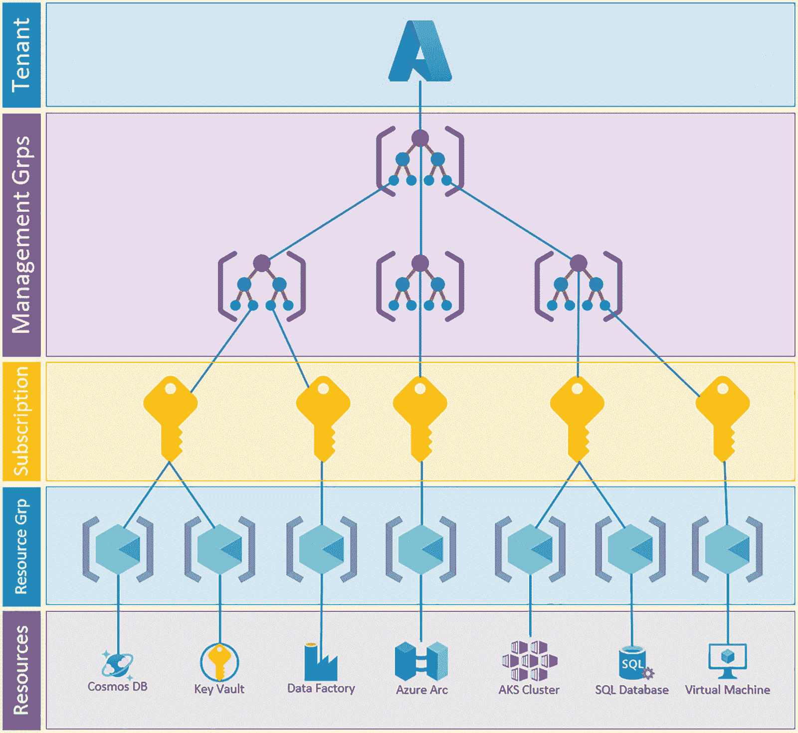

图 2-1

Azure 管理范围

层次结构的顶端是 Azure 租户。这通常也称为“注册”或“目录”从我们组织讨论的角度来看，名字其实并不重要。它只是层次结构的最高级别。

通常用于结构、管理、策略或其他更广泛的管理的第一个范围级别是管理组。该层级通常包含订阅，但在不同地理政治区域(如北美与欧洲或亚太地区)可能有不同策略的情况下，也可以有多层管理组。

设置可以应用于层次结构中的任何级别，但是用于治理和/或安全性的访问控制、权限和策略通常会在管理组中创建，以便它们由订阅和结构中低于它们的所有内容继承。

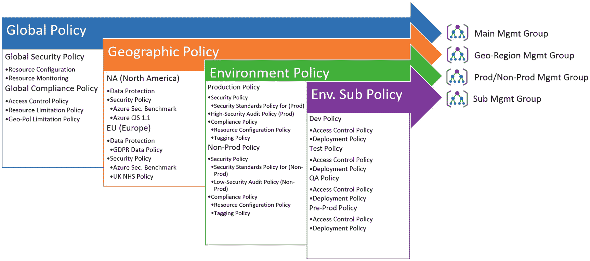

图 2-2

Azure 层次结构

这种具有继承性的分层方法支持在多个级别上配置和管理 Azure 环境，持续的限制性策略从全局或公司范围的配置向下移动到应用于非常特定的资源集的高度特定的策略集。

Key Definitions

**租户/目录/注册**:这是 Azure 的顶层组织。它将组织作为一个整体来表示，所有其他结构(如管理组和订阅)都属于租户。

**管理组**:位于结构顶部的组织对象，包含订阅和层次结构中低于订阅的所有内容。

**订阅**:Azure 中的一个逻辑构造，包含资源组，代表许多不同方面或管理和组织的边界。

**Policy**:Azure 中的一个构造，它允许创建需求规范，这些规范可以审计正确的配置，防止错误配置，或者改变资源的配置。

**Geography** :代表不同的地理区域，可能有不同的主权要求/政策，例如欧洲。

在设计组织结构时，需要考虑管理团队的一些限制。

表 2-1

管理组限制

<colgroup><col class="tcol1 align-left"> <col class="tcol2 align-left"></colgroup> 
| 

资源

 | 

限制

 |
| --- | --- |
| 每个租户的管理组 | Ten thousand |
| 每毫克订阅量 | 无限的 |
| 等级制度的层次 | 根+6 级 |
| 直接母公司管理组 | 一个 |
| 每个地点的 MG 级部署 | eight hundred |
| MG 级部署的位置 | Ten |

关于管理组限制，要考虑的重要事项是层级限制和最大部署位置。

如果您正在为一家在多个国家运营的国际组织开始大规模 Azure 云转型之旅，则应该考虑这些限制，并将其纳入您的管理团队设计中:

1.  你将需要十个以上 Azure 区域的资源。

2.  您需要根据地理政治区域、业务单位和责任划分等因素来隔离不同的订阅。

3.  您需要减少延迟的区域部署来满足业务需求。

在管理组级别下面，您会发现 Azure 订阅。

订阅级别包含资源组，通常是职责开始分离和收缩的范围。

虽然通常会对管理组实施广泛的 RBAC 控制，但经常需要允许对一个订阅和另一个订阅进行不同级别的访问。例如，如果您的组织使用生产和非生产订阅模式。生产中的权限可能需要比非生产中的权限更加严格。

Key Definitions

**订阅**:Azure 中的一个逻辑构造，包含资源组，代表许多不同方面或管理和组织的边界。

**资源组**:保存资源的容器对象。通常，这些资源作为应用或解决方案的一部分彼此相关，或者是类似的资源，如路由表或虚拟网络，它们可以组合在一起，通过基于角色的访问控制或 RBAC 进行管理。

**RBAC** :指基于角色的访问控制，这是 ARM 的一个特性，允许向用户或用户组分配预定义或自定义的角色。

**Location** : Azure Locations 代表 Azure geography 中部署资源的整体区域，例如“EastUS2”、“SouthCentralUS”和“WestUS”。

标签:标签用于将 Azure 资源组织成一个逻辑分类。标签由一个键/值对组成，这意味着有一个“键”和一个“值”。例如，您可能有一个标签，其键名为“Environment”，值名为“Prod”。

订阅经常被用作一个管理边界，在这里用户可以被授权访问订阅中的每个资源。在较小的程度上，它被用作规模的逻辑单位，通过它可以在每个 Azure 区域的基础上限制特定类型的 Azure 资源的数量。

以下是使用订阅级别管理边界的两个示例:

1.  向高级管理员授予订阅的所有者级别权限，以便此人可以管理访问控制。

2.  将“网络贡献者”角色授予组织中的网络管理员，以便他们可以访问各种网络资源和工具来测试性能和排除故障。

与管理组和订阅一样，在设计订阅策略时，需要考虑一些与 ARM 框架相关的限制。

表 2-2

订阅限制

<colgroup><col class="tcol1 align-left"> <col class="tcol2 align-left"></colgroup> 
| 

资源

 | 

限制

 |
| --- | --- |
| 每个租户的订阅量 | 无限的 |
| 每个订阅的联合管理员 | 无限的 |
| 每个订阅的资源组 | Nine hundred and eighty |
| ARM API 请求大小 | 4，194，304 字节 |
| 每个订阅的标签 | Fifty |
| 每个订阅的唯一标签计算 | Eighty thousand |
| 每个位置的订购级部署 | eight hundred |
| 订阅级别部署的位置 | Ten |

这里要考虑的最重要的事项是每个订阅的资源组数量和每个订阅的位置。如果您的资源组策略将需要大量的 rg，请考虑将它们跨多个订阅，如果您正在计划多区域部署，请计划每个订阅 10 个位置的限制。在某些情况下，使用嵌套模板跨多个位置进行部署可能会超出位置限制。

资源组或“RG”级别用于进一步细化权限，并开始组织内的职责分离。例如，如果您将所有网络资源放在一个“网络”资源组中，您可以将订阅的读者访问权限授予您的网络团队，但将贡献者访问权限授予该网络 RG。

在设计和实现资源组结构时，有许多事情需要记住。这项任务初看起来可能很简单，但是随着环境复杂性的增加，它将变得越来越令人望而生畏。

资源组中的资源应该共享生命周期，并且应该一起部署、更新和最终删除。例如，创建包含虚拟网络、虚拟网络网关、VPN 连接和路由表的“网络资源组”。这些资源在逻辑上被组合在一起，可能具有相同的 RBAC 结构，并且应该在组织内保持相同的生命周期。

资源只能存在于单个资源组中，不能属于多个组，因此 RBAC 结构应该考虑资源组的内容以及相应设计的配置。

大多数资源可以随时移动到不同的 RG。随着环境复杂性的增加，当有必要重新组织层次结构时，这通常是有帮助的。

更改资源组时，每个资源有不同的限制。在尝试移动之前，请确保阅读了有关更改资源上的资源组的文档。

资源可以位于不同 Azure 区域的资源组中，但建议将资源与 RG 保持在同一区域，因为如果 RG 位于故障区域，一个区域中的任何控制平面问题都可能影响另一个区域中的资源。这限制了单个区域故障的潜在影响。

此外，资源组为其中包含的资源提供必要的元数据。如果元数据变得不可用，资源可能会失败。

资源组是一种逻辑结构，用于对用户进行组织和访问控制，而不是限制对其他资源的访问。

资源组不充当资源之间的屏障！一个资源组中的资源可以自由地与另一个资源组中的资源交互。

标签可以应用于资源组，但是资源不会自动继承标签；然而，Azure Policy 或 PowerShell 可以在这方面提供帮助。

可以应用开箱即用或“OOB”策略，该策略可以将缺失的标签从资源组复制到该组中的资源。这极大地简化了确保所需标签出现在资源上的过程。

删除资源组将删除该组中的所有资源。删除 RG 时要小心！三重检查每个资源都可以被删除而没有影响。

关于资源组和层次结构中的其他级别，需要记住一些其他限制。

表 2-3

资源组限制

<colgroup><col class="tcol1 align-left"> <col class="tcol2 align-left"></colgroup> 
| 

项目

 | 

限制

 |
| --- | --- |
| 每个 RG 的资源 | 资源受资源组内资源类型的限制 |
| 每类资源 | 每个 RG 有 800 个资源类型实例 |
| 历史上每个 RG 的部署 | eight hundred |
| 每次部署的资源 | eight hundred |
| 每个作用域的管理锁 | Twenty |
| 每个资源或 RG 的标签数量 | Fifty |
| 标签密钥长度 | Five hundred and twelve |
| 标签值长度 | Two hundred and fifty-six |

对于资源组限制，设计中要考虑的主要问题是历史上每个资源组中相似资源的数量和每个 RG 的部署。如果您正在部署资源的多个迭代，如订阅中的存储帐户，或者它是一个特别动态的环境，您预计将超过 800 个部署历史限制，您需要考虑减轻这些限制的方法。

可以通过多种方式创建资源组，包括 Azure 门户、Azure CLI、PowerShell 和 ARM 或其他部署模板。

除了 ARM 中的层次限制之外，在您的环境的整体实施策略中，还应该考虑一些部署模板的限制。

表 2-4

ARM 模板限制

<colgroup><col class="tcol1 align-left"> <col class="tcol2 align-left"></colgroup> 
| 

价值

 | 

限制

 |
| --- | --- |
| 因素 | Two hundred and fifty-six |
| 变量 | Two hundred and fifty-six |
| 资源(包括副本数量) | eight hundred |
| 输出 | Sixty-four |
| 模板表达式 | 24，576 个字符 |
| 导出模板中的资源 | Two hundred |
| 模板尺寸 | 4 MB |
| 参数文件大小 | 4 MB |

Key Definitions

**Azure Resource Manager (ARM)模板**:通常被称为“ARM 模板”，这是一种 JavaScript 对象符号，或 JSON 格式的文件，用于通过 ARM 部署资源。这个文件是以声明性语法结构编写的，这意味着您是在声明您想要创建的对象，而不是必须编写大量的代码序列来创建对象。

当通过 ARM 或任何其他方式部署资源时，在 ARM 执行请求之前，总是需要两条信息。您必须为资源提供一个资源组和一个将部署资源的 Azure 位置。

我们已经深入讨论了资源组，所以让我们从地理角度来谈谈 ARM 的组织。

从地理角度来说，Azure 中的资源有两种交付方式。它们要么是“非区域性服务”，这意味着它们不位于特定的数据中心，服务基本上来自任何地方，要么它们是从特定的 Azure 区域交付的，要使用该服务，您必须使用该服务可用的区域。

Azure 区域是一组位置非常接近的 Azure 数据中心。Azure 区域内的资源通常会有 1-2 毫秒的跨区域延迟。每个区域都连接到 Azure edge 网络，区域之间至少有 5 毫秒的延迟，但这取决于源和目的地。如果你在美国东部和悉尼之间移动数据，这个数字会高得多。

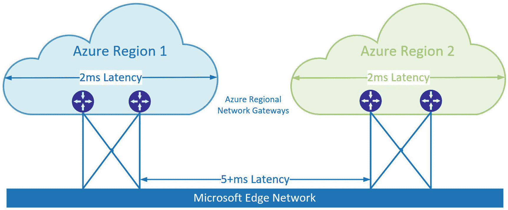

图 2-3

蓝色区域资源

Key Definitions

**Azure Region** :部署在延迟定义的地理区域内的数据中心集合，通过高带宽、低延迟的网络连接进行连接。

在每个 Azure 区域中，有两个或更多的数据中心或“可用性区域”

这些可用性区域代表一个区域内完全独立的 Azure 数据中心，拥有自己的电力、冷却和互联网连接。

如果某个地区的任何一个数据中心出现故障，该数据中心的工作负载将转移到其他两个数据中心，前提是您的地区战略设计中已经考虑到了这一点。

Azure 平台提供多种类别的服务。

**基础服务:**一个核心的 Azure 服务，在所有 Azure 区域都可用。这将是虚拟网络、虚拟机和存储帐户等基本服务。

**主流服务**:Azure 服务，在推荐地区可用，但在其他地区可能不支持。

**专业服务**:非常具体的服务，由需求驱动，通常需要专业的硬件来交付。Azure 上的 SAP HANA 大型实例是专业化服务的一个很好的例子，因为它需要 Azure 数据中心中的专用服务器，这些服务器可以支持所需的特殊操作系统以及 HANA 数据库。

当考虑您的区域策略时，验证您想要在 Azure 中使用的所有服务在您选择的区域中都可用是非常重要的。

虽然某一特定类型的资源可能在某一特定地区可用，但这并不意味着它在所有地区都可用。根据您期望使用的资源来规划您的区域！

您可以在网站上按地区查看 Azure 产品的可用性

[T2`https://azure.microsoft.com/en-us/global-infrastructure/services/`](https://azure.microsoft.com/en-us/global-infrastructure/services/)

除了选择主要区域之外，还应该为灾难恢复和跨区域操作确定一个辅助区域。微软将特定的 Azure 区域与通常相距超过 300 英里的类似服务配对，并在它们之间不断复制。

这可以保护工作负载免受自然灾害、停电或连接问题的潜在影响，这些问题可能会导致某个区域离线。

利用配对区域使您能够更快地克服主区域内的灾难或环境内的灾难。

虽然您必须从一个地区到另一个地区复制计算工作负载，但地理冗余存储或“GRS”和具有地理复制功能的 Azure SQL 会在配对的地区之间自动复制，管理服务如 ARM 资源元数据、IAM 和活动日志也会自动复制。

此外，平台更新在成对的区域中按顺序安排，以防止两个区域都受到更新窗口或更新问题的影响。

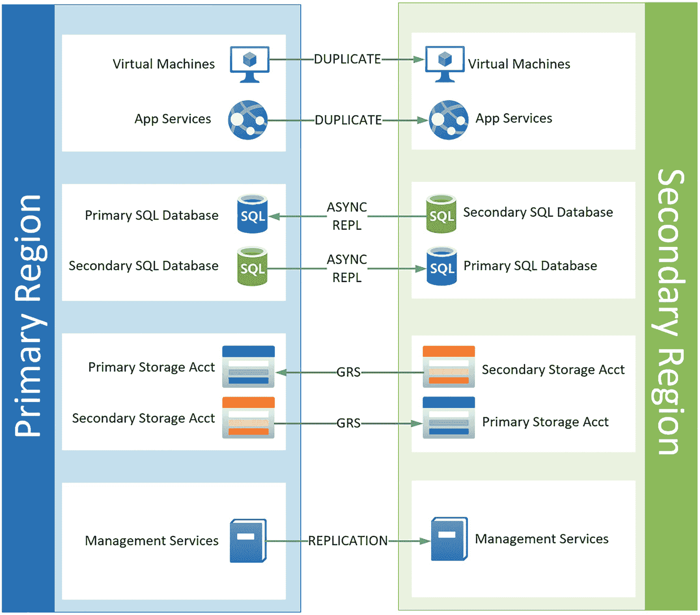

图 2-4

蓝色成对区域

微软使用“爆炸半径”方法为应用弹性的设计建议提供信息。

这实际上意味着，您需要根据爆炸半径和对运营的潜在影响来设计您的应用的弹性。

Key Definitions

**爆炸半径**:这代表一个事件对你周围环境的影响。这可以在许多层面上表现出来:

1.  **失去资源:**由于硬件故障而离线的服务器。

2.  **资源收集丢失:**这可能表示数据中心中的一个机架由于配电故障而离线。

3.  **数据中心区域丢失:**这表示 Azure 数据中心区域丢失，导致存储、网络或计算实例等服务出现重大故障。

4.  **区域丢失:**这表示某个地理区域发生了灾难性故障，迫使 Azure 区域中的所有数据中心离线。这可能是飓风或地震等自然灾害、电网灾难性故障或其他重大事件。

**Azure Region**:Azure 数据中心的集合，这些数据中心非常接近，具有低延迟连接以及独立的电源、冷却和互联网连接。

**可用性区域**:标识 Azure 区域的特定子集，该子集允许资源的分布，并且能够防止单个 Azure 数据中心的丢失。

**弹性**:应用根据服务级别协议(SLA)适应或调整故障并继续运行和交付服务的能力

在考虑如何以及在哪里使用 ARM 部署资源时，您需要考虑如何为您的部署规划弹性。

对于任何工作负载，您应该问的第一个问题是，“我需要此部署的弹性吗？”通常，非生产工作负载不需要高可用性或灾难恢复，但对生产系统会有不同的要求。

如果您确实需要工作负载的弹性，那么您的下一个问题是，“需要多少？”这通常由您的应用的服务级别协议来回答。如果您有一个业务关键型应用，它可能具有非常高的 SLA，例如 99.99%的正常运行时间，每次事件的停机时间不超过 2 小时，数据丢失时间不超过 1 小时。

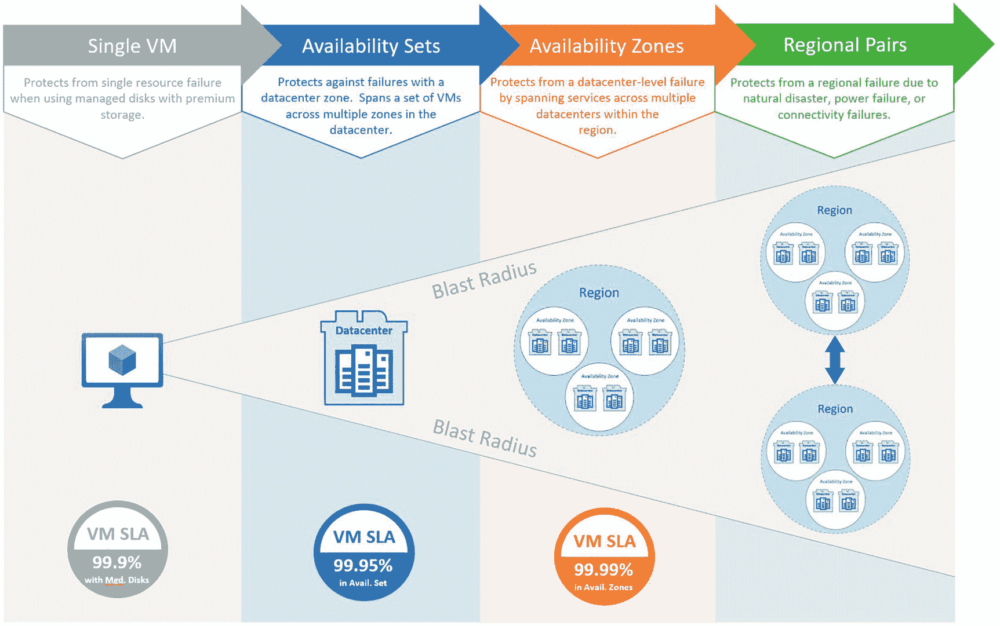

图 2-5

天蓝色爆炸半径

一旦确定了需求，就可以基于爆炸半径方法构建应用。一旦确定了方法，就可以使用 ARM 将工作负载部署到 Azure。

### 武器发展和管理

在我们深入使用 ARM 之前，让我们快速讨论一下微软是如何持续维护和更新 Azure 的。

Azure 是一个不断经历转型的平台(有时每周一次)，因此，由于 Azure 基础设施在整个地区或平台上的更新，每个 Azure 资源的特性或行为每天都可能不同或功能不同，因此经常会非常混乱。

这种看似混乱的服务模式初看起来可能如此，但在幕后，服务更改、更新和功能扩展都经过了多个客户的严格审查和测试，这些客户愿意投入时间来测试和审查这些更改/更新，并与微软合作完善它们以实现全面可用性(GA)。

Azure 服务和功能在正式发布之前，会在一个包含来自微软团队、客户和合作伙伴的反馈和改进的周期中发布。


图 2-6

Azure 开发生命周期阶段

在开发阶段，只有 Microsoft 资源参与开发特定服务的特性和功能。一旦微软确定他们已经为下一阶段做好准备，他们将邀请表示有兴趣或请求访问该服务的客户来开发围绕该产品的解决方案。这被称为“私人预览”

一旦服务已经过测试和更新，并且已经达到可以在正常使用下开始运行的状态，这个阶段就变成了“公共预览”在此阶段，任何选择实施该服务的客户都可以使用该服务，但是该服务存在一些限制，例如降低或取消服务级别协议和“尽力而为”支持，并且某些功能可能不可用或不可配置。

一旦产品管理团队认为该服务已经过全面审查并准备好投入运营，它将被视为“普遍可用”或简单的“正式发布”

强烈建议您不要使用未正式发布的服务来部署生产工作负载。功能、特性、功能和部署模型在预览版和正式发布版之间都会发生变化。在部署利用某项服务的生产工作负载之前，请始终等待该服务在您所在的地区普遍可用。

一旦产品普遍可用，所有 Azure SLAs 和支持保证都适用，服务可以在生产中实现。

您可以通过访问 Azure Products by Region 网站来查看任何地区的任何 Azure 服务的状态和可用性:

[T2`https://status.azure.com/en-us/status`](https://status.azure.com/en-us/status)

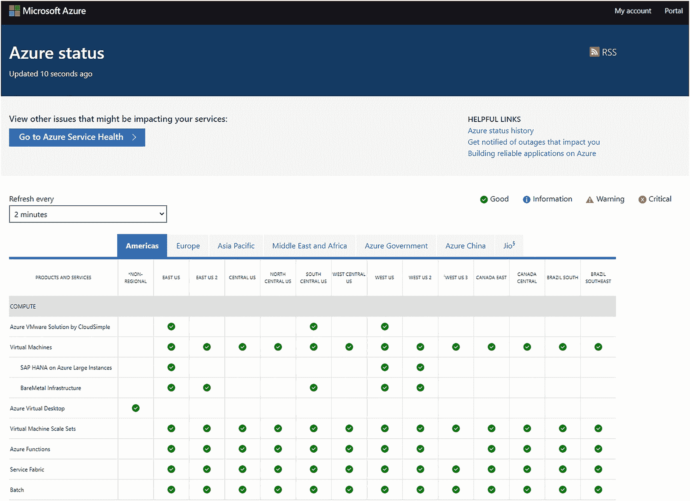

图 2-7

Azure 状态网站

## 使用 Azure 资源管理器

让我们来看看您可以与 ARM 交互的一些机制，它们是如何工作的，以及在通过 ARM 部署工作负载时应该遵循哪些建议和最佳实践。

ARM 比以前的 ASM 系统灵活得多，有多种方式可以与之交互。您可以简单地登录 Azure web 门户并使用基于 web 的图形界面，可以使用 PowerShell 或 Azure CLI 等命令行工具，甚至可以通过 REST 或第三方系统(如 HashiCorp 的 Terraform)或其他部署工具(如 Chef 或 Octopus)通过 Azure API 直接连接。

Azure 门户和 Azure API 直接与 ARM 接口，而 PowerShell 和 Azure CLI 与 Azure SDK 交互，后者管理翻译并移交给 ARM 进行请求处理。

一旦请求直接或通过 SDK 提交给 ARM，ARM 将验证发出请求的用户或服务主体的身份，并通过 RBAC 验证权限，如果流程获得授权，则执行该流程。

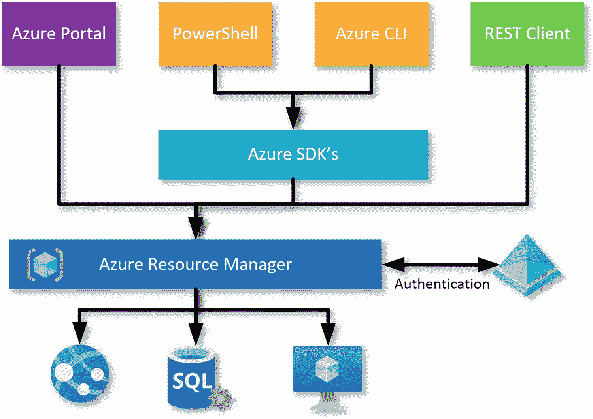

图 2-8

Azure 资源管理器操作

这个过程将“创建虚拟机”这样简单的事情变成了构建 Azure 数据中心所需的所有复杂命令和子命令，如分配存储、创建网络接口、锁定处理器/RAM 资源、将它们连接在一起，以及配置它们以基于您的请求返回功能虚拟机。

### ARM via Azure 门户

与 ARM 最常见也是最不成熟的交互是通过 Azure 门户。使用 Azure portal 可能会出现大量人为错误，以及由于人为错误和配置选项验证有限或没有验证而导致的应用或解决方案的架构故障。

Azure 门户由四个主要区域组成，它们将始终用于与 ARM 平台进行交互，以创建、修改或管理资源。

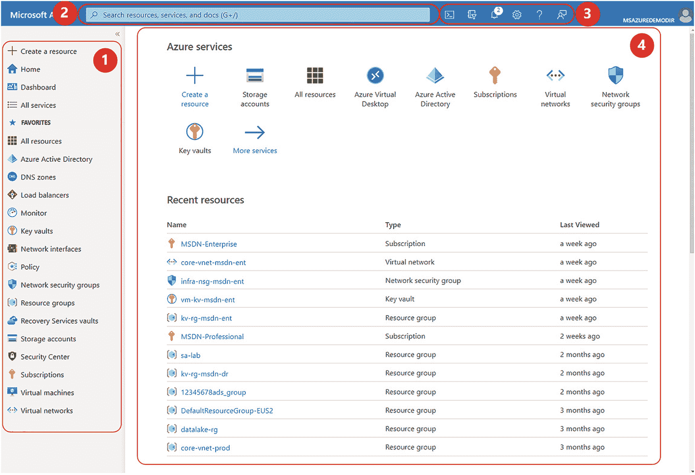

图 2-9

蔚蓝门户

1.  **主导航:**这个区域包含最常用的 Azure 资源和对象的快速链接。菜单是可定制的，可以添加、删除或重新组织项目以满足用户的需求。

2.  **搜索框:**搜索框是一个非常有用的工具，可以快速找到特定的资源类型或资源。

3.  **实用程序菜单:**实用程序菜单包含常用门户实用程序的快捷方式，例如用于通过门户执行 Azure CLI 命令的 Azure Cloud Shell，以及用于更改门户主题或布局的设置选项。

4.  **交互面板:**这是门户的主要交互区域。这是可以在门户中查看或修改资源的地方。

Azure 门户中与资源的大部分交互将发生在交互窗格中。一旦选择了资源类型，基于任何适当的筛选器的所有资源都将显示在窗格中。

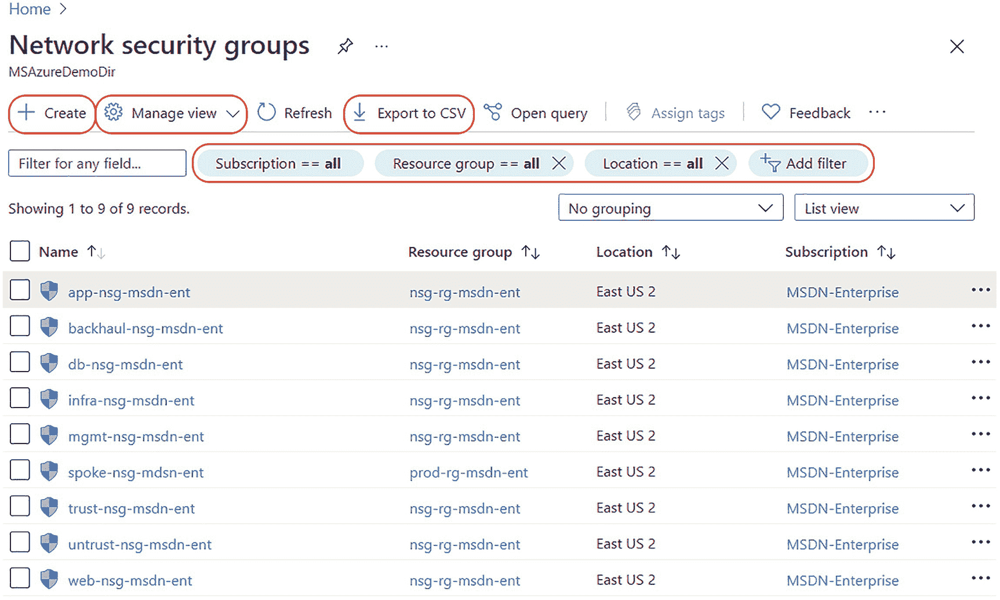

图 2-10

门户交互窗格 1

从这个视图中，您可以创建一个当前类型的新资源；您可以通过添加、删除或重新排序列来修改视图。还可以对视图应用多种不同类型的筛选器，并且可以将视图导出为逗号分隔值文件，以便在应用(如 Microsoft Excel)中查看和操作。

此外，您可以创建 Microsoft Graph 查询来获取基于图形查询结构的附加信息，并且可以创建标记并将其分配给资源。

如果您选择了单个资源，视图将会发生变化以显示该资源的特定详细信息。在这里，您可以管理资源并执行大多数配置任务。

您可以为资源分配 RBAC 角色，查看活动或诊断日志，或者修改资源的配置选项。

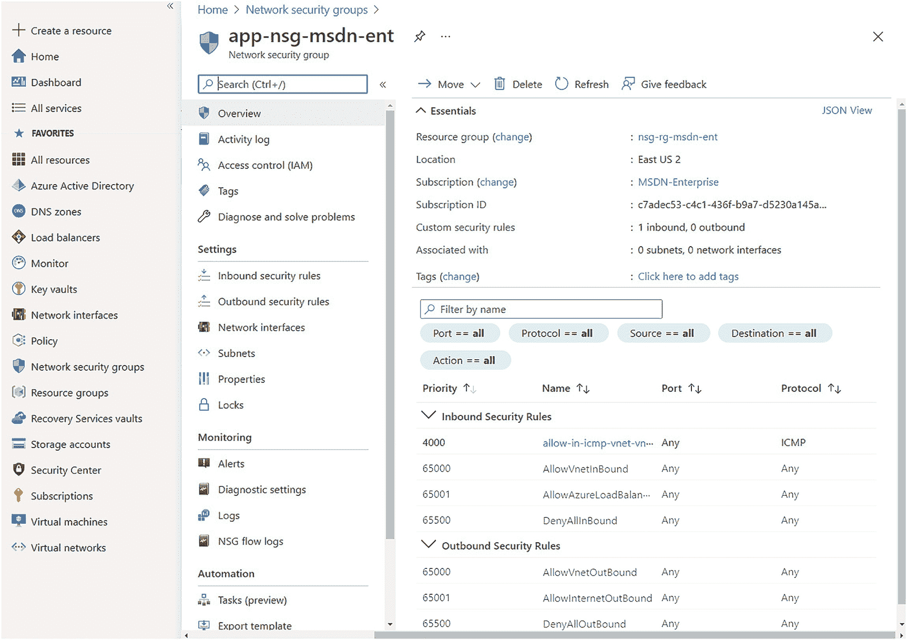

图 2-11

门户交互窗格 2

### 通过命令行启动

Azure Cloud Shell 是一个基于浏览器的交互式命令行工具，用于管理资源。Cloud Shell 可以使用 PowerShell 风格的 CLI 呈现，也可以使用 BASH 来处理命令。

可以通过两种方式访问云外壳:

1.  直接链接:打开浏览器，导航至 [`https://shell.azure.com`](https://shell.azure.com)

2.  Azure portal: Select the Cloud Shell icon in the Azure portal Utility Menu.

    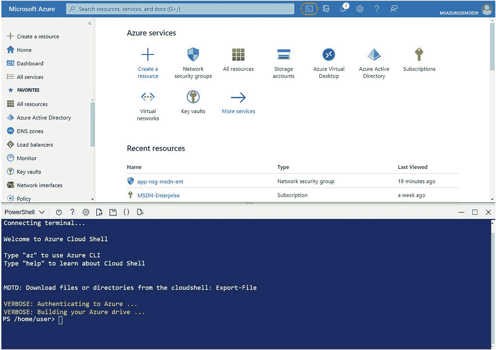

    图 2-12

    天蓝色的云壳

Azure 云壳可以处理多种语言来执行命令。

PowerShell 经常在云 Shell 中用来执行特定的命令或脚本。在清单 [2-1](#PC2) 中，执行了一个 PowerShell 命令来显示特定资源组中的所有网络安全组。

代码片段 1。Get-AzResource

```
Get-AzResource -ResourceType "Microsoft.Network/NetworkSecurityGroups" ​-ResourceGroupName "nsg-rg-msdn-ent"

```

这将返回以下信息。

```
Name              : app-nsg-msdn-ent
ResourceGroupName : nsg-rg-msdn-ent
ResourceType      : Microsoft.Network/networkSecurityGroups
Location          : eastus2
ResourceId        : /subscriptions/c7abfg3-c4c1-436f-b9a7-d5230a145a6b/resourceGroups/nsg-rg-msdn-ent/providers/Microsoft.Network/networkSecurityGroups/app-nsg-msdn-ent
Tags              :

Listing 2-1PowerShell Command in Cloud Shell

```

除了 PowerShell，在云壳中也可以使用 Azure CLI。在清单 [2-2](#PC4) 的示例中，已经执行了一个 Azure CLI 命令来显示特定资源组中的所有网络安全组。

代码片段 2。Az 资源列表

```
az resource list -g nsg-rg-msdn-ent --resource-type "Microsoft.Network/NetworkSecurityGroups"

```

在 AzCLI 中运行本质上相同的命令会以不同的格式返回不同的信息。

```
  {
    "changedTime": "2021-08-01T22:37:30.018120+00:00",
    "createdTime": "2021-08-01T22:27:12.392913+00:00",
    "extendedLocation": null,
    "id": "/subscriptions/c7adec53-c4c1-436f-b9a7-d5230a145a6b/resourceGroups/nsg-rg-msdn-ent/providers/Microsoft.Network/networkSecurityGroups/app-nsg-msdn-ent",
    "identity": null,
    "kind": null,
    "location": "eastus2",
    "managedBy": null,
    "name": "app-nsg-msdn-ent",
    "plan": null,
    "properties": null,
    "provisioningState": "Succeeded",
    "resourceGroup": "nsg-rg-msdn-ent",
    "sku": null,
    "tags": {},
    "type": "Microsoft.Network/networkSecurityGroups"
  }

Listing 2-2Azure CLI Command in Cloud Shell

```

Azure PowerShell 和 AzCLI 也可以从 Windows 命令提示符、PowerShell 提示符或 PowerShell ISE 实例中使用。

当运行命令或脚本时，使用 PoweShell ISE 通常是一个好主意，这样您可以更容易地检查代码、执行代码片段和解决问题。

通常，您可以使用 ARM 模板部署资源。ARM 模板使用基于 JSON 的声明性结构来标识要部署到 Azure 的一组资源的资源、属性和配置。

ARM 模板使用三个组件来构成部署的定义。

**参数:**提供部署过程中使用的值。参数文件可以重用，因为它们通常用于标识标准数据，并且在订阅、资源组和 Azure 环境中保持一致。

**变量:**特定于模板的参数，通常不会被重用。

**Resources:** 标识在部署期间要创建的资源。资源的配置信息通常从参数或变量中获取，并在资源创建期间应用。

当您部署 ARM 模板时，ARM 会将模板中的声明性代码转换为 REST API 操作，并按顺序执行它们。

让我们看看基本 ARM 模板中的结构组件。

<colgroup><col class="tcol1 align-left"> <col class="tcol2 align-left"></colgroup> 
| 声明此部分用于资源创建标识资源提供程序正在部署的资源的类型声明要使用的 Azure API 版本标识资源名称设置将部署资源的位置为资源选择 SKU如果需要，标识子 SKU指定资源的任何特定属性 | `"resources": [``{``"type": "Microsoft.Storage/storageAccounts",``"apiVersion": "2019-04-01",``"name": "storageaccount1",``"location": "centralus",``"sku": {``"name": "Standard_LRS"``},``"kind": "StorageV2",``"properties": {}``}``]` |

一旦你部署了你的 ARM 模板，它就被转换成一个 PUT API 操作并针对 Azure API 执行，你的资源就基于你的请求被创建。

```
PUT
https://management.azure.com/subscriptions/{subscriptionId}/resourceGroups/{resourceGroupName}/providers/Microsoft.Storage/storageAccounts/mystorageaccount?api-version=2019-04-01
REQUEST BODY
{
  "location": " centralus ",
  "sku": {
    "name": "Standard_LRS"
  },
  "kind": "StorageV2",
  "properties": {}
}

```

### ARM via DevOps

通过 ARM 在 Azure 中部署的典型代码创建>存储>执行过程相对简单。

代码通常是使用支持 ARM、Terraform、Chef 和大量编码语言和插件的工具(如 VS Code)开发的。

两种最常见的代码格式是 ARM 模板和 Terraform 模板。两者都可以用 VS 代码开发，部署到 Azure。Terraform 的好处在于，它在 Azure 中维护一个状态文件，在执行代码管道时会引用它，只修改需要的内容。

ARM 模板不跟踪当前的 Azure 环境，在部署和维护 Azure IaC 环境时灵活性稍差。

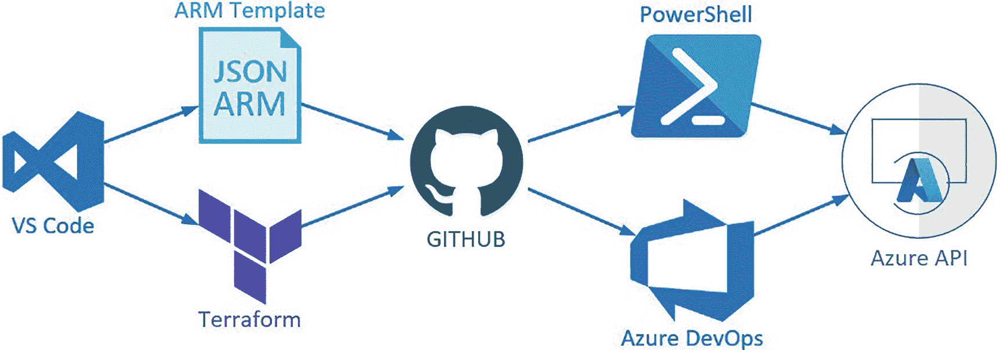

图 2-13

Azure 开发周期(简单)

一旦模板被创建，它们就被存储在某种代码库中。目前最常用的回购协议是 GIT，但代码也可以存储在 Azure 回购协议或许多其他第三方回购协议中。

一旦您创建了代码并准备好进行部署，您可以通过 PowerShell 命令或者更好的 Azure DevOps 管道进行部署。一旦你执行你的命令，或者运行管道，ARM 将接收你的请求，翻译它，并把它传递给 Azure API 进行服务。

## 摘要

在本章中，我们讨论了 Azure Resource Manager，它是什么，如何使用它，以及在规划 ARM 部署时需要考虑的事项。

虽然 Azure 资源管理器一开始看起来有点让人不知所措，但是如果你把它分成几部分，一次只关注一件事，就不难理解了。

通过本章，您应该对 ARM 有了基本的了解，对使用它规划部署有了深入的了解，并找到了如何将它融入您的云之旅的一些想法。