# 三、Azure 管理洞察

在 IT 界，管理被定义为监督所有与运营和资源相关的事务的过程。Azure Arc 存在的理由是通过将 Azure 云中的监控和控制服务扩展到 Azure 外部的计算机和服务来执行管理，例如在内部网络或其他云中。Azure Arc 本身并没有提供多少管理价值。相反，它是基于 Azure 的管理功能的丰富混合集，扩展到 Azure Arc 连接的计算机和服务，商业价值由此产生。

虽然本书中的许多章节都集中在 Azure Arc 的规划和部署方面，但本章的目的是让你具备想象什么是可能的知识。通过学习 Azure Arc 提供的监控和控制功能，您将发现您可以使用 Azure Arc 做什么。您将使用这些有价值的构建模块，有时称为*微服务*，来交付我们将在第 [6](6.html) 章“混合服务器监控解决方案”和第 [7](7.html) 章“Azure Arc 服务器的监管和安全合规性”中涉及的解决方案

## Azure 策略

Azure 策略支撑着 Azure Arc 的所有功能。换句话说，你需要分配一个或多个策略给 Azure Arc 对象来完成工作。将 Azure Arc 视为一个 Azure 策略分发和执行框架并不是不准确的。

图 [3-1](#Fig1) 展示了 Azure Arc 服务器和 Azure Arc Kubernetes 实例(在底部)如何被分配 Azure 策略(左下和右下)以强制执行 Microsoft Defender for Cloud 和 Azure Monitor 配置。这些设置反过来支持微软 Sentinel、Azure 日志分析和 Azure 自动化解决方案。

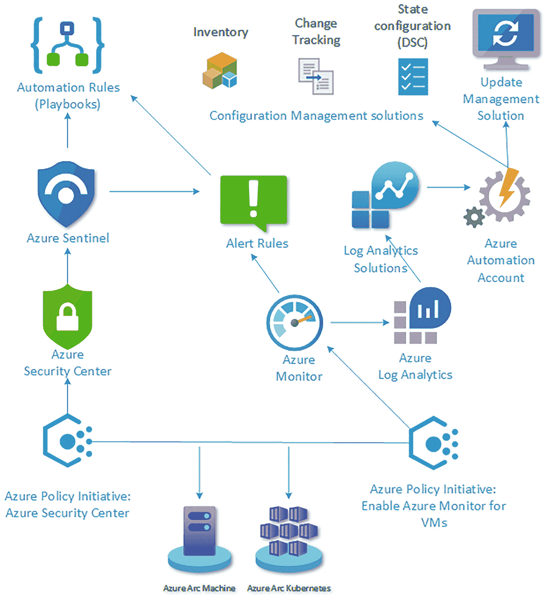

图 3-1

Azure Arc 对象的 Azure 策略分配支持对 Azure 管理服务的访问

### 真理的单一来源

Azure Policy 强制执行组织标准并大规模评估合规性。对于各种规模的组织来说，使用基于法规遵从性的模型来实现安全敏感型治理、资源一致性和法规遵从性是最佳实践。本质上，你管理的是政策的例外。如果您实现了 100%的策略遵从性，并且您持续地监控该遵从性，那么您已经做了最好的工作。有什么比在任何地方用同样的工具执行同样的政策更好的方法来获得这种信心呢？

拥有安全合规性的“单一事实来源”对于确保安全态势的完整性至关重要。图 [3-2](#Fig2) 展示了 Azure Policy 和 Azure Arc 协同工作的威力。在右上角，可以看到 Azure Policy 正在将 Azure Monitor 和 Microsoft Defender for Cloud 的计划一致地推广到位于 Azure 和内部或任何云中的 Windows 和 Linux 计算机。其他云当然包括 AWS 和私有云服务提供商。

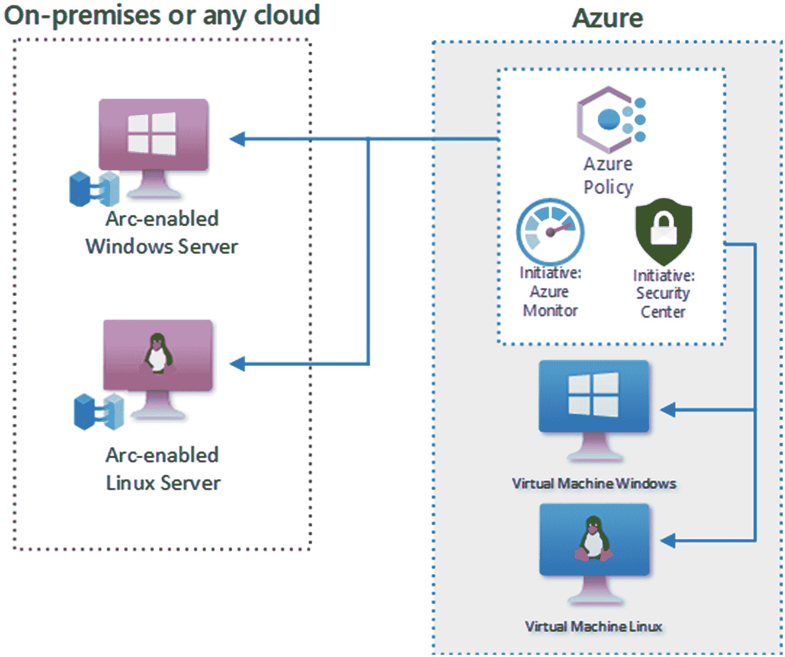

图 3-2

Azure 策略为云计划分配 Azure Monitor 和 Azure Defender

### 与活动目录的比较

熟悉 Microsoft Windows Active Directory(AD)的人可以将 Azure 策略等同于 Active Directory 组策略。如果您不熟悉 AD，可以考虑一个用户名和计算机名的目录服务，它为网络上发生的所有事情分配和实施统一的策略。

正如 AD 中的组策略对象(GPO)应用于指定的范围，如 OU(组织单位)或安全组，Azure 策略被分配给范围，如 Azure 订阅或资源组。在这两种情况下，许多位置的大量计算机共享一个策略的单个实例，从而提高了效率和一致性。表 [3-1](#Tab1) 通过将 Azure 策略概念与熟悉的 Active Directory 组策略组件进行比较，帮助理解它们。

表 3-1

比较 Azure 策略和 Active Directory 组策略

<colgroup><col class="tcol1 align-left"> <col class="tcol2 align-left"></colgroup> 
| 

Azure 策略

 | 

Active Directory 组策略

 |
| --- | --- |
| Azure 策略在分配范围内的计算机上强制实施设置。多个策略可以捆绑在一个计划中。计算机可以应用多个方案。 | GPO 可以包含许多不同设置的设置。计算机可以应用多个 GPO。 |
| 策略分配的范围在 Azure 订阅和资源组级别。例外可以应用于范围内的特定计算机。 | GPO 通常应用于域和 OU 级别。它们也可以应用于安全组，并且支持特定的豁免。 |
| 以下是导致策略被评估的时间或事件:在具有策略分配的范围内创建、更新或删除资源。一个策略或计划被新分配给一个范围。更新已经分配给某个范围的策略或计划。在每 24 小时一次的标准合规性评估周期中。 | 计算机运行时，GPO 在启动时和每 90 分钟应用和处理一次。 |
| Azure 策略示例:"审核最短密码期限不超过 1 天的 Windows 计算机" | GPO 设置示例:默认域策略➤计算机配置➤策略➤ Windows 设置➤安全设置➤帐户策略➤密码策略➤“最短密码期限”策略设置“1 天” |

Tip

Azure 策略也可以分配给 Azure 管理组，这些逻辑容器允许 Azure 管理员一次管理多个 Azure 订阅的访问、策略和合规性。

图 [3-3](#Fig3) 是 Azure 门户中策略刀片的概览窗格。已经分配给资源的五个计划的名称可以在左栏中看到。第四列和第五列显示分配的计划中不符合的资源数量和不符合的策略数量。通过逐一修正相关的不符合策略，可以减少不符合资源的数量。

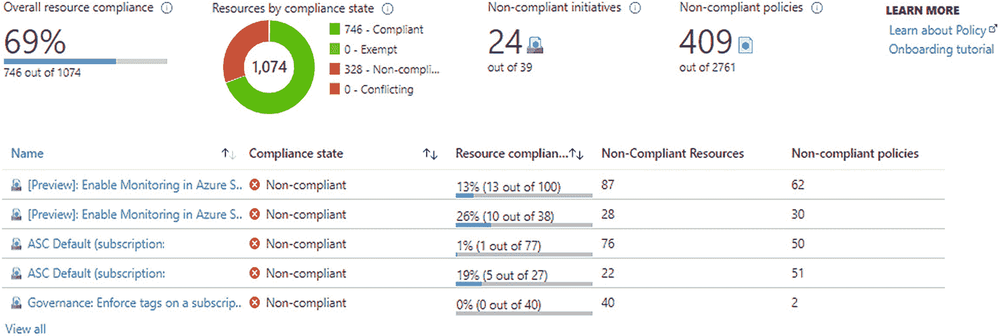

图 3-3

Azure 策略定义对 Azure 内部和内部资产统一实施规则

总之，Azure 策略在 Azure Arc 中用于向 Azure Arc 服务器交付策略分配。在此模型中，Azure 策略的常见用途是启用对 Azure Monitor 和 Microsoft Sentinel 的监控，并实施相关合规性计划中包含的安全策略。

## 微软云卫士

Microsoft Defender for Cloud 是一项可选服务，可在您的 Azure 订阅中启用。作为最佳实践，打开 Microsoft Defender for Cloud 以增强您的云安全状况。Microsoft Defender for Cloud 的独特功能包括*安全评分*，用于衡量您的订阅的安全状况，以及*法规遵从性*，这是一个强大的治理和基准测试解决方案。

使用 Microsoft Defender for Cloud 保护您的混合云工作负载。当 Microsoft Defender for Cloud(以前的 Azure Security Center)最初发布时，唯一支持的计算机是 Azure 虚拟机(VM)。现在有了 Azure Arc，Microsoft Defender for Cloud 支持扩展到任何云中的本地计算机或虚拟机。面向 Azure Arc 场景的 Microsoft Defender for Cloud 的主要优势包括:

1.  建立一个数据驱动的指标，使用 **Azure Secure Score** 评估您在 Azure、内部部署和其他云中的资源的安全状态。

2.  简化企业合规性，并对照**法规要求**查看您的合规性。

3.  Microsoft Defender for Server 针对易受攻击的工作负载(如服务器、SQL 数据库和 Kubernetes)提供深度安全检查。

这些关键优势映射到图 [3-4](#Fig4) 中所示的 Microsoft Defender for Cloud 中的顶级仪表盘图块。通过 Azure Arc，Windows 和 Linux 服务器以及 Azure 之外的 Kubernetes 完全参与了 Microsoft Defender for Cloud coverage，就像它们在 Azure 中的同行一样。

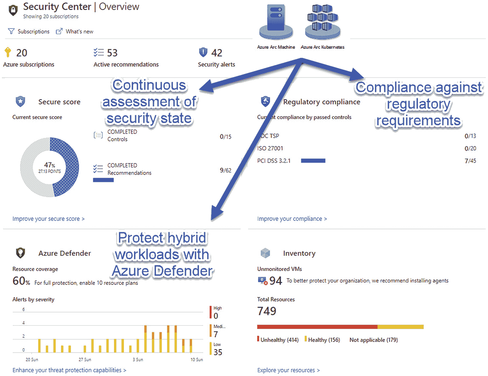

图 3-4

Microsoft Defender for Cloud(以前的 Azure Defender)是 Azure Arc 机器和 Kubernetes 安全的关键

Microsoft Defender for Cloud 的每个 Azure Arc 服务器的月成本为 15 美元，机器上的 SQL server 的月成本为 15 美元。Azure Arc Kubernetes 的成本是 2 美元/虚拟机核心/月，容器注册表是 0.29 美元/映像。具体价格因地区而异；点击此链接获取最新价格:

[T2`https://azure.microsoft.com/en-us/pricing/details/azure-defender`](https://azure.microsoft.com/en-us/pricing/details/azure-defender)

### 关注安全性的仪表板

为了在每个技术孤岛中监控企业的所有安全敏感方面，需要监视许多控制台和门户。你真的可以说，你宁愿看你的反恶意软件应用程序门户，而不是看你的防火墙健康门户？当然，你需要关注这两个门户网站以及其他许多网站。虽然 Azure 中的安全设置几乎无处不在，但 Microsoft Defender for Cloud 通过其安全评分方法获得了一个战略制高点，您可以从这个制高点评估您的企业安全状况。

正当运行 Microsoft Sentinel 的客户可以将 Microsoft Sentinel 视为他们的顶级安全操作控制台。然而，与 Microsoft Sentinel 中的实时事件处理和调查不同，Microsoft Defender for Cloud 提供了相关的控制面板视图，以及对“最普遍的建议(按资源)”和“潜在增长最高的控制”的洞察

在没有 Microsoft Sentinel 集成的情况下，Microsoft Defender for Cloud 具有内置的警报和通知工作流功能，可以在配置时向您发出信号。像微软 Sentinel 一样，工作流自动化采用 Azure Logic 应用的形式。例如，您可以编写一个逻辑应用程序，该应用程序获取 Microsoft Defender for Cloud alerts 的输出，并发送一封 O365 电子邮件，其中包含详细信息。

Tip

您可以为 Microsoft Defender for Cloud 发出的安全警报启用粒度抑制规则。在 Microsoft Defender 中查找云➤常规➤安全警报➤抑制规则的设置。基于 IP、DNS、主机和 Azure 资源实体创建覆盖

### Microsoft Defender for Cloud for server

对于许多客户来说，这可能是激活 Microsoft Defender for Cloud 的首要原因。Microsoft Defender for Cloud for servers 包括 Microsoft Defender for Endpoint，无需额外费用。它们共同提供全面的终端检测和响应(EDR)功能。使用 Microsoft Defender for Cloud 的 Windows 服务器会自动启用 Microsoft Defender for Endpoint 传感器。

Azure 虚拟机和 Azure Arc 服务器之间有许多功能相似之处，其中之一是如何使用来自 Microsoft Defender for Cloud 的数据填充安全刀片。图 [3-5](#Fig5) 与您看到的启用了 Microsoft Defender for Cloud coverage 的 Azure 虚拟机几乎相同，但这个 Azure Arc 服务器是一个运行在内部私有云上的虚拟机。提供了安全建议的优先列表以及计算机的安全事件和警报的历史列表。

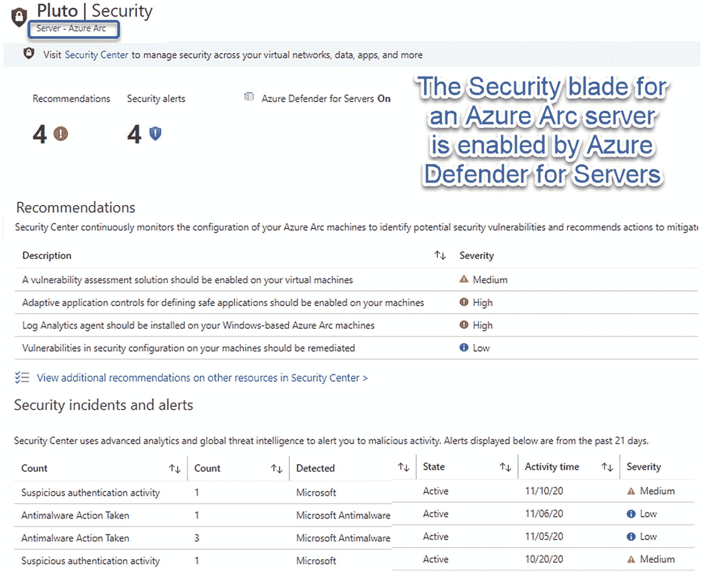

图 3-5

Microsoft Defender for Cloud 的覆盖范围通过 Azure Arc 扩展到了本地服务器

### 符合监管要求

对于一些组织，如必须遵守 PCI DSS 的金融机构或必须遵守 HIPAA 的医疗保健组织，合规性是部署 Azure Arc 和 Microsoft Defender for Cloud 的关键原因。符合性分配的安全分数基于范围内的资源符合所需安全策略的程度。拥有一个定义良好的、行业认可的安全模型可以让您的团队朝着一个有意义的目标努力。

各种行业和地区监管标准可通过策略分配给范围。这些监管标准已预先部署(开箱即用)到每个 Microsoft Defender for Cloud 实例中:

*   PCI DSS 3.2.1(支付卡行业数据安全标准，适用于处理主要卡组织品牌信用卡的组织)

*   ISO 27001(关于如何管理信息安全的国际标准)

*   SOC TSP(关于服务组织提供的服务的内部控制报告)

在 Microsoft Defender for Cloud 门户网站中轻松添加其他法规遵从性标准:

*   NIST SP 800-53 R4(联邦信息系统和组织的安全和隐私控制)

*   NIST SP 800 171 R2(保护非联邦系统和组织中的受控非机密信息)

*   英国官方和英国国民健康保险制度

*   加拿大联邦 PBMM

*   Azure CIS 1.1.0(新)(Microsoft Azure Foundations 基准法规遵从性)

*   Azure 安全基准

*   HIPAA HITRUST(医疗保健组织健康保险可携带性和责任法案)

*   SWIFT CSP CSCF v2020(客户安全控制框架包括针对 SWIFT 用户的强制性和咨询性安全控制)

### 推荐的安全生命周期方法

考虑使用 Microsoft Defender for Cloud with Azure Arc resources 的法规遵从性功能的这些高级步骤:

1.  将 Azure Arc 服务器和 Azure Arc Kubernetes 放在适合作为策略范围的 Azure 资源组中。

2.  将一个或多个 Azure 策略方案分配给包含 Azure Arc 服务器和/或 Kubernetes 的资源组。

3.  在初始分配后，观察计划中所有策略的遵从状态。

4.  为那些在您的环境中被判定为缓解或放弃的策略创建一个豁免。

5.  从未解决的不合规资源的短列表开始，执行必要的补救以实现 100%的合规性。

6.  监控持续的完全合规性，在出现异常时发出警报。

7.  警报会导致手动或自动修复和补救任务，从而恢复完全合规性。

图 [3-6](#Fig6) 显示了完全符合计划的情况。您将获得 100%的安全分数，并且计划中列出的每个控件都将被标记为已完成。

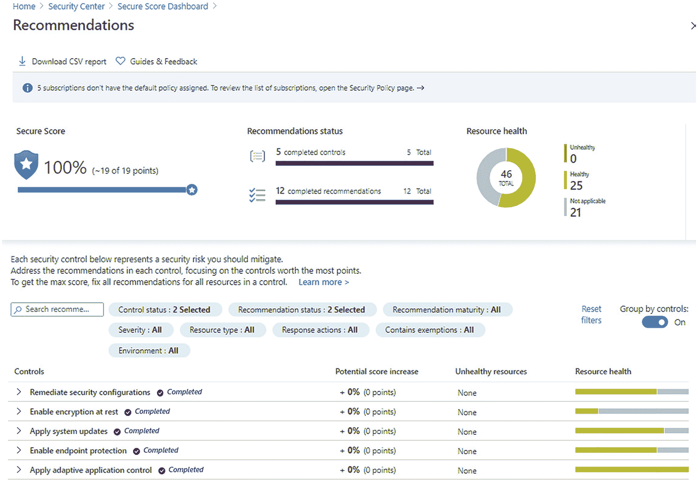

图 3-6

当你获得 100%的安全分数时，成功是什么样的

## 天蓝色监视器

Azure Monitor 是一项 Azure 服务，它收集、分析和处理来自 Azure 和内部环境的遥测数据。将“Azure Monitor”视为一个包含各种解决方案的品牌，就像“Microsoft Office”一样，它包括 Word、Excel、Outlook 和一系列帮助各个应用程序和组件协同工作的公共基础。

Azure Monitor 有很多优点；参考图 [3-7](#Fig7) 了解使用了哪些工具和微服务。如果你在 Azure 中有任何资源或者你正在使用 Azure Arc，你已经在使用 Azure Monitor 了。每个 Azure 和 Azure Arc 资源都生成日志，许多资源还提供关于利用率和性能的指标。

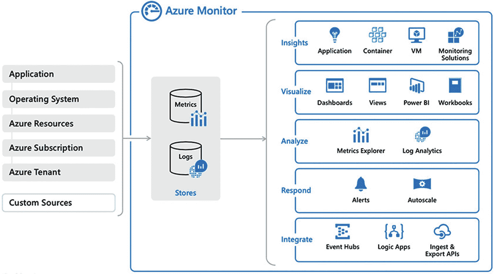

图 3-7

Azure Monitor 收集、分析和处理遥测数据

Tip

*了解 Azure Monitor 产品名称*

Azure Monitor、日志分析和应用洞察是提供监控的单一服务。日志分析和应用洞察中的一些功能已经更名为 Azure Monitor，但其功能没有改变。日志分析的日志数据引擎和查询语言被称为 **Azure Monitor Logs** 。

### Azure Monitor 数据源和解决方案

在图 [3-7](#Fig7) 的左边是输入到 Azure Monitor 的数据源，比如 Windows 计算机操作系统、类似 Key Vault 的 Azure 服务，或者来自 Azure 订阅的活动。中间度量和日志的数据库图标代表遥测数据流动和存储的数据存储库。数据的消费者和用户(“解决方案”)位于右侧，包括 Azure 仪表盘和工作簿，用于可视化和日志分析，以运行在可用性、性能、配置或安全问题发生时发出警报的预定查询。

Azure Monitor 将来自多个来源的数据存储在一起，以便可以使用一组通用工具关联和分析数据。您完全从数据存储库中抽象出来(您可以把它想象成一个无限容量的数据湖)。存储库中的数据是只读的，受您的工作区的保留策略的约束。微软通过正常的 Azure 基于角色的访问控制来处理安全访问，并在数据保留期结束时自动清除数据，默认情况下保留期为 30 天，但可延长至 2 年。

Azure Monitor 的不同数据源将写入日志分析工作区(Logs)或 Azure Monitor 指标数据库(metrics)或两者。数据存储在表中，每个工作空间或数据库都有不同的表，这取决于向它们写入了什么数据源。

### Azure Monitor 范围定位

Azure Monitor 在您创建新的 Azure 订阅时启用，活动日志和平台指标会自动收集。当涉及到日志查询时，生成日志的资源被视为“作用域”。

图 3-8 展示了 Azure Monitor 日志需要一个范围来执行查询的概念。通过将 Azure Monitor 日志限定到任何生成日志的特定 Azure 资源，您可以针对该资源的日志数据运行集中查询。或者，通过将范围设置为日志分析工作区，您可以从向该工作区报告日志的所有数据源的数据库表中进行搜索。

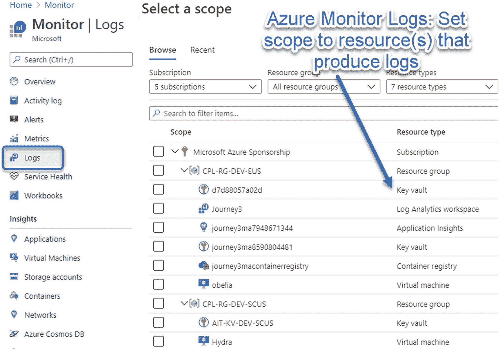

图 3-8

Azure Monitor 日志需要选择一个范围来定位查询

例如，图 [3-9](#Fig9) 显示了 Azure Arc 服务器的日志刀片。由于该服务器运行的是 Windows Defender 反恶意软件防御，并且部署了*安全和审计*或*安全无中心*解决方案，因此*保护状态*表出现在日志视图中，您可以直接查询该表。

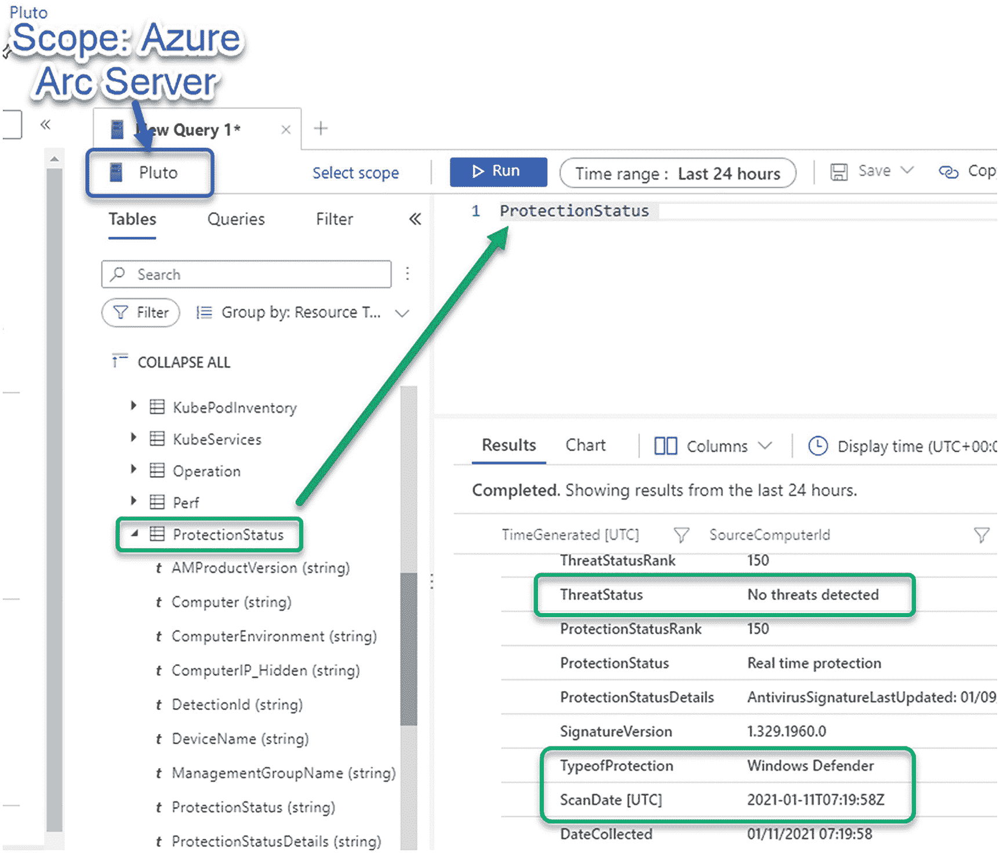

图 3-9

使用 Azure Monitor 日志检查 Azure Arc 服务器上 Windows Defender 的状态和上次扫描日期

不用说，一个相同的 *ProtectionStatus* 表也存在于运行 Windows Defender 的 Azure VM 的日志视图中。考虑一下，您可以对所有计算机的 *ProtectionStatus* 表运行相同的查询，包括 in-Azure 和非 Azure，以了解是否有任何计算机检测到威胁或扫描过期。这是一个有力的例子，说明了 Azure Arc 如何将本地计算机提升到与 in-Azure 虚拟机相同的管理范式，从而使您在混合管理任务方面的生活更加轻松。

Tip

当查询范围设置为特定资源时，*查询浏览器*、*保存*和*新警报规则*按钮在 Azure Monitor 日志视图中不可用。要创建警报、保存或加载查询，日志分析的范围必须是工作区。

## 日志分析和微软哨兵

部署这些 Azure 服务中的一个或两个来支持基础设施监控(日志分析)和/或安全监控(Microsoft Sentinel)是 Azure Arc 的一个优秀和常见的场景。通过这样做，您将实现“单一控制台”,将您的 in-Azure 和非 Azure 资源集中在相同的警报基础架构和门户视图中。两种解决方案使用相同的代理，并具有相同的推广计划。

如果您的企业有任何数量的服务器在 Azure 之外运行，并且您计划从 Azure 监控它们，您希望

1.  使用天蓝色弧线来…

2.  分配 Azure 策略…

3.  安装 Microsoft 监控代理(MMA)和依赖项

对于 Azure Log Analytics 和 Microsoft Sentinel 场景，这就是全部内容。本章描述的所有其他监控解决方案只需要安装 MMA(和依赖项)。

### 日志分析工作区

像用于 AKS 部署的 *VM Insights* (包括 Azure Arc 服务器)和 *Container Insights* 这样的监控解决方案安装到日志分析工作区中。 *Microsoft Sentinel* 作为超集解决方案( *Security Insights* )安装到现有的日志分析工作区中。(Azure Log Analytics 工作区和 Microsoft Sentinel 实例之间存在 1:1 的关系。)无论您的最终目标是使用日志分析监控服务器，还是使用 Microsoft Sentinel 管理服务器的安全性(或者两者兼有)，您都需要在 Windows 和 Linux 服务器上安装 MMA。

以下是您将在日志分析工作区中执行的三项常见操作:

1.  部署监控和管理特定服务的解决方案。

2.  运行计划查询规则以发出警报。

3.  创建可视化效果，如工作簿和仪表板。

接下来，我们将逐一了解这些内容。

Tip

避免工作空间蔓延。考虑在新的生产 Azure 订阅中创建一个日志分析工作区，作为您创建的第一个资源。这样做可以使您创建的其他日志生成资源(如虚拟机和密钥库)有一个共同的目标。

*   –启用应用洞察、容器洞察和虚拟机洞察并安装 Azure Sentinel 时，选择预先存在的工作空间。

*   –在 Azure Security Center 的定价和设置➤订阅➤设置➤自动配置中配置您的中央日志分析工作区的自动分配。

### 日志分析解决方案

日志分析中的监控解决方案提供了对特定 Azure 应用程序或服务操作的分析。部署日志分析工作区后，将自动添加适合您环境的监控解决方案，以提供特定功能。例如，当您启用 Microsoft Defender for Cloud 时，*安全*解决方案会安装在您选择的日志分析工作区中。

使用 Azure Monitor 日志的基本功能不需要安装解决方案；然而，几乎所有生产日志分析工作区都会安装几个解决方案。

对 Azure Arc 服务器特别有用的解决方案包括由 Azure Automation 安装的*变更跟踪*和*更新*，以及微软 Sentinel 的解决方案名称*安全观察*。图 [3-10](#Fig10) 显示了安装在日志分析工作空间中的这些解决方案。如果您需要从工作区中删除一个解决方案，您可以在这里完成。

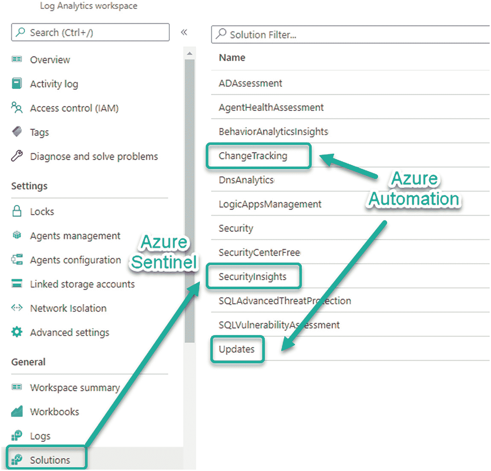

图 3-10

日志分析工作区的解决方案刀片列出了工作区中安装的解决方案

### 日志分析成本

Azure Monitor 的日志接收成本以每天千兆字节(GB/天)为单位。这是使用日志分析的主要成本。监控服务器每月贡献 1 到 3 GB 的日志和度量数据；运行 DNS 服务器的域控制器每月将高达 10 GB。根据经验，每个 Azure Arc 服务器每月预算 5 美元用于日志分析处理。(此处未估算 Microsoft Sentinel 摄取成本，该成本也以 GB/天为单位进行测量，并计入日志分析费用。)

为 Azure Logic App 和 Azure Functions executions 之类的东西运行预定查询规则和微成本会产生较小的成本。最贵的监视器每 5 分钟运行一次，每月大约 1.5 美元。每小时或每天运行一次的监视器成本要低得多，低至每天 0.05 美元。一般组织每月在这些小额费用上的花费远低于 50 美元。

要获得 Azure Monitor 度量查询和警报费用的精确估计，请在以下链接的 Azure 定价计算器中输入您的规模数据:

[https:// azure。微软。com/ en-us/ pricing/ calculator/？服务=监视器](https://azure.microsoft.com/en-us/pricing/calculator/%253Fservice%253Dmonitor)

微收费的贡献者包括指标查询(每 1000 个 API 调用 0.01 美元，前 100 万个免费)、ITSM 连接(每创建 1000 个票证 5.00 美元，前 1000 个免费)和电子邮件通知(每 100，000 个电子邮件 2.00 美元，前 1000 个免费)。

### 日志警报规则

日志警报允许您使用日志分析查询来定期评估日志，并根据结果发出警报。规则可以使用操作组触发一个或多个操作。操作组可以包括通知任务，如发送电子邮件或创建 ITSM 票证，以及自动化任务，如启动 Azure Automation Runbook 或 Logic 应用程序。

#### 传统的基于状态的监控与基于分析的监控

这是真正的监控工作发生的地方。传统的网络监控工具，如微软系统中心操作管理器(SCOM)或网络安全管理软件产品公司的 *Orion* ，由一个代表被监控服务器健康状态的数据库组成。代理或探测器使用专有工作流来检查特定的属性或指标，并将其写入数据库。例如，监视器可能“ping”一个服务器，并将 ping 应答状态记录到数据库中。当您想知道服务器是否在线时，您可以检查数据库中的 state 值，以了解最后一次成功的 ping 是什么时候。

一种更现代、更可扩展的方法是使用基于日志的分析。这种方法的流行实现包括来自 *Splunk* 、 *Sumo Logic* 和 *ELK (Elasticsearch、Logstash 和 Kibana)* 的产品。企业通常选择 Splunk 的功能和特性集，云原生 Sumo 逻辑的简单性，或 ELK 的开源设计。

在该模型中，轻量级代理进程将日志数据从服务器传输到存储库。想法是，如果我们记录服务器正在做的一切，我们可以通过搜索日志的副本来了解我们想要的任何东西。有关服务器状态的问题通过两步过程来回答:(1)首先运行一个搜索存储库的查询，然后(2)查找搜索查询条件的匹配(或不匹配)。

#### 基于查询的警报规则如何工作

例如，考虑一个您希望发出警报的常见场景；这是与受监控服务器失去联系。对失去联系发出警报的查询包括从计算机中搜索最近的“心跳”日志条目。运行查询时没有找到最近的心跳日志条目构成了失去联系。每 5 分钟运行一次该查询(一个*预定警报规则*)可以在与服务器失去联系时产生近乎实时的警报。

参见图 [3-11](#Fig11) 中 Azure 日志分析工作区的规则刀片。第一列显示警报生成规则的名称，第二列显示对感兴趣的条件进行检查的实际查询语言。

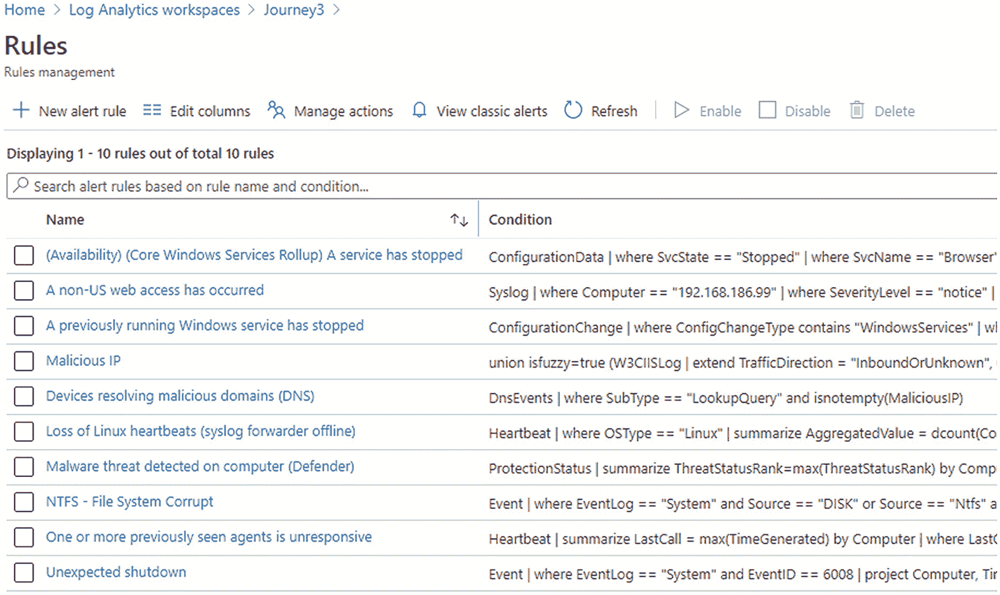

图 3-11

预设规则检查您想要发出警报的条件

许多适用于 Azure 虚拟机的查询也适用于 Azure Arc 服务器。例如，考虑这个简单的查询，它返回一个受监控计算机的列表，以及它们最近的心跳:

```
Heartbeat
| summarize arg_max(TimeGenerated, *) by Computer

```

由于 Azure VMs 和 Azure Arc 服务器每分钟都产生心跳消息，并且这两种服务器都属于 Azure 对象的“计算机”类，因此实现了同构列表。

如果将来迁移到 Azure VMs，您在为 Azure Arc 服务器构建有用的监控规则库方面所做的投资将在很少或没有修改的情况下继续工作。基于预定查询的规则在 Microsoft Sentinel 中的工作方式相同，它们被称为*分析活动规则*。

### 工作簿和仪表板

当不利或异常事件发生时，一旦您收到警报，请考虑有效监控的另一面是可视化。特别是，要评估计算机性能指标的状态，一个警报列表(甚至是没有警报)是不够的。在许多情况下，您需要某种基于图表或图形的可视化显示来执行管理。

Azure Monitor(以及 Azure Log Analytics 和 Microsoft Sentinel)使用与警报生成规则相同的核心功能解决了可视化需求:查询。Azure Monitor 中使用的查询语言 Kusto Query Language 或 KQL 的一个特性是，查询可以以图形和列表格式返回数据。请这样想:虽然预定的警报规则包含要运行的查询和要根据查询结果执行的操作，但 Azure Monitor *可视化*如工作簿和仪表板包含多个查询。当您打开工作簿或仪表板时，每个查询都会立即执行并实时呈现图形输出供您查看。

#### Azure 工作簿

图 [3-12](#Fig12) 中的工作簿展示了混合环境中跨平台查询分析的强大功能。带有条形图和彩色阴影的分类图表评估服务器性能。该视图显示了 Windows 和 Linux 服务器的 CPU 利用率，这些服务器既是 Azure 中的虚拟机，也是本地物理和虚拟计算机。借助 Azure Arc 和 Microsoft Monitoring Agent (MMA ),您可以使用 Azure 管理工具实现服务器性能的“单一平台”,这些工具可扩展到您的整个资产。

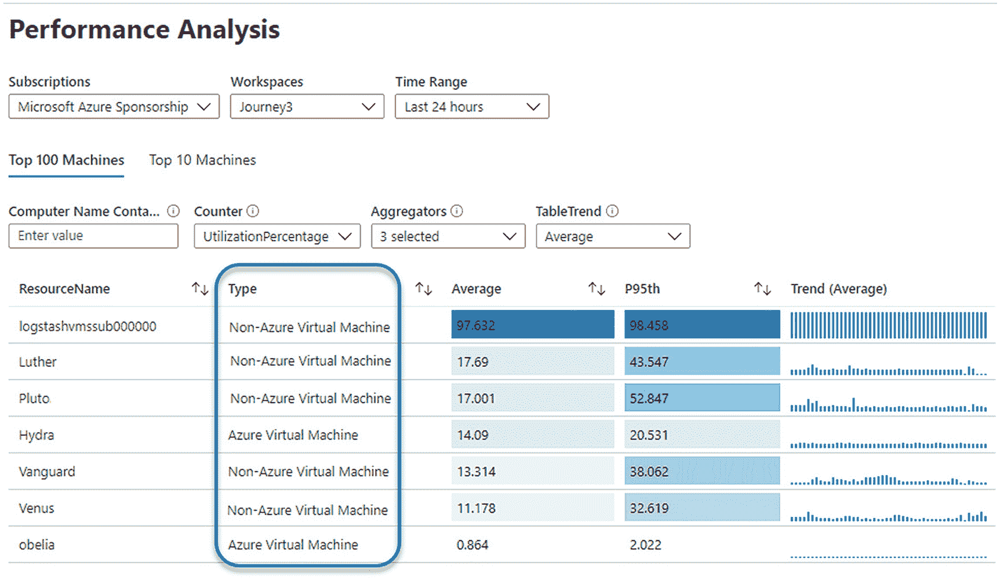

图 3-12

查询在 Azure 工作簿中以图表形式返回数据

工作簿保存在您的 Azure 订阅中，可以通过各种方式与团队成员共享。Microsoft Sentinel 环境只有共享工作簿，而 Azure Monitor 和日志分析环境只有私有工作簿。在所有环境中，通过向接收者发送唯一的 URL，私有工作簿是可共享的。

工作簿支持启用参数的交互式报告——也就是说，选择表格中的一个元素将动态更新相关的图表和可视化效果(参见图 [3-12](#Fig12) 中的下拉选择框，如*计数器*和*表格趋势*)。这使您可以旋转和聚焦可视化，以便在数据中“飞来飞去”。

#### Azure 仪表盘

Azure Monitor 中的另一个可视化产品是 Dashboard。就像 Azure 工作簿一样，Azure 仪表板是 KQL 查询的集合，配置为以图表和图形格式返回数据。仪表板可以是您的用户帐户专用的，也可以与队友共享。

图 [3-13](#Fig13) 是一个仪表板，*基础设施洞察*显示所有受监控服务器的网络流量指标，包括内部 Azure 虚拟机和内部 Azure Arc 服务器。这种可视化有助于您快速识别您的资产中的“主要参与者”`—`,无论他们在哪里，也无论他们运行什么操作系统。

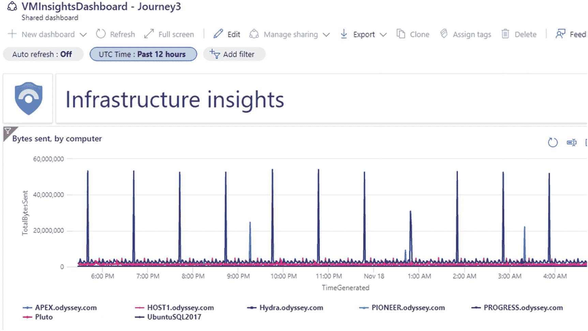

图 3-13

Azure 仪表盘具有自动刷新和全屏模式

使用仪表板的主要原因包括，像工作簿一样，仪表板有一个自动刷新设置，可以从每 5 分钟到每天一次进行自定义。仪表板也有一个有用的“全屏”模式。通过组合这些功能，您可以创建无限数量的实时 kiosk 风格的仪表板，这些仪表板可以在任何装有 web 浏览器的计算机上运行。

## Azure 自动化解决方案

Azure Automation 帐户链接到给定的 Azure 日志分析工作区，以支持各种解决方案。在 Azure Automation 中，您可以为您的 Azure Arc 服务器和 Azure 内虚拟机启用更新管理、更改跟踪和清单功能。这些功能依赖于日志分析工作区，因此需要将工作区与自动化帐户相链接。

最佳实践是在创建 Azure Log Analytics 工作空间后立即创建一个自动化帐户，然后继续执行链接它们的过程。但是，仅支持某些区域将它们链接在一起。表 [3-2](#Tab2) 列出了成功启用和使用这些功能的支持映射。确保了解此表，并为您的 Azure Log Analytics 工作区选择区域。

表 3-2

支持的映射 Azure 日志分析 Azure 自动化

<colgroup><col class="tcol1 align-left"> <col class="tcol2 align-left"></colgroup> 
| 

日志分析工作区区域

 | 

Azure 自动化区域

 |
| --- | --- |
| 澳大利亚东南部 | 澳大利亚东南部 |
| 加拿大中央 | 加拿大中央 |
| 印度中部 | 印度中部 |
| 中国东方 2 号 | 中国东方 2 号 |
| 艾西乌斯 | 伊斯特斯 2 号 |
| 伊斯特斯 2 号 | 艾西乌斯 |
| 法国腹侧 | 法国腹侧 |
| 日本料理 | 日本料理 |
| 北欧 | 北欧 |
| 中南半岛 | 中南半岛 |
| 东南亚 | 东南亚 |
| 瑞士北部 | 瑞士北部 |
| 英国南部 | 英国南部 |
| 美国亚利桑那州 | 美国亚利桑那州 |
| 美国弗吉尼亚州 | 美国弗吉尼亚州 |
| 威斯特中心 | 威斯特中心 |
| 西欧国家 | 西欧国家 |
| 威斯乌斯 2 号 | 威斯乌斯 2 号 |

您会很高兴创建了一个自动化帐户，这不仅是为了我们将在本章中描述的更新和配置管理功能，也是为了您将获得的通用**流程自动化**:

*   **Runbooks** :可以自动启动的 PowerShell 或 Python 脚本

*   **混合工人小组**:在本地执行从基于云的 Azure 流程启动的操作手册的自动化工具

*   **观察者任务**:启动观察事件的成对操作手册，然后在事件发生时执行选定的自动操作

有了自动化框架，您可以将 runbooks 指定为对 Azure Monitor 警报的自动响应。此外，您可以准备基于 PowerShell 和 Python 脚本的 runbooks，以响应由 Microsoft Sentinel 行动手册(Azure Logic Apps)激活的 webhooks。

Tip

要将 Azure Automation 帐户与 Azure Log Analytics 工作区链接，请导航到其中一个配置管理解决方案或自动化帐户中的更新管理解决方案。在右侧的详细信息窗格中，您将能够选择配对的日志分析工作区，并按下**启用**按钮。

### Azure 自动化成本

Azure Automation 在 Azure Arc 场景中有两个优秀的特性:*更新管理*和*配置管理*。一个是处处自由；另一个成本在 Azure 之外:

*   **更新管理:**免费(所有 Azure 虚拟机和 Azure Arc 服务器)

*   **配置管理:**Azure 虚拟机免费，Azure Arc 服务器每月 6 美元的“非 Azure 节点配置管理”

除了这些功能之外，Azure Automation 还具有流程自动化功能，例如微收费的*作业运行时间*(0.002 美元/分钟，每月 500 美元)和*观察器*节点(002 美元/小时，每月 744 美元)。

要获得流程自动化和配置管理的 Azure Automation 费用估算，请在 Azure Automation 定价页面选择您的地区和货币:

[T2`https://azure.microsoft.com/en-us/pricing/details/automation/`](https://azure.microsoft.com/en-us/pricing/details/automation/)

### 更新管理

Azure automation 的更新管理功能是一个巨大的价值，因为对 Azure 虚拟机或 Azure Arc 服务器使用该解决方案没有许可成本。除了日志分析数据处理的微收费，这是一个完全免费的解决方案，用于监控和管理 Windows 和 Linux 操作系统(OS)更新。行业内真的没有类似的。

如果您正在购买第三方服务器更新解决方案，或使用 Microsoft Endpoint Manager(以前的 System Center Configuration Manager)进行操作系统更新，或使用 WSUS(Windows Server Updating Server)，请考虑迁移到这款免费的全功能解决方案来处理您的服务器操作系统更新。它简单而优雅，并与 Azure Arc 和 Microsoft Defender for Cloud 完全集成。

在您启用更新管理解决方案后，您的每个 Azure Arc 服务器都将在 Azure 门户中的 Azure Arc 服务器刀片内拥有一个实时更新仪表板，如图 [3-14](#Fig14) 所示。您不仅可以准确地实时查看所选计算机的更新状态，还可以针对本地服务器轻松创建和启动基于云的更新任务。

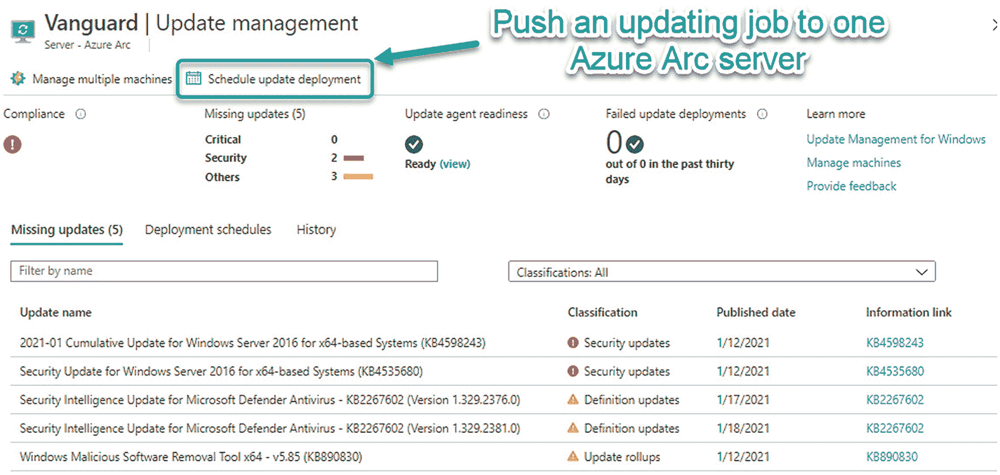

图 3-14

Azure Arc 服务器的更新管理刀片

除了添加到每个 Azure Arc 服务器的更新管理视图，还有一个视图管理 Azure Automation account blade 中的*多台机器*上的更新，如图 [3-15](#Fig15) 所示。从该页面，您可以在 Azure VM 和 Azure Arc 服务器设置中针对多台 Windows 和 Linux 计算机启动即时或计划更新作业。

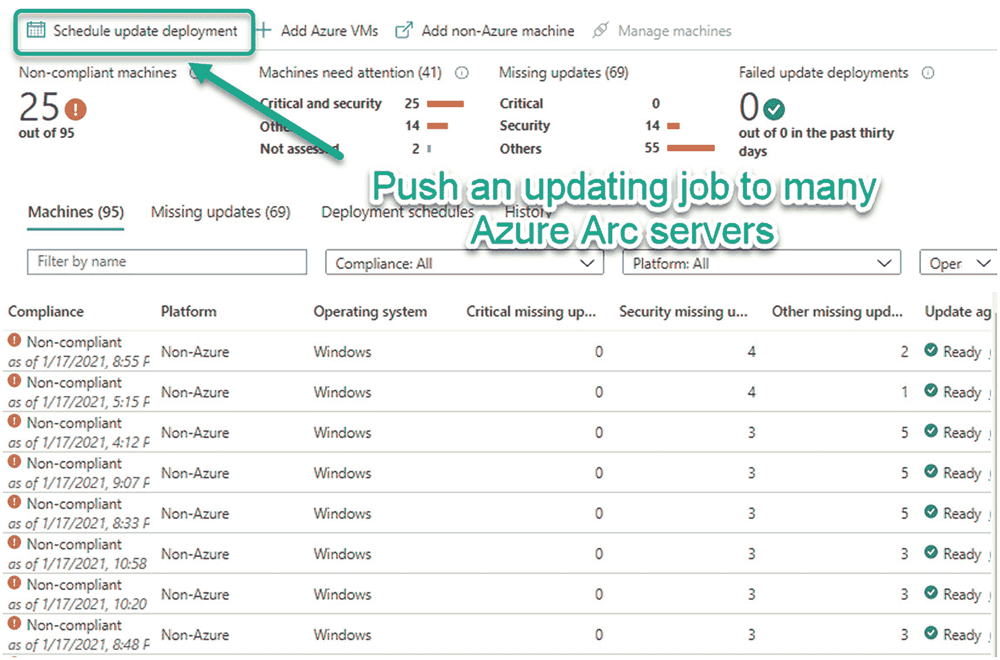

图 3-15

Azure Automation 帐户的更新管理刀片

### 结构管理

Azure automation 的配置管理功能对 Azure 虚拟机是免费的，Azure Arc 服务器每月有 6 美元的 Azure 消费成本(被称为“非 Azure 节点的配置管理”)。该特性捆绑了三个微服务:状态配置(DSC)、清单和变更跟踪。

#### 状态配置(DSC)

Azure Automation State Configuration 是一个 Azure 配置管理服务，允许您为任何云或内部数据中心中的节点编写、管理和编译 PowerShell 所需的状态配置(DSC)配置。

如果您还没有准备好从云中管理机器配置，您可以使用 Azure Automation State Configuration 作为仅报告端点。此功能允许您通过 DSC 设置(推送)配置，并在 Azure Automation 中查看报告详细信息。

如果您的环境已经在 Azure 之外使用 DSC，请考虑 Azure 自动化状态配置提供了几个优势。该服务能够从一个安全的中心位置快速轻松地跨数千台机器进行扩展。

Azure Automation State Configuration service 之于 DSC，就像 Azure Automation runbooks 之于 PowerShell 脚本一样。换句话说，就像 Azure Automation 帮助你管理 PowerShell 脚本一样，它也帮助你管理 DSC 配置。

#### 库存

Azure 自动化清单功能会发现您的环境中安装了什么软件。您可以收集和查看计算机上的软件、文件、Linux 守护程序、Windows 服务和 Windows 注册表项的清单。跟踪计算机的配置可以帮助您查明环境中的操作问题，并更好地了解计算机的状态。

清单解决方案提供了类似传统 CMDB(配置管理数据库)的功能，可以跟踪所有受监控的 Windows 和 Linux 服务器上安装的软件和运行的服务，包括 Azure 虚拟机和本地 Azure Arc 服务器。实时和历史库存状态同样被跟踪。

39 台服务器(主要是 Azure Arc Windows 服务器和一些 Linux)的清单视图如图 [3-16](#Fig16) 所示。在之前的 24 小时内，Azure Automation 跟踪了超过 12，000 项软件更改、近 800 项 Windows 服务和 200 项 Linux 守护程序状态更改。

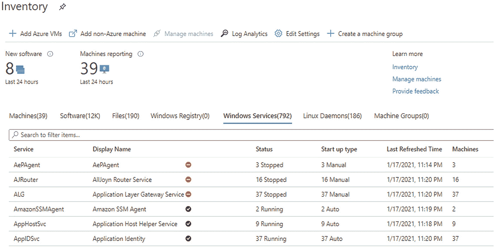

图 3-16

Azure Automation Inventory:安装在您环境中的软件的实时配置管理数据库

#### 更改跟踪

Azure Automation 中的更改跟踪可监控 Azure、内部和其他云环境中托管的虚拟机的更改，以帮助您查明操作和环境问题。例如，如果 Azure Arc 服务器开始出现问题，您可以咨询计算机的服务器-Azure Arc 更改跟踪刀片，查看在过去几个小时或几天内是否发生了任何意外的软件或注册表更改。更改跟踪所跟踪的项目包括

*   Windows 软件

*   Linux 软件(软件包)

*   Windows 和 Linux 文件

*   Windows 注册表项

*   微软服务

*   linux 守护进程

变更跟踪建立在 Azure Automation 的库存特性之上。捕获受监控清单发生的更改，以便在调查过程中重现这些更改，并提供环境中名义更改率的指标。图 [3-17](#Fig17) 是 Azure Automation 帐户设置为 30 天视图的变更跟踪刀片。

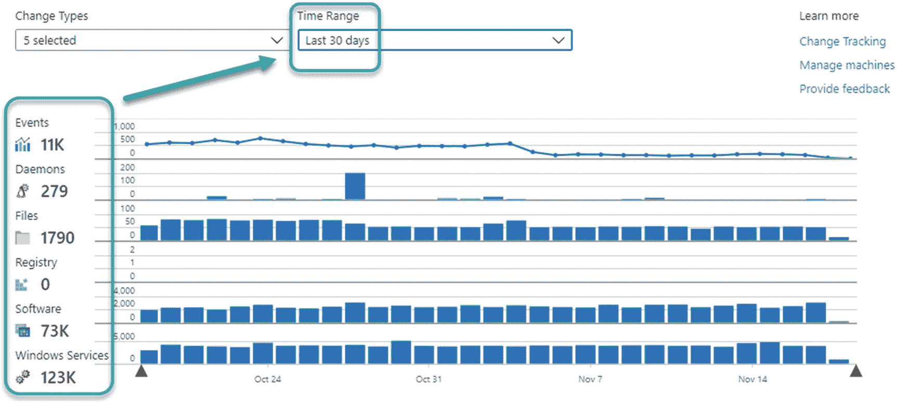

图 3-17

Azure 自动化变更跟踪:检测跨平台和应用程序的变更

聚焦和过滤变更跟踪摘要，以深入到图中反映的单个变更，这是很简单的。变更跟踪在某种程度上是 Azure 自动化配置管理解决方案的“皇冠上的宝石”,因为它在取证和安全角色中的价值。

当您的环境中出现无法解释的问题时，一个早期且有效的问题是，*什么发生了变化？有了 Azure Automation 变更跟踪，你就有了一个有价值的工具来回答这个问题。当检查变更事件的变更细节时，变更的“之前和之后”值被保存并显示，如图 [3-18](#Fig18) 所示。*

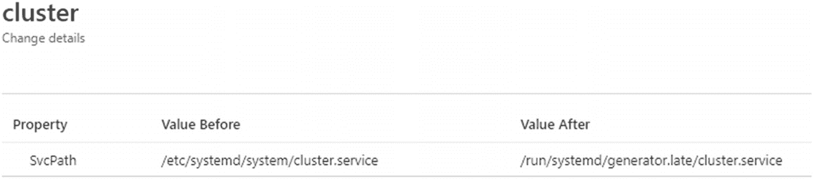

图 3-18

在 Linux 计算机上检测到的软件版本更改的详细视图

虽然更改跟踪对于重建单个计算机上发生的更改非常有用，但它的另一个作用是监视和评估在整个资产的正常情况下更改的总体速度和范围。然后，当异常数量的更改发生时，Azure Automation 的聚合监控功能可以检测到它们。

在单个计算机中检测到的更改被写入 Azure Log Analytics 中的 *ConfigurationChange* 表。如果查询检测到与正常更改量有较大差异，则表明环境中发生了值得调查的事情。

事实上，异常变化检测是一种非常有价值的安全监控技术。图 [3-19](#Fig19) 是这种情况下可能出现的 Microsoft Sentinel 概览页面的一个片段。如果你看到了这个，你就会知道在过去的 24 小时内经历了两次异常巨大的变化。调查意外的变化可能是不需要的过程正在发生并需要补救的第一个提示。

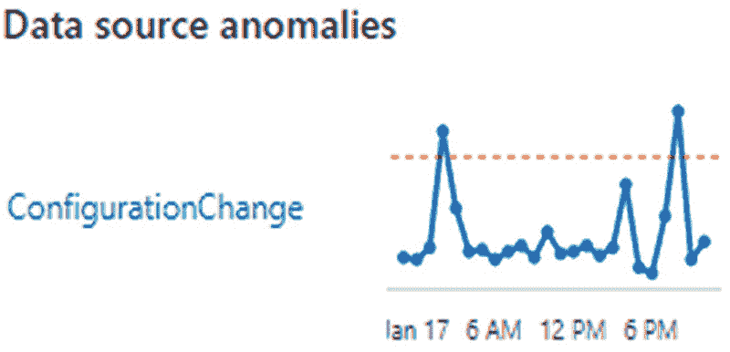

图 3-19

来自 Azure Sentinel overview blade 的数据源异常检测

## 摘要

在这一章中，你学习了 Azure Arc 的所有功能。您已经熟悉了 Azure Arc 中的监视和控制特性，并对它们的功能有了基本的了解。既然你受到了启发，让我们进入下一章，我们将深入如何规划、部署和支持 Azure Arc 服务器。