# 四、Azure Arc 服务器：入门

Azure Arc 代表了一个全新的概念，它有机地从云中出现。这一秘密成分标志着 Azure Arc 对云本质特征的自然倾向，如*广泛的网络接入*和*快速的弹性*。“云”系统自然会战胜不能持续适应的遗留和传统系统。考虑一下 Azure Arc 给你的组织带来的超大规模*资源池*的好处——将你的非 Azure 资源投射到 Azure Resource Manager (ARM)控制平面，在那里它们加入数十亿个管理良好的对象。

创建这个被投影的对象，一个 *Azure Arc 服务器*，并从中获取价值是本章的内容。本章介绍并深入探究 Azure Arc 服务器对象在 Azure 中的样子，以及它在 Windows 和 Linux 计算机上的代理足迹。在这一章中，我们集中在一次安装一个 Azure Arc 代理来进行测试和评估，在第[5](5.html)“Azure Arc 服务器:大规模使用”一章中，将会有关于在生产中部署 Azure Arc 代理的细节。

## 管理平台即服务

Azure Arc 是服务器管理功能的目标架构，因为它将管理任务移动到了一个成熟的超大规模云中。这些任务是什么——服务器可用性、配置、性能和安全性——自早期联网以来就没有改变过。发生变化的是管理任务的最佳交付位置。

在有*云*之前，有*内部*，大多数人把它叫做 LAN 和/或 WAN(局域网/广域网)。还有一个 VPN(虚拟专用网络)，这些以网络为中心的结构定义了管理和监控发生的画布。要监控的每个对象都在 LAN/WAN/VPN 边界内，因此管理工具也在那里。

快进到现代混合时代，物理位置通常与服务交付或消费无关。服务器管理任务的出现是很自然的，也是意料之中的，这些任务可以从云服务中“剥离”并交付，比留在内部更有效。可以将灾难恢复即服务(DRaaS)产品想象为受异地公共云保护的本地服务器。灾难恢复传统上需要大量昂贵的基础设施来构建热点站点，因此将灾难恢复剥离到云是经济驱动的早期行业趋势。

图 [4-1](#Fig1) 图片服务器管理功能如同冰山，大部分服务器管理负担转移到 Azure。庞大的全球 Azure 资源管理器是您使用 Azure Arc 的后端服务提供商。Azure Arc 代表了云经济学产生的新范式:无成本管理即服务(MaaS)。换句话说，Azure Arc 是微软作为免费平台服务提供的一个无限可扩展的管理工具框架。

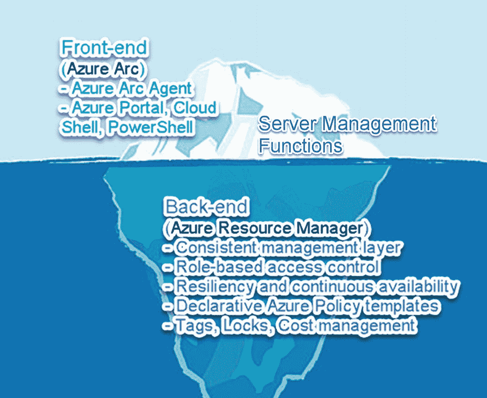

图 4-1

Azure Arc 将许多服务器管理功能移至 Azure 资源管理器

*云服务管理*可以从业务支持、供应和配置的角度以及可移植性和互操作性的角度进行描述。Azure Arc 允许您的服务器体验这些规模经济，通常只保留给云服务，即使它们不存在于云中！扪心自问:为什么不为您的服务器“植入”一套行之有效的管理、监控和安全最佳实践呢？当您可以减轻成本和维护负担时，为什么还要购买和维护任何遗留管理工具呢？

这是对投资 Azure Arc 进行服务器管理是否明智的最后一次“检验”:作为一种基于云的管理技术，Azure Arc 通过了托管服务的“相互协调”测试。该产品最根本的基础是消费者和服务提供商的“双赢”。微软赢了，因为通过使用 Azure Arc，你更有可能消费收费的微软服务，你赢了，因为 Azure Arc 降低了你的服务器的总拥有成本(TCO)。

## 什么是 Azure Arc 服务器？

在前端，Azure Arc 服务器是一台由 Azure 管理但在 Azure 外部运行的计算机。在后端，Azure Arc 服务器是 Azure 资源管理器(ARM)资源“类型”*Microsoft.HybridCompute/machines*的一个*机器*实例。

### Azure 资源管理器(ARM)资源类型

Azure Arc 服务器的混合本质是由独立的物理和逻辑实体组成的:

*   **物理位置:**运行在除 Azure cloud 之外的世界任何地方的物理或虚拟计算机

*   **虚拟位置:**“类型”的 Azure 资源*Microsoft.HybridCompute/machines*存在于特定的 Azure 订阅、资源组和位置中

相比之下，完全存在于 Azure 中的 Azure VM 具有以下分类:

*   **Azure VM:** 【类型】*微软的 Azure 资源。特定 Azure 订阅、资源组和位置中存在的计算/虚拟机器*

像 Azure 中的其他所有对象一样，Azure 虚拟机和 Azure Arc 服务器都是由资源类型、订阅、资源组和位置定义的 Azure 资源。分配给 Azure 虚拟机和 Azure Arc 计算机的标签在治理和计费方面的工作方式相同。

图 [4-2](#Fig2) 是正在运行的 Azure Arc 服务器(左边)和 Azure VM(右边)的 Azure 资源管理器(ARM)定义的并列 JSON 视图。这些常见的基础软件结构解释了为什么使用基于 Azure 的工具管理本地服务器是合理且高效的。

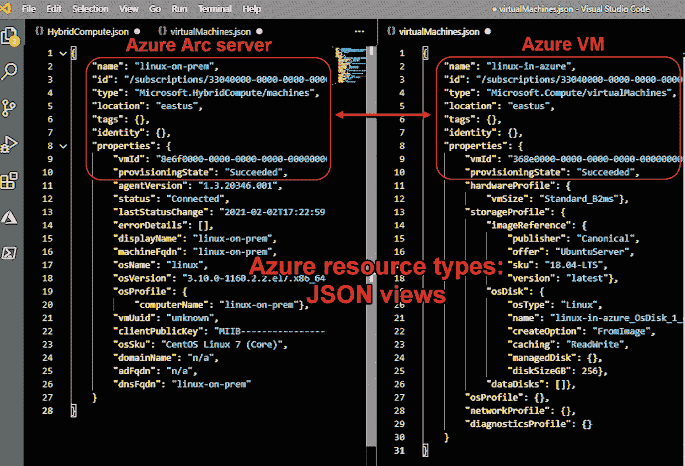

图 4-2

Visual Studio 代码中的并排 JSON 视图突出了 Azure Arc 服务器和 Azure VMs 的 ARM 通用性

Tip

使用 Azure PowerShell 通过 ARM 资源类型名称查询 Azure Arc 服务器或 Azure VMs 的列表:

`get-AzResource -ResourceType Microsoft.HybridCompute/machines`

`get-AzResource -ResourceType Microsoft.Compute/virtualMachines`

### Azure 门户中的 Azure Arc 服务器

Azure 门户( [`https://portal.azure.com`](https://portal.azure.com) )是 JSON 模板元素的图形化视图，这些模板元素定义了 Azure 订阅中的资源组。如图 [4-3](#Fig3) 所示，你可以在你的 Azure 资源组中的*导出模板*刀片检查你的 Azure 门户中资源组的内容。您的 Azure Arc 服务器将与所有其他 Azure 资源类型一起包含在您的资源组中。

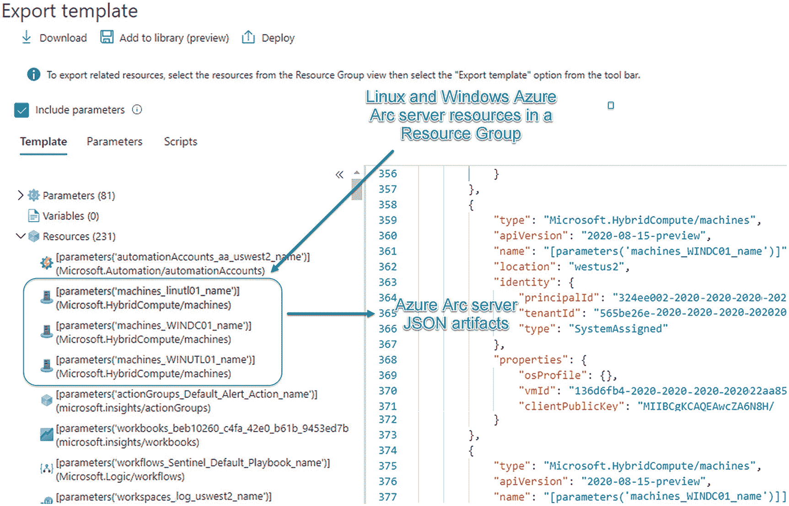

图 4-3

将整个资源组导出到 JSON 文档

当然，Azure 门户有一整套专用的 Azure Arc 视图，这些视图显示了 Azure Arc 基础设施资源，如服务器、Kubernetes 集群、SQL 服务器和 Azure Stack HCI 部署。图 [4-4](#Fig4) 显示了 Azure Arc 服务器页面，在这里可以找到您有权访问的所有订阅中的所有 Azure Arc 服务器。

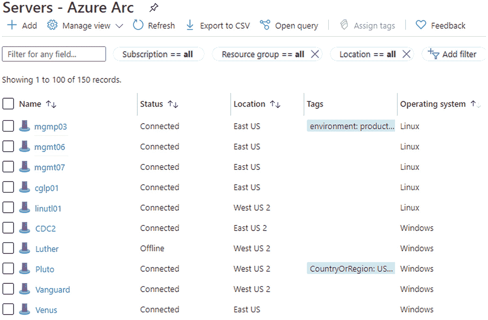

图 4-4

Azure 门户中的 Azure Arc 服务器

如图 [4-4](#Fig4) 中视图的列所示，您可以根据状态(连接或离线)、位置(创建 Azure Arc 服务器资源的 Azure 区域)、操作系统(Linux 或 Windows)以及您可能在创建时或之后选择性分配的标签等参数进行排序和过滤。

此时你应该明白的是，Azure Arc 服务器是 Azure 控制平面中的一个逻辑构造。部署 Azure Arc 服务器的实际技术过程是创建一个“类型”*Microsoft.HybridCompute/machines*的 Azure 资源记录。要使用交互方法装载 Azure Arc 服务器，您需要以下这些东西:

1.  有权创建 Azure Arc 资源的 Azure 订阅的登录凭据

2.  适合您的组织的 Azure 订阅中的资源组，用于包含 Azure Arc 服务器资源

3.  承载 Azure Arc 服务器对象的 Azure 区域(位置),该区域不必与资源组位于同一区域

### Azure Arc 服务器位置选择

在大多数情况下，当您装载 Azure Arc 服务器时，您选择的位置应该是地理上离您的机器位置最近的 Azure 区域。以下是选择要使用的区域时的一些注意事项:

*   静态数据存储在包含您指定的区域的 Azure geography 中，如果您有数据驻留需求，这也可能会影响您对区域的选择。

*   如果您的计算机连接的 Azure 区域受到中断的影响，连接的计算机不会受到影响，但是使用 Azure 的管理操作可能无法完成。

在发生区域性中断的情况下，如果您有多个支持地理冗余服务的位置，最好将每个位置的 Azure Arc 服务器连接到不同的 Azure 区域。

Tip

Azure Arc 支持的服务器在一个资源组中支持多达 5，000 个机器实例。对于非常大的部署，规划多个资源组。

## 注册 Azure 资源提供者

启用 Azure Arc 的服务器依赖于订阅中的以下 Azure 资源提供者来使用服务:

*   微软。混合计算

*   微软。猜测配置

如果它们尚未注册，您可以使用以下命令注册它们:

**Azure PowerShell**

```
Login-AzAccount
Set-AzContext -SubscriptionId [subscription you want to onboard]
Register-AzResourceProvider -ProviderNamespace Microsoft.HybridCompute
Register-AzResourceProvider -ProviderNamespace Microsoft.GuestConfiguration

```

**蓝色 CLI**

```
az account set --subscription "{Your Subscription Name}"
az provider register --namespace 'Microsoft.HybridCompute'
az provider register --namespace 'Microsoft.GuestConfiguration'

```

您也可以在 Azure 门户中注册资源提供者，方法是按照 Azure 资源提供者和类型链接上的**注册资源提供者 Azure 门户**部分中的步骤:

```
https://docs.microsoft.com/en-us/azure/azure-resource-manager/management/resource-providers-and-types#azure-portal

```

在你注册了两个指定的提供者之后，你的 Azure 订阅的*资源提供者*刀片应该如图 [4-5](#Fig5) 所示。

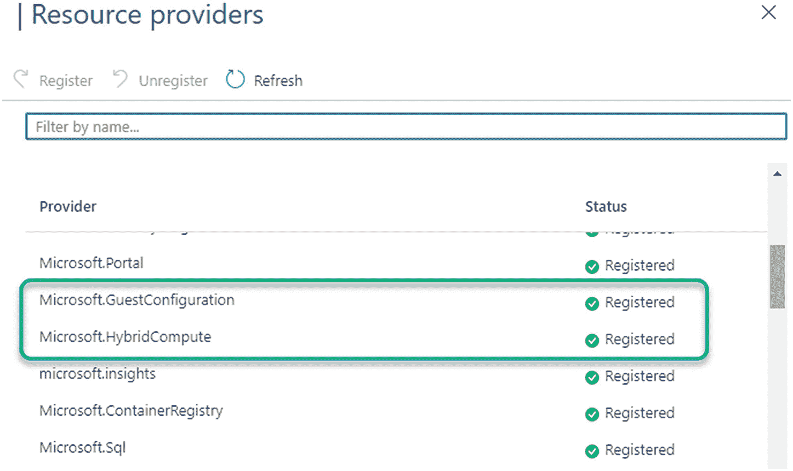

图 4-5

要在您的 Azure 订阅中注册的资源提供者，以创建支持 Azure Arc 的服务器

## 将 Azure Arc 连接到 Windows 和 Linux 服务器

安装 Azure Arc 代理可能是您需要安装的最后一个代理，因为通过 Azure Policy 和 Azure Arc，您可以管理您的混合计算机可能需要的所有当前和未来的管理和安全代理。“天蓝弧代理”被称为**天蓝连机** **代理**。

在安装时，Azure Connected Machine Agent 需要使用 Azure AD 进行身份验证，以验证新的 Azure Arc 服务器已被授权与您的 Azure 订阅相关联。有两种方法可以做到这一点:

*   **使用交互式脚本**手动添加服务器。这适用于小型部署和测试。每次安装时，您都可以使用您的个人用户凭据登录 Azure。*本章逐步介绍这种方法。*

*   **大规模添加服务器**。此方法使用您在 Azure AD 中创建的 Azure 应用注册的身份和客户端密码(应用密码)。通过您喜欢的任何脚本或管理工具运行带开关的代理安装。*在第* [*5*](5.html) *章“Azure Arc 服务器:大规模使用”中介绍*

### 先决条件:使用交互式脚本添加 Azure Arc 服务器(Windows 和 Linux 计算机)

在尝试装载 Azure Arc 服务器之前，请注意以下参数:

*   需要服务器的本地管理员或 root 权限。

*   搭载 Azure Arc 服务器所需的最低内置 Azure 订阅安全角色是**Azure Connected Machine on boarding**。

*   请确保您已经对所有涉及的 Azure 订阅执行了本章“注册 Azure 资源提供者”一节中涵盖的过程。

*   确认要加入的服务器可以通过 TCP 443 端口访问互联网的以下 URL:
    *   management.azure.com

    *   login.windows.net

    *   login.microsoftonline.com

    *   dc.services.visualstudio.com

    *   agentserviceapi.azure-automation.net

    *   *-agent service-prod-1 . azure-automation . net

    *   *.guestconfiguration.azure.com

    *   *.his.arc.azure.com

    *   *.blob.core.windows.net

    *   azgn*.servicebus.windows.net

    *   pas.windows.net

### 逐步:使用交互式脚本添加 Azure Arc Windows 服务器

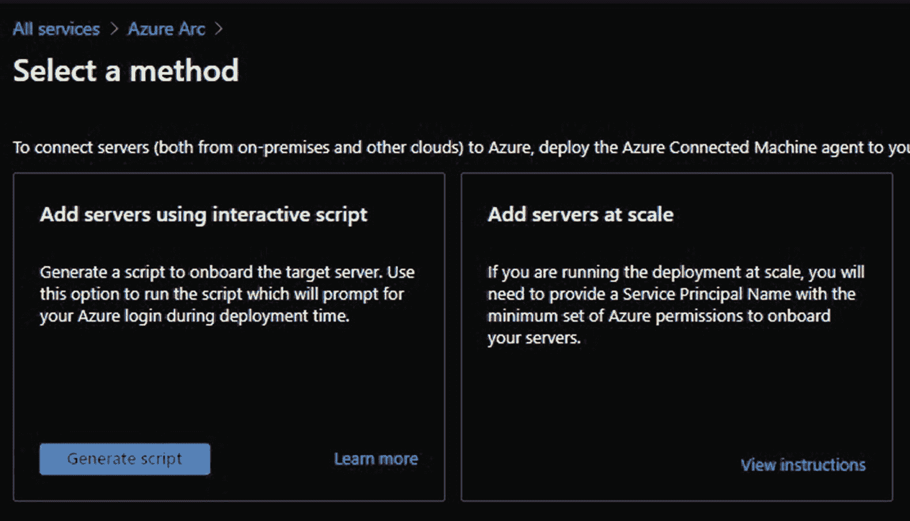

图 4-6

将内部和其他云中的服务器连接到 Azure 有两种主要方式

1.  在你的 Azure 门户中，点击**新建**并选择 **Azure Arc for servers** ，然后点击**创建**。

2.  在图 [4-6](#Fig6) 中的选择方法页，点击**生成脚本**。

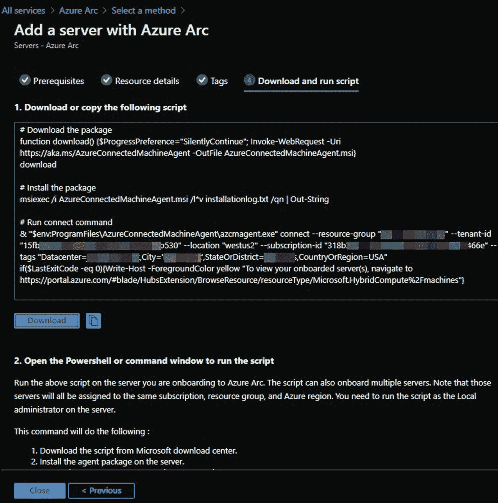

图 4-7

Azure 门户将自动生成一个自定义脚本，将计算机装载到 Azure Arc 上

1.  输入适合您环境的资源详细信息和标签，然后点击**下载并运行脚本**以到达如图 [4-7](#Fig7) 所示的刀片。

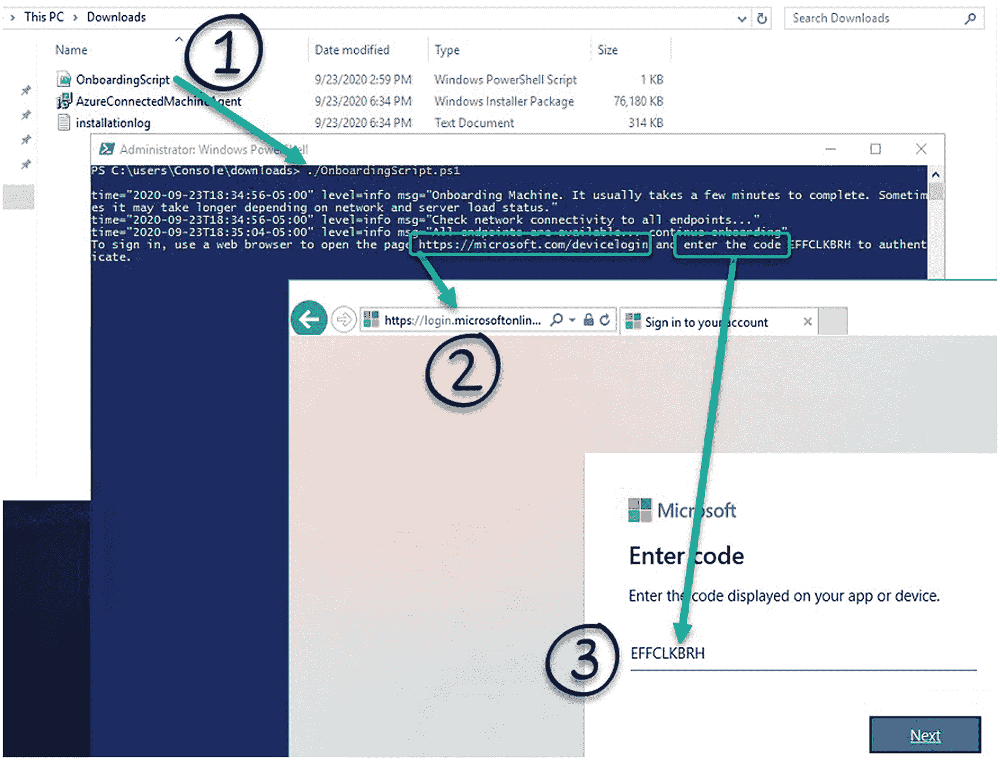

图 4-8

使用 onboarding 脚本手动安装 Azure Arc 代理的三个步骤

1.  下载脚本(OnboardingScript.ps1)并将其复制到要添加到 Azure Arc 的服务器。
    1.  在提升的 PowerShell 会话中运行脚本。注意脚本输出的代码。

    2.  打开网页浏览器进入 [`https://microsoft.com/devicelogin`](https://microsoft.com/devicelogin) 。

    3.  在您的租户中使用 Azure AD 凭据登录，并输入如图 [4-8](#Fig8) 所示的代码。

请注意图 [4-8](#Fig8) 中的脚本会将**AzureConnectedMachineAgent**Windows Installer 包下载到您执行脚本的文件夹中。日志文件 **installationlog** 也在同一位置创建。(在给定代码过期之前，您有有限的时间使用该代码完成登录。)

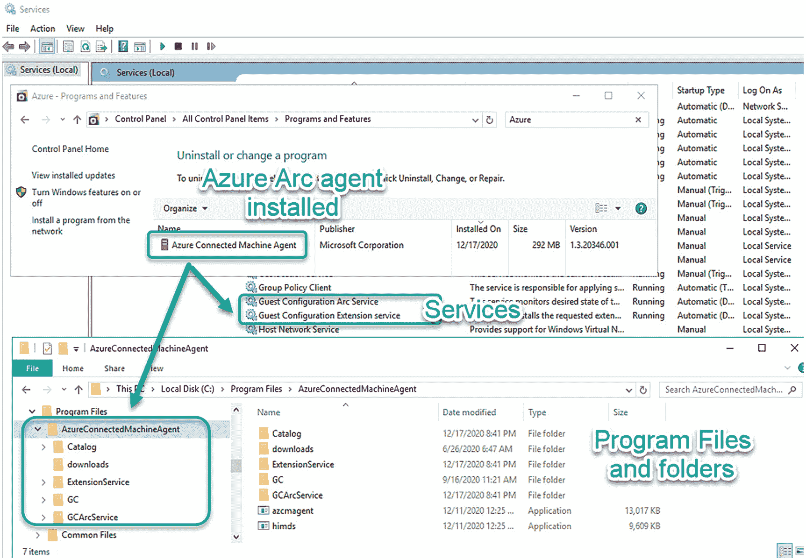

图 4-9

Azure Connected Machine Agent 文件夹和服务的拆卸

1.  安装代理后，您会发现**Azure Connected Machine Agent**列在添加/删除程序中，如图 [4-9](#Fig9) 所示。
    1.  代理文件位于 C:\ Program Files \ AzureConnectedMachineAgent。

    2.  创建了两个 Windows 服务:
        1.  **客户配置 Arc 服务** (GCArcService):该服务监控机器的期望状态。

        2.  **客户配置扩展服务** (ExtensionService):该服务安装请求的扩展。

1.  安装 Azure Arc 代理后，您可以打开您的 Azure 门户来查看新的混合计算机对象:

```
https://portal.azure.com/#blade/HubsExtension/BrowseResource/resourceType/Microsoft.HybridCompute%2Fmachines

```

图 [4-10](#Fig10) 显示了添加 Azure Arc 服务器后你可能很快会看到什么。如果您在创建时为 Azure Arc 服务器指定了标签，您会在 Overview blade 上看到它们。您也可以通过点击**更改**链接手动添加标签，或者在 Azure Arc 服务器生命周期中的任何时候以编程方式添加标签。我们将在第 6 章[的“混合服务器监控解决方案”中讨论标签的高级使用](6.html)

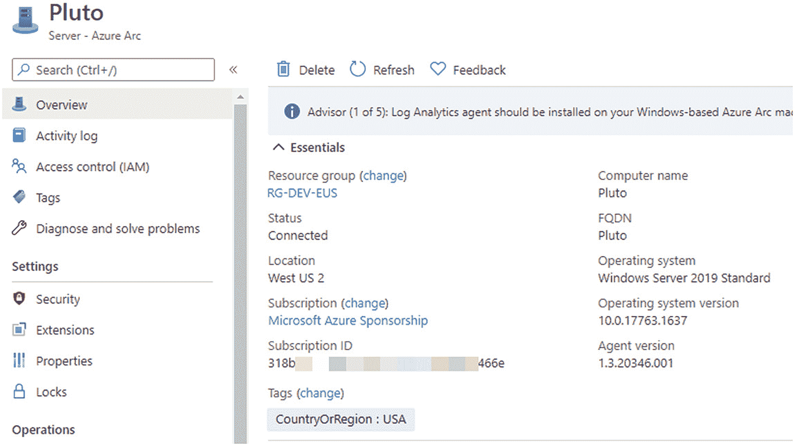

图 4-10

Windows Azure Arc 服务器的概述

### 逐步:使用交互式脚本添加 Azure Arc Linux 服务器

使用手动方法连接 Linux 服务器的过程与连接 Windows 服务器的过程非常相似。您必须遵守本章前面的“先决条件:使用交互式脚本添加 Azure Arc 服务器(Windows 和 Linux 计算机)”一节。

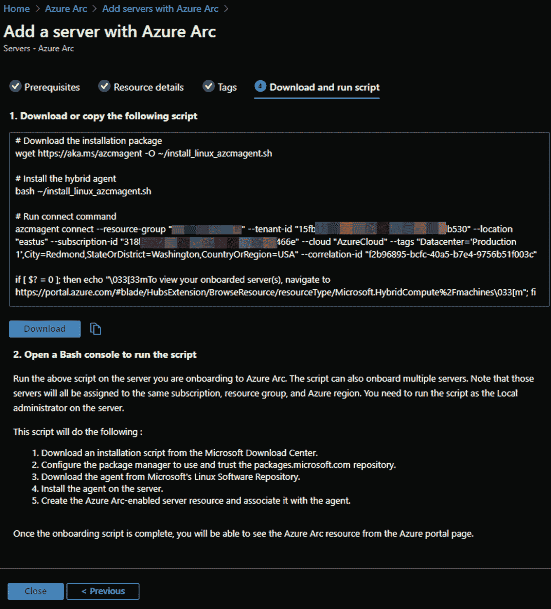

图 4-11

自动生成的定制 Bash 脚本将 Linux 计算机装载到 Azure Arc 上

1.  在你的 Azure 门户中，点击**新建**并选择 **Azure Arc for servers** ，然后点击**创建**。

2.  在选择方法页(之前参见图 [4-6](#Fig6) ，点击**生成脚本**。

3.  输入适合您环境的资源详细信息和标签，然后点击**下载并运行脚本**以到达如图 [4-11](#Fig11) 所示的刀片。

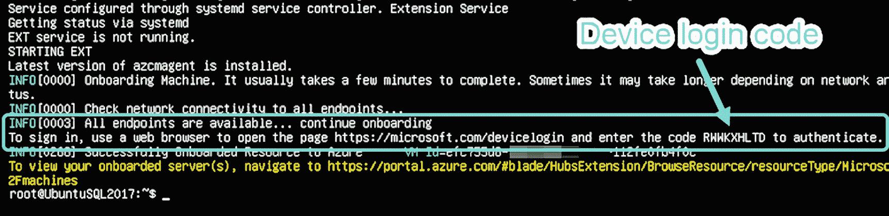

图 4-12

手动将 Linux 计算机加入 Azure Arc

1.  下载脚本(OnboardingScript.sh)并将其复制到要添加到 Azure Arc 的 Linux 计算机上。(使用 WinSCP 等任何方便的工具；在 [`https://winscp.net`](https://winscp.net) 下载。)

    ```
    sudo chmod 700 OnboardingScript.sh

    ```

    ```
    sudo ./OnboardingScript.sh

    ```

    1.  通过运行以下命令启用要执行的脚本:

    1.  使用提升的权限运行脚本，如下所示:

    1.  在脚本运行接近完成时，注意脚本打印出一个**设备登录代码**，如图 [4-12](#Fig12) 所示。

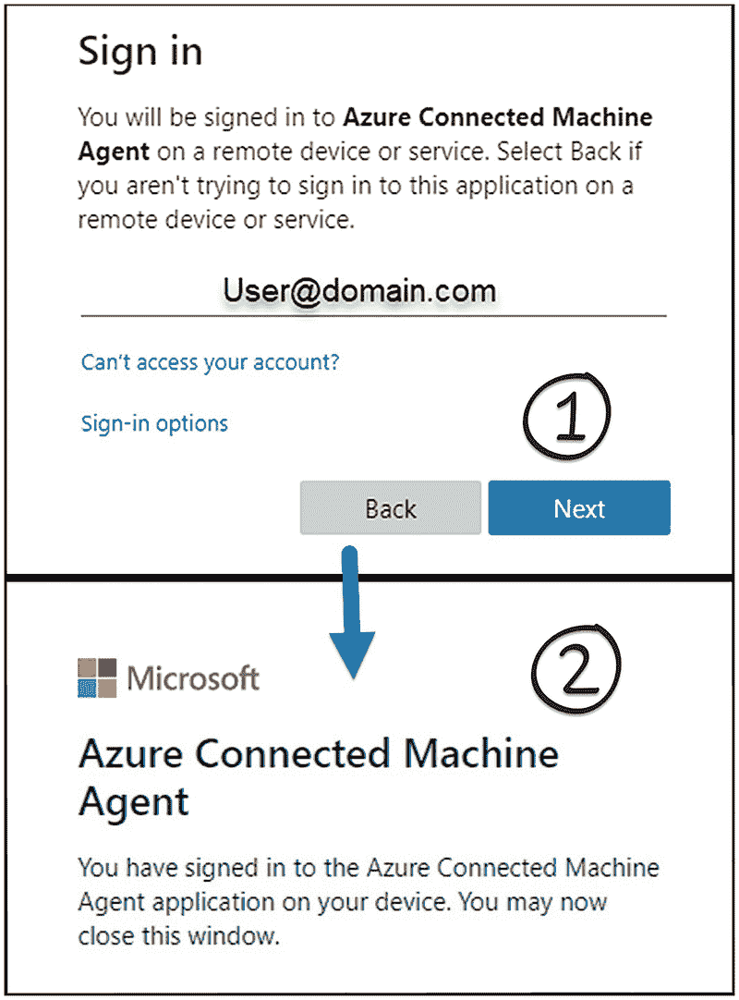

图 4-13

Azure Connected Machine 代理的设备登录

1.  打开网页浏览器进入 [`https://microsoft.com/devicelogin`](https://microsoft.com/devicelogin) 。web 浏览器会话可以发生在任何计算机上；它不需要从板载的 Linux 计算机上运行。

2.  在您的租户中使用 Azure AD 凭据登录，如图 [4-13](#Fig13) 的上部所示。

将出现一个类似图 [4-8](#Fig8) 中 Windows 代理启动时看到的输入代码页。输入密码后，您会收到一条确认信息，如图 [4-13](#Fig13) 的下部所示。当您看到这个消息时，脚本将会提示您查看您的板载服务器；导航到

[T2`https://portal.azure.com/#blade/HubsExtension/BrowseResource/resourceType/Microsoft.HybridCompute%2Fmachines`](https://portal.azure.com/%2523blade/HubsExtension/BrowseResource/resourceType/Microsoft.HybridCompute%25252Fmachines)

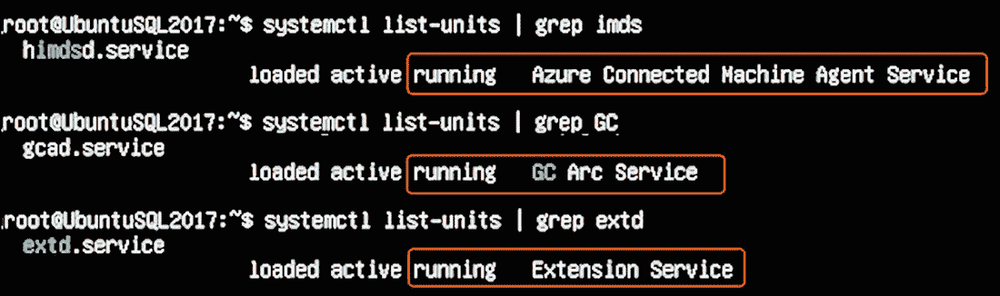

图 4-14

确认所有 Azure Arc 守护程序正在运行

1.  安装代理后，将应用以下配置更改:
    1.  代理文件位于
        1.  /var/opt/azcmagent(支持文件)

        2.  /var/lib/GuestConfig。(来自 Azure 的应用策略)

        3.  /opt/azcmagent(hima dsd . service files)

        4.  /opt/GC_Ext，(来宾配置代理文件和下载的扩展文件)

        5.  /opt/DSC(常见的 DSC 工件)

    2.  创建了三个 Linux 守护进程:
        1.  **Azure Connected Machine Agent 服务** (himdsd.service):该服务实现了 Azure 实例元数据服务(IMDS)来管理与 Azure 的连接以及连接机器的 Azure Arc 身份。

        2.  **GC Arc 服务** (gcad.service):监控机器的期望状态配置。

        3.  **扩展服务** (extd.service):针对机器安装所需的扩展。

2.  您可以使用该命令检查服务守护程序是否正在运行，如图 [4-14](#Fig14) :

    ```
    systemctl -list-units | grep <service name>

    ```

    所示

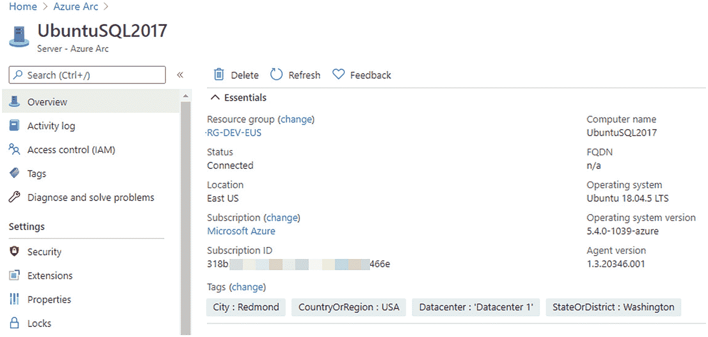

图 4-15

刚加入后的 Linux Azure Arc 服务器概述

1.  安装 Azure Arc 代理后，您可以在 Azure 门户中查看新的混合计算机对象，如图 [4-15](#Fig15) 所示。

## 管理和使用 Azure VM 扩展

Azure 虚拟机(VM)扩展是在 Azure VMs 上提供部署后配置和自动化任务的小型应用。例如，如果虚拟机需要安装软件或在其中运行脚本，可以使用 VM 扩展来代替传统的配置管理工具。

扩展本质上是一个“带外”(OOB)管理通信通道，使用期望状态配置(DSC)技术创建，可与 Azure 虚拟机和 Azure Arc 服务器同等工作。一个诞生于超大规模 Azure 云中的通信通道，现在通过 Azure Arc 扩展到 Azure 之外的服务器。

在您的计算机管理任务中尽可能使用扩展是一种力量倍增器。传统上，在云和内部环境中跨 Linux 和 Windows 服务器部署和审核软件需要多种管理工具。现在，有了支持 Azure Arc 的服务器和 Azure 虚拟机，混合机器生命周期的管理得到了简化。

每当在 Azure VM 或 Azure Arc 服务器中安装一个扩展时，就会在 Azure 资源组中创建一个隐藏资源类型`—`，它是计算机对象`—`的子对象，如下所示:

*   Azure Arc 服务器扩展资源类型:

**Microsoft.HybridCompute/machines/extensions**

*   Azure VM 扩展资源类型:

**微软。计算/虚拟机器/扩展**

扩展对象表示该计算机上该扩展的所需状态配置。在选择了 *Show hidden types* 选项的情况下查看资源组中的所有资源将会显示您已经部署的扩展。扩展补充和扩展了 Azure 资源管理器框架，基础设施运行在该框架上，这实际上是服务管理功能向平台服务的教科书式迁移。

在图 [4-16](#Fig16) 中，您可以看到微软的新方法——即跨平台配置扩展`—`如何实现跨您的资产的同质管理。

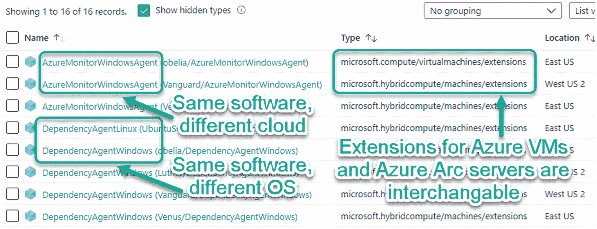

图 4-16

扩展是资源组中隐藏的资源类型

就业务价值而言，该模型意味着您可以通过一致的控制点和可重复的流程来加速计算机管理中固有的添加/删除/更改流程。有几种方法可以自动地大规模利用扩展；我们将在接下来讨论这些。

### Azure VM 扩展的用例

以下是一些可用的 Azure VM 扩展的具体用例，它们为支持 Azure Arc 的服务器提供了关键优势:

*   **DSC VM 扩展:**使用 Azure Automation 状态配置集中存储配置，维护 Azure Arc 服务器的期望状态。例如，在计算机上实施标准功能部署，如 IIS 或 DNS 服务。

*   **日志分析代理 VM 扩展:**使用 Azure Monitor 和 Microsoft Sentinel 中的日志收集日志数据进行分析。这有助于对不同来源的数据进行复杂的分析。

*   **Azure Monitor for VMs:** 分析您的 Windows 和 Linux 虚拟机的性能，并监控它们的进程以及对其他资源和外部进程的依赖。这是通过启用日志分析代理和依赖关系代理虚拟机扩展来实现的。

*   **自定义脚本扩展:**在混合连接的机器上下载并执行脚本。该扩展对于部署后配置、软件安装或任何其他配置或管理任务非常有用。考虑在所有服务器创建后立即安装反恶意软件或其他安全代理。

您可以通过以下链接了解每个扩展的详细信息，并找到当前可用扩展的完整列表:

*   **发现 Windows 虚拟机扩展**

*   **发现 Linux 的虚拟机扩展**

```
https://docs.microsoft.com/en-us/azure/virtual-machines/extensions/features-windows

```

```
https://docs.microsoft.com/en-us/azure/virtual-machines/extensions/features-linux

```

### 管理 Azure VM 扩展的方法

即使它们影响许多地方的机器，扩展只存在于 Azure 控制平面中，所以它们很容易使用，并且可以在任何可以访问 Azure 的地方执行。有五种方法可用于部署和管理 Azure VM 扩展，所有方法都适用于所有 Azure VM 和 Azure Arc 服务器，包括 Windows 和 Linux。这些方法是 Azure 门户、Azure PowerShell、Azure CLI、ARM 模板和 Azure 策略。

#### 方法 Azure 门户中的扩展

在单个 Azure Arc 服务器上使用扩展的一个简单快捷的方法是在 Azure 门户中 Azure Arc 服务器页面的扩展刀片上。图 [4-17](#Fig17) 显示了一个使用 VM 扩展连接到 Azure Log Analytics 的典型 Azure Arc 服务器。

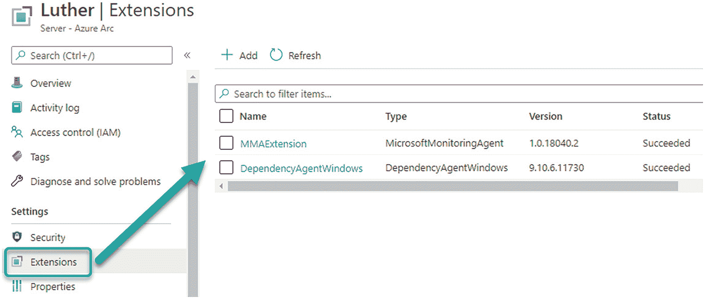

图 4-17

添加到 Azure Arc 服务器的 Azure VM 扩展

为了帮助你理解 Azure Arc 和 Azure VM 扩展在 Azure Arc 服务器上的净效果，请看图 [4-18](#Fig18) ，图 [4-17](#Fig17) 中 Azure Arc 服务器“Luther”内部的控制面板➤程序和功能小程序。

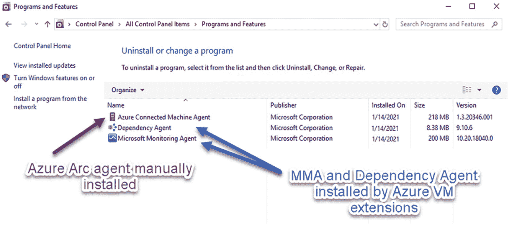

图 4-18

扩展是资源组中隐藏的资源类型

图 [4-18](#Fig18) 展示了 Azure VM 扩展(添加在 Azure 资源管理器控制平面中)如何影响存在于 Azure 之外的 Azure Arc 服务器。这台服务器的所有者需要安装的唯一软件是 Azure Arc 代理( *Azure Connected Machine 代理*)。随后，微软管理代理(MMA)及其依赖代理的扩展也安装了这些软件——安装工作由 Azure 资源管理器支持的 Azure Arc 自动完成。

导航到 Azure Arc 服务器的扩展页面的原因包括仔细检查特定的扩展是否按预期安装，或者手动安装或卸载扩展。如果点击计算机扩展页面上的**添加**按钮(如图 [4-17](#Fig17) ，会提供一个可供手动安装的扩展列表，如图 [4-19](#Fig19) 。

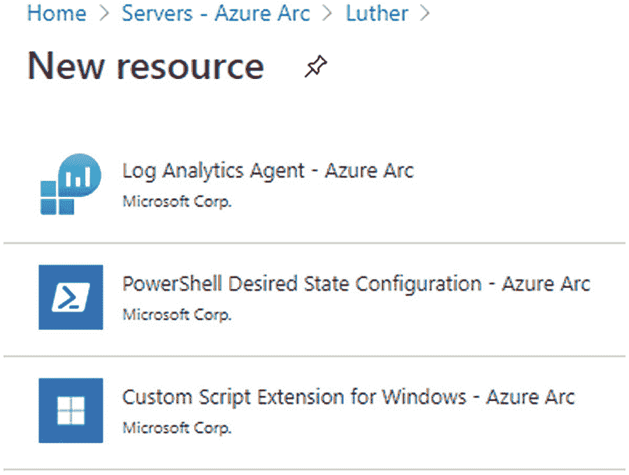

图 4-19

从 Azure 门户在 Azure Arc 服务器上手动安装新的 Azure VM 扩展

Tip

Azure 门户只公开了可用 Azure VM 扩展的子集，这些扩展也可以与 Azure Arc 服务器一起工作。其他还有 *Azure Key Vault VM 扩展、基于扩展的用户混合 Runbook Worker、*和 *Azure Defender 集成扫描器*可以通过 ARM 模板安装。

或者，点击一个已安装扩展的名称(同样在图 [4-17](#Fig17) 中)将打开该扩展的详细信息页面，带有一个**卸载**按钮，如图 [4-20](#Fig20) 所示。如果您在正确安装特定扩展时遇到问题，您可以从这里卸载失败的扩展，并让 Azure Arc 再次尝试添加该扩展。

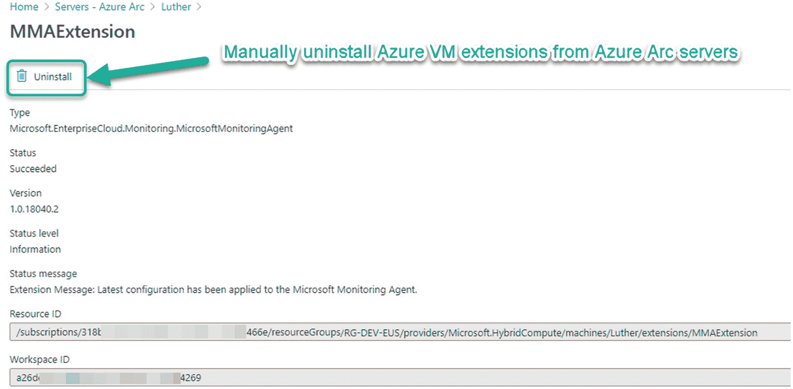

图 4-20

每个已安装的 Azure VM 扩展在其详细信息页面上都有一个卸载按钮

#### 方法 2:使用 Azure PowerShell 的扩展

Azure PowerShell 命令可以从任何安装了 Azure PowerShell 的计算机上运行，也可以从 Azure 门户中的 Azure Cloud Shell 上运行。无论哪种情况，都需要添加 *Az。使用以下 cmdlet 将 Machine* 模块连接到 PowerShell 实例:

```
Install-Module -Name Az.ConnectedMachine

```

将该模块一次性安装到 PowerShell 或 Cloud Shell 实例后，您可以运行以下 PowerShell 命令来列出、添加和删除扩展:

```
Get-AzConnectedMachineExtension -ResourceGroupName <rgname> -MachineName <machineName>

New-AzConnectedMachineExtension -Name <extensionName> -ResourceGroupName <rgname> -MachineName <machineName> -Location <location> -Publisher <publisher> -ExtensionType <extensionType> -Settings <settings>

Remove-AzConnectedMachineExtension -MachineName <machineName> ​-ResourceGroupName <rgname> -Name <extensionName>

```

图 [4-21](#Fig21) 演示了在 Azure 云 Shell 中使用 PowerShell 来列出 Azure Arc 服务器上已安装的 Azure VM 扩展。请注意，这与图 [4-17](#Fig17) 中 Azure 门户中看到的数据相同。

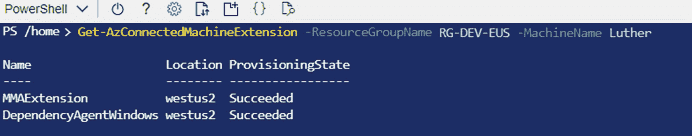

图 4-21

列出安装在带有 Azure PowerShell 的 Windows Azure Arc 服务器中的 Azure VM 扩展

#### 方法 3:使用 Azure CLI 的扩展

Azure CLI 可安装在 Windows、macOS 和 Linux 环境中。也可以在 Docker 容器和 Azure 云壳中运行。在所有场景中，就像 PowerShell 的情况一样，在 Azure Arc 服务器上使用 Azure CLI 之前，需要安装一个模块。命令是

```
az extension add --name connectedmachine

```

将该模块一次性安装到您的 Azure CLI 或云外壳实例后，您可以运行如下命令来列出、添加和删除扩展:

```
az connectedmachine extension list --machine-name "myMachineName" --resource-group "myResourceGroup"

az connectedmachine extension create --machine-name "myMachineName" --name "OmsAgentForLinux or MicrosoftMonitoringAgent" --location "eastus" --settings '{\"workspaceId\":\"myWorkspaceId\"}' --protected-settings '{\"workspaceKey\":\"myWorkspaceKey\"}' --resource-group "myResourceGroup" --type-handler-version "1.13" --type "OmsAgentForLinux or MicrosoftMonitoringAgent" --publisher "Microsoft.EnterpriseCloud.Monitoring"

az connectedmachine extension delete --machine-name "myMachineName" --name "OmsAgentForLinux" --resource-group "myResourceGroup"

```

如果你没有 Azure CLI 的本地安装，在 Azure Cloud Shell Bash 环境中运行这些命令的快捷方式如图 [4-22](#Fig22) 所示。

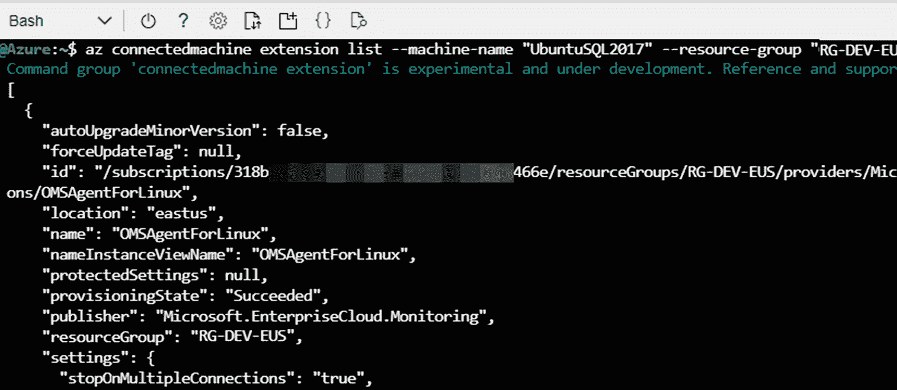

图 4-22

使用 Azure CLI 列出安装在 Linux Azure Arc 服务器上的 Azure VM 扩展

#### 方法 4:作为 ARM 模板的扩展

当您为新的 Azure Arc 服务器使用基于模板的部署和供应工具时，这是一个值得考虑的好方法。Microsoft 已在此链接中发布了模板文件和参数文件，并提供了扩展的示例值，如下所示:

[T2`https://docs.microsoft.com/en-us/azure/azure-arc/servers/manage-vm-extensions`](https://docs.microsoft.com/en-us/azure/azure-arc/servers/manage-vm-extensions)

适用于 Windows 和 Linux Azure Arc 计算机的 ARM 模板可用于以下扩展:

*   日志分析虚拟机扩展

*   自定义脚本扩展

*   PowerShell DSC 扩展

*   依赖代理扩展

*   Azure Key Vault 虚拟机扩展

*   Microsoft Defender for Cloud 集成漏洞扫描器

*   Azure Automation 混合 Runbook Worker 扩展

#### 方法 5:使用 Azure 策略部署扩展

虽然列在最后，但这是管理扩展的最佳方法，因为使用 Azure Policy 可以在一个管理操作中实现部署、合规性和云规模。Azure 策略适用于新的和现有的计算机。尽管之前使用扩展的任何方法都有其用例，但 Azure Policy 是最有可能将 Azure VM 扩展部署到 Azure Arc 服务器的方法。

得益于 Azure Arc，Azure 策略和捆绑策略集的*计划*可以应用于全球范围的异构计算机。Azure Policy 的内置合规性和补救功能是实现任何给定扩展的技术目标的路线图和工具集。

例如，使用这种方法，您可以将内置的 Azure Policy*Deploy Log Analytics agent 分配给 Linux* 或 *Windows Azure Arc machines* (见图 [4-23](#Fig23) )来审计启用 Arc 的服务器是否安装了日志分析代理。如果代理未安装，该策略可以创建预定义的补救任务，以通过 Azure 资源部署作业自动安装代理。

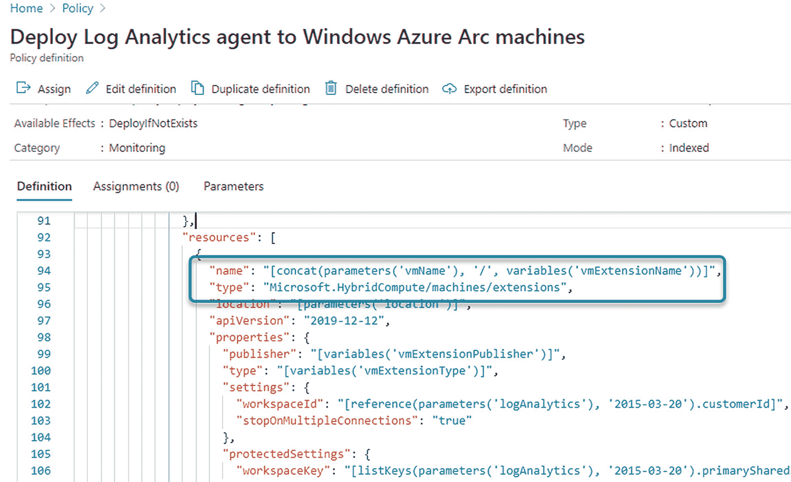

图 4-23

将日志分析代理部署到 Windows Azure Arc 计算机的内置 Azure 策略

值得注意的是，Azure Policy 通过查看适当的 Azure VM 扩展是否成功安装在 Azure Arc 服务器对象上来间接进行检查，而不是通过与计算机本身进行交互。考虑在 Azure Arc 的架构中，所需配置的成功状态的证明被委托给一个较低且高度分布式的级别——混合计算机本身上的 DSC 代理。这有效地让 Azure Resource Manager 在评估策略合规性时只承担检查状态值的轻量级任务。

Microsoft 建议使用 Azure 策略安装用于 Windows 或 Linux 的日志分析代理。我们将在第 [6](6.html) 章“混合服务器监控解决方案”中详细介绍这种方法

## 摘要

在这一章中，你深入地学习了什么是 Azure Arc 服务器，并了解了手动部署和扩展管理的概念。您还了解了 Azure Arc 服务器如何通过 Azure Resource Manager 与 Azure 控制平面进行交互。现在你已经理解了使用 Azure Arc 服务器的基础，在下一章，你将学习如何大规模部署和管理 Azure Arc 服务器。我们还将介绍更高级的 Azure Arc 特性，如标签和仪表板，以及在所有场景中对 Azure Arc 服务器进行故障排除。