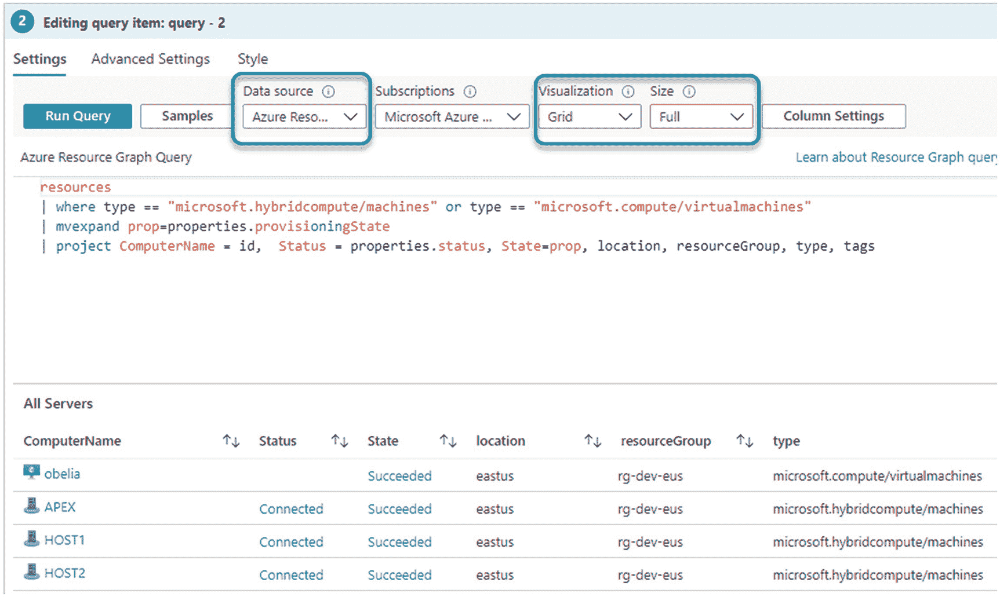

# 五、Azure Arc 服务器：大规模使用

当您使用 Azure Arc 来管理可能不存在于云中的本地服务器时，您可以有效地将*云服务管理*的基本特征扩展到非云资源。这意味着，从*业务支持*、*供应/配置*和*可移植性/互操作性*的角度来看，您的所有服务器都可以分享云消费者享受的规模经济优势。本章将帮助你在生产中使用 Azure Arc，从这些角度实现最大的好处。

第 4 章“Azure Arc 服务器:入门”介绍了一次安装一个 Azure Arc 代理，以便用交互方法进行测试和评估，而本章继续使用*服务主体*大规模部署 Azure Arc 服务器。第 4 章[还包括了 Azure VM 扩展如何与 Azure Arc 服务器协同工作来执行部署后配置和自动化任务的细节，所有这些都同样适用于大规模使用 Azure Arc 服务器的扩展。](4.html)

本章通过讲述如何在 Azure Arc 服务器上使用*标签*以及如何创作 Azure Monitor *工作簿*来增加你的 Azure Arc 技能，这些工作簿可以作为你的混合资产中所有服务器的仪表板。最后，我们总结了在 Windows 和 Linux 服务器上使用 Azure Arc 的一般故障排除技巧。

## 为入职创建服务主体

要将非 Azure 计算机作为启用 Azure Arc 的服务器连接到 Azure，您可以使用 Azure Active Directory 服务主体，而不是使用特权用户身份来交互连接计算机，就像我们在第 [4](4.html) 章“Azure Arc 服务器:入门”中所做的那样使用这种方法，具有提升权限的管理员或用户需要登录(或使用 PowerShell remoting)每台要管理的计算机，并以交互方式连接到服务器。

回想一下，安装 Azure Arc 代理需要安装程序对 Azure 订阅具有写访问权限，以便创建特定 Azure 订阅、资源组和位置中存在的“类型”*Microsoft.HybridCompute/machines*的 Azure 资源管理器(ARM)资源。安装程序可以是人，也可以是安全主体而不是人。在大规模应用中，您需要一个不需要人工参与的流程，您需要一个可以通过自动化或脚本化轻松无限重复的流程。

一个**服务主体**是一个特殊的有限管理身份(一个“Azure 服务帐户”)，它被授予使用 **azcmagent** 命令将机器连接到 Azure 所需的最低权限。这比使用像*全局管理员*这样的特权更高的帐户更安全，并且符合微软访问控制安全最佳实践。服务主体在入职和离职期间使用；它不用于任何其他目的。*Azure Connected Machine on boarding*是一个预定义的 Azure 访问角色，足以搭载 Azure Arc 服务器。

安装和配置 Connected Machine (Azure Arc)代理的安装方法确实要求您使用的自动化方法(如通过编写脚本)在要注册的目标计算机上具有提升的权限。在 Linux 上，使用 root 帐户；在 Windows 上，作为本地管理员组的成员。

### 使用 PowerShell 创建服务主体

使用 Azure PowerShell 创建您的服务主体非常简单；以下是要输入的命令:

```
$sp = New-AzADServicePrincipal -DisplayName "Arc-for-servers" -Role "Azure Connected Machine Onboarding"
$sp
$credential = New-Object pscredential -ArgumentList "temp", $sp.Secret
$credential.GetNetworkCredential().password

```

图 [5-1](#Fig1) 展示了它在 Azure Cloud Shell 中运行的样子。您正在使用这些命令执行三个操作:


图 5-1

使用 PowerShell 创建 Azure Arc onboarding 服务主体

1.  创建名为 *Arc-for-servers* 的企业应用

2.  在你的 Azure 订阅中为应用分配 Azure Connecting Machine on boarding 角色

3.  创建仅可见一次的秘密密码

运行完这些命令后，将结果复制并粘贴到要保存的文件中，这一点非常重要。稍后您将需要*应用 Id* 和*密码*来编辑用于大规模入职的脚本。

### 使用 Azure 门户创建服务主体

如果您愿意，可以使用 Azure 门户创建您的服务主体；在此链接的**向 Azure AD 注册应用并创建服务主体**和**向应用分配角色**部分中有详细步骤:

[T2`https://docs.microsoft.com/en-us/azure/active-directory/develop/howto-create-service-principal-portal`](https://docs.microsoft.com/en-us/azure/active-directory/develop/howto-create-service-principal-portal)

使用与 PowerShell 演示相同的设置，将应用命名为“Arc-for-servers”，创建一个新的客户端密码，并在您的 Azure 订阅中为应用分配角色*Azure Connected Machine on boarding*。记下如图 [5-2](#Fig2) 所示的应用(客户端)ID，并保留为我们接下来将创建的入职脚本创建的密码。


图 5-2

使用 Azure 门户创建 Azure Arc onboarding 服务主体

## 将 Azure Arc 大规模连接到 Windows 服务器

创建了 Azure AD 服务主体，分配了 Azure 订阅权限，并且有了服务主体密码，您就可以使用脚本向 Azure 添加多个服务器了。当然，第[4](4.html)“Azure Arc 服务器:入门”一章中关于交互式入职的先决条件的所有内容也适用于大规模入职。特别要确保*微软。HybridCompute* 和*微软。GuestConfiguration* Azure 资源提供商已在您的 Azure 订阅中注册。

### 循序渐进:大规模添加 Azure Arc Windows 服务器


图 5-3

开始体验大规模板载服务器

1.  在你的 Azure 门户中，点击**新建**并选择 **Azure Arc for servers** ，然后点击**创建**。

2.  在图 [5-3](#Fig3) 中的选择方法页，在**添加多个服务器**下，点击**生成脚本**。


图 5-4

具有 Azure Connected Machine on boarding 角色的应用注册已列出，以供选择进行身份验证

1.  阅读先决条件页面，然后单击**下一步:资源详细信息**。

2.  输入适合您的环境的资源详细信息，然后单击 **Next: Authentication** 。

3.  如图 [5-4](#Fig4) 所示，您之前创建的服务主体可供选择；然后点击**下一步:标签**。

如图 [5-5](#Fig5) 所示，资源*标签*可以选择性地与该脚本上的 Azure Arc 服务器相关联。


图 5-5

可选地为 Azure Arc 服务器分配标签。以后可以随时添加或更改标签


图 5-6

大规模入职脚本可供下载、编辑以添加密码，并在测试服务器上运行

1.  输入需要的标签后，点击**下一步:下载并运行脚本**，进入如图 [5-6](#Fig6) 所示的下载脚本页面。

您也可以选择使用以下脚本格式手动创作入职脚本:

```
# OnboardingScript.ps1
# --------------------

# Download the package
function download() {$ProgressPreference="SilentlyContinue"; Invoke-WebRequest -Uri https://aka.ms/AzureConnectedMachineAgent -OutFile AzureConnectedMachineAgent.msi}
download

# Install the package
msiexec /i AzureConnectedMachineAgent.msi /l*v installationlog.txt /qn | Out-String

# Run connect command

& "$env:ProgramFiles\AzureConnectedMachineAgent\azcmagent.exe" connect `
  --service-principal-id "{serviceprincipalAppID}" `
  --service-principal-secret "{serviceprincipalPassword}" `
  --resource-group "{ResourceGroupName}" `
  --tenant-id "{tenantID}" `
  --location "{resourceLocation}" `
  --subscription-id "{subscriptionID}"

```

Tips on running OnboardingScript.ps1: (applies to Windows and Linux)

1.  该脚本可以装载在多台服务器上。Azure Arc 服务器将被分配到相同的订阅、资源组和 Azure 区域。

2.  从门户下载的脚本将不包含`$servicePrincipalSecret`值；在运行下载的脚本之前，您需要手动添加服务主体密码。

3.  该脚本必须以本地管理员(或 root)权限运行。

4.  您可以使用模式`--tags "tag1name=tagvalue,'tag 2 name'='tag value'"`修改标签来制作脚本的多个版本


图 5-7

在服务器上手动运行大规模入职脚本进行验证

1.  虽然脚本可能在数百台服务器上运行，但谨慎的做法是至少在一台计算机上手动验证脚本。将脚本(OnboardingScript.ps1)复制到预期的 Azure Arc 服务器，并在提升的 PowerShell 会话中运行该脚本。图 [5-7](#Fig7) 显示了手动运行时规模入职脚本的输出。

安装 Azure Arc 代理后，您可以打开您的 Azure 门户来查看新的混合计算机对象:

```
https://portal.azure.com/#blade/HubsExtension/BrowseResource/resourceType/Microsoft.HybridCompute%2Fmachines

```

### 大规模运行 Azure Arc Windows Onboarding 脚本

当然，制作大规模入职脚本的主要原因是允许在大量计算机上远程自动运行脚本，而无需进一步的人工干预。网络管理员工具包中任何使用提升权限运行 PowerShell 脚本的方法都可以使用。考虑这些选项:

*   使用`Invoke-Command` cmdlet 进行一对多远程处理的 PowerShell 远程处理。

*   使用 Microsoft Endpoint Manager (MEM)，以前的 System Center Configuration Manager(SCCM)，将 PowerShell 脚本部署为应用或程序。

*   使用 Active Directory 组策略对象(GPO)将 PowerShell 脚本作为即时计划任务运行。

建议使用第三个选项，因为 GPO 计划任务方法允许您以管理员权限立即运行该脚本，并且该脚本只运行一次，因为每次组策略刷新时，它都会删除该任务。按照以下步骤将 Azure Arc Windows onboarding 脚本部署到您的 Active Directory (AD)域中的许多或所有服务器。


图 5-8

使用组策略创建立即计划任务

1.  将 OnboardingScipt.ps1 文件复制到网络共享位置；在我们的例子中，我们将使用域“sysvol”脚本文件夹:`%LOGONSERVER%\sysvol\%USERDNSDOMAIN%\scripts\OnboardingScript.ps1`

2.  打开组策略管理控制台(GPMC)并导航到 AD 林中包含要加载到 Azure Arc server 的系统的位置。右键单击并选择“在此域中创建一个 GPO，并在此链接它。”出现提示时，指定名称 *Install Azure Arc Agent* 。

3.  右键单击新 GPO 并选择**编辑**。导航到计算机配置➤首选项➤控制面板设置➤计划任务，然后右键单击并选择新➤即时任务(至少 Windows 7)，如图 [5-8](#Fig8) 所示。


图 5-9

配置新任务的常规选项卡

1.  在新任务的“常规”选项卡上，将操作设置为“创建”,输入名称“立即任务”以安装 Azure Arc 代理，将用户帐户更改为“系统”,选择“无论用户是否登录都运行”,以最高权限运行，并配置为 Windows 7、Windows Server 2008 R2，如图 [5-9](#Fig9) 所示。

1.  转到新任务的“操作”选项卡，输入以下信息:
    *   Action = "启动程序"

    *   程序/脚本=

        `C:\WINDOWS\system32\WindowsPowerShell\v1.0\powershell.exe`

    *   添加参数(可选)=

        `-ExecutionPolicy Bypass -command "& \\SERVER\SHARE\OnboardingScript.ps1"`

        (用您在环境中使用的名称替换 SERVER 和 SHARE)

2.  最后，转到通用选项卡，选择**应用一次，不要再次应用**选项。

3.  保存新任务，Azure Arc 代理将在下一个组策略刷新间隔(每 90 分钟一次，随机偏移量最长为 30 分钟)安装在 GPO 应用的计算机上。

## 将 Azure Arc 大规模连接到 Linux 服务器

为了大规模部署 Linux 服务器，您将使用为大规模部署 Windows 服务器而开发的相同 Azure 广告服务主体和加密密码。大规模连接 Linux 服务器的过程与大规模连接 Windows 服务器的过程非常相似。

### 循序渐进:大规模添加 Azure Arc Linux 服务器

您必须遵守第[4](4.html)“Azure Arc 服务器:入门”一章中的“先决条件:使用交互式脚本添加 Azure Arc 服务器(Windows 和 Linux 计算机)”一节


图 5-10

自动生成的定制 bash 脚本使用服务主体将 Linux 计算机装载到 Azure Arc

1.  在你的 Azure 门户中，点击**新建**并选择 **Azure Arc for servers** ，然后点击**创建**。

2.  在前面图 [5-3](#Fig3) 中看到的选择一种方法刀片，在**添加多个服务器**下，点击**生成脚本**。

3.  阅读先决条件页面，然后单击**下一步:资源详细信息**。

4.  输入适合您的环境的资源详细信息，将操作系统设置为 **Linux** ，然后单击**下一步:认证**。

5.  如前图 [5-4](#Fig4) 所示，您之前创建的服务主体可供选择；然后点击**下一步:标签**。

6.  输入需要的标签后，点击**下一步:下载并运行脚本**，进入如图 [5-10](#Fig10) 所示的下载脚本页面。

以下是手动创作 Linux 大规模入职脚本的格式:

1.  此时，您的 bash 脚本已经准备好在一台试验计算机上进行测试，然后使用各种 Linux 软件管理技术进行大规模部署。

```
# OnboardingScript.sh
# --------------------

# Download the installation package
wget https://aka.ms/azcmagent -O ~/install_linux_azcmagent.sh

# Install the hybrid agent
bash ~/install_linux_azcmagent.sh

# Run connect command
azcmagent connect \
  --service-principal-id "{serviceprincipalAppID}" \
  --service-principal-secret "{serviceprincipalPassword}" \
  --resource-group "{ResourceGroupName}" \
  --tenant-id "{tenantID}" \
  --location "{resourceLocation}" \
  --subscription-id "{subscriptionID}"

```

### 大规模运行 Azure Arc Linux Onboarding 脚本

流行的开源配置管理软件可能正在您的 Linux 环境中使用，如 *Chef* 或 *Puppet* ，这些工具非常适合部署您的 Azure Arc at-scale onboarding 脚本。作为远程部署 onboarding 脚本的简化演练，考虑使用 Linux 内置 **ssh** 命令的这些步骤:


图 5-11

生成用于远程运行脚本的 ssh 密钥对

1.  将 onboarding 脚本复制到您的 Linux 管理计算机上，并通过运行以下命令来执行该脚本:

    ```
    sudo chmod 700 OnboardingScript.sh

    ```

2.  使用 **ssh-keygen** 实用程序生成一个公钥-私钥对(参见图 [5-11](#Fig11) 作为示例)。每次出现提示时，按回车键即可。

    ```
    ssh-keygen -t rsa

    ```

1.  接下来，将公钥添加到您想要在 Azure Arc 中注册的远程主机上的`~/.ssh/authorized_keys`文件:

    ```
    ssh-copy-id -i ~/.ssh/id_rsa.pub <username>@<host>

    ```

2.  现在，您可以从管理计算机上执行远程主机上的 SSH 命令，而无需输入密码。以下单个命令行将(1)将脚本从管理计算机复制到目标计算机，(2)运行 onboarding 脚本，以及(3)删除脚本的远程副本。

    ```
    scp OnboardingScript.sh <host>:/tmp/ && ssh -t <user>@<host> "sudo -s bash /tmp/OnboardingScript.sh" && ssh -t <user>@<host> "rm /tmp/OnboardingScript.sh"

    ```

在脚本运行完成时，注意脚本打印出一个信息通知，表明入职已完成，如图 [5-12](#Fig12) 所示。


图 5-12

将 Linux 计算机远程部署到 Azure Arc

## 从 Windows 管理中心将计算机连接到 Azure Arc

微软提供了一种使用 **Windows 管理中心**装载 Azure Arc 服务器的方法。Windows 管理中心是一款本地部署的基于浏览器的应用，用于管理 Windows 服务器、集群、超融合基础设施以及 Windows 10 电脑。这是一款自 2019 年起正式上市(GA)的免费产品，已经被许多组织用于生产。您可以在环境中的计算机上安装该产品，然后登录该计算机上的 web 门户，与 Windows 管理中心进行交互。门户为服务器管理的几乎每个方面提供控制。对于使用 PowerShell 和/或单独的基于 GUI 的管理工具进行服务器管理来说，这是一种可行的、甚至是聪明的替代方法。表 [5-1](#Tab1) 列出了 Windows 管理中心整合的 27 个具体管理工具。

表 5-1

Windows 管理中心中包含的服务器管理功能

<colgroup><col class="tcol1 align-left"> <col class="tcol2 align-left"> <col class="tcol3 align-left"></colgroup> 
| 

Azure 混合服务

 | 

防火墙

 | 

角色和功能

 |
| --- | --- | --- |
| Azure 备份 | 安装的应用 | 计划任务 |
| Azure 文件同步 | 本地用户和组 | 服务 |
| 天蓝色监视器 | 网络 | 仓库 |
| Azure 安全中心 | 性能监控器 | 存储迁移服务 |
| 证书 | 管理员 | 存储副本 |
| 设备 | 处理 | 系统洞察 |
| 事件 | 登记处 | 设置:环境变量 |
| 文件和文件共享 | 远程桌面 | 设置:电源配置 |

微软继续投资 Windows 管理中心，并指导 Windows Server 2022 的客户将 Windows 管理中心视为服务器管理的主要方法。如果您已经在使用 Windows 管理中心，或者正在等待在您的环境中部署它的用例，请考虑您可以将其用于 Azure Arc server onboarding。在某些方面，Windows 管理中心是大规模加入 Azure Arc server 的简化方法。以下是这种方法的“利弊”考虑因素的简短列表:

**Azure Arc 优点:Windows 管理中心**

*   它不需要也不使用服务主体。

*   它不需要使用脚本来进行入职培训。

*   Windows 管理中心本身易于安装和使用。

**Azure Arc 缺点:Windows 管理中心**

*   一次装载一台服务器。

*   被授权将服务器装载到您的 Azure 订阅的用户必须登录。

*   您不能在创建服务器时将标签分配给 Azure Arc 服务器。

该解决方案以与第 [4](4.html) 章“Azure Arc 服务器:入门”中详述的交互式脚本方法相同的方式使用已登录用户的 Azure 凭据不同之处在于，用户不需要复制设备代码并单独登录来验证他们的 Azure 用户身份(在交互式脚本方法中会发生这种情况)。

使用 Windows 管理中心将服务器装载到 Azure Arc 的其他注意事项包括:

*   搭载 Azure Arc 服务器所需的最低内置 Azure 订阅安全角色是**Azure Connected Machine on boarding**。登录到 Windows 管理中心控制台的用户必须在您的 Azure 订阅中拥有此权限。(要删除机器，用户需要**Azure Connected Machine Resource Administrator**角色。)

*   虽然将 Windows 管理中心实例连接到 Azure 订阅确实会创建 Azure AD 应用注册(服务主体)，通常命名为*Windows Admin Center-https://<servername>，*该服务主体不会用于 Azure Arc onboarding 操作。

*   您不能选择使用预先创建的 Azure Arc 服务主体来启动服务器，如本章的“为启动创建服务主体”一节中所述。

*   确保*微软。HybridCompute* 和*微软。GuestConfiguration* 在尝试使用 Windows 管理中心加载 Azure Arc 服务器之前，Azure 资源提供程序已在您的 Azure 订阅中注册。

### 逐步:使用 Windows 管理中心添加 Azure Arc 服务器

此过程假设您已经在环境中的服务器上安装了 Windows 管理中心，并且至少连接了一个您希望加载到 Azure Arc 的服务器。


图 5-13

Windows 管理中心连接的服务器的设置页面

1.  登录 Windows 管理中心。

2.  在**概览**页面的*所有连接*列表中，在已连接的 Windows 服务器列表中，从列表中选择一台服务器进行连接。

3.  从左侧窗格中，选择**设置**。

4.  在设置页面中，选择**Azure Arc for servers**；点击**开始**。

5.  在 Windows 管理中心 blade 的 Azure 入门中，点击**复制**按钮，如图 [5-13](#Fig13) 所示。


图 5-14

在 Windows 管理中心控制台中部署 Azure Arc 服务器之前的最后一步

1.  点击**输入代码**链接，在打开的网页中粘贴代码。

2.  出现提示时，选择有权限将 Azure Arc 服务器添加到您的订阅的 Azure 登录身份。

3.  关闭登录 Azure 页面，您会发现连接到 Azure Active Directory 步骤填充了一个或多个 Azure Active Directory 租户 id。从下拉列表中选择您的租户，选中 **Create new** 单选按钮，点击 **Connect** 。

4.  点击按钮中的**标志。当请求权限对话框出现时，点击**接受**按钮。**

5.  返回到服务器刀片的 **Azure Arc，再次点击**开始**按钮。**

6.  在**Connect server to Azure**blade，选择想要创建 Azure Arc 服务器的 Azure 订阅、资源组和 Azure 区域，点击**设置**按钮，如图 [5-14](#Fig14) 所示。

1.  您将看到一个 Windows 管理中心任务“为服务器设置 Azure Arc ”,该任务将运行几分钟。

2.  When Azure Arc for server is set up for a connected server in Windows Admin Center, you will see a view like Figure [5-14](#Fig14) with shortcuts to these items:

    

    图 5-15

    Azure Arc 用于与 Windows 管理中心集成的服务器

    *   *在 Azure 中查看此服务器*在 Azure 门户中为连接的服务器打开 Azure Arc 服务器页面。

    *   *此服务器连接到*链接打开 Azure 门户中的资源组页面，Azure Arc 服务器是该页面的成员。

    *   从 Azure 订阅中删除 Azure Arc 服务器对象的 **Disconnect** 服务器按钮。

    *   到 Azure Policy 和 Azure Monitor *搜索日志*的链接。

要板载后续服务器，不需要重复步骤 1 到 9；事实上，你可以从步骤 10 开始:从一个连接的服务器的**设置**刀片，打开 **Azure Arc for servers** 项，点击**开始**按钮。对所有要装载到 Azure Arc 的服务器重复步骤 10 和 11。

## 在 Azure Arc 服务器上使用标签

当混合机器连接到 Azure 时，它就变成了一台连接的机器，并受益于标准的 Azure 构造，如 Azure 策略和应用标签。使用 Azure 作为管理引擎来轻松组织和管理服务器库存的能力大大降低了管理复杂性，并为混合和多云环境提供了一致的策略。在 Azure Arc 服务器上应用和使用标签是你的组织的力量倍增器。图 [5-16](#Fig16) 提示了标签如何出现在任何给定 Azure Arc 服务器的 Azure portal 概览页面中。


图 5-16

应用于 Azure Arc 服务器的 Azure 资源标签

### 用标签增加商业价值

最好的标记方案包括与业务一致的焦点，例如会计、业务所有权和业务关键程度，它们反映了业务利益并随着时间的推移保持这些标准。投资于标记系统可为整体业务提供更好的 IT 资产成本和价值核算。资产的业务价值与其运营成本之间的这种关联，是在更广泛的组织内改变成本中心对 IT 的看法的一项关键活动。

组织基于云的资源对 IT 来说是一项至关重要的任务，除非您只有简单的部署。这里有一些标签标准，可以考虑用来组织你的资源，有标签对的例子，因为它们可能应用于 Azure Arc 服务器的管理:

*   资源管理:`City/Bellevue, Datacenter/West-Campus`

*   成本管理和优化:`Department/Marketing, Promotion/Spring2020`

*   运营管理:`Vendor/Dell, Network/HQ-LAN-A`

*   安全性:`Owner/Jill.Smith@company.com, JIT enabled/Yes`

*   治理和法规遵从性:`HIPAA HITRUST/Yes, ISO 27001/Yes`

*   自动化:`Backup Policy/DailyFull-LRS-Retain365days, Patching Group/Wave2-West`

*   工作负载优化:`Shutdown allowed/Weekend-Holiday, Shutdown allowed/Weeknight-Weekend-Holiday`

图 [5-17](#Fig17) 提供了开始使用标签的建议，这是你的 Azure 门户中可用的**标签**页面。请注意，左栏列出了在 Azure 订阅的资源上找到的所有标记名称/值对。点击左边的任何标签对，就会在右边调出具有相同标签名/值对的所有 Azure 资源的详细视图。


图 5-17

使用 Azure 门户中的标签窗格来探索标签关联

### 关于 Azure 资源标签的一切

*   *标签*是一种半随机的管理元数据，由人类和流程使用，以发出信号并相互交互。您或流程会留下一个标签，供其他人或流程读取，以帮助做出未来决策或选择自动操作。把它们想象成*旗帜*或*标记*。

*   Azure 资源标签有两个元素:标签名和标签值，就像`City/Bellevue`。

*   每个 Azure Arc 服务器的每个名称都可以有一个标记(如“City”)，因此您只能将标记类型的一个值(如“Bellevue”)与每个服务器关联。换句话说，一台服务器上不能有两个城市标签，每个标签只能有一个值字段(比如城市名)。

*   Azure 记住了标签名称和标签值的范围。您可以预先创建标记名和值，以供用户在创建新资源时选择。Azure 还会记住订阅中已经存在的所有标签和值。为了避免标签泛滥，在头脑中有一个标签名称和值对计划，并帮助用户坚持它。

*   您可以构建管理产品和解决方案，如警报、查询、策略、报告和仪表板，这些产品和解决方案可以对标签进行排序和输入。首先，您为资源分配标签和值；然后，您制作寻找您已经部署的标签的管理工件。想想这个简单的例子:您的服务器管理员或配置过程向服务器添加了一个关于特定备份策略的标记。备份自动化扫描带有该标签的计算机，并自动应用正确的备份策略`—`备份刚刚开始。只需添加一个标签。

*   使用 Azure 策略，你可以让 Azure 资源自动从它们的资源组继承标签。同样使用 Azure 策略，您可以强制特定标签的存在来执行操作任务。大型 Azure 地产通过政策和标签得到了良好的管理。Azure Arc 是您在整个资产中利用这种高级管理模式的机会，无论是在 Azure 中还是在非 Azure 中。

### 对启用 Azure Arc 的服务器应用清单标记

以下步骤将创建一个有用的服务器库存管理功能，演示如何在 Azure Arc 服务器上使用标签。请注意，我们正在创建有意义的标记值，这些值与我们的环境相匹配，并且我们打算用于我们的管理目的。(只创建将被使用的标签值，而不仅仅是“有就好。”)用您环境中存在的值替换供应商名称和虚拟化类型。

1.  在您的 Azure 门户中打开 Azure CLI，并运行以下命令来创建基本分类，该分类允许您查询和报告您的 Azure Arc 服务器与哪种硬件或虚拟化平台相关联:

1.  现在，您需要将标记名称/值对添加到订阅中的 Azure Arc 服务器。此 Azure PowerShell 为本地物理计算机增加了“服务器平台/戴尔主机”的价值:

```
az tag create --name "Server Platform"
az tag add-value --name "Server Platform" --value "HP Host"
az tag add-value --name "Server Platform" --value "Dell Host"
az tag add-value --name "Server Platform" --value "HV Guest"
az tag add-value --name "Server Platform" --value "ESX Guest"

```

```
$tag = @{"Server Platform"="Dell Host"}
$VM = Get-AzResource -ResourceGroupName RG-DEV-EUS -Name Venus
Set-AzResource -ResourceId $vm.Id -Tag $tag -Force

```

为每个 Azure Arc 服务器重新运行这组 PowerShell，适当地更改服务器平台标记。

1.  在您将*服务器平台*标签应用到所有 Azure Arc 服务器之后，使用**资源图浏览器**来查询它们并深入了解您的云计算环境。在“查询”窗口中，输入以下查询:

```
Resources
| where type =~ 'Microsoft.HybridCompute/machines'
| where isnotempty(tags['Server Platform'])
| project name, location, resourceGroup, tags

```

Azure 资源图浏览器是 Azure 门户的一部分，支持直接在 Azure 门户中运行资源图查询。


图 5-18

Azure 资源图浏览器显示格式化的结果

1.  点击**运行查询**，然后选择**格式的结果**切换。如图 [5-18](#Fig18) 所示，列出了所有支持 Azure Arc 的服务器及其分配的服务器平台标签值。您可以轻松地查询和报告服务器资源是如何托管的。例如，您可以将结果固定为一个图表，为您的门户工作流提供 Azure Arc 服务器的实时动态信息。

## 使用 Azure Monitor 工作簿的仪表板混合服务器数据

图表和图形等可视化工具可以帮助您分析监控数据，从而深入了解问题并识别模式。Azure Monitor 工作簿和仪表板允许您利用来自 Azure 的多个数据源，并将它们组合成单一控制台体验。

在 Azure Arc 服务器的情况下，我们可以利用这种能力来创建所有云中所有服务器的融合显示。按照以下步骤创建 Azure Monitor 工作簿，该工作簿具有真正的“所有服务器”视图:

1.  从你的 **Azure Log Analytics** 工作区的**工作簿**刀片中，点击**新建**按钮。

2.  点击新工作簿文本项下的**编辑**，可以选择更改标题和文本，例如“Azure Arc workbook”，然后点击**完成编辑**。

3.  在**编辑查询项:query -2** 部分，将查询数据源更改为 **Azure Resource Graph** ，将**可视化**和**大小**更改为“Grid”和“Full”，粘贴该查询，如图 [5-19](#Fig19) 所示。点击 Run Query，观察 Azure 虚拟机和 Azure Arc 服务器都在网格中列出。



图 5-19

在 Azure Monitor 工作簿中嵌入 Azure 资源图表网格

```
resources
| where type == "microsoft.hybridcompute/machines" or type == "microsoft.compute/virtualmachines"
| mvexpand prop=properties.provisioningState
| project ComputerName = id,  Status = properties.status, State=prop, location, resourceGroup, type, tags

```


图 5-20

混合资产可视化:Azure 虚拟机和 Azure Arc 服务器在一个列表中

1.  单击高级设置选项卡，输入“所有服务器”作为图表标题，然后单击完成编辑。

2.  单击工作簿顶部的完成编辑，然后单击保存图标。为工作簿命名，如“Azure Arc ”,然后单击保存按钮。

3.  图 [5-20](#Fig20) 显示了到目前为止的工作簿，清晰地列出了 Azure 和其他云中的所有 Windows 和 Linux 服务器，包括它们的标签。单击“图钉”图标会将此工作簿保存到您所选的仪表板，在该仪表板上，您所有服务器资产的准确实时数据将始终可用。

1.  让我们再增加一个可视化来演示 Azure 资源图和 Azure Monitor 工作簿的映射功能。单击工作簿最底部的添加查询按钮

2.  在编辑查询项部分，将查询数据源更改为 Azure Resource Graph，将可视化和大小更改为“Map”和“Medium”，然后粘贴该查询。


图 5-21

混合资产映射:Azure 虚拟机和 Azure Arc 服务器的组合位置

1.  点击**运行查询**并观察显示位于每个 Azure 区域的 Azure 虚拟机和 Azure Arc 服务器数量的世界地图(图 [5-21](#Fig21) )。使用默认的“热图”拓扑，具有较高计数的站点具有较大的圆圈和较暖的颜色。

```
resources
| where type == "microsoft.hybridcompute/machines" or type == "microsoft.compute/virtualmachines"
| extend location
| summarize VMCount=count() by location
| order by VMCount desc

```

1.  点击**高级设置**选项卡，输入“按地区服务器数”作为图表标题，然后点击**完成编辑**两次，然后点击**保存**图标。

## Azure Arc 服务器状态疑难解答

### Azure Arc 代理安装问题

Azure Arc 代理的维护成本非常低，安装和卸载都非常快速简单。代理安装问题可能涉及 Azure 订阅端和/或 Azure Arc 服务器端。如果运行 **azcmagent** 工具的 Azure Arc 安装脚本可以到达微软，但在安装过程中失败，请查看 Azure 订阅中的*活动日志*以了解云端失败的线索。

例如，图 [5-22](#Fig22) 显示 Azure Arc machine onboarding 失败的原因是*微软。HybridCompute* 资源提供者未注册 Azure 订阅。在搜索过滤器中键入“Azure Arc machines”以仅显示涉及 Azure Arc 服务器的 Azure 活动日志条目。


图 5-22

Azure 活动日志是排除代理入职故障的关键

如果您的安装过程被 Azure communications 或本地访问问题阻塞，那么设置为“详细”操作的 **azcmagent** 工具的日志将是最相关的。要收集详细日志，请尝试使用 azcmagent.exe 工具和开关“`--verbose`”安装 Azure Connected Machine Agent，然后查看这些位置的日志，寻找代理端故障的线索:

#### 代理日志位置

*   Windows Azure Arc 代理安装日志位置

*   Linux Azure Arc 代理安装日志位置

```
%ProgramData%\AzureConnectedMachineAgent\Log\azcmagent.log

```

```
/var/opt/azcmagent/log/azcmagent.log

```

#### 代理安装命令行

以下是在使用服务主体执行大规模安装时，使用 Windows 和 Linux 的已连接计算机代理启用详细日志记录的命令示例:

*   Windows Azure Arc 代理安装

*   Linux Azure Arc 代理安装

```
& "$env:ProgramFiles\AzureConnectedMachineAgent\azcmagent.exe" connect --resource-group "resourceGroupName" --tenant-id "tenantID" --location "regionName" --subscription-id "subscriptionID" –verbose

```

```
azcmagent connect --resource-group "resourceGroupName" ​--tenant-id "tenantID" --location "regionName" ​--subscription-id "subscriptionID" --verbose

```

#### 代理卸载过程

*   **从控制面板卸载 Windows 代理**➤程序和功能➤ Azure Connected Machine 代理➤通过双击*azureconnectedmachineagent . MSI*安装程序包卸载或运行代理安装向导。

*   **根据您的 Linux 操作系统，使用以下命令之一卸载 Linux 代理**:
    *   Ubuntu:

        `sudo apt purge azcmagent`

    *   RHEL、CentOS、Amazon Linux:

        `sudo yum remove azcmagent`

    *   SLES:

        `sudo zypper remove azcmagent`

### Azure Arc 代理操作问题

在操作中，代理通信很简单:大约每 5 分钟就有一次到 Azure Arc 服务器所在区域的微软云中的 HTTPS 端点的出站心跳通信。图 [5-23](#Fig23) 显示了发送心跳消息的 Windows 和 Linux 代理的正常状态。(HTTP 状态代码 204 表示“成功，没有要发送的附加内容。”)


图 5-23

Windows 和 Linux Azure Arc 代理发送心跳消息

如果出站通信中断，在客户端，您会在 Azure Arc 服务器的 **himds.log** 文件中看到错误消息。也就是说，在“通过 HTTP 向服务发送心跳”消息之后，将不会有 HTTP 状态代码 204；可能会有其他的东西帮助你理解问题所在。

#### 识别断开连接的 Azure Arc 服务器

在 Azure cloud 端，代理心跳丢失将导致 Azure Arc 服务器状态在 15 分钟内从连接更改为断开连接。以下 Azure 资源图查询将仅在一个或多个 Azure Arc 服务器未处于连接状态时返回数据:

```
resources
| where type == "microsoft.hybridcompute/machines"
| project ComputerName = id,  Status = properties.status, location, resourceGroup, type, tags
| where Status != "Connected"

```

考虑将前面的 Azure 资源图查询保存到我们在本章前面创作的 Azure Arc 工作簿(将其命名为“Azure Arc 代理未连接”)。如果任何 Azure Arc 服务器名称出现在网格中，您需要调查相关服务器的 Azure Connected Machine Agent 状态。图 [5-24](#Fig24) 显示了几个处于断开状态的 Azure Arc 服务器。


图 5-24

Azure 资源图查询生成断开连接的 Azure Arc 服务器列表

#### Windows 和 Linux 计算机上的 Azure Arc 服务

Azure Arc 服务器处于断开状态的一个常见原因是计算机上的一个或多个 Azure Arc 服务(或守护程序)被停止。这里有一些关于识别和重启 Azure Arc 使用的服务和守护进程的提示。

**视窗服务**

*   Azure 混合实例元数据服务(himds)

*   来宾配置 Arc 服务(GCArcService)

*   来宾配置扩展服务(Extension service)

在 Windows 计算机上重新启动所有 Azure Arc 服务的命令(需要在提升的 PowerShell 会话中运行):

```
Restart-Service -Name himds
Restart-Service -Name GCArcService
Restart-Service -Name ExtensionService

```

**Linux 守护进程**

*   Azure 连接的计算机代理服务(himdsd.service)

*   GC Arc 服务(gcad.service)

*   扩展服务(extd.service)

在 Linux 计算机上重启所有 Azure Arc 守护进程的命令:

```
sudo systemctl restart himdsd.service
sudo systemctl restart gcad.service
sudo systemctl restart extd.service

```

Tip

如果您已经将 Azure Automation 更改跟踪解决方案部署到您的 Azure Arc 服务器，您可以运行以下计划查询警报规则，以确定 Azure Arc 相关服务何时在 Windows 和 Linux 计算机上停止:

`ConfigurationChange | where ConfigChangeType contains "WindowsServices" or ConfigChangeType contains "Daemons"`

`| where SvcState contains "Stopped" | where SvcPreviousState contains "Running"`

`| where SvcName in ("himds", "GCArcService", "ExtensionService", "himdsd.service", "gcad.service", "extd.service")`

## 摘要

在本章中，你学习了如何大规模部署和管理 Azure Arc 服务器，包括创建和使用 Azure 广告服务主体。我们还讨论了更高级的 Azure Arc 特性，如标签和仪表板，以及在所有场景中对 Azure Arc 服务器进行故障排除。您现在已经掌握了专业部署和支持 Azure Arc 连接机器的所有知识。在接下来的两章中，我们将使用 Azure Arc 构建两个企业解决方案。第 [6](6.html) 章“混合服务器监控解决方案”部署了一个监控和警报解决方案，第 [7](7.html) 章“Azure Arc 服务器的法规和安全合规性”部署了一个安全解决方案。