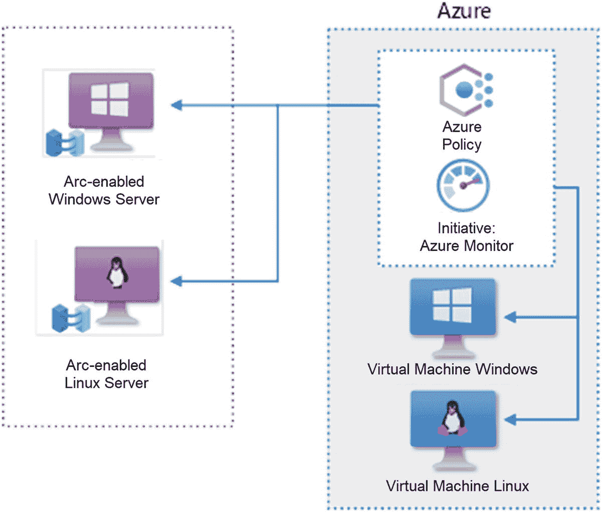
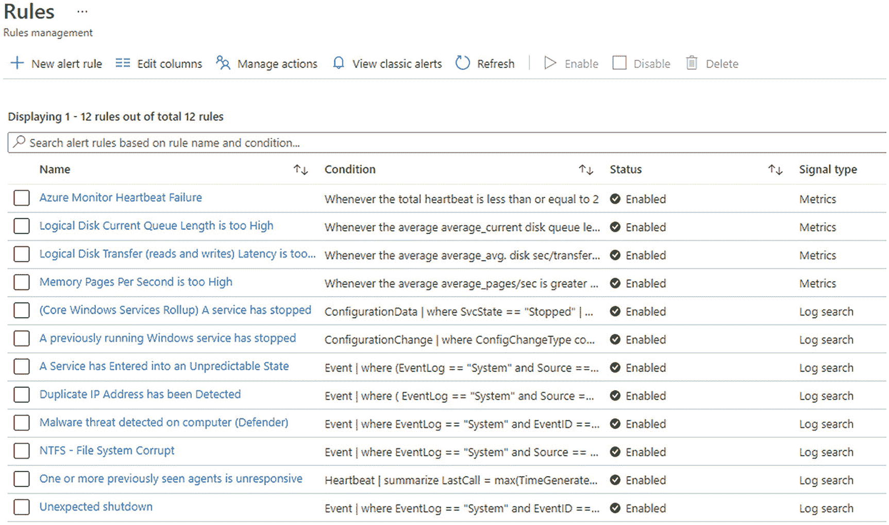

# 六、混合服务器监控解决方案

本章描述了基于 Azure Monitor 平台服务的独立端到端服务器监控解决方案。前几章帮助你构建了基于 Azure 的管理框架；现在我们用它做一些有价值的、划算的事情。该解决方案为 Azure 订阅中的 Azure 虚拟机和 Azure Arc 服务器提供服务器基础架构监控。当受监控的服务器停机或出现严重问题时，该解决方案会通知您的团队。

该解决方案包含一组 Azure 微服务，用于探测和评估服务器操作系统的可用性、配置和性能。它在监控核心服务器功能(可用性、配置和性能)方面与现有的行业标准工具不相上下。作为一个云原生解决方案，通过新颖的 Azure Connected Machine Agent(Azure Arc)将云框架扩展到非云端点，这是无与伦比的。

该解决方案代表了一种新的行业范式:通过免费的云服务管理平台提供合适的低成本服务器监控。该解决方案提供无限的规模和全球可用性。成功地从更昂贵的遗留应用中迁移服务器监控工具的组织将获得竞争优势。

## 解决方案高级功能

将解决方案架构视为具有三个主要特性:管理控制平面、规则集和通知工作流。下面将描述这些功能，以及解决方案中构成该功能的 Azure 服务。

1.  提供监控、安全、访问和治理的管理控制平面
    *   蔚蓝灯塔和蔚蓝商业市场

    *   Azure Arc 和 Azure 资源管理器(ARM)

    *   Azure 策略

    *   Azure 虚拟机扩展

    *   微软管理代理(MMA)/Azure 管理代理(AMA)

2.  一组从托管计算机收集和分析数据的监视器和规则
    *   Azure 日志分析

    *   Azure VM Insights 来宾运行状况

    *   Azure 自动化(更新和配置管理)

    *   Azure 计划查询警报规则

3.  响应警报的方法，例如执行自动化工作流和向票务系统发送警报通知
    *   Azure 警报操作组

    *   Azure 警报操作规则

    *   Azure 逻辑应用

**监视什么**:部署在此解决方案中的一组经过管理的监视器和规则`—`可从 Azure Monitor 实现有效的服务器操作系统监视`—`包括检测来自 Windows Server OS 的 System Center Operations Center(SCOM)管理包中包含的规则和警报生成监视器的最常见警报。

**成本**:交付特定监控服务的 Azure 消耗成本可以估计为**每台服务器每月 5 美元**。这一估计符合 Azure pricing calculator 的建议，即大多数服务器每月产生 1 GB 到 3 GB 的日志摄取量(在较便宜的地区 1.30 美元= 1 GB，在较贵的地区 5.10 美元= 3 GB)。根据您所在的市场和货币，每台服务器 5 美元是一个保守且有效的整数。

### 解决方案图

图 6-1 展示了交付解决方案特性的 Azure 服务。以下是图表的可视化指南:


图 6-1

由 Azure Arc 和 Azure Policy 支持的 Azure 监控解决方案

1.  从右下方开始， **Azure AD 用户**或 **Azure Lighthouse 服务提供商安全组**是将访问 Azure 订阅的身份。

2.  **Azure RBAC** (基于角色的访问控制)用于将 Azure AD 用户与 Azure 订阅中的安全角色相关联。在 **Azure Lighthouse** 场景中，客户接受了将服务提供商员工与客户 Azure 订阅中的委托安全权限相关联的提议。

3.  授权用户或服务主体使用他们的 RBAC 或委托访问权将 **Azure 策略**分配给 **Azure 虚拟机**和 **Azure Arc 服务器**。

4.  该策略使计算机受到使用 MMA 的 **Azure Monitor** (中间)的监控，并将它们连接到日志分析工作区(中间右侧)。

5.  **Azure VM Extensions** 安装 AMA，并将虚拟机连接到虚拟机来宾运行状况监视器(中间左侧)。

6.  继续向左，**虚拟机客户健康** *警告*和*紧急*状态变化触发**逻辑应用**的启动，其有条件地创建警报通知(红色三角形)。

7.  **警报规则**(左上)按计划运行，寻找指示问题的日志或度量数据。

8.  Azure Monitor 警报操作规则选择性地抑制由预定警报规则(左上角)产生的警报**；这就是您如何解决计算机特定的预设警报规则覆盖问题。**

9.  从中间向右侧移动，安装在**日志分析工作区**的**日志分析解决方案**包括与 **Azure Automation 账户**的链接。

10.  自动化帐户中的解决方案包括**更新管理**(右上)和**配置管理**解决方案(上中)。

### 特定监控功能

回答问题*该解决方案监控什么*？，提供以下具体列表。监视器和警报选项以及警报阈值源自 Windows Server SCOM 管理包的默认监视配置文件。

**规则和监控列表**

1.  Azure Monitor 心跳失败(最近 5 分钟内两次或更少的心跳)。

2.  逻辑磁盘传输(读取和写入)延迟太高。

3.  每秒内存页数太高。

4.  逻辑磁盘可用空间不足。

5.  可用内存太低。

6.  总 CPU 利用率百分比太高。

7.  逻辑磁盘当前队列长度太长。

8.  服务进入不可预测的状态。

9.  检测到重复的 IP 地址。

10.  NTFS `—`文件系统损坏。

11.  在计算机上检测到恶意软件威胁。

12.  检测到意外关机。

13.  一项核心 Windows 服务已停止(监视 12 项特定服务)。

14.  以前运行的 Windows 服务已经停止。

除了向规则和监控列表中的产品发出警报之外，该解决方案还部署了以下高价值产品:

*   **Azure Automation 更新解决方案**在所有位置的所有 Windows 和 Linux 服务器上提供特定于服务器和整个组织的已安装和缺失/需要的更新视图。

*   **Azure Automation 配置管理解决方案**对软件、文件系统、Windows 注册表、Windows 服务器和 Linux 守护进程执行检查。记录更改，自动显示更改检测前后的读数。

*   **安装 Azure Monitor 工作簿**是为了在当前、趋势和历史可用性和性能数据中提供基于图表的可视化帮助。工作簿可以部署为 Azure 仪表板，用于管理显示。

## 蔚蓝灯塔

Azure Lighthouse 是专门为服务提供商创建的，但它也适用于拥有多个 Azure AD 租户的大型组织。在企业和学术场景中，“共享服务”或“教师”所在的租户可以使用“服务提供商”灯塔委托来无缝管理其他 Azure AD 租户(如“客户”下属、“学生”或合作伙伴公司)拥有的 Azure 订阅。

Azure Lighthouse 允许一对多的方法，服务提供商员工和 Azure 工件，如监控规则和 ARM 模板，在许多客户租户之间共享。也就是说，一个 Azure AD 租户(服务提供商)获得对属于不同租户(客户)的 Azure 订阅的委托权限。当服务提供商向客户提供“优惠”时，就会发生这种情况。然后，客户接受该提议，并将他们的订阅和/或资源组委托给服务提供商租户中存在的并且在提议中指定的特定 Azure AD 安全组。

Azure Lighthouse 提供了一种可撤销的、单向的、可验证的、细粒度的信任，它消除了每个服务提供商员工在客户域中存在重复帐户(或者更糟，共享帐户)的需要。客户审计日志显示在客户订阅中有活动的服务提供商员工的实际姓名。如果服务提供商对所有员工登录强制实施多因素身份验证(MFA ),该解决方案允许服务提供商保证只有 MFA 访问发生在客户资源上。

在本章描述的解决方案中，任何 Azure Lighthouse 的参与都是可选的。然而，如果使用 Azure Lighthouse，该解决方案对于所有多租户监控场景都完全有效。

## 弧蓝

在最初的 Microsoft Azure“经典”或原始 Azure 数据中心结构控制器取得成功后，发现了扩展和其他限制。微软必须发明一种方法来管理和协调超大规模的全球 Azure 云。由此产生的“V2”技术被称为 Azure 资源管理器(ARM)，有时也被称为 Azure *控制平面*，它为今天的所有 Azure 提供动力。把 ARM 想象成 Azure 自己的操作系统，即“主控制器”。我们使用以 JSON 格式编写的文档与 ARM 进行基本通信，也称为 *ARM 模板*。

ARM 在管理 IT 对象和服务方面被证明是超可扩展和高度可靠的。Azure Arc 是一个新概念的名称，它将 ARM 的规模经济和优势扩展到 Azure 之外的对象。在这个解决方案中，Azure Arc 服务器对象是在 Azure 订阅中创建的，对于 ARM 来说，它类似于 Azure 虚拟机。对于 ARM，两个对象都是计算机，并且计算机管理范例可以跨环境应用。由于 Azure Arc，ARM 可以将 Azure 监控计算机的策略应用于 Azure 虚拟机和非 Azure 服务器。

从管理的角度来看，Azure Arc 使非云服务器变得模糊。经济意义在于，使用 Azure Arc 管理非云服务器将产生成本效益。这些好处来自免费使用 Azure 管理功能，如策略、标签和资源组`—`，以及消费(或交付)其他云服务，如监控、安全和备份，几乎没有附带或中间“管理工具”成本。

### Azure Arc 服务器

正如我们在第 4 章[第 4 章](4.html)“Azure Arc 服务器:入门”中所介绍的，Azure Arc 在非 Azure 计算机`—`上安装了一个应用，即用于非 Azure 计算机`—`的**Azure Connected Machine Agent**，它与默认情况下在每个 Azure 虚拟机上运行的 in-Azure**Windows Azure Guest Agent**执行相同的功能。Windows Azure Guest Agent 本质上是一个用于管理 Azure VM 的带外管理通道。Windows Azure 访客代理为 Azure VM 做的主要事情是安装和维护 Azure VM 扩展，这些扩展是实际执行监控工作的小程序和服务。Azure Arc 的 Azure Connected Machine 代理为非 Azure 计算机做同样的事情。Azure Arc 代理将非 Azure 服务器作为混合机器对象连接到 Azure 控制平面。

在此解决方案中，您不需要在服务器上安装监控代理。相反，你可以在非 Azure 服务器上安装 Azure Arc 代理。然后配置 Azure 策略，通过 Azure Arc 在计算机上安装监控代理。Azure 策略补救任务实际上使用 Azure AD 中的服务主体安装监控代理，该服务主体是在分配策略时创建的。在图 [6-2](#Fig2) 中，此 Windows 服务器上列出的所有管理应用都是由第一个列出的代理 Azure Arc 代理(Azure Connected Machine Agent)安装或验证的。


图 6-2

此 Azure Arc 服务器上的 Azure Connected Machine 代理使用 Azure VM 扩展安装了其他程序

Azure Arc 服务器是使用运行在被装载的服务器上的脚本注册的。脚本登录到运行 onboarding 脚本的个人或服务主体的 Azure AD 租户。然后，如果个人或服务具有适当的安全访问权限，则会在指定的 Azure 订阅、资源组和 Azure 区域中创建 Azure Arc 服务器的 ARM 资源记录(ARM 对象)。Azure Arc 服务器被静默地颁发一个数字证书，该证书充当计算机对 Azure 的唯一身份提供者。

## Azure 策略

Azure 策略在 Azure 虚拟机和 Azure Arc 服务器之间一致地应用监控和管理设置。具体来说，在该解决方案中，所有位置的所有 Windows 和 Linux 服务器`—`和云`—`都通过同一个策略计划来评估其对核心监控目标的合规性。当服务器准备好开始被监控时，部署一个 Azure Policy initiative，将服务器连接到订阅中的 Azure Monitor 实例(图 [6-3](#Fig3) )。

核心监控目标是通过在每台计算机上安装两个软件，将每台计算机连接到选定的 Azure Log Analytics 工作区:(1)微软监控代理(MMA)和(2)依赖代理。依赖代理补充了 MMA，并为 VM Insights 中的服务地图集成提供了网络级信息。



图 6-3

Azure Policy 向所有位置的所有服务器推出启用 Azure 虚拟机监控策略计划

有一个内置的 azure policy initiative**enable azure monitor for****VM**(策略➤创作➤定义)捆绑了十个策略。八项政策能够*部署不存在的*补救任务:

1.  将日志分析代理部署到 Windows Azure Arc 计算机。

2.  部署`—`将日志分析代理配置为在 Windows 虚拟机上启用。

3.  将日志分析代理部署到 Linux Azure Arc 机器。

4.  为 Linux 虚拟机部署日志分析代理。

5.  将依赖关系代理部署到 Windows Azure Arc 计算机。

6.  部署`-`配置要在 Windows 虚拟机上启用的依赖关系代理。

7.  将依赖代理部署到混合 Linux Azure Arc 机器上。

8.  为 Linux 虚拟机部署依赖关系代理。

9.  两个策略属于 *AuditifNotExist* 类型，用于在发现非标准 Azure VM 映像类型时进行标记，否则会阻止自动补救。

10.  应为列出的虚拟机映像启用日志分析代理。

11.  应为列出的虚拟机映像启用依赖关系代理。

### Azure 策略分配

**Enable Azure Monitor for VMs** 计划分配给订阅和/或资源组，是在所有计算机上推送安装和集中配置 MMA 和依赖代理的主要工具。如果计算机不符合核心监控目标，这样做还可以检测配置漂移。

在分配计划时，会创建一个托管身份，这是一个 Azure AD Enterprise 应用注册(服务主体)。服务主体被自动授予 Azure 订阅或资源组中的**日志分析贡献者**角色。服务主体将有一个随机显示名称，如“27c1377f005d47578cecc397”。

您可以通过返回编辑方案分配来定位服务主体名称；在**补救**选项卡上是主体 ID 框，带有 GUID，如“75943696-0879-432d-98e 6-AE 0aa 439 ed 05”。该 GUID 与企业应用的对象 ID(服务主体)相匹配。您可以使用 Azure PowerShell 命令 Get-AzADServicePrincipal 将该对象 ID 交叉引用回 Azure AD 服务主体的名称(通过输出进行了演示):

```
PS /home> Get-AzADServicePrincipal -ObjectId 75943696-0879-432d-98e6-ae0aa439ed05

ServicePrincipalNames : {57aa357a-8f37-44c5-8fb5-ade220354465, https://identity.azure.net/TzdI8YgzhpY339TyesufBsnmeXGgqUM56HhUnrT8S2k=}
ApplicationId         : e0ba357a-8f37-44c5-8fb5-ade220354564
ObjectType            : ServicePrincipal
DisplayName           : 27c1377f005d47578cecc397
Id                    : 75943696-0879-432d-98e6-ae0aa439ed05

```

要使修复任务正常工作，服务主体的显示名称应位于订阅或资源组➤访问控制(IAM) ➤角色分配中的**日志分析贡献者**下。

#### Azure 策略实施间隔

以下是将导致策略资源被评估的时间或事件:

*   在具有策略分配的范围内创建、更新或删除资源。

*   策略或计划被新分配给一个范围。

*   更新已经分配给范围的策略或计划。

*   在每 24 小时一次的标准符合性评估周期中。

Tip

您可以使用以下 Azure PowerShell 命令在资源组中触发按需 Azure 策略实施:

`Start-AzPolicyComplianceScan -ResourceGroupName '<rgname>' -AsJob`

### Azure 策略合规性

Azure 策略分配的目标是通过补救任务和可选豁免的组合实现 100%的合规状态(图 [6-4](#Fig4) )。当低于 100%合规状态时，不合规的特定计算机和策略的列表可在策略➤合规➤倡议➤不合规资源中找到。

不符合的资源列表是解决方案部署期间的工作列表，用于识别需要补救的计算机。部署解决方案后，监控合规性保持在 100%,当计算机和策略不合规时，采取必要措施恢复 100%合规性。


图 6-4

在资源组中 100%合规的情况下启用 Azure Monitor for VMs 策略计划

#### Azure 策略:补救任务

将 **Enable Azure Monitor for VMs** 计划分配给订阅或资源组后，新创建的资源(Azure VMs 和 Azure Arc 服务器)如果不符合，将自动进行补救。为现有资源创建**修复任务**，将必要的代理推送到各自的目标。大多数服务器不会为目标日志分析工作区安装和配置 Microsoft 管理代理(MMA)或依赖关系代理。事实上，Azure Policy 对于预先存在的资源是一个两步过程:分配策略来识别不符合的资源，然后启动补救任务来修复问题。

遵循此协议使用 Azure 策略部署解决方案:

1.  在策略➤合规性方面，选择**为虚拟机启用 azure monitor】计划。**

2.  点击**创建修复任务**。

3.  对于要修复的策略，选择**为 Windows 虚拟机部署日志分析代理**。

4.  请确保范围正确(一台计算机、一个资源组或一个订阅)。

5.  请在补救前检查重新评估资源符合性。

6.  推**补救**。

7.  从步骤 2 开始重复，并选择**为 Windows 虚拟机部署依赖代理**。

8.  重复步骤 4、5 和 6。

9.  如果合适，再次从步骤 2 开始重复**为 Linux 虚拟机**部署日志分析代理，然后**为 Linux 虚拟机**部署依赖代理。

10.  在第一波修复任务之后，对故障进行分类和修复，根据需要重复修复任务，直到所有计算机都符合要求。视情况创建例外(下一章介绍)以提高合规百分比。

##### 未列出的图像

当 ARM 不知道虚拟机操作系统磁盘的确切来源时，默认策略对不符合的*进行“故障保护”。如果某些计算机标记了未列出的*的*虚拟机映像(OS)的审计策略，则有必要克隆内置方案，并为日志分析代理和依赖关系代理策略创建带有自定义策略的自定义方案。自定义策略将添加您组织的自定义 *osDisk.creationOption* 值，以便策略接受并继续修复。*

例如，以下 JSON 代码在拼接到的`"policyRule":`部分时，将允许使用附加和上传的磁盘映像:

```
              {
                "allOf": [
                  {
                    "field": "Microsoft.Compute/virtualMachines/storageProfile.osDisk.createOption",
                    "equals": "Attach"
                  }
                ]
              },
              {
                "allOf": [
                  {
                    "field": "Microsoft.Compute/virtualMachines/storageProfile.osDisk.createOption",
                    "equals": "FromImage"
                  }
                ]
              },

```

##### 多个管理组

如果 MMA 代理在修复任务期间由于*多个管理组*而出现故障，您可以使用 Azure PowerShell/Cloud Shell 手动安装 MMA 的 VM 扩展。以下示例自定义脚本添加了" " stoponmultipleconconnections " = $ false "标志。

```
     Connect-AzAccount

     $PublicSettings = @{"workspaceId" = " fd75fd75-f70c-4fe5-bd39-afa5f70cafa5";"stopOnMultipleConnections" = $false}
     $ProtectedSettings =@{'workspaceKey' = 1234abcdxxxxxxxxxxxxxxxxxxxxxxxxxxxxxxxxxxxxxxxxxxxxxxxxxxxxxxxxxxxxxxxxxxxxxx1234abcd=='}

     Set-AzVMExtension -ResourceGroupName "MyResourceGroup" `
     -VMName "MyAzureVM" `
     -Publisher Microsoft.EnterpriseCloud.Monitoring `
     -ExtensionType MicrosoftMonitoringAgent  `
     -TypeHandlerVersion 1.0 `
     -Settings $PublicSettings `
     -ProtectedSettings $ProtectedSettings `
     -Location "eastus2 `
     -Name MicrosoftMonitoringAgent

```

对于 Azure Arc 服务器，如果有大量计算机需要修改的 VM 扩展安装策略，请克隆内置策略，并为日志分析代理创建一个带有自定义策略的自定义方案。用以下代码替换策略的内置“资源”部分:

```
                "resources": [
                  {
                    "name": "[concat(parameters('vmName'), '/', variables('vmExtensionName'))]",
                    "type": "Microsoft.HybridCompute/machines/extensions",
                    "location": "[parameters('location')]",
                    "apiVersion": "2019-12-12",
                    "properties": {
                      "publisher": "[variables('vmExtensionPublisher')]",
                      "type": "[variables('vmExtensionType')]",
                      "settings": {
                        "workspaceId": "[reference(parameters('logAnalytics'), '2015-03-20').customerId]",
                        "stopOnMultipleConnections": "false"
                      },
                      "protectedSettings": {
                        "workspaceKey": "[listKeys(parameters('logAnalytics'), '2015-03-20').primarySharedKey]"
                      }
                    }
                  }
                ],

```

#### Azure 策略:豁免

可以将策略分配给将始终报告不符合的计算机，但是在计算整体策略符合性时，给定细节不应减少不符合的计算机计数。换句话说，放弃政策。

遵循此协议从分配的 Azure 策略中豁免计算机:

1.  在“策略➤合规”中，选择“为虚拟机启用 Azure Monitor”计划。

2.  点击**不合规资源**。

3.  找到要豁免的计算机并点击**创建豁免**按钮。

4.  确保豁免范围(一台计算机)正确。

5.  视情况选择*弃权*或*减轻*。

6.  输入票号等备注，点击**审核+创建**，然后点击**创建**。

## Azure 日志分析

单一日志分析工作区是该解决方案的重点。所有的监控工件都指向指定的工作区。许多 **Azure 日志分析解决方案**被安装在工作空间中，为解决方案做出贡献(图 [6-5](#Fig5) ):

*   评价

*   复制

*   代理健康评估

*   ChangeTracking(由 Azure Automation 更改跟踪自动安装)

*   脱氧核糖核酸分析

*   逻辑管理

*   安全

*   服务地图

*   SQL 脆弱性评估

*   更新(由 Azure 自动化更新解决方案自动安装)

*   VMInsights(通过将日志分析工作区与 VM Insights 链接来自动安装)

需要手动安装的解决方案如下所示。按照以下步骤添加解决方案:


图 6-5

安装了推荐解决方案的 Azure 日志分析工作区的概述页面

1.  在日志分析工作区➤➤综合工作区概要，点击**添加**按钮。

2.  在 Marketplace，在搜索栏中粘贴解决方案的确切名称:
    1.  Active Directory 运行状况检查

    2.  AD 复制状态

    3.  Azure 日志分析代理运行状况

    4.  DNS 分析

    5.  逻辑应用管理

    6.  安全和审计

    7.  服务地图

    8.  SQL 漏洞评估

3.  找到解决方案，然后单击“创建”按钮。

4.  选择日志分析工作区，然后再次单击创建。

### 日志分析工作区附加配置

在 Azure Log Analytics 工作区中安装解决方案后，还有对 Azure Log Analytics 代理配置的额外定制。为了进行有效的监控，有必要收集常见的事件日志(系统和应用)以及选定的附加磁盘和内存性能计数器。此外，您将确认工作区数据的保留期。

#### Windows 事件日志

在日志分析工作区➤设置➤代理配置➤窗口事件日志中，添加包含所有优先级事件的应用和系统日志(图 [6-6](#Fig6) )。


图 6-6

要收集的 Windows 事件日志

#### Windows 性能计数器

在日志分析工作区➤设置➤代理配置➤ Windows 性能计数器，添加如图 [6-7](#Fig7) 所示的设置。


图 6-7

收集这些额外的 Windows 性能计数器

或者，以下 Azure PowerShell 示例脚本(Add-PerfCounters.ps1)将创建 Windows 性能计数器:

**Add-PerfCounters.ps1**

```
$ResourceGroup = "MyResourceGroup"
$WorkspaceName = "MyWorkspace"
New-AzOperationalInsightsWindowsPerformanceCounterDataSource ​-ResourceGroupName $ResourceGroup -WorkspaceName $WorkspaceName -ObjectName "LogicalDisk" -InstanceName "*" -CounterName "Avg. Disk sec/Transfer" ​-IntervalSeconds 60 -Name "LogicalDisk(*)\Avg. Disk sec/Transfer"
New-AzOperationalInsightsWindowsPerformanceCounterDataSource​-ResourceGroupName $ResourceGroup -WorkspaceName $WorkspaceName -ObjectName "LogicalDisk" -InstanceName "*" -CounterName "Current Disk Queue Length" -IntervalSeconds 60 -Name "LogicalDisk(*)\Current Disk Queue Length"
New-AzOperationalInsightsWindowsPerformanceCounterDataSource-ResourceGroupName $ResourceGroup -WorkspaceName $WorkspaceName -ObjectName "Memory" -InstanceName "*" -CounterName "Pages/sec" -IntervalSeconds 60 ​-Name "Memory(*)\Pages/sec"

```

#### 数据保持

确认 Azure Log Analytics 数据的保留期符合您的预期。在默认服务中，日志将免费保留 31 天。如果选择更长的保留时间，请在日志分析工作区➤常规➤使用和估计成本➤数据保留中进行设置。(Microsoft Sentinel 包括 90 天的免费保留期。)保留数据的时间超过包含/免费保留期将产生额外的每月 Azure 订阅费用。

Tip

下面是一些估算长期保留额外成本的经验法则:

Azure 日志分析:

每月增加 50%以保留 1 年，而不是 31 天。例如:每月 100 美元保留 31 天，每月 150 美元保留 1 年

微软哨兵:

与 90 天相比，保留 1 年每月增加 20%的成本。例如:每月 1000 美元保留 90 天，每月 1200 美元保留 1 年

日志分析工作区中数据的最长保留期为 730 天(2 年)。虽然您的数据保留在工作区存储库中，但它会像当前数据一样在报告中被查询和使用。如果您的数据保留需求超过 2 年，支持的解决方案是启用从日志分析到 Azure 存储帐户或 Azure 事件中心的**连续数据导出**。有关其工作原理的详细信息，请访问以下 URL:

[T2`https://docs.microsoft.com/en-us/azure/azure-monitor/logs/logs-data-export`](https://docs.microsoft.com/en-us/azure/azure-monitor/logs/logs-data-export)

## Azure 自动化

创建 Azure Automation 帐户时，会创建一个“Azure 运行方式帐户”作为 Azure AD 中的服务主体，并授予订阅的参与者角色。在自动化帐户➤帐户设置➤运行方式帐户中检查 Azure 运行方式帐户的状态。服务主体应该在 Azure 订阅中分配有 *Contributor* 角色。

作为一次性活动，将 Azure Automation 帐户链接到日志分析工作区➤相关资源➤自动化帐户的 Azure 日志分析工作区。

将 Azure Automation 帐户链接到 Azure Log Analytics 工作区后，为*所有可用和未来的机器*启用**更新管理**和**库存**解决方案，如图 [6-8](#Fig8) 所示。


图 6-8

为所有可用和未来的计算机启用 Azure Automation 更新管理解决方案

当一台计算机注册 Azure 自动化解决方案时，会为每台计算机悄悄地创建一个系统混合工作组。系统混合工作者组的名称类似于*my computer . my domain . com _ 4 fcd 9932-4206-4 fcd-8842-4 fcd 63874 fcd*。该混合工作器被授权在受监控的计算机上运行，以便收集清单、更改和更新数据，并在该选项打开的情况下安装更新。

## Azure 监视器

在这个解决方案中，Azure Monitor 的两个方面用于监控服务器。这些是计划的警报规则和 Azure VM 来宾运行状况监视器。规则和监视器一起是解决方案中的主动传感器。

### Azure Monitor 操作组

在导入选择的预定警报规则之前，会创建一个 Azure Monitor 操作组来接收警报并对其执行通知。导入警报规则时，会指定此操作组的名称，因此它必须在导入警报规则之前存在。

#### 操作组:默认-预警-操作

操作组创建如下:

1.  日志分析工作区➤监控➤警报➤管理操作➤添加操作组。

2.  对于名称，输入**默认警报操作**。

3.  对于简称，输入**默认名称**。

4.  创建电子邮件类型的通知操作。

5.  添加通知端点的电子邮件地址。

6.  选择“是”以启用通用警报模式。

7.  单击确定。

8.  点击**保存更改**。

图 [6-9](#Fig9) 摘自 Azure Monitor 电子邮件提醒产品；这是一个计算机心跳停止的例子。


图 6-9

Azure Monitor 发送的电子邮件警报通知的主题和正文摘要

#### 操作组:VM Insights 运行状况警报

创建第二个操作组 **VM Insights Health Alert** 来启动一个逻辑应用，该应用对 Azure VM Health monitor 警报进行后处理。在创建了逻辑应用*Azure-Monitor-Guest-Health-Alerting*之后，将在解决方案部署的后期创建该组。动作组只有一个动作:触发逻辑应用。

### Azure Monitor 计划的警报规则

计划的监控警报规则定期运行(从每 5 分钟一次到每天一次),并在日志数据中查看是否存在警告或严重警报指示器，或者是否存在正常数据指示。该解决方案包括 12 个定时预警规则(表 [6-1](#Tab1) )。图 [6-10](#Fig10) 和 [6-11](#Fig11) 展示了实际应用中的解决方案，显示了活跃环境中一天的警报流量。


图 6-11

所有警报列表包括平台指标和日志分析日志警报


图 6-10

Azure 门户中的 Azure Monitor 警报控制台

表 6-1

Azure Monitor 计划的警报规则

<colgroup><col class="tcol1 align-left"> <col class="tcol2 align-left"> <col class="tcol3 align-left"></colgroup> 
| 

名字

 | 

类型/频率

 | 

情况

 |
| --- | --- | --- |
| `Azure Monitor Heartbeat Failure` | `Metric``5m @ 1m` | `Whenever the total heartbeat is less than or equal to 2 [in 5 minutes]` |
| `Logical Disk Current Queue Length is too High` | `Metric``15m @ 1m` | `Whenever the average average_current disk queue length is greater than 32` |
| `Logical Disk Transfer (reads and writes) Latency is too High` | `Metric``15m @ 1m` | `Whenever the average average_avg. disk sec/transfer is greater than 0.04` |
| `Memory Pages Per Second is too High` | `Metric``1h @ 5m` | `Whenever the average average_pages/sec is greater than 5000` |
| `(Core Windows Services Rollup) A service has stopped` | `Log``5m @ 5m` | `ConfigurationData &#124; where SvcState == "Stopped" &#124; where SvcName == "Browser" or SvcName == "DHCP" or SvcName =="DNSCache" or SvcName == "PlugPlay" or SvcName == "RpcSs" or SvcName == "lanmanserver" or SvcName == "LmHosts" or SvcName == "Eventlog" or SvcName == "MpsSvc" or SvcName == "WinRM" or SvcName == "Lanmanworkstation" &#124; where SvcStartupType != "Disabled"` |
| `A previously running Windows service has stopped` | `Log``5m @ 5m` | `ConfigurationChange &#124; where ConfigChangeType contains "WindowsServices" &#124; where SvcStartupType contains "Auto" &#124; where SvcState contains "Stopped" &#124; where SvcPreviousState contains "Running" &#124; where SvcName !in ("IaasVmProvider","edgeupdate","RemoteRegistry","sppsvc","TrustedInstaller","wuauserv")` |
| `A Service has Entered into an Unpredictable State` | `Log``5m @ 5m` | `Event &#124; where (EventLog == "System" and Source == "Service Control Manager") and (EventID == 7030 or EventID == 7037) &#124; project Computer, TimeGenerated, AlertType_s = "A Service has Entered into an Unpredictable State", Severity = 4, SeverityName_s = "WARNING", AffectedCI_s = Computer, AlertTitle_s = strcat(Computer, ": A Service has Entered into an Unpredictable State"), AlertDetails_s = strcat("Event Description:", RenderedDescription)` |
| `Duplicate IP Address has been Detected` | `Log``5m @ 5m` | `Event &#124; where ( EventLog == "System" and Source == "Tcpip" ) and ( EventID == 4198 or EventID == 4199 ) &#124; project Computer, TimeGenerated, AlertType_s = "Duplicate IP Address has been Detected", Severity = 4, SeverityName_s = "WARNING", AffectedCI_s = Computer, AlertTitle_s = strcat(Computer, ": Duplicate IP Address has been Detected"), AlertDetails_s = strcat("Event Description:", RenderedDescription)` |
| `Malware threat detected on computer (Defender)` | `Log``10m @ 10m` | `ProtectionStatus &#124; summarize ThreatStatusRank=max(ThreatStatusRank) by Computer, Time=bin(todatetime(DateCollected), 10m) &#124; summarize(Time, ThreatStatusRank) = argmax(Time, ThreatStatusRank) by Computer &#124; where ThreatStatusRank !in (150, 470) &#124; project Computer, Rank = ThreatStatusRank` |
| `NTFS - File System Corrupt` | `Log``30m @ 30m` | `Event &#124; where EventLog == "System" and Source == "DISK" or Source == "Ntfs" and EventID == 55 &#124; project Computer, TimeGenerated, AlertType_s = "NTFS - File System Corrupt", Severity = 4, SeverityName_s = "WARNING", AffectedCI_s = Computer, AlertTitle_s = strcat(Computer, ": NTFS - File System Corrupt"), AlertDetails_s = strcat("Event Description:", RenderedDescription)` |
| `One or more previously seen agents is unresponsive` | `Log``2h @ 2h` | `Heartbeat &#124; summarize LastCall = max(TimeGenerated) by Computer &#124; where LastCall < ago(24h)` |
| `Unexpected shutdown` | `Log``1d @ 1d` | `Event &#124; where EventLog == "System" and EventID == 6008 &#124; project Computer, TimeGenerated, AlertType_s = "Unexpected shutdown", Severity = 4, SeverityName_s = "WARNING", AffectedCI_s = strcat(Computer), AlertTitle_s = strcat(Computer, ": Unexpected Shutdown"), AlertDetails_s = strcat("Multiple shutdowns detected in the past 24 hours EventID: 6008 Event Description: ", RenderedDescription)` |

Azure Monitor 计划警报规则可以使用表 [6-1](#Tab1) 中的信息手动创建为 KQL 查询，或者使用 ARM 模板导入到 Azure 订阅中。在以下 URL 查找示例 KQL 查询，以粘贴到您可能创建的预定警报规则中:

[T2`https://github.com/microsoft/AzureMonitorCommunity`](https://github.com/microsoft/AzureMonitorCommunity)

图 [6-12](#Fig12) 显示了导入后在 Azure Log Analytics 工作区中运行的解决方案规则。



图 6-12

Azure Monitor 计划警报规则在环境中执行监控

#### 使用 ARM 模板进行规则管理

您可能会发现创建一个预定警报规则库来导入 Azure Log Analytics 非常方便。Azure Monitor 可以使用 ARM 模板进行大规模部署和配置。每个警报规则都可以作为 ARM 模板/参数文件对导入。以下 URL 提供了不同 Azure Monitor 功能的示例模板，可以根据您的特定需求进行修改:

[T2`https://docs.microsoft.com/en-us/azure/azure-monitor/resource-manager-samples`](https://docs.microsoft.com/en-us/azure/azure-monitor/resource-manager-samples)

##### 创建可重复使用的警报规则模板库

GitHub Management toolkit URL 包含导入许多常见警报规则定义的指令，其中许多都包含在这个 Azure 监控解决方案中。点击链接，从以下网址下载用于传统日志警报 API 的**警报工具包:**

[T2`https://github.com/microsoft/manageability-toolkits`](https://github.com/microsoft/manageability-toolkits)

考虑使用这种方法来开发您的 ARM 模板库:

1.  将可管理性工具包中的所有可用规则导入 Azure Log Analytics。

2.  禁用开发不需要运行的规则。

3.  评估您将在生产中使用的规则，并将其内容导出到 ARM 模板。

4.  删除由可管理性工具包导入 Azure Monitor 的规则。

5.  使用 ARM 模板为基于代码的管理重新导入生产规则。

6.  使用 ARM 模板将相同的规则集部署到其他 Azure Log Analytics 工作区，或者将它们用作监控基础架构的备份/文档。

##### 创作预设警报规则模板

日志预警规则和度量预警规则具有不同的结构。对于规则的完整部署，您需要准备以下文件:

1.  日志警报的模板文件

2.  度量预警的模板文件

3.  日志预警的模板参数文件

4.  度量预警的模板参数文件

以下网址提供了详细说明和示例模板:

*   使用资源管理器模板创建日志警报

[T2`https://docs.microsoft.com/en-us/azure/azure-monitor/alerts/alerts-log-create-templates`](https://docs.microsoft.com/en-us/azure/azure-monitor/alerts/alerts-log-create-templates)

*   使用资源管理器模板创建度量预警

[T2`https://docs.microsoft.com/en-us/azure/azure-monitor/alerts/alerts-metric-create-templates`](https://docs.microsoft.com/en-us/azure/azure-monitor/alerts/alerts-metric-create-templates)

Tip

确保在通过 ARM 模板导入规则之前，预先创建将为警报执行默认通知的 Azure Monitor 操作组。(这是本章的 Azure Monitor 操作组一节中介绍的*默认-警报-操作*组。)**如何**:在模板参数文件中指定动作组的资源组 ID，在导入预警规则时自动启用您的默认通知渠道。在参数文件中，您的操作组资源组 ID 将如下所示:

`"actionGroupId": {`

`"value": "/subscriptions/12341234-1234-1234-1234-123412341234/resourceGroups/RG-DEV-EUS/providers/microsoft.insights/actiongroups/Default-Alert-Action"`

`}`

#### 部署 ARM 模板以实现监控

您可以使用任何部署资源管理器模板的标准方法来部署您的 ARM 模板(从而启用监控)。以下部分描述了使用 Azure 门户和 Azure PowerShell 将计划日志和度量警报规则的标准化版本导入 Azure Log Analytics 的方法。

##### 使用 Azure 门户导入规则模板

1.  导航到首页➤新➤搜索市场。

2.  键入“template”并从下拉列表中选择**模板部署(使用自定义模板部署)**。点击**创建**。

3.  在选择模板处，点击**在编辑器**中构建您自己的模板。

4.  在*编辑模板*，用模板文件内容替换代码视图的全部内容，点击**保存**。

5.  单击编辑参数；然后在*编辑参数*，用模板参数文件内容替换整个代码段，点击**保存**。

6.  在自定义部署界面，选择资源组，点击**查看+创建**，然后点击**创建**。

##### 使用 Azure PowerShell 导入规则模板

为要导入的规则准备输入模板和模板参数文件；然后使用*New-AzResourceGroupDeployment*cmdlet 创建部署。此示例从文件“MonitorLogAlert-template-Core service has stopped . JSON”和“MonitorLogAlert-parameters . JSON”中导入日志规则“Core service has stopped”:

```
New-AzResourceGroupDeployment -Name "LogAlertDeployment" -ResourceGroupName MyResourceGroup -TemplateFile "MonitorLogAlert-template-Core service has stopped.json" -TemplateParameterFile "MonitorLogAlert-parameters.json"

```

此示例从文件“MonitorLogAlert-template-Azure Monitor heartbeat failure-metric . JSON”和“monitormetricslalert-parameters . JSON”中导入度量规则“Azure Monitor heart beat failure”:

```
New-AzResourceGroupDeployment -Name "MetricAlertDeployment" -ResourceGroupName MyResourceGroup -TemplateFile "MonitorLogAlert-template-Azure Monitor heartbeat failure-metric.json" -TemplateParameterFile "MonitorMetricsAlert-parameters.json"

```

将您的所有部署捆绑到一个 PowerShell 脚本中，该脚本为您正在导入的每个规则运行一次 New-AzResourceGroupDeployment。将脚本与模板和模板参数 JSON 文件一起分发。通过执行 PowerShell .PS1 脚本来部署整套警报规则。

Tip

您可以对部署到相同环境的所有规则重用相同的参数文件。准备两个模板参数文件，日志规则和度量规则版本各一个；然后将这些模板文件用于所有规则部署。示例:要部署包括日志和度量类型的 12 x 规则，您需要准备 14 x 文件，其中两个是模板参数文件。

##### 关于 ARM 模板文件中的转义字符

使用预定规则查询 ARM 模板时，注意需要用反斜杠字符(\)对模板文件*描述*和*查询*字段中的受保护字符("、\、和/)进行“转义”。表 [6-2](#Tab2) 列出了您需要遵循的转义符指导:

表 6-2

用反斜杠转义特殊字符

<colgroup><col class="tcol1 align-left"> <col class="tcol2 align-left"></colgroup> 
| 

特殊字符

 | 

逸出输出

 |
| --- | --- |
| 引号(") | \" |
| 反斜杠(\) | \\ |
| 斜线(/) | \/ |
| 换行 | \n |
| 回车 | \r |

以下是 ARM 模板*查询*和*描述*字段的前(未转义)和后(转义)示例:

```
     "query": "Event | where EventLevelName == "Error""

```

(转义“引号”字符)变成

```
     "query": "Event | where EventLevelName == \"Error\""

     "description": "Sample https://site.com link"

```

(转义“反斜杠”字符)变成

```
     "description": "Sample https:\/\/site.com link"

```

### Azure 监控来宾虚拟机运行状况

除了本章到目前为止描述的 12 个 Azure Monitor 计划警报规则之外，在名为 **Guest VM Health** 的解决方案中还部署了第二个单独的监控堆栈。此功能为解决方案添加了一个针对 CPU、内存和逻辑磁盘空间的分层健康监视器，有三个警报规则，每个资源类型一个，使解决方案中产生警报的规则总数达到 15 个。

来宾虚拟机运行状况监控器补充了计划指标和日志警报规则，从而提供了一个高效的核心操作系统监控解决方案。与使用调度查询指标警报规则相比，来宾虚拟机运行状况是一种更灵活的监控这些性能指标的方式。

来宾 VM 健康特性也适用于 Linux 计算机，但是在第一版中只适用于 Ubuntu。

Tip

如果您只有 Azure Arc 服务器，则不需要安装来宾 VM 健康解决方案。然而，如果您是一个全 Azure 或混合组织，您将并行部署来宾 VM 健康到 Azure Monitor 计划警报规则。本节末尾列出了要部署的 Azure Monitor 计划警报规则，以代替来宾虚拟机运行状况数据收集规则。

#### Azure Monitor 代理介绍(AMA)

来宾虚拟机健康解决方案使用新的 **Azure 管理代理** (AMA)，而不是系统中心运营管理器(SCOM)和 Azure 日志分析使用的经典 MMA。AMA 和 MMA 能够并且确实并行存在。在该解决方案中，所有代理组件都由各自的机器代理使用 Azure VM Extensions 进行安装。这种技术利用内置的 *Windows Azure 访客代理*服务在 Azure 虚拟机上执行其他代理的软件安装，并利用 *Azure Connected Machine 代理*在 Azure Arc 服务器上执行其他代理的软件安装。

正如经典 Azure Log Analytics 和 VM Insights 解决方案需要在 Windows VM 中安装两个软件组件(MMA 和依赖关系代理)一样，在部署来宾 VM 健康解决方案时，Windows VM 中也部署了两个不同的软件组件:

1.  第一个是 Azure Monitoring Agent (AMA)。AMA 作为独立于 MMA 的 Windows 进程运行。AMA(代理版本 1.x)和 MMA(代理版本 10.x)都将心跳发送到同一个日志分析工作区。

2.  另一个是来宾虚拟机健康代理。部署该代理将 Azure VM Insights 体验与新的健康监控功能相结合。这个解决方案需要 AMA；它不能单独在 MMA 上运行。

所有四个代理都由 Azure VM Extensions 安装在解决方案中，并且都创建 Windows 服务。但是，与作为应用安装并出现在控制面板➤添加/删除程序中的 MMA 和依赖关系代理不同，AMA 和来宾健康代理由 VM 扩展安装。它们的存在通过检查已安装 Azure VM 扩展的列表来指示(图 [6-13](#Fig13) )。


图 6-13

Azure VM 扩展是代理的主要部署工具

在 Azure VM 的 Windows 文件系统中，将在 C:\WindowsAzure 和 C:\Packages\Plugins 文件夹中记录 AMA 和来宾健康代理的存在。图 [6-14](#Fig14) 和 [6-15](#Fig15) 从所有服务器视图和一个经历高 CPU 利用率警告状态的服务器的详细视图显示了来宾 VM 健康解决方案。


图 6-15

CPU 利用率处于警告状态的来宾虚拟机运行状况监视器


图 6-14

在资源组中的所有服务器上运行的来宾虚拟机运行状况监视器

##### Azure Monitor 数据收集规则

来宾 VM 健康监视器使用数据收集规则(DCR)和数据收集规则关联的组合来收集计算机上的数据。DCR 协会将 DCR 分配给一台或多台计算机。DCR 定义了收集哪些数据，而关联定义了哪些计算机将使用 DCR。图 [6-16](#Fig16) 展示了添加数据源的步骤，在该步骤中，您可以定义要收集的数据。


图 6-16

创建自定义数据收集规则时的添加数据源步骤

如果您在使用 Azure 门户网站的计算机上启用来宾 VM Insights(在家中➤监视器➤ Insights ➤虚拟机)，将应用通用 DCR，这是具有默认设置的标准 DCR。默认设置启用严重警报，但不启用警告警报。要提供更主动的警报，请部署一个自定义 DCR，其中包括用于警报目的的警告阈值和严重阈值。要部署自定义 DCR，请使用以下 URL 上的“**使用数据收集规则在 VM insights guest 虚拟机运行状况中配置大规模监控”过程:**

[T2`https://docs.microsoft.com/en-us/azure/azure-monitor/vm/vminsights-health-configure-dcr`](https://docs.microsoft.com/en-us/azure/azure-monitor/vm/vminsights-health-configure-dcr)

创建自定义 DCR 时，表 [6-3](#Tab3) 中列出了推荐的设置。

表 6-3

建议的虚拟机来宾运行状况性能监视器警报阈值

<colgroup><col class="tcol1 align-left"> <col class="tcol2 align-left"> <col class="tcol3 align-left"></colgroup> 
| 

班长

 | 

临界阈值

 | 

警告阈值

 |
| --- | --- | --- |
| CPU 利用率 | >90% | >80% |
| 逻辑磁盘可用空间 | <5% | <10% |
| 记忆 | < 100 MB | < 200 MB |

##### Azure Arc 服务器的计划警报规则(直到支持来宾虚拟机运行状况)

由于 VM 来宾健康解决方案不支持 Azure Arc 服务器，为了向非 Azure 服务器提供等效的监控，有必要增加表 [6-1](#Tab1) 中先前详述的计划警报规则。表 [6-4](#Tab4) 定义了三个额外的规则，这些规则取代了来宾 VM 健康解决方案所提供的监控，而这些监控对于 Azure Arc 服务器是不可用的。

表 6-4

Azure Arc 服务器的其他计划警报规则

<colgroup><col class="tcol1 align-left"> <col class="tcol2 align-left"> <col class="tcol3 align-left"></colgroup> 
| `Alert Name` | `Monitor Configuration and Threshold` | `Performance Counters to Collect` |
| `Alert - High CPU Usage` | `AveCpu >85% at 30-minute intervals over a 4-hour period` | `Process(*)\% Processor Time``Sample rate: 60 seconds` |
| `Low Disk Space Windows - Critical` | `Min % Free Space <10% in last 30 minutes, drives C:, E:, F:, and G:.` | `LogicalDisk(*)\% Free Space``Sample rate: 300 seconds` |
| `Alert - Low Memory` | `minAvailableMB <1024 MB at 30-minute intervals over a 4-hour period` | `Memory(*)\Available Mbytes``Sample rate: 1800 seconds` |

要部署这些附加规则

1.  按照本章前面“使用 ARM 模板进行规则管理”一节中的描述，从 GitHub 可管理性工具包中提取规则查询定义。

2.  将列出的性能计数器添加到日志分析代理配置中，如前面图 [6-7](#Fig7) 所示。

3.  为了避免来自 Azure VM 来宾健康中注册的计算机的双重监控和警报，请将附加规则的范围限制为仅 Azure Arc 服务器。作为一种解决方法，在警报规则的 KQL 中添加一行，排除名称模式指示它们是 Azure 虚拟机的计算机；例如，`"| where Computer notcontains "AZ""`不会对名称中带有字母“AZ”的计算机发出警报。

4.  根据您的环境修改阈值，并为无法参与 Azure VM 来宾健康解决方案的计算机的生产监控部署附加规则。

##### Azure Monitor 数据收集规则关联

DCR 关联将计算机链接到集合规则集。关联的计算机出现在数据收集规则➤配置➤资源面板中，如图 [6-17](#Fig17) 所示。


图 6-17

与此 DCR 关联的计算机(资源)列表。所有这些服务器将共享相同的虚拟机来宾运行状况设置

### Azure 监视器操作规则

可在监控➤预警➤管理操作➤操作规则中访问，创建这些规则是为了抑制预警通知并大规模启用预警操作。在 Azure Monitor 解决方案中，两种模式中都使用了动作规则。

#### 为操作组创建操作规则

创建了一个操作规则，**在警报触发时通知管理员**，以捕捉 Azure 来宾 VM 健康监视器中的状态变化。按照以下步骤创建“操作组”操作规则:

1.  导航至日志分析➤预警➤管理行动➤行动规则，然后单击**新行动规则**。

2.  范围:选择订阅。

3.  过滤器:
    1.  监控条件等于*触发*

    2.  监控服务等于*虚拟机洞察-运行状况*

4.  在此范围内定义:行动组。

5.  行动组:VM Insights 健康警报。

6.  名称:警报触发时通知管理员。

7.  单击保存。

#### Azure 监视器操作规则(禁止):覆盖

这是 Azure Monitor 解决方案的重要组成部分；这就是为什么“覆盖”被引入来减少误报，从而减少警报疲劳。在监控➤预警➤管理活动➤活动规则中访问，这些是为禁止预警通知而创建的特定改写规则。覆盖创建起来很简单，人们可以从 Azure 门户网站上阅读。

图 [6-18](#Fig18) 显示了每日备份窗口期间性能监视器的三种覆盖，以及在上一步中创建的“警报触发时通知管理员”操作规则。


图 6-18

部署为操作规则的特定于服务器、特定于规则的覆盖

#### 创建禁止显示的操作规则

按照下列步骤创建禁止显示的操作规则:


图 6-19

选择作为覆盖目标的规则

1.  导航到日志分析工作区➤警报➤管理操作➤操作规则，然后单击**新操作规则**。

2.  范围是日志分析工作区。

3.  请注意，与此范围匹配的*规则将显示一个数字，比如 123 条警报规则。*

4.  点击过滤**添加**按钮(图 [6-19](#Fig19) )。


图 6-20

使用警报规则名称和服务器名称创建覆盖以抑制警报

1.  在**添加过滤器**，添加该信息(图 [6-20](#Fig20) ):
    1.  警报规则 Id 包含要覆盖的警报的名称(该名称必须存在于警报规则列表中)。

    2.  警报上下文(有效负载)包含覆盖的计算机名称。

    3.  将动作规则命名为“覆盖 <name of="" override="">- <computer name="">- <reason>”。</reason></computer></name>

    4.  在日志分析工作区的资源组中保存操作规则，然后单击**创建**。

## Azure 逻辑应用

Azure Logic 应用是一种云微服务，可用于调度、自动化和编排任务、业务流程和工作流。除了 Azure 自动化和 Azure 功能，Azure 逻辑应用是 Azure 监控解决方案中的主要工具。值得注意的是，Azure Logic 应用是针对 Microsoft Sentinel 事件和警报的唯一内嵌自动响应选项。

该方案中部署的一个逻辑 app 是**Azure-Monitor-Guest-Health-Alerting**(图 [6-21](#Fig21) )。这个逻辑应用从 Azure VM 来宾运行状况警报中提取可操作的数据，并使结果易于人类阅读。逻辑应用对警报操作规则的输出进行后处理。


图 6-21

Azure Logic 应用:Azure-Monitor-Guest-Health-Alerting 格式化警报并通过电子邮件发送

### 作者逻辑应用

逻辑应用被指定为在 Azure VM 来宾健康警报触发时运行的 *Azure Monitor 操作规则*。逻辑应用由以下步骤组成:

1.  当新警报到达时，延迟 1 分钟让警报出现在 Azure Log Analytics 数据库中。

2.  运行 Azure Log Analytics 查询，查看在之前的 5 分钟内触发了哪些虚拟机来宾运行状况更改事件。

1.  从报告警报的 *Azure 资源*的查询响应中解析 JSON。

```
HealthStateChangeEvent
| where ( MonitorName contains "logical-disks" and MonitorType contains "free-space" ) or ( MonitorName contains "memory" and MonitorType contains "available" ) or ( MonitorName contains "cpu" and MonitorType contains "utilization" )
| where CurrentMonitorState == "critical" or CurrentMonitorState == "warning"
| where EvaluationTimestamp > ago(5m)

```

1.  运行另一个 Azure Log Analytics 查询，查看 Azure 资源的*名称*是什么(计算机名称)。

```
@{body('Run_query_and_list_results_-_HealthStateChangeEvent_')}

```

1.  从计算机名的查询响应中解析出 JSON。

```
Heartbeat
| where ResourceId contains "@{items('For_each_-_value_in_HealthStateChangeEvent')?['_ResourceId']}"
| distinct Computer

```


图 6-22

逻辑应用末尾的发送电子邮件步骤

1.  发送电子邮件通知(图 [6-22](#Fig22) )，告知服务器名称、性能计数器的最后三个值以及超出的阈值。

```
@{body('Run_query_and_list_results_-_Find_Computer_name')}

```

### 来宾虚拟机运行状况警报:端到端

当警报触发时， *Azure Monitor Acton 规则* **通知管理员**——当虚拟机来宾运行状况监控器出现警告或关键状态变化时运行——调用 *Azure Monitor 操作组* **虚拟机洞察运行状况警报**，这将启动执行通知的*逻辑应用***Azure-Monitor-Guest-Health-Alerting**。图 [6-23](#Fig23) 显示了最终电子邮件通知产品的外观。在生产中，您的解决方案可能会使用 API 连接而不是电子邮件向 ITSM 产品发出通知。


图 6-23

来自 Azure Logic 应用的警报通知

## Azure 工作簿

作为解决方案部署的点睛之笔，一组 Azure Monitor 工作簿被部署、配置并保存到订阅中。工作簿集中部署到日志分析工作区，而不是通用 Azure Monitor 或其他范围控制台。参见图 [6-24](#Fig24) ( *CPU 热图*)中的样本工作簿。


图 6-24

Azure Monitor 工作簿:CPU 热图具有“蜂巢”可视化功能

建议安装八个工作簿(图 [6-25](#Fig25) ):


图 6-25

要安装到日志分析工作区的工作簿

1.  虚拟机性能

2.  虚拟机更新摘要

3.  服务器可用性

4.  虚拟机安全和审计

5.  CPU Heatmap

6.  虚拟机连接记录

7.  虚拟机网络依赖关系

8.  虚拟机网络连接失败

从以下 URL 下载工作簿:

[T2`https://github.com/microsoft/Application-Insights-Workbooks/tree/master/Workbooks/Virtual%20Machines`](https://github.com/microsoft/Application-Insights-Workbooks/tree/master/Workbooks/Virtual%2520Machines)

工作簿从日志分析工作区安装➤通用➤工作簿➤新➤编辑➤代码视图。将工作簿模板的全部内容粘贴到代码编辑器中，然后单击**保存**。点击**完成编辑**，再点击**保存**。将工作簿命名为与其工作簿标题相同的名称，并作为共享工作簿保存到 Azure 订阅中。

## 摘要

使用 Azure 中的原生工具和服务，可以实现对服务器核心操作系统功能的经济、可靠和有效的监控。本章涵盖了以下共同创建 Azure 监控解决方案的操作。

1.  定义服务器的核心监控要求。

2.  使用 Azure 策略将 Azure Arc 服务器连接到 Azure 日志分析。

3.  为监控配置 Azure 日志分析工作区。

4.  参与并利用 Azure Automation 进行服务器操作系统更新。

5.  使用 Azure Monitor 部署相关且可操作的警报。
    1.  创建操作组以执行预警通知。

    2.  部署预设警报规则。

    3.  配置来宾虚拟机运行状况解决方案。

6.  创建 Azure Monitor 操作组操作规则，以针对 VM Insights 运行状况警报状态更改发出警报。

7.  创建 Azure Monitor 抑制操作规则以覆盖特定服务器上的特定规则。

8.  为原始警报的后处理创作 Azure Logic 应用，以呈现更可读的警报通知。

9.  导入 Azure 工作簿以展示服务器监控数据。

下一章“Azure Arc 服务器的法规和安全合规性”扩展了 Azure 监控解决方案，以包括 Microsoft Sentinel、Microsoft Defender for Cloud 和 Azure Arc SQL Server 集成。