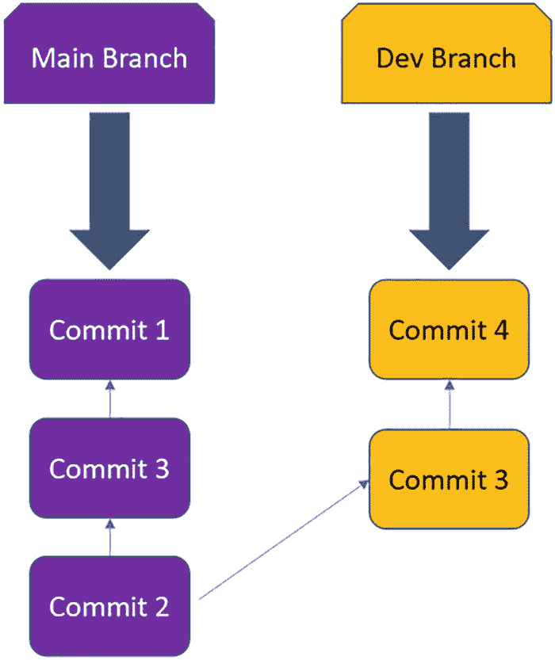

# 八、GitOps 洞察

部署和管理 Kubernetes 集群只是运行 Kubernetes 集群的生命周期的一部分，即使是在跨多个云的情况下。您还需要在 Kubernetes 上部署和运行您的应用程序。这是 Kubernetes 生命周期的一个关键方面，这是因为 Kubernetes 给业务带来的真正价值是通过在其上运行的应用程序。

为了理解团队如何在 Kubernetes 上部署和运行应用程序，理解一些现有的 DevOps 工具是很重要的。理解这个工具将有助于您理解 GitOps。

在这一章中，我们将深入探讨三个主题，包括 Git、GitHub，最后是 GitOps。我们将更详细地探索这些主题和工具，将所有这些联系起来，以获得对 GitOps 的理解。

## Git 概述

如果你正在读这本书，很可能你不是一个开发者。你可能是云工程师或者 DevOps 类型的。Git 对您来说可能是新东西，也可能不是。如果对您来说并不陌生，那么这一节将是对 Git 主题的一个很好的回顾。如果这对您来说是新的，请花些时间深入了解 Git 主题，因为它是当今技术世界的核心，从开发软件到基础设施即代码(IaC ),再到现在的 GitOps。Git 是一项核心技能，将在您的云之旅中很好地为您服务。

Git 是一个开源版本控制系统。它创建于 2005 年。它是当今最流行的版本控制系统。它是一个分布式版本控制系统，这意味着开发人员在一个成熟的存储库中拥有代码的本地快照。开发人员可以在本地处理代码，然后与服务器上的存储库同步。Git 工具在几乎所有主流操作系统(OS)上都得到支持和运行。Git 的总体目标如下:

**速度**

Git 应该帮助团队更快地发布他们开发的软件。这使得公司能够更快地向客户推出软件，更快地进行创新，从而在市场中获得竞争优势。

**分布式**

Git 应该是分布式的，而不是过去的集中式版本控制系统。这使得由多个开发人员组成的远程分布式团队更容易并行工作，允许开发人员即使在移动时(例如在飞机上飞行)也能继续工作，从而在开发软件时实现最大程度的灵活性。

**完整性**

Git 应该维护其存储库中的数据完整性。g it 在存储和引用所有数据之前对其进行校验和检查，这样就不可能在 Git 不知道更改的情况下修改文件或目录。

使用 Git 有多种方式，比如图形用户界面、其他工具的插件(比如 Microsoft VS Code)以及其他开发人员工具，最常见的是 Git 命令行。Git 命令行是包含所有 Git 命令的最健壮的命令行。因此，建议您在深入学习 Git 时熟悉 Git 命令。您最常使用的五个关键 Git 命令如下:

```
git clone

```

此命令将从远程存储库创建存储库的本地副本。

```
git add

```

此命令将执行一个阶段的更改，这些更改是更改跟踪过程的第一部分。这些分阶段的变更将成为下一次提交的一部分和存储库历史的一部分。

```
git commit

```

该命令创建变更的快照，也称为提交到存储库以完成变更跟踪过程。

```
git push

```

该命令将使用在本地对分支进行的提交来更新远程存储库。

```
git pull

```

该命令将使用来自远程存储库副本的更新来更新分支的本地提交行。

Git 命令的最新完整参考列表可以在这里找到: [`https://git-scm.com/docs/git#_git_commands`](https://git-scm.com/docs/git%2523_git_commands) 。

Git 的两个关键特性是分支和提交。分支是指向主分支中持续提交的指针。这是这看起来的样子(图 [8-1](#Fig1) )。



图 8-1

Git 分支的可视化表示

这是分支图像的分解。开始时，开发人员在主分支中执行了提交 1 和提交 2。在提交 2 之后，从主分支创建了一个名为 dev 的新分支。提交 3 和提交 4 是在 Dev 分支中进行的。请注意，我们的开发分支现在位于主分支的前面。为了将代码从 Dev 分支带回主分支，我们需要执行一个合并。

合并是指 Git 将来自两个分支的多个提交序列合并成一个统一的历史，通常在一个主分支中。合并从不同的分支中提取独立的开发路径，并将它们放入单个分支中。

因此，在我们使用 git 命令行的例子中，我们将运行以下命令将 Dev 合并到主分支中:

```
git checkout main

```

那就跑

```
git merge test

```

这是 Git 中分支和合并工作方式的一个非常基本的例子。现在让我们学习什么是提交。有不同类型的合并超出了本书的范围。

提交是您记录对存储库的更改的方式。它记录了开发人员自上次提交以来所做的更改。在 Git 中，当开发人员修改代码时，Git 会看到变化；这些变更将准备好被登台，这是由开发人员控制的，一旦登台，就使用`git commit`命令提交到存储库中。

这就结束了对 Git 的概述。Git 和使用 Git 还有很多工作要做。本节旨在为您提供 Git 的初步概述，以激发您的兴趣，并为您提供足够的基础知识，以便更好地理解 GitOps。有关 Git 的完整端到端细分，请参考 Git 官方网站上的文档: [`https://git-scm.com/book/en/v2`](https://git-scm.com/book/en/v2) 。

## GitHub 概述

您刚刚学习了什么是 Git，以及它是如何工作的。Git 是一个由工具和命令组成的版本控制系统，它本身只能带着软件开发/DevOps/cloud 团队到目前为止。使用 Git 的下一步是拥有一个平台来托管您的代码。一些使用 Git 的平台有 Azure DevOps、Bitbucket、AWS CodeCommit、GitLab 等等。在这一章中，我们将专门介绍 GitHub。

GitHub 是一个由 Git 支持的在线托管 Git 仓库的平台。GitHub 创建于 2007 年，微软于 2018 年 10 月收购了 GitHub。GitHub 托管远程存储库，并附带团队用于项目协作的附加功能。作为远程存储库的 GitHub 成为团队的统一事实来源。GitHub 被广泛使用，拥有 4000 多万用户和 1.9 亿多个存储库。GitHub 有通常用于开源项目的免费账户，也有供组织用于项目的付费账户。GitHub 的核心是 GitHub.com。有一个 GitHub 企业，它的功能类似于 GitHub.com，但它是自托管的，因此组织可以在自己的硬件上内部运行它。GitHub 比 GitHub Enterprise 更常用。图 [8-2](#Fig2) 展示了 GitHub.com 上的 Git 库是什么样子的。


图 8-2

GitHub.com 网站

有了 GitHub.com，就有了核心功能，比如访问控制、错误跟踪、特性请求、任务管理、持续集成等等。可以使用 Git 命令行访问 GitHub.com 存储库。还有许多桌面客户端、开发人员工具(如 VS Code)和 Git 插件可以与 GitHub.com 一起使用。所以总的来说，许多团队使用 GitHub 在 Git 存储库中托管他们的代码，并在项目上进行合作。自从微软收购 GitHub 后，他们一直致力于扩展 GitHub 的功能，并增加了更多的功能和产品。以下是 GitHub 的其他特性和产品:

github pages

托管静态网页的服务。

github 动作

一种在 GitHub 上托管的存储库中自动化和执行开发工作流的服务。

github 讨论

围绕开源项目的项目社区交流论坛。

**GitHub 包**

公共或私有软件包托管和管理服务。

**GitHub 洞察**

GitHub Enterprise 上软件交付过程的度量和分析报告服务。

github 桌面

用于与 GitHub 交互的桌面应用程序，使用 GUI 而不是 Git 命令行或通过 web 浏览器。

github CLI

用于与 GitHub 交互的命令行界面。

此外，GitHub 有一个 GitHub Marketplace，提供免费和付费的应用程序来扩展 GitHub 的功能。

这就结束了 GitHub 的概述。关于 GitHub 肯定还有更多需要学习的。学习 Git 和 GitHub 的最好方法是投入其中并开始使用它。使用 GitOps 的团队通常会使用 GitHub 在 Git 中托管他们的代码，所以在考虑采用 GitOps 之前，对 Git 和 GitHub 有一个坚实的理解是很重要的。

## GitOps 概述

在这一节中，我们将深入了解这一章中关于 GitOps 的核心内容！在我们真正深入 GitOps 之前，让我们先来探索 GitOps 解决的几个问题，帮助理解对 GitOps 的需求。

**问题:**在这个 DevOps 云原生时代，Ops 和 dev 之间的界限越来越模糊，导致 ops 相关活动转移到 dev。开发人员需要被说服、支持并接受如何执行 ops 相关活动的培训。这并不总是很顺利，因为让开发人员使用 ops 工具、理解 ops 实践并从事这些活动可能是一项艰巨的任务。

**解决方案:** GitOps 作为 Ops 工具的抽象，自动化 ops 实践，并通过抽象层使开发人员更容易承担 ops 活动，并使 Git 成为事实的来源并保持其作为核心工具。

**问题:**当部署到 Kubernetes 时，开发团队将构建一个应用程序，将其打包，然后交给运营团队进行部署。然后，运营团队将更新他们的 IaC 配置脚本，并使用它们将应用程序部署到 Kubernetes 集群。这种方法导致 Git 存储库中的代码与实际环境断开。例如，当需要更新应用程序或环境配置时，运营团队将对 IaC 配置脚本进行更新，并将它们手动应用到实际环境中。这是一个风险，因为可能无法始终正确跟踪变更，并且可能会发生配置漂移。

**解决方案:**应用程序和配置部署通过 GitOps 执行，使 Git 成为事实的来源，确保实时环境中的应用程序和环境配置与 Git 存储库中代码中指定的期望状态相匹配。

这只是 GitOps 解决问题的两个例子。GitOps 有许多额外的好处和使用案例。GitOps 的更多使用案例包括

*   服务推广

*   基础设施管理，即 K8s 集群、机队和微服务

*   云原生 App 管理，即 CI/CD 中的“CD”

现在让我们来看看 GitOps 是什么。GitOps 是由一家名为 Weaveworks 的公司创建的。在 2017 年公开发表博客之前，Weaveworks 已经在他们的 Kubernetes 环境中使用 GitOps 运营模型模式有一段时间了。GitOps 可以描述如下:

> *GitOps 是云原生应用的一种运营模式模式& Kubernetes 在 Git 中存储应用&声明性基础设施代码，作为用于自动化持续交付的真理源。*

GitOps 是 DevOps 的逻辑扩展，采用 DevOps 的最佳实践，如版本控制、协作和持续部署，并将这些应用于环境自动化，包括应用程序部署、配置和基础架构。GitOps 让 Git 成为描述整个系统理想状态的真实来源。GitOps 原则和实践并不新鲜，但它的名称和一些工具却很新鲜。例如，GitOps 原则是在代码中以声明性的方式描述环境的期望状态。这并不新鲜，因为我们一直在使用它，并通过诸如 Chef 和 Puppet 之类的工具将其应用到我们的环境中。主要的区别是 GitOps 将 Git 视为真理的来源，而其他工具则不是。以下是 GitOps 的原则和实践:

**GitOps 原理:**

*   **声明式配置**
    *   以声明方式描述的系统状态

*   **版本控制，不可变存储**
    *   Git 是真理的源泉。

    *   git 中对所需的系统状态进行了版本控制。

*   **自动交付**
    *   Git 作为自治代理执行操作(创建、更改、删除)的单一位置

*   **软件代理**
    *   被称为操作员的软件强制执行期望的状态并对漂移发出警报。

*   **闭环**
    *   经批准的系统状态变更的自动交付

**GitOps 做法:**

*   靠边推。

*   每个应用程序有 2 个回复。一个用于应用程序源代码，一个用于配置(清单)。

*   无论是在 Kubernetes secrets 还是其他秘密管理解决方案中，都要有一个秘密管理计划。

*   确保测试包含在您的 GitOps 流程中。

GitOps 的工作方式是，在 Git 中，有描述系统状态的代码，比如应用程序和配置。在 Kubernetes 的上下文中，Git 存储库中的代码将是 YAML 格式的 Kubernetes 清单文件，用于应用程序 pods 和 Kubernetes 集群中的任何其他配置，如机密、配置映射、部署、服务、入口等。

从那里，一个被称为 GitOps operator 的软件代理将监视 Git 存储库的任何更改，执行一个 pull，并通过 Kubectl 或 Helm 将更改应用到 Kubernetes 集群。这确保了真实环境的状态与 Git 中描述的期望状态相匹配。让我们来看看 GitOps 工作流的可视化表示(图 [8-3](#Fig3) )。


图 8-3

GitOps 工作流程示例

有许多 GitOps 操作符，但两个主要的是 Flux 和 Argo CD。Flux 和 Argo CD GitOps 运算符旨在与 Kubernetes 一起使用

一个经常出现的问题是，“我的组织没有使用 Kubernetes。GitOps 还适用于我们吗？”是的，GitOps 确实适用于你。GitOps 运营模式不仅限于 Kubernetes。实际上，您可以将 GitOps 用于任何可以以声明方式观察和描述的系统。

目前，大多数 GitOps 操作符都是为 Kubernetes 构建的，但也有一些操作符是为 Terraform 构建的。Kubestack 和 Atlantis 是两个直接使用 Terraform 的 GitOps 运营商。Kubestack 是一个用于在任何平台上构建 Kubernetes 的 Terraform GitOps 框架。Atlantis 是一家通过 Terraform Pull Request Automation 实现云的 GitOps 运营商。

现在让我们来看看 gitop 的主要优势，这对于理解 gitop 如何让您的团队和组织受益非常重要。GitOps 的主要优势如下:

*   **Git 作为事实的来源**增强了开发人员的体验并易于采用。

*   **持续同步**为您的环境带来更高的可靠性。

*   **Git**中跟踪的所有内容都会产生完整的审计跟踪，满足合规性，并具有更好的稳定性。

*   **持续安全**将访问权转移给 GitOps 运营商；安全变成代码；证件和国家隔离成为现实。

*   **一切都用一个代码**导致更容易回滚，更一致，&标准化。

现在让我们探索 GitOps 和 Azure Arc 支持的 Kubernetes。支持 Azure Arc 的 Kubernetes (Arc K8s)确实利用了 GitOps。Arc K8s 以两种方式使用 GitOps:第一种方式用于配置 Kubernetes，第二种方式用于将应用程序部署到 Kubernetes 集群。Arc K8s 使用助焊剂。Flux 是一个开源的 GitOps 操作器。Weaveworks 构建了 Flux 并对其进行了开源。Flux 是云原生计算沙盒项目的一部分。

Flux 操作符作为一个 pod 在 Kubernetes 集群上运行。Flux 操作符采用基于拉的方法将 Git 存储库与 Kubernetes 集群同步。Flux 操作员可以在您授予权限的 Kubernetes 集群上执行创建、更改和删除操作。Flux 操作者还可以不断地轮询容器注册中心或 Helm 存储库，以获得 Kubernetes 集群中需要的添加或更改。

这个 Flux 操作符用于同步 Kubernetes 集群配置和 Git 存储库中所需状态的配置，目标是通过创建、更改和删除操作来匹配这两者。

Arc K8s 集群和 Git 存储库的连接位于 Azure 资源管理器中。这个连接是一个名为 *Microsoft 的扩展资源。kubernetisconfiguration/sourcecontrolconfiguration s*。这个连接资源存储在 Azure Cosmos DB 数据库中。此连接在静态时是加密的。可以使用 Azure 门户或通过 Azure 命令行界面(CLI)建立连接。*源控制配置*具有以下属性:

*   配置名称

*   操作员实例名称

*   操作员名称空间

*   存储库 URL

*   操作员范围(名称空间/集群)

*   操作员类型

*   运算符参数

*   舵(启用/禁用)

在每个 Arc K8s 集群中可以有多个*source control configuration。这些配置可以局限于名称空间或集群级别。当组织有多环境或多租户需求时，这很有用。*

## 摘要

这使我们结束了这一章。在这一章中，我们进入了 Git 的世界，探索了它是什么以及它是如何工作的。然后我们进入 GitHub 的概述，它的历史，它是如何工作的，它的各种特性和产品。

然后，我们结束了这一章，转到 GitOps，分解了为什么需要它，它是什么，它的好处，原则和实践，以及它如何与 Azure Arc 一起发挥作用。本章的目标是给你 Git 和 GitHub 所需的背景知识，让它与 GitOps 完美结合，以便你在探索 Azure Arc 支持的 Kubernetes 和学习它如何利用 GitOps 时做好准备。