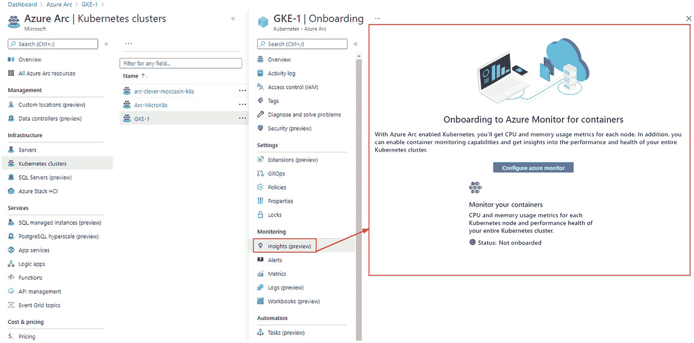
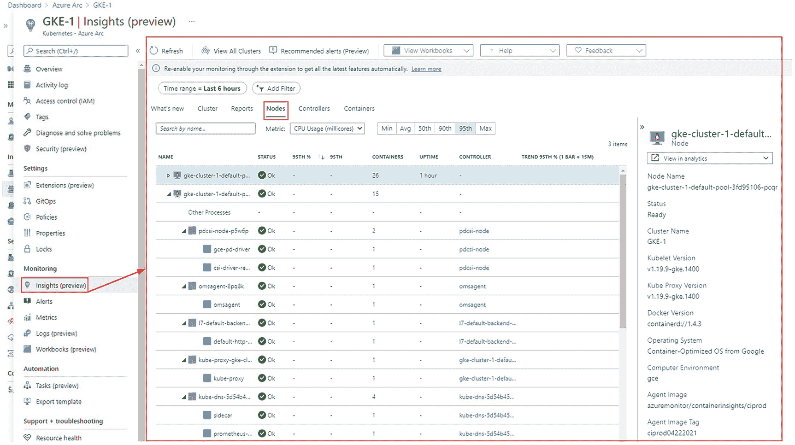
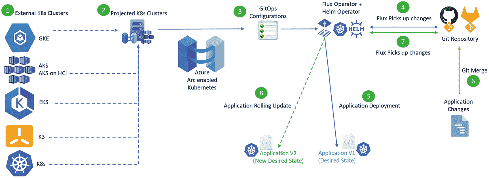

# 9.支持 Azure Arc 的 Kubernetes:入门

欢迎阅读“支持 Azure Arc 的 Kubernetes:入门”一章。Azure Arc 支持的 Kubernetes 是 Azure 中的一个较新的服务，正在获得巨大的吸引力。在这一章中，我们将深入研究使用 Azure Arc 和 Kubernetes 集群的工作。

在这一章中，我们将从什么是 Azure Arc-enabled Kubernetes 及其用例的概述开始，我们将探索它的架构。然后，我们将继续讨论如何设置支持 Azure Arc 的 Kubernetes，以及如何将其连接到外部 Kubernetes 集群。您还将了解如何利用 Azure Arc 跨内部或多云管理您的外部 Kubernetes 集群。我们将阐述如何扩展监控、安全扫描/保护、Azure Active Directory RBAC 控制以及 Kubernetes 集群的合规性策略。

我们将在本章结束时介绍如何利用 GitOps 和支持 Azure Arc 的 Kubernetes 将配置和应用程序部署到外部 Kubernetes 集群。

让我们开始吧，因为我们有一章是关于支持 Azure Arc 的 Kubernetes 的重要信息。

## 什么是支持 Azure Arc 的 Kubernetes

Azure Arc 是一个云解决方案，可满足组织的内部和多云管理需求。Azure Arc 将 Azure 功能扩展到 Azure 之外的环境。Azure Arc 使您能够在以下平台上创建和管理资源以及工作负载:

*   内部

*   非 Azure 云(即 GCP、AWS、阿里巴巴等。)

*   微软混合(Azure Stack Hub、Azure Stack HCI、Azure Stack Edge)

支持 Azure Arc 的 Kubernetes (Arc K8s)允许您将 Kubernetes 集群连接到运行在内部或非 Azure 云上的 Azure。Arc K8s 为在任何地方运行的工作负载带来了统一的 Azure 管理体验。

Azure Arc 有几个产品，一些处于 GA 状态，一些处于私有预览，一些处于公共预览。支持 Azure Arc 的 Kubernetes 已正式上市。启用 Azure Arc 的 Kubernetes 产品的定价是独一无二的，因为在管理启用 Azure Arc 的服务器和启用 Azure Arc 的 Kubernetes 集群时，它目前是免费提供的。面向服务器和 Kubernetes 的 Azure Arc 控制平面功能是免费提供的。被视为 Azure Arc 控制平面一部分的服务包括

*   将服务器和 Kubernetes 集群附加到 Azure

*   通过 Azure 管理组和标记进行资源组织

*   通过资源图进行搜索和索引

*   通过 Azure RBAC 和 Azure 订阅的访问和安全性

*   通过 ARM 模板和 Azure 扩展的环境和自动化

截至目前，支持 Azure Arc 的 Kubernetes 在以下特定地区可用:

*   美国东部

*   西欧

*   美国中西部

*   美国中南部

*   东南亚

*   英国南部

*   美国西部 2

*   澳大利亚东部

*   美国东部 2

*   北欧

*   美国中部

*   美国州长弗吉尼亚

*   法国中部

*   韩国中央电视台

*   日本东部

*   东亚

随着时间的推移，微软将为支持 Azure Arc 的 Kubernetes 添加越来越多的支持区域。建议在此处查看微软官方文档: [`https://docs.microsoft.com/en-us/azure/azure-arc/kubernetes/overview#supported-regions`](https://docs.microsoft.com/en-us/azure/azure-arc/kubernetes/overview%2523supported-regions) 了解有关支持 Azure Arc 的 Kubernetes 的地区列表的最新信息。

支持 Azure Arc 的 Kubernetes 支持任何经过云本地计算基金会(CNCF)认证的 Kubernetes 发行版。以下是支持 Azure Arc 的 Kubernetes 支持的本地和基于云的 Kubernetes 的示例列表:

*   种类

*   MicroK8s

*   牧场主 K3s

*   AK(蓝色库柏服务)

*   Azure 堆栈 HCI 上的 AK

*   EKS(亚马逊弹性库柏服务)

*   gke(Google kuble engine)

*   ACK(面向 Kubernetes 的阿里云容器服务)

*   蓝色 Red Hat OpenShift

支持 Azure Arc 的 Kubernetes 通过扩展和 GitOps 将许多 Azure 的原生功能带到了计划中的 Kubernetes 集群。其中包括

*   利用 Azure Monitor 和 Microsoft Defender for Cloud with Arc 来监控和保护预计的 Kubernetes 集群

*   使用 Azure Arc 和 Azure 策略管理计划的 Kubernetes 集群

*   利用 Azure Active Directory RBAC 对计划的 Kubernetes 集群进行授权和访问

*   与 GitOps (Flux GitOps operator)和 projected Kubernetes 集群集成

*   通过 GitOps 将应用程序和配置部署到预计的 Kubernetes 集群

*   通过 GitOps 将舵图部署到预计的 Kubernetes 集群

*   将物联网工作负载部署到边缘

*   在任何支持 Arc 的 Kubernetes 集群上运行 Azure 应用服务、功能、事件网格、Azure API 管理和逻辑应用

*   基于投影 Kubernetes 集群的服务网格，具有 mTLS 安全性、细粒度访问控制、流量转移、通过微软开放服务网格使用 Jaeger 功能进行跟踪

Note

微软一直在为 Azure Arc 添加更多的功能和能力，所以随着 Azure Arc 支持的 Kubernetes 的生命周期不断成熟，前面的列表将会随着时间的推移而增长。

我们想要讨论的关于 Azure Arc 启用的 Kubernetes 的最后一个主题是 Azure Arc 启用的 Kubernetes 和其他产品的比较。在讨论支持 Azure Arc 的 Kubernetes 时，这些问题总是会出现。

**天蓝色 Arc K8s vs 牧场主**

支持 Azure Arc 的 Kubernetes 集中管理内部或公共云上的 Kubernetes 集群，包括 Azure、GCP、AWS、edge、IoT 和 Hybrid (Azure Stack ),并将 Azure 原生工具和 GitOps 扩展到外部 Kubernetes 集群。

Rancher 集中管理和调配内部或公共云(包括 Azure、GCP 和 AWS)上的 Kubernetes 集群。将 Rancher 接口、应用程序目录、GitOps 和开源工具扩展到外部 Kubernetes 集群。

**Azure Arc K8s 与 Azure Stack Hub/AWS 前哨**

Azure Arc 将 Azure 功能扩展到 Azure 之外的环境，比如你的数据中心和其他云，如 AWS 和 GCP。

Azure Stack Hub/AWS outpost 和 Azure Arc 都支持混合云场景。Azure Stack 是一个混合云平台，可以让你在自己的数据中心运行 Azure。AWS Outposts 对在数据中心外运行 AWS 提出了同样的要求。

**天蓝色 Arc K8s vs. Anthos**

Google 提供 Anthos 作为一个托管应用平台，将 GCP 容器服务扩展到任何环境。GCP 的方法是将工作负载转移到运行在 GKE 上的容器中。

与 Anthos 相比，Azure Arc 允许客户运行虚拟机或容器。Arc 将 Azure 控制平面扩展到两者，并充当资源的总体管理层。Azure Arc 方法提供了灵活性，允许您在内部运行资源或在其他云上运行资源。

## 支持 Azure Arc 的 Kubernetes 用例

根据 New Stack 的“Kubernetes 生态系统第二版状况”报告，拥有 5000 名或更多员工的组织中有 61%的 Kubernetes 用户拥有五个以上的集群，拥有五个以上集群的 Kubernetes 用户的比例从 2017 年的 34%上升到 2019 年的 39%。

这是关于支持 Azure Arc 的 Kubernetes 的重要信息，因为今天许多组织都选择采用多云策略，包括跨多个云运行 Kubernetes。跨内部和多个云管理 Kubernetes 集群可能会脱节且过于复杂。支持 Azure Arc 的 Kubernetes 着手解决这一问题，并减少管理跨内部和多个云的多个 Kubernetes 集群带来的难题。

支持 Azure Arc 的 Kubernetes 帮助的几个用例如下:

*   Azure、谷歌云平台和亚马逊网络服务云之间的应用一致性

*   物联网应用的集中管理，用于管理采矿公司多个边缘位置的设备

*   在内部部署 Azure PaaS 服务以满足额外的合规性要求

请注意，这并不是 Azure Arc 支持的 Kubernetes 帮助的用例的详尽列表。

## azure arc-enabled kubers 体系结构

Azure Arc 支持的 Kubernetes 是运行在 Azure 中的 PaaS 服务，用于管理多个 Kubernetes 集群，而不管它们在哪里。支持 Azure Arc 的 Kubernetes 架构由 Azure 服务、资源、工具、代理以及在一个计划的 Kubernetes 集群上运行的大量部署和 pods 组成。现在让我们来看看支持 Azure Arc 的 Kubernetes 架构和代理。

在 Azure 中，在 Azure 订阅中需要以下资源提供者，以便您在其中运行启用 Azure Arc 的 Kubernetes 来支持启用 Azure Arc 的 Kubernetes:

*   `Microsoft.Kubernetes`

*   `Microsoft.KubernetesConfiguration`

*   `Microsoft.ExtendedLocation`

一个计划中的 Kubernetes 集群将运行一个支持 Azure Arc 的 Kubernetes 代理。为了使代理工作，需要在计划的 Kubernetes 集群网络上允许以下网络端口和协议/端点出站 URL:

**端口:**

*   端口 443 和端口 9418 上的 TCP

**允许从计划的 Kubernetes 群集出站的端点(DNS):**

*   [T2`https://management.azure.com`](https://management.azure.com)

*   [`https://eastus.dp.kubernetesconfiguration.azure.com`](https://eastus.dp.kubernetesconfiguration.azure.com)[`https://westeurope.dp.kubernetesconfiguration.azure.com`T5】](https://westeurope.dp.kubernetesconfiguration.azure.com)

*   [T2`https://login.microsoftonline.com`](https://login.microsoftonline.com)

*   [T2`https://mcr.microsoft.com`](https://mcr.microsoft.com)

*   [T2`https://eus.his.arc.azure.com`](https://eus.his.arc.azure.com)

*   [T2`https://weu.his.arc.azure.com`](https://weu.his.arc.azure.com)

在计划的 Kubernetes 集群上线后，计划的 Kubernetes 集群上将运行一个名为“azure-arc”的名称空间。

此外，在 azure-arc 名称空间中的 Kubernetes 集群上将运行一些操作符作为部署:

*   **配置代理**

当 sourceControlConfiguration 资源应用于项目集群时，它监视项目 Kubernetes 集群以更新符合性状态。

*   **控制者-管理者**

它编排 Azure Arc 组件之间的交互。一种用来操作其它操作符的操作符。

*   **指标-代理**

它从其他 Arc 代理收集指标来衡量性能并确保其处于最佳状态。

*   **聚类-元数据-运算符**

它收集集群和 Azure Arc 代理的版本、集群元数据和节点计数。

*   **资源同步代理**

它将 cluster-metadata-operator 收集的元数据与 Azure Arc 同步。

*   **clusteridentityoperator**

该操作员持有托管服务身份(MSI)证书，其他操作员使用该证书与 Azure 通信。

*   **通量记录剂**

作为 sourceControlConfiguration 的一部分，Flux 操作符被部署到计划的 Kubernetes 集群，这个代理从它们那里收集日志。

azure-arc 名称空间中的 Kubernetes 集群上将运行一些 pods，包括

*   **聚类-元数据-运算符** -b88f6695d-rf998

*   **cluster identity operator**-6459 FD 778 c-4wx 66

*   **配置代理** -6cc967f5-kd8b8

*   **控制器-管理器** -557d758b9f-f69vw

*   **flux-logs-agent**-5 db 8 BFF 9d 4-gktl 4

*   **度量-代理** -997cf95d5-h96gd

*   **资源同步代理** -587b999567-4kz64

这就是构成支持 Azure Arc 的 Kubernetes 的组件。该架构包括 Azure 服务、资源、工具、代理以及大量部署和 pod。

## 将 Kubernetes 集群连接到 Azure Arc

在开始将支持 Azure Arc 的 Kubernetes 与您的外部 Kubernetes 集群一起使用之前，您需要首先将其连接到 Azure Arc。将外部 Kubernetes 集群连接到 Azure Arc 的过程相当简单。在连接它之前，您确实需要具备一些先决条件。将 K8s 连接到 Azure Arc 的先决条件如下:

*   创建 Azure 服务主体(SP)。

*   启用 Azure Arc 的 Kubernetes 资源提供程序已启用。

*   需要安装 kubectl (Kubernetes 命令行)工具。

*   kubeconfig 文件(kubectl 上下文)配置为与您的 K8s 集群连接。

*   安装/更新头盔 3 或以上。

*   将 Azure CLI 安装/更新到版本 2.15.0 或更高版本。

*   Azure CLI 扩展连接了 k8s 和 k8s-已安装配置。

让我们来了解一下在将 Arc 连接到 Kubernetes 之前如何安装和设置先决条件:

首先，您需要在 Azure 订阅中创建一个服务主体(SP)。此 SP 将需要对订阅中的`Microsoft.Kubernetes/connectedClusters`资源类型的读写权限。

您还将使用此 SP 进行 az 登录和 az connectedk8s 连接。您可以通过在 Azure Cloud Shell 中运行一行语法来创建这个 SP。创建 SP 时，您需要将输出复制到安全的地方，因为稍后您将需要使用它。您可以使用以下语法创建带名称的 SP，并将其分配给特定订阅:

```
az ad sp create-for-rbac --name <SPNNAME> --role contributor --scope /subscriptions/<SUBSCRIPTIONID>

```

输出示例:

```
{
  "appId": "138r8633-v9g3-4f90-80d9-hg7924c823f9",
  "displayName": " SPNNAME ",
  "name": "http:// SPNNAME",
  "password": "5g2c85va-43ds-31f0-o6c6-rbg2c5av472g",
  "tenant": "9uh4qq35-q432-4j2v-h20r-6o24b11p53TW"
}

```

同样，确保复制输出，以便在需要时准备好。

接下来，你需要在我们的 Azure 订阅中注册一些支持 Azure Arc 的 Kubernetes 的资源提供者。

```
az provider register --namespace Microsoft.Kubernetes
az provider register --namespace Microsoft.KubernetesConfiguration
az provider register --namespace Microsoft.ExtendedLocation

```

然后你需要安装头盔。根据您安装 Helm 的平台，有多种安装方式。因为安装会根据您的平台而有所不同，所以最好参考 Helm install 链接来了解此过程的最新更新。这是舵安装的官方链接: [`https://helm.sh/docs/intro/install`](https://helm.sh/docs/intro/install) 。

接下来，将 Azure CLI 安装/更新到 2.15.0 或更高版本。可以在 Windows、macOS、Linux 环境下的 Azure CLI 中安装，也可以作为 Docker 容器运行。它还预装在 Azure Cloud Shell 中:

[T2`https://docs.microsoft.com/en-us/cli/azure/install-azure-cli`](https://docs.microsoft.com/en-us/cli/azure/install-azure-cli)

安装 Azure Arc K8s CLI 扩展来管理外部 Kubernetes 集群。

```
az extension add --name connectedk8s
az extension add --name k8s-configuration

```

这总结了我们在 Azure Arc 支持的 Kubernetes 先决条件方面需要做的事情。

### 将 Azure Arc 连接到 Azure Kubernetes 服务群集

现在让我们继续将 Kubernetes 集群连接到 Azure Arc。使用 SP 登录您的 Azure 订阅。从外部 Kubernetes 集群所在的 shell 中运行这个，也就是 GCP cloudshell。

```
az login --service-principal --username SPID --password SPPWD --tenant SPTENANTID

```

为计划的 Kubernetes 集群创建一个资源组。

```
az group create –location LOCATIONHERE --name RGNAME --subscription SUBSCRIPTIONID

```

我们现在可以将外部 Kubernetes 集群连接到 Azure Arc K8s。

```
az connectedk8s connect --name ARCK8SCLUSTERNAME --resource-group RGNAME ​--location LOCATIONHERE --tags ’Environment=dev-arc-cluster1’

```

连接后，它就变成了一个投影 K8s 集群，显示在 Azure 门户中。

预计的 Kubernetes 集群将以下列方式显示在 Azure 门户中:

*   它作为资源出现在 Azure 门户中。

*   它和其他 Azure 资源一样有标签。

*   它显示在您的 Azure 订阅和资源组中。

*   在门户中，它有一个 Azure 资源管理器 ID 和一个托管身份。

## 使用 Azure Arc 和 Azure Monitor 监控 Kubernetes 集群

监控您计划的 Kubernetes 集群和在其上运行的容器对于确保您的环境健康至关重要。Azure Monitor Container Insights 能够提供对连接到启用 Azure Arc 的 Kubernetes 的预计 Kubernetes 集群的监控。

Azure Monitor for Containers 为您提供了性能可见性，并将从您计划的 Kubernetes 节点和容器中收集内存和 CPU 利用率指标。在撰写本文时，Azure Monitor for Containers 不支持动态数据。

Azure Monitor 容器洞察可以

*   监控 Kubernetes 集群及其节点的性能。

*   确定在节点上运行的容器及其平均处理器和内存利用率。

*   确定容器在控制器或 pod 中的位置。

*   了解集群在平均负载和最大负载下的行为。

*   与 Prometheus 集成，查看它使用查询从节点和 Kubernetes 收集的应用程序和工作负载指标。

在入职前，将 Kubernetes 集群投影到 Azure Monitor Container Insights 中。



图 9-1

入职前 Azure Monitor 容器洞察

在您能够启用 Azure Monitor Container Insights 监控之前，您需要具备一些先决条件:

*   使用 Azure Monitor for containers 配置的日志分析工作区。

*   至少，您需要是 Azure 订阅中 Azure Contributor 角色的成员。

*   使用 Azure Monitor for containers 配置的日志分析工作区的日志分析参与者角色的成员。

*   Azure Arc 群集资源上参与者角色的成员。

*   日志分析读取器角色权限的成员。

*   HELM 客户端加载指定 Kubernetes 集群的 Azure Monitor for containers 图表。

*   需要允许以下 Microsoft 监控端点通过任何防火墙:

    ```
    *.ods.opinsights.azure.com
    *.oms.opinsights.azure.com
    dc.services.visualstudio.com
    *.monitoring.azure.com
    login.microsoftonline.com
    port 443 for all of them

    ```

让我们通过三种方式来实现针对 Azure Monitor Container Insights 的 Kubernetes 集群:

**#1 来自 Azure Monitor blade**

*   在 Azure 门户中，导航到“Monitor”刀片，并选择“Insights”菜单下的“Containers”选项。

*   选择“未监控的集群”选项卡以查看您可以对其启用监控的启用 Azure Arc 的 Kubernetes 集群。

*   单击要启用监视的集群旁边的“Enable”链接。

*   选择日志分析工作区，然后选择“配置”按钮继续。

**#2 来自预计的 K8s 集群资源刀片**

*   在 Azure 门户中，选择您想要监控的投影 Kubernetes 集群。

*   选择 resource blade 的“Monitoring”部分下的“Insights (preview)”项。

*   在 onboarding 页面上，选择“配置 Azure Monitor”按钮。

*   现在，您可以选择日志分析工作区来发送您的指标和日志数据。

*   选择“配置”按钮以部署 Azure Monitor Container Insights 群集扩展。

**#3 来自计划的 K8s 集群资源**

使用以下语法下载名为 enable-monitoring.sh 的“启用监控，又名 OMS”脚本:

```
     curl -o enable-monitoring.sh -L https://aka.ms/enable-monitoring-bash-script

```

接下来，使用以下语法检索 Azure Arc 连接的集群 Azure 资源 ID:

```
     export azureArcClusterResourceId=$(az resource show --resource-group PROJECTEDK8SRESOURCEGROUP --name PROJECTEDK8SCLUSTERNAME --resource-type "Microsoft.Kubernetes/connectedClusters" --query id -o tsv)

```

使用以下语法从当前 KubeContext 中检索计划的 Kubernetes 集群凭据:

```
     export kubeContext="$(kubectl config current-context)"

```

使用以下语法运行 enable-monitoring.sh 脚本:

```
     bash enable-monitoring.sh --resource-id $azureArcClusterResourceId ​--client-id SPNID --client-secret SPNPASSWORD --tenant-id TENANTID ​--kube-context $kubeContext

```

入职后，将 Kubernetes 集群纳入 Azure Monitor Container Insights。



图 9-2

入职后的 Azure Monitor 容器洞察

## 使用 Azure Arc 和 Azure AD RBAC 在 Kubernetes 集群上配置 RBAC

启用 Azure Arc 的 Kubernetes 的众多好处之一是能够利用身份提供者的 Azure Active Directory (AAD)来授权和访问您计划的 Kubernetes 集群。借助支持 RBAC 和 Azure Arc 的 Kubernetes，您可以使用 Azure AD 和角色分配来控制谁可以读取、写入和删除 Kubernetes 对象，如部署、pod 和服务。与 Kubernetes 自带的内置 RoleBinding 和 ClusterRoleBinding 相比，您可以使用 AAD RBAC 和角色分配来定义和控制对计划的 Kubernetes 集群的授权。本来，在 Kubernetes 中，RoleBinding 和 ClusterRoleBinding 通常用于定义和控制授权。

Note

Azure AD RBAC 与 Kubernetes 的集成不适用于非 Azure 管理的 Kubernetes 服务，如 AKE 和 GKE。这是因为对于 GKE 和 AKE 这样的服务，您无法访问 Kubernetes 集群 API 服务器。

Azure AD 和 Azure Arc Projected K8s 集成的先决条件:

*   Azure CLI 已安装。

*   已安装 Connectedk8s 扩展。

*   连接到您现有的 Azure Arc projected Kubernetes 集群。

设置 Azure AD 和 Azure Arc Projected K8s 集成有两个步骤

**#1 设置 Azure 广告应用**

*   创建服务器应用程序。

*   创建客户端应用程序。

*   为服务器应用程序创建角色分配。

**#2 在 K8s 集群上启用 Azure AD RBAC**

在您的项目 K8s 集群上运行以下命令以启用 Azure AD RBAC 功能:az connected K8s enable-features-n arc k8 sname-g rg name-features Azure-RBAC-app-id SPAPPID-app-secret sp pwd

Azure AD RBAC 集成具有角色分配，可以分配给计划的 Kubernetes 集群，并且可以使用 Azure 门户> Azure Arc 上的计划集群资源的访问控制(IAM)刀片来完成。角色分配如下:

*   **蓝色弧形立体检视器**
    *   允许只读访问以查看命名空间中的大多数对象。此角色不允许查看机密。

*   **蓝弧立方作家**
    *   允许对命名空间中的大多数对象进行读/写访问。此角色不允许查看或修改角色或角色绑定。

*   **蓝色弧库管理员**
    *   允许管理员访问。它旨在通过 RoleBinding 在名称空间内被授予。

*   **蓝弧立方簇管理员**
    *   允许超级用户对任何资源执行任何操作。

您可以创建自定义角色定义以在 Azure AD 角色分配中使用。这是一个分三步走的过程:

**步骤#1** 创建一个 **customrole.json** 文件，语法如下:

```
{
    "Name": "Arc Deployment Viewer",
    "Description": "Lets you view all deployments in cluster/namespace.",
    "Actions": [],
    "NotActions": [],
    "DataActions": [
        "Microsoft.Kubernetes/connectedClusters/apps/deployments/read"
    ],
    "NotDataActions": [],
    "assignableScopes": [
        "/subscriptions/<subscription-id>"
    ]
}

```

**步骤#2** 是使用以下命令从 customrole.json 文件创建**角色定义**:

az 角色定义创建-角色定义 mycustomrole.json

**步骤#3** 是使用您在步骤#1 中创建的自定义角色定义来创建**角色分配**。您将使用以下命令来创建角色分配:

```
az role assignment create --role "Arc Deployment Viewer" --assignee <AZURE-AD-ENTITY-ID> --scope $ARM_ID/namespaces/<namespace-name>

```

有两种方法可以连接到投影 K8s 集群:

**#1:集群连接功能(az connectedk8s 代理)**

```
az connectedk8s proxy -n ARCK8sNAME -g RGNAME

```

可以在前面的命令运行后运行 kubectl 命令。

**#2:使用 kubeconfig 文件**

为用户设置凭据:

```
kubectl config set-credentials user@domain.com \
--auth-provider=azure \
--auth-provider-arg=environment=AzurePublicCloud \
--auth-provider-arg=client-id=SPCLIENTID \
--auth-provider-arg=tenant-id=TENANTID \
--auth-provider-arg=apiserver-id=SPAPPID
#2 Add the config-mode setting under user > config –
name: user@domain.com
user:
    auth-provider:
    config:
        apiserver-id: $SERVER_APP_ID
        client-id: $CLIENT_APP_ID
        environment: AzurePublicCloud
        tenant-id: $TENANT_ID
        config-mode: "1"
    name: azure

```

现在可以运行 kubectl 命令了。

## 使用 Microsoft Defender for Cloud 和 Azure Arc 保护 Kubernetes 群集

Microsoft Defender for Cloud for Kubernetes clusters 扩展能够保护您计划在内部甚至在其他云中运行的 Kubernetes 集群。Defender 提供与 Azure Kubernetes 服务(AKS)群集相同的威胁检测和功能。

安全中心接收和分析的项目包括

*   来自 API 服务器的审计日志

*   来自日志分析代理的原始安全事件

*   来自计划的 Kubernetes 集群的集群配置信息

*   来自 Azure Policy 的工作负载配置(通过 Azure Arc projected Kubernetes 的 Azure Policy 插件)

让我们看看 Microsoft Defender for Cloud for Azure Arc-enabled Kubernetes 的先决条件:

*   您的订阅已启用 Microsoft Defender for Cloud for Kubernetes。

*   您的外部 Kubernetes 集群连接到 Azure Arc。

*   已经满足通用集群扩展的先决条件(Azure CLI、connectedk8s 和 k8s-扩展扩展、连接到 Arc 的投影 K8s 集群)。

为 Arc K8s 部署 Microsoft Defender for Cloud extension。

我们需要在 Azure Arc projected Kubernetes 集群上运行以下代码，以便为 Defender 启用它。

Note

在运行这段代码之前，您应该运行“az 登录”和“az 帐套”。

```
az k8s-extension create --name microsoft.azuredefender.kubernetes--cluster-type connectedClusters --cluster-name ARCK8sCLUSTERNAME--resource-group RGNAME --extension-type microsoft.azuredefender.kubernetes

```

## 使用 Azure Policy、Azure Arc 和 GitOps 强制执行 Kubernetes 集群的合规性

Azure 策略可用于在 Kubernetes 集群上强制合规。它最初用于 Azure Kubernetes 服务集群。随着支持 Azure Arc 的 Kubernetes 的引入，针对 Kubernetes 的 Azure 策略扩展到了外部 Kubernetes 集群。Azure Policy 也可以和 GitOps 一起使用。这是通过利用一个 GitOps Azure 策略定义来完成的，该策略定义将在您计划的 Kubernetes 集群上设置 GitOps 配置。

针对 Kubernetes 集群的 Azure 策略可以做两件事:

1.  应用策略以集中、一致的方式实施和保护您计划的 Kubernetes 集群。

2.  在 Azure Arc projected Kubernetes 集群上大规模应用 GitOps 配置。

目前，用于 Kubernetes 的 Azure 策略仅支持 Linux 节点池和内置策略定义。

Kubernetes 的 Azure 策略示例:

*   Kubernetes 集群容器应该只使用允许的图像。

*   应启用 Azure Kubernetes 服务专用群集。

*   Kubernetes 集群不应该使用默认的名称空间。

*   应在 Kubernetes 服务上定义授权的 IP 范围。

在部署和使用 Kubernetes 的 Azure Policy 之前，需要满足一些先决条件。这些先决条件如下:

*   已安装 Azure CLI 版本 2.12.0 或更高版本。

*   在您的订阅中注册的 Azure 策略提供程序:
    *   az 提供程序注册命名空间' Microsoft。“政策洞察”

*   Kubernetes 集群版本 1.14 或更高版本。

*   舵 3 或更高。

*   您的外部 Kubernetes 集群连接到 Azure Arc。

*   需要启用 Azure Arc 的 Kubernetes 集群的 Azure 资源 ID。

*   将“Policy Insights Data Writer(Preview)”角色分配给支持 Azure Arc 的 Kubernetes 集群。

让我们来探索一下 Azure 策略是如何为 Kubernetes 服务的。K8s 的 Azure Policy 基于开放策略代理实现，称为 Gatekeeper。K8s 的 Azure 策略由两部分组成:

*   看门人组件

*   azure-策略组件

当添加 Kubernetes 的 Azure Policy 扩展时，创建了一个名为 gatekeeper-system 的名称空间，其中部署了两个 pod:

1.  把关者-审核窗格

2.  网关守护设备控制器盒

Gatekeeper 组件安装在 gatekeeper-system 名称空间中，而 azure-policy 组件安装在 kube-system 名称空间中。

Kubernetes 的 Azure 策略有两种效果:审计和拒绝。这些细分如下:

1.  默认情况下，网关守护设备-审核窗格将检查群集是否违规。

2.  当操作设置为“拒绝”时，网关守护设备-控制器单元执行强制执行。

当部署满足 Kubernetes 策略条件的所有 Azure 策略时，它就被允许部署。当部署不满足所有策略条件时，它会拒绝部署。为了为 Arc Projected Kubernetes 集群安装 Azure Policy 附加组件，您需要将 Azure Policy 附加组件 repo 添加到 Helm，然后安装 Azure Policy 附加组件 Helm chart。您应该运行代码，将附加组件添加到 Helm repo，并从 Azure Arc projected Kubernetes 集群安装 helm chart。运行以下语法将 Azure Policy 附加组件回购到 Helm:

```
helm repo add azure-policy https://raw.githubusercontent.com/Azure/azure-policy/master/extensions/policy-addon-kubernetes/helm-charts

```

为了安装 Azure Policy 附加组件 Helm chart，请运行以下语法:

```
helm install azure-policy-addon azure-policy/azure-policy-addon-arc-clusters \
    --set azurepolicy.env.resourceid=<AzureArcClusterResourceId> \
    --set azurepolicy.env.clientid=<ServicePrincipalAppId> \
    --set azurepolicy.env.clientsecret=<ServicePrincipalPassword> \
    --set azurepolicy.env.tenantid=<ServicePrincipalTenantId>

```

为 Kubernetes 附加组件安装 Azure 策略后，下一步是为一个计划的 Kubernetes 集群分配一个 Azure 策略。您可以使用以下步骤来完成此操作:

*   在 Azure 门户中，单击左侧窗格中的所有服务，然后搜索策略。

*   在左侧窗格中的创作下，单击定义。

*   在“类别”下拉列表框中，单击“全选”以清除过滤器，然后在“过滤器”框中键入 Kubernetes 以将范围扩大到 Kubernetes。点击 Kubernetes。

*   选择策略定义；然后选择分配按钮。

*   Kubernetes 所在的范围(即管理组、订阅、资源组)来应用策略分配。

*   为您的策略分配提供名称和描述。

*   将策略强制设置为“启用”或“禁用”，然后单击“下一步”。

Note

如果强制模式设置为禁用，则不会强制实施策略效果(即，拒绝策略不会拒绝资源)。但是，合规性评估结果仍然可用。

*   设置您的参数(如果需要)。
    *   默认情况下，kube-system、gatekeeper-system 和 azure-arc 名称空间被设置为排除在外。这将从策略评估中排除这些命名空间。建议将它保留在原位。

*   点击查看+创建。

Kubernetes 附加组件的 Azure 策略的另一个用途是使用 Kubernetes 的 Azure 策略来应用 GitOps。通过针对 Kubernetes 的 Azure Policy，您可以将 GitOps 配置分配给计划的 Kubernetes 集群。还可以使用 Azure Policy 在 Azure Arc projected K8s 集群(`Microsoft.Kubernetes/connectedclusters`)上大规模应用 GitOps 配置(`Microsoft.KubernetesConfiguration/sourceControlConfigurations`资源类型)。

要为 Kubernetes 使用带有 Azure 策略的 GitOps，您可以使用内置的 GitOps 策略定义，并在您的 Kubernetes 集群上创建一个策略分配。您需要设置所需的参数，例如

```
Operator instance name
Operator namespace
Operator scope
Operator type
Operator parameters
Repository URL
...

```

## 了解 GitOps 和 Azure Arc 支持的 Kubernetes 架构和工作流

重申 GitOps 是什么很重要。“GitOps 是云原生应用程序和 Kubernetes 的一种操作模型模式，它将应用程序和声明性基础架构代码存储在 Git 中，作为用于自动化连续交付的事实来源。”支持 Azure Arc 的 Kubernetes 使用 Flux，这是一个由 Weaveworks 构建的开源 GitOps 操作符。支持 Azure Arc 的 Kubernetes 中的 GitOps 是一个计划的 Kubernetes 集群和 Git 存储库之间的连接，它通过一个 Flux 操作符作为一个 pod 在 Kubernetes 集群上运行。这个 Flux 操作符用于同步 Kubernetes 集群配置和 Git 存储库中所需状态的配置，目标是通过创建、更改和删除操作来匹配这两者。

这种同步是由 Flux 操作符通过一种基于拉的方法来完成的，在这种方法中，Flux 将不断地轮询 Git 存储库中的任何新的或变化，并将对 Kubernetes 集群进行任何创建或更新。支持 Azure Arc 的 Kubernetes 利用 GitOps 做两件事:

Kubernetes 配置的 **#1**

*   配置可以包括诸如名称空间、配置映射、机密、入口控制器、入口等对象。

**#2** 用于将应用程序部署到 Kubernetes

*   一个应用程序可以是部署、pod、服务、导航图等等。

支持 Azure Arc 的 Kubernetes 集群和 Git 存储库连接作为名为`Microsoft.KubernetesConfiguration/sourceControlConfigurations`的扩展资源存在于 ARM 中。这存储在一个静态加密的 Azure Cosmos DB 数据库中。对于每个支持 Azure Arc 的 Kubernetes 集群，可以有多个`sourceControlConfigurations`。这些可以限定在名称空间的范围内。这有助于多环境和多租户场景。

**源控制配置属性**包括

*   配置名称

*   操作员实例名称

*   操作员名称空间

*   存储库 URL

*   操作员范围(名称空间/集群)

*   操作员类型

*   运算符参数

*   舵(启用/禁用)

GitOps 还可以与支持 Azure Arc 的 Kubernetes 一起使用，以大规模管理大量 Kubernetes 集群的配置。这是通过使用 Azure 策略来实现的，只要 Kubernetes 集群一加入 Azure Arc，就在其上应用所需的 sourceControlConfigurations。如果您想在多个 Kubernetes 集群上应用相同的配置，比如监控代理、入口控制器、服务网格等等，那么可以使用这种方法。我们可以通过 Azure 门户或者 Azure CLI 来设置这个配置。下图是支持 Azure Arc 的 Kubernetes 的 GitOps 工作流/架构。



图 9-3

azure arc-enabled kubers gitops 工作流

## 在 Azure Arc 中设置 GitOps 配置

启用 Azure Arc 的 Kubernetes 中的 GitOps 设置非常简单。它只需要一些关于您的配置的核心信息，比如您的 GIT 存储库的 URL、私有的登录信息、命名空间或集群级别的范围等等。您有两个选项来设置它。您可以通过 GUI 或命令行来设置它。该设置使用以下选项工作:

**选项#1** 是在计划的 Kubernetes 集群上运行代码。例如，如果您正在运行 GKE，您可以将以下代码保存到一个名为“az_k8sconfig_gke.sh”的文件中，并通过 Google Cloud Shell 运行它:

```
az k8s-configuration create \
--name hello-arc \
--cluster-name $arcClusterName --resource-group $resourceGroup \
--operator-instance-name hello-arc --operator-namespace prod \
--enable-helm-operator \
--helm-operator-params='--set helm.versions=v3' \
--repository-url $appClonedRepo \
--scope namespace --cluster-type connectedClusters \
--operator-params="--git-poll-interval 3s --git-readonly --git-path=releases/prod"

```

**选项#2** 是通过 Azure 门户启用 GitOps 配置。

去蓝色方舟...。

单击“Add Configurations ”,并填写必需的属性和可选属性(如果需要):

*   配置名称

*   操作员实例名称

*   操作员名称空间

*   存储库 URL

*   操作员范围(名称空间/集群)

*   操作员类型

*   运算符参数

*   舵(启用/禁用)

单击添加。

Note

GitOps 配置状态将显示为挂起，最多需要 10 分钟才能变为已安装状态。

## 使用 GitOps 和 Azure Arc 将应用程序部署到计划的 Kubernetes 集群

您可以利用支持 Azure Arc 的 Kubernetes 的 GitOps 将应用程序部署到您的 Kubernetes 集群。一旦您在计划的 Kubernetes 集群上用支持 Azure Arc 的 Kubernetes 设置了 GitOps，这个过程就很简单了。以下步骤分解了在您计划的 Kubernetes 集群上部署应用程序的步骤:

*   开发人员编写应用程序，或者 DevOps 工程师编写用于配置 Kubernetes 集群的代码。

*   开发人员将代码推送到应用程序存储库的一个远程分支，并打开一个 pull 请求进行审查。

*   对拉取请求进行审查，以批准或拒绝合并。

*   根据需要验证更改。

*   领导或团队签署拉请求，变更被合并到主 Git 存储库中。

*   在很短的时间内(时间间隔由您设定)，Flux 将会注意到连接到 Flux GitOps 操作符的 Git 存储库中的新变化。

*   Flux GitOps 操作员将提取更改，并将其应用到计划的 Kubernetes 集群，从而部署应用程序和配置。

## 了解 Azure Arc 和 GitOps 如何与 Helm 一起工作

通过 GitOps 和支持 Azure Arc 的 Kubernetes 将基于 Helm 的应用程序部署到计划的 Kubernetes 集群类似于使用 Kubernetes 清单文件部署应用程序。从什么是头盔开始就有一些不同。让我们来看看理解掌舵图和 Azure Arc 支持的 Kubernetes 的一些要点:

*   Helm 是 Kubernetes 的包装经理。

*   Helm 用于管理 Kubernetes 上应用程序的生命周期。

*   支持 Azure Arc 的 Kubernetes 中的 Helm operator 为 Flux 提供了一个扩展，可以自动发布 Helm chart。

*   在 Arc K8s GitOps 配置中，舵被设置为禁用或启用。

*   操作员利用“HelmRelease”自定义资源定义(CRD)。

*   HelmRelease 可以将特定的值输入到一个 helm 图表中，这使得为不同的环境赋值变得很容易，比如 dev、stage、prod 等。

## 了解 Azure Arc 和 GitOps 如何处理物联网边缘工作负载

Azure 提供了一个将云分析和定制业务逻辑转移到设备上的产品。该产品被称为 Azure IoT Edge。物联网边缘将服务打包在边缘设备上运行的容器中。这些容器可以运行 Azure 服务、第三方服务或您自己的自定义代码。IoT Edge 与 IoT Hub 和 Azure 中的其他服务协同工作。物联网边缘运行 Kubernetes 作为物联网边缘应用可以运行的操作环境。支持 Azure Arc 的 Kubernetes 可以管理物联网边缘上的 Kubernetes 集群。GitOps 可用于通过支持 Azure Arc 的 Kubernetes 将物联网边缘工作负载部署到物联网边缘。支持 Azure Arc 的 Kubernetes 和 IoT Edge 的要点包括:

*   借助物联网边缘，您可以自带 K8s 集群，并在其中注册物联网边缘自定义资源定义(CRD)控制器。

*   Arc K8s 可用于操作运行物联网边缘的 K8s 集群，包括通过 GitOps 远程部署/管理大规模工作负载，以及执行与云服务(即物联网中心)的双向接收。

*   所有物联网边缘组件都限定在特定的 Kubernetes 名称空间范围内，允许您将单个集群用于多个边缘设备。

## 摘要

这使我们结束了这本书的最后一章。这本书介绍了 Azure Arc 的世界和它的两个主要产品:服务器和 Kubernetes。在这一章中，我们首先了解了支持 Azure Arc 的 Kubernetes 及其各种用例，并探讨了支持 Azure Arc 的 Kubernetes 架构，将 Arc 连接到 Kubernetes 集群，监控它们，保护它们，并在计划的 Kubernetes 集群上实施合规性。我们还学习了 GitOps 和支持 Azure Arc 的 Kubernetes，包括 GitOps 是什么，它如何与支持 Azure Arc 的 Kubernetes 一起工作，以及如何使用 GitOps 将配置和应用程序部署到计划的 Kubernetes 集群。感谢你在这本书里带领我们穿越 Azure Arc。