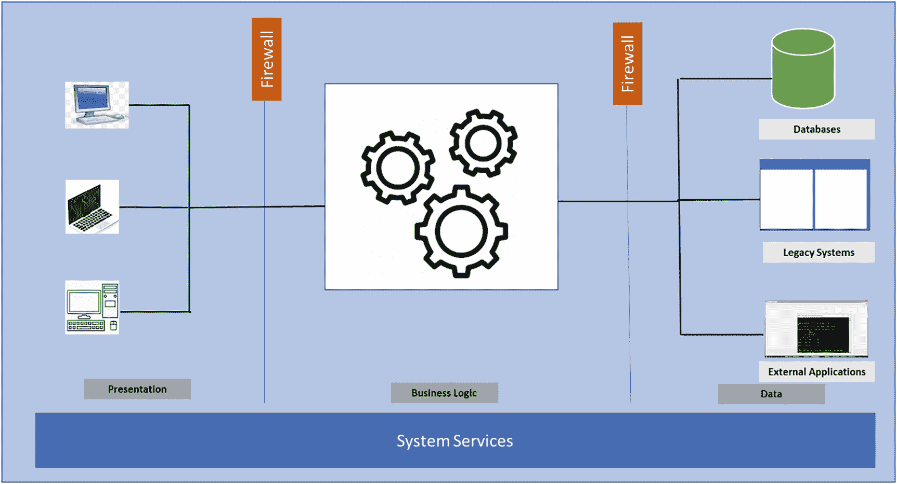
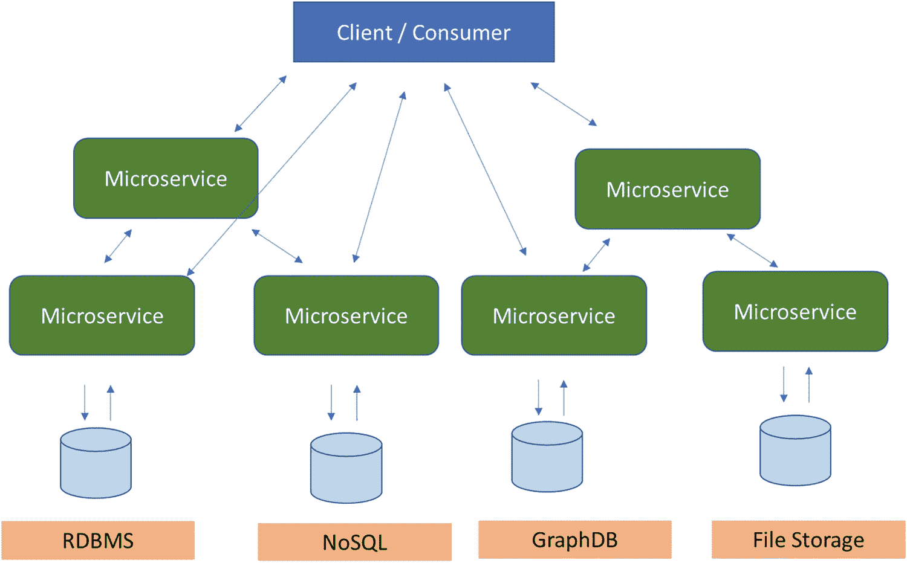
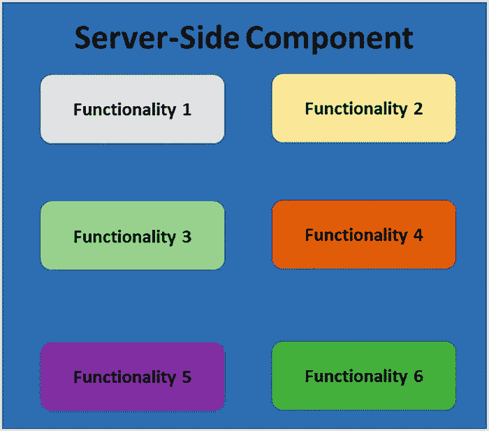
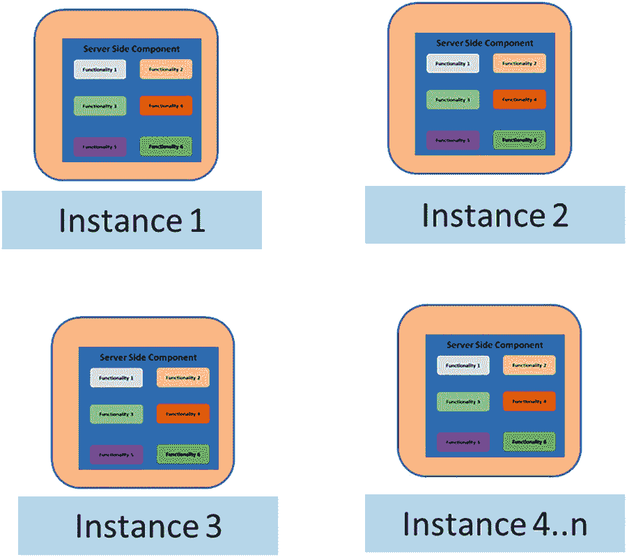
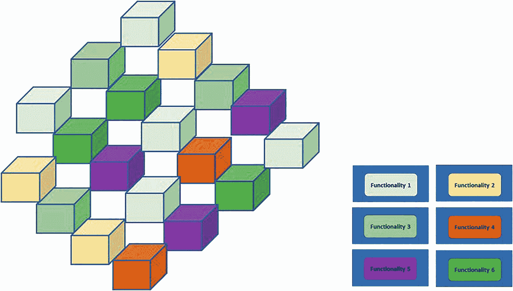
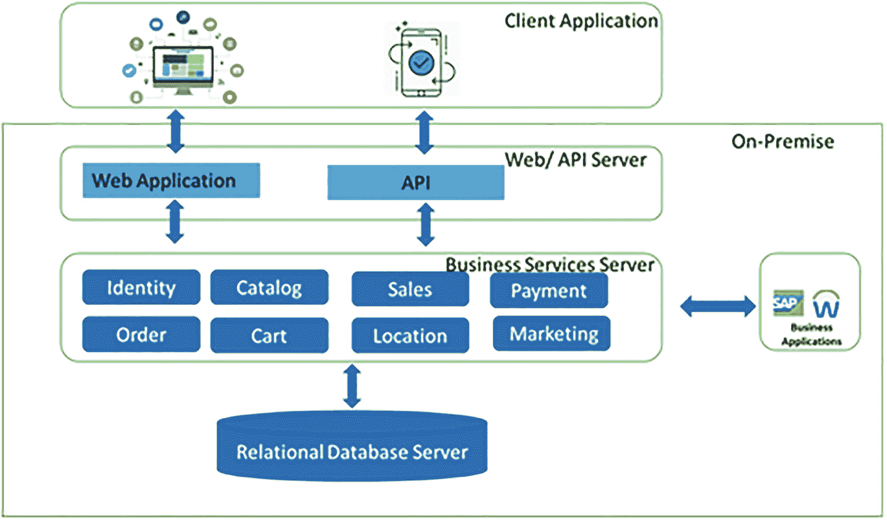
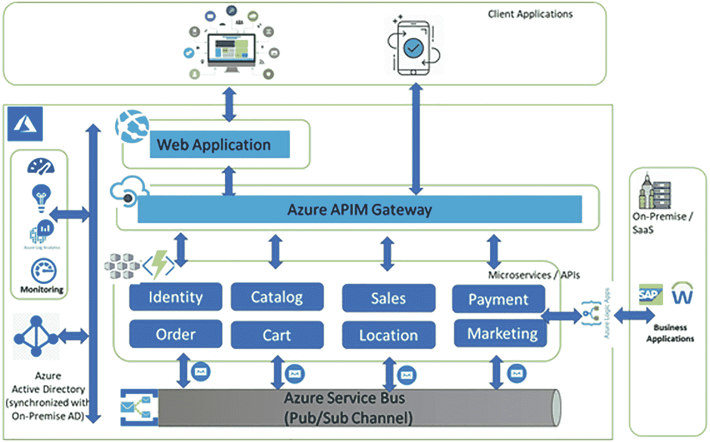
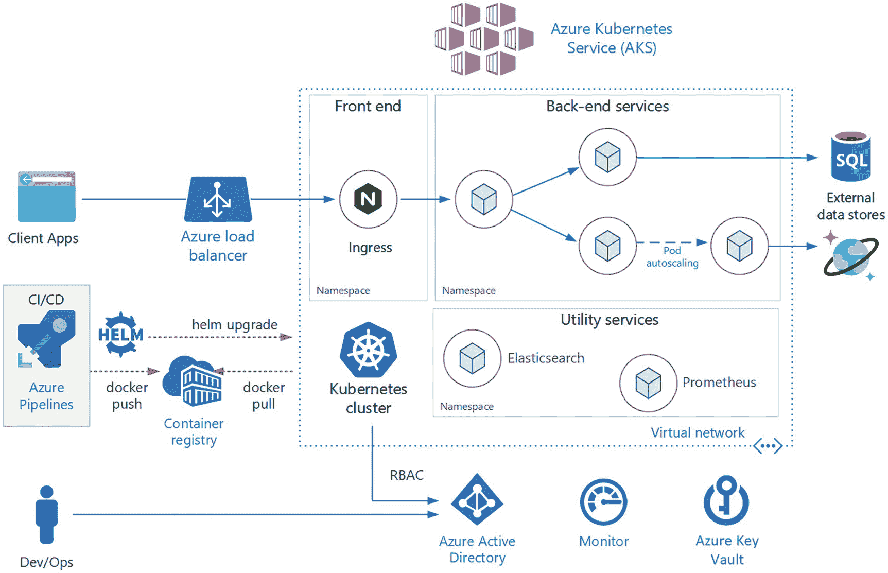

# 1.微服务和 AKS 简介

## 介绍

恭喜你，你向更好的理解微服务迈进了一步。这本书将帮助你决定何时使用微服务，以及如何使用微服务解决业务问题。如果你正在读这本书，你一定对设计和开发微服务感兴趣。也许您有兴趣通过为第三方构建面向外部的 API 来将您的业务暴露给新的市场，或者也许您希望敏捷地、更频繁地增量开发和部署软件。也许你不知道什么是微服务，但是你想了解这个大家都在谈论的新的架构风格。

无论你来这里的原因是什么，本章都将探讨什么是微服务，以及为什么在讨论现代化时微服务变得如此重要和常用。微服务是分布式和面向服务计算的重要一步，它们有可能彻底改变企业级大规模软件解决方案的开发方式，无论是现在还是将来。

本章涵盖:

*   软件开发向分布式计算的演变，以及它如何演变成“软件即服务”模型。

*   什么是微服务，什么时候用，为什么有用。

*   微服务架构风格带来的好处。

*   构建微服务的原则。

*   微服务如何与现有企业架构集成。

*   微服务的未来。

如果不了解软件开发世界向分布式计算的演变，你就无法欣赏微服务。因此，下一节回顾一下分布式计算是如何开始的，从哪里开始的。

## 分布式计算的历史

回顾一下分布式计算的历史，我们可以看到微服务是一种自然进化的结果。随着时间的推移，应用变得越来越松散，并被分割成多个组件。这使得应用可以分布在许多不同的机器上。这样，多个计算机资源可以用来为应用提供尽可能多的资源。

基本分布式计算的第一次商业应用涉及大型主机系统。这些昂贵的计算机可以处理许多通过哑终端登录的用户，哑终端本身没有处理能力。他们只是允许用户访问大型机系统上的可用资源。唯一的好处是这些哑终端可以位于大楼的任何地方，并且可以访问处理能力和资源所在的中央主机系统。

随着计算机变得越来越便宜，功能越来越强大，将它们放在员工的桌面上成为一种可行的选择。这改变了计算机的使用方式，因为人们可以使用相对强大的机器。使用一些本地处理能力是有意义的，而不是依赖大型机服务器来处理每个请求。

架构的进一步发展带来了下面几节中描述的改进。

### 客户

该模型包括一个中央服务器，其中包含一个数据库或另一个所有客户端都可以访问的中央数据存储(见图 [1-1](#Fig1) )。在将数据发送到服务器之前，客户端处理用户界面屏幕和部分或全部业务逻辑。这释放了服务器资源，使他们可以专注于处理数据存储。客户端机器利用全部资源来处理所有其他事情，并将应用的工作负载分布在多台机器上，从而减少了对单台机器的依赖。

图 1-1

客户

*   这种方法存在重大问题，因为维护时间和新的升级需要将新的应用版本发送到成百上千个桌面。他们被称为*胖客户端应用*，并且有 DLL 版本控制的问题，因为管理这些成为另一个噩梦。随着用户数量的增加，扩展这些应用变得成本高昂。由于多个连接导致的资源消耗增加，并且在不增加服务器处理能力的情况下，很难增加客户端机器的数量。

*   在万维网被广泛接受后，这个问题的解决方案是一种新的建筑风格。Web 应用导致了可以通过互联网浏览器访问的应用的构建。这些应用被称为*瘦客户机*，因为它们在客户机上使用的资源要少得多。Web 应用部署在 web 服务器上，业务逻辑嵌入在单独的服务器上。这是互联网和网络时代的开始，它解决了之前描述的大部分问题。

### 组件技术

随着客户机-服务器革命的加速，面向对象编程也在加速，朝着组件化设计的方向发展。一个*类*是最小的单元，围绕它的面向对象编程的原则导致了组件的设计和重用。这导致了微软世界中组件对象模型(COM)和分布式组件对象模型(DCOM)的出现。在 Java 世界中，企业 Java Beans 就是答案。接口契约是二元契约。web 应用的服务器端开始使用组件设计模式。

### 网络服务

现在，大多数 web 应用都是使用用户界面、组件和数据库的分层模型构建的。这些组件封装了业务规则和其他特定功能，并访问数据库。这催生了被称为 *web 服务*的技术转变/进步。Web 服务从根本上来说是一种分布式解决方案，它们的设计依赖于 HTTP 和 XML 等互联网标准。

这种架构风格提供了在幕后使用组件对象模型来开发核心业务逻辑的灵活性。消费者不知道幕后发生了什么，带来了抽象。这种风格还使开发人员和架构师能够通过利用技术和编程语言的选择来交付业务功能。这个概念很简单——一部分功能通过 web 界面公开，并通过标准的互联网协议(如 HTTP)访问。这意味着任何客户端都可以使用互联网对互联网上的任何服务器进行类似 RPC(远程过程调用)的调用，并接收 XML 形式的响应。来回发送的消息用一种特殊的 XML 方言编码，称为简单对象访问协议(SOAP)。外部客户端可以使用名为 DISCO 的发现协议来发现 web 服务，然后创建一个名为统一描述发现和集成(UDDI)的服务中央存储库。

### 面向服务的架构

接下来是向面向服务架构的演进，它定义了一种通过服务接口使软件组件可重用和可互操作的方法。服务使用单一的通用接口标准，因此可以在新的应用中快速合并和重用。这导致了重用和更多的可组合模式。这种架构模式利用了 web 服务设计模式，而这些 web 服务可以向外部世界公开以使用业务功能。在内部，业务功能可以由多个内部 web 服务组成，这些服务一起工作来交付业务服务。每个 SOA 服务都包含执行一个完整的、离散的业务功能所需的代码和数据(例如，它可以处理一个购物车，执行购物旅行的支付，等等)。).

这样，web 服务就被用来创建面向服务的架构。为了将一个应用连接到另一个系统中的数据或功能，开发人员需要复杂的点对点集成—开发人员必须为每个新的开发项目部分或全部重新创建集成。通过 SOA 服务公开这些功能允许开发人员简单地重用现有功能，并通过 SOA ESB 架构进行连接。因此，企业服务总线成为编排这些服务的单点。

使用 SOA 的架构风格提供了许多好处。随着使用 SOAP 的服务的发展，出现了一个新的思维过程，当基于 XML 的 SOAP 在复杂的实体或消息开始被交换的场景中变得沉重时，架构需要交换轻量级负载的服务。那时引入了表述性状态转移架构(REST ),因此服务可以交换主要基于 JSON 的消息和有效负载。与肥皂相比，这些很轻。REST 是专门为处理媒体组件、文件甚至硬件设备上的对象等组件而设计的。任何基于 REST 原则定义的 web 服务都可以称为 RESTful web 服务。RESTful 服务使用普通的 HTTP 动词 GET、POST、PUT 和 DELETE 来处理所需的组件。在当今世界，RESTFul web 服务非常流行。

然后出现了一种新的架构风格，叫做*微服务*，它最终变得非常流行。每个人都在谈论微服务，因为它们似乎是所有软件问题的解决方案，如新开发、遗留系统现代化等等。

这将带您进入下一个主题——什么是微服务，为什么需要微服务？它们是唯一的解决方案吗，其他的都应该扔掉吗？下一节将回答这些问题。

## 什么是微服务？

*微服务*无非是将软件应用设计成一组相互独立的服务的一种方式；它们可以相互部署，遵循自己独立的生命周期和版本。找不到完美的定义，但是这种架构风格是基于某些特征的，基于它们是如何围绕业务能力组织的，被称为*领域驱动设计*。它们的部署是端到端自动化的，遵循智能端点和哑管道的原则。这种架构风格还提供了分散的控制和治理，以及使用任何编程语言和任何类型的数据库存储的自由。

该领域的先驱詹姆斯·刘易斯和马丁·福勒对微服务有这样的评价:

> *微服务架构风格* *是一种将单个应用开发为一套小服务的方法，每个小服务都在自己的进程中运行，并通过轻量级机制(通常是 HTTP 资源 API)进行通信。这些服务是围绕业务功能构建的，可由全自动部署机器独立部署。这些服务可以用不同的编程语言编写，并使用不同的数据存储技术，只有最低限度的集中管理。*
> 
> ——*詹姆斯·刘易斯和马丁·福勒(2014)*

图 [1-2](#Fig2) 中的图表显示了微服务架构。

图 1-2

微服务架构

问题是，为什么需要微服务架构？为什么不能利用现有的服务来满足各种客户和外部消费者的需求呢？当通过互联网公开时，他们仍然可以在内部和外部使用业务功能，并且您知道使用 SOAP 或 RESTFul 服务的 web 服务已经提供了这种利用。那么为什么选择微服务呢？

为了更好地回答这个问题，您需要理解为什么在某些场景中，现有的服务驱动或面向服务的架构不够好。它对企业级客户没有帮助，这些客户是通过利用软件解决方案来推动其业务的大型企业。

## 单片与微服务

为了欣赏和理解微服务风格，最好理解应用的架构风格存在什么问题。一个 *monolith* 应用被构建为一个单一的单元，所有的组件被打包在一个单一的可部署单元中。企业应用通常由三个主要部分组成:客户端用户界面(由用户机器上的浏览器中运行的 HTML 页面和 JavaScript 组成)，以及服务器端应用。服务器端应用处理 HTTP 请求，执行域逻辑，从数据库中检索和更新数据，并选择和填充要发送到浏览器和数据库(由插入到一个公共的、通常是关系型的数据库管理系统中的许多表组成)的 HTML 视图。

这种服务器端应用通常是一个整体——单个逻辑可执行文件或二进制 DLL 或相关可执行文件或服务的组合。随着功能的增强，对系统的任何更改都意味着构建和部署新版本的服务器端应用。因此，基本上整个服务器端应用或其独立组件必须完全重建和部署。

单片服务器是构建这样一个系统的自然方法。处理请求的所有逻辑都在单个进程中运行，这允许您使用语言的基本特性将应用划分为类、函数和名称空间。小心地，您可以在开发人员的机器上运行和测试应用，并使用某种类型的部署自动化来确保更改被正确地测试并部署到生产中。您可以通过在负载平衡器后面的多个服务器上运行多个实例来水平扩展 monolith。

单片应用可能会取得成功，但人们对它们越来越感到失望——尤其是当更多的应用以高频率部署时。企业越来越频繁地引入新想法，他们希望将这些想法快速构建并部署到生产中，以获得客户的反馈。他们不能等待几个月的时间来将单个服务变更作为一个整体进行部署。

变更周期是联系在一起的——对应用的一小部分进行变更需要重新构建和部署整个应用。随着时间的推移，通常很难保持一个良好的模块化结构，这使得保持应该只影响该模块中一个模块的更改变得更加困难。扩展需要扩展整个应用，而不是部分应用。

面临的挑战是确定如何在不部署整个软件系统的情况下更频繁地部署软件变更，并在不干扰其余功能的情况下灵活地仅部署增强的服务。这导致了微服务架构风格，即将应用构建为一组服务。服务是可独立部署和扩展的，每个服务都提供了一个稳固的模块边界，甚至允许用不同的编程语言编写不同的服务。他们也可以由不同的团队管理。

monolith 应用将其所有的功能都放在一个单独的进程中，如图 [1-3](#Fig3) 所示。

图 1-3

一个整体服务器端应用

如图 [1-4](#Fig4) 所示，monolith 通过在多个服务器上自我复制来扩展。

图 1-4

攀登巨石

另一方面，微服务架构将每个功能元素放入一个单独的服务中，并拥有独立于其他服务的生命周期和版本。参见图 [1-5](#Fig5) 。

图 1-5

自给自足、隔离的微服务

微服务风格支持独立地扩展、部署和版本化服务，并在多个服务器上单独扩展它们。如果一个服务被快速消费，那么只有该服务被扩展，而其他服务不被扩展。

微服务架构可以立即按需供应和部署。它还可以在需求高时进行水平和垂直扩展，然后在需求恢复正常时收缩到标准操作。

当在数据中心使用标准的内部硬件部署时，这些特征会导致成本过高。这些挑战可以通过迁移到云平台来克服，如 Microsoft Azure、AWS、Google Cloud 以及类似的云平台和服务提供商，它们提供基础设施即服务(IaaS)、平台即服务(PaaS)和软件即服务(SaaS)功能。这为利用现代方法大规模按需开发和部署微服务创造了便利条件。这被称为 *DevOps* (开发和运营作为一个团队工作)，并导致产品开发方法而不是项目开发方法。这介绍了原生云开发的新领域，下一节将介绍原生云的含义。

## 云原生架构简介

回想一下，monolith 应用看起来有点像图 [1-6](#Fig6) 。这是一个典型的业务应用，你可以在任何企业中看到。

图 1-6

整体商业应用

您构建了一个包含所有领域逻辑的大型核心应用。它包括身份、目录、订购等模块。核心应用与大型关系数据库通信。核心通过 HTML 接口公开功能。

独石提供了一些独特的优势。它们很容易

*   建设

*   试验

*   部署

*   充当故障检修员

*   规模

今天存在的许多成功的应用都是作为整体开发的。这款应用很受欢迎，并在不断发展，一次又一次，增加了更多的功能。

随着应用功能的增加，它变得难以管理。开发人员发现他们失去了对应用的控制。随着时间的推移，这种感觉变得越来越强烈，他们最终会进入一种状态，即当引入新功能时，他们不确定应用将如何表现，因为它已经变得难以管理和控制。这个应用已经变得极其复杂，以至于没有人能够理解它。开发人员害怕做出改变，因为每个改变都可能有意想不到的和昂贵的副作用。实施新功能/修复变得棘手、耗时且昂贵。每个版本都尽可能小，并且需要完整部署整个应用。一个不稳定的组件会使整个系统崩溃。新技术和框架不是一个选项。实施敏捷交付方法是很困难的。随着代码库随着永无止境的“特例”而恶化，架构侵蚀开始了许多组织通过采用云原生架构来解决这种庞大的问题。当在云上构建和部署应用时，现在看起来如图 [1-7](#Fig7) 所示。

图 1-7

整体的云原生应用版本

该应用已经被分解到一组小型、孤立的微服务中。每个服务都是独立的，封装了自己的代码、数据和依赖关系。每一个都部署在一个软件容器中，由一个容器编制器管理。每个服务拥有自己的数据存储，而不是大型关系数据库，数据存储的类型根据数据需求而变化。请注意一些服务依赖于关系数据库，而另一些服务依赖于 NoSQL 数据库。一个服务将其状态存储在分布式缓存中。请注意，所有流量是如何通过 API 网关服务路由的，该服务负责将流量定向到核心后端服务，并实施许多横切关注点。最重要的是，该应用充分利用了现代云平台中的可伸缩性、可用性和弹性特性。

因此，云原生就是使用微服务等现代架构风格来设计应用，并利用原本可用于构建、测试和部署的云服务。它还利用了像 Azure DevOps 这样的 DevOps 工具。

原生云完全改变了开发者构建关键业务系统的思维方式。它旨在支持快速开发和部署。更大规模的频繁和更快的变化，建立了弹性和高可用性。

云原生计算基金会(CNCF)对云原生的定义如下:

*   *云原生技术使组织能够在现代动态环境(如公共云、私有云和混合云)中构建和运行可扩展的应用。容器、服务网格、微服务、不可变基础设施和声明式 API 就是这种方法的例子。*

*   这些技术使得松散耦合的系统具有弹性、可管理性和可观察性。与强大的自动化相结合，它们允许工程师以最少的劳动频繁地、可预测地做出高影响力的改变。

随着用户要求越来越多的功能，应用变得越来越复杂。企业用户期望在几乎零停机的情况下部署快速响应和创新功能。他们希望在维护期间最少停机或不停机，并希望应用具有按需性能和可扩展性。云原生提供了开发一系列业务应用所需的速度和敏捷性，这些业务应用正从单纯的业务功能演变为更具战略性的转变。它们让企业保持领先地位，并继续加速业务增长。

云原生平台上的现代应用开发基于一种被广泛接受的方法，称为*十二要素应用*。它描述了开发人员在构建针对现代云环境优化的应用时遵循的一系列原则和实践。特别关注跨环境的可移植性。

虽然适用于任何基于 web 的应用，但许多从业者认为 12 因素是构建云原生应用的坚实基础。基于这些原则构建的系统可以快速部署和扩展，并添加功能以快速应对市场变化*。*以下几点强调了十二因素方法:

*   **代码库**:每个微服务的单一代码库，存储在自己的存储库中。通过版本控制跟踪，它可以部署到多个环境(QA、试运行和生产)。

*   **依赖关系**:每个微服务隔离并打包自己的依赖关系，拥抱变化而不影响整个系统。

*   **配置**:配置信息被移出微服务，并通过代码外的配置管理工具具体化。通过应用正确的配置，相同的部署可以跨环境传播。

*   **后台服务**:辅助资源(数据存储、缓存和消息代理)应该通过一个可寻址的 URL 公开。这样做可以将资源从应用中分离出来，使其可以互换。

*   **构建发布运行**:每个发布都必须在构建、发布和运行阶段进行严格的分离。每个都应该用唯一的 ID 标记，并支持回滚的能力。现代 CI/CD 系统有助于实现这一原则。

*   **进程**:每个微服务应该在自己的进程中执行，与其他正在运行的服务隔离。将所需状态外部化到后台服务，如分布式缓存或数据存储。

*   **端口绑定**:每个微服务应该是自包含的，其接口和功能在自己的端口上公开。这样做可以提供与其他微服务的隔离。

*   **并发性**:服务跨大量相同的小进程(副本)扩展，而不是在最强大的机器上纵向扩展单个大型实例。

*   **可处置性**:服务实例应该是可处置的，有利于快速启动以增加可伸缩性机会，有利于正常关闭以使系统处于正确状态。Docker 容器和 orchestrator 天生就能满足这一需求。

*   **开发/生产对等**:在应用生命周期中保持环境尽可能相似，避免代价高昂的捷径。在这里，容器的采用可以通过促进相同的执行环境而做出巨大贡献。

*   **日志**:将微服务生成的日志视为事件流。使用事件聚合器处理它们，并将数据传播到数据挖掘/日志管理工具，如 Azure Monitor 或 Splunk，并最终进行长期归档。

*   **管理进程**:作为一次性进程运行行政/管理任务。任务可以包括数据清理和为报告提取分析。执行这些任务的工具应该从生产环境中调用，但与应用分开。

现代应用还引入了其他三个因素——API 优先设计、遥测技术以及身份验证和授权。

这些应用还需要考虑以下关键设计因素:

*   **通信**:前端和后端如何相互通信，微服务如何在不引入依赖性的情况下相互通信，可能通过松散耦合的消息传递模式，如队列或服务总线。

*   **弹性**:微服务架构将您的系统从进程内网络通信转移到进程外网络通信。在分布式架构中，当服务 B 不响应来自服务 A 的网络调用时会发生什么？或者，当服务 C 暂时不可用，而调用它的其他服务被阻塞时，会发生什么？

*   **分布式数据**:按照设计，每个微服务封装自己的数据，通过其公共接口公开操作。如果是，如何跨多个服务查询数据或实现事务？

*   **身份**:你的服务如何识别谁在访问它，他们有什么权限？

## 企业如何从云原生应用中获益

在当今的现代软件开发时代，企业正在利用技术推动业务发展，并努力实现数字化转型。企业需要快速引入创新的新想法，并在竞争之前部署它们。

考虑以下您将使用云原生应用和基于微服务的架构的原因。

*   战略性企业系统需要不断发展业务能力/特性。

*   一个应用需要高发布速度和高可信度。

*   一种系统，在这种系统中，必须在不完全重新部署整个系统的情况下发布单个功能。

*   由具有不同技术堆栈专业知识的团队开发的应用。

*   具有组件的应用必须能够独立地按需伸缩。

*   围绕现有应用的性能、可伸缩性和用户体验的非功能性需求应该被基线化，并相应地。

*   需要考虑外部和内部集成的依赖性，以重新设计应用并在云平台上创建云原生架构。

*   整体式应用对业务至关重要，并且通常受益于云优化的提升和转移迁移。

*   对部署进行优化，支持关键云服务，而不改变应用的核心架构。例如，您可以将应用容器化，并将其部署到容器编排器，如 Azure Kubernetes Services 等。一旦进入云中，应用就可以使用其他云服务，比如数据库、消息队列、监控和分布式缓存。

*   最后，执行战略性企业功能的单一应用可能会从云原生方法中获益最多。这种方法提供了敏捷性和速度。但是这是以重新搭建平台、重新架构和重写代码为代价的。

如果您专注于回答这些问题，这种云原生方法是合适的—云原生方法将解决的业务问题到底是什么？它如何与业务需求保持一致？

在业务驱动要求不高的场景中，一个整体仍然可以满足业务需求。微服务架构需要易于部署、按需扩展和可用性，以及应用监控、日志记录和遥测。这些非功能性需求由云平台提供，但一个更重要的特性是按需扩展。这就把我们带到了容器和容器化的世界。微服务可以很容易地部署在容器上。但是这些容器需要一种机制来编排、管理和治理。这就是像 Kubernetes 这样的服务出现的原因。否则，将不得不开发容器管理和编排，这是一个在企业范围内开发的复杂领域。下一节将介绍 Azure Kubernetes 服务(AKS)并描述其组件。

## AKS 及其组件介绍

现在，您已经了解了什么是微服务，并且知道云平台为开发和部署微服务提供了本机支持，您可以看看如何利用容器来部署微服务。本节介绍了 Azure Kubernetes 服务。

Kubernetes 是一个用于部署容器化应用的开源 orchestrator。它最初是由 Google 开发的，灵感来自于十年来通过面向应用的 API 在容器中部署可伸缩的、可靠的系统的经验。

自 2014 年推出以来，Kubernetes 已经发展成为世界上最大、最受欢迎的开源项目之一。它已经成为构建云原生应用的标准 API，几乎存在于每个公共云中。

Kubernetes 是分布式系统的成熟基础设施，适合各种规模的云原生开发人员，从一群 Raspberry Pi 计算机到装满最新机器的仓库。它提供了成功构建和部署可靠的、可伸缩的分布式系统所必需的软件。

您可能想知道“可靠的、可伸缩的分布式系统”是什么意思越来越多的服务可以通过 API 在网络上交付。这些 API 通常由分布式系统交付，实现 API 的各个部分运行在不同的机器上，通过网络连接，并通过网络通信协调它们的动作。因为人们在日常生活的各个方面越来越依赖这些 API(例如，找到去最近医院的方向)，所以这些系统必须高度可靠。即使系统的一部分崩溃或停止工作，它们也不会失败。同样，即使在软件发布或其他维护事件期间，他们也必须保持可用性。最后，由于越来越多的人在网上使用这样的服务，它们必须是高度可伸缩的，这样它们就可以增加容量并跟上不断增长的使用，而无需对实现服务的分布式系统进行彻底的重新设计。

公司使用像 Kubernetes 这样的容器和容器 API 有许多原因，但它们都可以追溯到以下好处之一:

*   速度

*   (软件和团队的)扩展

*   抽象基础设施

*   效率

容器是 Azure Kubernetes 服务中部署的基本单元。

Kubernetes 是一个创建、部署和管理分布式应用的平台。

这些应用有许多不同的形状和大小，但最终，它们都是由一个或多个运行在单独机器上的程序组成的。

这些程序接受输入，处理数据，然后返回结果。在您考虑构建分布式系统之前，您必须首先考虑如何构建包含这些程序的应用容器映像，并组成分布式系统的各个部分。

应用通常由语言运行时、库和源代码组成。在许多情况下，您的应用依赖于外部共享库。这些外部库通常作为安装在特定机器上的操作系统中的共享组件提供。

当在程序员的机器上开发的应用对共享库有依赖性时，这种对共享库的依赖性会导致问题，而当程序被部署到生产操作系统时，共享库是不可用的。即使开发和生产环境共享相同版本的操作系统，当开发人员忘记将相关资产文件包含在他们部署到生产环境的包中时，也会出现问题。

在一台机器上运行多个程序的传统方法要求所有这些程序在系统上共享相同版本的共享库。如果不同的程序是由不同的团队或组织开发的，这些共享的依赖增加了这些团队之间不必要的复杂性和耦合。

一个程序只有被可靠地部署到它应该运行的机器上才能成功执行。太多时候，最新的部署技术涉及到运行命令式脚本，这不可避免地会有曲折和复杂的失败案例。

这使得推出分布式系统的全部或部分新版本的任务变得困难。

使用应用时，以一种易于与他人共享的方式对它们进行打包通常会很有帮助。Docker 是默认的容器运行时引擎，它使得打包一个可执行文件并将其推送到远程注册表变得很容易，在那里它可以被其他人提取。在撰写本文时，容器注册中心在所有主要的公共云中都可用，在云中构建映像的服务也在其中的许多云中可用。您也可以使用开源或商业系统运行自己的注册表。这些注册表使用户能够轻松管理和部署私有映像，而映像构建器服务则提供了与持续交付系统的轻松集成。

容器映像将程序及其依赖项捆绑到根文件系统下的单个工件中。最流行的容器图像格式是 Docker 图像格式，它已经由开放容器倡议组织标准化为 OCI 图像格式。Kubernetes 通过 Docker 和其他运行时支持 Docker 和 OCI 兼容的映像。Docker 映像还包括容器运行时使用的附加元数据，以基于容器映像的内容启动正在运行的应用实例。

### 容器图像

容器映像是一个二进制包，它封装了在 OS 容器中运行程序所需的所有文件。根据您第一次使用容器的方式，您可以从本地文件系统构建一个容器映像，也可以从容器注册中心下载一个预先存在的映像。在这两种情况下，一旦容器映像出现在您的计算机上，您就可以运行该映像以在 OS 容器中生成一个正在运行的应用。

最流行和广泛使用的容器图像格式是 Docker 图像格式，它是由 Docker 开源项目开发的，用于使用`docker`命令打包、分发和运行容器。随后，Docker 公司和其他公司开始通过开放容器倡议(OCI)项目对容器图像格式进行标准化。虽然 OCI 标准在 2017 年年中实现了 1.0 版本的里程碑，但这些标准的采用进展缓慢。Docker 映像格式仍然是事实上的标准，由一系列文件系统层组成。每一层都从文件系统中的前一层添加、删除或修改文件。这是一个覆盖文件系统的例子。在打包图像和使用图像时都会用到覆盖系统。

在运行时，这种文件系统有各种具体的实现，包括 aufs、overlay 和 overlay2。

接下来的小节将介绍驱动 Kubernetes 集群的各种组件。

#### 集群

在最高级别，Kubernetes 被组织为一个虚拟或本地机器集群。这些被称为*节点*的机器共享计算、网络和存储资源。每个集群都有一个连接到一个或多个工作节点的主节点。工作节点负责运行多组容器化的应用和工作负载，称为**，主节点管理哪些容器在哪些工作节点上运行。**

 **#### 控制平面

为了让主节点与工作节点通信，也为了让一个人与主节点通信，Kubernetes 包含了许多对象，它们共同构成了控制平面。开发人员和操作员主要通过主节点使用`kubectl`与集群交互，这是一个安装在他们本地操作系统上的命令行界面。通过`kubectl`发布到集群的命令由驻留在主节点上的 Kubernetes API`kube-apiserver`接收。然后，`kube-apiserver`将请求传递给主节点中的`kube-controller-manager`，后者负责处理工作节点操作。来自主节点的命令由工作节点上的 kubelet 接收。

#### 部署应用和工作负载

Kubernetes 的下一步是部署应用和工作负载。主节点始终维护 Kubernetes 集群的当前状态和`etcd`中的配置，这是一个键值存储数据库。要使用容器化的应用和工作负载运行 pods，您需要以 YAML 文件的形式向集群描述一个新的期望状态。`kube-controller-manager`获取 YAML 文件，并让`kube-scheduler`根据预先确定的约束决定应用或工作负载应该运行哪些工作节点。`kube-scheduler`与每个工作者节点的 kubelet 协同工作，启动 pod，监视机器的状态，并全面负责资源管理。

图 1-8 显示了一个典型的 Azure Kubernetes 参考实现的样子。

图 1-8

Azure Kubernetes 服务参考架构(由微软 AKS 文档提供)

图 [1-8](#Fig8) 中的部件定义如下:

*   **Azure Kubernetes 服务**是一个托管的 Kubernetes 集群，托管在 Azure 云平台上。使用 AKS 时，Azure 管理 Kubernetes API 服务，你只需要管理代理节点。

*   **部署 AKS 集群需要虚拟网络**。默认情况下，AKS 会创建一个代理节点连接到的虚拟网络。通过在部署 AKS 集群之前创建自定义虚拟网络，可以处理更高级的场景。

*   **入口服务器**将 HTTP(S)路由暴露给集群内的服务。您将在后续章节中通过更多示例了解这一点。

*   **Azure 负载均衡器**在创建 AKS 集群后创建。负载平衡器将配置一个新的公共 IP 地址，它将作为入口控制器的前端。这样，负载平衡器将流量路由到入口。

*   **外部数据存储**用于驱动来自 Azure SQL 数据库、Cosmos DB 等服务的微服务数据。

*   **Azure Active Directory** 是通过创建身份和管理其他 Azure 资源来为集群提供安全性的关键元素。它还用于从客户端应用对用户进行身份验证和授权。

*   **Azure Container Registry** 存储私有 Docker 映像，这些映像被部署到集群中。AKS 可以使用其 Azure AD 身份向容器注册表进行身份验证。注意，AKS 不需要 Azure 容器注册表。您可以使用其他容器注册中心，比如 Docker Hub。

*   Helm 是 Kubernetes 的一个包管理器，这是一种将 Kubernetes 对象捆绑和概括成一个可以发布、部署、版本化和更新的单元的方法。

您看到了微服务如何使业务驱动因素受益，以及像 Microsoft Azure 这样的云平台如何支持微服务的部署。Azure Kubernetes 服务是在 Azure 平台上部署微服务的方式之一。

## 摘要

本章描述了软件开发世界的演变，并解释了大型机系统是如何演变成客户机-服务器和面向服务的体系结构的。

您还了解了架构风格的各种挑战，微服务架构是如何引入的，以及它给现代业务环境带来的好处。

本章还介绍了云原生应用以及它们如何为企业业务带来好处。您了解了当今时代的企业如何希望领先于竞争对手，以及云原生和微服务架构如何通过使软件开发更加快速、可扩展和敏捷来帮助他们实现这一目标。

还向您介绍了容器和 Azure Kubernetes 服务，并了解了微服务如何利用它们来简化部署和扩展。

您在本章中没有看到任何代码，这是故意的，以便您可以首先理解微服务为什么重要以及在什么场景中重要。

下一章将举例说明微服务并解释重要的设计注意事项。

## 附录

[T2`https://martinfowler.com/microservices/`](https://martinfowler.com/microservices/)

[T2`https://docs.microsoft.com/en-us/azure/architecture/reference-architectures/containers/aks-microservices/aks-microservices`](https://docs.microsoft.com/en-us/azure/architecture/reference-architectures/containers/aks-microservices/aks-microservices)

[T2`https://www.cncf.io/`](https://www.cncf.io/)**