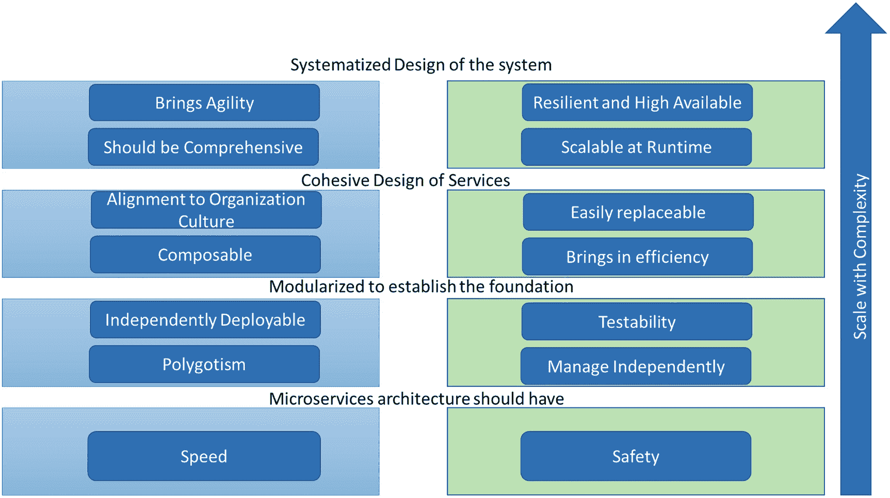
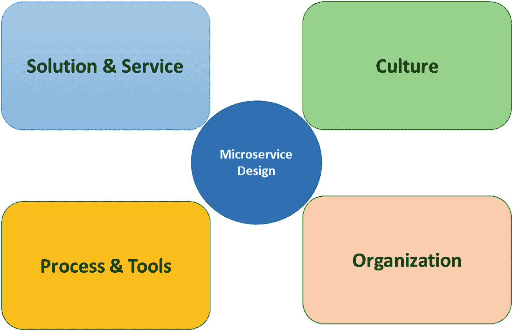
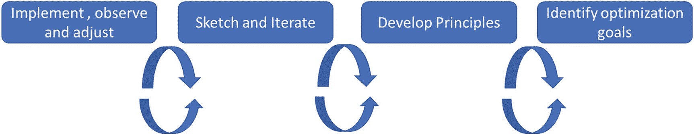

# 二、微服务：架构和设计考虑

## 介绍

现在，您已经了解了分布式计算的发展，并了解了现代模式，这些模式提供了更健壮、更可伸缩、更快速的服务，本章将介绍架构和设计的微服务考虑事项。

然后，您将深入了解什么是容器，以及为什么需要像 Kubernetes 这样的框架和工具。

## 微服务架构优势

为什么组织要采用微服务？动机和挑战是什么？这些组织的领导者如何判断接受管理一组小型、松散耦合、可独立部署的服务的挑战对公司来说是有回报的？他们如何衡量成功？微服务早期采用者对这些问题的回答差异很大。然而，出现了一些共同的主题，并与“在规模上平衡速度和安全”的口号联系在一起

Amazon 对其架构的优势描述如下:

我们可以独立扩展我们的运营，保持无与伦比的系统可用性，并快速引入新服务，而无需大规模重新配置。

通过关注可伸缩性和组件独立性，Amazon 已经能够提高他们的交付速度，同时也提高了他们环境的安全性——以可伸缩性和可用性的形式。

*   减少团队之间的依赖性，从而更快地将代码投入生产

*   允许大量计划并行运行

*   支持多种技术/语言/框架

*   支持服务的适度降级

*   通过一次性代码促进创新——很容易失败并继续前进

前三点有助于加快软件开发，通过组织的联合和独立部署的能力，以及多语言。最后两点说明了有利于服务可替换性的安全环境。

社交媒体先驱 Hootsuite 根据系统的可调性观察到了他们采用微服务的效率优势:

有些服务要求高可用性，但数量很少，其他服务则相反。微服务方法允许我们针对这两种情况进行调整，而在 monolith 中，要么全有，要么全无。

这里的主要驱动因素是速度，这是企业直接要求的。然而，还强调了安全性——通过独立部署的能力和可测试性——以及通过可组合性的未来发展。

通过采用微服务，他们能够克服这个问题，并提高软件系统的可理解性。

从这些实现故事中可以看到一些共同的目标和好处。

随着功能范围的扩大，提高软件交付速度的目标是通过更大的敏捷性、更高的可组合性、更好的可理解性、独立部署服务的能力、组织一致性和多语言性来实现的。通过更高的可用性和弹性、更高的效率、组件的独立可管理性和可替换性、更高的运行时可伸缩性以及更简化的可测试性，实现了随着规模的增加而维护软件系统安全性的目标。

现在，您已经了解了这些目标和优势，让我们探索这些目标和优势如何为利用微服务架构的组织带来商业价值。

## 衍生商业价值

成功的公司专注于提高软件交付速度，因为他们被业务的速度所驱使。类似地，在组织的软件系统中实现的安全级别应该与特定的业务目标相关联。相反，安全措施不得不必要地妨碍速度。需要平衡。

对于每个组织来说，这种平衡是其交付速度、系统安全性以及组织功能范围和规模增长的函数。每个组织都有自己的平衡。与零售银行相比，一家旨在让尽可能多的受众了解其内容的媒体公司可能更看重交付速度，而零售银行的合规性要求要求采取特定的安全措施。尽管如此，在日益数字化的经济中，越来越多的公司认识到软件开发需要成为他们的核心竞争力之一。

在这个新的商业环境中，破坏性的竞争对手可以跨越行业边界或似乎一夜之间从零开始，快速的软件交付对于保持竞争优势和实现可持续增长至关重要。事实上，微服务架构的每一项优势都有助于提高交付速度并创造真正的商业价值:

*   *敏捷性*允许组织更快地交付新产品、功能和特性，并在需要时更容易地进行调整。

*   *可组合性*减少了开发时间，并随着时间的推移通过可重用性提供了复合优势。

*   软件系统的可理解性简化了开发计划，提高了准确性，并允许新的资源更快地投入使用。

*   *组件的独立可部署性*将新功能更快地投入生产，并为试点和原型制作提供更灵活的选项。

*   团队服务的组织一致性减少了加速时间，并鼓励团队迭代地构建更复杂的产品和功能。

*   *通晓多种语言*允许使用合适的工具完成合适的任务，从而加快技术引进并增加解决方案选择。同样，数字原生消费者期望永远在线的服务，并且不羞于改变企业忠诚度。停机或信息丢失会导致他们将业务转移到其他地方。一个安全的软件系统是必不可少的。前面讨论的与安全相关的好处也提供了商业价值。

*   软件系统中更高的*效率*降低了基础设施成本，并降低了与容量相关的服务中断风险。

*   *独立的可管理性*有助于提高效率，减少计划停机的需求。

*   *组件的可替换性*减少了可能导致老化、不可靠环境的技术债务。

*   更强的*弹性*和更高的*可用性*确保了良好的客户体验。

*   更好的*运行时可伸缩性*允许软件系统随着业务增长或收缩。

*   改进的*可测试性*允许企业降低实施风险。显然，微服务架构有潜力提供众多业务优势。然而，并不是每个组织都需要所有优势，也不是每个微服务架构都能提供所有优势。

## 定义面向目标的分层方法

虽然微服务架构最初是对单片应用局限性的反应，但业内有许多人认为新的应用仍然应该首先构建为单片。这种想法是，只有通过创建和拥有一个整体，才能确定正确的服务边界。考虑到早期的微服务采用者通常都经历了拆分他们自己的单片应用的过程，这条路肯定是走得很好的。

然而，单一的应用架构是唯一简单的系统起点吗？有可能从简单的微服务开始吗？事实上，软件系统的复杂性是由其规模决定的。规模以功能范围、运营规模和变更频率的形式出现。第一批使用微服务架构的公司一旦超过一定的规模阈值，就会从单片应用转向微服务架构。事后来看，通过分析微服务架构的共同目标和优势，您可以规划出一组采用微服务架构时要考虑的分层特征。

### 模块性

在最基本的层面上，微服务架构是将应用或系统分成更小的部分。一个任意模块化的软件系统，显然会有一定的局限性，但还是有潜在的好处。网络可访问的模块化促进了自动化，并提供了一种具体的抽象方法。除此之外，之前讨论的一些微服务架构优势已经应用于这个基础层。

为了提高软件交付速度，模块化服务可以独立部署。

无论服务边界是什么，也可以采用多语言方法为单个服务选择工具和平台。此外，抽象的服务接口允许更细粒度的测试。

这是最注重技术的微服务架构层。为了解决这一层的问题并实现其相关优势，您必须为您的微服务架构奠定基础。

### 粘结性

在您的微服务架构中，接下来要考虑的是服务的*内聚性*。

为了拥有一个内聚的微服务架构，它必须已经模块化。实现服务内聚来自于定义正确的服务边界和分析系统的语义。领域的概念在这一层很有用，不管它们是面向业务的还是由其他轴心定义的。

一个内聚的微服务架构可以通过将系统服务与支持组织的结构相结合来提高软件速度。它还可以产生可组合的服务，这些服务被允许按照业务指示的速度进行更改，而不是通过不必要的依赖关系进行更改。减少具有内聚服务的系统的依赖性也有助于服务的可替换性。此外，服务内聚减少了组件之间高度协调的消息交换的需要，从而创建了一个更高效的系统。

构建一个内聚的系统需要综合考虑业务、技术和组织因素。

### 相互关系

微服务架构中要考虑的最后也是最高级的一层是其系统元素。在通过模块化将系统分成几个部分，并通过内聚处理服务的内容之后，是时候检查服务之间的相互关系了。这是系统中最大程度的复杂性需要解决的地方，也是可以实现最大和最持久的好处的地方。

尽管即使在模块化的微服务架构中，单个服务也是可以理解的，但是只有当服务之间的连接已知时，整个软件系统才是可以理解的。此外，只有当变更对整个系统的影响能够被快速识别和评估时，敏捷性才是可能的。这也适用于涉及运行时可伸缩性的安全方面。最后，尽管在模块化或内聚的微服务架构中，单个组件可能被隔离并具有弹性，但除非了解组件的相互依赖性，否则无法保证系统的可用性。

### 微服务架构目标和优势的成熟度模型

这些分层的特征——模块化、内聚性和确定的相互关系——有助于定义满足多种目的的成熟度模型。首先，如前所述，它根据阶段和目标(速度或安全)对收益进行分类。其次，它说明了随着规模和复杂性的增加，收益的相对影响和优先级。

最后，它显示了处理每个架构阶段所需的活动。这个成熟度模型如图 [2-1](#Fig1) 所示。请注意，组织的微服务架构可以处于不同目标的不同阶段。许多公司已经通过自动化和其他操作考虑，将他们的安全方法系统化，而不寻求与速度一致的系统级效益。这个模型的要点不是让每个组织都通过他们的微服务架构来实现系统化的实现。

图 2-1

微服务架构目标和优势的成熟度模型

相反，该模型旨在阐明目标和优势，以帮助组织专注于他们的微服务战略，并为接下来可能发生的事情做好准备。

## 应用面向目标的分层方法

现在，您已经很好地理解了微服务架构如何为组织带来价值，以及理解在采用的哪个阶段什么特征可以带来什么目标和好处的模型。但是你的组织呢？你的商业目标是什么？需要解决哪些问题？为了微服务而开始微服务是一个常见的错误，没有考虑到您的目标是什么。在其他情况下，一些组织瞄准一个高层次的目标，然后只实现微服务的一个方面，而忽略了它的创建条件。例如，一个在开发和运营之间存在高度分歧的组织——一个组织的危险信号——可能对他们现有的应用执行容器化策略，然后想知道为什么他们没有充分地加速他们的软件开发。需要广阔的视角。

首先，定义您想要完成的高级业务目标，然后将这些目标与速度和安全的双重目标进行权衡。在这种情况下，考虑你的目标是独特的好处。然后，您可以使用成熟度模型来确定目标的复杂性，并确定实现目标的最佳方法。

一家数字媒体巨头在他们的单片服务平台上初步尝试了微服务架构，该平台包括用户管理和许可证管理等功能。第一次尝试明确地将重点放在从整体架构到支持服务的软件系统的转变上。结果并不乐观。然而，当他们评估应用的主要问题时——特别是围绕它的操作效率低下——他们改变了他们的方法，从重构现有的架构到自动化有问题的部署过程。通过少量投资，他们能够将其服务平台部署停机时间从一周缩短到 20 分钟。他们的下一次迭代将专注于通过自动化和从白盒测试到黑盒测试的方法转换来减少 QA 时间。在这些方法上的改变之后，他们将确定他们的整体应用中需要最大创新速度的领域，并首先分解这些领域。通过采取与明确目标相关的迭代方法，他们可以快速衡量成功，并在需要时改变过程。

## 微服务设计

到目前为止，您已经了解到以微服务方式构建应用的公司不仅仅是实现小组件。您现在知道了，微服务架构的构成并没有严格的定义。相反，重点是通过可替换性来构建平衡速度和安全性的应用。

但是考虑到你到目前为止对微服务系统的了解，有一点应该是清楚的——有很多移动部件需要考虑。微服务架构的标志可能是更小的服务，但是遵循微服务的方式将需要你有大的想法。您需要以正确的方式调整您的文化、组织、架构、界面和服务，以获得大规模速度和安全性的平衡。

引入的概念根植于一些大的领域:设计、复杂性和系统思维。但是，要成为一名优秀的微服务设计师，你不需要成为任何一个领域的专家。相反，本章强调了一种模型驱动的思考应用的方式，它封装了复杂性和系统思考的基本部分。

## 微服务的系统方法

许多首次采用微服务的人倾向于关注需要构建的服务。但是为了以微服务的方式开发应用，您需要将设计概念化，而不仅仅是孤立的、单独的服务设计。这并不意味着可以忽略服务的设计——就像汽车和行人对于交通系统来说是必不可少的一样，服务是微服务系统的关键组成部分。但是仅仅从服务的角度考虑是不够的；相反，你需要考虑系统的所有方面如何一起工作来形成一个紧急行为。紧急行为是大于其部分总和的行为，对于微服务应用，这包括当您将单个服务连接在一起时出现的运行时行为，以及实现这一点的组织行为。

微服务系统包含了您的组织中与它所生产的应用相关的所有东西。这意味着你的组织结构，在那里工作的人，他们的工作方式，以及他们的产出都是重要的系统因素。同样重要的是运行时架构元素，如服务协调、错误处理和操作实践。除了您需要考虑的广泛主题之外，还有一个额外的挑战，即所有这些元素都是相互关联的——对系统一部分的更改可能会对另一部分产生不可预见的影响。

例如，实现团队规模的变化会对实现团队的工作产生深远的影响。

如果你在正确的时间实施正确的决策，你就可以影响系统的行为，产生你想要的行为。但这往往说起来容易做起来难。同时处理所有这些系统元素是很困难的。事实上，你可能会发现在你的头脑中概念化微服务系统的所有移动部分特别具有挑战性。

复杂性科学家在研究复杂系统时面临类似的挑战。

由于所有相互关联的部分和由此产生的复杂涌现，很难理解这些部分是如何协同工作的。很难预测系统变化可能产生的结果。所以，他们做了科学家们一直在做的事情——开发一个模型。

基于模型的方法可以帮助我们所有人概念化我们的学习系统，并使我们更容易谈论系统的各个部分。

考虑到这一点，图 [2-2](#Fig2) 描绘了一个由五个部分组成的微服务设计模型:服务、解决方案、过程和工具、组织和文化。

图 2-2

微服务系统设计模型

该模型的目标是突出关注的主要领域和您需要影响的系统部分，以便成功地使用这种架构风格。

### 服务

实现设计良好的微服务和 API 对于微服务系统至关重要。在微服务系统中，服务形成了构建整个有机体的原子构件。如果您能够正确地获得服务的设计、范围和粒度，您将能够从一组看似简单的组件中归纳出复杂的行为。

### 解决办法

解决方案架构不同于单独的服务设计元素，因为它代表了解决方案的宏观视图。当设计一个特定的微服务时，您的决策受到产生单一输出(服务本身)的需求的限制。相反，在设计解决方案架构时，您的决策受到协调多个服务的所有输入和输出的需求的限制。

这种系统的宏观视图允许设计者归纳出更理想的系统行为。例如，提供发现、安全和路由功能的解决方案体系结构可以降低单个服务的复杂性。

### 流程和工具

您的微服务系统不仅仅是运行时处理消息的服务组件的副产品。系统行为也是系统中的工作人员用来完成工作的过程和工具的结果。在微服务的系统中，这通常包括与软件开发、代码部署、维护和产品管理相关的工具和过程。

选择正确的流程和工具是产生良好微服务系统行为的重要因素。例如，采用像 DevOps 和 Agile 这样的标准化流程或像 Docker containers 这样的工具可以增加系统的可变性。

### 组织

我们如何工作通常是我们与谁一起工作以及我们如何沟通的结果。

从微服务系统的角度来看，组织设计包括团队的结构、权力方向、粒度和组成。许多在微服务架构方面取得成功的公司指出，他们的组织设计是一个关键因素。但是，组织设计对环境极其敏感，如果你试图在一个 15 人的初创企业之后，为你的 1000 多名员工的企业结构建模，你可能会发现自己处于一个可怕的境地(反之亦然)。

一个好的微服务系统设计师了解改变这些组织属性的含义，并且知道好的服务设计是好的组织设计的副产品。

### 文化

在所有微服务系统领域中，文化可能是最无形的，但也可能是最重要的。你可以广义地将文化定义为一个组织内所有员工共享的一套价值观、信仰或理想。你的组织的文化很重要，因为它塑造了系统中的人们将要做出的所有基本决策。这种大范围的影响使得它成为您系统设计工作中的一个强大工具。

与组织设计非常相似，文化是系统的一个上下文相关的特性。

在日本行得通的方法在美国可能行不通，在大型保险公司行得通的方法在电子商务公司可能行不通。所以，当你试图效仿一家你欣赏其文化的公司的做法时，你需要小心谨慎。没有配方或剧本能保证你得到同样的结果。

一个组织的文化虽然重要，但却难以衡量。

正式的调查和建模方法是存在的，但是许多商业和技术领导者以一种更本能的方式评估他们团队的文化。通过与团队成员、团队产品以及他们所服务的客户的日常互动，你可以感受到组织的文化。

文化通常是你的系统的其他部分的影响的指示。共同的理想塑造了人们的工作方式，而他们的工作方式又反过来塑造了他们的组织观。这就是系统的互联性。

### 拥抱变化

时间是微服务系统的基本要素，不考虑时间是一个严重的错误。你对组织、文化、流程、服务和解决方案做出的所有决定都应该植根于变革不可避免的理念。

你不能在你的系统设计中完全确定性；相反，您应该将适应性作为一个特性设计到系统中。

采取这种观点有很好的理由:首先，试图确定您的组织和解决方案设计的最终状态应该是什么样子是一项几乎不可能完成的任务。第二，你做出设计决策的背景不可能保持不变。需求、市场和技术的变化都会让今天的好决策很快过时。

一个好的微服务设计师了解适应性的需要，并努力不断改进系统，而不是简单地生产一个解决方案。

### 标准化和协调

几乎我们所有人都在有约束的组织中工作。这些约束的出现是因为错误类型的系统行为可能对组织有害，甚至导致组织由于特别糟糕的行为而失败。比如，一个让窃取他人钱财变得轻而易举的银行技术系统，或者一个无法保护用户私人信息的税收系统，都是不可接受的。

由于不想要的系统行为的成本如此之高，难怪如此多的架构师和设计者尽最大努力来控制系统行为。在实践中，系统设计者决定有一些行为或期望必须普遍适用于系统中的参与者。策略、治理和审计都是作为监管系统行为并确保参与者遵守的方式引入的。换句话说，系统的某些部分是标准化的。

但是对这种复杂系统的真正控制是一种幻想。你保证你的银行系统绝对安全的机会，就像一个农民保证他的庄稼永远生长一样多。无论您应用多少规则、检查和治理方法，您总是受到系统中可能做出糟糕决策的参与者的支配。

相反，所有这些控制机制都充当着系统影响者的角色，极大地增加了您想要的结果的可能性。掌握你正在设计的系统并让它做你想做的事情，需要你制定正确的标准，确保标准得到应用，并衡量你所做的改变的结果。

然而，控制系统的代价很高。标准化是适应性的敌人，如果你对系统的太多部分进行标准化，你就有可能创造出昂贵且难以改变的东西。

#### 标准化过程

你已经读到过关于过程和工具对于从你的系统中出现的行为是多么重要。通过标准化人们的工作方式和他们使用的工具，您可以以一种更可预测的方式影响行为。例如，随着新部署成本的降低，标准化减少组件部署时间的部署过程可以提高系统的整体可变更性。

标准化你的工作方式对你的工作类型、你雇佣的员工类型以及你的组织文化有着深远的影响。敏捷方法是过程标准化的一个很好的例子。敏捷使这样一个概念制度化，即变化应该以小的可测量的增量引入，使组织更容易处理变化。敏捷团队的一个可观察到的系统影响是他们产生的输出开始改变。软件版本变得越来越小，可测量性成为他们输出的产品的一个特征。通常会对文化和组织设计产生后续影响。

除了过程标准化之外，大多数公司还采用某种形式的工具标准化。事实上，许多大型组织都有部门，他们的唯一目的是定义员工可以使用的工具类型。例如，一些公司禁止使用开源软件，并限制他们的团队使用由专家团队采购的集中批准的软件。

#### 标准化输出

您可以将*团队*定义为一组工人，他们接受一组输入并将它们转换成一个或多个输出。输出标准化是一种为输出内容设定通用标准的方式。例如，在装配线上，生产线工人的产出是标准化的——生产线上的每个人都必须生产相同的产品。任何偏离标准输出的情况都被视为失败。

在微服务系统中，一个团队获取一组需求，并将这些需求转化为微服务。因此，服务是输出，而输出的表面是接口(或 API ),它提供对微服务所提供的特性和数据的访问。事实上，从微服务消费者的角度来看，API 就是输出，因为他们看不到它背后的实现。

在微服务环境中，输出标准化通常意味着为公开服务的 API 开发一些标准。例如，您可能决定组织的所有服务都应该有一个 HTTP 接口，或者所有服务都应该能够订阅和发出事件。一些组织甚至标准化了界面的设计，以提高可用性、可变性和使用服务的整体体验。

#### 规范人

您还可以决定标准化在您的组织中工作的人员类型。例如，您可以为任何想要在微服务团队中工作的人引入一个最低技能要求。事实上，许多分享微服务故事的公司都指出，员工的技能水平是他们成功的主要特征。

标准化技能或人才可以有效地为您的微服务系统引入更多自主权。当实现服务的人更加熟练时，他们就有更好的机会做出决策，创建您想要的系统行为。

所有的组织都为他们的员工设置了一定程度的最低技能和经验水平，但是优先考虑技能标准化的组织通常会设置非常高的专业要求，以便获得系统的好处。如果只有最优秀、最聪明的人才能够在你的系统内工作，那么准备好付出高昂的代价来维持这个标准。

#### 标准化权衡

标准化有助于您对系统施加影响，但是您不必只选择其中一个标准来利用。但是请记住，虽然它们并不相互排斥，但是引入不同的标准化模式可能会在系统的其他部分产生意想不到的后果。

例如，您可能会决定对所有微服务公开的 API 进行标准化，因为您希望降低解决方案架构中的连接成本。要做到这一点，您可以为开发人员可以创建的 API 类型指定一组规则，并建立一个审查过程来监督这种标准化。例如，许多组织标准化了记录所创建的接口的方式。现在，Swagger(也称为 OpenAPI)是一个流行的接口描述语言的例子，但还有许多其他的(WADL，蓝图，RAML 等。).

但是您可能会发现，约束您的人员可以生成的 API 的类型会限制他们可以用来创建它们的工具的类型。您希望每个人都使用的开发工具可能不支持您已经选择的接口描述语言。换句话说，标准化团队产出的决定对团队的工作过程产生了意想不到的后果。这是因为标准化是试图从系统中消除不确定性，但这是以减少创新和可变性为代价的。

标准化的好处是减少了所有可能结果的集合。它通过为系统中的人可以采取的行动设置约束和边界，为您提供了一种塑造系统的方式。但是这种好处是有代价的。标准化也限制了个人决策者的自主权。设计师面临的挑战是引入足够的标准化来实现最佳的紧急系统结果，同时还采用互补的标准和约束。

## 微服务设计流程

专业设计师知道伟大设计的秘密是使用正确的设计过程。当其他人采纳专家的建议或对他们的设计决策的影响做出错误的假设时，一个好的设计师会采用一个过程来帮助他们不断接近最好的产品。这并不意味着你永远不必做出假设，或者专家的指导一定是错误的。相反，这意味着在设计您想要的微服务系统时，您最好的机会是使用一个流程，该流程可以帮助您了解您的假设的影响以及在您更改系统时建议的适用性。图 [2-3](#Fig3) 展示了一个设计流程框架，您可以在自己的微服务系统设计中使用。在实践中，您可能需要定制流程，以适应您自己独特的约束和环境。您最终可能会以不同于这里给出的顺序使用这些设计活动。你也可能决定有些活动不适合你的目标，或者需要增加其他步骤。

图 2-3

微服务系统设计流程

### 设定优化目标

你的微服务系统的行为在帮助你实现目标的时候是“正确的”。没有一套完美适用于所有组织的优化目标，因此您的首要任务之一将是确定对您的特定情况有意义的目标。您在这里做出的选择非常重要——此后设计过程中的每个决定都是有利于优化目标的权衡。

请注意，优化并不意味着其他系统质量不受欢迎。事实上，很有可能你最初会为你创建的系统列出许多期望的结果。但是当你经历系统设计过程时，你会发现很难同时将你的系统推向多个方向。

例如，金融服务信息系统的可靠性和安全性可能比所有其他因素都重要。这并不意味着可变性、可用性和其他系统质量不重要——这只是意味着设计者总是会做出更倾向于安全性和可靠性的决定。

在应用生命周期的某个时刻，您可能需要更改您的优化目标。这只是表明您需要遵循设计过程并实现小的更改来引导您的系统朝着新的目标前进。如果目标变更与您最初的设计目标大相径庭，这可能需要一些时间。如果优化目标与您最初的目标完全不同，您甚至可以创建一个全新的系统设计。

### 发展原则

支撑系统优化目标的是一组原则。原则概述了一般的政策、约束和理念，这些政策、约束和理念应该普遍适用于系统内的参与者，以指导决策和行为。最好的设计原则简单明了，易于理解，并且对它们所作用的系统有深远的影响。

### 概述系统设计

如果您发现自己在一个全新的环境中构建应用，没有现成的组织或解决方案体系结构，那么为系统设计建立一个良好的起点是非常重要的。你不可能在第一次尝试时就创造出完美的系统，而且你也不太可能有时间或信息去做这件事。相反，为了评估和迭代的目的，一个好的方法是勾画出系统设计的重要部分。

如何做到这一点完全取决于你自己。有大量的建模和交流工具可以用来概念化组织和解决方案架构；选择最适合你的。但是这一步在设计过程中的价值是将你头脑中的一些抽象概念序列化为可以评估的有形形式。草图练习的目标是不断地改进设计，直到你能自如地前进。

目标是勾画出你的系统的核心部分，包括组织结构(团队有多大？权威的方向是什么？团队中有谁？)、解决方案架构(服务是如何组织的？什么样的基础设施必须到位？)，服务设计(什么输出？多大？)，以及流程和工具(如何部署服务？需要哪些工具？).你应该根据你之前概述的目标和原则来评估这些决定。你的系统会促进这些目标吗？这些原则有意义吗？原则需要改变吗？系统设计需要改变吗？当重新开始的风险很小的时候，速写是很强大的。好的草图很容易制作，也很容易销毁，所以避免用一种需要投入大量时间和精力的方式来建模你的系统。你花越多的精力来勾画你的系统，你就越不可能扔掉它。在系统设计的早期阶段，改变应该是廉价的。

最重要的是，记住迭代草图阶段的目的是参与设计的过程。目标是形成新的想法，考虑提议设计的影响，并以安全的方式进行实验。

### 实施、观察和调整

糟糕的设计者对系统如何工作做出假设，应用变化，希望它会产生期望的行为，然后就到此为止。优秀的设计师会对系统进行小的改动，评估这些改动的影响，并不断地促使系统行为朝着预期的结果发展。但是一个好的设计过程是基于你从你正在设计的系统中获得反馈的能力。这实际上比听起来要困难得多——对系统的一个小部分进行更改的影响可能会导致连锁反应，从而影响系统的其他低可见性部分。

完美的微服务系统提供关于跨文化、组织、解决方案架构、服务和过程的所有领域的系统的所有方面的完美信息。当然，这是不现实的。更现实的做法是，通过识别一些关键的度量来获得我们系统的基本可见性，这些度量为我们提供了关于系统行为的最有价值的信息。在组织设计中，这种类型的指标被称为*关键绩效指标* (KPI)。微服务设计师面临的挑战是确定正确的服务。

通过识别 KPI 来收集关于您的系统的信息是有用的，但是能够利用这些指标来预测未来的行为是非常有价值的。所有系统设计者面临的挑战之一是未来的不确定性。有了关于系统可能需要如何改变的完美信息，您可以在完全正确的地方建立边界，并对您的服务和团队的规模做出完美的决策。

没有完美的信息，你被迫做出假设。在现有应用上工作的设计人员可以观察系统的现有和过去的行为，以识别模式——经常变化的组件、总是在变化的需求，以及可能预期高使用率的服务。但是，开发新应用的设计师通常从很少的信息开始——识别应用弱点的唯一方法是交付产品，然后看看会发生什么。

做出糟糕决策的风险在于，你将系统引向了增加“技术债务”(即解决技术缺陷的未来成本)的方向。如果你在错误的道路上走得太远，你可能会产生一个变得过于昂贵而无法改变的系统，所以你放弃了。

这方面的经典微服务示例是“monolith”的警示故事当功能集很小并且组件复杂性很低时，团队创建应用的初始版本。随着时间的推移，功能集不断增加，部署的应用也越来越复杂，这使得更改变得更加困难。在这一点上，团队同意应用需要重新设计和模块化，以提高其可变性。但是重新设计工作不断被推迟，因为这项工作的成本太高，难以证明。

在天平的另一端，是一个为了未来的灵活性而过度设计和过度工程化的系统，它变得不切实际。一个难以置信的复杂，适应性强的系统，是为大量似乎永远不会发生的变化而构建的。

一个好的微服务设计师不是试图预测未来，而是检查当前状态，并对系统做出微小的、可测量的改变。这有点像在长途旅行中走错了路——如果你不知道自己犯了一个错误，你可能不会发现自己走错了路，直到回头为时已晚。

一个被设计成具有高度可见性的系统可能会给你很多关于正在发生的事情的信息，但是如果改变系统的成本太高，你将无法做出任何方向的修正。当你需要特别的许可、额外的资金、更多的人或更多的时间来对系统进行你想要的改变时，这种高成本改变的问题就出现了。

因此，为了设计动态的微服务系统，您需要确定正确的 KPI，能够解释数据，并对系统进行小而廉价的更改，以引导您回到正确的道路上。只有当正确的组织、文化、过程和系统架构到位，使之变得便宜和容易时，这才是可能的。

### 微服务系统设计师

但是你还没有确定这个系统设计者是谁，或者他们在你现有组织中的位置。

为了最有效，微服务系统设计者应该能够对广泛的系统问题进行修改。我们已经认识到，组织、文化、过程、解决方案架构和服务是系统设计师的重要关注点。但是这个系统的边界还没有被正确地确定。

您可以决定系统边界应该反映公司的边界。这意味着你所实施的变革将会产生深远的影响。或者，你可以专注于公司内的一个部门或服务线，建立一个与母公司战略目标一致的系统。事实上，这种类型的嵌套系统是常见的，我们在物理世界(例如，人类和整个人类社区)中看到它在我们周围。

微服务系统设计师或者实际上是软件系统设计师负责有界系统的所有元素。系统设计者的任务是在系统中引入小的变化，以产生与预期目标一致的行为。解决方案架构师关注服务的协调，团队经理关注人员，服务开发人员关注服务设计。为了微服务系统的成功，应该有一个人或一个团队负责整个系统的整体视图。

## 目标和原则

无论您采用哪种软件架构风格，重要的是要有一些总体目标和原则来帮助您了解设计选择并指导实现工作。在为开发团队提供高度自治的公司中尤其如此。您允许的自主权越多，您需要向这些团队提供的指导和背景就越多。

这一部分着眼于微服务架构的一些一般目标和一些示例原则。在此过程中，我们将列出我们自己建议的原则供您考虑。

### 微服务方式的目标

在决定做什么和如何做时，有一套高层次的目标作为指导是一个好主意。我们已经介绍了以微服务的方式构建应用的目标:在规模上找到速度和安全性的恰当平衡。这个总体目标给了你一个目标，如果有足够的时间、迭代和坚持，将允许你建立一个适合你自己组织的系统。

当然，这种策略有一个明显的问题——如果你从零开始，你可能需要很长时间才能找到速度和安全的完美和谐。但由于一代又一代技术专家的努力，我们已经获得了提高速度和安全性的行之有效的方法。因此，您不需要重新发明已建立的软件开发实践。相反，您可以试验这些实践的参数。

从我们的研究中，我们已经能够提炼出四个具体的目标，这些目标导致有助于安全和变化速度的实践。这些目标并不是微服务架构所独有的，但它们对塑造您的旅程非常有用。以下是需要考虑的四个目标:

*   **降低成本**:这是否会降低设计、实施和维护 IT 服务的总体成本？

*   **提高发布速度**:这会提高你的团队从想法到部署服务的速度吗？

*   **提高弹性**:这会提高你的服务网络的弹性吗？

*   **启用可见性**:这是否有助于您更好地了解服务网络中的情况？

让我们更深入地看看这些。

#### 降低成本

降低设计、实现和部署服务的成本的能力允许您在决定是否创建服务时有更大的灵活性。例如，如果创建一个新的服务组件的工作包括三个月的设计和审查，六个月的编码和测试，以及两个多星期的投入生产，那么这是一个非常高的成本—在开始之前您可能会非常仔细地考虑这个成本。然而，如果创建一个新的服务组件只需要几个星期的时间，您可能更愿意构建这个组件，看看它是否能帮助解决一个重要的问题。降低成本可以增加你的灵活性，因为它使你更有可能尝试新的想法。

在运营领域，降低成本是通过虚拟化硬件实现的。通过使“服务器”的成本变得几乎微不足道，它使您更有可能旋转一堆服务器，以便进行负载测试、组件在与其他组件交互时的行为等等。对于微服务来说，这意味着想办法降低编码和连接服务的成本。模板化的组件存根、标准化的数据传递格式和通用接口都是降低编码和连接服务组件成本的例子。

#### 提高释放速度

提高“从设计到部署”周期的速度是另一个共同的目标。看待这个目标的一个更有用的方法是，您希望缩短构思和部署之间的时间。有时候，你不需要“走得更快”，你只需要走捷径。当你能够快速地从想法到运行实例，你就有机会在早期获得反馈，从错误中学习，并且在最终产品发布之前更频繁地迭代设计。与降低成本的目标一样，提高速度的能力也可以降低尝试新产品想法的风险，甚至是像新的、更有效的数据处理例程这样简单的事情。

可以提高速度的一个地方是部署过程。通过自动化部署周期的重要元素，您可以加快将服务投入生产的整个过程。我们为这本书采访的一些公司花了大量的时间为他们的组织建立高效的部署管道。他们中的许多人都有这样一个设计良好的部署模型，以至于他们一天多次发布到产品中。自动化发布对于提高微服务实现的速度以及带来标准化和可预测性大有帮助。

#### 提高弹性

无论解决方案的速度或成本如何，构建能够“抵御”意外故障的系统也很重要。换句话说，即使出现错误，系统也不会崩溃。当你有一个整体的系统方法时(不仅仅关注一个单一的组件或解决方案)，你可以致力于创建弹性系统。这个目标通常比试图创建一个完全没有错误的组件更合理。事实上，创建一个零 bug 的组件通常是不可能的，有时甚至不值得花费时间和金钱去尝试。

DevOps 实践集中于提高弹性的方法之一是通过使用自动化测试。通过将测试作为构建过程的一部分，测试会不断地针对签入的代码运行，这增加了在代码中发现错误的机会。这包括代码，但不包括运行时可能发生的错误。

有些公司在发布到产品之前运行他们所谓的端到端测试，但许多公司依赖于 Jez Humble 称之为蓝绿色部署的实践。在这种情况下，一个新的版本被放入生产环境中，只有一小部分用户，如果在监控阶段一切顺利，更多的用户将被路由到新的版本，直到新的版本上有了完整的用户群。如果在这个分阶段的推广过程中遇到任何问题，用户都可以返回到以前的版本，直到问题得到解决，过程重新开始。

#### 启用可见性

另一个关键目标应该是支持运行时可见性。换句话说，提高涉众看到和理解系统中正在发生的事情的能力。有一套很好的工具可以在编码过程中实现可见性。您经常会得到关于代码积压、创建了多少构建、系统中的 bug 数量与已完成的 bug 数量等等的报告。但是您还需要对运行时系统的可见性。

日志和监控的 DevOps 实践是这种级别的运行时可见性的很好的例子。迄今为止，大多数工作都是记录和监控操作级指标(内存、存储、吞吐量等)。).然而，有一些监控工具可以在情况变糟时采取行动(例如，重新路由流量)。

#### 权衡取舍

这些都是重要的目标，有时它们是相互竞争的目标。需要考虑权衡。您也许能够降低总体成本，但是它可能会对运行时弹性产生负面影响。或者，您可能能够加快部署，但这可能意味着您无法跟踪生产中正在运行的服务，并降低了对更大服务网络的可见性。最后，您需要平衡各种目标，并为您的组织找到合适的组合。

您的组织可能有一些您想要考虑和记录的其他高级目标。不管这些结果是什么，接下来你需要做的事情之一就是将这些目标转化为一套可操作的原则。

### 操作原则

除了微服务方法的一组目标之外，拥有一组原则也很重要。与一般的目标不同，原则为如何实现这些目标提供了更具体的指导。原则不是规则——它们没有列出必需的元素。相反，他们提供了如何在可识别的情况下采取行动的例子。

原则也可以用来指导最佳实践。我们在做研究时观察的许多组织都有自己的一套原则。

#### 网飞

一家公司已经公开了他们自己创建成功微服务架构的历程，这就是网飞。在这里，我们只提出了网飞的几个原则。

##### 抗脆性

网飞努力加强他们的内部系统，使他们能够承受意外的问题。“抗脆弱性的要点是，你总是希望你的系统中有一点压力，让它变得更强大。”网飞做了几件事情来促进这一点，包括他们的“猿人军队”工具集，该工具集“执行架构原则，引发各种各样的失败，并测试我们在失败中生存的能力”。软件有 bug，操作人员有失误，硬件有故障。通过在受控条件下制造生产中的故障，开发人员被激励去学习构建更健壮的系统。定期测试错误报告和恢复系统，并以最小的戏剧性和客户影响处理真正的故障。

##### 不变

网飞使用不变性来断言自动伸缩的服务实例组是无状态的和相同的，这使得网飞的系统能够“水平伸缩”混沌猴是猿猴部队的一员，它定期删除实例以执行不变的无状态服务原则。另一种相关技术是使用“红/黑推送”。尽管每个发布的组件都是不可变的，但是在新的实例上，新版本的服务会与旧版本一起引入，然后流量会从旧版本重定向到新版本。在等待确定一切正常后，旧实例被终止。

##### 关注点分离

网飞微服务架构的出现是因为工程团队组织中的关注点分离(SoC)。每个团队拥有一组服务。

他们拥有这些服务的构建、操作和发展，并向这些服务的消费者提供稳定的一致同意的接口和服务级别协议。

援引康威定律，一个由独立自足的工程师组成的组织自然会构建现在所谓的*微服务架构*。

三个关键原则:抗脆弱性、不变性和关注点分离。道格拉斯·麦克洛伊在描述 UNIX 操作系统时，对其中一些观点的表述略有不同。

#### 一种多用户的计算机操作系统

以下四点是作为一套“在 UNIX 系统的构建者和用户中流行的准则”提出的

这是道格拉斯·麦克罗伊和他的同事们列出的清单:

1.  让每个程序做好一件事。要做一项新工作，就要重新构建，而不是通过添加新功能来使旧程序变得复杂。

2.  期望每个程序的输出成为另一个未知程序的输入。不要用无关的信息混淆输出。避免严格的列或二进制输入格式。不要坚持交互输入。

3.  设计和构建软件，甚至是操作系统，尽早试用，最好在几周内。不要犹豫，扔掉笨拙的部分，重建它们。

4.  优先使用工具，而不是不熟练的帮助来减轻编程任务，即使您必须绕道去构建工具，并期望在使用完它们后扔掉一些。

关于这四个原则的一个有趣的事情是，它们提供了关于如何考虑编写软件的一般指导。像“做好一件事”和“构建软件…尽早试用”这样的短语会导致开发人员在编写代码时采用在 UNIX 世界中被称为“吝啬法则”的东西(“只有在没有其他东西可以做的时候才编写大程序”)。这与其他 UNIX 规则一起，为开发人员提供了一套使用哪种编程语言或库的指导原则。

这些原则也意味着塑造开发者的思维。

#### 建议的原则

拥有一套指导软件开发人员和架构师的原则是非常有意义的。没有一套原则适合每家公司。每个组织都需要创建一个适合其公司的集合。

考虑到这一点，我们提供了一组原则，这些原则反映了到目前为止您所看到的其他示例的各个方面。你可以用这些作为开始材料，为你的公司组合出你自己独特的一套，或者调整这些直到它们适合为止。

##### 做好一件事

许多微服务实现采用了基本的信息——“做好一件事”，这导致了在您的实现中决定什么构成“一件事”的挑战。

##### 重新建造

麦克洛伊第一原则的第二部分(“重建”)也很重要。UNIX 哲学的一部分是创建一个强大工具的集合，这些工具是可预测的，并且在很长一段时间内是一致的。在实现微服务时，这是一个值得考虑的附加原则。构建一个新的微服务组件可能比尝试使用已投入生产的现有组件并对其进行更改以完成额外工作更好。这也映射到网飞的不变性原理。

##### 期望输出成为输入

UNIX 开发人员的另一个重要原则是，一个程序的输出是另一个程序的输入。对于 UNIX 系统，这导致依赖文本字符串作为主要的数据传递媒介。在 Web 上，数据传递的媒介是媒体类型(HTML、HAL、Siren、Collection+JSON 等。).在某些情况下，您甚至可以使用 HTTP 的内容协商特性来允许 API 提供者和消费者在运行时自己决定使用哪种格式来传递数据。

##### 不要坚持交互式输入

在 UNIX 世界中，人们希望创建将许多命令行工具捆绑在一起的脚本，以创建一个“解决方案”这意味着人类不需要参与每一步——脚本自己处理输入和输出。减少对人工交互的需求增加了组件以意想不到的方式使用的可能性。

微服务组件在运行时不需要处理人机交互。但是当你把你的关注范围扩大到微服务系统时，你很容易发现无数的人类互动可以受益于这个原则。在软件开发过程中减少对人类交互的依赖，可以大大提高变化发生的速度。

##### 尽早尝试

接受您的微服务组件应该“尽早尝试”的观点，非常符合持续交付的概念以及将速度作为您的实现目标的愿望。这个“尽早尝试”原则的另一个好处是，你会很早就知道你的错误。事实证明“尽早尝试”也是鼓励团队养成尽早和经常发布的习惯的一种方式。越早发布(即使是在测试环境中)，越早得到反馈，就能越快改进。

##### 不要犹豫扔掉它

这对于一些开发者来说是一个难题。当你花了大量的时间和精力来构建一个组件时，想要扔掉一些东西是很难的。然而，当你采用“尽早尝试”的原则时，抛弃早期的尝试会更容易。

对于已经在生产中运行了很长时间的组件，考虑这种“扔掉它”的原则也很重要。随着时间的推移，曾经发挥重要作用的组件可能不再需要。您可能已经应用了“重新构建”原则，用一个更好的组件替换了这个组件。可能的情况是，组件所做的“一件事”已经不再需要了。重要的是，当一个组件不再满足其预期目的时，要愿意扔掉它。

##### 工具制造

“使用工具”原则涵盖了这样一个概念，即在构建解决方案时，您有时需要为工作构建“正确的工具”。人类发展史上的一个重要因素是创造工具的能力。创造这些工具是为了达到一个目标。换句话说，工具是手段，不是目的。这也是微服务架构的一个重要原则。

在为这本书做研究时，我们发现了几个公司创建自己的开发人员和部署工具链的例子，以改善他们的整体开发人员体验。有时这些工具是从现有的开源软件项目中构建的。有时，这些工具本身被传递到开源中，以便其他人可以使用它们，并为改进和维护它们做出贡献。这里重要的一点是要认识到，在某些情况下，您可能需要从构建解决方案中转移出来，花一些时间构建工具来帮助您构建解决方案。

## 平台

除了一组总体目标和具体原则，您还需要有形的工具来使它们成为真正的平台，从而使您的微服务环境成为现实。从微服务架构的角度来看，好的平台可以提高大规模变化的速度和安全性之间的和谐平衡。我们通常认为速度和安全是对立的属性，需要做出权衡，但正确的工具和自动化给了你一个欺骗权衡的机会。

例如，不变性原则主要提高了对系统所做更改的安全性。不变性还有一个固有的发布成本，因为每个可部署单元都需要它自己的相关发布机制、基础设施和管理。就其本身而言，增加的成本会降低变革的速度。然而，像 Docker 这样的容器化工具的引入使得独立部署变得容易，并且大大降低了相关的成本。当不变性与容器化相结合时，更改的速度和安全性都得到了优化，这可能解释了 Docker 在大型组织中的快速采用。

好消息是，有许多公司建立——甚至共享——他们的微服务平台的例子。挑战在于，似乎每家公司都在以自己的方式做这件事，这为任何想要构建自己的微服务环境的人提供了一些选择。你只是选择一个现有的 OSS 平台吗？你想买一个吗？从头开始造一个？如果只是选择一家受欢迎的公司的平台，而不经过仔细考虑就采用它，那将是一个错误。这家公司提供的服务类型和我的一样吗？这家公司的优化目标和我的一样吗？我们有相似的员工和培训环境吗？我们的目标客户相似吗(优先顺序、技能、期望结果等)。)?不要只关注一家现有公司的平台，而应该关注微服务平台的通用模型。

### 共享功能

大型企业通常会创建一组共享服务供所有人使用。

这些通常以组织的公共基础设施为中心。例如，任何与硬件(实际的或虚拟的)相关的东西都属于这一类。常见的数据库技术(MySQL、Cassandra 等。)和其他软件实现的基础设施是共享服务的另一个例子。

这些是标准化的东西，如容器技术、策略执行、服务编排/互操作和数据存储服务。即使在大型组织中，为了限制复杂性和获得成本效益，缩小这些元素的选择范围也是有意义的。本质上，这些都是提供给组织中每个团队的服务。

需要注意的是，共享服务并不意味着共享实例或共享数据。仅仅因为所有团队都使用单一类型的数据存储技术(例如，Mongo、Cassandra 等。)并不意味着它们都使用相同的数据存储运行实例，并且都从相同的表中读取和写入。

虽然共享功能提供了潜在的成本节约，但它们最终植根于变更安全的微服务目标。高度重视变更安全性的组织更有可能部署能够提供一致、可预测结果的集中式共享功能。另一方面，那些不惜一切代价追求速度的组织可能会尽可能避免共享组件，因为它有可能抑制分散化变革的速度。在这些以速度为中心的公司中，能力重用没有交付速度重要。与微服务方式中的所有事情一样，您需要尝试不同形式的共享功能，以了解什么最适合您的独特环境。

以下部分概述了共享服务平台通常提供的内容。

#### 硬件服务

所有组织都处理部署操作系统级和协议级软件基础设施的工作。在一些公司中，有一个团队负责接收硬件(例如，1-U 服务器)，在这些机器上安装基准操作系统和用于监控、运行状况检查等的通用软件，然后将完成的单元放入“服务器机房”的机架中，以备应用团队使用。

另一种方法是将操作系统和基准软件包虚拟化为虚拟机(VM)。虚拟机使大部分填充“新机器”并将其投入生产的工作自动化成为可能。

最近的趋势是使用容器来解决这个问题。Docker 是这个领域最受欢迎的选手。

#### 源代码管理、测试和部署

一旦将正在运行的服务器作为目标，就可以向它们部署应用代码。这就是代码管理(例如，源代码控制和审查)、测试和(最终)部署的切入点。所有这些服务都有相当多的选项，其中一些与开发环境相关，尤其是测试。

大多数微服务商店都不遗余力地实现这部分流程的自动化。例如，云平台提供了测试和部署的自动化，开发人员一签入他们的代码，测试和部署就开始了。自动化的过程可能是复杂的，发布到产品中可能是有风险的，因此将它视为所有团队都学习使用的共享服务是一个好主意。

#### 数据存储

现在有许多可用的数据存储平台，从经典的基于 SQL 的系统到 JSON 文档存储，一直到图形风格的数据库，比如 Neo4J。

对于大型组织来说，支持所有可能的存储技术通常是无效的。对于您的组织来说，将重点放在选定的几个存储平台上，并向所有开发团队提供这些平台是有意义的。

#### 服务编排

服务编排或服务互操作性背后的技术是所有团队共享的另一项技术。这里有各种各样的选择。许多旗舰微服务公司都编写了自己的编排平台。

#### 安全性和身份

平台级安全性是另一种共享服务。这通常通过网关和代理在外围发生。共享身份服务有时实际上在公司外部。

#### 建筑政策

最后，除了共享安全性，有时还会共享额外的策略服务。这些服务用于实施特定于公司的模式或模型——通常在运行时通过一种检查甚至侵入式测试来实施。

运行时策略执行的一个例子是网飞的“猿猴部队”——一组旨在故意在网络上造成问题的服务(模拟丢失数据包、无响应的服务等)。)来测试系统的弹性。

另一种策略工具是标准化停机或其他事故的事后处理方式。这种事后回顾有时被称为事后分析。无论是以运行时监视器还是事后分析的形式，策略服务都确保不同的团队在如何处理实现中的弹性和安全性方面遵循相同的指导。

### 本地化功能

本地化的能力是在团队或组级别选择和维护的。本地能力集的主要目标之一是帮助团队变得更加自给自足。这允许他们按照自己的节奏工作，并减少团队在实现目标时遇到的阻碍因素。此外，通常允许团队自己决定哪些开发工具、框架、支持库、配置工具等等最适合他们的工作。有时，这些工具是从一组“批准的”产品中挑选出来的。

大多数本地能力服务访问和/或操纵共享服务。以下是微服务环境的常见本地功能列表:

*   **通用工具**—一项关键的本地功能是自动化部署、监控和管理虚拟机和部署包的流程。网飞为此创造了阿斯加德和阿米娜特。一个流行的开源工具是 Jenkins 和 Azure DevOps。

*   **运行时配置**—在许多使用微服务的组织中发现的一种模式是在一系列受控阶段推出新功能的能力。这允许团队评估一个新的发布对系统其余部分的影响(我们是否运行得更慢了，发布中是否有意外的 bug，等等)。).Twitter 的 Decider 配置工具被许多公司使用，包括 Pinterest、Gilt 和 Twitter。脸书创造了他们自己的工具，叫做看门人，做同样的事情。同样，将这种权力交给编写和发布代码的团队是一种重要的本地能力。

*   服务发现(Service discovery)—有一些流行的服务发现工具，包括 Apache Zookeeper、CoreOS 的 etcd 和 HashiCorp 的 Consul。这些工具使得构建和发布服务成为可能，这些服务在安装后向中央源注册，然后允许其他服务在运行时“发现”彼此的确切地址/位置。这种抽象服务确切位置的能力允许不同的团队对他们自己的服务部署位置进行更改，而不用担心破坏其他团队现有的运行代码。

*   **请求路由**—一旦机器和部署启动、运行并发现服务，处理请求的实际过程就开始了。所有系统都使用某种请求路由技术来转换外部调用(通常通过 HTTP、WebSockets 等)。)转换成内部代码执行(例如，代码库中某处的函数)。最简单的请求路由形式就是从 Apache、Microsoft IIS、NodeJS 等 web 服务器中公开 HTTP 端点。然而，随着服务请求的增加，通常会在 web 服务器的“前端”安装专门的路由代理或网关。网飞创造了祖尔来处理他们的路由。

有流行的开源服务，如 Netty(由 JBoss 创建)和 Twitter 的 Finagle。

*   **系统可观察性**—快速变化的分布式环境中的一大挑战是获得运行实例的视图——看到它们的失败/成功率，发现系统中的瓶颈，等等。这方面的工具相当多。Twitter 为此任务创建了(并开源了)Zipkin，还有其他类似的框架提供了对运行系统状态的可见性。

还有另一类可观察性工具——它们不仅仅是报告系统状态。这些工具实际上在事情似乎变得糟糕时采取行动，通过重新路由流量、警告关键团队成员等等。网飞的 Hystrix 就是这些工具之一。它实现了一种称为断路器的模式，以提高运行系统的弹性。

## 文化

除了建立目标和原则，用管理平台、代码和运行时环境的正确工具武装您的组织之外，还有另一个需要考虑的重要基础元素——您的公司文化。文化很重要，因为它不仅为人们在一个组织中的行为方式定下基调，而且还会影响团队的产出。你的团队产生的代码是文化的结果。

但是什么是文化呢？已经有很多关于文化的文章——从很多角度，包括人类学和组织学的角度。

那么，文化是如何影响团队产出的呢？如果是的话，什么样的团队文化可以提高团队绩效和工作质量？我们将着眼于文化的三个方面，您应该考虑将它们作为您微服务工作的基础:

*   团队之间的交流:研究表明你的团队交流的方式(相互之间以及与其他团队的交流)对你的软件质量有直接的可测量的影响。

*   团队协调:团队的规模也会影响产出。团队中更多的人意味着更多的开销。

*   **促进创新:**创新对组织来说可能是破坏性的，但对成长和长期成功却是必不可少的。

### 调整你的团队

团队合作很重要——它会影响代码的质量。如何利用这些信息呢？使用本章开头的信息，您可以使用哪些“可调”元素来改进您的团队结构的一致性，以实现您的微服务工作的提高速度、弹性和可见性的目标？

随着群体规模的增长，独特的沟通渠道的数量以非线性方式增长。这种组合爆炸的例子是一个常见的问题，在你设计你的团队时需要牢记在心。

例如，瑞典音乐流媒体公司 Spotify 依靠大约 7 人的团队规模(他们称之为*团队*)。他们还依赖于几个团队的集合，他们称之为*部落*，并提到在建立你的团队时还有几个其他因素——包括责任、可交付成果和技能组合——需要在团队中存在。

### 促进创新

管理公司文化的第三个重要因素是在你的组织内培养创新。许多公司表示，他们希望让创新思维在公司内部变得普遍。利用创造性和创新性想法的能力有时被认为是采用微服务方法开发软件的一个原因。因此，花点时间探索创新是什么样子以及它如何影响你的组织是有意义的。

在韦氏词典的字典中，创新的简单定义是“以新的方式做某事；对如何做某事有新的想法。”值得注意的是，创新通常专注于改变已经确立的东西。这不同于创造新事物。创新通常被认为是一个改善团队或公司已经拥有或正在做的事情的机会。

一个常见的挑战是，创新过程对组织来说具有很大的破坏性。有时“改变我们做事的方式”是不必要的，甚至是威胁性的练习——特别是如果改变会扰乱组织的某些部分(例如，导致取消任务、减少工作量，甚至替换整个团队)。出于这个原因，创新的行为可能会很困难。创新的另一个问题是，从外表上看，过程往往是混乱的。创新可能意味着想出一些可能行不通的想法，这些想法需要时间才能正常运行，甚至开始时比当前的实践更加昂贵和耗时。

然而，许多组织确实希望鼓励团队内部的创新工作。

我们采访的公司通过采用一些关键原则来实现创新。首先，他们为他们的团队提供了一定程度的自主权。它们允许团队决定处理团队内部细节的最佳方式。网飞称之为“背景，而不是控制”的原则团队领导被教导为团队的工作提供背景，并为实现目标提供指导，但不控制团队做什么。

第二，鼓励创新的公司能够容忍一定程度的混乱。他们的理解是，如果有些东西看起来有点杂乱无章也没关系。当然，这是有限度的。《哈佛商业评论》的《管理创新:受控混乱》指出，“有效的创新管理者……主要通过设定目标、选择关键人物、建立一些关键限制和干预决策点来进行管理。”促进创新意味着设定界限，防止团队采取威胁公司健康和福利的行动，并允许团队在这些安全界限内独立行动。

管理沟通渠道，协调团队，建立安全的创新场所，这些都是创造成功文化的关键，这种文化可以利用微服务风格的方法来设计、实现和维护软件。

## 摘要

在本章中，您学习了微服务的各种设计原则。你也看到了这些不同的模式。

您还了解了 AWS 和网飞等其他公司如何创建强大的模式，您可以在微服务的设计和架构中加以利用。

下一章着眼于微服务设计模式，并展示它们如何应用于一个示例应用。

## 附录

[T2`https://netflixtechblog.com/the-netflix-simian-army-16e57fbab116`](https://netflixtechblog.com/the-netflix-simian-army-16e57fbab116)

[T2`https://www.thoughtworks.com/insights/blog/demystifying-conways-law`](https://www.thoughtworks.com/insights/blog/demystifying-conways-law)

[T2`https://homepage.cs.uri.edu/~thenry/resources/unix_art/ch01s06.html`](https://homepage.cs.uri.edu/%257Ethenry/resources/unix_art/ch01s06.html)

[T2`https://www.atlassian.com/agile/agile-at-scale/spotify`](https://www.atlassian.com/agile/agile-at-scale/spotify)