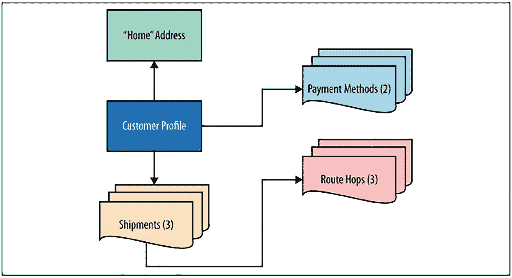
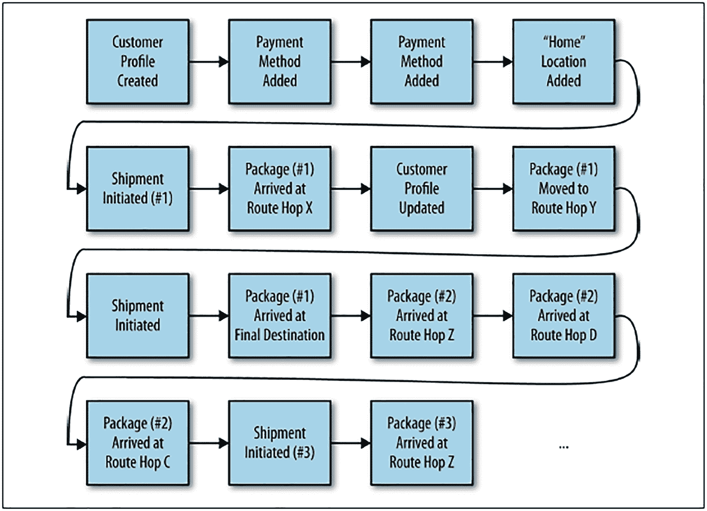
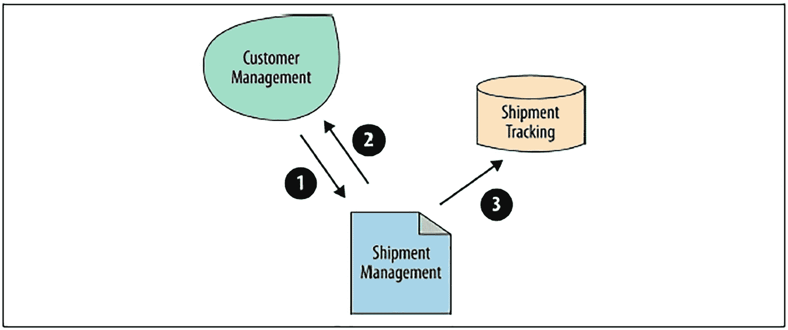
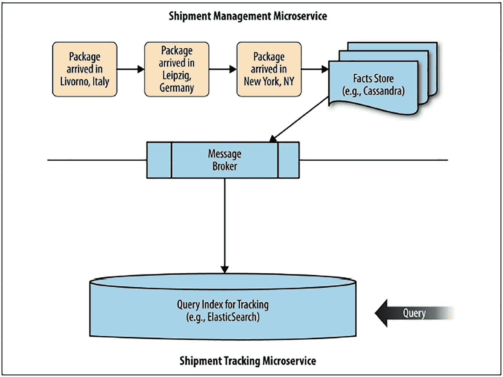
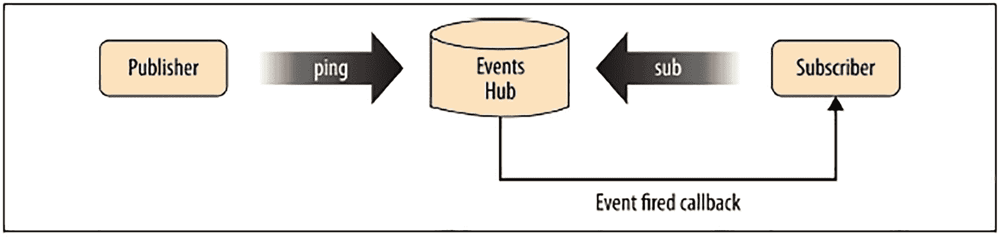
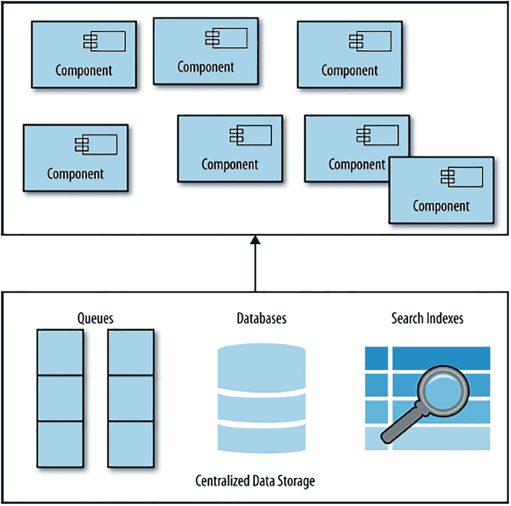
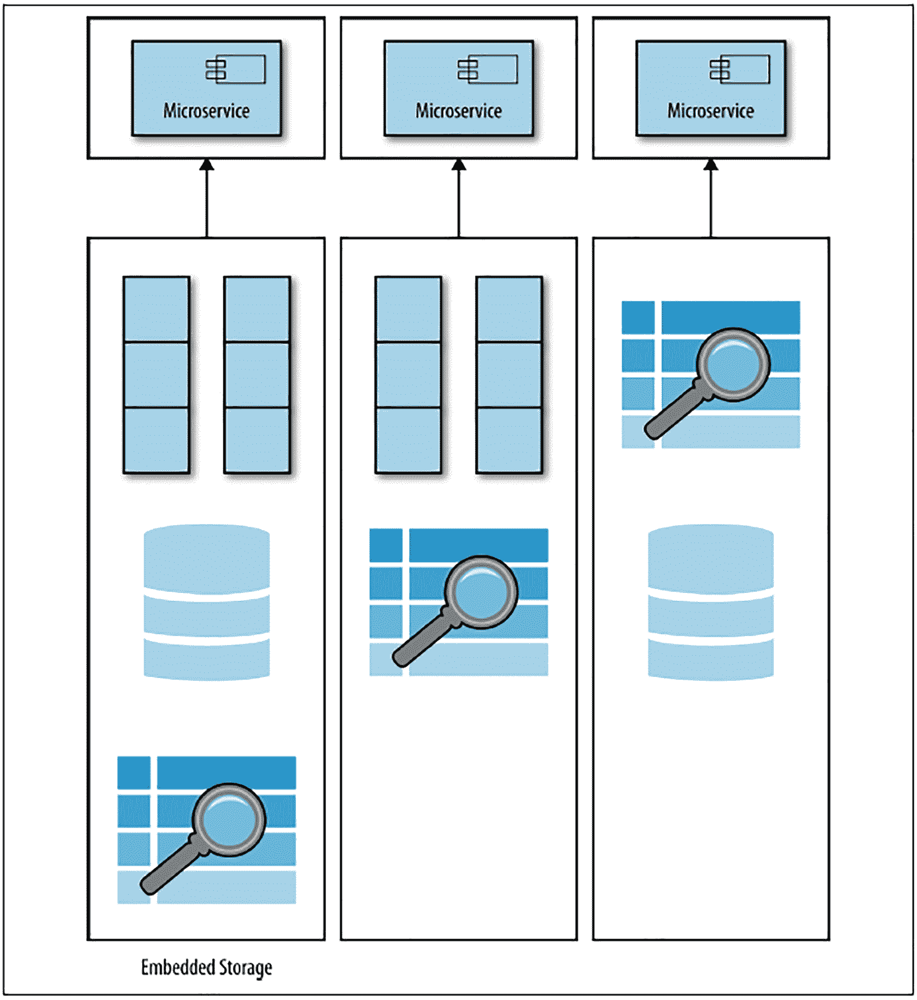
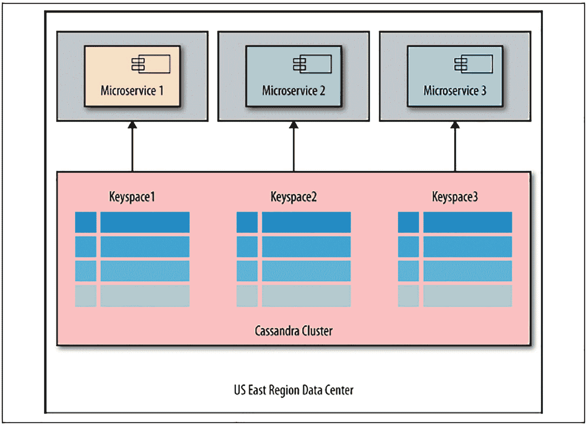
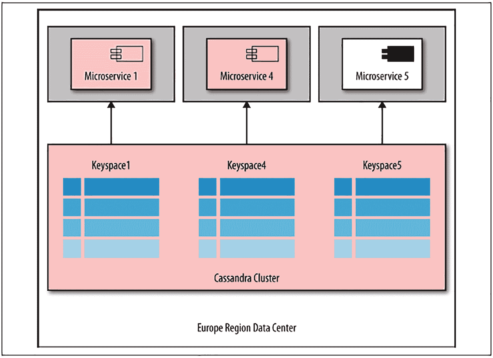

# 3.微服务设计模式

## 介绍

现在，您已经了解了评估微服务成熟度和就绪性的架构和组织考虑事项，本章将介绍微服务使用的设计模式。

一个示例解释了这些设计模式，并展示了它们如何应用于微服务设计。

## 服务设计

其中一个关键要素是实际微服务组件本身的设计，这也是大多数人在谈论微服务架构时都会想到的。正是这些自主服务构成了微服务系统的结构，并执行实施您的解决方案策略的实际工作。实现包含许多小型服务组件的系统是一个挑战，所以我用了整整一章来介绍一组工具和过程，它们可以帮助您和您的团队完成这项任务。

在我们与各种组织合作和采访其他人的经验中，采用微服务架构的团队面临的一些更具挑战性的问题是如何正确地确定微服务的规模(“微有多微？”)以及如何正确处理数据持久性以避免跨服务共享数据。这两个问题实际上是密切相关的。最佳规模的错误通常会导致无关的数据共享问题，但后者在操作上尤其成问题，因为它会创建紧密的跨服务耦合，并阻碍独立的可部署性，而独立的可部署性是架构风格的核心价值。当我们与设计和实现微服务的人交谈时，经常出现的其他话题是支持异步消息传递、事务建模以及处理微服务环境中的依赖关系。掌握这些元素将有助于您抑制蔓延到整个系统中的额外的(不必要的)复杂性。这样做可以帮助你在任何 IT 系统中平衡两个关键因素:速度和安全。

这一章涵盖了微服务的边界，看看一个服务应该有多“微”以及为什么。它将探索微服务接口(API)，讨论可演化的、面向消息的 API 对于微服务的重要性，以及它们如何减少组件间的耦合。它将研究微服务的有效数据存储方法，探索从以数据为中心和状态捕获模型向能力驱动和面向事件源的模型转变的力量。

本章还展示了命令查询责任分离(CQRS)模式如何提高数据服务的粒度，同时保持足够的速度和安全性。

当您阅读完这些材料时，您应该已经很好地理解了在设计和构建微服务组件时所面临的挑战以及可用的模式和实践。

先说大的:“微服务的最优规模是多少？”

## 微服务边界

那么微服务应该有多微呢？这个问题没有简单的答案。首先想到的事情，如微服务中的代码行或从事某项服务的团队规模，是引人注目的，因为它们提供了关注可量化价值的机会(例如，“答案是 40”)。然而，这些方法的问题是它们忽略了你所实现的业务环境。它们没有解决谁在实现服务的组织环境，更重要的是，服务在您的系统中是如何使用的。

大多数公司不是试图找到一些数量来衡量，而是关注每个微服务的质量——组件将被使用的用例或上下文。许多微服务采用者已经转向 Eric Evans 的“领域驱动设计”(DDD)方法，以获得一套完善的流程和实践，促进大型复杂系统的有效、业务环境友好的模块化。

## 微服务边界和领域驱动设计

本质上，我们看到人们在将微服务引入公司时所做的事情是，他们开始将现有组件分解为更小的部分，以便在不牺牲可靠性的情况下，提高他们更快提高服务质量的能力。

有许多方法可以将一个大系统分解成更小的子系统。在一种情况下，您可能会尝试基于实现技术来分解系统。

例如，您可以说所有计算量大的服务都需要用 C 或 Rust 或 Go(选择您自己的毒药)编写，因此它们是一个独立的子系统，而 I/O 量大的功能肯定会受益于 Node.js 等技术的非阻塞 I/O，因此它们是自己的子系统。或者，您可以根据团队地理划分一个大型系统:一个子系统可能在美国编写，而其他子系统可能由非洲、亚洲、澳大利亚、欧洲或南美洲的软件团队开发和维护。直观上，给一个在一个地方的团队一个用于开发的自包含子系统是很好的优化。

您可能决定根据地理位置划分系统的另一个原因是，在特定市场运营的特定法律、商业和文化要求可能会被本地团队更好地理解。一个来自纽约的软件开发团队能准确地捕捉到一个将在开罗使用的会计软件的所有必要细节吗？

一种在大系统中确定子系统边界的新方法。该过程提供了软件系统设计的以模型为中心的视图。正如所指出的，模型是观察一个系统的好方法。它们提供了一种看待事物的抽象方式——一种突出你感兴趣的事物的方式。模型是一种观点。

### 这只是一个模型

为了理解 DDD 方法，重要的是要记住任何软件系统都是现实的模型——它不是现实本身。例如，当你登录网上银行并查看你的支票账户时，你看到的并不是真正的支票账户。您只是在查看一个表示——一个模型——它为您提供了关于支票账户的信息，比如余额和过去的交易。很可能你的银行出纳员在查看你的账户时看到的屏幕有不同的信息，因为它是你账户的另一个模型。

大多数大型系统实际上没有单一的模型。一个大系统的整体模型是由许多混合在一起的小模型组成的。这些较小的模型是相关业务环境的有机表示——它们在它们的环境中是有意义的，并且当在环境中使用时，对于环境的主题专家来说是直观的。

### 限界上下文

当使用模型时，团队在组合上下文模型以形成更大的软件系统时需要非常小心。在任何大型项目中，都有多个模型在起作用。然而，当基于不同模型的代码组合在一起时，软件就会变得错误百出、不可靠且难以理解。团队成员之间的交流变得混乱。通常不清楚在什么情况下不应该应用模型。早在微服务一词出现之前，人们就已经想到了这个概念。

然而，前面的引用是关于建模本质的一个重要观察——如果你试图依赖一个单一的模型(例如，一个规范的模型),事情会变得难以理解。微服务方法试图将大型组件(模型)分解成较小的组件，以减少混乱，并使系统的每个元素更加清晰。因此，微服务架构是一种与 DDD 建模方式高度兼容的架构风格。为了帮助创建更小、更一致的组件，引入了有界上下文的概念。系统中的每个组件都存在于它自己的有界上下文中，这意味着每个组件的模型和这些上下文模型只在它们的有界范围内使用，而不在有界上下文之间共享。

众所周知，使用 DDD 技术正确识别系统中的有界环境，并沿着这些有界环境的接缝分解大型系统是设计微服务边界的有效方法。如果您使用 DDD 和有界上下文方法，那么两个微服务需要共享一个模型和相应的数据空间，或者最终具有紧密耦合的可能性会低得多。避免数据共享提高了将每个微服务视为独立可部署单元的能力。

使用 DDD 和有界上下文是设计组件的一个很好的过程。然而，故事还没完。你实际上可以使用 DDD，最终仍然可以创建相当大的组件。但是在微服务架构中，大并不是你想要的。相反，你的目标是小的，甚至是微型的。这就引出了微服务组件设计的一个重要方面——越小越好。

### 越小越好

工作单元粒度的概念在现代软件开发的许多上下文中是一个关键的概念。无论是明确定义还是隐含定义，你都可以清楚地看到这种趋势出现在诸如敏捷开发、精益启动和持续交付等基础方法论中。这些方法分别革新了项目管理、产品开发和开发运维。

有趣的是，它们中的每一个都有其核心的规模缩减原则:减少问题的规模或范围，减少完成任务所需的时间，减少获得反馈所需的时间，以及减少部署单元的规模。这些都属于我们称之为“批量缩减”的概念

例如，下面是敏捷宣言的摘录:

频繁地交付工作软件，从几个星期到几个月，优先考虑较短的时间尺度。

*—敏捷宣言，肯特·贝克等人*。

基本上，从瀑布模型转移到敏捷模型可以被看作是开发周期“批量大小”的减少——如果在瀑布模型中周期需要几个月，现在你努力在更短的周期(几周而不是几个月)内完成类似的一批任务:定义、架构、设计、开发和部署。诚然，敏捷宣言也列出了其他重要的原则，但它们只是加强和补充了“更短的周期”(即，减少批量)的核心原则。

连续交付的主要优势，Martin Fowler 对小批量的作用毫不含糊，称之为该方法核心优势的先决条件。

一旦您从代码、项目和部署级别的敏捷、精益和连续交付中接受了有限批量的概念，那么考虑在架构级别应用它也是有意义的。我们采访的许多公司都这样做了。毕竟，建筑学是其他三个学科的直接对应。所以，用最简单的话来说，这个“有限批量”就是微服务中的“微”。

就像敏捷中一样，等等。，没有简单、通用的方法来确定微服务应该“多小”(例如，数量)。

人们告诉我们的是，他们使用“小”这个词作为“可靠”和“连贯”等品质。

### 普遍存在的语言

仅仅通过陈述“越小越好”的简单偏好，如果有界上下文是您调整微服务的唯一工具，您将立即遇到问题，因为有界上下文实际上不可能任意小。以下是 DDD 领域的一位杰出权威沃恩·弗农对有界环境的最佳规模的看法:

在 DDD，我们需要共同的理解和表达领域细节的方式。这种共同的理解应该为业务和技术团队提供一种共同的语言，他们可以使用这种语言在模型的定义和实现上进行协作。正如 DDD 告诉我们在一个组件中使用一个模型(有界环境)，在这个有界环境中使用的语言应该是连贯的和普遍的——我们在 DDD 称之为 *无处不在的语言* *。*

从纯技术的角度来看，微服务越小，就越容易开发得更快(敏捷)，迭代得更快(精益)，部署得更频繁(持续交付)。但是在建模方面，重要的是避免创建“太小”的服务根据 Vernon 的说法，我们不能任意减少有界上下文的大小，因为它的最佳大小是由业务上下文(模型)决定的。对服务规模的技术需求有时可能不同于(小于)DDD 建模所能提供的。这可能就是为什么 Sam Newman 非常谨慎地称有界上下文分析是一个“良好的开端”，但不是如何确定微服务规模的唯一方法。我们完全同意。有界上下文是一个很好的开始，但是如果您想要有效地调整微服务的规模，您的工具箱中需要更多的工具。

## 微服务的 API 设计

当考虑微服务组件边界时，源代码本身只是关注的一部分。微服务组件只有在能够与系统中的其他组件通信时才变得有价值。它们都有一个接口或 API。正如您需要实现代码的高度分离、独立和模块化一样，您需要确保您的 API(组件接口)也是松散耦合的。否则无法独立部署两个微服务，为了兼顾速度和安全，这是首要目标之一。

这里有两个为微服务制作 API 的实践值得一提:

*   面向消息

*   超媒体驱动

### 面向消息

正如您致力于编写可以随时间安全重构的组件代码一样，您需要将同样的努力应用于组件之间的共享接口。最有效的方法是对微服务 API 采用面向消息的实现。消息传递作为组件间共享信息的一种方式的概念可以追溯到关于面向对象编程如何工作的最初想法。

我们谈过微服务组件设计的所有公司都提到消息传递是一个关键的设计实践。例如，网飞依赖 Avro、Protobuf 和 Thrift over TCP/IP 等消息格式进行内部通信，依赖 JSON over HTTP 与外部消费者(如手机、浏览器等)通信。).通过采用面向消息的方法，开发人员可以公开组件的一般入口点(例如，IP 地址和端口号)，同时接收特定于任务的消息。这允许消息内容的改变，作为一种安全地重构组件的方式。这里学到的关键经验是，长久以来，开发人员一直将 API 和 web 服务视为通过网络传输序列化“对象”的工具。然而，更有效的方法是将一个复杂的系统看作是通过网络交换消息的服务的集合。

### 超媒体驱动

我们采访过的一些公司正在将面向消息的概念推向下一个层次。他们依赖超媒体驱动的实现。在这些情况下，组件之间传递的消息不仅仅包含数据。这些消息还包含可能的动作的描述(例如，链接和表单)。现在，不仅数据是松散耦合的，动作也是如此。例如，Amazon 的 API Gateway 和 App-Stream API 都支持超文本应用语言(HAL)格式的响应。

超媒体风格的 API 将可进化性和松散耦合作为设计风格的核心价值。您可能也知道这种风格是以超媒体作为应用程序状态引擎的 API(hate OAS API)。不管使用什么名称，如果你要在微服务架构中设计合适的 API，熟悉超媒体风格是有帮助的。

超媒体风格本质上是 HTML 为浏览器工作的方式。HTTP 消息被发送到一个 IP 地址(您的服务器或客户端在互联网上的位置)和一个端口号(通常是“80”或“443”)。这些消息包含以 HTML 格式编码的数据和动作。例如，包含即将到达您办公室的未处理货物信息的邮件可能如下所示:

```
<html>
<head>
<title>Shipment #123</title>
</head>
<body>
<h1>Shipment #123</h1>
<div id="data">
<span>ID: 123</span><br />
<span>Description: Widget Covers</span><br />
<span>Quantity: 1 Gross</span><br />
<span>Estimated Arrival: 2017-01-09</span><br />
</div>
<div id="actions">
<a href="...">Refresh</a>
<a href="...">Exit</a>
<form method="get" action="...">
<input name="id" value="" />
<input type="submit" value="Search" />
</form>
</div>
</html>

```

超媒体 API 风格对于 API 空间的变革就像面向对象设计对于代码设计一样。很久以前，我们习惯于编写无穷无尽的代码行(可能只是简单地将它们组织在函数中)，但随后面向对象的设计带来了一个革命性的想法:“如果我们将状态和对该状态进行操作的方法分组到一个称为对象的自治单元中，从而封装数据和行为，会怎么样？”本质上，除了 API 设计，超媒体风格有非常相似的方法。这是一种 API 风格，其中 API 消息包含数据和控件(例如，元数据、链接、表单)，从而通过不仅用静态数据而且用描述 API 启示的控件元数据(即，“我可以用这个 API 做什么？”).

公开启示对于通过 Web 通信的服务是有意义的。如果你把网络看作是以人为中心的网络(由人类消费的网站)和机器网络(API)，你可以看到机器网络落后多少的明显差异。当你在以人为中心的网络上加载一个网页时，它不只是给你内容(文本、照片、视频等)。)—大多数网页还包含相关内容或搜索菜单的链接:一些你可以与之互动的东西。基本上，网页在回复中告诉你，你还能做什么。传统的 Web APIs 不会这样做。

大多数当代的 RESTful(CRUD)API 只响应数据，然后你不得不去阅读一些文档，看看还能做些什么。大多数人都会同意，这将是一次相当可笑的经历。如果回答不包含行为启示，人类网络就不会很有功能。但是这正是大多数现代 RESTful APIs 的情况。事实上，对于机器网络来说，只有数据的方法就像以人为中心的网络一样脆弱和不正常，除非我们已经习惯了这种不幸的状况。

超媒体 API 更像人类网络:可进化、适应性强、版本自由——你最后一次关心你正在看的网站的“版本”是什么时候？因此，超媒体风格的 API 不太脆弱，更容易被发现，并且适合高度分布式的协作架构风格，如微服务。

## 数据和微服务

作为软件工程师，我们被训练首先从数据的角度思考问题。

举一个最简单的例子，它已经深深植根于我们的“肌肉记忆”中，或者不管它在精神上的等同物是什么，通过首先设计相关的数据模型来开始系统设计。当被要求构建一个应用程序时，大多数软件工程师将完成的第一个任务是识别实体和设计用于数据存储的数据库表。这是一种设计集中式系统的有效方式，整代程序员都被训练以这种方式思考。但是以数据为中心的设计并不是实现分布式系统的好方法——尤其是依赖于可独立部署的微服务的系统。最大的原因是在分布式系统的情况下，缺乏对整个系统的强有力的、集中的、统一的控制，这使得以前高效的过程变得低效。

打破以数据为中心的习惯的第一步是重新思考我们的系统设计。事实证明，以能力为中心的设计比更传统的以数据为中心的设计更适合微服务。

### 运输公司示例

假设您正在为一家羽翼未丰的运输公司设计一个微服务架构，这个公司的名字恰如其分。作为一家包裹递送公司，他们需要接受包裹，通过各种分拣仓库(路线上的跳跃点)发送包裹，并最终递送到目的地。因为现在是 2021 年，该公司非常精通技术，所以航运公司正在为各种平台开发本地移动应用程序，让客户从取件到最终交付全程跟踪他们的包裹。这些移动应用将从一组微服务中获得所需的数据和功能。

让我们想象一下，航运公司的会计和销售子系统(微服务)需要访问每日货币汇率来执行操作。以数据为中心的设计会在数据库中创建一个或一组包含汇率的表。然后，我们会让各种子系统查询我们的数据库来检索数据。

这个解决方案有很大的问题——两个微服务依赖于共享表的设计和其中的数据，导致紧密耦合并阻碍独立部署。

相反，如果我们将“货币汇率”视为一种能力，并构建一个独立的微服务(货币汇率)来服务于销售和会计微服务，我们将拥有三个独立的服务，所有这些服务都是松散耦合且可独立部署的。此外，由于服务中的 API 本质上隐藏了实现细节，我们可以完全改变支持货币汇率服务的数据持久性(例如，如果可伸缩性成为问题，从 MySQL 到 Cassandra ),而服务的任何消费者都不会注意到这种改变或需要进行调整。最后但同样重要的是，由于服务(API)能够向其各种消费者提供替代接口，我们可以轻松地改变货币汇率微服务向销售微服务提供的接口，而不会影响会计微服务，从而实现独立发展的承诺，这是独立部署的必要条件。

一般来说，从能力而不是数据的角度来考虑是 API 设计的一种非常强大的技术。它通常会产生一个更加面向用例的接口(而不是类似 SQL 的数据对象接口)。以功能为中心的 API 设计通常是一种好的方法，但是在微服务的情况下，它不仅仅是一种聪明的设计技术，还是避免紧密耦合的一种强有力的方法。你刚刚看到了证据。

与有限的上下文分析非常相似，面向能力的设计是一项关键技术，但不足以确保所有用例的独立部署。并不是每个例子都像汇率这样简单。你不能总是将共享数据封装在微服务中，然后就此收工。例如，不能用封装的功能解决的一个常见用例是报告。任何业务应用程序都需要一定级别的报告。并且报告通常跨越多个模型、有限的上下文和功能。是否应该允许面向报告的微服务与其他微服务共享表？显而易见的答案是否定的，因为这将立即在整个系统中产生严重的服务紧耦合，并且至少会破坏(如果不是完全扼杀)独立部署。

让我们看看在复杂的用例中，您可以使用什么技术来避免数据共享。第一个是 event sourcing，这是一种强大的数据建模方法，可以帮助您避免微服务中的数据共享，即使是在非常复杂的情况下。第二，相关的方法是 CQRS——命令查询责任分离。

### 活动采购

回想一下，有一些根深蒂固的软件工程习惯极大地影响了人们通常对待系统工程的方式。这些习惯中最普遍的一个是结构化数据建模。对于开发人员来说，将模型描述为交互逻辑实体的集合，然后将这些逻辑实体映射到存储数据的物理表已经变得非常自然。最近，人们开始使用 NoSQL 和对象存储，这使他们稍微远离了关系世界，但本质上这种方法仍然是相同的:你设计结构化的实体来模拟你周围的对象，然后将对象的状态“保存”在某种数据库存储中。无论存储发生在表的行和列中，序列化为 JSON 字符串，还是对象图，您仍然在执行基于 CRUD 的建模。但这不是模拟世界的唯一方式。您可以存储导致世界当前状态的事件，而不是存储模拟世界状态的结构。这种建模方法被称为事件源。

公平地说，对于大多数习惯于结构化数据建模的软件开发人员来说，事件源最初听起来会很陌生，甚至可能有些怪异。

但真的不是。首先，事件源不是一些尖端的、未经测试的理论，这些理论是为了解决微服务中的问题而虚构出来的。独立于任何微服务架构协会，事件源已经在金融行业获得了巨大的成功。

此外，事件来源的根源和灵感远远超出了微服务、互联网本身，甚至计算机，一直追溯到财务会计和包含交易列表的纸和笔分类账，而不仅仅是余额的最终值(“状态”)。想想你的银行账户:你的支票账户和储蓄账户都有余额，但这些都不是银行存储在数据库中的头等值。账户余额总是一个导数值；这是一个函数。

更确切地说，余额是从你开户那天起所有交易的总和。

要质疑你当前的余额，你的银行不会去错误，这是非常具体和原始的系统。相反，他们会为您打印出所有相关的交易(或指引您到网上银行，在那里您可以自己操作)，并让您验证交易的结果确实应该等于显示的余额值。如果您发现任何交易有错误，银行将发布“补偿交易”来修复错误。这是事件采购的另一个重要属性:就像生活中一样，我们永远无法回到过去并改变过去。我们只能在当下做一些事情来弥补过去的错误。在事件源中，数据是不可变的——我们总是发出新的命令/事件来补偿，而不是像在 CRUD 风格中那样更新实体的状态。

当向开发人员介绍事件源时，最关心的通常是性能。如果任何状态值是事件的函数，我们可以假设每次访问该值都需要从源事件重新计算当前状态。显然，这将是非常缓慢的，通常是不可接受的。幸运的是，在事件源中，我们可以通过使用所谓的滚动快照(在给定时间点实体状态的投影)来避免这种昂贵的操作。根据事件源实现的不同，通常会在不同的时间点对中间值进行快照。例如，您可以预先计算每个月最后一天的银行账户余额，这样，如果您在 2021 年 1 月 15 日需要余额，您在 2020 年 12 月 31 日就已经有了，并且只需要计算两周的预测，而不是银行账户的整个寿命。如何实现滚动快照和预测的细节可能取决于应用程序的上下文。

尽管有其会计根源，事件源不仅仅与财务用例相关。本章的其余部分使用了一个你能想象到的远离银行和会计的业务场景——货物的装运和交付。

作为一家包裹递送公司，运输公司需要接受包裹，通过各种分拣仓库(路线上的跳跃点)发送包裹，并最终将它们递送到目的地。

图 [3-1](#Fig1) 显示了以结构化方式执行的该系统的代表性数据模型。



图 3-1

使用“当前状态”方法的航运公司的数据模型

相应的基于事件的模型如图 [3-2](#Fig2) 所示。



图 3-2

基于事件源的航运公司数据模型流程

正如您所看到的，结构化模型努力只保存系统的当前状态，而事件源方法保存单个的“事实”在事件源中，状态是发生的所有相关事实的函数。这不仅为您提供了完全的可审计性(正如您打电话给银行对余额提出异议时所展示的那样)，您还可以构建对过去任何时间的状态预测，而不仅仅是“现在”。你想知道星期三所有的包裹在哪里吗？活动采购没有问题！用结构化模型回答这个问题会更加困难，因为它需要特殊的编码。

如果你喜欢像我们一样注意看似不相关的事物中的模式，我们建议你再看一看这两个图表。您可能会注意到，结构模型中的每个实体都是一片“雪花”(即，它在属性和关系方面具有独特的“形状”，并且被精心制作以表示不同的现实生活概念)。

相比之下，事件存储中的事件从外部看起来都是一样的。这和另一个与微服务密切相关的技术:容器是非常相似的观点。实际上，对于容器主机(例如，Docker 主机)，所有容器看起来都相似——主机不“关心”容器内是什么，它知道如何独立于容器的内容来管理容器的生命周期。相比之下，定制安装的企业应用程序具有主机必须确保存在的各种特殊的“形状”和环境依赖性(例如，应用程序期望的共享库)。

“对形状和内容漠不关心”的方法似乎是现代技术的一种趋势，我们可以在 SQL 和 NoSQL 存储中看到相同的模式。它很容易让人想起，在多种环境下出现的趋势，是我们之前在多学科(例如，项目管理、产品开发、运营和架构)中查看不同的现代方法时注意到的“批量缩减”趋势。我们喜欢这一点——当相同的模式在多个地方出现时，我们可以利用我们对该模式的理解来识别或预测“下一件大事”

但是让我们回到微服务。您尝试了一种称为事件源的数据建模技术，并注意到了它相对于传统的结构化建模的一些优势，但是它如何帮助您解决微服务架构的数据隔离和封装挑战呢？事实证明，您还需要一个设计模式，CQRS，来补充事件源，并且您将朝着能够使用数据持久性模型为微服务设计有效的数据存储的方向前进，该模型可以避免甚至非常小的微服务规模的数据共享。

### 航运公司系统模型

如前所述，微服务系统设计的良好开端是识别系统中的有界上下文。图 [3-3](#Fig3) 显示了这个问题空间中关键有界上下文的上下文图。



图 3-3

航运公司微服务架构的高级上下文图

图中箭头和数字所示的三种上下文以及上下文之间的一些数据流的功能是什么？它们如下:

1.  客户管理创建、编辑和启用/禁用客户帐户，并可以向任何感兴趣的上下文提供客户的表示。

2.  货件管理负责包裹的整个生命周期，从卸货到最终交付。当包裹沿着递送路线通过分拣和转发设施时，它发出事件。

3.  货件跟踪是一个报告应用程序，允许最终用户在他们的移动设备上跟踪他们的货件。

如果您要使用传统的、结构化的、面向 CRUD 的模型来实现这个应用程序的数据模型，您会立即遇到数据共享和紧耦合的问题。实际上，请注意，装运管理和装运跟踪上下文必须查询相同的表，至少是包含沿途中转的表。然而，利用事件源，装运管理有界上下文(及其相应的微服务)可以改为记录事件/命令，并为其他上下文发出事件通知，这些其他上下文将建立它们自己的数据索引(投影)，而从不需要直接访问装运管理微服务拥有和管理的任何数据。

这个过程的正式方法用一个叫做 CQRS 的模式来描述。

### CQRS(消歧义)

命令查询责任分离是一种设计模式，它规定您可以(有时应该)将数据更新和数据查询功能分离到不同的模型中。它的祖先可以追溯到一个叫做命令-查询分离的原则，CQRS 将这个概念向前推进了一大步，指导你使用完全不同的模型进行更新和查询。这一看似简单的陈述往往足以扭转乾坤，尤其是在本章前面提到的以报告为中心的微服务的复杂情况下。

由于报告通常需要汇总和对比大型系统不同部分生成的数据，因此它们通常需要跨越多个子系统和有限的上下文，并且几乎总是需要访问来自多个上下文的数据。但是，只有当您假设任何实体都有一个模型时，才会出现这种情况，在这个模型中，您既可以查询实体，也可以更新实体。如果使用 CQRS，就不需要跨多个上下文访问数据(以及相关的问题)。通过 CQRS，运输管理微服务可以“拥有”和封装任何与包裹交付相关的更新，只需通知其他上下文有关事件的发生。通过订阅这些事件的通知，运输跟踪等报告服务可以构建完全独立的查询优化模型，而不需要与任何其他服务共享。

正如您在图 [3-4](#Fig4) 中看到的，由于 CQRS，您能够分离装运管理和跟踪微服务的数据模型。事实上，航运管理甚至不需要知道跟踪微服务的存在，跟踪微服务唯一依赖的是一个事件流来构建其查询索引。在运行时，跟踪微服务只查询自己的索引。此外，跟踪微服务可以包括来自使用相同流的其他微服务的事件和命令数据，保持其独立性和松散耦合。



图 3-4

基于命令-查询责任分离(CQRS)的航运公司数据流程模型

使用事件源和 CQRS 的最大好处是，它们允许你设计非常细粒度的、松散耦合的组件。对于有界上下文，边界必须与业务能力和子域边界保持一致。借助事件源，您可以创建非常小的微服务，它们只管理一种类型的事件或运行一个报告。有针对性地使用事件源和 CQRS 可以将您带到微服务架构中自治粒度的下一个级别。因此，它们在建筑风格中起着至关重要的作用。

不要过度使用事件源和 CQRS。您应该只在必要时使用事件源和 CQRS，因为它们会使您的实现变得复杂。事件源和 CQRS 并不是你整个系统的“架构”,而是一个强大的工具集，可以少用。在许多用例中，传统的、基于 CRUD 的模型要简单得多，应该是首选的。

## 分布式事务和传奇

共享数据模型并不是唯一可以在微服务之间引入紧密耦合的用例。另一个重要的威胁是工作流。许多现实生活中的过程不能用单一的原子操作来表示，因为它们是一系列的步骤。当您处理这样的工作流时，只有当所有步骤都可以执行时，结果才有意义。换句话说，如果序列中的任何一步失败，相关系统的结果状态将变得无效。您可能在 RDBMS 系统中发现了这个问题，在 RDBMS 系统中，这样的过程被称为“事务”然而，数据库事务是本地的，包含在单个数据库的范围内，其中它们的实现主要依赖于共享状态的使用(即，您将锁放在参与事务的行和表上，以保证数据一致性)。一旦事务完全执行，您就可以移除锁，或者如果事务步骤中的任何一步失败，您可以回滚已经尝试过的步骤。

对于分布式工作流和无共享环境(微服务架构也是如此)，您不能使用具有数据锁和 ACID 合规性的传统事务实现，因为此类事务需要共享数据和本地执行。相反，许多团队使用的有效方法被称为“sagas”。Sagas 是由埃克托·加西亚-莫利纳和肯尼斯·塞勒姆为长期分布式事务设计的，并于 1987 年在他们在普林斯顿大学工作期间推出(是的，远在微服务甚至网络之前)。

Sagas 非常强大，因为它们允许在分布式、松散耦合的环境中运行类似事务的可逆工作流，而无需对复杂系统的每个组件或整个系统本身的可靠性做出任何假设。这里的折衷是，sagas 不能总是回滚到事务尝试之前系统的确切初始状态。但是你可以尽最大努力通过补偿使系统达到与初始状态一致的状态。

在 sagas 中，工作流中的每一步都执行其工作部分，在名为“路由单”的消息中注册对“补偿事务”的回调，并将更新后的消息传递到活动链。如果下游的任何步骤失败，该步骤会查看传送名单，并调用最近步骤的补偿事务，传回传送名单。前面的步骤做同样的事情，调用它的前一个补偿事务，以此类推，直到所有已经执行的事务都得到补偿。例如:假设一位客户通过运输公司的保险递送邮寄了一张 100 美元的预付银行本票。当快递员出现在目的地时，他们发现地址是错误的，居民不会接受包裹。

因此，运输公司无法完成交易。由于包裹已经投保，因此运输公司有责任“回滚”交易，并将款项退还给寄件人。对于符合 ACID 的事务，运输公司应该将正好 100 美元的支票返还给原始发送者，将系统状态恢复到它的初始值。不幸的是，在回来的路上，包裹丢失了。自从船运公司。无法再“回滚”交易，他们决定通过将 100 美元存入客户的账户来补偿保险价值。因为这是一家长期活跃的船运公司。顾客和一个理性的人，他们不在乎哪 100 美元被退回给他们。系统没有返回到它确切的初始状态，但是补偿事务将环境带回到一致的状态。这就是传奇故事的基本运作方式。

由于其高度容错的分布式特性，当微服务架构中需要跨微服务边界的事务时，sagas 非常适合于取代传统事务。如果你想了解更多关于传奇的知识，并看到实现一个非常有表现力的例子的工作代码，请参考链接 [`https://docs.microsoft.com/en-us/azure/architecture/reference-architectures/saga/saga`](https://docs.microsoft.com/en-us/azure/architecture/reference-architectures/saga/saga)

## 异步消息传递和微服务

异步消息传递在保持微服务架构中的松散耦合方面起着重要的作用。您可能已经注意到，在本章前面的一个例子中，我们使用了一个消息代理，以异步方式将事件通知从我们的装运管理微服务传递到装运跟踪微服务。也就是说，让微服务直接与消息代理(如 RabbitMQ 等)交互。)很少是个好主意。如果两个微服务通过消息队列通道直接通信，那么它们共享一个数据空间(通道)，您已经知道这不是一个好主意。相反，您可以做的是将消息传递封装在一个独立的微服务之后，该微服务可以以松散耦合的方式向所有感兴趣的微服务提供消息传递功能。

在微服务架构的上下文中，您最感兴趣的消息传递工作流是一个简单的发布/订阅工作流。如何用标准的方式表达成 HTTP API/微服务？我们建议将这样的工作流建立在现有标准的基础上，比如 PubSubHubbub。公平地说，PubSubHubbub 不是为 API 或超媒体 API 创建的，而是为博客环境中的 RSS 和 Atom 提要创建的。也就是说，您可以相对较好地调整它，以服务于支持超媒体 API 的工作流。为此，您需要实现如图 [3-5](#Fig5) 所示的流程。



图 3-5

用发布-子-中心-Bub 启发的流实现异步消息传递

您还需要标准化一些超媒体启示:

这是指启用注册以通知上下文更新的中心:

```
rel="hub"

```

这给出了链接上下文的 pingback 资源的地址:

```
rel="pingback"

```

当被包括在事件的资源表示中时，`"sub"`(订阅)链接关系可以标识表示订阅链接上下文中的发布/订阅事件类型资源的能力的目标资源:

```
rel="sub"

```

当被包括在事件的资源表示中时，`"unsub"`(预订取消)链接关系可以标识目标资源，该目标资源表示从链接上下文中的发布/订阅事件类型资源取消预订的能力。

```
rel="unsub"

```

这是可订阅事件的资源表示:

```
rel="event"

```

这是表示订阅事件列表的集合资源的链接:

```
rel="events"

```

## 处理依赖性

与独立部署能力相关的另一个重要主题是嵌入依赖关系。想象一下，航运公司的货币汇率微服务正受到来自其他微服务的用户查询和请求的打击。如果您将微服务托管在公共云中，而不是贵公司数据中心的昂贵服务器上，成本会低得多。但是，如果它将数据存储在与所有其他微服务相同的 SQL 或 NoSQL 数据库系统中，那么将微服务移动到另一台主机似乎是不可能的。

注意，数据表不是共享的，只是数据库管理系统的安装。似乎合乎逻辑的结论是，即使安装了数据存储系统，也不能共享任何微服务。有些人可能会认为，微服务需要“嵌入”它可能需要的每一个依赖项，这样微服务就可以随时随地部署，而无需与系统的其他部分进行任何协调。

完全依赖嵌入的严格要求可能是一个很大的问题，因为几十年来，我们已经设计了具有集中数据存储的架构，如图 [3-6](#Fig6) 所示。



图 3-6

使用集中依赖池的组件

集中式数据存储在操作上很方便:它允许专门的团队(DBA、sysadmins)维护和微调这些复杂的系统，使开发人员看不到复杂性。

相比之下，微服务倾向于嵌入所有依赖关系，以实现独立部署。在这样的场景中，每个微服务管理并嵌入它的数据库、键值存储、搜索索引、队列等等。那么移动这个微服务到任何地方就变得微不足道了。这种部署将如图 [3-7](#Fig7) 所示。



图 3-7

使用完全嵌入、隔离依赖关系的组件

大规模嵌入(数据存储)依赖关系的假设表面上看起来很美，但实际上，除了最简单的用例之外，这对其他所有用例来说都是极其浪费的。很明显，你将很难在你开发的每一个微服务中嵌入整个 Cassandra、Oracle 或 Elasticsearch 集群。尤其是如果你已经在微服务之旅中走得很远，并且可能有数百个微服务。这是不可行的。也没有必要。

微服务不必携带每一个依赖项(如数据存储系统)，就可以在数据中心之间自由移动。

在他以前的工作中，我们中的一个(伊拉克利)经常出差。他已经获得了有效完成任务的重要技巧——这些技巧在他以前作为一个随意旅行者的生活中是完全不重要的。正如任何经常旅行的人会告诉你的那样，对于流动性来说，最重要的规则是保持你的行李轻便。你不必把你可能需要的所有东西都打包。例如，没有人会在出差时带上淋浴喷头和毛巾:你知道你会在酒店里找到它们。如果你知道目的地酒店有便利店，而且你的雇主会支付杂费，你甚至不用打包大多数洗漱用品。伊拉克利知道他可以指望什么是“现场”可用的，以及他需要总是带着什么。而且，为了轻装上阵，他学会了限制自己对许多东西的“依赖”,这些东西并不是他日常打包工作的一部分。

同样，微服务移动性的诀窍不是打包所有东西，而是确保部署目的地在每个可能部署微服务的目的地以可用和可自动发现的形式提供重资产，如数据库集群。应该编写微服务，以便他们可以在部署时快速发现这些资产，并开始使用它们。

要明确的是:微服务之间的数据共享仍然是终极大忌。共享数据会在微服务之间产生紧密耦合，这会扼杀它们的移动性。然而，共享数据库集群安装是可以的，因为每个微服务只访问它的隔离的、命名空间的部分。

### 语用迁移

图 [3-8](#Fig8) 展示了一个适当的、复杂的微服务部署在实践中应该是什么样子。



图 3-8

实用方法:组件使用集中的依赖关系池，不共享数据空间

如果您决定将微服务 1 迁移到另一个数据中心，它会期望新的数据中心也有一个兼容版本的正常工作的 Cassandra 集群(在前面的比喻中，酒店提供了您可以使用的毛巾)，但它会找到一种方法来移动它的数据片，并且不依赖于目的地任何其他微服务的存在或状态，如图 [3-9](#Fig9) 所示。



图 3-9

实用方法:微服务 1 迁移到不同的数据中心无需数据共享

微服务不需要“旅行”时负重，打包所有可能需要的东西。在复杂的情况下，对目标环境有一些合理的期望是好的，尤其是在涉及复杂的数据存储能力时。

当决定在一个环境中嵌入依赖关系还是“期望”特征时，你需要问的最重要的问题是，这个决定会增加还是减少移动性？目标是最大化微服务的部署移动性，这在不同的上下文中可能意味着不同的事情。

本章解释了“批量缩减”技术在系统工程中的首要作用，即在规模上同时实现速度和安全是期望的结果。

它还表明，在某些粒度级别，架构师可能需要额外的模式，在领域驱动设计的模式之上，例如事件源、CQRS 和 Sagas。它展示了这些模式如何从根本上改变您对模型设计的看法，以及这如何导致更松散耦合的服务，服务被分割以提供独特的功能。

最后但并非最不重要的一点是，微服务是 API，因此除了代码、实现和部署方面的考虑之外，本章的很大一部分致力于解释构成微服务的 API 的独特接口设计需求。

## 系统设计和操作

采用微服务架构的好处不一定是免费的，它们可以将复杂性转化为操作。采用微服务架构的团队需要具备一定程度的基础设施自动化和运营成熟度才能取得成功。让我们看看这在实践中意味着什么。

本章回顾了微服务运营的关键概念，如独立部署、容器在经济高效的部署中的作用，特别是 Docker 在微服务、服务发现、安全、路由、转换和编排中的作用。总之，这些主题将为您理解、设计和执行微服务架构的运营需求奠定坚实的基础。

## 独立可部署性

微服务架构风格的核心原则之一是独立可部署性原则——也就是说，每个微服务必须完全独立于任何其他微服务进行部署。架构风格的一些最重要的好处依赖于忠实地坚持这一原则。

独立部署允许您执行选择性或按需扩展；如果系统的一部分(例如，单个微服务)经历高负载，您可以将该微服务重新部署或移动到具有更多资源的环境中，而不必为整个(通常是大型)企业系统扩展硬件容量。对于许多组织来说，选择性扩展的运营能力可以节省大量资金并提供必要的灵活性。

作为一家包裹递送公司，运输公司需要接受包裹，通过各种分拣仓库(路线上的跳跃点)发送包裹，并最终将它们递送到目的地。

让我们考虑一个航运公司选择性扩展的例子。该公司存储和操作敏感的客户信息，包括其客户的人口统计和财务数据。运输公司收集信用卡信息，因此受到政府严格监管的审计要求。

出于安全原因，运输公司将实施的敏感部分部署在内部数据中心，但出于成本和可扩展性原因，其 CTO 仍希望尽可能利用“云计算”。

在内部扩展硬件资源的成本非常高，您必须根据预期的使用情况而不是实际使用情况来购买昂贵的硬件。与此同时，应用程序中承受负载并需要扩展的部分可能不包含任何敏感的客户或财务数据。它可以是像一个返回美国各州列表的 API 或一个能够转换各种货币汇率的 API 这样琐碎的事情。运输公司的首席架构师相信，他们的安全团队将轻松地允许将这种安全的微服务部署到公共/私有云中，在那里扩展资源要便宜得多。问题是，在这种情况下，他们能否将应用程序的一部分部署到单独的数据中心，即基于云的数据中心？大多数企业系统(通常是整体式的)的架构方式是，独立地部署应用程序的选择性部分要么非常困难，要么实际上不可能。相比之下，微服务强调独立部署到核心原则级别的要求，从而为您提供急需的操作灵活性。

除了节省运营成本和灵活性之外，独立部署的另一个重要优势是组织优势。两个不同的团队将负责开发独立的微服务(例如，客户管理和运输管理)。如果负责客户管理微服务的第一个团队需要进行更改并重新发布，但是客户管理不能独立于装运管理微服务发布，那么您现在需要与拥有装运管理的团队协调客户管理的发布。这种协调可能是昂贵和复杂的，因为后一个团队可能与负责客户管理的团队有完全不同的优先级。通常这种协调的必要性会延迟发布。现在想象一下，你可能拥有由几十个团队维护的数百个微服务，而不是少数几个。对于这样的组织来说，发布协调的开销可能是毁灭性的，会导致产品延迟发货，或者有时在发货时就过时了。

## 您需要更多服务器吗？

为了确保独立部署，您需要使用一个自治的、隔离的环境单元来开发、打包和发布每个微服务。但是“自主的、孤立的环境单元”在这个上下文中是什么意思呢？这种环境单位的例子有哪些？让我们假设您正在开发一个服务应用程序。乍一看，类似于*服务应用文件*的东西似乎是封装和隔离的合适单元。

毕竟，这就是这些打包格式的设计目的——在应用服务器的上下文中，分发可执行代码和相关资源的集合，共同形成一个独立的应用程序。

轻量级打包解决方案，如 NPM 模块(用于节点)或 PIP 包(用于 Python)，不能提供微服务所需的足够的模块化和隔离级别。服务部署文件仍然共享系统资源，如磁盘、内存、共享库、操作系统等等。他们可能还希望环境中有特定版本的操作系统库。任何有经验的 sysadmin 或 DevOps 工程师都知道，一个应用程序的环境预期可能与另一个截然不同，如果您需要在同一台服务器上安装这两个应用程序，就会导致版本和依赖性冲突。采用微服务架构的核心动机之一是避免复杂的协调和冲突解决的需要，因此不能避免这种相互依赖的打包解决方案不适合微服务。您需要更高级别的组件隔离来保证独立部署。

如果您在每台物理服务器或每台虚拟机上部署一个微服务会怎么样？这当然符合微服务对隔离的高要求，但这种解决方案的财务成本是多少？对于已经使用微服务架构好几年的公司来说，开发和维护数百个微服务并不罕见。假设你在一家成熟的微服务公司工作，大约有 500 个微服务。为了以可靠、冗余的方式部署这些微服务，每个微服务至少需要三台服务器/虚拟机，因此仅生产系统就需要 1，500 台服务器。通常，大多数公司运行不止一个环境(QA、stage、integration 等。)，这迅速增加了所需服务器的数量。

坏消息来了:成千上万的服务器成本很高。即使您使用虚拟机而不是物理服务器，即使在“最便宜”的云托管环境中，利用数千台服务器进行设置的预算也会非常高，可能高于大多数公司能够负担或愿意花费的费用。然后是开发环境的重要问题。大多数开发人员喜欢在他们的工作站上有一个工作的、完整的(如果是按比例缩小的)生产环境模型。

在一台笔记本电脑或台式机上，您实际上可以启动多少个虚拟机？最多五个或十个？不是几百或几千。那么，这种快速、简单的微服务托管成本计算意味着什么呢？从运营的角度来看，微服务架构是不是根本不现实、不可实现？对大多数公司来说，这可能是几年前的事了。这就是为什么你会看到更大的公司，如亚马逊和网飞，成为这种建筑风格的先驱——他们是少数几个能够证明其成本的公司。

然而，近年来情况发生了显著变化。

### 微服务架构是其时代的产物

我们经常被问到——微服务架构和面向服务架构之间的根本区别是什么，尤其是考虑到这么多的底层原则看起来都很相似？我们认为这两种建筑风格是各自时代的产物，大约相差十年。在这 10 年中，该行业在自动化基础设施运营的有效方式方面已经变得更加熟练。微服务架构正在利用 DevOps 和连续交付方面最先进的成就，使架构风格的优势可以为更广泛的受众所用，并且具有成本效益，而不仅仅是像亚马逊或网飞这样的少数大型早期采用者。

微服务架构在财务和运营上可行的原因与容器有很大关系。

发布和运输微服务通常使用的部署单元是容器。如果您以前从未使用过容器，您可以将容器想象成一个极其轻量级的“虚拟机”该技术与传统虚拟机的技术有很大不同。它基于 Linux 内核扩展(LXC ),允许在共享操作系统内核的单个 Linux 主机上运行许多隔离的 Linux 环境(容器),这意味着您可以在单个服务器或虚拟机上运行数百个容器，同时仍然可以实现与运行独立服务器相当的环境隔离和自治，因此完全可以满足我们的微服务需求。

容器将不仅限于 Linux 现在有来自 Microsoft Windows 的容器要部署。容器提供了一种几乎零开销的现代隔离解决方案。虽然您不能在一台主机上运行多个传统虚拟机，但在一台主机上运行数百个容器是完全可能的。目前部署最广泛的容器工具集是 Docker，所以实际上 Docker 和容器已经有点同义了。实际上，还有其他新兴的容器解决方案，它们在未来可能会更加突出。

## 坞站和微服务

本节讨论 Docker，因为它是当今生产中部署最广泛的容器工具集。然而，如上所述，替代容器解决方案存在于生产准备的不同阶段。因此，本节中的大多数内容应该被理解为与容器相关，而不仅仅是 Docker。

在 2016 年初，如果不利用 Docker 容器，大多数微服务部署几乎是不可想象的。我们已经讨论了其中的一些实际原因。也就是说，你不应该认为 Docker 或 containers 是专为微服务架构设计的工具。

一般来说，容器，尤其是 Docker，肯定存在于微服务架构之外。事实上，如果你看一下当前的系统运营情况，你会发现使用容器的个人和公司的数量比实施微服务架构的多很多倍。Docker 本身比微服务架构更常见。

容器不是为微服务创建的。它们是对一个实际需求的有力回应:技术团队需要一个强大的工具集，用于复杂应用程序的通用和可预测的部署。事实上，通过将应用程序打包为 Docker 容器(假定以正确的版本号预捆绑所有必需的依赖项)，您可以让其他人可靠地将其部署到任何云或本地托管设施，而无需担心目标环境和兼容性。

剩下的惟一部署需求是，在大多数情况下，服务器应该支持 Docker。相比之下，如果您只是将您的应用程序作为可执行文件提供给某人，而没有预捆绑的环境依赖，您将会让他们承受大量的依赖痛苦。或者，如果您想将相同的软件打包成一个虚拟机映像，您将不得不为几个主要平台创建多个虚拟机映像，因为目前没有一个单一的主流虚拟机标准被主要参与者采用。

但是兼容性不是唯一的胜利；当您考虑容器与虚拟机映像时，还有另一个同样重要(如果不是更重要的话)的好处。Linux 容器使用分层的文件系统架构，称为*联合挂载* *。*这提供了传统虚拟机架构所不具备的强大可扩展性和可重用性。有了容器，从“基本映像”扩展您的映像就变得很简单了如果基础映像更新，您的容器将在下次重新构建时继承这些更改。这种分层的、可继承的构建过程促进了协作开发，增加了许多团队的努力。集中式注册表、发现服务和面向社区的平台(如 Docker Hub 和 GitHub)进一步促进了该领域的快速采用和教育。

事实上，我们可以很容易地扭转局面，声称是 Docker 将推动微服务的采用，而不是相反。这种说法的原因之一是，Docker 非常强调运输容器的“UNIX 哲学”，即“做一件事，并把它做好。”事实上，这个核心原则在 Docker 文档本身中有突出的描述:

每个容器只运行一个过程。几乎在所有情况下，您都应该只在一个容器中运行一个进程。将应用程序解耦到多个容器中使得水平伸缩和重用容器变得更加容易。

*—Docker 文档*

以这些原则为核心，Docker 哲学比传统的大型整体架构更接近微服务架构。当你追求“做一件事”时，将你整个庞大的企业应用程序封装成一个 Docker 容器是没有意义的。您肯定希望首先将应用程序模块化为松散耦合的组件，这些组件通过标准网络协议进行通信，这就是微服务架构所提供的。因此，如果您的目标是将大型复杂的应用程序容器化，那么您可能需要在复杂的应用程序中进行一定程度的微服务设计。

从我们的角度来看，Docker 容器和微服务架构是通向持续交付和运营效率这一共同目标的两端。如果达到了预期的目标，你可以从任何一端开始。

## 服务发现的作用

如果您使用 Docker 容器来打包和部署您的微服务，您可以使用一个简单的 Docker Compose 配置来将多个微服务(及其容器)编排到一个一致的应用程序中。只要您在单个主机(服务器)上，这种配置将允许多个微服务“发现”并相互通信。这种方法通常用于本地开发和快速原型开发。

但是在生产环境中，事情会变得非常复杂。出于可靠性和冗余性的需要，在生产中只使用一台 Docker 主机是不太可能的。相反，您可能会部署至少三个或更多 Docker 主机，每个主机上有几个容器。

此外，如果您的服务获得显著不同的负载级别，您可能会决定不在所有主机上部署所有服务，而是最终在选定数量的主机上部署高负载服务(假设十台)，而低负载服务可能只部署在三台服务器上，而且不一定是同一台服务器。此外，出于安全和业务方面的原因，您可能需要在某些主机上部署某些服务，而在其他主机上部署其他服务。

一般来说，如何在可用的主机上分发服务将取决于您的业务和技术需求，并且很可能会随着时间的推移而改变。主机只是服务器，不能保证永远存在。

微服务容器的每个实例都有不同的编号。在本例中，所有四台主机上都部署了微服务 1，但微服务 2 仅部署在主机 1–3 上。请记住，部署拓扑可能会根据负载、业务规则、哪个主机可用以及您的微服务实例是否突然崩溃而随时发生变化。

请注意，由于许多服务通常部署在同一台主机上，因此您不能仅通过 IP 地址来寻址微服务。通常有太多的微服务，这些微服务的实例可以随时上升和下降。如果您为每个微服务分配一个 IP，那么 IP 地址的分配将变得过于复杂。相反，您可以为每台主机(服务器)分配一个 IP，微服务将通过以下组合得到充分解决:

*   (主机的)IP 地址

*   服务在主机上可用的端口号

我们已经注意到微服务可用的 IPs 是不断变化的，但是端口呢？您可能会假设您可以为单个微服务分配固定端口，比如说，“我们的帐户管理微服务总是在端口 5555 上启动。”但这不是一个好主意。许多不同的团队将需要在共享的主机池中独立启动微服务。如果您假设特定的微服务总是在主机的特定端口上启动，您将需要高级别的跨团队协调，以确保多个团队不会意外地占用同一个端口。但是使用微服务架构的主要动机之一是消除昂贵的跨团队协作的需要。总的来说，这种协调是站不住脚的。这也是不必要的，因为有更好的方法来实现同样的目标。

这就是服务发现进入微服务场景的地方。您需要某种系统，该系统将始终关注所有服务，并跟踪在任何给定时间在哪个 IP/端口组合上部署了哪个服务，以便可以相应地无缝路由微服务的客户端。

如前几章所述，在服务发现的开源领域有几个成熟的解决方案。一方面是 CoreOs 的 etcd 和 HashiCorp 的 Consul 等工具。它们是为架构师提供高度控制和可见性的“低级”工具。另一方面是提供“容器调度”功能以及服务发现的工具。

谷歌的 Kubernetes 可能是这一类别中最知名的，Docker Swarm 是另一个更新的玩家。使用集装箱调度解决方案，您可以获得高度的自动化和抽象化。在这种情况下，不需要决定在哪些服务器上启动哪个容器，您只需告诉系统有多少主机池的资源应该专用于某项服务，Kubernetes 或 Swarm 会根据这些标准负责平衡/重新平衡主机上的容器。利用容器的另一项重要技术是中间层。

Mesosphere 甚至比 Kubernetes 或 Swarm 更抽象，目前作为“数据中心操作系统”销售，允许更高程度的自动化，而不必担心部署的许多节点，并操作整个服务器集群。

在考虑服务发现时，没有“更好”的工具。作为一名架构师，您需要决定您想要从这些工具中获得多少自动化“魔力”,以及您需要为自己保留多少控制权。即使在同一个企业应用程序中，您很可能会发现 Kubernetes 非常适合某一批微服务，而架构师可能会认为，如果使用类似 Consul 的东西直接管理，另一类微服务可能会部署得更好。

## 对 API 网关的需求

在几乎所有微服务实现中观察到的一个常见模式是团队使用 API 网关保护由微服务提供的 API 端点。现代 API 网关提供了微服务所需的一个额外的关键特性:转换和编排。在大多数成熟的实现中，API 网关与服务发现工具合作来路由来自微服务客户端的请求。

### 安全

微服务架构是一种自由度非常高的架构。或者换句话说，与单片应用相比，移动部件要多得多。如前所述，在为复杂的企业应用程序实现架构的成熟微服务组织中，部署数百个微服务是很常见的。当有许多移动部件时，事情可能会变得非常糟糕。你当然需要一些法律和秩序来维持一切的控制和安全。这就是为什么在几乎所有的微服务实现中，您会看到由各种微服务提供的 API 端点使用一个有能力的 API 网关来保护。

微服务提供的 API 可以相互调用，可以由“前端”调用，即面向公众的 API，或者可以由 API 客户端(如移动应用、web 应用和合作伙伴系统)直接调用。根据微服务本身、组织的业务需求以及行业、市场或应用环境，所有场景都是公平的。为了确保您永远不会危及整个系统的安全性，广泛推荐的方法是使用有能力的 API 网关来保护启用微服务的系统的“面向公众”的 API 端点的调用。

基于我们构建微服务系统和帮助各种组织做同样事情的经验，我们推荐一种更激进的方法，而不仅仅是保护“公共 API 端点”

“公共”和“私有”API 之间的区别最终往往是任意的。您有多确定您认为“仅限内部”的 API 永远不会被任何外部系统所需要？只要您尝试通过公共 web、从您自己的 Web 应用程序或从移动应用程序使用 API，就安全性而言，该端点就是“公共”的，需要受到保护。对于 Amazon 来说，最重要的是 Amazon Web Services:它们暴露了可能的最低级别的技术堆栈——硬件资源，如磁盘、CPU、网络等。，由他们的电子商务网站使用——供世界上任何人使用，他们从中赚取了数十亿美元。

那么，为什么你会认为你有一些 API 永远是“内部专用”的呢？有时，某些微服务被认为是“内部”的，并被排除在 API 网关提供的安全性之外，因为您认为外部客户端永远无法访问它们。这是危险的，因为随着时间的推移，假设可能会变得无效。

最好始终使用 API 网关来保护任何 API/微服务访问。在大多数情况下，在服务调用之间引入 API 网关的可忽略的开销是值得的。

### 转型和流程编排

如前所述，微服务通常被设计为提供单一功能。它们是拥抱 UNIX 哲学“做一件事，并把它做好”的网络版本。然而，任何 UNIX 开发人员都会告诉您，单一责任方法之所以有效，是因为 UNIX 通过通用的输入和输出管道，促进了其高度专门化的实用程序的高级编排。使用管道，您可以轻松地组合和链接 UNIX 实用程序，以解决涉及复杂流程工作流的重要问题。API 和微服务领域也迫切需要类似的解决方案。基本上，要使微服务有用，您需要一个像 UNIX 管道这样的编排框架，但是要适合 web APIs。

微服务由于其狭窄的专门化和典型的小规模，对于生产它们的团队来说是非常有用的部署单元。也就是说，它们可能不太方便消费，这取决于客户。网络是一个分布式系统。由于它的分布式本质，在网络上，所谓的“聊天”界面是被避免的。在这些接口中，您需要进行多次调用来获取单个任务所需的数据。这种对聊天式界面的厌恶在移动开发人员中尤其明显，因为他们经常必须处理不可靠、断断续续和缓慢的连接。比起 API 接口，移动开发人员更讨厌一些东西，API 接口迫使他们进行多次调用来检索他们认为是一条信息的东西。

让我们想象一下，在成功完成移动应用程序所需的 API 之后，Shipping Company 微服务架构背后的技术团队决定踏上开发“智能”库存管理系统的新征程。新系统的目的是正确分析通过运输公司的数百万次运输的匿名数据，将这种洞察力与运输货物的所有元数据相结合，确定消费者的行为模式，并利用人工和机器算法设计一个“推荐引擎”，能够向运输公司的“白金”客户建议最佳库存水平。如果一切正常，这些建议将能够帮助客户在管理产品库存方面实现无与伦比的效率，解决任何在线零售商的主要问题之一。

如果团队使用微服务架构构建这个系统，他们可能最终会为主要功能创建两个微服务:

1.  建议微服务，它接收用户信息，并以包含建议的列表进行响应，即该客户通常运送的各种产品的建议库存水平。

2.  产品元数据微服务，它接受一个产品类型的 ID，并检索关于它的各种有用的元数据。

从 API 发布者的角度来看，将关注点分离成专门的微服务是完全有意义的，或者你可以称之为服务器端团队。然而，对于正在实现最终用户界面的团队来说，调用前面的微服务只不过是一件令人头疼的事情。更有可能的是，移动团队正在用户屏幕上工作，他们试图显示几个即将到来的建议。假设页面大小是 20，那么一次 20 条建议。对于当前微服务的逐字设计，用户界面团队必须进行 21 次 HTTP 调用:一次检索推荐列表，然后一次检索每个推荐的细节，如产品名称、尺寸、大小、价格等等。

在这一点上，用户界面团队并不满意。他们想要一个单一的列表；而是被迫进行多次调用(臭名昭著的“N+1 查询”问题，在 API 中再次出现)。此外，对产品元数据微服务的调用返回了太多的信息(大负载问题)，这对于慢速连接的移动设备来说是一个问题。其结果是非常重要的移动屏幕的渲染速度缓慢，导致用户体验不佳。

像刚才描述的这种情况太普遍了。事实上，它们甚至在微服务架构出现之前就已经存在了。例如，REST API 风格因“喋喋不休的接口”而饱受批评您不必以 RESTful 风格构建您的微服务 API，但是类似的问题仍然存在，因为我们决定微服务需要做“一件事”，这可能导致聊天。

幸运的是，由于 API 中的“聊天”问题并不新鲜，成熟的 API 网关完全可以处理这个问题。一个强大的 API 网关将允许您通过配置以声明方式创建 API 接口，这些接口可以编排后端微服务，并将它们的粒度“隐藏”在一个对开发人员更加友好的接口后面，并消除闲聊。在示例场景中，您可以快速地将 N+1 个调用聚合成一个 API 调用，并优化响应负载。这给了移动开发者他们所需要的:通过一个查询得到的推荐列表，以及他们所需要的元数据。API 网关将调用后端微服务。好的 API 网关还可以将对产品元数据微服务的 20 个调用并行化，使得聚合调用非常快速高效。

### 选择途径

本章已经提到，为了正确地发现微服务，您需要使用服务发现系统。Consul 和 etcd 等服务发现系统将监控您的微服务实例，并跟踪元数据，了解您的每个微服务在任何给定时间可用的 IP 和端口。然而，直接提供 IP/端口组合的元组来路由 API 客户端并不是一个合适的解决方案。一个合适的解决方案需要从客户端抽象出实现细节。API 客户端仍然期望以特定的 URI 检索 API，而不管其背后是否有微服务架构，也不管有多少服务器、Docker 容器或任何其他东西在为请求提供服务。

一些服务发现解决方案(例如 Consul 和使用 SkyDNS 的 etcd)提供了基于 DNS 的发现接口。这对于调试非常有用，但仍然不能满足生产需求，因为普通的 DNS 查询只查找域/IP 映射，而对于微服务，您需要具有 IP+端口组合的域映射。在 Consul 和 SkyDNS 中，您都可以使用 DNS 通过 RFC 2782 SRV 查询来查找 IP 和端口号，但是实际上没有 API 客户端期望或愿意在调用 API 之前发出 SRV 请求。

这不是常态。相反，你应该做的是让 API 网关隐藏从客户端应用程序路由到微服务的复杂性。API 网关可以与服务发现系统的 HTTP 或 DNS 接口对接，并且当请求与微服务相关联的外部 URI 时，将 API 客户端路由到正确的服务。您也可以使用负载均衡器或智能反向代理来实现相同的目标，但是由于您已经使用 API 网关来保护到微服务的路由，因此在网关上实现路由需求是很有意义的。

## 监控和警报

如前所述，虽然微服务架构带来了显著的优势，但它也是一个比整体式架构有更多移动部件的系统。因此，在实施微服务架构时，进行广泛的系统范围监控并避免级联故障变得非常重要。

提到的用于服务发现的工具也可以提供强大的监控和故障转移功能。我们以领事为例。Consul 不仅知道某个特定服务有多少活动容器，如果该数目为零，则标记该服务已损坏，而且它还允许您为任何服务部署定制的健康检查监视器。这可能非常有用。事实上，仅仅因为微服务的容器实例启动并运行并不总是意味着微服务本身是健康的。您可能希望检查微服务是否在特定端口或特定 URL 上响应，甚至可能检查健康 ping 是否返回预定的响应数据。

除了 Consul 代理查询服务的“拉”工作流之外，您还可以配置面向“推”的健康检查，其中微服务本身负责定期检查，即将预定的有效负载推送到 Consul。如果 Consul 没有收到这样的“签入”，服务的实例将被标记为“损坏”这种替代工作流对于必须按预定计划运行的预定服务非常有价值。通常很难验证计划的作业是否按预期运行，但是基于“推送”的运行状况检查工作流可以准确地满足您的需求。

这些功能强大的服务允许您建立复杂的事件通知电话树和/或通过电子邮件、短信通知您的技术团队，并通过他们的移动应用程序推送通知。

## 摘要

本章介绍了用于衍生微服务的各种设计原则。您还看到了正在使用的各种模式，并了解了 AWS 和网飞等其他公司如何创建强大的模式，您可以在微服务设计和架构中利用这些模式。

您还了解了一个用船运公司示例实现模式的实际例子。

下一章着眼于 Docker 和 Kubernetes 等技术组件，并解释如何构建这样的服务和处理健康监控。

## 附录

[T2`https://docs.microsoft.com/en-us/azure/architecture/reference-architectures/saga/saga`](https://docs.microsoft.com/en-us/azure/architecture/reference-architectures/saga/saga)

[T2`https://pubsubhubbub.appspot.com/`](https://pubsubhubbub.appspot.com/)

[T2`https://agilemanifesto.org/`](https://agilemanifesto.org/)