# 4.集装箱和 Azure Kubernetes 服务

## 介绍

到目前为止，您已经了解了评估微服务的成熟度和就绪性时的架构和组织考虑事项。您还了解了微服务使用的设计模式。本章解释了容器和 Azure Kubernetes 服务，它们构成了微服务的基础构件。

## 容器

容器构成了构建可伸缩的、平台无关的、隔离的托管和处理生态系统的基础构件。

当软件从一个计算环境转移到另一个计算环境时，从开发人员的机器转移到测试环境，从试运行环境转移到生产环境，可能从物理机转移到数据中心，再转移到私有或公共云中的虚拟机，容器是如何让软件可靠运行的问题的解决方案。

当支持的软件环境不相同时，问题就出现了。也许该软件是用 Python 2.7 测试的，现在它将在 Python 3 上运行。一些奇怪的行为发生了。挑战在于，您依赖于某个版本的 SSL 库的行为，但是安装了另一个版本。您在一个版本的 Linux 上运行您的测试，而生产是在 Red Hat 上进行的，可以观察到各种各样的行为变化。从一个环境转移到另一个环境是不可预测的，并且需要花费大量的精力来调整环境，而不是专注于实际的工作。

### 容器如何解决这个问题

容器是一个完整的运行时环境(即应用程序，加上运行它所需的所有依赖项、库、其他二进制文件和配置文件，都打包在一个包中)。通过容器化应用程序平台及其依赖项，操作系统分布和底层基础设施的差异被抽象出来。

### 容器化与虚拟化有何不同

虚拟化技术只不过是作为虚拟机安装的一个包，它包括整个操作系统和应用程序(见图 [4-1](#Fig1) )。一台实际的物理服务器运行三台虚拟机，并在其上运行一个虚拟机管理程序和三个独立的操作系统。

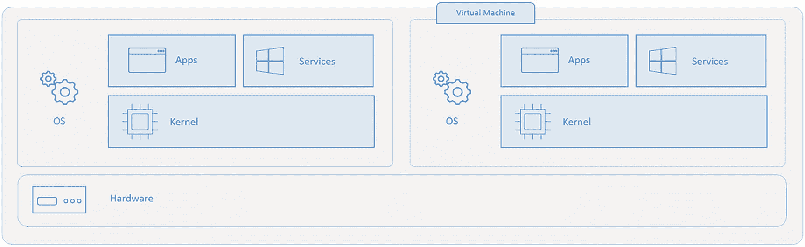

图 4-1

虚拟机架构

另一方面，使用 Docker 运行三个容器化应用程序的服务器运行单个操作系统，每个容器与其他容器共享操作系统内核(见图 [4-2](#Fig2) )。操作系统的共享部分是只读的，而每个容器都有自己的挂载(即访问容器的方式)用于写入。这意味着容器比虚拟机更轻量级，使用的资源也更少。

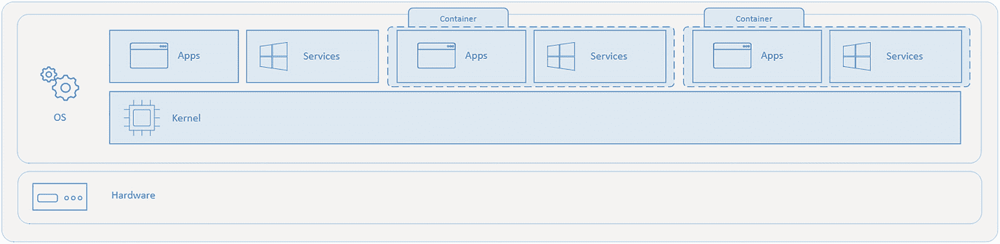

图 4-2

容器架构礼貌: [https:// docs。微软。com/en-us/virtual ization/windows container s/about/containers-vs-VM](https://docs.microsoft.com/en-us/virtualization/windowscontainers/about/containers-vs-vm)

集装箱化带来了以下好处:

*   隔离

*   紧密的

*   一致的

*   快的

*   简单的

*   可攀登的

*   轻便的

容器可以在各种设备和操作系统上运行，如图 [4-3](#Fig3) 所示。

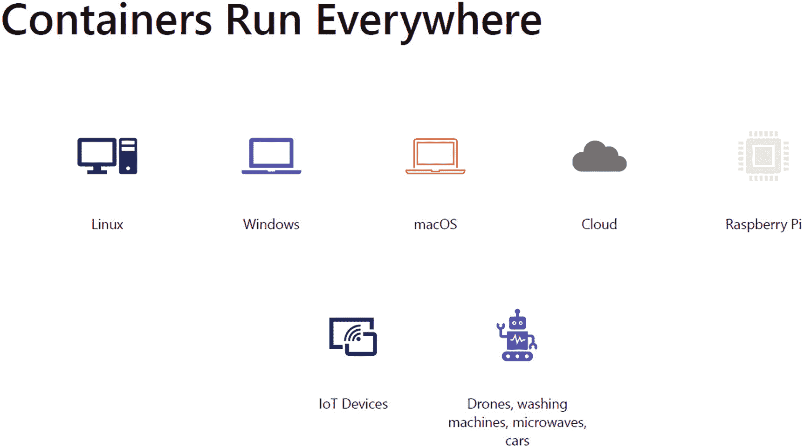

图 4-3

集装箱无处不在

图 [4-4](#Fig4) 中的图表显示了传统部署是如何发展到容器的。

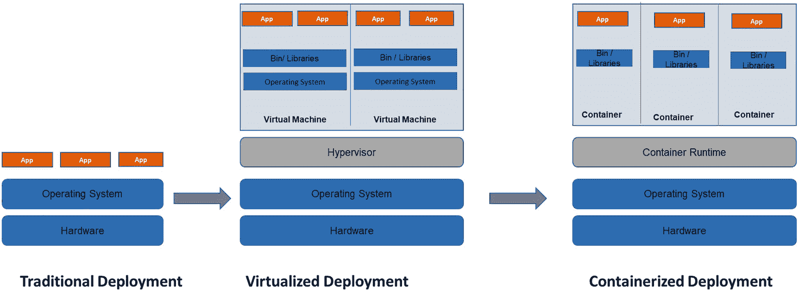

图 4-4

部署随时间的演变。io/docs/concepts/overview/what-is kubernetes/#时光倒流

有两种类型的容器可用——Linux 和 Windows——图像层如图 [4-5](#Fig5) 所示。

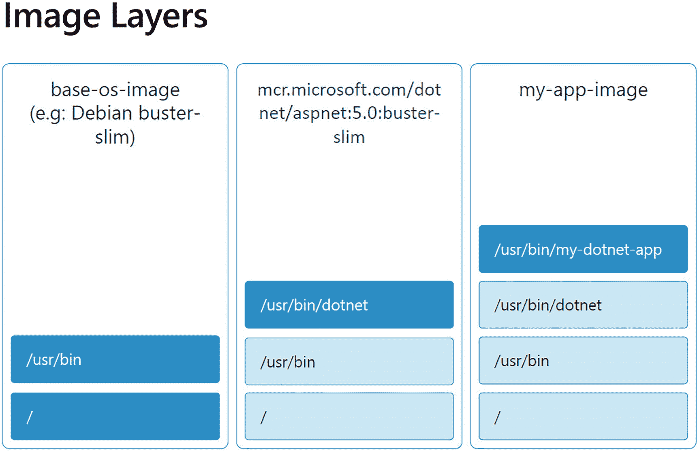

图 4-5

图像中的层

容器层如图 [4-6](#Fig6) 所示。

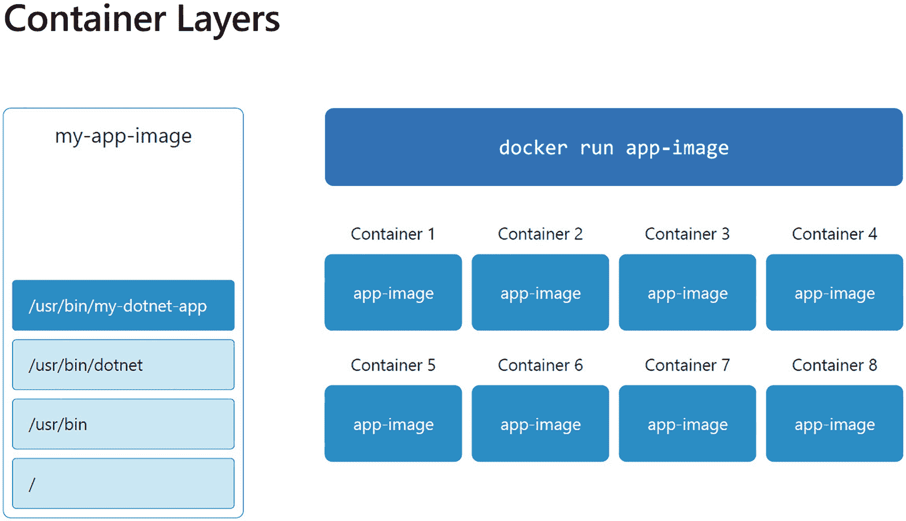

图 4-6

多层容器

## 使用 Docker

Docker 是一个开发、发布和运行应用程序的开放平台。Docker 使您能够将应用程序从基础设施中分离出来，这样您就可以快速交付软件。使用 Docker，您可以像管理应用程序一样管理基础设施。参见图 [4-7](#Fig7) 。

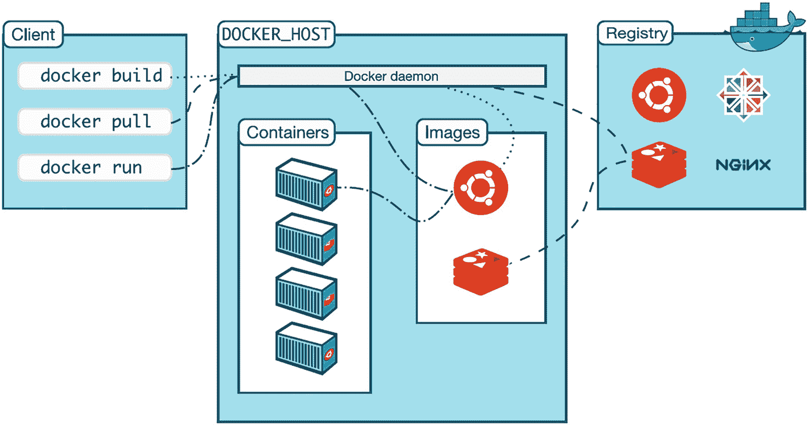

图 4-7

Docker 容器互动礼遇:[https://docs . docker . com/get-started/overview/](https://docs.docker.com/get-started/overview/)

下面列出了构建 docker 容器的开发工具:

*   VS 代码

*   推荐 Windows 使用:
    *   Windows 终端
        *   [T2`https://github.com/microsoft/terminal#installing-and-running-windows-terminal`](https://github.com/microsoft/terminal%2523installing-and-running-windows-terminal)

    *   如果允许，Linux 的 Windows 子系统(WSL2)
        *   [T2`https://docs.microsoft.com/en-us/windows/wsl/about`](https://docs.microsoft.com/en-us/windows/wsl/about)

    *   软件包管理器，如`winget`或`scoop`，如果允许的话(使在 Windows 上安装 CLI 工具更容易)

    *   您选择的首选 shell:PowerShell Core(pwsh)、GitBash、WSL2 Bash/ZSH 等等

*   CLI 工具:用于在 Kubernetes 服务上执行运行构建和运行 Docker 容器的命令。
    *   饭桶

    *   蓝色 CLI

    *   库布特雷

    *   定制

    *   舵

    *   Curl 或 Httpie

此外，你需要 Docker 桌面，如下所述。

### 在您的开发环境中安装 Docker 桌面

[`https://www.docker.com/products/docker-desktop`见](https://www.docker.com/products/docker-desktop)。

首先，确保 Kubernetes 已启用，如图 [4-8](#Fig8) 所示。

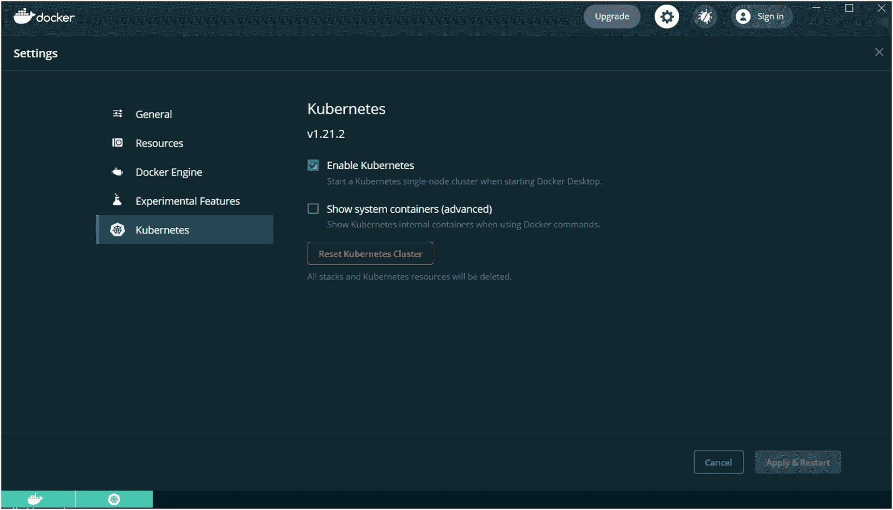

图 4-8

Kubernetes 启用的设置

如果你正在使用 WSL2，不要忘记启用它来设置限制，如 [`https://docs.microsoft.com/en-us/windows/wsl/wsl-config#configure-global-options-with-wslconfig`](https://docs.microsoft.com/en-us/windows/wsl/wsl-config%2523configure-global-options-with-wslconfig) 中所解释的。您还需要将 Docker 集成到您的`wsl2`发行版中(参见参考资料选项)。

现在让我们来看一个部署在 Docker 容器上的基本级别的“Hello World”程序。如果 Docker 镜像还没有下载到本地，Docker 会从 [Docker Hub](https://hub.docker.com/) 获取镜像。

从终端运行以下命令:

```
    docker run hello-world

```

Note

`docker run = docker create + docker start (+ also docker attach)`

`hello-world`形象从何而来？是官方形象吗？

Hint

[`https://hub.docker.com/_/hello-world`见](https://hub.docker.com/_/hello-world)。

观察输出日志，从从公共注册表中提取图像开始。

现在您需要运行 Ubuntu 并与其 shell 环境交互:

```
docker run -it ubuntu bash

or

docker run -i -t ubuntu bash

```

在 Docker 容器中执行以下命令:

```
ls

```

通过键入`exit`退出容器外壳。

花点时间去理解当与`docker run`一起使用时`-it`标志的作用:

```
`i` - keep STDIN open even if not attached
`t` - Allocate a pseudo-tty

```

一个容易记忆的方法是`-it`表示 *i* 交互 *t* 终端。

要查看本地缓存的图像，请使用以下命令:

```
docker images

```

结果显示了在您的环境中本地缓存的图像。下次运行该图像时，它不会从注册表中取出。

### 探索 docker 运行命令

再次运行同一个 Ubuntu 映像，但这次稍加改动:

1.  末尾不带`bash`运行。注意到它仍然像以前一样工作吗？这是因为 Ubuntu 映像的`cmd`被默认设置为运行`bash`。退出容器外壳。

```
docker run -it ubuntu

```

Note

如果你只是运行`docker run ubuntu`，`bash`会自动退出，因为它没有`stdin`可以监听。稍后您将了解如何在 Docker 中使用`EntryPoint`执行流程，以及 web 应用程序如何使用它。

1.  现在用其他命令覆盖默认的`cmd`，比如`ls`。运行以下命令并注意不同的结果:

```
docker run -it ubuntu ls

```

观察结果。这是怎么回事？您正在覆盖该图像的默认`cmd`。`https://docs.docker.com/engine/reference/run/#cmd-default-command-or-options`见。

### 运行 web 服务器

按如下方式运行`nginx`网络服务器:

```
    docker run -d -p 9000:80 nginx
    # -p stands for publish (publish a container's port to the host)

# You will be able to see the webpage on localhost:9000 if you are running docker locally or in a linux vm.

```

`-d`标志表示容器将在分离模式下运行，所以它不会等待通过`stdin`的输入。

```
# See running containers
    docker ps

```

现在，运行`nginx`容器的另一个实例。只需使用不同的端口。

```
docker run -d -p 9001:80 nginx
docker ps # notice the new container from same image. Much like new objects from a class.

```

### 从终端查看网页内容

您可以使用 HTTP 客户端工具(如`curl`或`httpie`)从浏览器或终端查看网页:

```
curl localhost:9000

# or via httpie (for coloured output and more helpful info)
http localhost:9001

```

现在停止 nginx 容器:

```
# run `docker ps` to list the running containers.

docker stop <container-id>
        or
docker stop <container_name_1> <container_name_2> # Note: it's container name not image name.

```

额外收获:寻找`stop`、`kill`和`rm`命令之间的区别。

现在您可以看到所有容器，包括`created`和`exited`容器:

```
# `docker ps` only shows containers that are of status `Running`. To see all containers, use `-a` flag

    docker ps -a

```

您总是可以通过发出`start`命令来启动一个停止的容器。

通过在`docker ps -a`上查找，找到您想要启动的容器。仅仅因为容器已经停止或退出，并不意味着它已经死了。

```
docker start <container_id or name>

```

### 清理流程

要删除已停止的容器，请使用以下命令:

```
docker rm <container_id/name>

```

要删除图像，请使用以下命令:

```
docker rmi image <image_id_1> <image_id_2>

```

使用`docker system prune`命令清理悬空资源:

```
docker system prune

```

要清理所有资源，包括映像、容器、卷等，请使用以下命令:

```
docker system prune --all

# `y' when prompted

```

Important

与任何其他系统一样，请谨慎使用这些清理命令。不要强制删除仍被容器引用的图像。

快速阅读以下链接:

*   [T2`https://docs.docker.com/engine/reference/commandline/system_prune/`](https://docs.docker.com/engine/reference/commandline/system_prune/)

*   [T2`https://docs.docker.com/config/pruning/`](https://docs.docker.com/config/pruning/)

*   [T2`https://docs.docker.com/engine/reference/commandline/rmi/`](https://docs.docker.com/engine/reference/commandline/rmi/)

要检查您的环境是否已清理，请使用以下命令:

```
docker ps -a
docker images -a

```

下一节将介绍 Docker 基础知识。

### 文档文件

为了开始这个例子，创建一个名为`Docker Directory`的目录。创建您的第一个 docker 文件并执行一个`CMD (greeter:1.0)`:

1.  从`docker`目录中，创建一个名为`my_first_dockerfile`的子目录，并在其中创建一个 Dockerfile。设置应该如下所示，这样您就有了一个名为`docker`的基本目录。

    您可以从终端使用`touch Dockerfile`,或者右键单击适当的文件夹并选择新建文件:

```
```bash
    # from my_first_dockerfile directory
    touch Dockerfile
```

```

您的设置应该如下所示:

1.  在 Dockerfile 文件中键入以下内容。(除非特别说明，否则避免复制和粘贴。)

```
```bash
├── my_exercise
    ├── docker
    │   └── my_first_dockerfile
    │       └── Dockerfile
    └── kubernetes
```

```

1.  建立你的码头工人形象。确保终端指向 Dockerfile 所在的目录。

2.  构建一个名为`greeter`的映像，并将其标记为版本`1.0`:

```
FROM ubuntu
# Base Layer
CMD ["echo", "Hello everyone"]

```

1.  重要提示:花点时间去理解`-t`是做什么的。还要注意`docker build`后面的`.`(圆点)。

2.  使用`docker images`命令查看您的新 docker 图像。

3.  从新的 Docker 映像启动容器:

```
docker build . -t greeter:1.0

```

1.  观察输出，然后通过覆盖默认的`CMD`让它打印一些东西:

```
docker run greeter:1.0

```

```
docker run greeter:1.0 echo "hello universe"
#or any command of your choice that is available in ubuntu image
docker run greeter:1.0 sleep "3"

```

注意，您必须指定完整的命令来覆盖现有的命令。

#### 使用 entrypoint 使 greater 更具可配置性

1.  如下所示更新 Dockerfile 文件。如果需要，注释掉以前编写的代码。

1.  用 2.0 版构建并标记欢迎映像，然后运行容器。

```
FROM ubuntu

ENTRYPOINT [ "echo" ]

CMD ["Hello everyone"]

```

1.  现在，只需运行下面的代码，让容器打印您选择的消息。

```
docker build . -t greeter:2.0
docker run greeter:2.0

```

```
docker run greeter:2.0 "Hello Greeter 2.0"

```

#### 使用复制启动一个简单的静态网站

1.  在另一个文件夹中创建一个新的 docker 文件，或者继续使用现有的 docker 文件。

2.  创建一个名为`website`的文件夹，并在里面创建一个名为`index.html`的文件。键入一些简单的标记，如下所示。注意 Linux 中的文件名是区分大小写的。

1.  现在，在 docker 文件中键入以下内容:

```
<h1>Hello World</h1>

```

```
FROM nginx:alpine
# Notice the change in base image.
COPY ./website/ /usr/share/nginx/html

```

4.将网站文件夹的内容复制到 nginx 默认网站位置。Nginx 是一个强大且非常受欢迎的 web 服务器。参见 [`https://hub.docker.com/_/nginx`](https://hub.docker.com/_/nginx) 的 Nginx 基础图像。

5.现在建立你的 Docker 图像如下。请随意为图像选择您自己的名称。在构建之前，请确保您的文件夹结构如下所示:

1.  运行分离的映像并进行端口转发。如果端口已经被使用，您将得到一个异常。

```
.
├── Dockerfile
└── website
    └── index.html
    docker build . -t hello-web:1.0
    docker images "hello-web" # to see your new built image.

```

1.  使用`docker ps`确保容器按预期运行。观察您的`my-first-website`容器的所有列。

2.  使用`docker stop <container-name>`停止容器。

```
docker run --name my-first-website -d -p 9000:80 hello-web:1.0
 # Notice the `--name` argument. We give our own container name this time.

```

### 监控 Docker 容器和 Docker 日志

首先在分离模式下启动一个容器，每秒打印一次日期。我们在这里使用了一个`busybox`图像，并将容器称为`date-printer`:

```
docker run --name date-printer -d busybox sh -c "while true; do $(echo date); sleep 1; done"

```

现在跟随它的日志。按 Ctrl+C 退出。

```
docker logs -f date-printer
Retrieve logs only since last 3 seconds
docker logs date-printer --since=3s

```

[`https://docs.docker.com/engine/reference/commandline/logs/`见](https://docs.docker.com/engine/reference/commandline/logs/)。

### Docker Exec:在运行的容器中运行命令！

启动一个`redis`容器，并确保它正在运行。

```
docker run -d redis
docker ps
# note down the container name

```

现在使用 redis 的 CLI 设置一些数据。首先连接到它的容器外壳。

```
docker exec -it <redis_container_name> sh

```

进入容器后(当提示符变为`#`时)，键入以下内容:

```
redis-cli

```

提示符现在应该类似于`127.0.0.1:6379` (redis 默认运行在 6379 上):

```
set name "Jane"
exit
exit
# Exit from `redis-cli` and then from the `container shell`

```

从终端，您可以直接检索这些数据。下面的输出应该打印`Jane`，例如:

```
docker exec -it <redis_container_name> redis-cli get name

```

### 码头检查

您可以检查容器、网络、卷等 Docker 对象的所有属性和状态。

例如，要检查一个容器，发出以下命令:

```
docker inspect <container_id or name>

```

要检查 Docker 网络，请发出以下命令:

```
docker network ls
docker inspect <network_name>
# for e.g: docker inspect bridge (default network that containers attach to when network not specified)

```

使用 Linux 命令行工具，如`jq`，您可以操作 JSON 输出。

以下命令将打印连接到桥接网络的容器。

```
docker inspect bridge | jq '[.[].Containers]'

```

更多关于`jq`的信息，请访问 [`https://stedolan.github.io/jq/tutorial/`](https://stedolan.github.io/jq/tutorial/) 。

### 创建 Docker Hub 帐户并与之连接

前往 [`https://hub.docker.com/`](https://hub.docker.com/) ，使用您的临时/个人帐户注册。如果你使用你的个人邮箱来注册 Docker hub，确保你使用的是你自己的个人开发机器。(完成后也可以运行`docker logout`)。

1.  创建 Docker hub 帐户后，通过终端登录，如下所示:

1.  出现提示时，输入您的用户名和密码。你应该会收到类似`login succeeded`的东西。

```
docker login

```

#### 标记您的图像并将其推送到注册表

1.  在您可以将您的图像推送到您的注册表之前，您需要标记它。

    Tag your `hello-web` image as shown here.

    ```
    docker images hello-web

    # Copy the image-id
    docker tag <image-id> <dockerhub-username>/hello-web:1.0

    docker push <docker-hub-username>/hello-web:1.0

    ```

2.  转到`hub.docker.com`以确保您的图像被正确推送。稍后在 Kubernetes 实验室中，您将会看到这张图片。

3.  您可以通过如下运行来测试您的映像。

1.  从终端注销 Docker hub:

```
docker run -d -p 9010:80 <dockerhub-username>/hello-web:1.0
docker ps
docker stop <hello-web_container_id>

```

```
docker logout

```

像以前一样清理资源，以确保您的环境得到正确整理。

```
```bash
    docker system prune -a
    # type `y` when prompted
    docker ps -a
    docker images
```

```

## 使用库比涅斯

既然您已经知道如何独立运行 Docker 容器，那么是时候考虑当您有多个容器要构建和运行时会发生什么。为此，您需要一个像 Kubernetes 这样的容器编排引擎。

有许多容器编排器，如下所示:

*   忽必烈忽必烈忽必烈忽必烈忽必烈忽必烈忽必烈忽必烈忽必烈忽必烈

*   码头工人群

*   月 DC/OS

*   谷歌博格

*   还有更多

这些编排引擎提供了以下特性，您不必构建这些特性:

*   自愈

*   负载平衡

*   服务发现

*   行程安排

*   安全

*   配置

*   监视

*   缩放比例

云中的 Kubernetes 架构如图 [4-9](#Fig9) 所示。

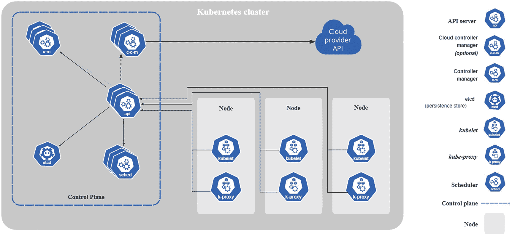

图 4-9

Kubernetes 建筑礼貌: [https:// kubernetes。io/docs/concepts/overview/components/](https://kubernetes.io/docs/concepts/overview/components/)

图 [4-10](#Fig10) 展示了对该架构的深入研究，并说明了组件之间的交互方式。

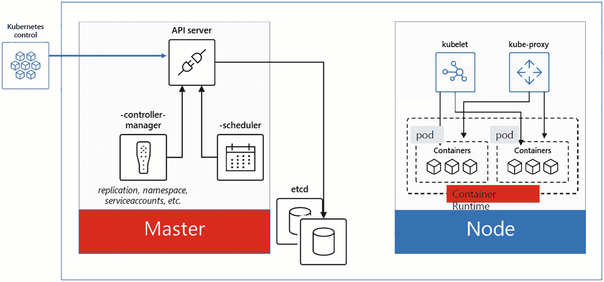

图 4-10

库比特组件

运行 Kubernetes，您需要以下任何一项

*   迷你库比

*   AK(蓝色库柏服务)

*   gke(Google kuble engine)

*   内部部署

*   树莓皮

*   还有更多

Kubernetes 总体框架的关键对象部分如下:

*   节点(无)

*   命名空间(ns)

*   pod(采购订单)

*   部署(部署)

*   服务(服务)

*   乔布斯

*   克朗乔布斯

*   配置贴图(厘米)

*   秘密

*   持续量声明(pvc)

*   Persistentvolumes (pv)

Kubernetes 上的无状态微服务/app 如图 [4-11](#Fig11) 所示。

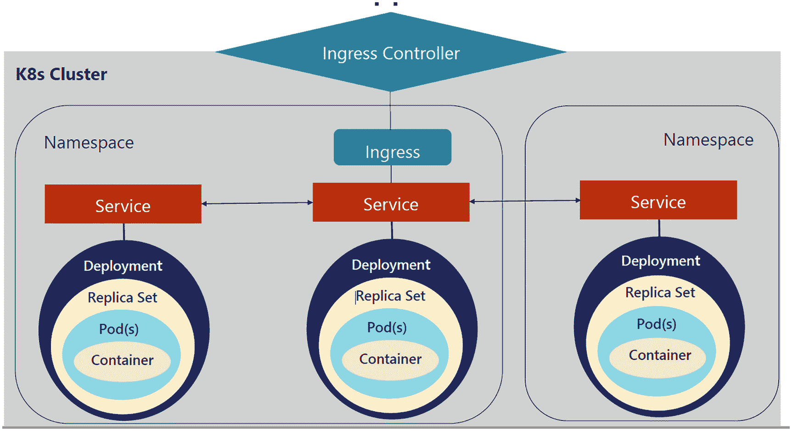

图 4-11

Kubernetes 部署和副本集

### Kubernetes 工具和设置

`kubectl`，发音为 *Kube-Control* ，是针对 Kubernetes 集群运行命令的命令行界面。

在这个练习中，你将探索`kubectl`的一些有用的特性。

1.  获取集群信息:

1.  将集群信息写入名为`cluster.txt`的文件。如果输出流`>`不工作，您可能需要`bash`T2:

```
kubectl cluster-info

```

1.  如果您愿意，也可以使用`cat`查看:

```
kubectl cluster-info > cluster.txt

```

1.  获取群集中所有命名空间的列表。在这里，您也可以看到其他参与者的名称空间。在现实世界中，您可能无权查看其他名称空间。

```
cat cluster.txt

```

1.  您可以按如下方式使用速记命令:

```
kubectl get namespaces

```

1.  使用`grep`过滤您的名称空间:

```
kubectl get ns

```

1.  检查当前上下文的默认名称空间:

```
kubectl get ns | grep '<your-namespace-name>'

```

```
kubectl config get-contexts

```

您应该在`NAMESPACE`列下看到您的名称空间。

Important

如果`NAMESPACE`列为空或者不包含您的名称空间名称，这意味着您没有正确配置您的默认名称空间。请参见 repo 的自述文件或向讲师寻求帮助。

1.  获取群集中的节点列表:

    `kubectl get nodes`

您可以使用- `o wide`查看更多信息:

```
kubectl get nodes -o wide

```

`kubectl explain`将解释给定的资源，例如像 Pod 这样的顶级 API 对象或像 Pod 的容器这样的特定字段。

1.  获取 Pod 资源及其字段的文档。

1.  获取 Pod 容器规格的文档。

    `# to just explain pod`

    `kubectl explain pod`

    `# to further explain the properties` `and nested objects`

```
kubectl explain node

```

```
kubectl explain pods.spec.containers

```

Note

`pods.spec.containers`匹配 YAML 物体结构:

```
apiVersion: v1
kind: Pod
metadata:
creationTimestamp: null
name: nginx
spec:
  containers:
  - image: nginx
    imagePullPolicy: IfNotPresent
    name: nginx
    resources: {}
  dnsPolicy: ClusterFirst
  restartPolicy: Never

```

在 Azure 门户中，你可以创建 AKS 集群，如图 [4-12](#Fig12) 所示。

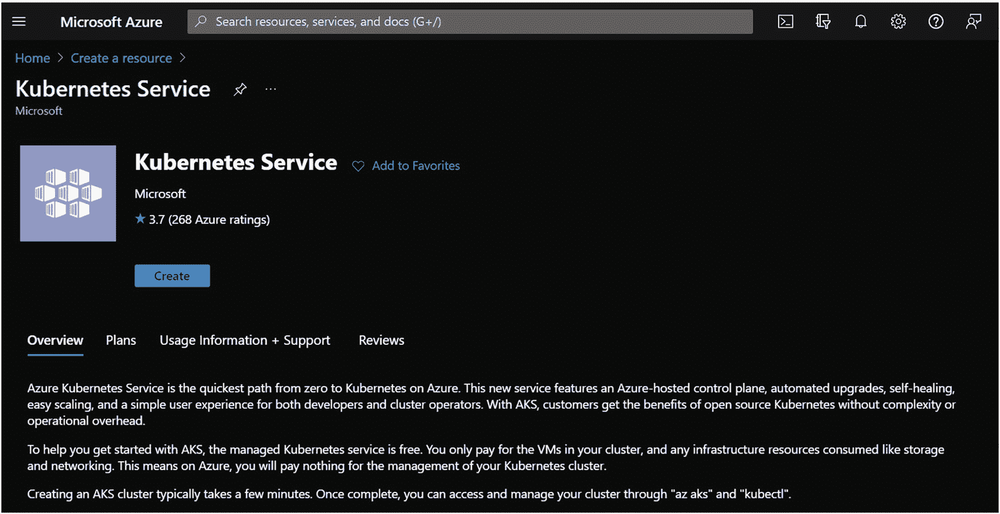

图 4-12

蓝色忽必烈服务

您单击 Create，然后根据您的要求继续填写信息。参见图 [4-13](#Fig13) 。

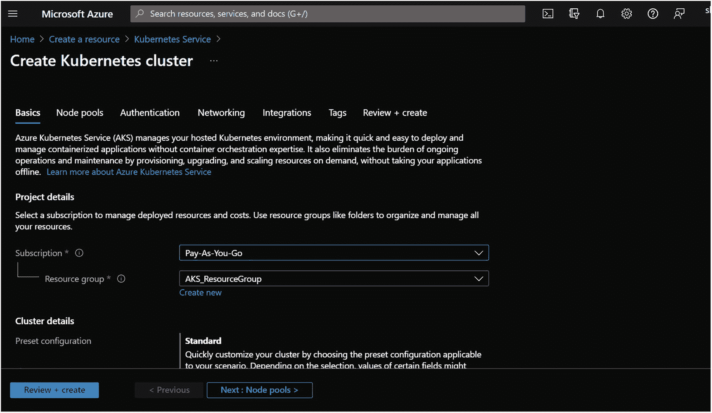

图 4-13

Azure Kubernetes 服务:创建群集

以下是您可以使用的一些高级 Azure CLI 命令:

```
Run az --version to find the version.

```

要创建 Azure Kubernetes 集群，发出以下命令:

```
az aks create \
    --resource-group newResourceGroup \
    --name newAKSCluster \
    --node-count 3 \
    --generate-ssh-keys \
    --attach-acr <acrName>

```

要安装 CLI，请发出以下命令:

```
az aks install-cli

```

要连接到集群，请发出以下命令:

```
az aks get-credentials --resource-group aksResourceGroup --name newAKSCluster

```

要获取节点，发出以下命令:

```
kubectl get nodes

```

## 摘要

在本章中，你学习了什么是容器和 Kubernetes，以及如何在开发中设置和使用它们。下一章着眼于如何监控和保护 Azure Kubernetes 集群(AKC)。

## 附录

[T2`https://docs.microsoft.com/en-us/virtualization/windowscontainers/about/containers-vs-vm`](https://docs.microsoft.com/en-us/virtualization/windowscontainers/about/containers-vs-vm)

[T2`https://kubernetes.io/docs/concepts/overview/what-is-kubernetes/#going-back-in-time`](https://kubernetes.io/docs/concepts/overview/what-is-kubernetes/%2523going-back-in-time)

[T2`https://docs.docker.com/get-started/overview/`](https://docs.docker.com/get-started/overview/)

[T2`https://github.com/microsoft/terminal#installing-and-running-windows-terminal`](https://github.com/microsoft/terminal%2523installing-and-running-windows-terminal)

[T2`https://docs.microsoft.com/en-us/windows/wsl/about`](https://docs.microsoft.com/en-us/windows/wsl/about)

[T2`https://www.docker.com/products/docker-desktop`](https://www.docker.com/products/docker-desktop)

[T2`https://docs.microsoft.com/en-us/windows/wsl/wsl-config#configure-global-options-with-wslconfig`](https://docs.microsoft.com/en-us/windows/wsl/wsl-config%2523configure-global-options-with-wslconfig)

[T2`https://hub.docker.com/_/hello-world`](https://hub.docker.com/_/hello-world)

[T2`https://docs.docker.com/engine/reference/run/#cmd-default-command-or-options`](https://docs.docker.com/engine/reference/run/%2523cmd-default-command-or-options)

[T2`https://docs.docker.com/engine/reference/commandline/system_prune/`](https://docs.docker.com/engine/reference/commandline/system_prune/)

[T2`https://docs.docker.com/config/pruning/`](https://docs.docker.com/config/pruning/)

[T2`https://docs.docker.com/engine/reference/commandline/rmi/`](https://docs.docker.com/engine/reference/commandline/rmi/)

[T2`https://hub.docker.com/_/nginx`](https://hub.docker.com/_/nginx)

[T2`https://docs.docker.com/engine/reference/commandline/logs/`](https://docs.docker.com/engine/reference/commandline/logs/)

[T2`https://stedolan.github.io/jq/tutorial/`](https://stedolan.github.io/jq/tutorial/)

[T2`https://kubernetes.io/docs/concepts/overview/components/`](https://kubernetes.io/docs/concepts/overview/components/)