# 一、iOS 应用开发基础

> *本章面向 iOS 应用开发初学者。如果你是 iOS 开发者或者有开发 iOS 应用的经验，可以跳过。*

为了开发 iOS 应用，苹果提供了几种工具和资源。iOS 应用可以用原生编程语言开发，如 Swift 或 Objective-C 等跨平台语言。

在本章中，我将介绍 iOS 应用开发的要求和基本构建模块，同时通过使用 Swift 构建一个示例应用并在 iOS 设备和 iOS 模拟器上测试该应用，引导您完成整个过程。

## 开发要求

作为一名 iOS 开发者，你需要一台 macOS 设备和一个苹果开发者账号才能开始开发。

### 苹果个人计算机

要开始 iOS 开发，需要一台 Mac。它有笔记本和台式机两种版本。目前的笔记本版本有 MacBook Air 和 MacBook Pro，台式机版本有 iMac、Mac Pro、Mac mini。在图 [1-1](#Fig1) 中可以看到一些 Mac 型号。

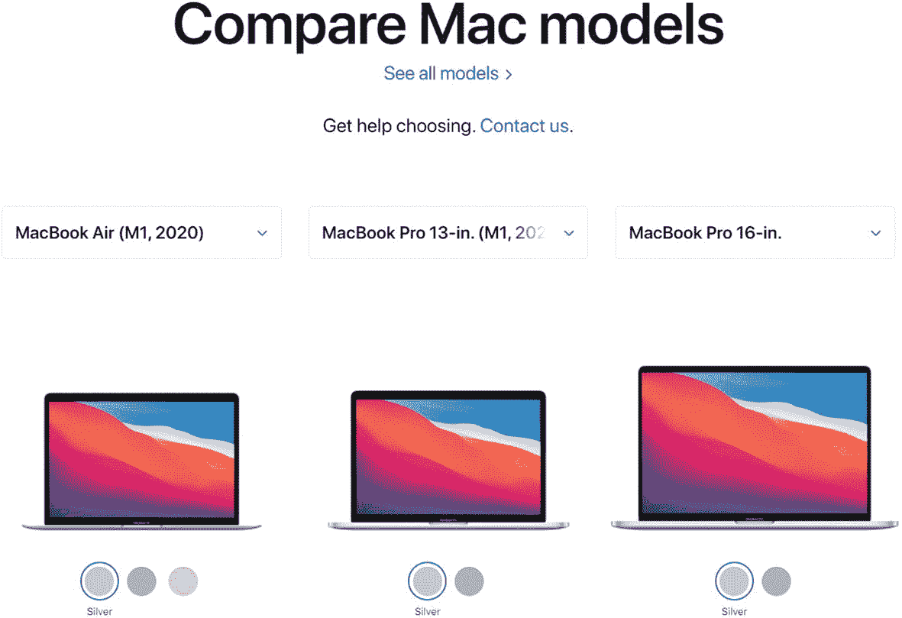

图 1-1

比较各种 Mac 型号

*   所有不同的 Mac 选项都可以在 [`www.apple.com/mac/compare/`](https://www.apple.com/mac/compare/) 进行比较。

### 苹果开发者账户

你可以免费注册成为苹果开发者。你只需要一个苹果 ID。有了免费的开发者账户，你就可以在你的 Mac 上安装 Xcode(我们将在下一节介绍)、iOS 开发文档、样本代码、苹果开发者论坛和错误报告。你也可以在设备上测试你的应用。免费的苹果开发者账号足够本地测试和开发。但是，要分发应用，您需要注册苹果开发者计划。

苹果开发者计划是一个付费会员计划，按年计费。如果您对创建应用并在 App Store 上发布感兴趣，这是必需的。关于苹果开发者计划的更多细节可以在苹果网站上找到，如图 [1-2](#Fig2) 所示。

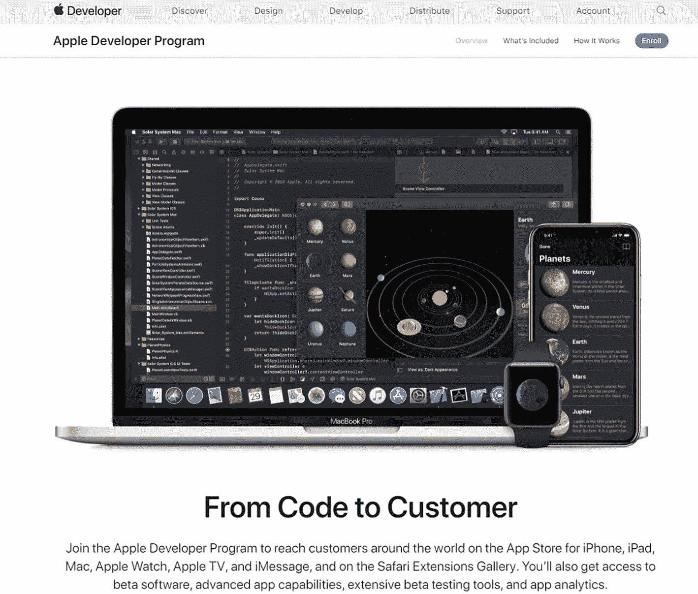

图 1-2

苹果开发者计划

*   苹果开发者网站可以在 [`https://developer.apple.com/programs/`](https://developer.apple.com/programs/) 访问。

## 迅速发生的

Swift 是苹果公司在 2014 年开发的一种编程语言。开发 Swift 的目的是找到 C、C++和 Objective-C 等基于 C 的语言的替代品。凭借其语法的表达性质，Swift 拥有开发人员想要的现代功能，并使 iOS 应用开发更容易。

有各种资源可用于学习 Swift 然而，苹果公司开发的应用 Swift Playgrounds 可以让你以有趣和互动的方式学习 Swift。目前该应用适用于 iPad 和 Mac，可以从 App Store 下载，如图 [1-3](#Fig3) 所示。

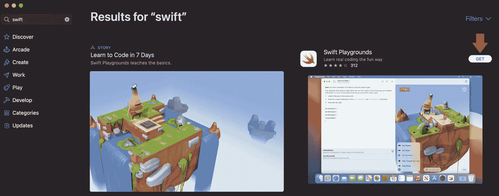

图 1-3

斯威夫特游乐场

### Xcode 简介

除了支持在 MacOS 系统上开发之外，Xcode 还是由 Apple 开发的集成开发环境(IDE ),它拥有您在所有 Apple OS 平台上开始 iOS 开发所需的一切。它包括代码编辑器、调试器等功能。它还附带了一个模拟器，使您能够在真实的 iOS 设备上构建和测试您的应用，而不需要物理 iOS 设备。

在接下来的几节中，我将向您展示如何安装 Xcode 并使用它来构建和部署 iOS 应用。

#### 安装 Xcode 12

我将在 macOS Big Sur 上安装 Xcode 12，这两个版本目前分别是 Xcode 和 macOS 的最新版本。要安装，去 Mac 上的 App Store 搜索 Xcode，如图 [1-4](#Fig4) 所示。

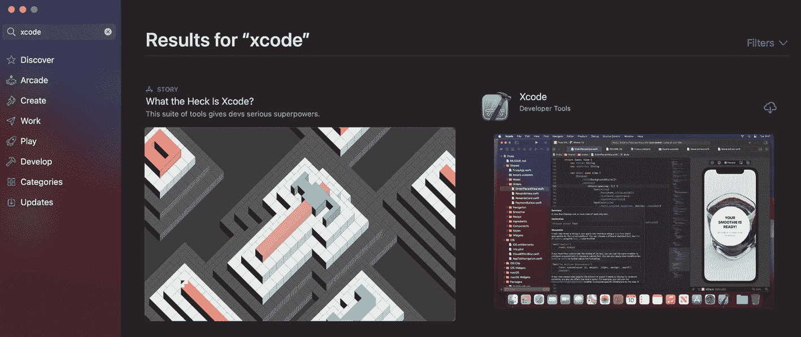

图 1-4

App Store 上的 Xcode 搜索结果

单击安装图标，等待安装完成。

*   如果您收到类似“Xcode 不能安装在“Macintosh HD”上，因为需要 macOS X 版本或更高版本”的错误，请在尝试安装之前更新您的 MAC OS。

安装后，启动 Xcode，你应该会看到一个欢迎页面，如图 [1-5](#Fig5) 所示。

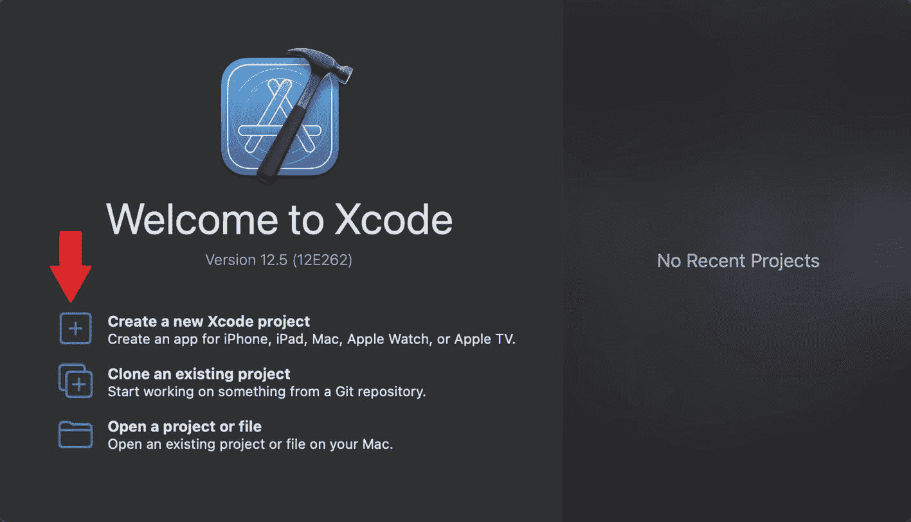

图 1-5

启动 Xcode

接下来，我将通过创建一个示例应用向您展示如何使用 Xcode 创建应用。

### 创建应用

安装 Xcode 后，您就可以开始构建 iOS 应用了。我将从使用 Xcode 提供的应用模板开始，然后添加自定义代码来定制应用。

#### iOS 应用模板

Xcode 提供了样本模板，可以轻松开始构建应用。这些模板可以通过创建一个新的 Xcode 项目来访问(图 [1-5](#Fig5) )，并显示不同的可用模板。对于我正在构建的样例 app，我会选择 iOS 和 App，如图 [1-6](#Fig6) 所示。

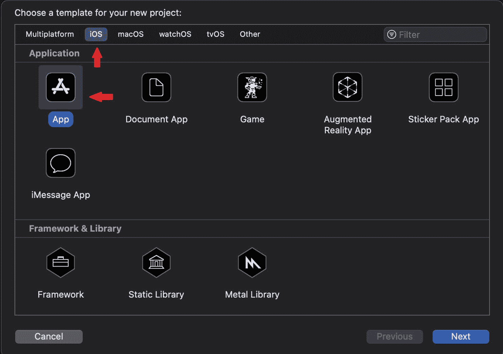

图 1-6

为 Xcode 项目选取模板

如果这是你第一次使用 Xcode，会有提示用 Apple ID 登录，如图 [1-7](#Fig7) 所示。

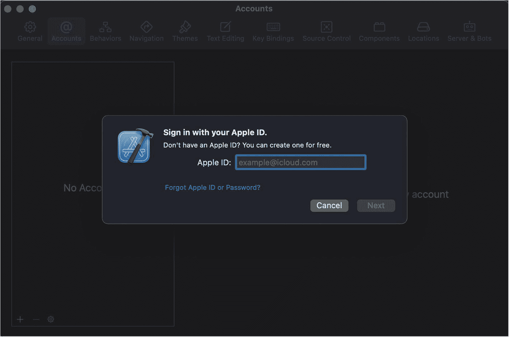

图 1-7

苹果登录新 Xcode 项目

登录并将 Apple ID 链接到 Xcode 后，将会提示您配置新 Xcode 项目的详细信息。示例如图 [1-8](#Fig8) 所示。

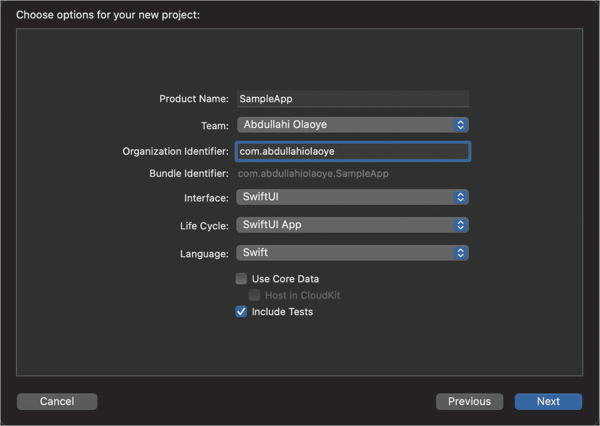

图 1-8

填写新 Xcode 项目的详细信息

创建之前，必须选择工作站上保存应用的文件夹位置。一旦完成，就创建了一个应用，如图 [1-9](#Fig9) 所示。

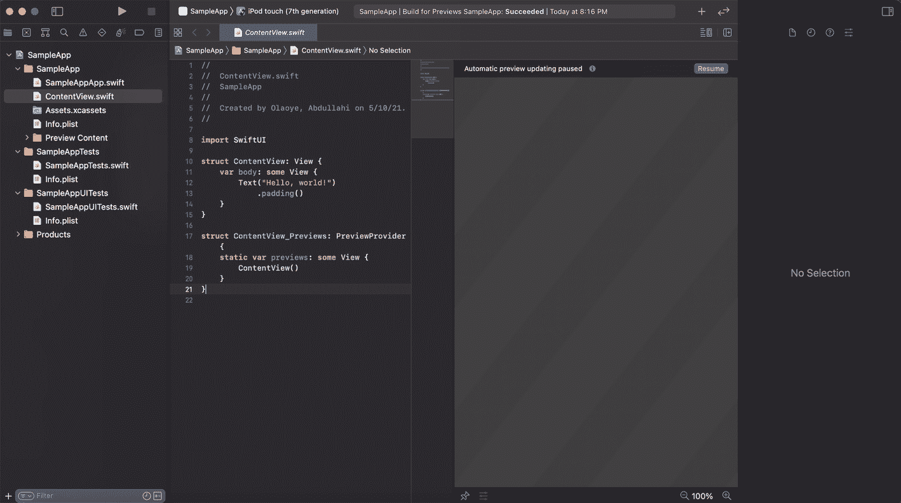

图 1-9

已创建示例应用项目模板

如图 [1-9](#Fig9) 所示，由于在图 [1-8](#Fig8) 中创建项目时选择了 Swift 语言，所以应用模板是用 Swift 语言编写的。

让我们看看现成的 Swift 代码，看看它在做什么。

```
import SwiftUI

struct ContentView: View {
    var body: some View {
        Text("Hello, world!")
            .padding()
    }
}

struct ContentView_Previews: PreviewProvider {
    static var previews: some View {
        ContentView()
    }
}

Listing 1-1ContentView.swift

```

清单 [1-1](#PC1) 中的代码片段负责显示在 iOS 设备上的视图；正如所见，这个 iOS 应用模板简单地打印出 ***“你好，世界！”*** 。

```
import SwiftUI

@main
struct SampleAppApp: App {
    var body: some Scene {
        WindowGroup {
            ContentView()
        }
    }
}

Listing 1-2SampleAppApp.swift

```

清单 [1-2](#PC2) 显示了应用的入口点，如图所示，它通过调用 ***ContentView()*** (在不同的文件 ContentView.swift 中定义)来运行应用，如清单 [1-1](#PC1) 所示。

#### Xcode 实时预览

在配置项目时选择 SwiftUI 界面，可以在代码中对内容视图进行更改时实时预览应用。

让我们来看一个默认应用的预览。从运行目标菜单中，选择您想要使用的 iOS 模拟器，如图 [1-10](#Fig10) 所示。

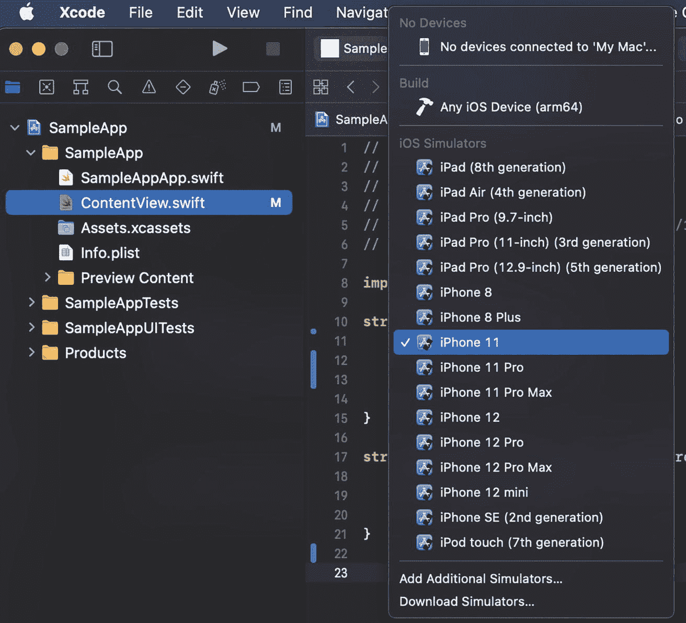

图 1-10

选择 iOS 模拟器

选择 iPhone 11 模拟器，预览显示在模拟的 iPhone 11 上，如图 [1-11](#Fig11) 所示。如图所示，实时预览让您能够在运行构建之前查看应用视图的外观。当在代码中对应用视图进行更改时，预览也会更新。

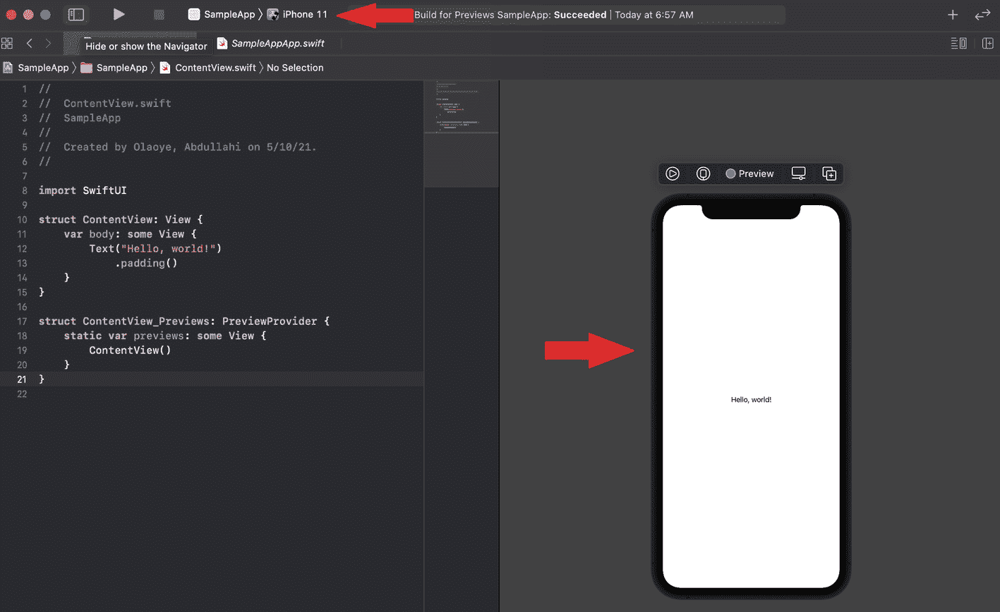

图 1-11

iPhone 11 模拟器上的默认应用预览

#### 与 Swift 一起发展

至此，您已经使用了创建 Xcode 项目时作为所选模板的一部分提供的默认应用，现在让我们添加一个自定义 Swift 代码。

用清单 [1-3](#PC3) 中的代码替换***content view . swift**T3 的内容。*

*   代码也可以在 [`https://github.com/abdulola/devops-on-aws-ios-development-app/blob/master/SampleApp/ContentView.swift`](https://github.com/abdulola/devops-on-aws-ios-development-app/blob/master/SampleApp/ContentView.swift) 下载

```
import SwiftUI

struct ContentView: View {
    @State private var date = Date()

    let dateRange: ClosedRange<Date> = {
        let calendar = Calendar.current

        let startComponents = DateComponents(year: 2021, month: 1, day: 1)
        let endComponents = DateComponents(year: 2021, month: 12, day: 31, hour: 23, minute: 59, second: 59)
        return calendar.date(from:startComponents)!
            ...
            calendar.date(from:endComponents)!
    }()

    var body: some View {
        DatePicker(
            "Start Date",
            selection: $date,
            in: dateRange,
            displayedComponents: [.date, .hourAndMinute]
        )
        .padding(.all)
        .datePickerStyle(GraphicalDatePickerStyle())
    }
}

struct ContentView_Previews: PreviewProvider {
    static var previews: some View {
        ContentView()
    }
}

Listing 1-3Sample Application Code

```

示例应用是一个简单的虚拟日历应用，允许您选择日期和该日期内的时间。接下来，您将为此应用添加一个图标。

#### 添加应用图标

应用图标是应用的可视化表示，显示在主屏幕、App Store 和各种其他位置，如设置和搜索结果。由于用途多样，苹果要求应用图标有不同的大小。

*   这款应用的图标示例可以从 GitHub 的 [`https://github.com/abdulola/devops-on-aws-ios-development/tree/main/Chapter_1/AppIcons`](https://github.com/abdulola/devops-on-aws-ios-development/tree/main/Chapter_1/AppIcons) 下载。

进入 ***Assets.xcassets*** ，拖动图标到各自的槽位，即可添加 App 图标，如图 [1-12](#Fig12) 所示。

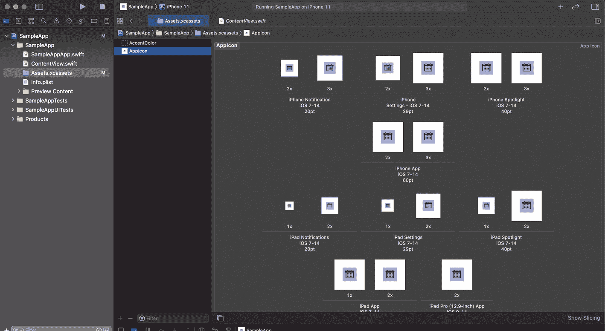

图 1-12

添加应用图标

### 构建应用

我们已经创建了一个定制的示例应用代码，并为该应用添加了一个图标。我们已经准备好了应用的所有基本构件。现在我们将构建应用并在 iOS 设备上运行它。

#### 基于物理 iPhone 构建

让我们看看这个应用在物理 iOS 设备上是什么样子的，比如 iPhone。

要在物理 iPhone 上构建应用，必须将其插入用于开发的 Mac 工作站。一旦将设备插入工作站，就可以选择它作为构建目标。示例如图 [1-13](#Fig13) 所示。

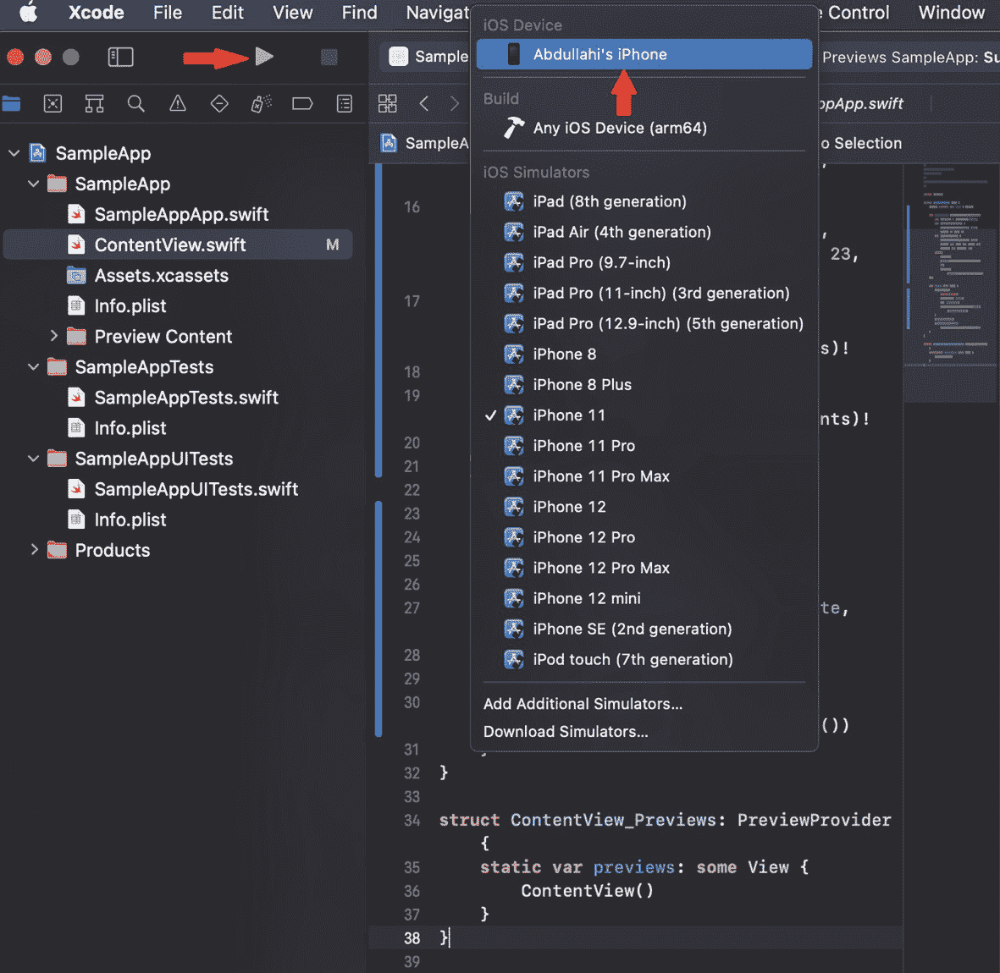

图 1-13

选择用于构建的物理 iOS 设备

要在已连接的物理 iOS 设备上开始构建，请单击设备选项左侧的播放标志按钮(图 [1-13](#Fig13) )。可能会显示 iOS 钥匙圈提示，如图 [1-14](#Fig14) 所示。这需要 Mac 工作站密码(不是你的 Apple ID 密码)。

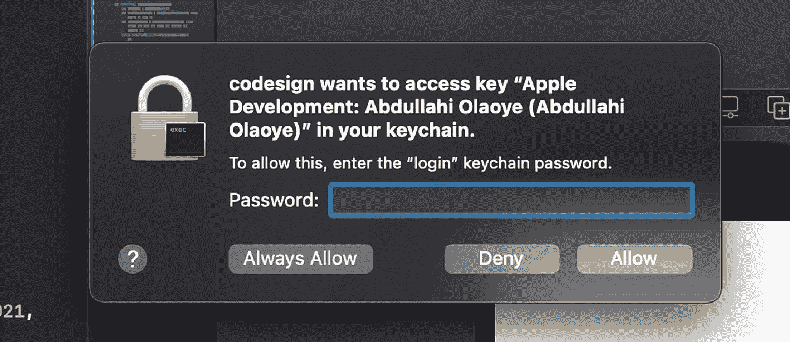

图 1-14

Apple 钥匙串登录提示

*   您需要在 Xcode ➤偏好设置下将您的 Apple 帐户添加到 Xcode，以建立 Apple 开发团队。

*   请确定您的 iPhone 已解锁，以便 Xcode 连接到它并安装示例应用。如果这是你第一次将你的 iPhone 插入 Mac 工作站，你会得到一个提示来信任工作站。

*   您可能还需要通过设置➤通用➤设备管理来信任 iPhone 上的应用开发人员。

构建完成后，带有图标的新应用就会安装在 iPhone 上。

图 [1-15](#Fig15) 显示了在物理 iPhone 上启动应用时的用户界面示例。

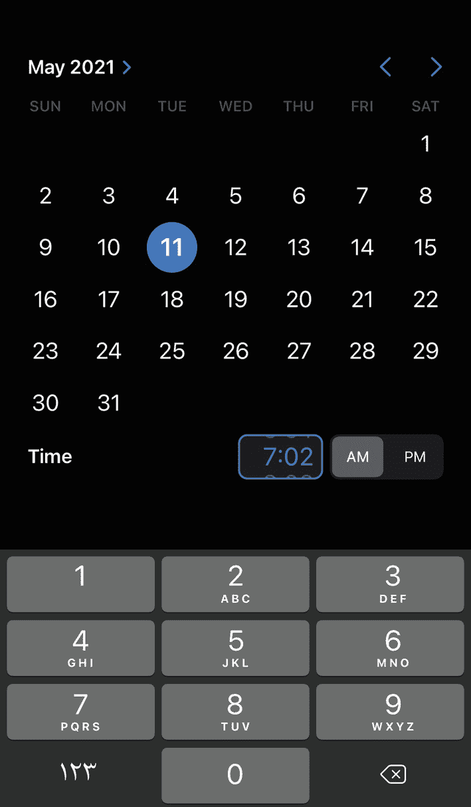

图 1-15

在物理 iPhone 上启动示例应用

#### 基于 iOS 模拟器构建

就像在物理设备上构建和运行应用一样，让我们在模拟器上运行应用。

要在模拟器上构建，应该像选择物理 iOS 设备一样选择目标设备模拟器，并开始构建，单击设备选择左侧的播放符号按钮，如图 [1-13](#Fig13) 所示。

一旦构建完成，模拟器将显示安装了应用的模拟 iPhone。使用光标滚动模拟 iPhone 的页面，并启动已安装的应用。图 [1-16](#Fig16) 显示了应用的图标以及在 iPhone 11 模拟器上启动时的样子。

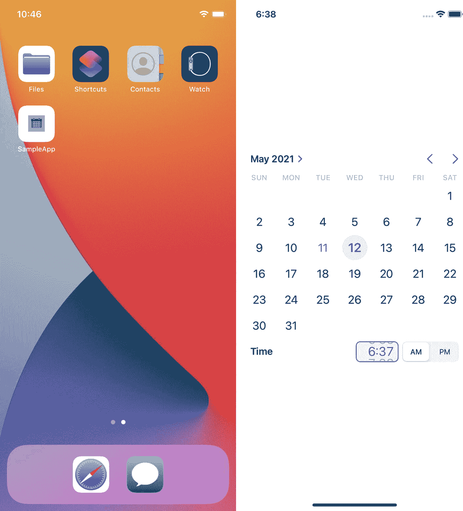

图 1-16

在 iPhone 11 模拟器上启动示例应用

### Xcode 命令行工具

到目前为止，我已经向您展示了如何使用 Xcode 用户界面构建应用；但是，您也可以通过命令行界面使用 Xcode 的命令行工具 **xcodebuild** 与 Xcode 进行交互。

xcodebuild 允许您从命令行对 Xcode 项目执行构建、测试和归档等任务。有了它，您可以在命令行上从用户界面执行我们之前执行的所有任务，这为自动化打开了大门。

它预装了 Xcode，所以在 macOS 工作站上安装它不需要额外的操作。在您的工作站上运行`xcodebuild -usage`命令来查看一些基本的使用信息，如清单 [1-4](#PC4) 所示。

```
$ xcodebuild -usage
Usage: xcodebuild [-project <projectname>] [[-target <targetname>]...
       xcodebuild [-project <projectname>] -scheme <schemeName> [-destination <destinationspecifier>]...
       xcodebuild -workspace <workspacename> -scheme <schemeName> [-destination <destinationspecifier>]...
       xcodebuild -version [-sdk [<sdkfullpath>|<sdkname>] [-json] [<infoitem>] ]
       xcodebuild -list [[-project <projectname>]|[-workspace <workspacename>]] [-json]
       xcodebuild -showsdks [-json]

Listing 1-4xcodebuild -usage truncated output

```

要查看包括所有可用选项在内的更多使用细节，运行`xcodebuild -help`并查看输出，如清单 [1-5](#PC5) 所示。

```
$ xcodebuild -help
Usage: xcodebuild [-project <projectname>] [[-target <targetname>]...
...
       xcodebuild -version [-sdk [<sdkfullpath>|<sdkname>] [-json] [<infoitem>] ]
       xcodebuild -list [[-project <projectname>]|[-workspace <workspacename>]] [-json]
       xcodebuild -showsdks [-json]
...

Options:
    -usage                        print brief usage
    -help                         print complete usage
    -verbose                      provide additional status output
    -license                      show the Xcode and SDK license agreements
    -checkFirstLaunchStatus       Check if any First Launch tasks need to be performed
    -runFirstLaunch               install packages and agree to the license
    -project NAME                 build the project NAME
    -target NAME
...

Listing 1-5xcodebuild -help truncated output

```

您可以使用 **xcodebuild** 在前面几节创建的示例应用中导航，如清单 [1-6](#PC6) 和 [1-7](#PC7) 所示。

首先，您可以列出关于示例应用项目的所有信息。

*   您必须在项目和工作区目录中才能运行以下命令。

```
$ xcodebuild -list -project SampleApp.xcodeproj
Command line invocation:
    /Applications/Xcode.app/Contents/Developer/usr/bin/xcodebuild -list -project SampleApp.xcodeproj

User defaults from command line:
    IDEPackageSupportUseBuiltinSCM = YES

Information about project "SampleApp":
    Targets:
        SampleApp
        SampleAppTests
        SampleAppUITests

    Build Configurations:
        Debug
        Release

    If no build configuration is specified and -scheme is not passed then "Release" is used.

    Schemes:
        SampleApp

Listing 1-6Listing all the information about a project

```

接下来，您可以在工作区中列出方案。

```
$ xcodebuild -list -workspace project.xcworkspace
Command line invocation:
    /Applications/Xcode.app/Contents/Developer/usr/bin/xcodebuild -list -workspace project.xcworkspace

User defaults from command line:
    IDEPackageSupportUseBuiltinSCM = YES

Information about workspace "SampleApp":
    Schemes:
        SampleApp

Listing 1-7Listing all schemes in your workspace

```

## 摘要

本章向您展示了 iOS 应用开发的基本构件；通过构建自己的应用并将其部署到实际的 iOS 设备和 iOS 模拟器上，您获得了实践经验。

在下一章中，我们将更进一步，探索如何将构建的应用提交到 App Store Connect 进行分发和/或最终提交到 Apple 的 App Store。