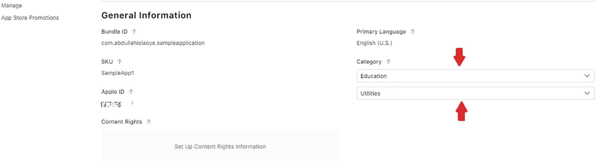
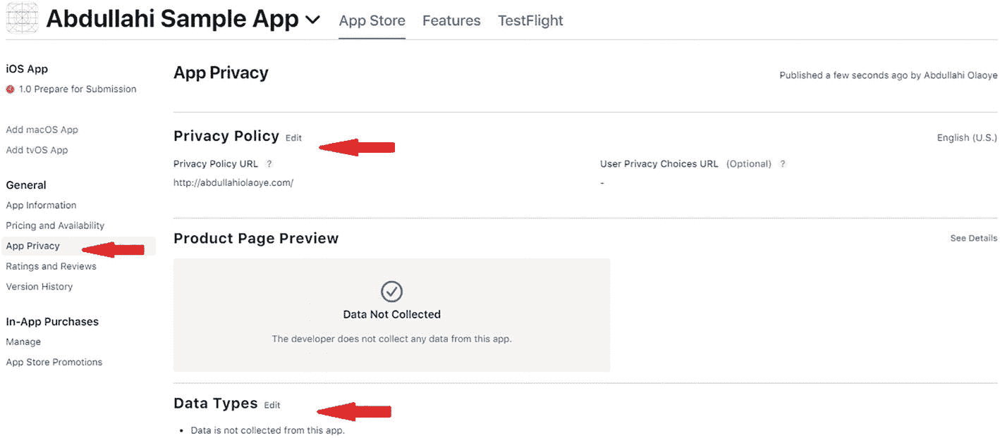

# 2.从 Xcode 到 App Store Connect

> *本章面向 iOS 应用开发初学者；如果你是 iOS 开发者或者有开发 iOS 应用的经验，可以跳过。*

在前一章中，我们看到了如何使用 Xcode 在物理 iPhone 设备和模拟器上构建和运行应用。我们将进一步探索如何通过上传到 App Store Connect 来分发之前构建的应用。

*   第 [1](01.html) (图 [1-2](01.html#Fig2) )章中涵盖的苹果开发者计划账户需要执行本章中的步骤。

## 标识符

在将应用版本上传到 App Store Connect 之前，必须为应用注册一个标识符。标识符用于唯一地标识一个应用，以便没有两个应用共享一个标识符。

可以从苹果开发者计划门户创建新的标识符。从门户可以进入**证书、标识&简介**页面，如图 [2-1](#Fig1) 所示。

图 2-1

应用开发者计划门户

*   可在 [`https://developer.apple.com/`](https://developer.apple.com/) 进入门户网站。

可以创建一个新的标识符，如图 [2-2](#Fig2) 所示。

图 2-2

创建新的标识符

用户可以创建不同类型的标识符，如图 [2-3](#Fig3) 所示。应该创建一个应用 ID。

图 2-3

选择标识符类型

目前有两种类型的应用 id。选择如图 [2-4](#Fig4) 所示的类型。

图 2-4

选择应用 ID 类型

应该提供描述和 ID 名称。示例如图 [2-5](#Fig5) 所示。

图 2-5

提供 ID 名称和描述

*   记下您在这里使用的 ID 名称。

## 应用商店连接

App Store Connect 是一个平台，用于管理 App Store 上应用的所有信息。最重要的是，应用通过 App Store Connect 提交到苹果的 App Store。您可以通过 Apple 开发者计划帐户访问 App Store Connect。入口如图 [2-6](#Fig6) 所示。

图 2-6

应用商店连接

*   App Store Connect 可在 [`https://appstoreconnect.apple.com`](https://appstoreconnect.apple.com) 访问。

必须先创建应用，然后才能将应用内容上传到 App Store Connect。这将作为应用在 App Store 上的占位符，并且可以在此配置应用的所有信息。

要创建应用，请导航至 App Store 连接应用页面并创建一个应用，如图 [2-7](#Fig7) 所示。

图 2-7

创建新应用

*   应用页面可在 [`https://appstoreconnect.apple.com/apps`](https://appstoreconnect.apple.com/apps) 访问。

*   您可能会看到创建新应用或新应用捆绑包的选项。选择“新建应用”

要创建应用，选择之前在图 [2-5](#Fig5) 中创建的包 ID，并提供应用详细信息。图 [2-8](#Fig8) 显示了我提供的申请细节。

图 2-8

提供新的应用详情

*   您的应用名称必须是唯一的，并且不能已经存在于 App Store 中。

一旦创建了应用，就会显示一个登录页面，如图 [2-9](#Fig9) 所示，在这里你可以配置更多关于你的应用的细节，比如截图和其他元数据信息。

图 2-9

App Store Connect 中的新应用

### 截图和应用详细信息

现在应用已经创建，您可以继续添加将在 App Store 上显示的应用截图以及应用的其他相关信息。

尽可能多地添加应用的详细信息。为应用输入的一些信息是截图、应用类别、定价和可用性、应用隐私、版本发布等。正如我们将在下图中看到的那样。

虽然有各种工具可以创建屏幕截图，但当应用在模拟器上运行时，iOS 模拟器可以用于截图。图 [2-10](#Fig10) 显示了在 App Store Connect 上添加截图的位置。

图 2-10

在 App Store Connect 中添加新应用的屏幕截图

*   从 iOS 模拟器创建的示例截图可从 [`https://github.com/abdulola/devops-on-aws-ios-development/tree/main/Chapter_1/Screenshots`](https://github.com/abdulola/devops-on-aws-ios-development/tree/main/Chapter_1/Screenshots) 下载。

图 [2-11](#Fig11) 显示了如何配置应用类别的示例。通过从左侧菜单中选择常规➤应用信息，可以访问应用类别。

图 2-11

为您的应用配置类别

图 [2-12](#Fig12) 显示了如何配置应用的价格和可用性。

图 2-12

为您的应用配置价格和可用性

图 [2-13](#Fig13) 显示了如何配置应用的隐私策略。

图 2-13

为您的应用添加隐私策略

图 [2-14](#Fig14) 显示了发布应用新版本的配置示例。

图 2-14

为应用添加版本发布设置

## 从 Xcode 上传构件

此时，您已经在 App Store Connect 中创建了一个应用，并配置了所有应用元数据。现在您可以从 Xcode 上传构建到 App Store Connect 了。

为此，您需要创建一个完整的应用归档。我们通过从模拟器列表中选择**任何 iOS 设备**来实现，如图 [2-15](#Fig15) 所示。

图 2-15

为完整的应用档案选择模拟器

在创建归档之前，验证 Xcode 上配置的**捆绑包标识符**是否与 App Store Connect 上配置的捆绑包 ID 相匹配，如图 [2-5](#Fig5) 所示。这一点可以在 Xcode 上 app 的通用设置中验证，如图 [2-16](#Fig16) 。

图 2-16

验证捆绑 ID

一旦验证了包 ID，就可以创建完整的归档文件了。创建档案时，选择**产品** ➤ **档案**，如图 [2-17](#Fig17) 所示。

图 2-17

创建完整的应用归档

归档完成后，会弹出一个新窗口，如图 [2-18](#Fig18) 所示，显示已创建的归档。还将列出多个归档文件(如果可用)，以及该归档文件的版本和创建日期。

接下来选择**分发 App** ，如图 [2-18](#Fig18) 所示。

图 2-18

要分发的应用归档

要分发应用，您必须选择分发方式。由于这里的目标是上传到 App Store，你选择 **App Store Connect** ，如图 [2-19](#Fig19) 所示。

图 2-19

将应用上传到 App Store Connect

若要将 iOS 应用上传到 App Store Connect，需要 Apple 分发证书。如果 Xcode 找不到证书，例如，如果您是第一次上传应用，它会尝试为您创建一个新的，您会得到如图 [2-20](#Fig20) 所示的提示。

图 2-20

创建 Apple 分发证书

Xcode 生成证书后，它会将证书储存在 Keychain 中，但也让您有机会导出证书 p12 文件以便安全保管。你会得到如图 [2-21](#Fig21) 所示的提示。

图 2-21

导出 Apple 分销证书

*   导出证书不是必需的，但建议导出。如果您选择不导出证书，可以单击“下一步”跳过。

上传开始前，会提示你 App Store 分发选项，比如包含 iOS 内容的位代码，上传 App 符号；选择这些选项。

此外，系统会提示您选择签名选项。选择让 Xcode 自动管理签名的选项。

*   如果您已经有要使用的证书和预置描述文件，您可以手动管理签名。

一旦应用上传开始，你应该会看到一个进度条，如图 [2-22](#Fig22) 所示。

图 2-22

正在上传应用

一旦上传完成并且没有错误，您将会看到上传成功消息，如图 [2-23](#Fig23) 所示。

图 2-23

应用上传完成

既然上传成功，请等待一段时间让应用在 App Store Connect 上可见，当您的构建在 App Store Connect 上就绪时，您通常会收到电子邮件通知。

接下来，我们将探讨如何对上传的新应用进行测试，最后，如何提交应用进行审查。

## 测试和发布

当上传的版本在 App Store Connect 上可用时，您可以在最终提交到 App Store 之前对应用进行可选的测试。让我们来探索一下如何在苹果的 App Store Connect 上完成这些。

### TestFlight 软件

测试版测试不是 iOS 应用开发流程中的必要步骤。然而，苹果提供了一个名为 TestFlight 的工具，可以用于 beta 测试。通过 TestFlight，你可以邀请实际用户下载并安装你的应用到他们的设备上，以便在公开发布之前收到反馈。

要为 beta 测试添加测试人员，您可以转到 TestFlight 选项卡并选择 build。您可以选择添加单个测试人员或一组测试人员，并向测试人员提供信息，如图 [2-24](#Fig24) 所示。

图 2-24

添加生成测试信息

如果您选择添加单个测试人员的选项，您将得到一个弹出窗口，如图 [2-25](#Fig25) 所示，您应该在这里提供测试人员的姓名和联系方式。

图 2-25

向构建中添加测试人员

添加测试人员后，添加测试信息并提交测试进行审核，如图 [2-26](#Fig26) 所示。

图 2-26

提交 beta 测试以供审查

### 应用提交

该流程的最后一步是提交应用进行审核。滚动到 App Store Connect 上的 **Build** 部分，要提交你的应用进行审核，首先选择一个已经上传到 App Store Connect 的 Build，如图 [2-27](#Fig27) 所示。

图 2-27

选择上传的版本

一旦选择并添加了一个构件，**提交审查**按钮被激活，如图 [2-28](#Fig28) 所示。

图 2-28

提交应用进行审核

在此提交应用会在应用可用之前启动 Apple 的审查。

## 摘要

本章在前一章的基础上总结了 iOS 开发的基础知识，并向您展示了如何与 App Store Connect 进行交互，以便从您的工作站上传应用版本、执行 beta 测试以及提交供审查。

在下一章中，我们将通过回顾 DevOps、AWS 云的基础知识来了解 DevOps，您将了解不同的 AWS DevOps 产品。