# 五、在 macOS 实例上设置开发工具

要在 Amazon EC2 Mac 实例上开始开发，就像任何其他 Mac 构建服务器一样，必须安装 Xcode 等 iOS 构建工具。还有其他开源和第三方自动化工具，如 Jenkins，Fastlane 等。，它与 Xcode 集成以增加自动化并改进 iOS 开发流程。

在本章中，我们将探讨如何在亚马逊 EC2 macOS 实例上安装 Xcode、Jenkins、Fastlane 和 GitLab Runner。但是，在安装软件之前，必须有足够的存储空间，因此我们将从如何增加 macOS 实例的卷大小开始。

## 增加 macOS 实例宗卷大小

要安装像 Xcode 这样的 iOS 应用构建工具，必须有足够的磁盘空间。macOS 实例卷大小可以在启动时或 Mac 实例运行后修改。如果在启动时没有修改卷大小，Amazon EC2 Mac 实例提供的默认磁盘大小可能不够。

macOS 实例使用 Amazon 弹性块存储(EBS)卷。增加正在运行的 macOS 实例的存储容量包括增加所连接的 EBS 卷的容量、重新启动实例，以及使增加的磁盘空间可供使用。

在 EC2 控制台上选择 macOS 实例，可以看到实例卷大小，如图 [5-1](#Fig1) 所示。要增加卷大小，点击 EBS 卷 ID，如图 [5-1](#Fig1) 所示；这将引导您进入 EBS 控制台。

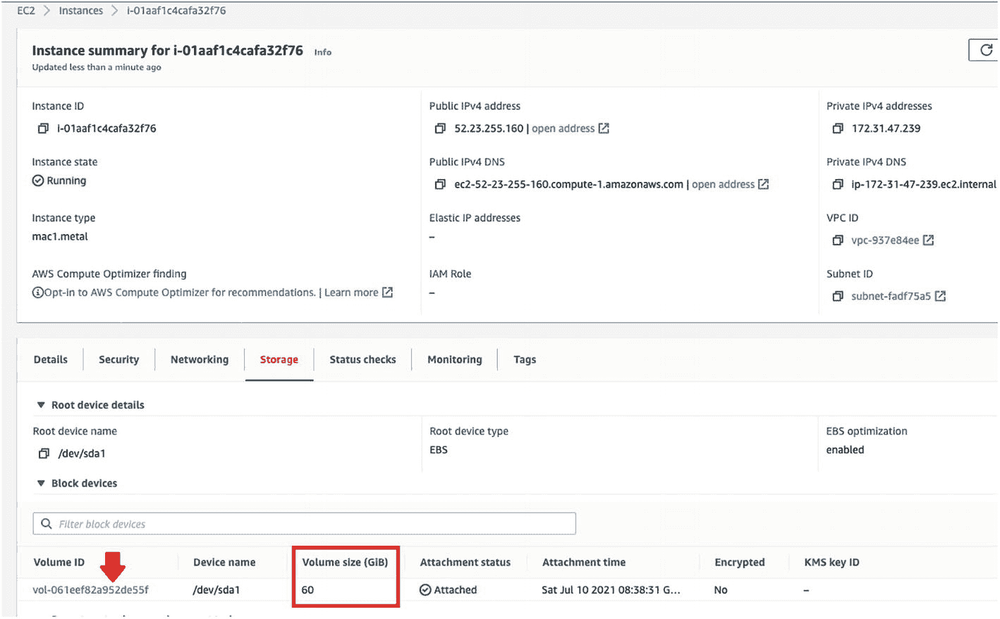

图 5-1

macOS 实例详细信息中显示的卷大小

进入卷修改页面，如图 [5-2](#Fig2) 所示。

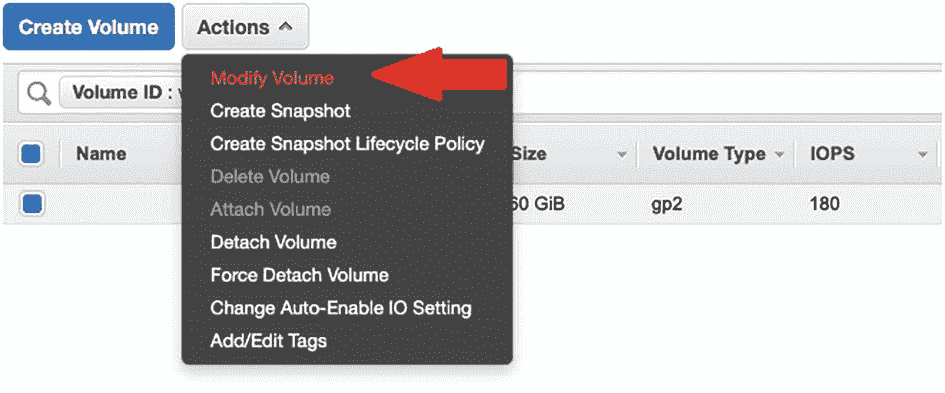

图 5-2

选择修改卷选项

修改实例 EBS 卷大小。图 [5-3](#Fig3) 中所示的示例将卷增加到 200 GB。

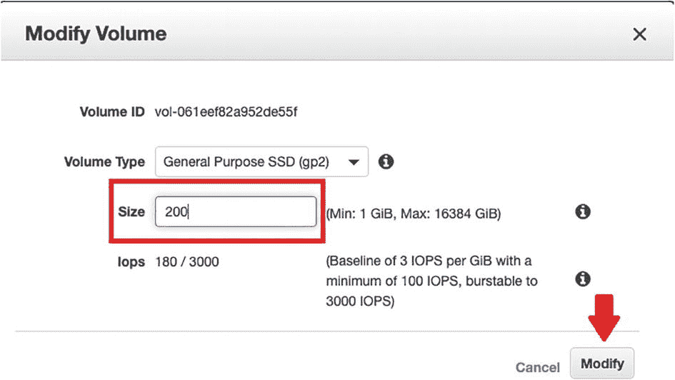

图 5-3

将音量调整到所需的大小

调整正在运行的 macOS 实例的附加 EBS 卷的大小后，在重新启动之前，该卷在实例中不可见。您可以从 EC2 控制台重启 macOS 实例，如图 [5-4](#Fig4) 和 [5-5](#Fig5) 所示。

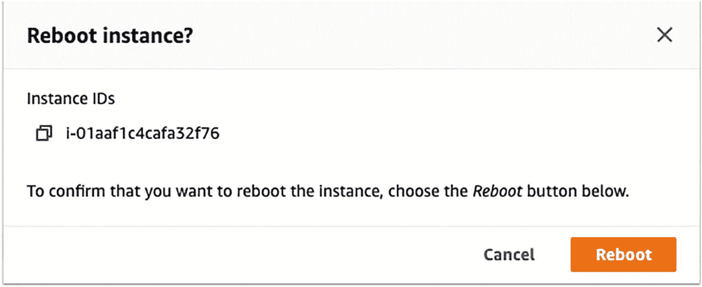

图 5-5

确认实例重新启动

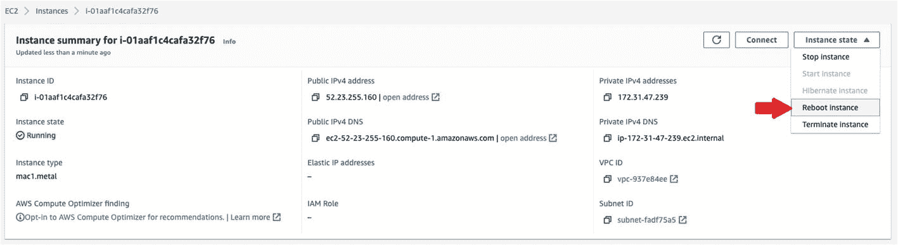

图 5-4

调整宗卷大小后重新启动 macOS 实例

在调整 EBS 卷大小时，macOS 重新启动后，新的磁盘大小应该在 macOS 实例上可见，如清单 [5-1](#PC1) 所示。

```
ec2-user@ip-172-31-47-239 ~ % diskutil list external physical
/dev/disk1 (external, physical):
   #:           TYPE NAME            SIZE       IDENTIFIER
   0:      GUID_partition_scheme   *214.7 GB      disk1
   1:            EFI EFI            209.7 MB      disk1s1
   2:   Apple_APFS Container disk2   64.2 GB      disk1s2

Listing 5-1Listing disk size

```

如清单 [5-1](#PC1) 所示，新的磁盘大小是可见的，但是 APFS 容器的大小仍然较小，因此增加的磁盘空间还没有被使用。增加的磁盘大小可以变得可用，如清单 [5-2](#PC2) 所示。

```
ec2-user@ip-172-31-47-239 ~ % PDISK=$(diskutil list physical external | head -n1 | cut -d" " -f1)

ec2-user@ip-172-31-47-239 ~ % APFSCONT=$(diskutil list physical external | grep "Apple_APFS" | tr -s " " | cut -d" " -f8)

ec2-user@ip-172-31-47-239 ~ % yes | sudo diskutil repairDisk $PDISK
Repairing the partition map might erase disk1s1, proceed? (y/N) Started partition map repair on disk1
Checking prerequisites

Listing 5-2Repairing disk and making increased size usable

```

修复之后，最后一步是调整苹果 APFS 容器的大小，如清单 [5-3](#PC3) 所示。

```
ec2-user@ip-172-31-47-239 ~ % sudo diskutil apfs resizeContainer $APFSCONT 0

Started APFS operation
Aligning grow delta to 150,323,855,360 bytes and targeting a new physical store size of 214,538,608,640 bytes
Determined the maximum size for the targeted physical store of this APFS Container to be 214,537,580,544 bytes

Listing 5-3Resizing APFS container size

```

## 设置 Xcode

Xcode 可以从 App Store 手动安装在 macOS 实例上，正如第 [1](01.html) 章所讨论的。安装 Xcode 后，要开始使用 Xcode，您必须接受 Xcode 和 iOS SDK 许可协议，如图 [5-6](#Fig6) 所示。

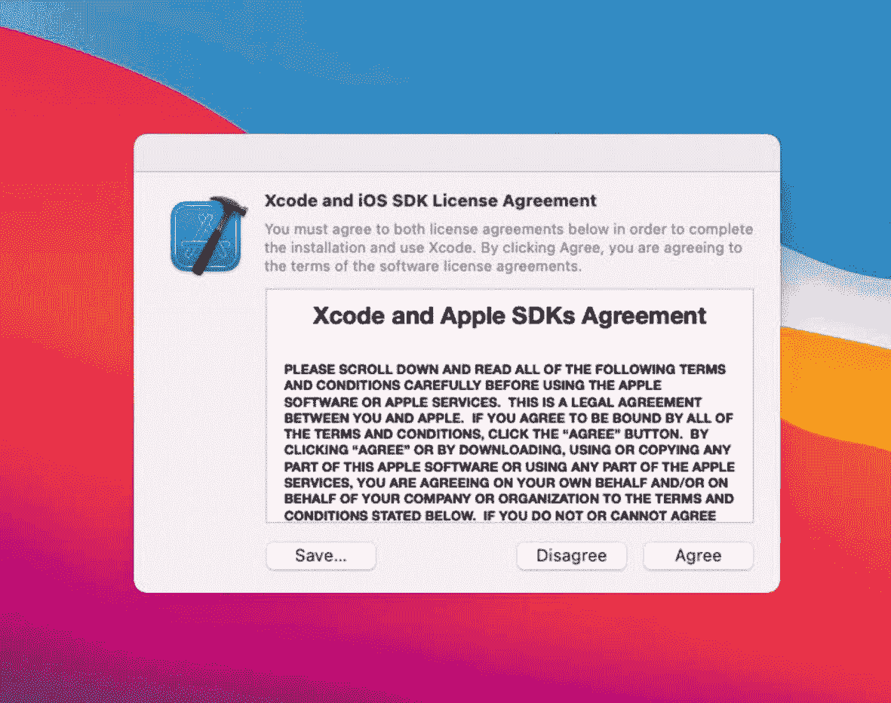

图 5-6

Xcode 和 iOS SDK 许可协议

如果提示输入密码以授予 Xcode 权限，请输入您的用户密码。如果使用默认的 ec2 用户，这是为用户创建的用户密码，如第 [4](04.html) 章所述。

一旦 Xcode 准备好使用，它应该会进入它的欢迎页面，如图 [5-7](#Fig7) 所示。

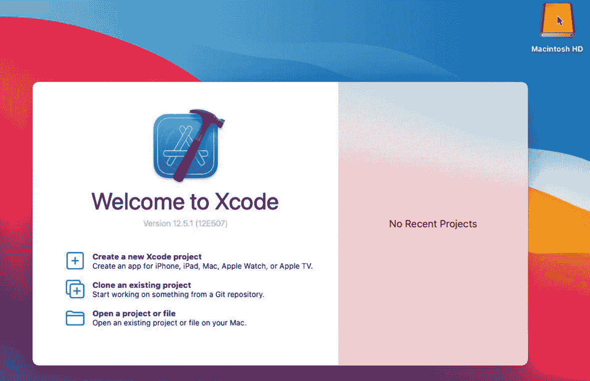

图 5-7

Xcode 欢迎页面

### Xcode 命令行工具

从 App Store 安装 Xcode 时，它的命令行工具也会被安装，无需任何进一步操作。可以从命令终端验证安装，如清单 [5-4](#PC4) 所示。

```
ec2-user@ip-172-31-47-239 ~ % xcode-select --install

xcode-select: error: command line tools are already installed, use "Software Update" to install updates

ec2-user@ip-172-31-47-239 ~ % xcodebuild
Command line invocation:
    /Applications/Xcode.app/Contents/Developer/usr/bin/xcodebuild

User defaults from command line:
    IDEPackageSupportUseBuiltinSCM = YES

xcodebuild: error: The directory /Users/ec2-user does not contain an Xcode project

.

ec2-user@ip-172-31-47-239 ~ % xcodebuild -version
Xcode 12.5.1
Build version 12E507

Listing 5-4Verifying Xcode command line tools installation

```

## 陷害 Jenkins

Jenkins 是一个开源的自动化和应用构建工具。它与各种其他工具相集成，这使得它适用于各种类型的构建和自动化。Jenkins 支持分布式构建；通过使用并行运行作业的代理，可以为每个生成项目使用不同的生成环境。

这些代理由控制器控制，控制器是配置和调度所有构建作业的主要 Jenkins 节点。代理可以是与控制器相同类型的环境，在控制器中调度作业以平衡工作负载，也可以是与主控制器不同的环境，在主控制器中，基于正在构建的应用所需的构建环境在代理上调度作业。

让我们在接下来的两节中探索如何在 Amazon EC2 实例上的 Linux 环境中配置 Jenkins 控制器，以及如何使用 macOS 构建代理来构建 iOS 应用。

### 供应 Jenkins 控制器

控制器将在 Amazon EC2 Linux 实例上提供，因此，首先，必须从 EC2 控制台创建一个 EC2 实例，如图 [5-8](#Fig8) 所示。

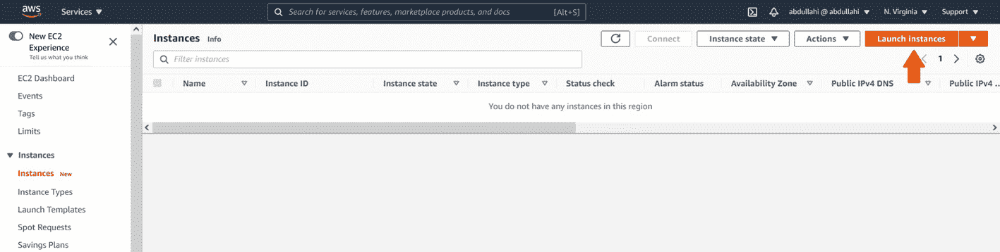

图 5-8

从 EC2 控制台启动 Amazon EC2 实例

选择适用 AWS 地区的最新 Amazon Linux Amazon Machine Image(AMI)，如图 [5-9](#Fig9) 所示。

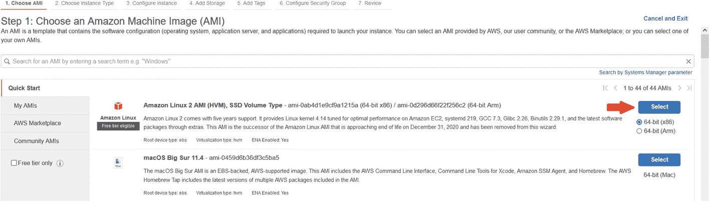

图 5-9

选择最新的亚马逊 Linux AMI

选择实例类型，并根据需要配置实例和存储容量。对于安全组，需要 SSH (TCP 端口 22)访问来启用对 Jenkins 服务器的访问。Jenkins 还在 TCP 端口 8080 上提供流量，因此这必须在安全组中得到允许。安全组配置示例如图 [5-10](#Fig10) 所示。这些规则可以通过工作站的源 IP 地址进一步限制。

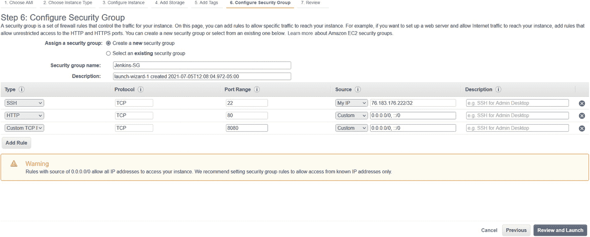

图 5-10

配置安全组规则

在实例启动之后，下一步是通过 SSH 登录实例，安装 Jenkins 软件。

因为提供了 Amazon Linux EC2 实例，所以将使用 yum package manager 来安装 Jenkins。类似地，其他操作系统中的包管理器可以用来在那些操作系统上安装 Jenkins。

首先，执行实例上所有包的快速软件更新，如清单 [5-5](#PC5) 所示。

```
[ec2-user ~]$ sudo yum update

Listing 5-5Updating software packages

```

更新软件包后，可以将 Jenkins repo 添加到 yum 中，如清单 [5-6](#PC6) 所示。

```
[ec2-user ~]$ sudo wget -O /etc/yum.repos.d/jenkins.repo \
    https://pkg.jenkins.io/redhat-stable/jenkins.repo

Listing 5-6Adding Jenkins to yum repo

```

接下来是导入 RPM 的密钥文件来验证包。这显示在清单 [5-7](#PC7) 中。

```
[ec2-user ~]$ sudo rpm --import https://pkg.jenkins.io/redhat-stable/jenkins.io.key

[ec2-user ~]$ sudo yum upgrade

Listing 5-7Import rpm key file to verify package

```

然后可以安装 Jenkins，如清单 [5-8](#PC8) 所示。

```
[ec2-user ~]$ sudo yum install jenkins java-1.8.0-openjdk-devel -y

[ec2-user ~]$ sudo systemctl daemon-reload

Listing 5-8Installing Jenkins

```

安装后，Jenkins 可以作为服务启动，如清单 [5-9](#PC9) 所示。

```
[ec2-user ~]$ sudo systemctl start jenkins

Listing 5-9Starting Jenkins as a service

```

如清单 [5-10](#PC10) 所示，可以检查 Jenkins 状态。

```
[ec2-user ~]$ sudo systemctl status jenkins

Listing 5-10Checking Jenkins status

```

最初设置 Jenkins 时，需要一个初始管理员密码。如清单 [5-11](#PC11) 所示，可以检索该密码。

```
[ec2-user ~]$ sudo cat /var/lib/jenkins/secrets/initialAdminPassword

Listing 5-11Retriving initial Admin Password

```

要通过管理界面首次访问您的 Jenkins 服务器，请从您的网络浏览器连接到`http://<your_server_public_DNS>:8080`。初始设置页面如图 [5-11](#Fig11) 所示。输入取回的初始密码，如清单 [5-11](#PC11) 所示。

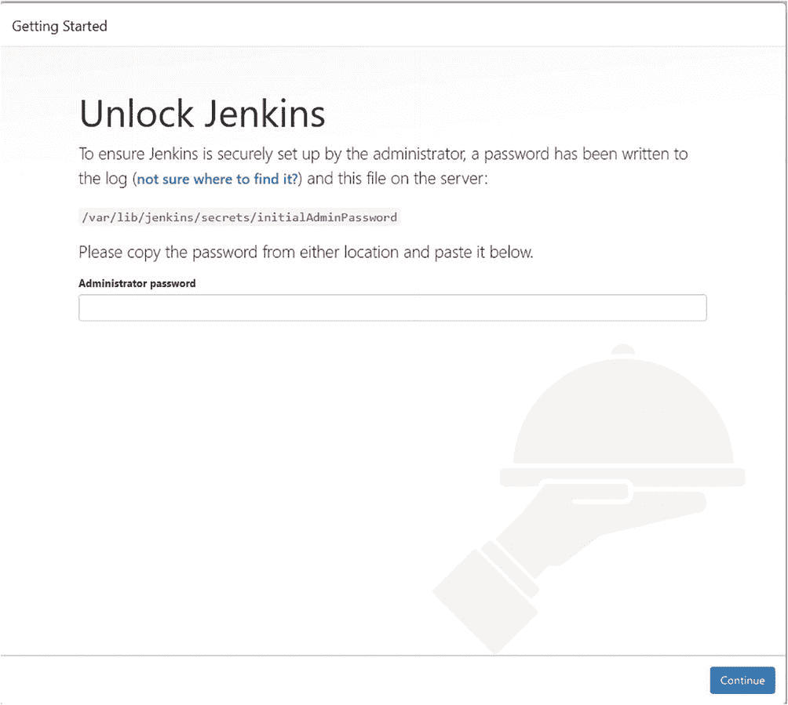

图 5-11

Jenkins 初始设置页面

为了支持不同类型的应用和工具，Jenkins 使用插件来扩展其功能。在 Jenkins 初始设置期间，您可以选择安装特定的插件，或者安装建议的插件，如图 [5-12](#Fig12) 所示。

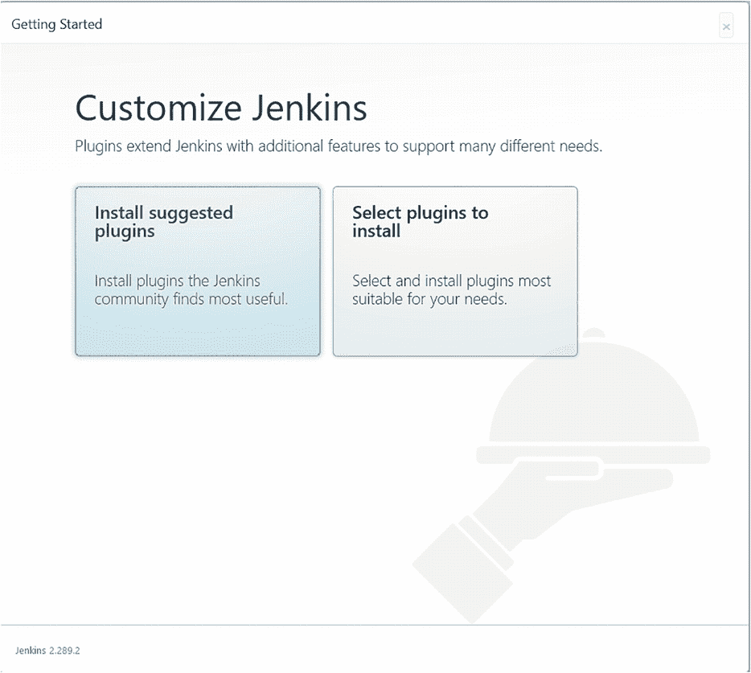

图 5-12

安装 Jenkins 插件

还必须创建一个初始的管理员用户来验证 Jenkins。初始管理员用户的设置如图 [5-13](#Fig13) 所示。

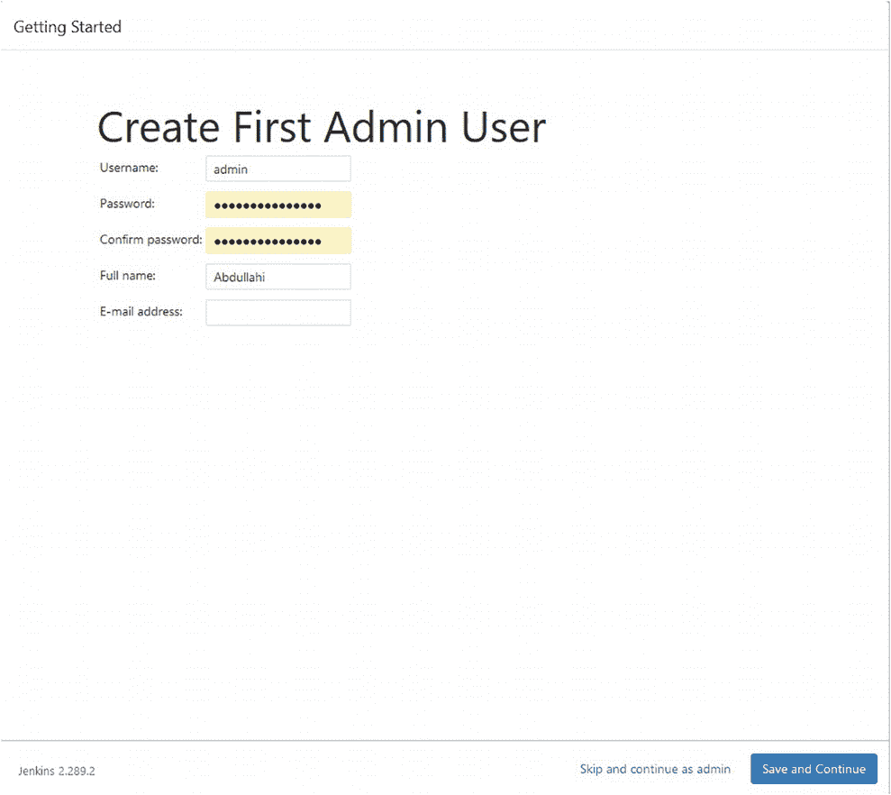

图 5-13

创建初始管理员用户

在安装了所有插件并设置了初始管理员用户之后，Jenkins 就可以开始创建作业和注册构建代理了。全新的 Jenkins 安装欢迎页面如图 [5-14](#Fig14) 所示。


图 5-14

Jenkins 欢迎页面

### EC2 Mac 实例作为 Jenkins 构建代理

创建 Jenkins 控制器后，您可以为分布式生成设置生成代理。要构建 iOS 应用，必须存在 macOS 构建代理。让我们探索如何通过 SSH 将 EC2 Mac 实例作为构建代理添加到 Jenkins 控制器中。

要添加 Jenkins 构建代理，必须安装 Java。清单 [5-12](#PC12) 展示了如何在 EC2 Mac 上安装带有 Homebrew 的 Java 开发工具包。

```
ec2-user@ip-172-31-47-239 ~ % su ec2-user -c '/usr/local/bin/brew install openjdk@8'
Password:
Updating Homebrew...
==> Auto-updated Homebrew!
Updated 1 tap (homebrew/core).
==> Updated Formulae

Updated 20 formulae.

==> Downloading https://ghcr.io/v2/homebrew/core/libpng/manifests/1.6.37
######################################################################## 100.0%
.
.
.
.
.
==> Installing dependencies for openjdk@8: libpng and freetype
==> Installing openjdk@8 dependency: libpng

Listing 5-12Installing OpenJDK on EC2 Mac

```

在用 Homebrew 安装 OpenJDK 之后，为它创建一个符号链接并验证安装，如清单 [5-13](#PC13) 所示。

```
sh-3.2# ln -sfn /usr/local/opt/openjdk@8/libexec/openjdk.jdk /Library/Java/JavaVirtualMachines/openjdk-8.jdk

sh-3.2# java -version

openjdk version "1.8.0_282"
OpenJDK Runtime Environment (build 1.8.0_282-bre_2021_01_20_16_06-b00)
OpenJDK 64-Bit Server VM (build 25.282-b00, mixed mode)

Listing 5-13Create symlink for OpenJDK and verify Installation

```

安装 Java 之后，下一个需求是创建一个 Jenkins 用户并为该用户设置 SSH 访问。Jenkins 控制器将使用该用户通过 SSH 连接到 macOS 构建代理，以提交构建作业。您可以创建一个新的 Jenkins 用户，如清单 [5-14](#PC14) 所示。

```
sh-3.2# sysadminctl -addUser jenkins
2021-07-10 19:50:42.793 sysadminctl[6437:155160] --------------
2021-07-10 19:50:42.793 sysadminctl[6437:155160] No clear text password or interactive option was specified (adduser, change/reset password will not allow user to use FDE) !
2021-07-10 19:50:42.793 sysadminctl[6437:155160] --------------
2021-07-10 19:50:42.970 sysadminctl[6437:155160] Creating user record...
2021-07-10 19:50:43.043 sysadminctl[6437:155160] Assigning UID: 503 GID: 20
2021-07-10 19:50:43.076 sysadminctl[6437:155160] Creating home directory at /Users/jenkins

Listing 5-14Creating Jenkins user

```

创建用户后，您可以设置一个新的密钥，或者在 macOS 实例上重用现有的默认 ec2-user 密钥。清单 [5-15](#PC15) 展示了如何对新的 Jenkins 用户重用默认的 ec2 用户 SSH 凭证。

```
sh-3.2# mkdir /Users/jenkins/.ssh/

sh-3.2# cp -a /Users/ec2-user/.ssh/. /Users/jenkins/.ssh/

sh-3.2# cp /Users/ec2-user/.ssh/* /Users/jenkins/.ssh/.

sh-3.2# chown -R jenkins /Users/jenkins/.ssh

sh-3.2# chmod 700 /Users/jenkins/.ssh

sh-3.2# chmod 600 /Users/jenkins/.ssh/authorized_keys

Listing 5-15Setting up SSH keys for Jenkins user

```

接下来，让我们确保 Jenkins 控制器可以通过 SSH 从安全组访问 EC2 Mac 实例。

如图 [5-15](#Fig15) 所示，为 Jenkins 控制器实例的/32 私有 IP 地址配置 TCP 端口 22 访问。使用私有 IP 地址是因为 Jenkins 控制器和 EC2 Mac 实例位于同一个虚拟私有云(VPC)中。如果它们在不同的 VPC 中，并且 Jenkins 控制器将通过互联网与 Mac 实例连接，您将添加 Jenkins 控制器的公共 IP 地址。

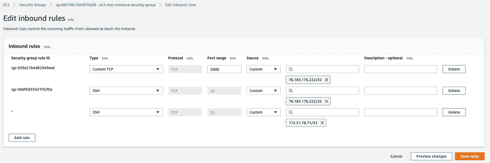

图 5-15

EC2 Mac 实例的安全组配置

安装了 Java、创建了 Jenkins 用户、设置了 SSH 访问并配置了安全组之后，就可以添加 EC2 macOS 实例作为构建节点了。

在 Jenkins 用户界面上，选择“管理 Jenkins”选项，然后选择“管理节点和云”，如图 [5-16](#Fig16) 所示。

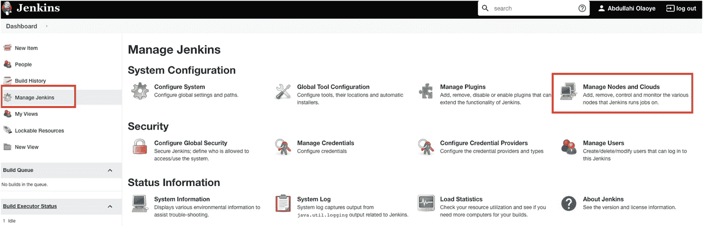

图 5-16

管理 Jenkins 选项

启动添加新节点的流程，并为节点提供名称，如图 [5-17](#Fig17) 所示。

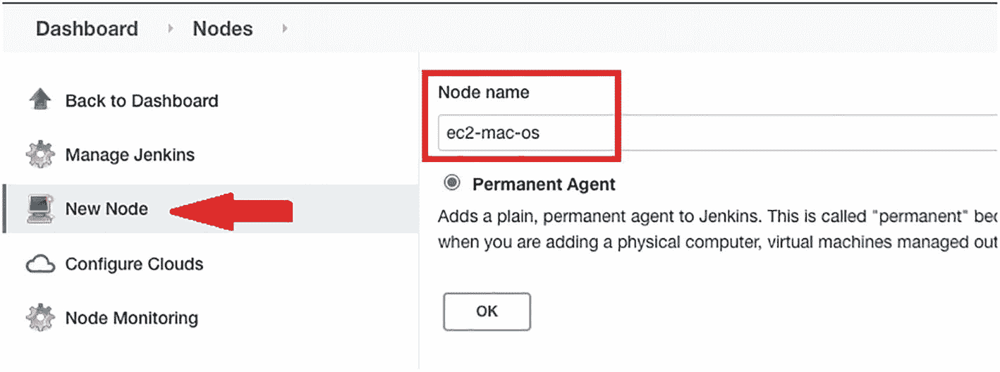

图 5-17

添加新的 Jenkins 节点

将配置节点的连接信息，包括节点的 IP 地址、启动方法、标签、节点的凭证等。该标签是在生成作业中配置的，控制器使用它来标识要在其上调度特定作业的生成代理。图 [5-18](#Fig18) 显示了使用 SSH 启动方法和 iOS 标签的节点配置示例。

SSH 凭证必须单独配置。凭据可以预先创建，也可以在添加节点时创建。图 [5-18](#Fig18) 显示了如何在配置构建节点时添加新凭证。

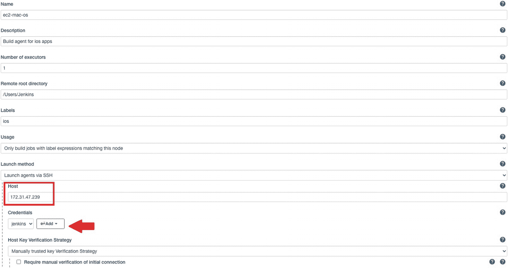

图 5-18

为 Jenkins 节点配置新凭据

要添加 SSH 凭证，您需要提供 Jenkins 用户名和 SSH 私有密钥。要获取私钥内容，请打开为 Jenkins 用户 SSH 访问配置的私钥文件。

*   在本例中，与清单 [5-15](#PC15) 中配置的相同的 SSH 私有密钥用于 ec2-user 和 Jenkins 用户，因此从您的工作站检索该私有密钥的内容。

图 [5-19](#Fig19) 显示了配置 SSH 凭证的示例。

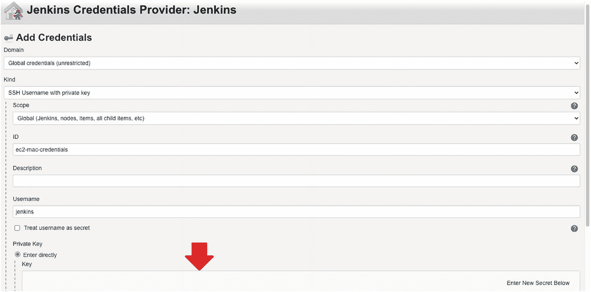

图 5-19

在 Jenkins 中配置 SSH 凭证

可以为节点配置路径变量等环境变量，如图 [5-20](#Fig20) 所示。

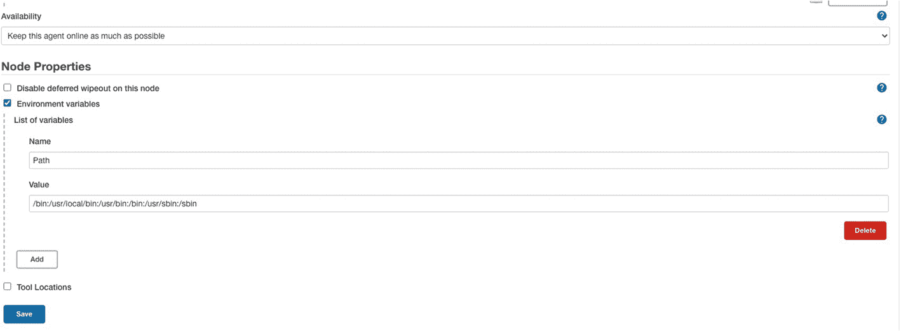

图 5-20

为节点配置环境变量

保存新节点的配置。在图 [5-18](#Fig18) 中，主机密钥验证被配置为手动信任，因此在保存新节点配置后，Jenkins 控制器尝试通过 SSH 连接到构建代理，并且在 Jenkins 节点的左侧选项中显示提示，请求信任 Jenkins 控制器；选择此项以允许继续连接。

您可以在 Jenkins 上查看控制台输出，以查看状态并了解它的运行情况。列表 [5-16](#PC16) 显示了一个成功添加代理的控制台输出示例。

```
[07/11/21 17:31:16] [SSH] Checking java version of java
[07/11/21 17:31:16] [SSH] java -version returned 1.8.0_282.
[07/11/21 17:31:16] [SSH] Starting sftp client.
[07/11/21 17:31:16] [SSH] Copying latest remoting.jar...
[07/11/21 17:31:16] [SSH] Copied 1,502,119 bytes.
Expanded the channel window size to 4MB
[07/11/21 17:31:16] [SSH] Starting agent process: cd "/Users/Jenkins" && java  -jar remoting.jar -workDir /Users/Jenkins -jar-cache /Users/Jenkins/remoting/jarCache
Jul 11, 2021 5:31:17 PM org.jenkinsci.remoting.engine.WorkDirManager initializeWorkDir
INFO: Using /Users/Jenkins/remoting as a remoting work directory
Jul 11, 2021 5:31:17 PM org.jenkinsci.remoting.engine.WorkDirManager setupLogging

INFO: Both error and output logs will be printed to /Users/Jenkins/remoting
<===[JENKINS REMOTING CAPACITY]===>channel started
Remoting version: 4.7
This is a Unix agent
Evacuated stdout
Agent successfully connected and online

Listing 5-16Output snippet of adding Jenkins agent

```

添加一个构建节点后，它会出现在节点列表中，如图 [5-21](#Fig21) 所示。

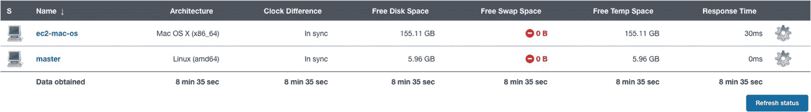

图 5-21

Jenkins 建立节点

## 建立 Fastlane

Fastlane 是一个开源自动化工具，用于自动化移动应用开发。它自动化了构建 iOS 应用的所有方面，从开发到发布到应用商店。其主要特点是

*   在 App Store 中使用的自动化屏幕截图

*   自动化测试版部署

*   应用商店部署

*   代码签名

Fastlane 可以与 Jenkins 集成，为 iOS 应用开发创建完整的端到端持续集成持续交付(CICD)流程。

Fastlane 可以使用自制软件简单地安装在 macOS 工作站上，如清单 [5-17](#PC17) 所示。

```
ec2-user@ip-172-31-47-239 ~ % brew install fastlane
Updating Homebrew...
==> Auto-updated Homebrew!
Updated 2 taps (homebrew/core and homebrew/cask).
==> Updated Formulae
Updated 52 formulae.
==> Updated Casks

Updated 13 casks.
.
.
.
.
.
==> Installing fastlane
==> Pouring fastlane--2.187.0.big_sur.bottle.1.tar.gz

Listing 5-17Fastlane installation output snippet

```

安装后，您可以验证安装并开始使用 Fastlane。清单 [5-18](#Par1111) 中显示了启动 Fastlane 的示例和输出示例。

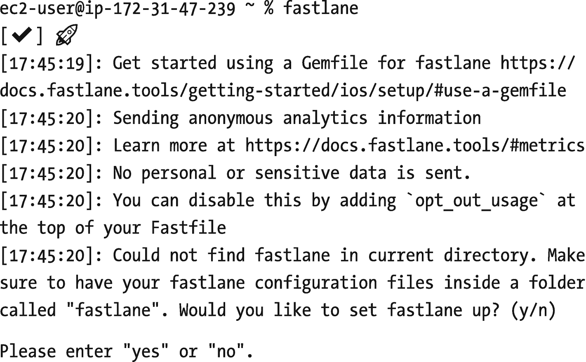

**清单 5-18。**从 Fastlane 出发

## 设置 GitLab

GitLab 是一个 DevOps 平台，它提供了许多特性来提高软件开发过程中的灵活性。其中的一些特性包括用于管理源代码的 git repository manager、持续集成以及用于自动构建和部署应用的部署管道等。

对于其持续集成和部署特性，它使用 GitLab runner。GitLab Runner 是一个与 GitLab CICD 协同工作的应用，用于在管道中运行作业。GitLab Runner 应用可以安装在单独的基础设施和操作系统上，这取决于 Runner 将要执行的工作。

GitLab Runner 也可以安装在 macOS 上运行 iOS 相关的作业，那么我们就来探讨一下如何设置 GitLab，在 macOS EC2 实例上安装一个 GitLab Runner。

### 创建 GitLab 项目

要开始使用 GitLab，您必须注册一个 GitLab 帐户。可以在 [`https://gitlab.com/`](https://gitlab.com/) 上免费报名。然后，创建一个如图 [5-22](#Fig22) 所示的项目。

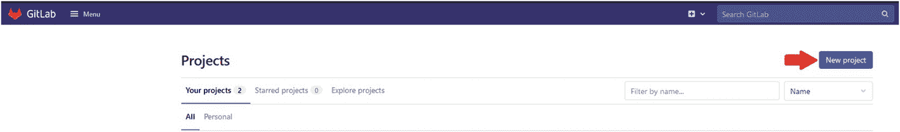

图 5-22

创建 GitLab 项目

接下来，您可以选择如何创建项目，如图 [5-23](#Fig23) 所示，您可以创建一个空白项目或使用一个模板，该模板会用文件预先填充您的项目。

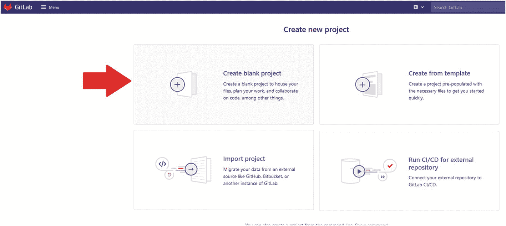

图 5-23

选择项目初始配置

配置项目名称、URL 和可见性级别(私有或公共)。图 [5-24](#Fig24) 显示了一个示例项目配置。

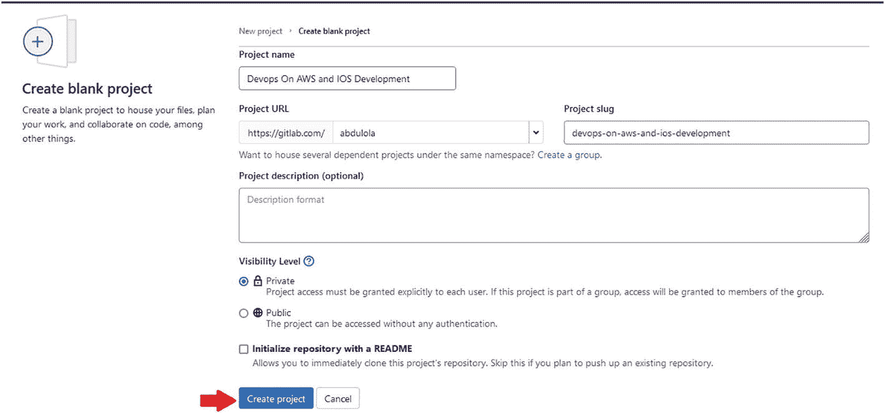

图 5-24

配置和创建 GitLab 项目

### 设置 macOS GitLab Runner

当您创建 GitLab 项目时，会为项目创建一个存储库，您可以访问许多 DevOps 特性，其中包括 CICD。要设置可以构建 iOS 应用的 GitLab CICD 管道，必须设置一个 macOS GitLab 运行程序。

项目的 GitLab Runner 配置可以在项目设置中进入，如图 [5-25](#Fig25) 所示。

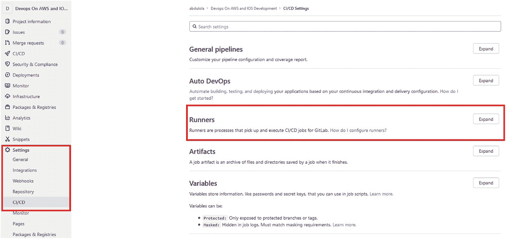

图 5-25

GitLab 项目 CICD 设置

要在 macOS 实例上注册 GitLab runner，需要 GitLab 位置的 URL 和唯一的注册令牌。在项目 CICD 设置中展开**滑道**即可找回两者，如图 [5-26](#Fig26) 所示。

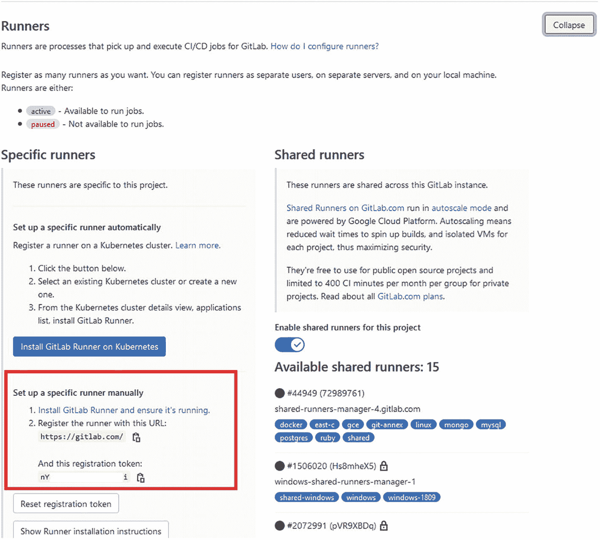

图 5-26

GitLab Runner 注册令牌和 URL

GitLab Runner 以二进制形式提供。您可以下载二进制文件并在 macOS 实例上提供适当的权限，如清单 [5-19](#PC18) 所示。

```
ec2-user@ip-172-31-47-239 ~ % sudo curl --output /usr/local/bin/gitlab-runner "https://gitlab-runner-downloads.s3.amazonaws.com/latest/binaries/gitlab-runner-darwin-amd64"

  % Total    % Received % Xferd  Average Speed   Time    Time     Time  Current
                                 Dload  Upload   Total   Spent    Left  Speed
100 53.0M  100 53.0M    0     0  92.6M      0 --:--:-- --:--:-- --:--:-- 92.4M

ec2-user@ip-172-31-47-239 ~ % sudo chmod +x /usr/local/bin/gitlab-runner

Listing 5-19Download GitLab Runner binary for macOS

```

现在您可以注册跑步者，如清单 [5-20](#PC19) 所示。注册是一个交互式操作，您需要提供注册令牌、GitLab URL、跑步者描述等。

```
ec2-user@ip-172-31-47-239 ~ % gitlab-runner register

Runtime platform                                    arch=amd64 os=darwin pid=4212 revision=c1edb478 version=14.0.1
WARNING: Running in user-mode.
WARNING: Use sudo for system-mode:
WARNING: $ sudo gitlab-runner...

Enter the GitLab instance URL (for example, https://gitlab.com/):
https://gitlab.com/
Enter the registration token:
nxxxxxxxxxxxxxxi
Enter a description for the runner:
[ip-172-31-47-239.ec2.internal]: mac os runner

Enter tags for the runner (comma-separated):

Registering runner... succeeded                     runner=nYR2beCG
Enter an executor: custom, docker, parallels, docker-ssh, shell, ssh, virtualbox, docker+machine, docker-ssh+machine, kubernetes:
shell
Runner registered successfully. Feel free to start it, but if it's running already the config should be automatically reloaded!

Listing 5-20GitLab Runner registration

```

成功的转轮注册不会安装转轮，您必须单独安装转轮。清单 [5-21](#PC20) 展示了如何安装和启动 GitLab Runner。

```
ec2-user@ip-172-31-47-239 ~ % gitlab-runner install

Runtime platform                                    arch=amd64 os=darwin pid=4237 revision=c1edb478 version=14.0.1

ec2-user@ip-172-31-47-239 ~ % gitlab-runner start

Runtime platform                                    arch=amd64 os=darwin pid=4240 revision=c1edb478 version=14.0.1

Listing 5-21Installing and starting GitLab Runner

```

一旦安装了 GitLab Runner，您就可以开始从 GitLab CICD 管道向这个 Runner 调度作业。要验证 runner 是否已注册到您的 GitLab 项目并准备好接收作业，请确保您可以在 GitLab 项目的 runner 列表中看到注册的 macOS runner。图 [5-27](#Fig27) 显示了在 GitLab 上注册为 runner 的 macOS 实例。

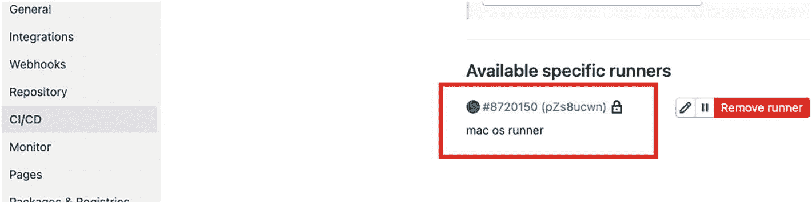

图 5-27

在 GitLab 上查看注册的 macOS runner

*   关于设置 GitLab CICD 管道的更多信息，见 [`https://docs.gitlab.com/ee/ci/pipelines/index.html`](https://docs.gitlab.com/ee/ci/pipelines/index.html) 。

## 摘要

设置 iOS 应用开发环境需要安装不同的软件，如 iOS 专用的 Xcode 和其他第三方及开源工具。我们已经介绍了在 macOS Amazon EC2 实例上安装和设置所有这些工具，以便为开发做好准备。