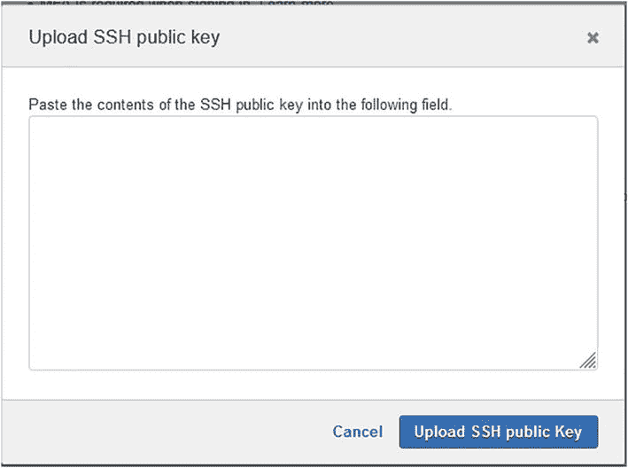
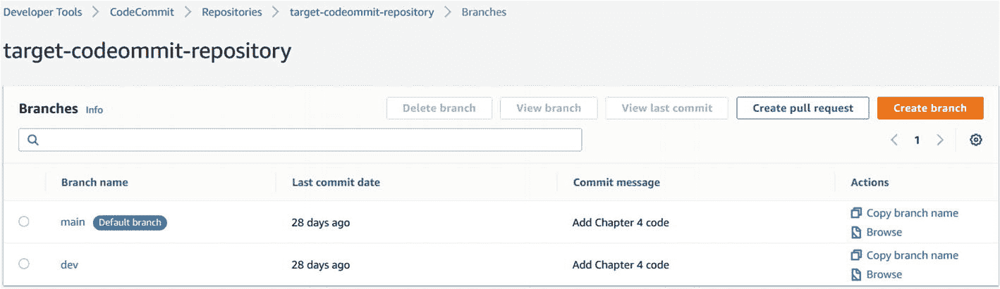

# 6.使用 AWS 代码提交进行源代码管理

正如第 3 章[所讨论的，AWS CodeCommit 是一个托管的私有 Git 库。当交互和使用 CodeCommit 时，您使用标准的 Git 工具，所有标准的 Git 概念和特性都适用。](03.html)

在本章中，我们将深入探讨如何使用 AWS CodeCommit 进行源代码管理，首先是如何连接到 CodeCommit 存储库以添加源代码，以及诸如拉请求、分支等功能是如何实现的。，工作。

在开始使用 AWS CodeCommit 之前，让我们回顾一下基本的 Git 基础知识。

*   本章使用的所有示例代码均可在 [`https://github.com/abdulola/devops-on-aws-ios-development/tree/main/Chapter_6`](https://github.com/abdulola/devops-on-aws-ios-development/tree/main/Chapter_6) 找到。

## Git 基础

Git 是一个开源的版本控制系统。它跟踪您对启用它的目录中的文件所做的更改，这允许您在任何时间点恢复到文件的任何版本。它还使协作变得容易，因为它允许将不同人对文件所做的更改合并到一个文件中。

### Git 安装

所有主要平台的 Git 客户端都可以从 Git 网站下载，如图 [6-1](#Fig1) 所示。


图 6-1

Git 客户端下载

*   下载网站可在 [`https://git-scm.com/downloads`](https://git-scm.com/downloads) 访问。

对于不同的操作系统，可以使用软件包管理器从命令行下载它。清单 [6-1](#PC1) 分别展示了如何为 macOS 和 Debian/Ubuntu 系统安装 Git。

```
macOS
$ brew install git

Debian/Ubuntu

$ apt-get install git

Listing 6-1Git installation with package managers

```

### 初始化 Git 存储库

一旦安装了 Git，要在目录中启用 Git，必须对它进行初始化。在一个目录中初始化 Git 意味着您希望它启动版本控制并开始跟踪该目录中的所有更改。Git 可以在目录中初始化，如清单 [6-2](#PC2) 所示。

```
$ git init
Initialized empty Git repository in /home/cloudshell-user/git-diretory/.git/
$ git status
On branch master

No commits yet

nothing to commit (create/copy files and use "git add" to track)

Listing 6-2Initializing Git repository and checking Git status

```

### 记录对 Git 存储库的更改

如清单 [6-2](#PC2) 所示，在 Git 初始化的目录中没有 Git 要跟踪的文件，因为它是一个空目录。新文件被添加到目录中，如清单 [6-3](#PC3) 所示。

```
$ touch file1 file2 file3
$ git status
On branch master

No commits yet

Untracked files

:
  (use "git add <file>..." to include in what will be committed)
        file1
        file2
        file3

nothing added to commit but untracked files present (use "git add" to track)

Listing 6-3Adding new files and checking Git status

```

文件被添加到目录中，但不是为了 Git 开始跟踪而添加的。为了让 Git 开始跟踪这些新文件，首先应该如清单 [6-4](#PC4) 所示进行修改。

```
$ git add .
$ git status
On branch master

No commits yet

Changes to be committed:
  (use "git rm --cached <file>..." to unstage)
        new file:   file1
        new file:   file2
        new file:   file3

Listing 6-4Staging changes and checking Git status

```

在变更被暂存之后，Git 开始跟踪这些文件的最后一步是提交变更。如果这是你第一次使用 Git，你必须如清单 [6-5](#PC5) 所示配置你的名字和邮箱。向 Git 提交文件时，必须提供注释来描述正在提交的更改；这提供了`-m`标志，如清单 [6-5](#PC5) 所示。

```
$ git config --global user.name "Enter Your Name"
$ git config --global user.email "Enter Your Email"

$ git commit -m "Add files"
[master (root-commit) 6ebb411] Add files
 3 files changed, 0 insertions(+), 0 deletions(-)
 create mode 100644 file1
 create mode 100644 file2
 create mode 100644 file3
$ git status
On branch master
nothing to commit, working tree clean

Listing 6-5Committing changes and checking Git status

```

### 克隆和使用远程 Git 存储库

有时，您已经有一个现有的项目存储在一个远程 Git 存储库中，如 GitHub、GitLab、AWS CodeCommit 等。，你想在本地工作。为此，您可以通过克隆来本地下载存储库。在本地克隆了存储库之后，您可以对文件进行更改，并通过前面描述的 Git 生命周期来开始跟踪您的更改。

清单 [6-6](#PC6) 显示了一个克隆存储库的例子。在这里，我克隆了公共 AWS CLI GitHub 存储库。要克隆您拥有的私有存储库，系统会提示您进行身份验证。

```
$ git clone https://github.com/aws/aws-cli.git
Cloning into 'aws-cli'...
remote: Enumerating objects: 84578, done.
remote: Counting objects: 100% (790/790), done.
remote: Compressing objects: 100% (246/246), done.
remote: Total 84578 (delta 556), reused 763 (delta 543), pack-reused 83788
Receiving objects: 100% (84578/84578), 53.34 MiB | 20.19 MiB/s, done.
Resolving deltas: 100% (57974/57974), done.

Listing 6-6Cloning remote Git repository

```

在本地克隆远程存储库后，本地存储库会自动配置为指向远程存储库，以便将来进行同步操作。例如，如果远程存储库中有更新，本地存储库可以提取这些更改以与本地存储库合并，或者如果本地存储库中有更改，则需要推送这些更改以更新远程存储库。

清单 [6-7](#PC7) 展示了如何查看为本地存储库配置的远程存储库，如何通过拉和推操作来保持本地和远程存储库同步，以及如何为本地存储库配置不同名称的其他远程存储库。Git 为远程存储库使用的默认简称是 origin，并且配置了一个新的远程存储库 origin2，如清单 [6-7](#PC7) 所示。

```
$ cd aws-cli/
$ git remote -v
origin  https://github.com/aws/aws-cli.git (fetch)
origin  https://github.com/aws/aws-cli.git (push)

$ git pull origin

Already up to date.

$ git push origin master

$ git remote add origin2 https://github.com/aws/aws-cli.git
$ git remote -v
origin2 https://github.com/aws/aws-cli.git (fetch)
origin2 https://github.com/aws/aws-cli.git (push)
origin  https://github.com/aws/aws-cli.git (fetch)
origin  https://github.com/aws/aws-cli.git (push)

Listing 6-7Listing remote repositories and configuring a new remote repository

```

### Git 分支

在 Git 中，分支是指向提交的指针。它用于分离正在进行的文件工作，并维护 Git 存储库的独立并发版本。如果一个文件存在于多个分支上，则在一个分支上对此文件所做的更改不会影响另一个分支中的同一文件。分支通常用于开发新特性，存储来自特定提交的项目的特定版本，等等。

在新的 Git 存储库中，当您创建第一个提交时，会为您创建一个默认分支。可以创建附加分支来跟踪项目的不同版本。

### 拉取请求

拉请求允许您和存储库中的其他用户从一个分支到另一个分支查看、添加注释和合并代码更改。Pull requests 是多个存储库用户协作的一种方式，在应用程序的新版本发布之前，通过检查代码更改和修复 bug 来实现。

一个典型的例子是，当您有一个主 Git 分支，其中包含您的应用程序的生产部署版本，而新功能是在单独的功能分支中开发的。当功能分支中的功能准备好进行生产部署时，拉请求允许团队成员在将功能分支合并到主分支之前检查新功能的代码更改或添加。

## 创建 AWS 代码提交存储库

在第 [3](03.html) 章中，介绍了 AWS CodeCommit，我介绍了如何在 AWS 管理控制台上创建 CodeCommit 存储库。在本章中，我们将更深入地了解创建 CodeCommit 存储库的各种方法，如 AWS 命令行界面(CLI)、CloudFormation、Terraform 和 AWS SDK。

### 使用 AWS 命令行界面(CLI)创建

必须首先安装和配置 AWS CLI。要开始使用 AWS CLI，必须使用有权执行预期操作的凭据进行配置。清单 [6-8](#PC8) 展示了如何配置 AWS CLI 和一个示例输出。

*   可以参考 [`https://docs.aws.amazon.com/cli/latest/userguide/cli-chap-welcome.html`](https://docs.aws.amazon.com/cli/latest/userguide/cli-chap-welcome.html) 的 AWS 文档进行安装。

```
$ aws configure
AWS Access Key ID [None]:
AWS Secret Access Key [None]:
Default region name [None]:
Default output format [None]:

Listing 6-8Configuring AWS CLI

```

配置 AWS CLI 环境后，可以创建一个带有示例输出的 CodeCommit 存储库，如清单 [6-9](#PC9) 所示。

```
$ aws codecommit create-repository --repository-name devops-ios-repository --repository-description "Example Description"
{
    "repositoryMetadata": {
        "accountId": "123456789101",
        "repositoryId": "abcdedgh-6234-457b-b2c3-184babcdefgh",
        "repositoryName": "devops-ios-repository",
        "repositoryDescription": "Example Description",
        "lastModifiedDate": "2021-08-14T21:20:03.893000+00:00",
        "creationDate": "2021-08-14T21:20:03.893000+00:00",
        "cloneUrlHttp": "https://git-codecommit.us-east-1.amazonaws.com/v1/repos/devops-ios-repository",
        "cloneUrlSsh": "ssh://git-codecommit.us-east-1.amazonaws.com/v1/repos/devops-ios-repository",
        "Arn": "arn:aws:codecommit:us-east-1:123456789101:devops-ios-repository"
    }
}

Listing 6-9Creating a CodeCommit repository with AWS CLI

```

### 使用 AWS CloudFormation 创建

要使用 CloudFormation 创建 CodeCommit 存储库，可以如清单 [6-10](#PC10) 所示定义 CloudFormation 模板。

```
AWSTemplateFormatVersion: "2010-09-09"
Parameters:
  RepositoryName:
    Type: String
    Default: devops-ios-repository
    Description: Name of the CodeCommit Repository

Resources:
  MyRepo:
    Type: AWS::CodeCommit::Repository
    Properties:
      RepositoryName: !Ref RepositoryName
      RepositoryDescription: Example Description

Listing 6-10CloudFormation template to create CodeCommit repository

```

如清单所示，CloudFormation 模板是 YAML 格式的，只包含一个 CodeCommit 资源。可以用这些 YAML 内容创建云形成堆栈，如图 [6-2](#Fig2) 所示。


图 6-2

使用 CloudFormation 创建 CodeCommit 知识库

存储库名称是参数化的，如清单 [6-10](#PC10) 所示；默认名称在模板中定义，但可以修改。该参数可以在堆栈详情页面进行修改，如图 [6-3](#Fig3) 所示。


图 6-3

配置代码提交存储库的名称

图 [6-4](#Fig4) 显示了处于 CREATE_COMPLETE 状态的 CloudFormation 堆栈，这表示 CodeCommit 存储库已经创建。resources 选项卡显示了由 CloudFormation 堆栈创建的资源列表。


图 6-4

CodeCommit 云信息堆栈已创建

在 CodeCommit 控制台中可以看到创建的 CodeCommit 存储库，如图 [6-5](#Fig5) 所示。


图 6-5

代码提交存储库已创建

### 使用 Terraform 创建

必须首先参考 Terraform 官方文档安装和配置 Terraform。用于 CodeCommit 存储库创建的 Terraform 代码可以如清单 [6-11](#PC11) 所示进行定义。

```
provider "aws" {
    region = "us-east-1"
}

resource "aws_codecommit_repository" "test" {
  repository_name = "devops-ios-repository"
  description     = "Example Description"
}

Listing 6-11Terraform code to create CodeCommit repository

```

代码应该保存在一个带有。tf 文件扩展名，并保存在专用的 Terraform 目录中，以用于预期的操作。在专用目录中，可以初始化 Terraform，如清单 [6-12](#PC12) 所示。这里显示的操作下载了 Terraform 脚本中定义的资源所需的所有插件。

```
$ terraform init

Initializing the backend...

Initializing provider plugins...
- Finding latest version of hashicorp/aws...
- Installing hashicorp/aws v3.54.0...
- Installed hashicorp/aws v3.54.0 (signed by HashiCorp)

Terraform has created a lock file .terraform.lock.hcl to record the provider selections it made above. Include this file in your version control repository so that Terraform can guarantee to make the same selections by default when you run "terraform init" in the 

future.

Terraform has been successfully initialized!
...........................
...........................

Listing 6-12Initializing Terraform directory

```

您可以选择性地运行清单 [6-13](#PC13) 中所示的`terraform plan`来查看 Terraform 将在您的 AWS 帐户中执行的操作，即创建、删除或修改资源。

```
$ terraform plan

Terraform used the selected providers to generate the following execution plan. Resource actions are indicated with the following symbols:
  + create

Terraform will perform the following actions:

  # aws_codecommit_repository.test will be created
  + resource "aws_codecommit_repository" "test" {
      + arn             = (known after apply)
      + clone_url_http  = (known after apply)
      + clone_url_ssh   = (known after apply)
      + description     = "Example Description"
      + id              = (known after apply)
      + repository_id   = (known after apply)
      + repository_name = "devops-ios-repository"
      + tags_all        = (known after apply)
    }

Plan: 1 to add, 0 to change, 0 to destroy.

Listing 6-13Terraform plan to see the actions Terraform will perform

```

初始化 Terraform 目录后，一旦您对清单 [6-13](#PC13) 中所示的 Terraform 将采取的行动感到满意，就可以通过应用清单 [6-14](#PC14) 中所示的 Terraform 脚本来创建资源。

```
$ terraform apply

Terraform used the selected providers to generate the following execution plan. Resource actions are indicated with the following symbols:
  + create

Terraform will perform the following actions:

  # aws_codecommit_repository.test will be created
  + resource "aws_codecommit_repository" "test" {
      + arn             = (known after apply)
      + clone_url_http  = (known after apply)
      + clone_url_ssh   = (known after apply)
      + description     = "Example Description"
      + id              = (known after apply)
      + repository_id   = (known after apply)
      + repository_name = "devops-ios-repository"
      + tags_all        = (known after apply)
    }

Plan: 1 to add, 0 to change, 0 to destroy.

Do you want to perform these actions?
  Terraform will perform the actions described above.
  Only 'yes' will be accepted to approve.

  Enter a value: yes

aws_codecommit_repository.test: Creating...
aws_codecommit_repository.test: Creation complete after 0s [id=devops-ios-repository]

Apply complete! Resources: 1 added, 0 changed, 0 destroyed.

Listing 6-14Applying Terraform script to create CodeCommit repository

```

### 使用 Python Boto3 SDK 创建

AWS 拥有针对不同编程语言的 SDK，使您能够使用自己喜欢的开发语言来管理和访问 AWS 服务。这里我将重点介绍名为 boto3 的 AWS Python SDK。要了解 boto3 SDK 的更多信息，请访问这里的官方文档: [`https://boto3.amazonaws.com/v1/documentation/api/latest/index.html`](https://boto3.amazonaws.com/v1/documentation/api/latest/index.html) 。

在安装 boto3 之前，您的工作站上需要 Python。假设安装了 Python，清单 [6-15](#PC15) 展示了如何使用`pip`在工作站上安装 boto3。

*   参考 [`https://pip.pypa.io/en/stable/installation/`](https://pip.pypa.io/en/stable/installation/) 安装 pip。

```
$  pip install boto3

Listing 6-15Installing boto3

```

清单 [6-16](#PC16) 中显示了一个使用 boto3 创建 CodeCommit 存储库的示例 Python 脚本。

```
import boto3

client = boto3.client('codecommit')

response = client.create_repository(
    repositoryName='devops-ios-repository',
    repositoryDescription='Example Description'
)

print(response

Listing 6-16Python script to create CodeCommit repository

```

在 boto3 可以创建资源之前，工作站必须配置有 AWS 凭证。可以用 AWS CLI 配置凭证，如清单 [6-8](#PC8) 所示。

一旦工作站配置了 AWS 凭证，就可以执行 Python 脚本，如清单 [6-17](#PC17) 所示。

*   有关下载 Python 的信息，请参考 [`www.python.org/downloads`](https://www.python.org/downloads) 。

```
$ python codecommit.py

{
    u'repositoryMetadata': {
        u'repositoryName': u'devops-ios-repository',
        u'cloneUrlSsh': u'ssh://git-codecommit.us-east-1.amazonaws.com/v1/repos/devops-ios-repository',
        u'lastModifiedDate': datetime.datetime(2021, 8, 14, 21, 53, 50, 718000, tzinfo=tzlocal()),
        u'repositoryDescription': u'Example Description',
        u'cloneUrlHttp': u'https://git-codecommit.us-east-1.amazonaws.com/v1/repos/devops-ios-repository',
        u'creationDate': datetime.datetime(2021, 8, 14, 21, 53, 50, 718000, tzinfo=tzlocal()),
        u'repositoryId': u'3cd590f1-b898-43d7-b82c-eac6aef602a1',
        u'Arn': u'arn:aws:codecommit:us-east-1:123456789101:devops-ios-repository',
        u'accountId': u'123456789101'
    }, 

    'ResponseMetadata': {
        'RetryAttempts': 0,
        'HTTPStatusCode': 200,
        'RequestId': 'ff463517-219e-4d51-869f-fba5b1345c76',
        'HTTPHeaders': {
            'x-amzn-requestid': 'abcdefgh-219e-4d51-869f-fba5abcdefgh',
            'date': 'Sat, 14 Aug 2021 21:53:50 GMT',
            'content-length': '519',
            'content-type': 'application/x-amz-json-1.1'
        }
    }
}

Listing 6-17Running Python script to create CodeCommit repository

```

## 在 AWS 代码提交中添加源代码

正如我们所知，CodeCommit 是一个私有的 Git 存储库，但由于它是一个 AWS 服务，AWS 的核心基础仍然适用，例如在连接到存储库时使用身份访问管理(IAM)进行授权和认证。

让我们探索连接到 CodeCommit 存储库和存储源代码的不同选项。

### 连接到代码提交存储库

有各种选项可用于连接到 CodeCommit 存储库。适合您的选项将取决于您使用 AWS 服务的身份验证方式。例如，它是否是 IAM 用户、IAM 角色、联合访问等。？

对于连接到 CodeCommit 存储库的每种方法，使用的 URL 是不同的；对于特定的存储库，可以检索每个连接方法的 URL，如图 [6-6](#Fig6) 所示。


图 6-6

CodeCommit 连接 URL

#### 安全超文本传输协议

HTTPS 方法用于 IAM 用户，它涉及为该 IAM 用户生成 Git 用户名和密码。生成的用户名和密码在执行 Git 操作时用作 Git 凭证。

要为 IAM 用户生成 Git 用户名和密码，请转到 IAM 用户的安全凭证设置，如图 [6-7](#Fig7) 所示。


图 6-7

IAM 用户的安全凭据设置

在 IAM 用户的安全凭证页面中，可以看到为 AWS CodeCommit 生成 HTTPS Git 凭证的选项，如图 [6-8](#Fig8) 所示。


图 6-8

正在生成 HTTPS Git 凭据

生成凭证后，您可以下载. csv 文件形式的凭证或复制用户名和密码，如图 [6-9](#Fig9) 所示。


图 6-9

正在下载生成的 HTTPS 凭据

通过克隆一个新创建的存储库，生成的凭证可以用来连接到一个带有 HTTPS URL 的 CodeCommit 存储库，如清单 [6-18](#PC18) 所示。

```
$ git clone https://git-codecommit.us-east-1.amazonaws.com/v1/repos/devops-ios-repository
Cloning into 'devops-ios-repository'...
Username for 'https://git-codecommit.us-east-1.amazonaws.com': abdullahi-at-168181944806

Password for 'https://abdullahi-at-168181944806@git-codecommit.us-east-1.amazonaws.com':
warning: You appear to have cloned an empty repository.
$ cd devops-ios-repository/
$ git status

On branch master

No commits yet

nothing to commit (create/copy files and use "git add" to track)

Listing 6-18Connect to CodeCommit repository with HTTPS

```

#### 嘘

与 HTTPS 方法类似，连接到 AWS CodeCommit 存储库的 SSH 方法也用于 IAM 用户；这种连接方法需要一对私钥和公钥。公钥与 IAM 用户相关联，而私钥在 Git 工作站中本地配置。使用 SSH 连接方法的第一步是使用`ssh-keygen`生成一个 SSH 密钥对，如清单 [6-19](#PC19) 所示。

```
$ ssh-keygen
Generating public/private rsa key pair.
Enter file in which to save the key (/home/cloudshell-user/.ssh/id_rsa): /home/cloudshell-user/.ssh/codecommit_key
Created directory '/home/cloudshell-user/.ssh'.
Enter passphrase (empty for no passphrase):
Enter same passphrase again:
Your identification has been saved in /home/cloudshell-user/.ssh/codecommit_key.
Your public key has been saved in /home/cloudshell-user/.ssh/codecommit_key.pub.
The key fingerprint is:
SHA256:AJ1EUBde/TT0K/D6SqaryVdSEalDPVN8K/Lp55yWPrU cloudshell-user@ip-10-1-34-183.ec2.internal
The key's randomart image is:
+---[RSA 2048]----+
|    o*+.o.oo=o.  |
|     .oo o *..oo |
|      . o ..+o..o|
|       . o oo....|
|        S o ooo. |
|         . ..o. .|
|          o+.   +|
|      . ..+ ...E.|
|       +oo....==.|

+----[SHA256]-----+

Listing 6-19Generating SSH key pair

```

清单 [6-19](#PC19) 中生成的密钥对被命名为 codecommit_key，因此生成的公钥将被命名为 codecommit_key.pub，而私钥是 codecommit_key，两者都存储在目录 **/home/cloudshell-user/中。宋承宪**。

接下来，为预期的 IAM 用户将公钥上传到 AWS。要上传 IAM 用户的 SSH 公钥，请访问安全凭证设置，如图 [6-7](#Fig7) 所示。在安全凭证中，开始上传的选项如图 [6-10](#Fig10) 所示。


图 6-10

开始 SSH 公钥上传

将提供 SSH 公钥的内容，如图 [6-11](#Fig11) 所示。在本例中，这是 codecommit_key.pub 的内容。您可以检索清单 [6-20](#PC20) 中所示的内容。



图 6-11

添加 SSH 公钥内容

```
$ cat ~/.ssh/codecommit_key.pub

Listing 6-20Retriving SSH public key content

```

公钥上传成功后，生成 SSH 密钥 ID，如图 [6-12](#Fig12) 所示。检索 SSH 密钥 ID，因为它将用于本地 Git 配置。


图 6-12

上传的公钥的 SSH 密钥 ID

本地 Git 配置存储在。ssh 文件夹，如清单 [6-21](#PC21) 所示。配置文件中的**主机**字段是跨所有区域的 CodeCommit URL 模式，**用户**字段是应该用于连接的 SSH 用户，(这是从 AWS IAM 检索的 SSH 密钥 ID，如图 [6-12](#Fig12) 所示)，而**标识文件**字段指向存储 SSH 私钥的位置。

```
$ vim ~/.ssh/config

Host git-codecommit.*.amazonaws.com
User APKASOKDM2HTO6CTLRZS
IdentityFile ~/.ssh/codecommit_key

Listing 6-21Local SSH configuration

```

读写权限也应该添加到配置文件权限中，如清单 [6-22](#PC22) 所示。

```
$ chmod 600 .ssh/config

Listing 6-22Setting config file permission

```

现在配置了 SSH，您可以通过克隆一个新创建的存储库，用它的 SSH URL 连接到 CodeCommit 存储库，如清单 [6-23](#PC23) 所示。

```
$ git clone ssh://git-codecommit.us-east-1.amazonaws.com/v1/repos/devops-ios-repository
Cloning into 'devops-ios-repository'...
The authenticity of host 'git-codecommit.us-east-1.amazonaws.com (52.94.229.29)' can't be established.
RSA key fingerprint is SHA256:eLMY1j0DKA4uvDZcl/KgtIayZANwX6t8+8isPtotBoY.
RSA key fingerprint is MD5:a6:9c:7d:bc:35:f5:d4:5f:8b:ba:6f:c8:bc:d4:83:84.
Are you sure you want to continue connecting (yes/no)? yes
Warning: Permanently added 'git-codecommit.us-east-1.amazonaws.com,52.94.229.29' (RSA) to the list of known hosts.
warning: You appear to have cloned an empty repository.
$ cd devops-ios-repository/
$ git status
On branch master

No commits yet

nothing to commit (create/copy files and use "git add" to track)

Listing 6-23Connecting to CodeCommit repository with SSH

```

#### Git 远程代码提交(GRC)

当您使用具有 IAM 角色的临时凭据来连接 AWS 时，会使用此选项。临时凭证的常见用例是身份联合、跨帐户访问和 AWS 服务(如 EC2)的角色。

GRC 是一个必须安装在工作站上的工具(git-remote-codecommit)，在这种方法中，GRC 获取执行 git 操作的用户的当前 AWS 凭据，并使用它们对 codecommit 进行身份验证；因此，不需要 IAM 永久用户。

GRC 需要安装 Python，可以用 pip 安装，如清单 [6-24](#PC24) 所示。

```
$ pip install git-remote-codecommit

Listing 6-24Installing Git remote CodeCommit

```

为了演示 git-remote-codecommit 如何工作，我将假设一个 IAM 角色，并使用为 IAM 角色生成的临时凭证来连接到存储库。

*   有关创建和配置 IAM 角色的更多信息，请在此处查看 AWS 官方文档: [`https://docs.aws.amazon.com/IAM/latest/UserGuide/id_roles_create.html`](https://docs.aws.amazon.com/IAM/latest/UserGuide/id_roles_create.html) 。

将要承担的 IAM 角色的配置如图 [6-13](#Fig13) 所示。


图 6-13

具有 AWS 代码提交权限的 IAM 角色

为了获得临时凭证，我将使用 AWS CLI 承担 IAM 角色，如清单 [6-25](#PC25) 所示。其中如图 [6-13](#Fig13) 所示的**角色 ARN** 被传递给`--role-arn`标志，并且在`--role-session-name`标志中为会话名称提供一个描述性名称。

```
$ aws sts assume-role --role-arn "arn:aws:iam::123456789101:role/CodeCommitRole" --role-session-name AWSCLI-Session

Listing 6-25Assuming IAM role

```

此 AWS CLI 操作返回临时凭据作为输出，并返回凭据的过期信息。检索 **AccessKeyId** 、 **SecretAccessKey** 、 **SessionToken** ，配置将要执行 Git 操作的工作站，如清单 [6-26](#PC26) 所示。

```
$ export AWS_ACCESS_KEY_ID=<RoleAccessKeyID>
$ export AWS_SECRET_ACCESS_KEY=<RoleSecretAccessKey>
$ export AWS_SESSION_TOKEN=<RoleSessionToken>

Listing 6-26Configure workstation with temporary credentials

```

您的工作站现在应该正在使用临时凭证。您可以验证临时凭证是否配置正确并且是活动的，如清单 [6-27](#PC27) 所示。

```
$ aws sts get-caller-identity
{
    "UserId": "AROASOKDM2HTNVOJHAAV7:AWSCLI-Session",
    "Account": "123456789101",
    "Arn": "arn:aws:sts::123456789101:assumed-role/CodeCommitRole/AWSCLI-Session"
}

Listing 6-27Verifying temporary credentials

```

在验证临时凭证是活动的之后，我可以通过克隆一个新创建的存储库，使用 GRC URL 连接到存储库，如清单 [6-28](#PC28) 所示。

```
$ git clone codecommit::us-east-1://devops-ios-repository
Cloning into 'devops-ios-repository'...
warning: You appear to have cloned an empty repository.
$ cd devops-ios-repository/
$ git status
On branch master

No commits yet

nothing to commit (create/copy files and use "git add" to track)

Listing 6-28Connecting to CodeCommit repository with Git remote CodeCommit

```

### 将代码推送到代码提交存储库

现在，我们已经探索了通过在本地克隆一个空的 CodeCommit 存储库来连接到 CodeCommit 存储库的不同方法，让我们向本地存储库添加一些源代码，并将更改推送到 CodeCommit。

*   这里使用的源代码是样例 app 代码，可以从 [`https://github.com/abdulola/devops-on-aws-ios-development-app`](https://github.com/abdulola/devops-on-aws-ios-development-app) 下载。

在将源代码添加到本地目录但还没有提交到 Git 之后，可以检查存储库的状态，如清单 [6-29](#PC29) 所示，在这里您会看到新文件被列为未跟踪。

```
$ git status
On branch master

No commits yet

Untracked files:
  (use "git add <file>..." to include in what will be committed)
        SampleApp.xcodeproj/
        SampleApp/
        SampleAppTests/
        SampleAppUITests/

nothing added to commit but untracked files present (use "git add" to track)

Listing 6-29Checking the status of new files added to local repository

```

然后，新添加的文件被暂存并提交给 Git，如清单 [6-30](#PC30) 所示。

```
$ git add .
$ git commit -m "Add Sample Application Code"
[master (root-commit) 4c25bde] Add Sample Application Code
 34 files changed, 981 insertions(+)
 create mode 100644 SampleApp.xcodeproj/project.pbxproj
 create mode 100644 SampleApp.xcodeproj/project.xcworkspace/contents.xcworkspacedata
 create mode 100644 SampleApp.xcodeproj/project.xcworkspace/xcshareddata/IDEWorkspaceChecks.plist
 create mode 100644 SampleApp.xcodeproj/project.xcworkspace/xcuserdata/olaoyea.xcuserdatad/UserInterfaceState.xcuserstate
 create mode 100644 SampleApp.xcodeproj/xcuserdata/olaoyea.xcuserdatad/xcschemes/xcschememanagement.plist
 create mode 100644 SampleApp/Assets.xcassets/AccentColor.colorset/Contents.json
 create mode 100644 SampleApp/Assets.xcassets/AppIcon.appiconset/1024.png
 create mode 100644
...................................................
...................................................
...................................................

Listing 6-30Committing source code to Git

```

然后，通过简单地运行 Git push 将更改推送到 CodeCommit，如清单 [6-31](#PC31) 所示。

*   CodeCommit SSH URL 用于此操作。

```
$ git push
Warning: Permanently added the RSA host key for IP address '52.94.233.146' to the list of known hosts.
Enumerating objects: 45, done.
Counting objects: 100% (45/45), done.
Delta compression using up to 2 threads
Compressing objects: 100% (40/40), done.
Writing objects: 100% (45/45), 75.21 KiB | 6.84 MiB/s, done.
Total 45 (delta 1), reused 0 (delta 0)
To ssh://git-codecommit.us-east-1.amazonaws.com/v1/repos/devops-ios-repository

 * [new branch]      master -> master

Listing 6-31Pushing changes to CodeCommit

```

### 将 Git 存储库迁移到 AWS 代码提交

现有的远程 Git 存储库也可以迁移到 CodeCommit。要迁移到 CodeCommit，将在本地克隆存储库，然后将其推送到目标 CodeCommit 存储库。

例如，我想将一个名为**devo PS-on-AWS-IOs-development**的私有 GitHub 存储库迁移到一个名为**target-CodeCommit-repository**的 CodeCommit 存储库。首先，我将源 GitHub 存储库克隆到一个临时的本地目录，我将其命名为 **migrate-to-codecommit** ，如清单 [6-32](#PC32) 所示。传递的`--mirror`标志用于克隆用于迁移的远程存储库的裸副本。

```
$ git clone --mirror https://github.com/abdulola/devops-on-aws-ios-development.git migrate-to-codecommit
Cloning into bare repository 'migrate-to-codecommit'...
Username for 'https://github.com': abdulola
Password for 'https://abdulola@github.com':
remote: Enumerating objects: 97, done.
remote: Counting objects: 100% (97/97), done.
remote: Compressing objects: 100% (79/79), done.
remote: Total 97 (delta 11), reused 86 (delta 7), pack-reused 0
Unpacking objects: 100% (97/97), done.

Listing 6-32Cloning source GitHub repository to local directory

```

接下来，我将进入本地目录，然后将内容推送到目标 CodeCommit 存储库，如清单 [6-33](#PC33) 所示。`--all`标志确保存储库的所有分支都被推送到目标 CodeCommit 存储库。

```
$ cd migrate-to-codecommit/
$ git push --all ssh://git-codecommit.us-east-1.amazonaws.com/v1/repos/target-codeommit-repository
Enumerating objects: 97, done.
Counting objects: 100% (97/97), done.
Delta compression using up to 2 threads
Compressing objects: 100% (86/86), done.
Writing objects: 100% (97/97), 291.28 KiB | 10.40 MiB/s, done.
Total 97 (delta 11), reused 0 (delta 0)
To ssh://git-codecommit.us-east-1.amazonaws.com/v1/repos/target-codeommit-repository
 * [new branch]      main -> main

Listing 6-33Pushing contents to the destination CodeCommit repository

```

此时，GitHub 库已经迁移到 AWS CodeCommit，临时本地目录 **migrate-to-codecommit** 可以删除了。新迁移的仓库如图 [6-14](#Fig14) 所示。


图 6-14

CodeCommit 中迁移的存储库

要开始与 CodeCommit 存储库交互，您必须将存储库克隆到本地。清单 [6-34](#PC34) 显示了临时迁移目录的删除和本地迁移存储库的克隆。

*   CodeCommit SSH URL 用于此操作。

```
$ rm -rf migrate-to-codecommit/
$ git clone ssh://git-codecommit.us-east-1.amazonaws.com/v1/repos/target-codeommit-repository
Cloning into 'target-codeommit-repository'...
Warning: Permanently added the RSA host key for IP address '52.94.226.180' to the list of known hosts.
remote: Counting objects: 97, done.
Receiving objects: 100% (97/97), 291.28 KiB | 15.33 MiB/s, done.
Resolving deltas: 100% (11/11), done

.

Listing 6-34Cloning migrated repository to local

```

## AWS 代码提交中分支

在 CodeCommit 中创建分支有不同的方法，当您第一次提交到 CodeCommit 存储库时，会创建一个名为 **main 的默认分支。**接下来，我将向您展示如何使用 AWS 控制台、Git 和 AWS CLI 创建额外的分支。

### 在 AWS 控制台上创建分支

从 CodeCommit 存储库控制台中，选择**分支**菜单，如图 [6-15](#Fig15) 所示。


图 6-15

从代码提交存储库控制台访问分支菜单

*   上一节中迁移到 CodeCommit 的存储库用于本练习。

在下一页开始创建分支，如图 [6-16](#Fig16) 所示。如前所述，存储库的默认**主**分支已经存在。


图 6-16

开始分支创建

创建分支时，必须选择要从中创建新分支的分支。如图 [6-17](#Fig17) 所示，一个名为 **dev** 的分支正在从唯一存在的分支 **main** 中创建。


图 6-17

创建新的开发分支

创建的新开发分支可以在图 [6-18](#Fig18) 中看到。两个分支的最后一个提交消息是相同的，这是因为 dev 分支是新创建的，没有添加额外的提交。



图 6-18

创建了新的开发分支

### 用 Git 创建分支

CodeCommit 中的新分支也可以从 Git 命令行使用 Git 创建。当从 Git 命令行创建分支时，最初只在本地创建，必须将分支推送到 CodeCommit，以便在 CodeCommit 上创建。

清单 [6-35](#PC35) 显示了在本地创建一个新的分支，以及在 CodeCommit 上创建这个分支的推送操作。

*   上一节中迁移到 CodeCommit 的存储库用于本练习。本地存储库已经从清单 [6-34](#PC34) 中的 Git 克隆操作链接到 CodeCommit 存储库。

```
$ cd target-codeommit-repository/
$ git checkout -b test
Switched to a new branch 'test'
$ git push origin test
Total 0 (delta 0), reused 0 (delta 0)
To ssh://git-codecommit.us-east-1.amazonaws.com/v1/repos/target-codeommit-repository
 * [new branch]      test -> test

Listing 6-35Create CodeCommit branch using Git

```

在 CodeCommit 控制台上可以看到新创建的分支**测试**，如图 [6-19](#Fig19) 所示。


图 6-19

从 Git 创建的新测试分支

### 使用 AWS CLI 创建分支

要使用 AWS CLI 创建分支，除了将存储库名称和分支名称作为参数传递之外，还必须指定要从中创建分支的 Git commit ID。要检索 Git 提交 ID，您可以访问您的 CodeCommit 存储库的所有提交，如图 [6-20](#Fig20) 所示。


图 6-20

访问代码提交资料档案库的所有提交

您可以复制提交 ID 来创建新的分支，如图 [6-21](#Fig21) 所示。


图 6-21

复制提交 ID

知道了用于分支创建的提交 ID 后，就可以使用 AWS CLI 创建新的分支，如清单 [6-36](#PC36) 所示。

```
$ aws codecommit create-branch --repository-name target-codeommit-repository --branch-name preprod --commit-id 7da70dd7ef5eb237012ac0699367922d9cb3524e

Listing 6-36Creating branch using AWS CLI

```

如图 [6-22](#Fig22) 所示，可以在代码提交控制台上看到新创建的**预编程**分支。


图 6-22

使用 AWS CLI 创建新的预编程分支

### 更新本地存储库

随着所有新分支的创建，一些分支存在于 CodeCommit 中，但不在本地，您可以获取远程存储库的更新并查看所有分支，如清单 [6-37](#PC37) 所示。

```
$ git remote update origin
Fetching origin
From ssh://git-codecommit.us-east-1.amazonaws.com/v1/repos/target-codeommit-repository
 * [new branch]      preprod    -> origin/preprod

$ git branch --all
  dev
* test
  remotes/origin/HEAD -> origin/dev
  remotes/origin/dev

  remotes/origin/main
  remotes/origin/preprod
  remotes/origin/test

Listing 6-37Fetch update from remote repository

```

### 配置默认分支

当您第一次提交到 CodeCommit 存储库时，会为您创建一个名为 **main** 的默认基础分支。如果需要，可以将这个默认分支更改为存储库中的其他分支。要更改默认分支，请转到如图 [6-23](#Fig23) 所示的存储库设置。


图 6-23

存储库设置

在**默认分支**菜单中，可以从库分支列表中选择新的默认分支，如图 [6-24](#Fig24) 所示。


图 6-24

选择默认分支

## AWS 代码提交中的拉请求

AWS 代码提交存储库支持在合并分支之前创建拉请求。还有一些额外的特定于 CodeCommit 的 pull request 特性，比如批准规则和 Amazon CodeGuru Reviewer 集成。接下来让我们探索所有这些概念。

### 创建拉取请求

当两个分支合并时，例如，一个功能分支与一个主分支合并，可以在 AWS 控制台或 CLI 上创建一个拉请求。

在您可以创建一个拉请求来合并两个分支之前，这两个分支之间必须有一个增量。一个增量被引入到本地存储库中的一个**测试**分支，并被推送到远程代码提交存储库中，如清单 [6-38](#PC38) 所示。

```
$ echo "Add New Text" >> README.md
$ git status
On branch test
Changes not staged for commit:
  (use "git add <file>..." to update what will be committed)
  (use "git restore <file>..." to discard changes in working directory)
        modified:   README.md

no changes added to commit (use "git add" and/or "git commit -a")
$ git add README.md
$ git commit -m "Add new text to Readme"
[test 7ea6176] Add new text to Readme

 1 file changed, 1 insertion(+)

$ git push --set-upstream origin test
Enumerating objects: 5, done.
Counting objects: 100% (5/5), done.
Delta compression using up to 2 threads
Compressing objects: 100% (2/2), done.
Writing objects: 100% (3/3), 311 bytes | 311.00 KiB/s, done.
Total 3 (delta 1), reused 0 (delta 0)
To ssh://git-codecommit.us-east-1.amazonaws.com/v1/repos/target-codeommit-repository

   7da70dd..7ea6176  test -> test
Branch 'test' set up to track remote branch 'test' from 'origin'.

Listing 6-38Adding changes to repository test branch and pushing to CodeCommit

```

既然代码更改已经被推送到 CodeCommit 存储库的测试分支，就可以创建一个 pull 请求了。

#### AWS 控制台

要创建一个拉请求，您可以访问存储库的拉请求页面，如图 [6-25](#Fig25) 所示。


图 6-25

访问拉取请求控制台

在存储库的 Pull requests 页面上，您可以开始创建 Pull requests，如图 [6-26](#Fig26) 所示。


图 6-26

开始创建拉式请求

如图 [6-27](#Fig27) 所示选择源和目的分支。对于这个例子，包含代码变更的源分支是**测试**，目标分支是**主**。


图 6-27

选择源和目标分支

为拉取请求提供标题和可选描述，如图 [6-28](#Fig28) 所示。通常，该描述将包含代码更改的细节，以便为将要审查它的团队成员提供上下文。


图 6-28

为拉取请求提供标题和描述

在最终创建拉请求之前，您可以检查由源分支引入的变更，如图 [6-29](#Fig29) 所示。


图 6-29

查看由“拉”请求引入的更改

最后，一旦成功创建了拉请求，新的拉请求将如图 [6-30](#Fig30) 所示。


图 6-30

已创建拉式请求

#### AWS CLI

为了在 AWS CLI 上创建一个拉请求，我们使用清单 [6-39](#PC39) 中的命令。拉请求标题被传递给`--title`选项，描述被传递给`--description`选项，您生成的惟一幂等令牌应该被传递给`--client-request-token`选项，存储库和分支信息被传递给`--targets`选项。

```
$ aws codecommit create-pull-request --title "Merge Test to Main Branch" --description "Example description" --client-request-token Example --targets repositoryName=target-codeommit-repository,sourceReference=Test,destinationReference=main

Listing 6-39Creating pull request with the AWS CLI

```

### 合并拉取请求

一旦“拉”请求被其他人审阅并准备好合并，这个操作也可以在 AWS 控制台或 CLI 上执行。

#### AWS 控制台

只要两个分支是可合并的，即没有合并冲突或批准规则会阻止合并，合并选项总是被激活，如图 [6-31](#Fig31) 所示。


图 6-31

开始提取请求合并

要合并，必须选择一个合并策略；CodeCommit 支持三种不同的合并策略，如图 [6-32](#Fig32) 所示。合并的默认 Git 行为是尽可能快进。如果由于合并方案而无法应用特定的合并类型，此选项将灰显且无法选择。成功合并后，您可以选择删除源分支，选择此选项后，本例中使用的**测试**分支将从存储库中删除。


图 6-32

选择合并类型和合并提取请求

一旦拉请求被成功合并，你会得到一个确认，如图 [6-33](#Fig33) 所示。


图 6-33

已合并拉取请求

要查看所应用的合并更改，您可以切换到存储库中的目标分支，并检查由 pull 请求所做的文件更改。如图 [6-34](#Fig34) 所示，拉取请求更新的仓库的 README.md 已经被更改。


图 6-34

来自拉取请求的更新文件

现在远程**主**分支已经更新，为了保持本地**主**分支也是最新的，必须执行一个`git pull`操作，如清单 [6-40](#PC40) 所示。

```
$ git pull
From ssh://git-codecommit.us-east-1.amazonaws.com/v1/repos/target-codeommit-repository
   7da70dd..7ea6176  main       -> origin/main
Your configuration specifies to merge with the ref 'refs/heads/test'
from the remote, but no such ref was fetched.

$ git checkout main
Branch 'main' set up to track remote branch 'main' from 'origin'.
Switched to a new branch 'main'

Listing 6-40Updating local main branch with changes from remote

```

#### AWS CLI

要在 AWS CLI 上合并拉请求，要执行的命令取决于要应用的合并策略。清单 [6-41](#PC41) 展示了如何使用快进合并策略进行合并。拉请求 ID 被传递给`--pull-request-id`选项，来自源分支的最新完整提交 ID 被传递给`--source-commit-id`选项，最后，存储库名称被传递给`--repository-name`选项。

*   要查看如何将 CLI 与其他合并策略一起使用，请参见 [`https://docs.aws.amazon.com/cli/latest/reference/codecommit/`](https://docs.aws.amazon.com/cli/latest/reference/codecommit/) 。

```
$ aws codecommit merge-pull-request-by-fast-forward --pull-request-id 1 --source-commit-id EXAMPLE1112222333 --repository-name target-codeommit-repository

Listing 6-41Merging using fast forward strategy

```

### 创建审批规则模板

批准规则模板允许您自动将批准规则应用于在存储库中创建的提取请求。在每个 AWS 区域中，您可以将批准规则模板应用于在所有 CodeCommit 存储库中创建的部分或全部拉请求。

使用批准规则模板，您可以在为给定分支(例如，您的主分支)创建提取请求时自动应用批准规则，并在合并提取请求之前要求某些团队成员的批准。

让我们看看如何在 AWS 控制台和 CLI 上创建批准模板。

#### AWS 控制台

您可以在 AWS 控制台上访问审批规则模板页面，如图 [6-35](#Fig35) 所示。


图 6-35

访问审批规则模板页面

您可以开始创建审批规则模板，如图 [6-36](#Fig36) 所示。


图 6-36

开始创建审批规则模板

我正在创建的审批规则模板定义如图 [6-37](#Fig37) 所示。批准的最小数量定义为 1，还提供了有效批准人的列表。这里我提供一个 I am 用户的 ARN；还指定了要应用规则的目标分支。最后，指定要应用该模板的存储库列表。


图 6-37

审批规则模板定义

#### AWS CLI

要在 AWS CLI 上创建批准规则模板，必须首先在 JSON 中定义该模板，如清单 [6-42](#PC42) 所示。定义的示例模板应用于存储库的主分支，需要两次批准，批准者列表中提供了 IAM 用户 ARN。

```
{
  "Version": "2018-11-08",
  "DestinationReferences": [
    "refs/heads/main"
  ],
  "Statements": [
    {
      "Type": "Approvers",
      "NumberOfApprovalsNeeded": 2,
      "ApprovalPoolMembers": [
        "arn:aws:iam::123456789101:user/abdullahi"
      ]
    }
  ]
}

Listing 6-42Approval rule template definition

```

该模板可以提供给 AWS CLI 命令，如清单 [6-43](#PC43) 所示。审批模板名称在`--approval-rule-template-name`选项中提供，描述在`--approval-rule-template-description`选项中提供，模板 JSON 定义在`--approval-rule-template-content`选项中提供。

```
$ aws codecommit create-approval-rule-template --approval-rule-template-name Engineering-Manager-Approval --approval-rule-template-description "Requires Engineering Manager Approval" --approval-rule-template-content "{\"Version\":\"2018-11-08\",\"DestinationReferences\":[\"refs\/heads\/main\"],\"Statements\":[{\"Type\":\"Approvers\",\"NumberOfApprovalsNeeded\":2,\"ApprovalPoolMembers\":[\"arn:aws:iam::123456789101:user\/abdullahi\"]}]}"

{
    "approvalRuleTemplate": {
        "approvalRuleTemplateId": "d812838a-4010-4c68-80ce-e03b8ba456c7",
        "approvalRuleTemplateName": "Engineering-Manager-Approval",
        "approvalRuleTemplateDescription": "Requires Engineering Manager Approval",
        "approvalRuleTemplateContent": "{\"Version\":\"2018-11-08\",\"DestinationReferences\":[\"refs/heads/main\"],\"Statements\":[{\"Type\":\"Approvers\",\"NumberOfApprovalsNeeded\":2,\"ApprovalPoolMembers\":[\"arn:aws:iam::123456789101:user/abdullahi\"]}]}",
        "ruleContentSha256": "609e9411c4a0a04d8f49438ac4faa377393355ba831646637f5895a4283aa732",
        "lastModifiedDate": "2021-08-18T00:23:22.780000+00:00",
        "creationDate": "2021-08-18T00:23:22.780000+00:00",
        "lastModifiedUser": "arn:aws:iam::123456789101:user/abdullahi"
    }
}

Listing 6-43Creating an approval rule template from the AWS CLI

```

### 带有审批规则模板的拉式请求

如果您创建了拉式请求，并且已将批准规则模板应用于存储库，并且批准规则模板中定义的分支与拉式请求的目标分支相匹配，则无需任何进一步的操作，即可为拉式请求创建批准规则。审批规则的条件在审批规则模板中定义。

图 [6-38](#Fig38) 显示了一个 pull 请求，它被创建来将 dev 分支合并到我们的示例 CodeCommit 存储库的主分支。审批规则被应用于该拉式请求，因为如图 [6-37](#Fig37) 所示创建的审批规则模板应用于该存储库和**主**分支。因为我使用在批准规则模板的批准者列表中指定的 I am 用户登录 AWS 控制台，所以我看到可用的**批准**选项。


图 6-38

应用审批规则的提取请求

一旦拉动请求被批准，批准规则要求就被满足，合并按钮出现，如图 [6-39](#Fig39) 所示。


图 6-39

审批后合并拉式请求

### Amazon CodeGuru Reviewer 集成

Amazon CodeGuru reviewer 是一个 AWS 服务，它使用机器学习来检测代码中的缺陷，CodeGuru reviewer 可以与 CodeCommmit 存储库相关联。当在与 CodeGuru 评审者相关联的存储库中创建一个拉请求时，它会自动开始评审该拉请求，并将发现和建议作为注释添加到拉请求中。

目前 CodeGuru reviewer 只支持审查 Java 和 Python 代码。

#### 协会代码专家评审员

要将 CodeGuru reviewer 与 CodeCommit 存储库相关联，请访问存储库设置中的 **Amazon CodeGuru Reviewer** 选项卡，如图 [6-40](#Fig40) 所示。


图 6-40

CodeCommit 存储库设置中的 CodeGuru Reviewer 选项卡

将 CodeGuru Reviewer 关联到您的 CodeCommit 存储库，如图 [6-41](#Fig41) 所示。


图 6-41

协会代码专家评审员

关联不会立即完成，而关联状态是**关联**。如图 [6-42](#Fig42) 所示，关联需要 10 分钟。


图 6-42

CodeGuru 审阅者关联正在进行中

关联完成后，状态变为**关联**。解除存储库关联的选项也会出现，如图 [6-43](#Fig43) 所示。


图 6-43

CodeGuru 审查者关联

*   参考 [`https://docs.aws.amazon.com/codeguru/latest/reviewer-ug/create-codecommit-association.html#create-codecommit-association-cli`](https://docs.aws.amazon.com/codeguru/latest/reviewer-ug/create-codecommit-association.html%2523create-codecommit-association-cli) 了解如何通过 AWS CLI 将 Amazon CodeGuru Reviewer 关联到存储库。

#### 查看拉取请求

让我们通过用 Python 代码创建一个 pull 请求来看看 CodeGuru Reviewer 是如何工作的。为了触发 CodeGuru reviewer 的评论，我将使用一个有缺陷的 Python 代码。要使用的 Python 代码如清单 [6-44](#PC44) 所示；这是一个简单的代码，列出了 S3 桶中的所有对象。

```
import boto3

s3_client = boto3.client('s3')
s3_client.list_objects(Bucket="BucketName")

Listing 6-44Example Python code to trigger CodeGuru reviewer

```

我将这个代码片段添加到我的存储库的 **dev** 分支中的一个. py 文件中，并创建一个 pull 请求来合并到**主**分支中。CodeGuru reviewer 自动开始审查 pull 请求，如图 [6-44](#Fig44) 所示。


图 6-44

CodeGuru 审核者审核拉取请求

完成审查后，如果在拉请求中发现任何缺陷，它会留下一个注释。如图 [6-45](#Fig45) 所示，我在代码中使用了一个过时的 API，CodeGuru reviewer 建议使用修改后的 API。


图 6-45

查看 CodeGuru 评论

## 摘要

iOS 应用程序开发流程的自动化和编排始于源代码控制管理。在这一章中，我们介绍了 Git 版本控制系统的基础知识，然后深入探讨了 AWS CodeCommit 的 Git 特性，以及如何使用它作为一个私有的远程 Git 存储库，并附有演练示例。然后，我们介绍了它与 Amazon CodeGuru Reviewer 的集成，通过机器学习自动审查 Python 和 Java 代码。