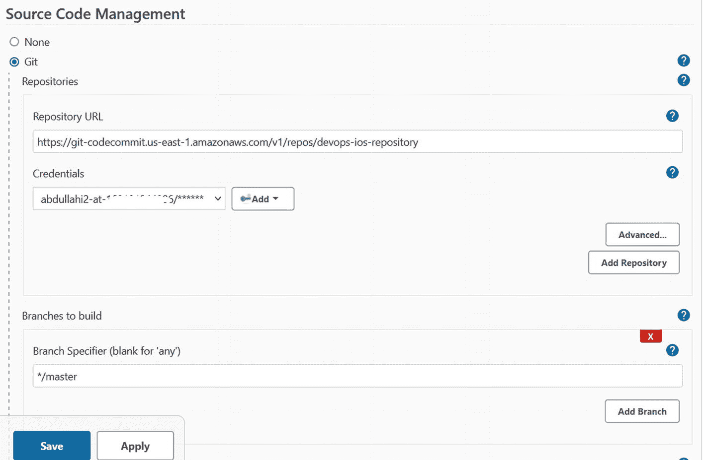

# 七、将 AWS CodeCommit 与 Jenkins 集成

当应用源代码存储在 AWS CodeCommit 中以进行源代码控制时，它可以与其他构建和测试系统集成以进行持续集成，以便当在源存储库中进行新的提交时，触发自动构建和/或测试。

在本章中，我们将看到 AWS CodeCommit 如何使用 Jenkins 插件与 Jenkins 集成。通过这种集成，可以使用 AWS CodeCommit for source control 在 Jenkins 上设置 iOS 应用构建作业，其中当代码提交到 AWS CodeCommit 时，在 Jenkins 上触发构建。

*   本章使用的所有示例代码均可在 [`https://github.com/abdulola/devops-on-aws-ios-development/tree/main/Chapter_7`](https://github.com/abdulola/devops-on-aws-ios-development/tree/main/Chapter_7) 找到。

## Jenkins 代码提交插件

插件用于增强 Jenkins 的功能，以适应特定的用例，它允许各种工具和云提供商与 Jenkins 集成。为了集成 AWS CodeCommit 和 Jenkins，使用了一个 AWS CodeCommit 插件。

当通过亚马逊简单通知服务(SNS)进行提交时，Jenkins AWS CodeCommit 插件通过向亚马逊简单队列服务(SQS)队列发送消息来工作。Jenkins 作业定期轮询队列中的任何新消息，如果发现新消息，则触发作业的新构建。

要在 Jenkins 控制器上安装该插件，图 [7-1](#Fig1) 显示了如何从 Jenkins 环境主页访问**管理 Jenkins** 页面。


图 7-1

访问管理 Jenkins 控制台

在设置控制台上，有各种配置 Jenkins 环境的选项，如图[7-2](#Fig2)；您可以访问“管理插件”页面来管理插件。


图 7-2

管理 Jenkins 插件

所有安装在 Jenkins 环境中的插件都可以在这个页面上管理，从不同的可用选项卡可以看到。 **Updates** 选项卡显示任何已安装的插件，该更新了， **Available** 选项卡显示可以安装在 Jenkins 环境中的所有可用插件， **Installed** 选项卡显示安装在该 Jenkins 环境中的所有 Jenkins 插件， **Advanced** 选项卡提供执行操作的选项，如通过手动上传档案来安装插件。使用高级选项的一个用例是当您想要安装一个通过 web UI 不可用的插件的旧版本时。

要开始安装 AWS CodeCommit 插件，切换到 Available 选项卡并搜索 CodeCommit，如图 [7-3](#Fig3) 所示。


图 7-3

正在搜索 AWS 代码提交插件

选择 **AWS CodeCommit 触发器**并安装，如图 [7-4](#Fig4) 所示。你可以指示 Jenkins 立即安装而不重启，或者下载并等待下次重启来安装插件。


图 7-4

正在安装 AWS 代码提交插件

现在已经安装了插件，要开始在项目中使用插件，必须对它进行配置。但是，要配置该插件，作为先决条件，需要设置一些 AWS 资源。

在下一节中，我们将看到如何设置这些先决资源。

## 设置集成组件

要配置在上一节中安装的 AWS CodeCommit Jenkins 插件，我们需要创建一个 Amazon SQS 队列和 Amazon SNS 主题，并配置 CodeCommit 存储库，以便在创建新的提交时将消息发布到 SQS 队列。

### 通过 AWS 控制台设置组件

在本节中，我们将通过 AWS 控制台手动设置这些组件。

#### 正在创建 SQS 队列

要访问亚马逊简单队列服务(SQS)控制台，在 AWS 控制台上搜索 **SQS** ，如图 [7-5](#Fig5) 所示。


图 7-5

在 AWS 管理控制台上搜索 SQS

开始创建 SQS 队列，如图 [7-6](#Fig6) 所示。


图 7-6

开始创建 SQS 队列

图 [7-7](#Fig7) 显示了如何配置 SQS 队列的示例。对于这个用例，标准队列类型就足够了。


图 7-7

配置和创建 SQS 队列

#### 创建 SNS 主题和订阅 SQS 队列

要访问亚马逊简单通知服务(SNS)控制台，在 AWS 控制台上搜索 **SNS** ，如图 [7-8](#Fig8) 所示。


图 7-8

在 AWS 管理控制台上搜索 SNS

开始创建一个 SNS 主题，如图 [7-9](#Fig9) 所示。


图 7-9

开始创建 SNS 主题

SNS 主题的配置示例如图 [7-10](#Fig10) 所示。标准的 SNS 主题类型适合这个用例。


图 7-10

配置和创建 sns 主题

既然已经创建了一个 SQS 队列和一个 SNS 主题，那么通过为 SNS 主题订阅 SQS 队列，这两个队列将被集成在一起。SNS 主题向其订阅的所有实体发布消息；当 SQS 队列接收到来自 SNS 主题的消息时，它会存储该消息，直到消费者使用队列中的消息。在这种情况下，消费者是运行在 Jenkins 中的 AWS CodeCommit 插件。

访问创建的 SNS 主题并创建订阅，如图 [7-11](#Fig11) 所示。


图 7-11

开始创建订阅

由于订阅是为 SQS 队列创建的，因此应该相应地选择**亚马逊 SQS** 协议和相应的 SQS 队列，如图 [7-12](#Fig12) 所示。


图 7-12

配置和创建亚马逊 SQS 订阅

成功创建 SQS 订阅的示例如图 [7-13](#Fig13) 所示。


图 7-13

成功创建 SQS 订阅

#### 设置 SQS 队列权限

要允许 SNS 主题向 SQS 队列发布消息，应该将 SQS 队列的访问策略配置为允许访问 SNS 主题。要配置 SQS 队列访问策略，从 SQS 队列进入**访问策略**页签，如图 [7-14](#Fig14) 所示。


图 7-14

配置 SQS 队列访问策略

默认情况下，帐户中的 IAM 身份可以访问创建的 SQS 队列，但是要允许访问 SNS 等 AWS 服务，需要修改访问策略。

清单 [7-1](#PC1) 显示了一个示例策略，该策略可以应用于访问策略，以允许 SNS 主题向 SQS 队列发布消息。

*   要使用此示例策略，请更改帐户 id 和资源名称以与您的相匹配。

```
{
  "Version": "2008-10-17",
  "Id": "__default_policy_ID",
  "Statement": [
    {
      "Sid": "__owner_statement",
      "Effect": "Allow",
      "Principal": {
        "AWS": "arn:aws:iam::123456789101:root"
      },
      "Action": "SQS:*",
      "Resource": "arn:aws:sqs:us-east-1:123456789101:codecommit-trigger-queue"
    }
  ,
  {
    "Effect":"Allow",
    "Principal": {
      "Service": "sns.amazonaws.com"
    },
    "Action":"sqs:SendMessage",
    "Resource":"arn:aws:sqs:us-east-1:123456789101:codecommit-trigger-queue",
    "Condition":{
      "ArnEquals":{
        "aws:SourceArn":"arn:aws:sns:us-east-1:123456789101:codecommit-trigger-topic"
      }
    }
  }]
}

Listing 7-1SQS queue access policy

```

#### 测试 SQS 和社交网络整合

随着 SQS 队列访问策略的配置，亚马逊 SQS 和亚马逊 SNS 的集成就完成了。可以通过在 SNS 主题中手动发布消息并验证消息是否在 SQS 队列中收到来测试集成。

在 SNS 话题上发布消息，如图 [7-15](#Fig15) 所示。


图 7-15

社交网络发布消息

提供测试消息主题和消息体，如图 [7-16](#Fig16) 所示。该消息将被分发给订阅 SNS 主题的所有实体。


图 7-16

提供测试消息主题和正文

切换到 SQS 队列控制台，验证消息是否已收到。在 SQS 队列上，您可以开始接收如图 [7-17](#Fig17) 所示的消息。


图 7-17

正在 SQS 队列上接收消息

可以轮询和查看消息，如图 [7-18](#Fig18) 所示。将显示队列中的所有消息。要轮询消息，点击**轮询消息**选项，如图 [7-18](#Fig18) 所示。


图 7-18

轮询和查看 SQS 队列中的消息

队列中的消息验证从 SNS 发布的消息是否被传递到 SQS。

要查看消息内容，点击消息 ID，如图 [7-18](#Fig18) 所示。消息内容将类似于清单 [7-2](#PC2) 。

```
{
  "Type": "Notification",
  "MessageId": "f1ddce6c-0f19-5961-8413-97ad8d705b83",
  "TopicArn": "arn:aws:sns:us-east-1:123456789101:codecommit-trigger-topic",
  "Subject": "Test Message",
  "Message": "Test Message",
  "Timestamp": "2021-09-19T18:23:37.676Z",
  "SignatureVersion": "1",
  "Signature": "PPp9ZRsxc8/TY**************",
  "SigningCertURL": "https://sns.us-east-1.amazonaws.com/SimpleNotificationService-7ff5318490ec183fbaddaa2a969abfda.pem",
  "UnsubscribeURL": "https://sns.us-east-1.amazonaws.com/?Action=Unsubscribe&SubscriptionArn=arn:aws:sns:us-east-1:123456789101:codecommit-trigger-topic:7272ea84-728e-4fdb-9e15-6a02e9c5b2f1"
}

Listing 7-2SQS message received from SNS topic

```

#### 配置代码提交存储库触发器

如前几节所示，已经创建了一个 SQS 队列和一个 SNS 主题。要设置的最后一个组件是在 AWS CodeCommit 上配置触发器。CodeCommit trigger 允许您在存储库事件发生时触发操作。

您可以配置特定存储库事件或所有存储库事件来触发操作。对于操作，您可以调用 AWS lambda 函数或向 Amazon SNS 主题发送通知。我们将了解存储库事件如何向 Amazon SNS 主题发送通知。

首先，从您希望使用的 CodeCommit 库，转到设置页面，如图 [7-19](#Fig19) 所示。


图 7-19

代码提交存储库设置

从**触发器**页签创建一个触发器，如图 [7-20](#Fig20) 所示。


图 7-20

开始代码提交触发器创建

如图 [7-21](#Fig21) 所示配置并创建触发器。对于 SNS 主题，选择出于相同目的集成到 SQS 队列中的 SNS 主题。


图 7-21

配置和创建代码提交触发器

### 通过 Terraform 设置组件

让我们通过 Terraform for infra structure as Code(IaC)来设置所需的 AWS 资源。

清单 [7-3](#PC3) 显示了设置所有所需资源的示例 Terraform 代码片段。

*   完整的代码可以从 [`https://github.com/abdulola/devops-on-aws-ios-development/blob/main/Chapter_7/Listing%207-3.tf`](https://github.com/abdulola/devops-on-aws-ios-development/blob/main/Chapter_7/Listing%25207-3.tf) 中检索。

```
variable "aws-account-id" {
  default = "xxxxxxxxxxxx"
}
.
.
.
provider "aws" {
  region = "${var.aws-region}"
  alias = "default"
}

data "aws_iam_policy_document" "sns-sqs-policy" {
  policy_id = "arn:aws:sqs:us-east-1:${var.aws-account-id}:testing/SQSDefaultPolicy"
  statement {
    sid = "SubscribeToSNS"
    effect = "Allow"
    principals {
      type = "AWS"
      identifiers = [ "*" ]
    }
    actions = [ "SQS:SendMessage" ]
    resources = [ "${aws_sqs_queue.main.arn}" ]
    condition {
      test = "ArnLike"
      variable = "aws:SourceArn"
      values = [ "arn:aws:sns:${var.aws-region}:${var.aws-account-id}:${var.sns-topic-prefix}*${var.sns-topic-suffix}" ]
    }
  }
}
.
.
.
resource "aws_sqs_queue" "main" {
  name = "codecommit-notifications-queue"
  delay_seconds = 90
  max_message_size = 2048
  message_retention_seconds = 86400
  receive_wait_time_seconds = 10
}

resource "aws_sqs_queue_policy" "sns" {
  queue_url = "${aws_sqs_queue.main.id}"
  policy = "${data.aws_iam_policy_document.sns-sqs-policy.json}"
}
.
.
.
output "sns-name" {
  value = "${aws_sns_topic.main.name}"
}

output "sns-arn" {
  value = "${aws_sns_topic.main.arn}"
}

Listing 7-3Setting up components with Terraform

```

要创建资源，请将此 Terraform 代码保存到包含。tf 扩展并初始化，如清单 [7-4](#PC4) 所示。

*   将清单 [7-3](#PC3) 中的变量 repository_name 替换为您的代码提交库名称。

```
$ terraform init

Initializing the backend...

Initializing provider plugins...
- Finding latest version of hashicorp/aws...
- Installing hashicorp/aws v3.59.0...
- Installed hashicorp/aws v3.59.0 (signed by HashiCorp)

Terraform has created a lock file .terraform.lock.hcl to record the provider selections it made above. Include this file in your version control repository so that Terraform can guarantee to make the same selections by default when you run "terraform init" in the future.

Terraform has been successfully initialized!

You may now begin working with Terraform. Try running "terraform plan" to see any changes that are required for your infrastructure. All Terraform commands should now work.

If you ever set or change modules or backend configuration for Terraform, rerun this command to reinitialize your working directory. If you forget, other commands will detect it and remind you to do so if necessary.

Listing 7-4Initializing Terraform

```

成功初始化后，所有依赖项都已下载，现在您可以运行`terraform apply`来部署资源。该命令的输出将类似于清单 [7-5](#PC5) 中所示的示例片段。

```
$ terraform apply
provider.aws.region
  The region where AWS operations will take place. Examples
  are us-east-1, us-west-2, etc.

  Enter a value: us-east-1
.
.
.
Do you want to perform these actions?
  Terraform will perform the actions described above.
  Only 'yes' will be accepted to approve.

  Enter a value: yes
.
.
.
Apply complete! Resources: 6 added, 0 changed, 0 destroyed.
Outputs:
sns-arn = "arn:aws:sns:us-east-1:123456789101:codecommit-target-codeommit-repository-topic"
sns-name = "codecommit-target-codeommit-repository-topic"

Listing 7-5Creating resources with Terraform

```

## 配置插件

已经设置的插件先决条件资源是 SQS 队列、SNS 主题、为 SNS 主题订阅 SQS 队列，以及设置 CodeCommit 触发器以在存储库事件时向插件 SNS 主题发送通知。现在，插件可以配置为利用已经创建的资源来完成集成。

要配置插件，进入 Jenkins 系统配置，如图 [7-22](#Fig22) 所示。


图 7-22

配置 Jenkins 系统

在系统配置页面上，可以看到 CodeCommit 插件配置。图 [7-23](#Fig23) 显示了如何开始用已经创建的 SQS 队列配置插件。


图 7-23

将 SQS 配置添加到代码提交插件

应提供 AWS 区域和 SQS 队列名称，如图 [7-24](#Fig24) 所示。该插件使用提供的 AWS 凭证测试对 SQS 队列的访问。


图 7-24

配置 SQS 队列名和 AWS 区域

如果可用，可以使用 Jenkins 上配置的现有 AWS 凭证，但是要添加新的 AWS 凭证，图 [7-25](#Fig25) 中显示了一个示例。


图 7-25

向 Jenkins 添加 AWS 凭据

*   为插件配置的 AWS 凭据必须具有 SQS 访问权限和代码提交只读访问权限。

Jenkins CodeCommit 插件现在应该已经配置好并处于活动状态。接下来，我们将创建一个示例 Jenkins 作业来验证插件是如何工作的。

## 使用 AWS 代码提交源创建 Jenkins 作业

在本节中，我们将看到一个示例 Jenkins 作业如何使用 AWS CodeCommit 源代码，以及如何使用已配置的 Jenkins CodeCommit 插件进行自动构建。图 [7-26](#Fig26) 显示了如何开始创建 Jenkins 作业。


图 7-26

开始创建 Jenkins 作业

我们将创建一个Jenkins**自由式项目。**如图 [7-27](#Fig27) 所示，需要提供项目名称。


图 7-27

创建 Jenkins 自由式项目

对于项目配置，需要将本章前面配置的 CodeCommit 库添加到源代码管理(SCM)中，如图 [7-28](#Fig28) 所示。



图 7-28

使用 AWS 代码提交配置 SCM

如果可用，可以使用 Jenkins 上配置的现有 CodeCommit Git 凭证，但要添加新的 Git 凭证，图 [7-29](#Fig29) 中显示了一个示例。这里提供的 Git 凭据是 CodeCommit IAM 用户的 HTTPS 凭据。


图 7-29

配置代码提交 HTTPS 凭据

为自动构建配置构建触发器，如图 [7-30](#Fig30) 所示。显示了将由插件监控的 SQS 队列。


图 7-30

设置构建触发器

对于构建，输入一些基本的示例命令，如图 [7-31](#Fig31) 所示，项目就创建好了。当一个构建被触发时，存储库的内容被克隆到 Jenkins 工作空间，图 [7-31](#Fig31) 中提供的命令列出工作空间并确认存储库内容是否被下载。


图 7-31

输入构建命令

图 [7-32](#Fig32) 中可以看到一个自由式项目的例子。


图 7-32

Jenkins自由式项目

### 测试 AWS 代码提交插件

为了测试该插件，将在 CodeCommit 存储库中创建一个新的提交，这将触发 Jenkins 上的自动构建。

清单 [7-6](#PC6) 显示了在 CodeCommit 存储库中创建一个新的提交，该存储库被配置为示例 Jenkins 作业的源。

```
$ touch testfile

$ git add . && git commit -m "Test listing directory"
[master fb68e27] Test listing directory
 1 file changed, 0 insertions(+), 0 deletions(-)
 create mode 100644 testfile

$ git push
Enumerating objects: 4, done.
Counting objects: 100% (4/4), done.
Delta compression using up to 6 threads
Compressing objects: 100% (2/2), done.
Writing objects: 100% (3/3), 285 bytes | 285.00 KiB/s, done.
Total 3 (delta 1), reused 0 (delta 0), pack-reused 0
To codecommit::us-east-1://devops-ios-repository
   bc42da1..fb68e27  master -> master

Listing 7-6Adding commit to AWS CodeCommit Repository

```

在 Jenkins 项目上，您可以验证该项目是从新提交自动启动的，如图 [7-33](#Fig33) 所示。


图 7-33

Jenkins 作业自动构建

图 [7-34](#Fig34) 显示了包含所有构建命令输出的构建日志。


图 7-34

Jenkins 工作构建输出

## 摘要

Jenkins 是 DevOps 中使用非常广泛的工具，因为它具有丰富的功能，能够与许多其他工具集成以满足不同的用例，这也是它对 iOS 开发非常有用的原因。当 iOS 应用的源代码存储在 AWS CodeCommit 上时，将 CodeCommit 与 Jenkins 集成以实现端到端自动化变得至关重要。

到目前为止，我们已经深入研究了将 Jenkins 和 CodeCommit 集成到自动化 Jenkins 构建和基本构建中的过程。接下来，我们将从这里开始，向 Jenkins 添加更多特定于 iOS 的构建和测试。