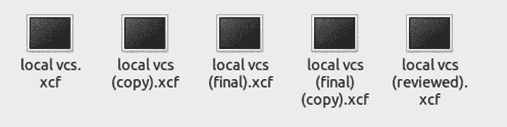
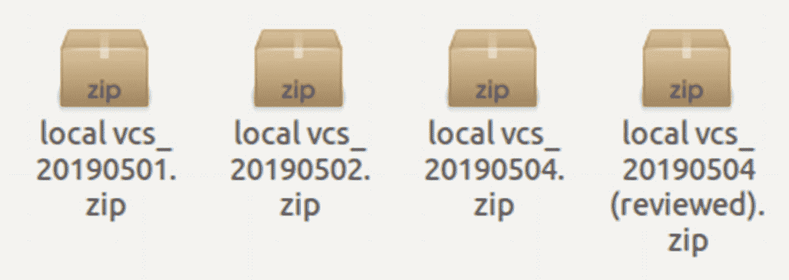
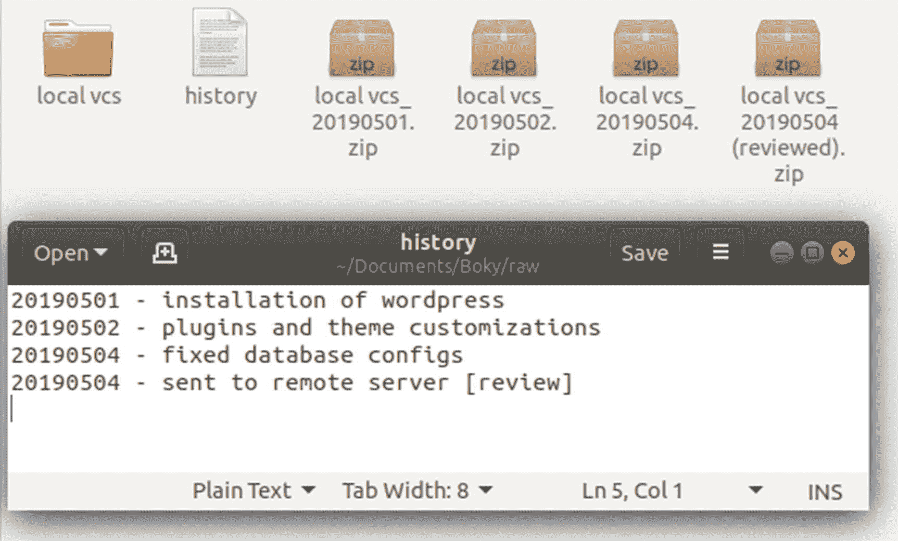
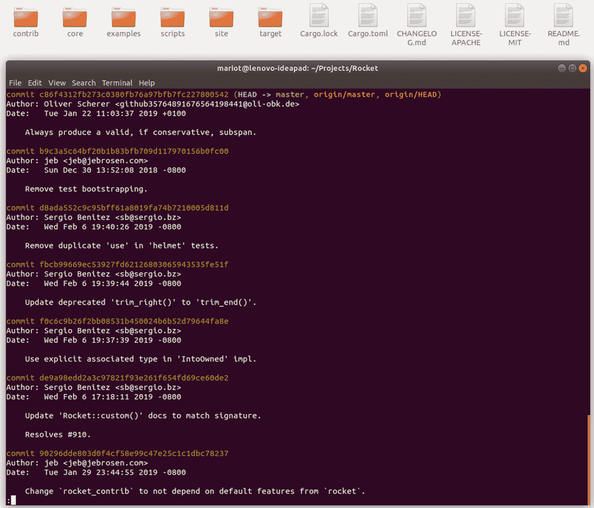
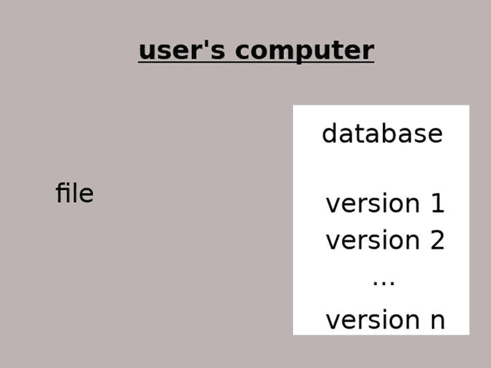
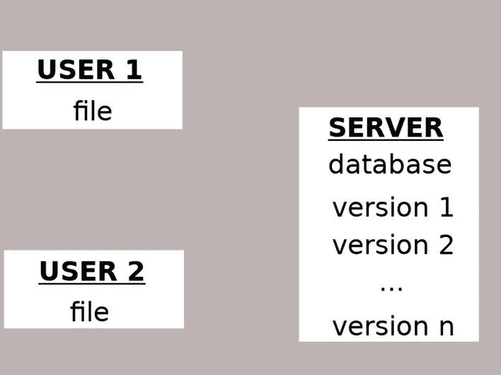
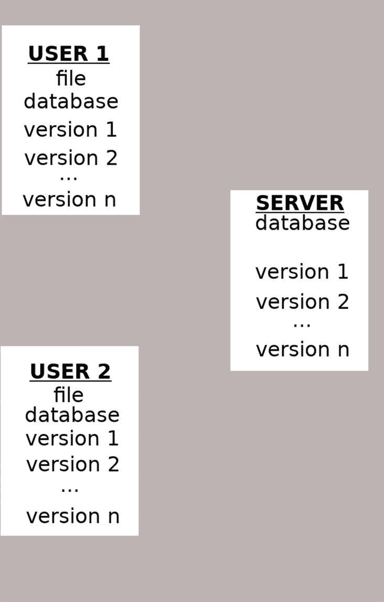
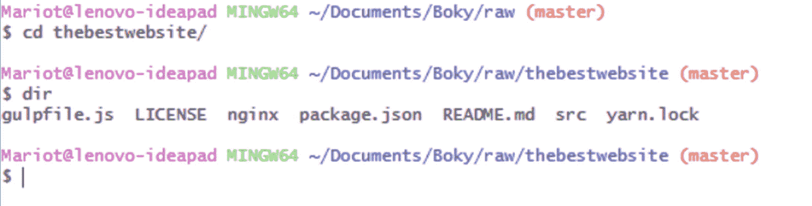
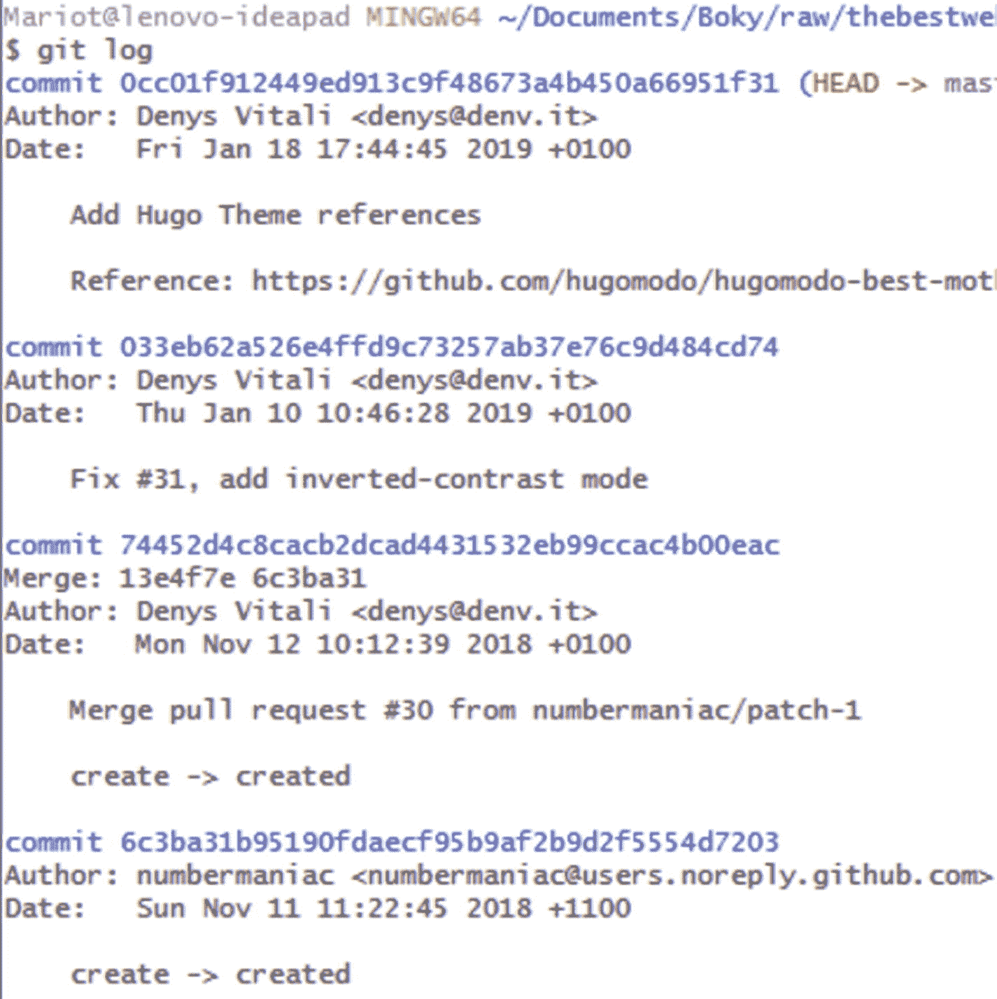
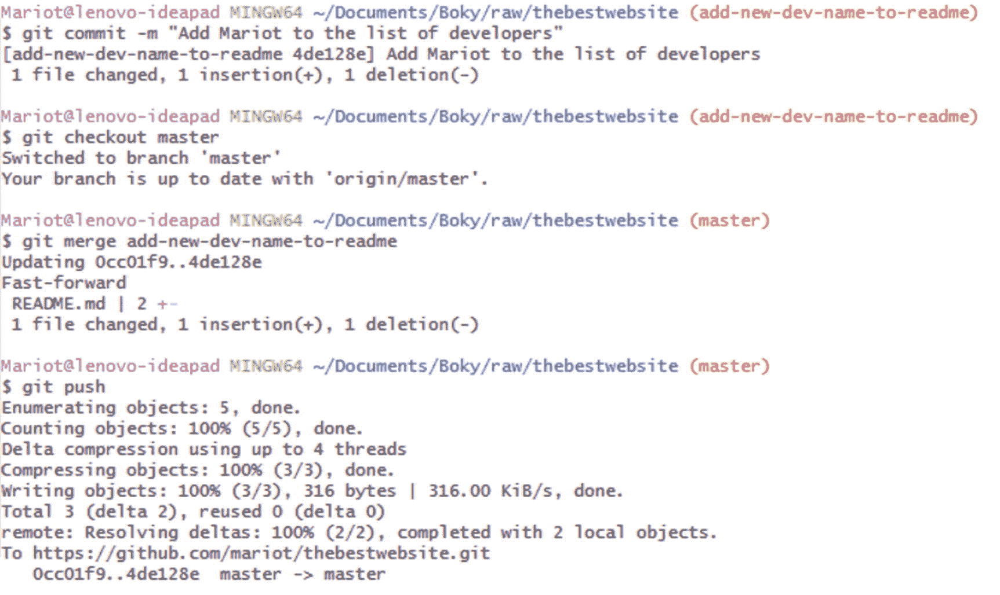

# 一、版本控制系统

这是我们进入版本控制系统(VCSs)的第一步。在本章结束时，你应该知道版本控制、Git 及其历史。主要目的是了解在什么情况下需要版本控制，以及为什么 Git 是一个安全的选择。

## 什么是版本控制？

顾名思义，版本控制是关于一个项目的多个版本的管理。要管理版本，必须跟踪项目中文件的每次更改(添加、编辑或删除)。版本控制记录对一个文件(或一组文件)所做的每次更改，并提供一种撤消或回滚每次更改的方法。

为了有效的版本控制，你必须使用被称为版本控制系统的工具。它们帮助您在更改之间导航，并在出现问题时让您快速返回到以前的版本。

使用版本控制的一个最重要的优势是团队合作。当不止一个人对一个项目做出贡献时，跟踪变更就变成了一场噩梦，并且它大大增加了覆盖另一个人的变更的可能性。有了版本控制，多人可以在他们的项目副本上工作(称为分支),并且只有当他们(或者其他团队成员)对工作满意时，才将那些变更合并到主项目中。

### 注意

这本书是从开发人员的角度写的，但书中的一切都适用于任何文本文件，而不仅仅是代码。版本控制系统甚至可以跟踪对图像或 Photoshop 文件等许多非文本文件的更改。

## 你为什么需要一个？

你曾经做过一个文本项目或者一个需要你回忆对每个文件所做的具体修改的代码吗？如果是，您是如何管理和控制每个版本的？也许你试图复制这些文件，并用“审阅”、“修复”或“最终”这样的后缀来重命名它们？图 [1-1](#Fig1) 显示了那种版本控制。



图 1-1

后缀为“最终版”、“最终版(副本)”和“已审核”的 Gimp 文件

图中显示了许多人处理文件更改的方式。如你所见，这有可能很快失控。很容易忘记哪个文件是哪个文件，以及它们之间发生了什么变化。

要跟踪版本，一个想法是压缩文件并在文件名后添加时间戳，以便版本按照创建日期排列。图 [1-2](#Fig2) 显示了那种版本跟踪。



图 1-2

按日期排序的压缩版本文件

图 [1-2](#Fig2) 所示的解决方案似乎是完美的系统，直到你意识到即使版本被跟踪，也没有办法知道每个版本的内容和描述是什么。

为了补救这种情况，一些开发人员使用如图 [1-3](#Fig3) 所示的解决方案，即将每个版本的变更摘要放在一个单独的文件中。



图 1-3

跟踪每个版本的独立文件

如图 [1-3](#Fig3) 所示，项目文件夹附带了一个单独的文件，其中简要描述了所做的更改。还要注意许多包含项目早期版本的压缩文件。

应该可以了，对吧？不完全是，你仍然需要一种方法来比较每个版本和每个文件的变化。在那个系统中没有办法做到这一点；你只需要记住你所做的一切。如果项目越来越大，每个版本的文件夹都会越来越大。

当另一个开发者或作者加入你的团队时会发生什么？你会用电子邮件互相发送你编辑过的文件或版本吗？还是在同一个远程文件夹上工作？在最后一种情况下，您如何知道谁在处理哪个文件以及什么发生了变化？

最后，你有没有觉得有必要在不破坏过程中的一切的情况下，撤销几年前做出的改变？一个无限全能的 ctrl-z？

所有这些问题都可以通过使用版本控制系统或 VCS 来解决。VCS 跟踪您对项目的每个文件所做的每个更改，并提供一种简单的方法来比较和回滚这些更改。项目的每个版本还附有对所做更改的描述，以及新文件或编辑过的文件的列表。当更多的人加入这个项目时，VCS 可以准确地显示谁在特定的时间编辑了特定的文件。所有这些都让你为你的项目赢得了宝贵的时间，因为你可以专注于写作，而不是花时间跟踪每个变化。图 [1-4](#Fig4) 显示了一个由 Git 管理的版本化项目。



图 1-4

Git 版本化的项目

如图 [1-4](#Fig4) 所示，一个版本化的项目结合了我们在本章尝试的所有解决方案。有变更描述、团队合作和编辑日期。

让我们了解更多关于版本控制系统的信息。

## 有哪些选择？

版本控制系统有很多种，每种都有自己的优点和缺点。VCS 可以是本地的、集中式的或分布式的。

### 本地版本控制系统

这些是为管理源代码而创建的第一批 VCS。他们通过跟踪对本地存储的单个数据库中的文件所做的更改来工作。这意味着所有的更改都保存在一台计算机中，如果出现问题，所有的工作都会丢失。这也意味着与团队合作是不可能的。

最受欢迎的本地 VCS 之一是源代码控制系统或 SCCS，它是免费的，但不公开源代码。由美国电话电报公司开发，在 20 世纪 70 年代被广泛使用，直到修订版控制系统(RCS)发布。RCS 比 SCCS 更受欢迎，因为它是开源的、跨平台的，而且更有效。RCS 于 1982 年发布，目前由 GNU 项目维护。这两个本地 VCS 的缺点之一是它们一次只能处理一个文件；他们无法跟踪整个项目。

为了帮助你想象它是如何工作的，这里的图 [1-5](#Fig5) 展示了一个简单的本地 VCS。



图 1-5

本地 VCS 是如何工作的

如图 [1-5](#Fig5) 所示，所有东西都在用户的电脑上，只有一个文件被跟踪。版本控制存储在由本地 VCS 管理的数据库中。

### 集中式版本控制系统

集中式 VCS (CVCS)的工作方式是将变更历史存储在客户机(作者)可以连接的单一服务器上。这提供了一种与团队合作的方式，也提供了一种监控项目总体进度的方式。它们仍然很受欢迎，因为这个概念非常简单，很容易安装。

主要的问题是，就像当地的 VCS 一样，一个服务器错误会让团队失去所有的工作。还需要网络连接，因为主项目存储在远程服务器上。

你可以在图 [1-6](#Fig6) 中看到它是如何工作的。



图 1-6

中央集权的 VCS 是如何运作的

图 [1-6](#Fig6) 显示了集中式 VCS 的工作方式类似于本地 VCS，但是数据库存储在远程服务器上。

使用集中式 VCS 的团队面临的主要问题是，一旦某个文件被某人使用，该文件就会被锁定，其他团队成员就无法对其进行操作。因此，他们不得不相互协调来修改单个文件。这造成了开发中的许多延迟，并且通常是贡献者的许多挫折的来源。团队成员越多，问题就越多。

为了解决本地 VCS 的问题，并行版本系统(CVS)被开发出来。它是开源的，可以跟踪多组文件，而不是单个文件。许多用户也可以同时处理同一个文件，因此名称中有“并发”一词。所有的历史都存储在远程存储库中，用户可以通过签出服务器来跟上变化，这意味着将远程数据库的内容复制到他们的本地计算机上。

Apache Subversion 或 SVN 是在 2000 年开发的，可以做 CVS 能做的一切，还有一个好处:它可以跟踪非文本文件。SVN 的主要优势之一是，它不是像以前的 VCS 那样跟踪一组文件，而是跟踪整个项目。所以，它本质上是跟踪目录而不是文件。这意味着重命名、添加和删除也会被跟踪。这使得 SVN，连同它的开源，成为一个非常受欢迎的 very 至今仍被广泛使用。

### 分布式版本控制系统

分布式 VCS 的工作方式与集中式 VCS 几乎相同，但有一个很大的区别:没有保存所有历史的主服务器。每个客户端都有一个存储库的副本(以及更改历史)，而不是签出单个服务器。

这大大降低了丢失一切的可能性，因为每个客户都有一个项目的克隆。对于分布式 VCS，拥有“主服务器”的概念变得模糊，因为每个客户端本质上都拥有自己存储库中的所有权力。这极大地鼓励了开源社区中“分叉”的概念。分叉是克隆一个存储库的行为，以进行您自己的更改，并对项目进行不同的处理。分叉的主要好处是，如果您认为合适的话，您还可以从其他存储库中提取变更(其他人也可以对您的变更做同样的事情)。

分布式版本控制系统通常比其他类型的 VCS 更快，因为它不需要通过网络访问远程服务器。几乎所有的事情都在本地完成。它的工作方式也略有不同:它不是跟踪版本之间的变化，而是将所有变化作为“补丁”来跟踪这意味着这些补丁可以在存储库之间自由交换，因此没有“主”存储库需要跟上。

图 [1-7](#Fig7) 显示了分布式 VCS 的工作原理。



图 1-7

分布式 VCS 如何工作

### 注意

通过查看图 [1-7](#Fig7) ，很容易得出这样的结论:有一个主服务器是用户一直关注的。但分布式 VCS 并非如此，它只是许多开发人员为了获得更好的工作流而遵循的惯例。

BitKeeper SCM 是 2000 年发布的专有分布式 VCS，像 20 世纪 70 年代的 SCCS 一样，是闭源的。它有一个免费的“社区版本”,缺少 BitKeeper SCM 的许多大功能，但因为它是第一个分布式 VCS 之一，所以即使在开源社区中也非常受欢迎。BitKeeper 的这种受欢迎程度对 Git 的创建起到了很大的作用。它现在是一个开源软件，其源代码于 2016 年在 Apache 许可下发布。可以在 [`www.bitkeeper.org/`](http://www.bitkeeper.org/) 上找到当前的 BitKeeper 项目；发展慢下来了，但还是有社群在贡献。

## Git 是什么？

还记得上一节提到的专有分布式版本控制系统 BitKeeper SCM 吗？嗯，Linux 内核开发人员使用它进行开发。使用它的决定被广泛认为是一个糟糕的举动，使许多人不高兴。他们的担心在 2005 年得到了证实，当时 BitKeeper SCM 不再免费。由于它是闭源的，开发者失去了他们最喜欢的版本控制系统。这个社区(由 Linus Torvalds 领导)不得不寻找另一个 VCS，由于没有替代方案，他们决定自己创造一个。于是，Git 诞生了。

因为 Git 是用来取代 BitKeeper SCM 的，所以它的工作原理基本相同，只是做了一些调整。像 BitKeeper SCM 一样，Git 是一个分布式版本控制系统，但是它速度更快，并且更适合大型项目。Git 社区非常活跃，有很多贡献者参与了它的开发；你可以在 [`https://git-scm.com/`](https://git-scm.com/) 上找到更多关于 Git 的信息。Git 的特性及其工作原理将在本节稍后解释。

### Git 能做什么？

还记得我们在本章开始时试图解决的那些问题吗？嗯，Git 可以全部解决。它甚至可以解决你以前不知道的问题！

首先，它非常适合跟踪更改。你可以

*   在不同版本之间来回切换

*   查看这些版本之间的差异

*   检查文件的更改历史

*   标记特定版本以便快速参考

Git 也是团队合作的一个很好的工具。你可以

*   在存储库之间交换“变更集”

*   查看其他人所做的更改

Git 的主要特征之一是它的分支系统。一个分支是一个项目的拷贝，你可以在不弄乱存储库的情况下工作。这个概念已经存在一段时间了，但是有了 Git，它会更快更有效。分支还伴随着合并，合并是将分支中完成的变更集复制回源的行为。通常，您创建一个分支来创建或测试一个新的特性，当您对工作满意时，将该分支合并回来。

还有一个你可能会经常用到的简单概念:藏东西。隐藏是安全地把你当前的编辑放在一边的行为，这样你就有一个干净的环境去做一些完全不同的东西。当你尝试或测试一个特性，但需要优先开发一个新特性时，你可能想使用 stashing。所以，你把你的修改藏起来，开始写那个特性。完成后，您可以取回所做的更改，并将其应用到当前的工作环境中。

作为开胃菜，下面是您将在本书中学习的一些 Git 命令:

```
$ git init     # Initialize a new git database
$ git clone    # Copy an existing database
$ git status   # Check the status of the local project
$ git diff     # Review the changes done to the project
$ git add      # Tell Git to track a changed file
$ git commit   # Save the current state of the project to database
$ git push     # Copy the local database to a remote server
$ git pull     # Copy a remote database to a local machine
$ git log      # Check the history of the project
$ git branch   # List, create or delete branches
$ git merge    # Merge the history of two branches together
$ git stash    # Keep the current changes stashed away to be used later

```

如您所见，这些命令非常简单明了。不要担心把它们都记在心里；当我们适当地开始学习时，你将一个一个地记住它们。你不会一直使用它们，你会经常使用 git add 和 git commit。您将了解每个命令，但我们将重点关注您可能在专业设置中使用的命令。但在此之前，我们先来看看 Git 的内部工作原理。

### Git 是如何工作的？

与许多版本控制系统不同，Git 处理快照，而不是差异。这意味着它不跟踪文件的两个版本之间的差异，而是拍摄项目的当前状态。

这就是为什么 Git 与其他分布式 VCS 相比非常快；这也是为什么在版本和分支之间切换如此快速和容易。

还记得集中式版本控制系统是如何工作的吗？嗯，Git 是完全相反的。你不需要与中央服务器通信来完成工作。由于 Git 是一个分布式 VCS，每个用户都有自己完整的存储库，有自己的历史和变更集。因此，除了共享补丁或变更集之外，一切都在本地完成。如前所述，不需要中央服务器；但是许多开发人员使用一个作为惯例，因为这样更容易工作。

说到补丁共享，Git 怎么知道哪些变更集是谁的？当 Git 拍摄快照时，它会对快照执行校验和检查；因此，通过比较校验和，它知道哪些文件发生了变化。这就是为什么 Git 可以很容易地跟踪文件和目录之间的变化，并且它还检查任何文件损坏。

Git 的主要特点是它的“三态”系统。这些状态是工作目录、临时区域和 git 目录:

*   工作目录就是您正在处理的当前快照。

*   临时区域是修改后的文件在其当前版本中被标记的地方，准备存储在数据库中。

*   git 目录是存储历史的数据库。

因此，基本上 Git 的工作方式如下:修改文件，将想要包含在快照中的每个文件添加到暂存区(git add)，然后获取快照并将它们添加到数据库(git commit)。对于术语，我们将添加到暂存区域的修改文件称为“暂存”，将添加到数据库的文件称为“提交”因此，文件从“修改”到“暂存”再到“提交”

### 典型的 Git 工作流程是怎样的？

为了帮助您形象化我们在本节中讨论的所有内容，这里有一个使用 Git 的典型工作流的小演示。如果你现在还不明白所有的事情，不要担心；接下来的几章将会帮助你设置好。

这是你第一天工作。您的任务是将您的名字添加到现有的项目描述文件中。因为这是你的第一天，一个高级开发人员会在那里检查你的代码。

你应该做的第一件事是获得项目的源代码。向您的经理询问存储代码的服务器。对于这个演示，服务器是 GitHub，这意味着 Git 数据库存储在 GitHub 托管的远程服务器上，您可以通过 URL 或直接在 GitHub 网站上访问它。这里，我们将使用 clone 命令来获取数据库，但是您也可以从 GitHub 网站下载项目。您将获得一个 zip 文件，其中包含和项目文件及其所有历史。

因此，您可以使用“clone”命令克隆存储库以获得源代码。

```
git clone https://github.com/mariot/thebestwebsite.git

```

Git 然后在您工作的当前目录中下载一个存储库的副本。之后，您可以进入新目录并检查其内容，如图 [1-8](#Fig8) 所示。



图 1-8

将显示存储库的内容

如果你想检查最近对项目所做的修改，你可以使用“日志”命令来显示历史。图 [1-9](#Fig9) 显示了一个例子。



图 1-9

典型的 Git 历史日志

很好！现在你应该创建一个新的分支来工作，这样你就不会弄乱这个项目。您可以使用“branch”命令创建一个新的分支，并使用“checkout”命令将其签出。

```
git branch add-new-dev-name-to-readme
git checkout add-new-dev-name-to-readme

```

现在新的分支已经创建，您可以开始修改文件了。你可以使用任何你想要的编辑器；Git 将通过校验和跟踪所有的变化。既然您已经做出了必要的更改，那么是时候将它们放到准备区域了。提醒一下，登台区是您放置准备拍摄的修改代码的地方。如果我们修改了“README.md”文件，我们可以使用“add”命令将其添加到临时区域。

```
git add README.md

```

您不必将修改过的每个文件都添加到暂存区，只需添加那些您希望包含在快照中的文件。既然文件已经暂存，是时候“提交”它或将它的更改放入数据库中了。我们通过使用命令“commit”并附加一些描述来实现这一点。

```
git commit -m "Add Mariot to the list of developers"

```

就这样！您所做的更改现在已保存在数据库中，并被安全地存储起来。但只能在你的电脑上！其他人看不到您的工作，因为您在自己的存储库和不同的分支上工作。为了向其他人展示您的工作，您必须将您的提交推送到远程服务器。但你必须先给高级开发人员看代码，然后再进行推送。如果他们同意，您可以将您的分支与项目的主快照合并(称为主分支)。因此，首先您必须使用“checkout”命令导航回主分支。

```
git checkout master

```

您现在在主分支上，团队的所有工作都存储在这里。但是，当您进行修复时，项目可能已经改变，这意味着团队成员可能已经改变了一些文件。您应该在将自己的更改提交给 master 之前检索这些更改。这将限制“冲突”的风险，当两个或更多的贡献者改变同一个文件时，可能发生“冲突”。要获得更改，您必须从远程服务器(也称为源服务器)中提取项目。

```
git pull origin master

```

即使另一个同事和您一样修改了同一个文件，冲突的风险也很低，因为您只修改了一行。只有当同一行被多人修改时，才会产生冲突。如果您和您的同事更改了文件的不同部分，一切正常。

现在我们已经跟上了项目的当前状态，是时候将我们的版本提交给 master 了。你可以用“合并”命令合并你的分支。

```
git merge add-new-dev-name-to-readme

```

既然提交已经合并回主服务器，那么是时候将更改推送到主服务器了。我们通过使用“推送”命令来做到这一点。

```
git push

```

图 [1-10](#Fig10) 显示了我们使用的命令和结果。



图 1-10

一个简单的 Git 工作流

就这么简单！再说一遍，如果你还没有完全理解，也不要担心。这只是 Git 通常如何使用的一个小演示。这也不太现实:没有哪个经理会像那样给新员工一张进入他们主资料库的通行证。

## 摘要

这只是对 Git 的一个瞥视；它有许多更强大的功能，您将在这个过程中了解到。但是在其他事情之前，在进入下一步之前，你应该问自己一些问题:“Git 将如何在我的项目中帮助我？”、“哪些功能最重要？”，以及“Git 会改善我的工作流程吗？”

本章的主要内容是分布式和集中式 VCS 之间的区别。使用 CVCS 的团队的工作流程不太有组织性，让太多的开发人员没有成就感。因此，您需要了解更多关于分布式 VCS 的知识，以跟上时代的步伐。

在本章中，我们已经看到了团队使用 Git 的典型工作流程；这是大多数团队在专业环境中甚至在开源社区中使用的工作流。即使你计划独自工作，使用工作流程也会提高你的工作效率。

现在不要担心理解 Git 的所有内容；专注于它能为你做什么。读完几章后，你就会熟悉它了。但是现在，让我们思考一下如何在您的系统上安装 Git。