# 2.安装和设置

现在你知道了什么是版本控制以及 Git 是如何工作的，我们将学习如何安装和设置它。这一章比其他章节要短，因为设置 Git 非常容易。

## 装置

安装 Git 所需的文件在所有系统的 [`https://git-scm.com/downloads`](https://git-scm.com/downloads) 上。只需点击链接并选择您的操作系统。

你还可以在图 [2-1](#Fig1) 中看到，那里也有 Git 的 GUI 客户端。在完成本书的第三部分《与 Git 的团队合作》之前，不要离开。在使用 GUI 客户端之前，您需要熟悉 Git 命令；否则，您将会浪费大量时间来解决一个简单的问题，而使用简单的 Git 命令只需几秒钟。

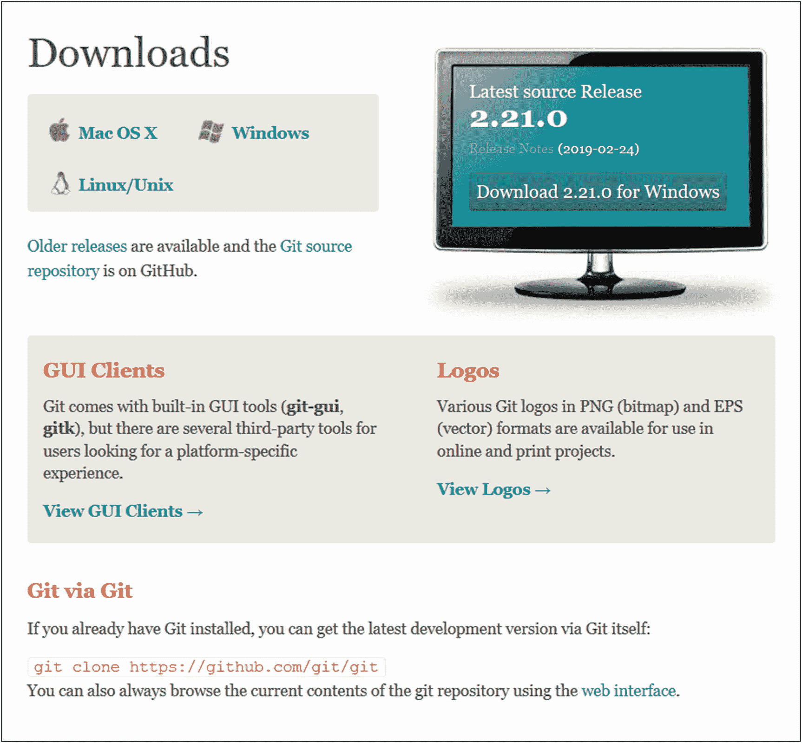

图 2-1

截至 2019 年 5 月的 git-scm.com 下载部分

在您熟悉 Git 命令之后，您可以检查一个 GUI 客户机并亲自查看。在这本书的最后一部分有一章是关于 GUI 客户端的。但是在那之前请不要使用任何 GUI 客户端；会大大拉长你的学习时间。

### 注意

Git 捆绑了两个 GUI 工具:用于查看历史的 gitk 和用于基本命令的 git-gui。你将在本书的最后一部分学习使用它们，所以前面的建议仍然适用。

### Windows 操作系统

在 Windows 系统上安装 Git 非常容易。打开链接( [`https://git-scm.com/download/win`](https://git-scm.com/download/win) )后，下载应该会自动开始，你会到达图 [2-2](#Fig2) 所示的确认页面。如果没有，只需下载符合您的 Windows 风格的版本。

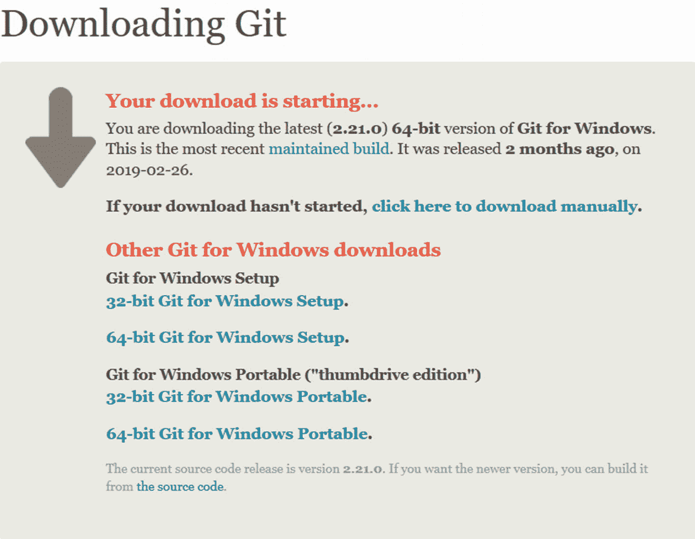

图 2-2

用于 Windows 的 Git 下载屏幕

执行下载 exe 文件开始安装。第一个屏幕是概述条款和条件的许可声明；你应该一直读到最后(对，没错)。点击下一步，您将进入类似于图 [2-3](#Fig3) 所示的组件选择屏幕。这里会提示您选择要安装的组件。我建议保留默认选项。

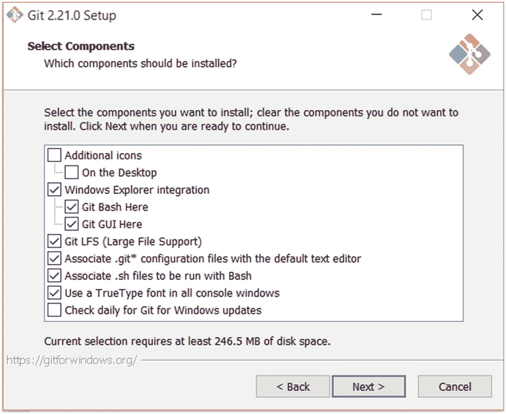

图 2-3

选择要安装的组件

你可以在图 [2-3](#Fig3) 中看到，你只需要检查组件来安装它们。保持选中 Windows 资源管理器集成是一个好主意；这样，您只需右键单击一个文件夹，在默认 GUI 或上下文菜单中的 Bash(命令窗口)中找到启动 Git 的选项。所有其他组件都是不言自明的，所以决定权在你。

### 小费

如果您没有安装 Windows 资源管理器集成，并且想要打开文件夹中的命令窗口，您必须使用 Shift +右键单击来打开扩展的上下文菜单。

做出选择后点击 next，您将看到默认的编辑器选择，如图 [2-4](#Fig4) 所示。Git 需要您定义一个默认编辑器，因为您需要一个编辑器来写出提交描述和注释。

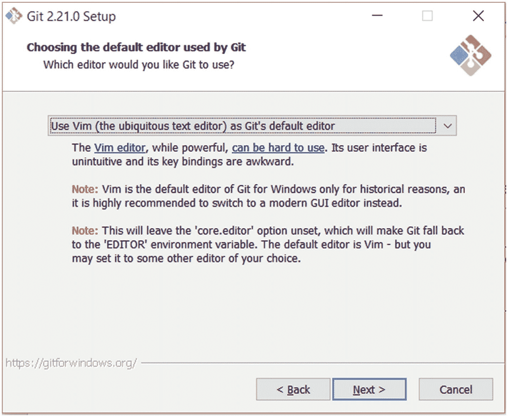

图 2-4

默认编辑器选择

正如你在图 [2-4](#Fig4) 中看到的，由于历史原因，Vim 是 Git 的默认编辑器。只需从下拉列表中选择您最喜欢的文本编辑器。前两个，Nano 和 Vim，在控制台或命令窗口中工作，所以你不必打开另一个程序。在列表中，你可以找到许多流行的编辑器，如 Notepad++，Sublime Text，Atom 和 Visual Studio (VS) Code。如果您的编辑器没有列出，您可以选择最后一个选项，一个新的输入将会出现(如图 [2-5](#Fig5) 所示),这样您就可以提供一个到编辑器主可执行文件的链接。

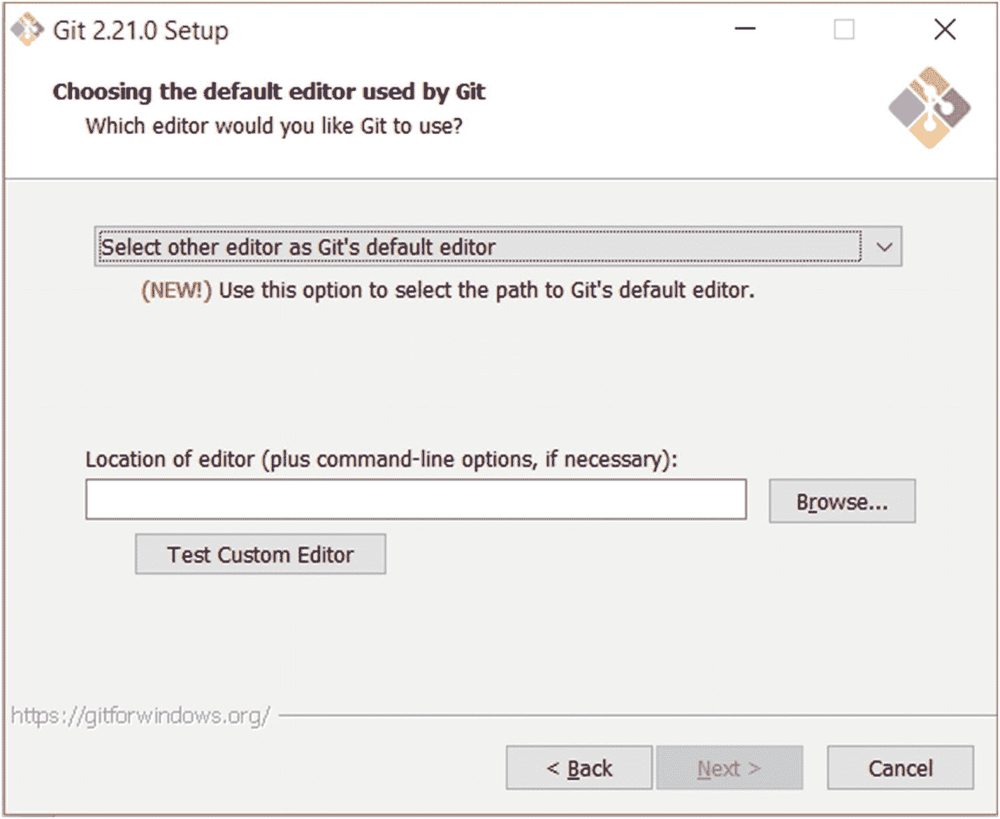

图 2-5

设置自定义编辑器

在图 [2-5](#Fig5) 中，您可以看到这样一个屏幕，如果它没有在下拉列表中列出，您可以在这里设置您的自定义编辑器。

对于这本书，我决定保留默认选项，使用 Vim。如果你决定使用其他编辑器，这不会改变这本书的任何内容。但是如果你想学习 Vim(需要一点时间)，你可以看看“vimtutor”，这是 Vim 附带的一个辅导程序，或者通过 [`https://vim-adventures.com/`](https://vim-adventures.com/) 上一个有趣的视频游戏来学习。还有 [`www.vi-improved.org/vimusermanual.pdf`](http://www.vi-improved.org/vimusermanual.pdf) 更全但是 300 多页！

不要担心，这个选择不是决定性的，你仍然可以随时改变。你将在本章的最后一节了解如何操作。

### 警告

在网上，永远不要开始或参与编辑大战。选择你喜欢的文本编辑器，不要和任何人谈论它。我仍然带着过去在“Emacs vs. Vim”战争中留下的伤疤。

一旦你选择了你喜欢的编辑器，你就可以进入下一个屏幕，这是路径环境调整，如图 [2-6](#Fig6) 所示。PATH 环境是一个变量，它包含可执行程序在其值中所在的目录列表。这是必需的，这样当你想在控制台中执行一个可执行文件时，你就不必键入它的完整路径；你只需要输入它的名字。例如，要从控制台启动 Visual Studio 代码，我应该键入 C:\ Program Files(x86)\ Microsoft VS Code \ bin \ Code。但是由于我的路径中有 C:\ Program Files(x86)\ Microsoft VS Code \ bin，所以我只需键入“Code”即可启动它。

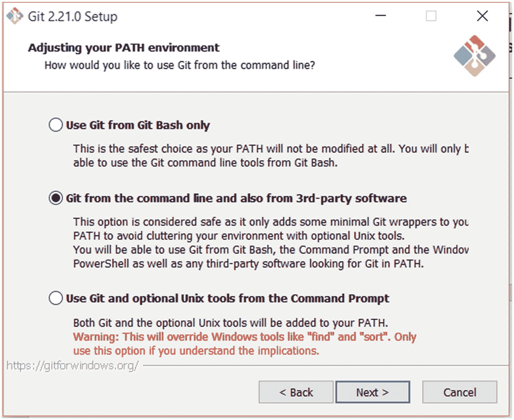

图 2-6

选择是否将 Git 添加到路径

如果你愿意，这同样适用于 Git。如果您不希望这样，而只想将 Git 与它自己的独立控制台“Git Bash”一起使用，请选择第一个选项。因此，要使用 Git，您必须从应用列表或文件夹的上下文菜单中启动它(如果您选择安装 Windows 资源管理器集成)。

如果您希望能够在任何地方使用 Git，请保留默认选项，将其添加到您的 PATH 环境中。这样，其他工具也可以使用 Git，您可以从任何命令窗口工作。我强烈建议这个选项。

最后一个选项有点侵入性。它将向您的路径添加许多 Git 命令，并将覆盖一些 Windows 的默认工具。只有在您也有正当理由的情况下才选择此项；一般你没有这样的理由。

如图 [2-6](#Fig6) 所示选择一个选项，进行下一步。您将到达一个关于 HTTPS 连接的屏幕，如图 [2-7](#Fig7) 所示。通过 HTTPS 发送数据时，您必须选择使用哪个库。在本书的后面，您将不得不连接到一个远程服务器(因为 Git 是一个分布式 VCS)来与其他人共享您的提交，因此所有这些连接都必须加密，以进一步保护您的数据，确保它们不被窃取。

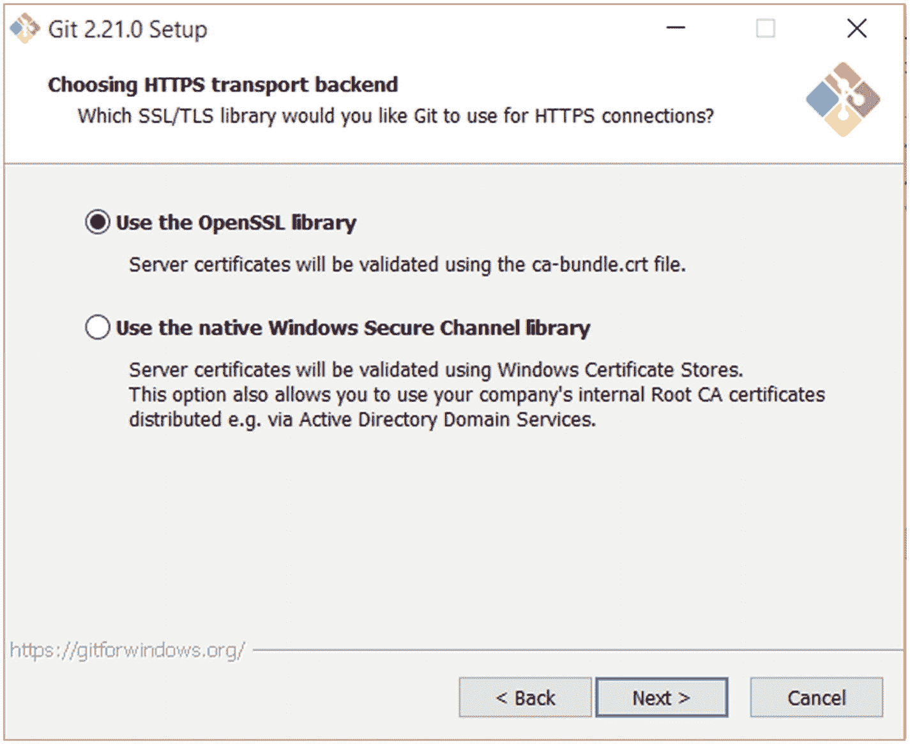

图 2-7

选择 HTTPS 交通工具

除非有理由(公司政策或您自己的小安全设置)，否则请使用默认选项。

在这之后，进入下一步，这是关于行尾。这又是一个选择屏幕，所以你的屏幕应该如图 [2-8](#Fig8) 所示。不同的操作系统对文本文件的操作是不同的，尤其是在处理行尾的时候。您将要合作的团队可能会使用不同的操作系统。因此，在共享提交之前，Git 需要将行尾和每种结尾风格相互转换。

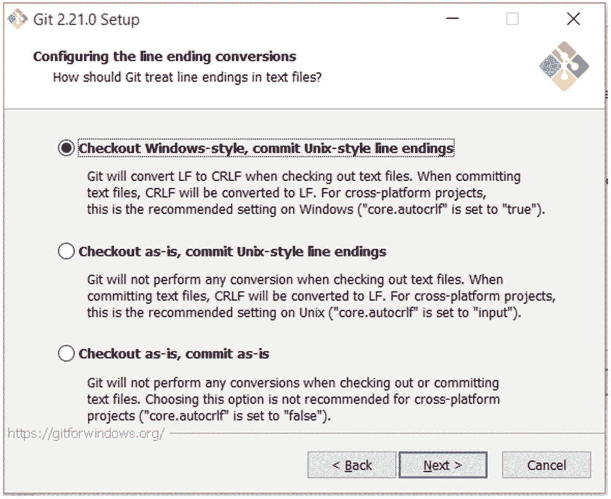

图 2-8

行尾转换

因为您将使用 Windows，所以应该选中默认选项。如果您不注意行尾，其他两个选项会对您的提交造成很大的损害。选择默认选项后，您可以进入下一步。

### 警告

这一步很重要，因为 Windows 和 MacOS 使用\r\n 而不是 Linux 的\n 来结束行，如果您不转换，您的文件将变得非常难以阅读，Git 将检测到许多更改，即使没有进行那么多更改。

下一步是选择默认的终端(或控制台)模拟器。这是一个简单的选择屏幕，如图 [2-9](#Fig9) 所示。Git Bash 需要一个控制台模拟器才能工作，所以您需要选择一个。默认模拟器是 MinTTY，另一个选项是 Windows 的默认控制台。

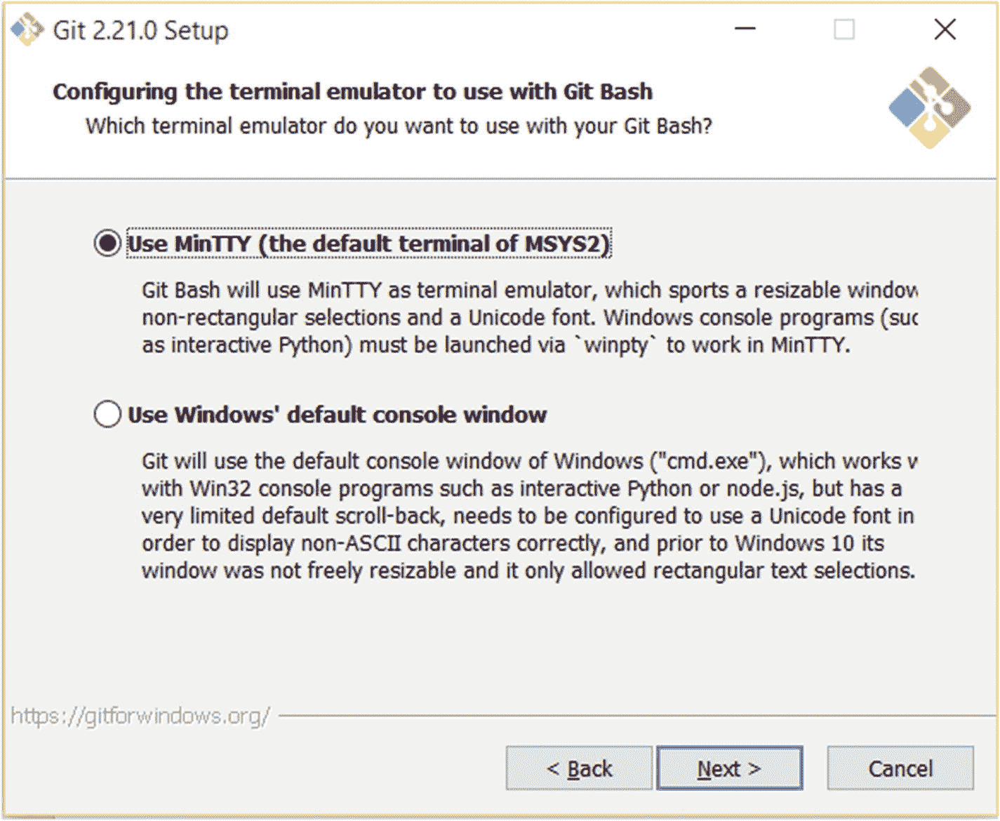

图 2-9

选择终端模拟器

我建议保留默认选项，因为 MinTTY 可以做 Windows 控制台窗口可以做的一切，但在各方面都更好。单击“下一步”进入最后一步。

我们现在处于最后阶段！这个安装就要结束了。只是在额外选项屏幕上做了一些调整。这个屏幕(如图 [2-10](#Fig10) 所示)允许您启用一些额外的特性，这些特性将会很好地配合您的 Git 安装。例如，Git 凭证管理器将帮助您安全地连接到远程服务器，并与其他 Git 工具配合良好。

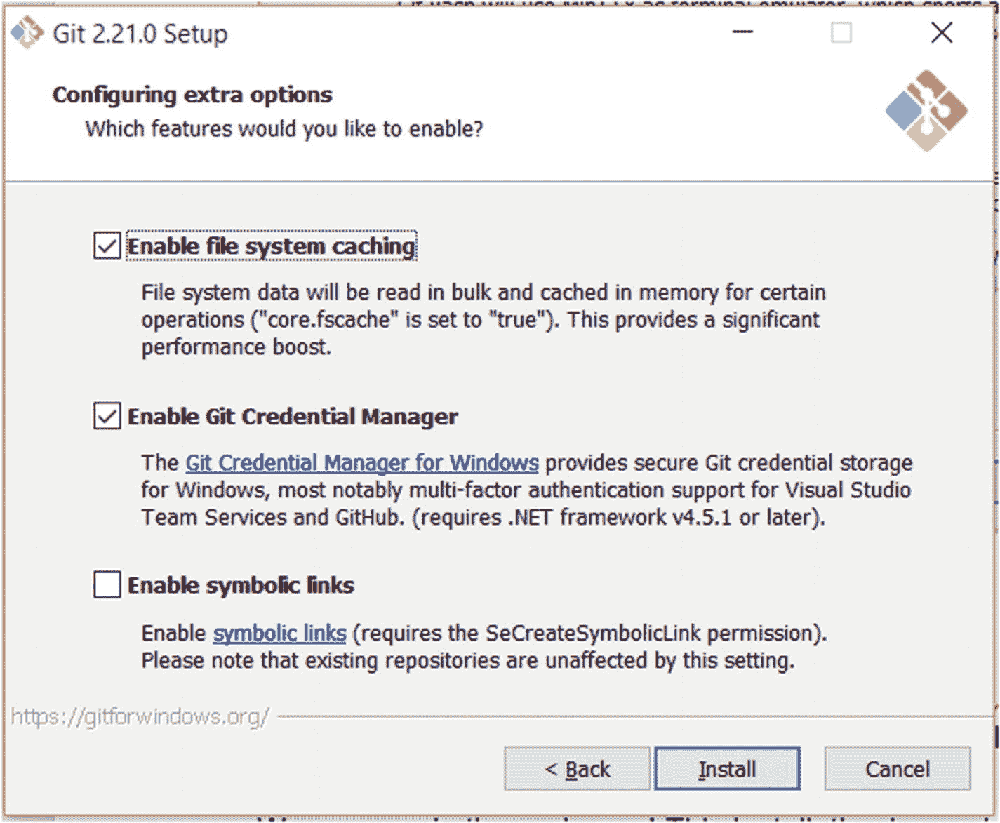

图 2-10

配置额外选项

只要保留默认选项，除非你有理由不这样做。之后，只需启动安装并让它完成。就这样！Git 安装在您的 Windows 系统上。但是在使用它之前，请跳到下一节来正确设置它！

### 苹果个人计算机

如果你已经用 Mac OS X 做过一些软件开发，你可能已经有 Git 了，因为它是和 XCode ( [`https://developer.apple.com/xcode/`](https://developer.apple.com/xcode/) )一起安装的。您可以通过从控制台运行以下命令来检查您是否拥有 Git:

```
$ git --version

```

它应该给你当前安装的 Git 版本，或者如果没有安装，提示你安装 XCode 的命令行工具。如果在提示符下选择 install，将会安装 Git，您可以跳过本节的其余部分。

要在 Mac 上安装 Git，只需进入下载链接 [`https://git-scm.com/download/mac`](https://git-scm.com/download/mac) ，下载应该会自动开始，如图 [2-11](#Fig11) 所示。执行下载的文件，安装将开始；这很简单。

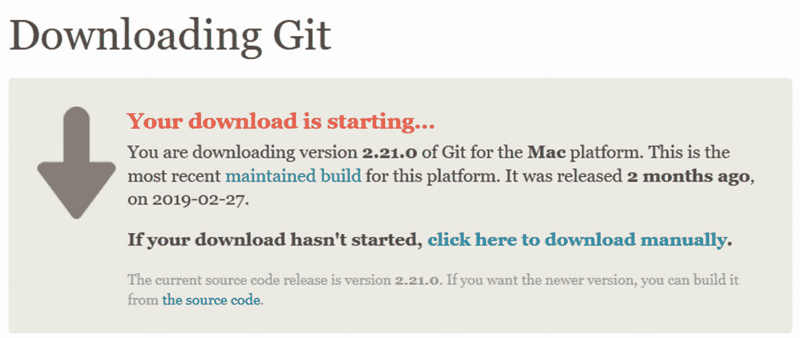

图 2-11

用于 Mac 的下载屏幕

也可以用家酿( [`https://brew.sh/`](https://brew.sh/) )安装。只需运行命令:

```
$ brew install git

```

这将安装大约一半的宇宙，但它最终会停止，Git 将被安装。

就是这样！对于 Mac OS X 来说，安装 Git 要简单得多，你可能已经有了。

### Linux 操作系统

如果你经常使用 Linux，你可能比我更了解你的发行版。因此，用您的包管理器安装 Git 对您来说可能是小菜一碟。

对于 Ubuntu 和 Debian 风格的发行版，您使用 APT 来安装 Git。

```
$ sudo apt-get install git

```

或者

```
$ sudo apt install git (for newer systems)

```

对于 Fedora，您可以使用 YUM 或 DNF。

```
$ sudo yum install git

```

或者

```
$ sudo dnf install git (for newer systems)

```

如果你有一个不同的发行版，你可以检查 [`https://git-scm.com/download/linux`](https://git-scm.com/download/linux) 来获得一个关于如何为每个流行的发行版安装 Git 的命令列表。这个列表应该类似于图 [2-12](#Fig12) 所示的列表，越来越多的 Linux 版本将会出现。

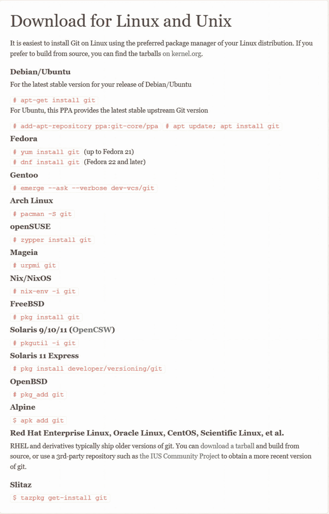

图 2-12

如何在 Linux 上安装 Git

使用图 [2-12](#Fig12) 中列出的与您的发行版相对应的命令后，Git 就安装好了！

### 警告

就像编辑战一样，发行战在网上是一大禁忌。

## 设置 Git

在开始使用 Git 之前，您需要先做一些设置。您可能只需要这样做一次，因为所有的设置都存储在一个外部全局文件中，这意味着所有的项目都将共享相同的配置。还有一种方法可以逐个配置项目，但我们将在后面看到这一点。

由于 Git 是一个分布式版本控制系统，总有一天你会需要连接到其他远程存储库。为了避免犯任何身份错误，有必要告诉 Git 一些关于你自己的情况。不用担心；它不会问你一个有趣的事实！

要设置 Git，请打开 Git Bash(对于 Windows 系统)或默认控制台窗口(对于修改了路径环境的 Linux/MacOS 或 Windows 系统)。在命令提示符下，只需告诉 Git 您的姓名和电子邮件地址:

```
$ git config --global user.name "Mariot Tsitoara"
$ git config --global user.email "mariot.tsitoara@gmail.com"

```

请注意“全局”参数；这意味着该设置适用于所有将来的 Git 存储库，因此您不必在将来再次设置它。

使用 config 命令，您还可以更改您的默认编辑器。如果您因为找到了新的编辑器或者卸载了自己的编辑器而想要更改编辑器，config 命令可以帮助您。例如，要将默认编辑器更改为 Nano，您可以键入

```
$ git config --global core.editor="nano"

```

您可以在您的主文件夹中找到记录 Git 配置的文件。对于 Windows，可以在 C:\Users\YourName\.gitconfig 中找到，对于 Linux 和 Mac OS，可以在/home/yourname/中找到。gitconfig 如图 [2-13](#Fig13) 所示。

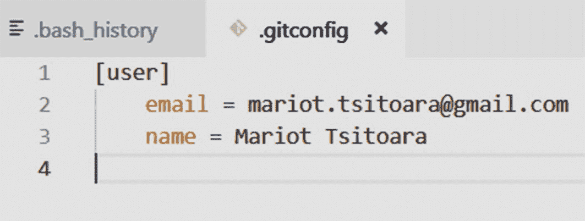

图 2-13

我的 .gitconfig 文件

紧挨着。gitconfig 文件，您可能会找到另一个名为。bash_history 记录您在控制台上输入的所有命令。如果你想重新检查你忘记的命令，你可以检查这个文档。

## 摘要

让我们复习一下到目前为止所学的内容！首先，现在您应该已经在系统上安装了 Git。安装过程在 Windows 上非常容易，在 Mac 和 Linux 上更容易。如果你不确定你需要什么，我建议你保留所有的默认选项(即使在前面的截图中没有显示)。

接下来是设置。在安装 Git 的每个系统中，您只需要这样做一次。Git 将使用你的名字和电子邮件来签署你的每一个动作，所以在你使用它之前有必要设置它们。

就这样！您现在已经准备好使用 Git 的所有优点了。阅读下一章，从 Git 开始。