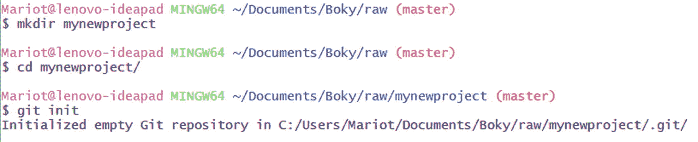
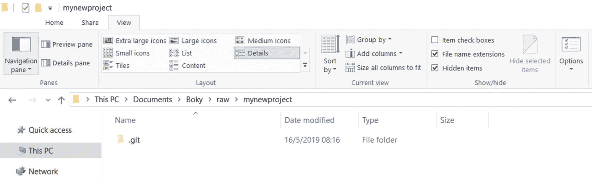
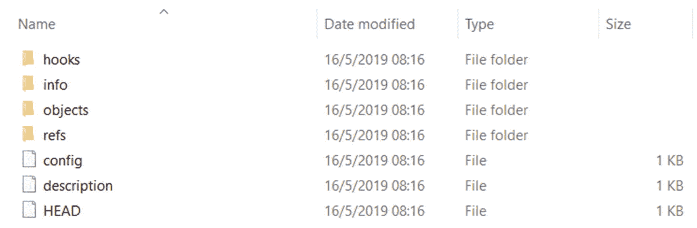
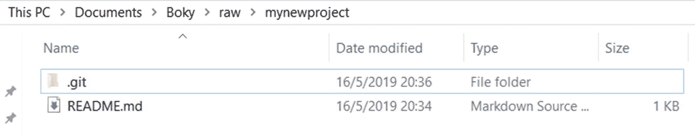
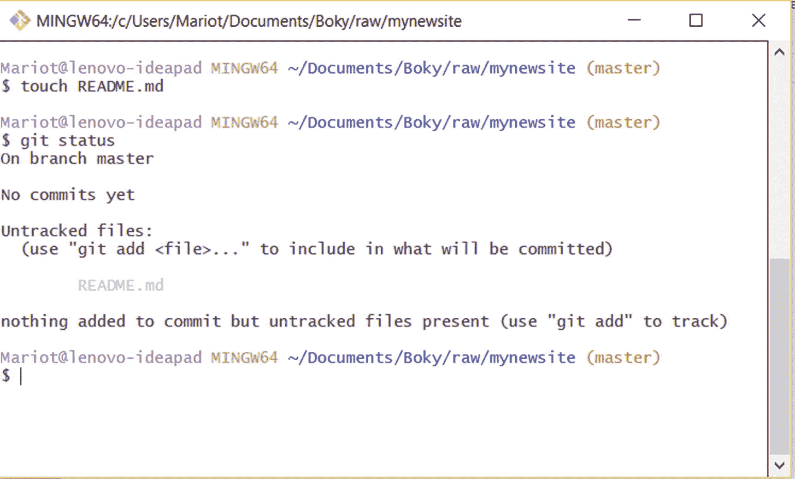
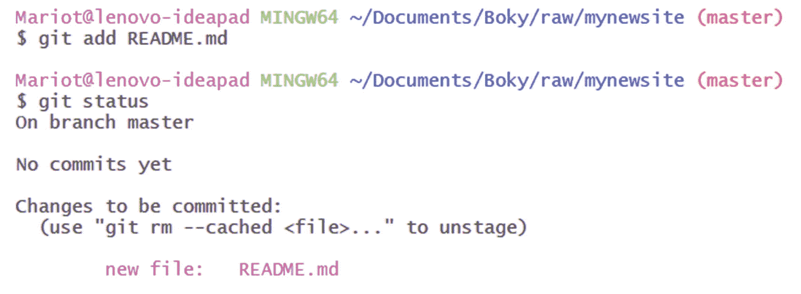
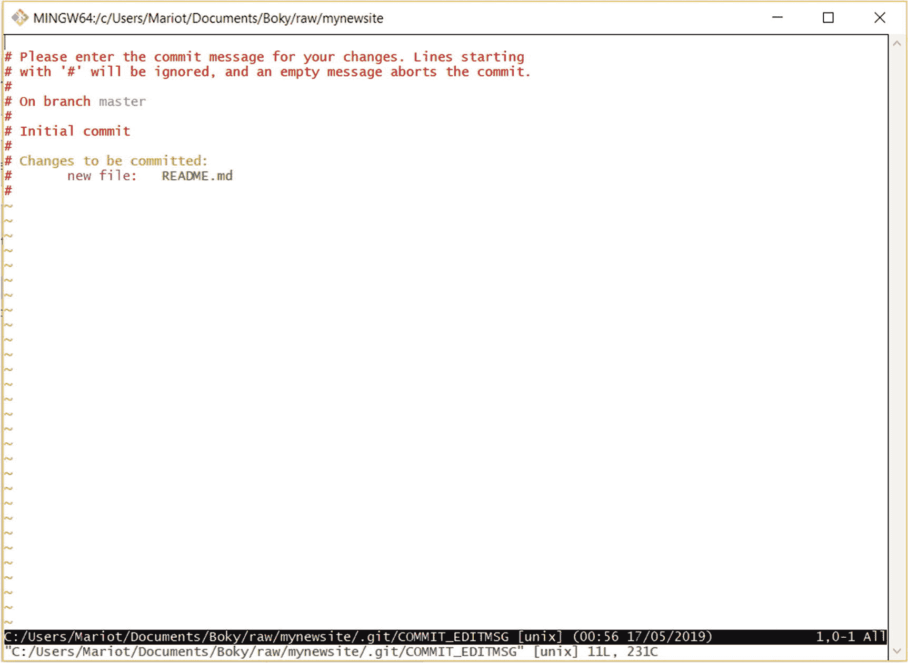
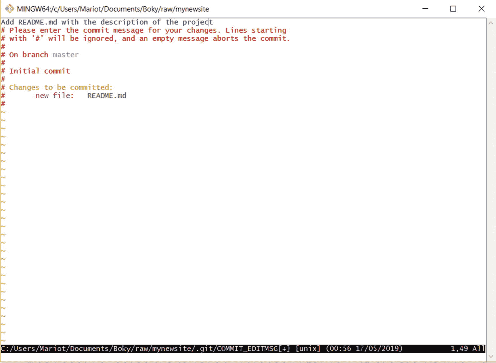
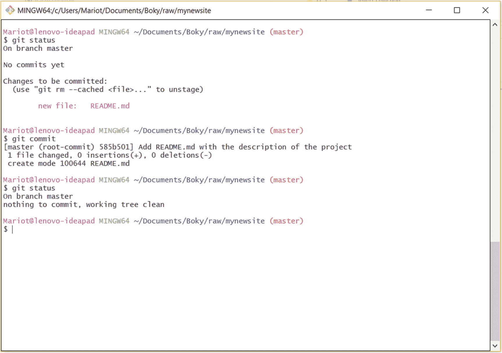

# 3.入门指南

您终于准备好开始使用 Git 了！在这一章中，你将学习一些任何项目都需要的 Git 术语和概念。然后，您的任务是建立一个项目，对其进行更改，检查更改，最后在不同版本之间导航。走吧！

## 仓库

存储库是保存所有项目和对项目所做的所有更改的存储器。你可以把它想象成一个“变化数据库”但是不用担心；它只是你系统中的一个普通文件夹，所以很容易操作。

对于您想用 Git 管理的每个项目，您必须为它建立一个存储库。建立一个存储库非常容易。只需导航到您想要跟踪的文件夹，并告诉 Git 在那里启动一个存储库。

所以对于每个你想开始的项目，你应该

*   创建包含您的项目的目录

*   导航到目录

*   初始化 Git 存储库

看到了吗？很简单。让我们将这些语句转换成命令。但是首先，让我们打开一个控制台来输入我们的命令。对于 Linux 用户来说，你只需要启动你喜欢的终端(对于 Debian 之类的发行版，Ctrl-Alt-T)。对于 MacOS，你只需要使用 Cmd-Space 来调出 Spotlight，在那里你可以搜索终端应用程序。Windows 用户可以打开两个控制台:cmd 和 powershell。Powershell 更现代，有类似 UNIX 的命令。要打开其中一个，请使用 Windows-R 并键入名称(cmd 或 powershell)。注意，如果您打开了这些控制台，那么在第一次安装 Git 时，您需要重新启动所有这些控制台。Git for Windows 还附带了一个名为 Git Bash 的控制台模拟器，它提供了一个类似于 Linux 和 Mac 控制台的环境。如果你使用 Windows，我强烈建议使用 Git Bash，这样你就可以和其他使用不同操作系统的人有相同的体验。

打开 Git Bash(从应用程序列表或上下文菜单中)，并键入以下命令:

```
$ mkdir mynewproject
$ cd mynewproject/
$ git init

```

*mkdir* 是用于创建目录的命令；它是“制作目录”的缩写 *cd* 是用于在目录间导航的命令；它是“更改目录”的缩写最后， *git init* 是“Git initialize”的缩写

初始化存储库后，Git 会告诉你数据库是在哪里创建的，如图 [3-1](#Fig1) 所示。



图 3-1

新储存库的初始化

### 注意

mkdir 和 cd 是系统命令；它们由操作系统管理，而 init 是一个 Git 命令。每个 git 命令都以“Git”开头。

Git 将创建一个名为。git ”,它将包含您所有的变更集和快照。如果你想签出它，你必须从你的文件资源管理器的设置中显示隐藏文件。存储库看起来如图 [3-2](#Fig2) 所示的目录。



图 3-2

一个空仓库

如果你打开。git 目录中，您会发现更多属于 Git 数据库的项目。查看图 [3-3](#Fig3) 中的示例。



图 3-3

在里面。git 目录

还记得第 [1](01.html) 章说 Git 不是跟踪版本之间的变化，而是拍摄快照吗？嗯，所有这些快照都存储在”。git”目录。每个快照被称为“提交”，我们将在本节结束后不久对此进行研究。

头文件在此”。git”目录指向您正在工作的项目的当前“分支”或子版本。默认的分支被称为“主”，但是它就像任何其他分支一样；这个名字只是一个老约定。

您还应该知道初始化是获得存储库的唯一方法。您可以复制整个存储库及其所有历史和快照。它被称为“克隆”，我们将在另一章中看到。

### 练习:创建一个空存储库

我们的第一次演习并不完全是火箭手术。只需在系统中的某个地方创建一个空的存储库。您可以使用默认控制台或 Git Bash。

## 工作目录

“外面的空地呢。git”目录？它被称为工作目录，您将要处理的文件将存储在那里。通常，您的最新版本会在工作目录中。

您处理的每个文件都在工作目录中。这个地方没有什么特别的地方，除了你只能直接操作这里的文件。永远不要修改里面的文件。git”目录！

Git 将检测你放入工作目录的任何新文件。您可以使用 Git 命令“status”来检查目录的状态

```
$ git status

```

例如，如果我们在工作目录中创建了一个名为 README.md 的新文件，我们会看到 Git 会知道项目已经更改。确保将新文件放在。git 目录如图 [3-4](#Fig4) 所示，不要放入其中！



图 3-4

在工作目录中创建新文件

如果我们检查工作目录的状态，我们将得到如图 [3-5](#Fig5) 所示的结果。

如图 [3-5](#Fig5) 所示，我们还没有任何提交；这是因为我们仍在工作目录中，还没有拍摄任何快照。它还说我们在“主”分支上；这是在存储库初始化时创建的唯一分支的默认名称。然后我们得到未被追踪的文件。这些是我们修改过的文件(在本例中是创建的)。



图 3-5

工作目录的状态

本质上，这就是工作目录:您直接与项目文件交互的地方。

### 练习:为项目创建一些文件

这个练习也很简单。只需在项目目录(存储库)中创建一些文件，并检查工作目录状态。

## 部队从一个战场转往另一个战场的集结地

暂存区是拍摄快照前文件存放的地方。在拍摄项目当前状态的快照时，并不是您在工作目录中修改的每个文件都应该被考虑在内。只有放置在临时区域中的文件才会被拍摄快照。

因此，在拍摄项目快照之前，您需要选择要考虑哪些已更改的文件。文件中的更改可以是创建、删除或编辑。

把它想象成指定哪些文件要出现在全家福照片中。为了将文件添加到临时区域，我们使用 Git 命令“add”

```
$ git add nameofthefile

```

就这么简单。如果我们想要存放我们之前创建的 README.md，我们将使用“git add README.md”。或者，如果您创建了多个文件，您可以像“git add file1 file2 file3”那样依次或一起添加它们

让我们使用以下命令来存放我们的新文件:

```
$ git add README.md

```

然后让我们用 git status 命令检查状态。

```
$ git status

```

将文件添加到暂存区不会产生任何可见的结果，但是检查状态会得到类似于图 [3-6](#Fig6) 的结果。



图 3-6

暂存文件

如果您查看图 [3-6](#Fig6) ，您会注意到在暂存文件之后，工作目录又变得干净了。这是因为“git status”只跟踪“未暂存”的文件(未标记为快照的已编辑文件)。

正如你在图 [3-6](#Fig6) 中看到的，你也可以使用 Git 命令“git rm”和选项“- cached”来卸载一个文件

```
$ git rm --cached README.md

```

### 警告

在卸载文件时，不要忘记选项“- cached”。如果你忘记了，你可能会丢失你的文件！

在转移了所有希望更改生效的文件后，现在就可以拍摄第一个快照了！

### 练习:暂存和取消暂存文件

获取您在上一个练习中创建的文件并转移它们。取消转移一个文件并重新转移它。在每个阶段/取消阶段后检查工作目录状态。

## 承诺

就像我们在这一部分之前讨论过的，提交只是整个项目在某一时刻的快照。Git 不记录对文件所做的单独更改；它拍下了整个项目的照片。

除了快照之外，提交还包含有关内容的“作者”和“提交者”的信息，或者是谁将变更集放入了存储库。

### 注意

“作者”和“提交者”通常是同一个人，除非提交者从另一个团队成员那里获得变更集。请记住，Git 提交是可交换的，因为它是分布式 VCS。

因为提交是项目状态的快照，所以项目的前一个状态是另一个被称为“父”的提交第一次提交是在创建存储库时由 Git 创建的，并且是没有父提交的提交。所有将来的提交都通过父子关系相互链接。这些互为父级的提交的集合称为“分支”

### 注意

如果一个提交有两个父级，这意味着它是通过合并两个分支创建的。

提交由其名称标识，名称是通过散列提交获得的 40 个字符的字符串。这是一个简单的 SHA1 散列，因此具有相同信息的多个提交将具有相同的名称。

对特定提交的引用称为“head”，它也有一个名称。而你目前正在做的头部叫做“头”(见上一节)。

我们现在可以提交之前暂存的文件。在每次提交之前，您应该检查工作目录和临时区域的状态。如果您想要提交的所有文件都在临时区域中(在短语“要提交的更改”下)，您可以提交。否则，您必须使用“git add”来存放它们

为了提交我们所做的所有更改，我们使用“git commit”这将对项目的当前状态进行快照。

```
$ git commit

```

如果我们执行这个命令，它将打开我们的默认编辑器(如果您想修改您的编辑器，请查看第 [2](02.html) 章),并要求我们提交消息。提交消息是对与前一次提交相比，提交中发生了什么变化的简短描述。

我的默认编辑器是 Vim，所以如果我执行 commit 命令，我会看到如图 [3-7](#Fig7) 所示的屏幕。



图 3-7

Git 打开默认编辑器，这样您就可以编辑提交消息

在图 [3-7](#Fig7) 中可以看到文件的第一行是空的；这是您必须编写提交消息的地方。提交消息应该写在一行上，但是您可以添加多行注释。注释以“#”开头，被 Git 忽略；它们仅用于完成提交消息，使其更加清晰。还要注意，Git 会自动将已更改文件的列表放入提交注释中(与您在“git status”中看到的文件相同)。

在后面的章节中，你会学到正确编写提交消息的正确方法。但是现在，只需在第一个空行输入一条简单的消息，如图 [3-8](#Fig8) 所示,“将 README.md 添加到项目中”。



图 3-8

写在文件顶部的提交消息

如图 [3-8](#Fig8) 所示编写提交消息后，您可以关闭编辑器(保存后！).然后你会得到一个提交的概要，如图 [3-9](#Fig9) 所示。



图 3-9

提交摘要

提交摘要将包含大量信息:

*   当前分支:主

*   前一次提交的名称:root-commit，因为这是我们的第一次提交

*   提交的名称:提交散列的前七个字母

*   提交消息

*   更改的文件数量:一个文件

*   对每个文件所做的操作:创建

我们拍了第一张快照！如果您检查存储库的状态，您可以看到它又是干净的，除非您留下了一些未转移的文件。

### 练习:提交您的更改

从上一个练习中取出您的暂存文件并提交它们。然后修改一个被跟踪的文件，再次登台，并进行新的提交。比较每次提交的摘要。有什么不同？这些提交是如何联系在一起的？

## Git 快速入门

现在，您已经熟悉了 Git 的基本概念，我们将在一个真实的项目中应用它们。让我们假设您想要创建一个文件夹来保存您的待办事项列表，并希望对其进行版本控制，以便您可以检查每个项目何时完成。

为了让您更熟悉 Git，您将在没有任何帮助的情况下进行下一个练习。如果你卡住了，只需查看前面的部分的方向。

只要记住 Git 的基本原则:

*   您可以修改工作目录中的文件。

*   您将想要记录当前状态的文件放在暂存区。

*   您通过提交来获取项目的快照。

不要忘记在提交之前将您修改的文件放在暂存区，否则它们将不会成为快照的一部分。您没有放在暂存区的修改过的文件将只保留在工作目录中，直到您决定放弃它们或者在将来的提交中包含它们。

让我们开始练习吧！请完成它直到结束，不要进入下一章，直到你明白 Git 是如何工作的。

### 练习:版本化的 TODO 应用程序

*   创建新的存储库。

*   在目录中创建一个名为 TODO.txt 的文件，并输入一些文本。

*   Stage TODO.txt

*   提交项目并放入一条简短的提交消息。

*   创建两个名为 DONE.txt 和 WORKING.txt 的新文件。

*   暂存并提交这些文件。

*   将 WORKING.txt 重命名为 IN PROGRESS.txt。

*   向 DONE.txt 添加一些文本。

*   检查目录状态。

*   阶段进行中. txt 和完成. txt。

*   Unstage DONE.txt。

*   提交项目。

*   检查目录状态。

完成这个练习后，合上书，试着用自己的话解释这些事情:

*   工作目录

*   部队从一个战场转往另一个战场的集结地

*   犯罪

如果您在理解这些概念方面没有太多问题，那么您已经准备好学习更多的 Git 命令和概念了。

## 摘要

这一章对你理解 Git 非常重要。主要要点是文件的三种状态:

*   修改:您修改了工作目录中的一个文件。

*   暂存:您将文件添加到暂存区域，以便可以对其进行快照。

*   已提交:您拍摄了整个项目的快照(所有未修改的和暂存的文件)。

如果文件是上一次提交的一部分，而您没有修改它们，它们将自动成为下一次提交的一部分。已修改但未转移的文件被视为未修改。您必须要求 Git 通过暂存这些文件来跟踪它们。

我们还学习了一些关于提交和提交消息的知识。一开始，打开外部编辑器来编写提交消息可能会有点笨拙，但是过一段时间后，您最终会掌握它的窍门。

在下一章，我们将学习如何检查项目历史和在版本之间导航。我们还将了解如何忽略某些文件，并显示自上次提交以来对项目所做的当前更改。