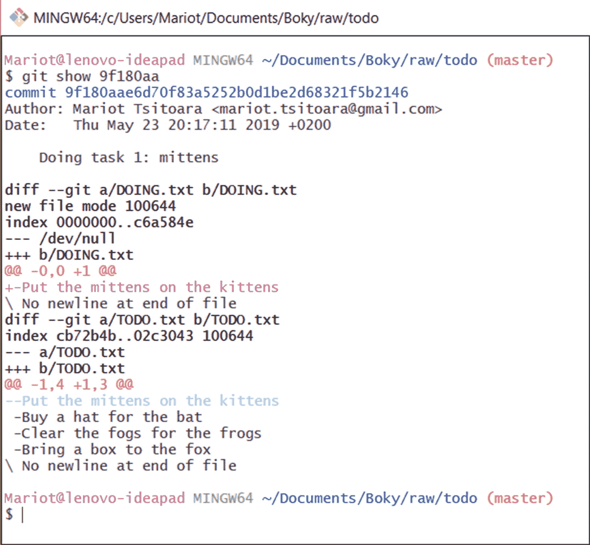

# 四、深入 Git

现在您已经熟悉了 Git 的基本命令，我们将深入研究它的其他特性。你将在本章中发现我在第 [1](01.html) 章中承诺给你的特性。

## 忽略文件

Git 不应该跟踪工作目录中的所有内容。有些文件(配置、密码、错误代码)通常不会被作者或开发人员跟踪。

那些文件(或目录)被列在一个名为“. gitignore”的简单文件中，注意“gitignore”之前的句点；这很重要。要忽略文件，请创建一个名为。gitignore 并在其中列出要忽略的文件或文件夹。

让我们回到上一章的知识库，待办事项列表。假设您想要包含一个名为 PRIVATE.txt 的私有的、未被跟踪的文件。使用您最喜欢的文本编辑器忽略文件，然后在其中写入 PRIVATE.txt，如图 [4-1](#Fig1) 所示。


图 4-1

的。git 忽略包含 PRIVATE.txt 的文件

如果您随后创建并修改 PRIVATE.txt 文件(如图 [4-2](#Fig2) 所示)，如果您检查状态，Git 不会考虑它。


图 4-2

添加 PRIVATE.txt

让我们试着检查一下状态。

```
$ git status

```

你会得到如图 [4-3](#Fig3) 所示的类似结果。


图 4-3

工作目录的状态

在图 [4-3](#Fig3) 所示的状态上可以看到，PRIVATE.txt 没有被跟踪。您还可以看到。gitignore 文件被跟踪；因此，您必须在修改后添加并提交它。

```
$ git add .gitignore
$ git commit

```

像往常一样，暂存一个文件，然后提交项目，将会产生一条确认消息，总结所做的更改(如图 [4-4](#Fig4) 所示)。


图 4-4

承诺。被增加

请记住。gitignore 全局文件应该放在你的库的根目录下。如果将它放在一个目录中，只有该目录中的匹配文件会被忽略。一般来说，有多个。gitignore 多个目录中的文件被认为是一个糟糕的举动，除非你的项目非常庞大。更喜欢把它们列成一个。gitignore 文件放在你的库的根目录下。

您可能会问自己在使用 Git 时应该忽略哪种文件。经验法则是忽略项目生成的所有文件。例如，如果您的项目是一个软件源代码，您应该忽略编译后的输出(可执行文件或翻译文件)。临时文件和日志，以及大型库(node_modules)也应该被排除在外。不要忘记排除所有的个人配置和文本编辑器的临时文件。

的。gitignore file 不仅忽略按名称列出的文件；您也可以忽略与描述匹配的目录和文件。您将在表 [4-1](#Tab1) 中找到您可以使用的所有模板的便捷提示。

表 4-1

。git 忽略行和它们的作用

<colgroup><col class="tcol1 align-left"> <col class="tcol2 align-left"> <col class="tcol3 align-left"></colgroup> 
| 

。吉塞尔线

 | 

什么被忽略了

 | 

例子

 |
| --- | --- | --- |
| 配置文件 | 任何目录中的 config.txt | 配置文件本地/配置. txt |
| 构建/ | 任何构建目录和其中的所有文件。但不是名为 build 的文件 | 构建/目标. bin构建/输出. exe不输出/构建 |
| 建设 | 任何构建目录、其中的所有文件以及任何名为 build 的文件 | 构建/目标. bin输出/构建 |
| * exe | 所有带有扩展名的文件。可执行程序的扩展名 | target.exe输出/res.exe |
| bin/* . exe | 所有带有扩展名的文件。bin/目录中的 exe 文件 | bin/output.exe |
| 临时议程* | 名称以 temp 开头的所有文件 | 临时雇员温度箱临时输出 |
| □配置 | 任何名为 configs 的目录 | config/prod . py本地/config/prep rod . py |
| □config/local . py | 任何名为 configs 的目录中任何名为 local.py 的文件 | config/local . pyserver/configs/local.py不是 configs/fr/local.py |
| output/∫∫/result . exe | 输出中任何目录下的任何名为 result.exe 的文件 | 输出/结果输出/最新/结果. exe输出/1991/12/16/result.exe |

这些是与. gitignore 一起使用的最常见的行。还有其他的行，但它们只在非常特殊的情况下使用，在普通项目中几乎从不使用。如果你使用的是计算机语言或框架，你可以去 [`https://github.com/github/gitignore`](https://github.com/github/gitignore) 获取模板。git 忽略您应该使用的文件。

但是如果您想忽略除了一个文件之外的所有匹配描述的文件呢？嗯，您可以告诉 Git 忽略所有文件，然后立即进行例外处理。要从忽略列表中排除某个文件，请使用“！."例如，如果您想忽略除 output.exe 之外的所有 exe 文件，您将编写您的。gitignore 如图 [4-5](#Fig5) 所示。


图 4-5

如何破例

注意各行的顺序。规则之后是例外！

不过，这个异常标记只对描述文件名的行有效。你不能用它来忽略目录。如图 [4-6](#Fig6) 所示的. gitignore 文件不起作用。


图 4-6

异常不适用于目录匹配忽略的文件

### 练习:忽略文件和目录

从上一个练习中取出您的存储库，并创建多个文件和目录。检查表 [4-1](#Tab1) 并尝试忽略您使用每一行创建的文件。根据需要创建尽可能多的文件，在理解每个模式之前不要停止。不需要记住所有的东西，但是你至少应该知道什么时候应该使用它们。

### 练习:这些行忽略了什么

检查图 [4-7](#Fig7) 。不看上一节，每行忽略了什么？


图 4-7

猜猜每行忽略了什么

你就是这样忽略文件的！这几乎和忽视你的责任一样简单！但是请记住。gitignore 文件被跟踪和版本化，所以不要忘记在提交之前暂存它！

## 检查日志和历史记录

如果您遵循了练习(正如您应该做的),或者开始在您自己的项目中使用 Git，那么您现在会遇到一个小问题，我曾保证使用 Git 可以很容易地解决这个问题:如何查阅历史日志。

这是 Git 最常用的特性之一，也是最简单的 Git 命令之一:git log

```
$ git log

```

试试看！打开您的存储库并运行命令。您应该会看到如图 [4-8](#Fig8) 所示的视图。


图 4-8

提交日志

提交日志将列出您或其他人提交的所有快照(从最新的到最早的)。对于每次提交，它还包括

*   名称(唯一的，通过哈希获得)

*   作者

*   日期

*   描述

由于提交名称太长，我们将只使用前五个字母作为名称。这对下一节很重要。

如果您的提交历史非常长，您可以使用键盘开始

*   向前或向后一行:上下键或 j 和 k 键

*   向前或向后一个窗口:f 和 b

*   在日志的末尾:G

*   在日志的开头:g

*   获取帮助:h

*   退出日志:问

git log 有许多参数可以使用；表 [4-2](#Tab2) 正在向您展示。

表 4-2

最常见的 git 日志参数

<colgroup><col class="tcol1 align-left"> <col class="tcol2 align-left"> <col class="tcol3 align-left"></colgroup> 
| 

命令

 | 

使用

 | 

例子

 |
| --- | --- | --- |
| `git log --reverse` | 颠倒提交的顺序 |   |
| `git log -n <number>` | 限制显示的提交数量 | `git log -n 10` |
| `git log --since=<date>``git log –after=<date>` | 仅显示特定日期后的提交 | `git log --since=2018/11/11` |
| `git log --until=<date>``git log --before=<date>` | 仅显示特定日期之前的提交 |   |
| `git log --author=<name>` | 显示来自特定作者的所有提交 | `git log --author=Mariot` |
| `git log --stat` | 显示变更统计 |   |
| `git log --graph` | 在简单的图形中显示提交 |   |

### 练习:显示历史记录

这个练习很简单。只需重新打开上次练习中的存储库，并检查历史日志:

*   以相反的顺序

*   从昨天开始

*   对于最后两次提交

## 查看以前的版本

既然您已经知道了如何检查历史和提交日志，那么是时候检查文件了，首先看看哪些文件发生了更改。

还记得每次提交时创建的那些长名字吗？我们将使用它们在提交或快照之间导航。要检查特定快照上的文件，只需知道它的名称。知道每个提交名称的最好方法是查看历史日志，如图 [4-9](#Fig9) 所示。


图 4-9

待办事项列表的历史记录

要显示和了解对项目做了哪些更改，只需使用“git show”命令，后跟提交的名称。你甚至不需要写全名，只需要前七个字母。

```
$ git show <name>

```

尝试使用您的存储库！您应该会得到如图 [4-10](#Fig10) 所示的结果。



图 4-10

git 显示的结果

如您所见，提交以非常详细的方式显示。您将看到所选提交和前一个提交之间的差异。增加的用绿色显示，删除的用红色显示。您可以使用“git show”命令显示任何提交的细节。

### 练习:检查您对项目所做的更改

列出您对项目所做的提交，并检查每个提交的更改。

## 查看当前的更改

检查以前的版本是很好的，但是如果您只想检查您刚才所做的更改呢？检查最后一次提交和当前工作目录之间的差异是 Git 的一个基本特性。你会经常用到它！检查差异的命令很简单:git diff。

```
$ git diff

```

修改目录中的一个或多个文件，然后执行命令。您将得到如图 [4-11](#Fig11) 所示的结果，这与上一节中 git show 命令的结果非常相似。它们实际上是相同的视图，因为显示的信息是相同的。


图 4-11

检查工作目录中的所有更改

大多数情况下，您只需要检查对单个文件的更改，而不是对整个项目的更改。您可以将文件名作为参数传递，以查看它与上次提交时的差异。

```
$ git diff TODO.txt

```

要记住的主要事情是 git diff 检查对工作目录中的文件所做的更改；它不检查暂存文件！要检查对暂存文件所做的更改，您必须使用参数“- staged”

```
$ git diff --staged

```

在提交项目之前，您应该总是检查暂存文件中的差异，这样您就可以做最后的检查。我知道有一天你会忘记这么做，所以去下一章学习如何撤销或修改你的提交。

本章到此结束，我们学到了很多东西。在进入下一章之前，请确保您熟悉这些功能:

*   忽略文件

*   检查历史日志

*   审查本地和阶段性变更

如果你是，并且你完成了练习，祝贺你！但是我们还没有完成提交！

## 摘要

这一章是关于项目历史的。我们学习了使用 git log 和 git show 检查日志，还学习了使用 git diff 检查当前的更改。Git log 和 git diff 在未来会特别有用，所以一定要好好理解它们。Git diff 是将当前修改的文件与上次提交的文件进行比较，而 git log 只是所有以前提交的列表。

忽略文件的能力。gitignore 也是一项很好的技能，这样您的 git 状态就不会被您不想提交的修改过的文件饱和。这也是确保特定文件(可能包含密钥)不会被意外提交的好方法。

在下一章，我们还有很多关于提交的内容要学。我们将首先回顾 Git 文件的三种状态，然后我们将看到如何将以前的版本带回工作目录。您至少将学习如何撤销和修改提交。抓紧了！