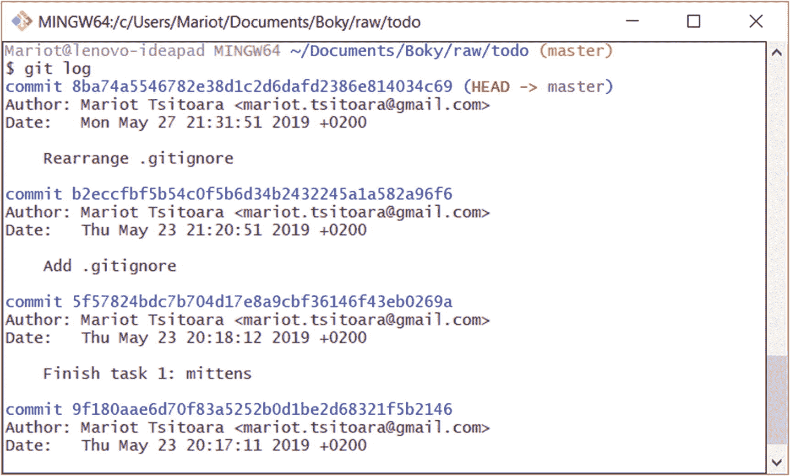
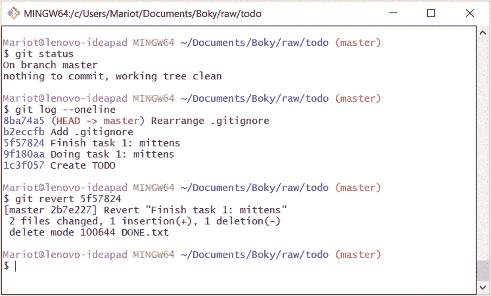
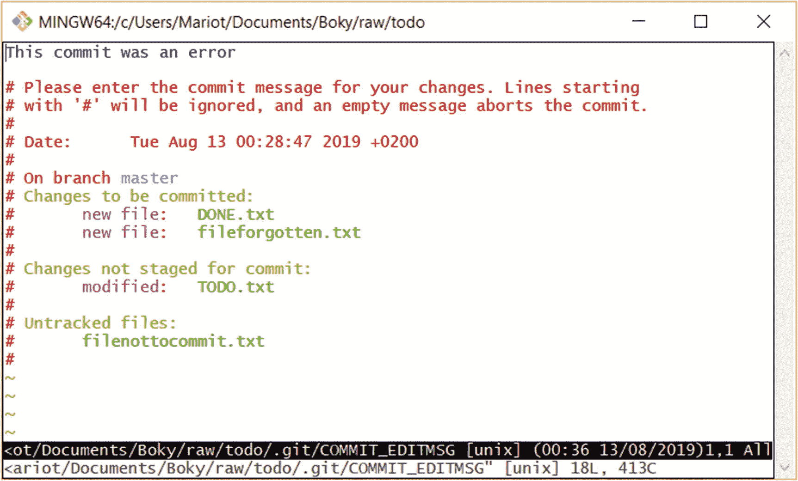

# 五、提交

前一章教了你一些关于 Git 的基本特性。您应该知道如何检查历史日志并查看对当前版本所做的更改。但是 Git 提交是一块难啃的骨头，所以我们将在本章中更多地讨论它们。首先，我们将(再次)探索 Git 的内部工作及其术语。然后，我们将学习如何查看和检查以前的版本。我们走吧！

## Git 的三种状态

在详细讨论提交之前，我们必须回到基础，重新了解 Git 是如何工作的。您肯定记得文件可以找到自己的三种状态。如果没有，就不要跳过这一章；这对于您使用 Git 所做的一切都是必不可少的。如果你记得，也不要跳过，因为我花了很多时间写的。

正如你在上一章看到的，Git 并不是跟踪所有的文件；一些文件被忽略(由。gitignore 文件)。还有一些文件没有被忽略，但是还没有被 Git 跟踪。它们是新创建的文件，从未包含在快照中(提交)。

被跟踪的文件可以有三种状态:

*   修改:您更改了文件。

*   已转移:您更改了文件并准备拍摄快照。

*   已提交:您拍摄了整个项目的快照，文件就在其中。

未跟踪的文件将保持原样，直到您决定暂存并提交它们或明确忽略它们。

记住:Git 不跟踪变化，它跟踪快照。每次提交时，整个项目的状态都会被保存，而不仅仅是所做的微小更改。

书呆子的事实:Git 很快，因为你总是在项目的最后状态工作。当您想要查看以前的提交时，它只是向您显示项目在那个特定时间的状态。许多 VCS 存储对一个文件所做的每一个更改，当您想回到以前的状态时，它们会反向重放这些更改。当项目变大时，这会导致许多问题，如速度和内存。Git 的思维方式不就是创建超级大数据库吗？不会，因为当你拍快照的时候，一个文件没有变化，它不会再被存储；而是使用对文件的引用。

让我们再回到这三个状态，看看它们之间的关系:

*   你在工作目录上工作。它只是您在初始化存储库之前创建的目录。这是你阅读和编辑文件的地方。

*   临时区域是您在拍摄整个项目的快照之前放置已更改文件的地方。如果不暂存已更改的文件，则不能拍摄快照。快照中将只考虑转移的文件(和未更改的文件)。未转移的文件(跟踪或未跟踪)和忽略的文件将保持相同的状态。

*   数据库或者。git 目录存储您拍摄的每个快照。这些快照称为提交。

记住:暂存只关注你选择的变更文件，而提交关注整个项目。你暂存一个文件；然后提交项目。

## 在版本间导航

很多时候，您不仅想知道项目中发生了什么变化，还想知道它处于什么状态，想看看您拍摄的快照。用 Git 很简单。

当您想要将项目的先前状态带到工作目录中时，我们必须使用“git checkout”来检查提交因为这会更改工作目录中的文件，所以您必须确保那里没有任何未转移的文件。未跟踪的文件很好，因为 Git 还没有跟踪它们的状态。

为了检查项目的快照，我们使用“git checkout”命令并将提交名称作为参数传递。

```
$ git checkout <name>

```

我们试试吧！在文本编辑器中打开当前项目，记下其内容。现在检查之前的提交，如图 [5-1](#Fig1) 所示。


图 5-1

签出旧的提交

### 警告

如果您的工作目录不干净，您就不能检查任何其他提交！请确保在切换快照之前提交您的更改。

检查以前的提交时，注意不要更改任何内容。就像电影里一样，改变过去是一个非常糟糕的主意！

如果您检查您的文本编辑器，您会注意到项目现在就像您拍摄快照时一样。这就是 Git 的最佳之处。您拍摄的快照不会丢失任何东西！

现在让我们学习一些 Git 术语。首先是“头”“头”只是对提交的引用。当谈到提交时，我们不说“名字”，而是说“头”

当在不同的提交之间切换时，我们需要一种方法来知道我们在哪个“头”上。当前头(被检出的那个)只是被称为“头”

就这样！head 是对提交的引用(一个存储库中可以有多个 head)，指向当前签出的提交的 HEAD 称为 HEAD。

### 练习:在你的历史中移动

使用“git checkout”从一个提交转移到另一个提交确保不要更改任何内容。

但是如何返回到正常的当前工作目录呢？因为我们没有对我们的存储库做任何大的改变，所以返回到工作目录只是检查我们拥有的唯一的分支。按照惯例，那个分支叫做“主”

```
$ git checkout master

```

试试看！记住时间旅行的两条黄金法则:

*   只有当现在是干净的时候(工作目录中没有未存储的内容)，才可以回到过去。

*   不要改变过去(直到你有了更多的经验)。

在版本之间导航后，不要忘记检查当前的分支(主)。

## 撤消提交

总有一天，你会暂存并提交文件，但随后又改变主意。每个人都会这样。但是使用传统的方法(没有版本控制)，回滚更改是非常困难的，特别是如果更改发生在很久以前。对于 Git，它只是一个命令:git revert。

为什么不直接删除提交？因为上一节的时间旅行规则:永远不要改变过去。为了历史，无论发生什么变化，都必须保持不变；改变过去发生的事情是非常危险和违反直觉的。相反，您将使用 git revert 创建一个新的提交，它包含与您试图撤消的提交完全相反的提交。

所以，撤销提交只是提交了它的反面。就这么简单！要使用它，您必须将要撤销的提交的名称作为参数传递。

```
$ git revert <commit name>

```

您可以恢复任何提交；只要确保在一个干净的工作目录下工作。因此，在恢复提交之前，不要忘记暂存和提交您的文件。我们试试吧！

首先，确保工作目录是干净的，如图 [5-2](#Fig2) 所示。


图 5-2

使用 git status 检查工作目录

太好了。既然我们知道工作目录是干净的，那么是时候检查历史以了解要撤销哪个提交了。我们应该会得到如图 [5-3](#Fig3) 所示的结果。



图 5-3

使用 git 日志检查提交历史记录

### 注意

如果您不喜欢提交历史的显示方式，可以传递“- oneline”参数来减少显示的信息。查看图 [5-4](#Fig4) 中的示例。


图 5-4

更漂亮的 git 日志输出

让我们恢复第三次提交！我们只是使用 git revert 后跟提交名。

```
$ git revert 5f57824

```

因为 git revert 只创建一个包含相反更改的新提交，所以过程的其余部分与任何新提交相同。如图 [5-5](#Fig5) 所示，您将被要求描述您的新提交。我建议总是保持默认的提交描述，因为它很容易识别。


图 5-5

新提交描述

保存提交描述后(像所有提交一样)，您将看到快照内容的摘要。图 [5-6](#Fig6) 显示了运行命令并保存提交描述后的结果。



图 5-6

回复的摘要

如您所见，使用 Git 撤销更改非常容易。需要记住的是 git revert 只会创建一个包含相反更改的新提交。这意味着您可以恢复一个恢复！恢复一个还原只会重新应用您的原始提交，并且两个“还原”会相互取消。但是，这些提交将保留在您的历史日志中，因为您无法改变过去。

### 注意

其实你可以改变过去。但是永远不要这样做。这是一个非常糟糕的主意，它只会给你带来更多的问题。

## 修改提交

正如我在上一章中所承诺的，你将在本章中学习如何修改提交。当您忘记存放文件或想要更改提交消息时，可以使用此选项。这不应该用来修改很多文件，因为这是违反直觉的。下一章将详细讨论何时何地使用这个。我再说一遍:永远不要试图改变过去。

要修改提交，您必须使用 git commit 命令，但是要使用“- amend”作为参数。它将像普通提交一样打开您的默认文本编辑器，但是已经有了暂存文件和提交消息。

```
$ git commit --amend

```

然后，像每次提交一样，保存并关闭文本编辑器。我使用的“修改”这个词有点误导，因为你不是在修改一个提交；您正在创建新的提交并替换当前的提交。所以，从现在开始，我会用“修正”这个词

修改提交会获取暂存区域中的所有内容，并使用它进行新的提交。因此，如果您想在提交中添加一个新文件或从中删除一个文件，您可以随意存放和取消存放它们。提醒:要卸载一个文件，你必须使用 git reset HEAD <file>。这里有一个小例子。</file>

让我们再次使用我们的 TODO 应用。编辑现有文件；然后创建两个名为 filenottocommit.txt 和 fileforgotten.txt 的新文件，如图 [5-7](#Fig7) 所示。


图 5-7

我们工作目录中的所有文件

您可以通过执行 git status 命令来检查项目的当前状态:

```
$ git status

```

根据您之前添加到项目中的文件数量，您可能会得到稍微不同的结果，但仍然类似于图 [5-8](#Fig8) 。


图 5-8

已修改和未跟踪的文件会突出显示

我们要做的下一件事是将文件转移到提交中。添加更改后的文件和 filenottocommit.txt。

```
$ git add TODO.txt DONE.txt filenottocommit.txt

```

从上一章你知道，在提交之前，你应该总是检查你用“git diff - staged”准备了什么。但是让我们假设你忘记检查并立即提交。

```
$ git commit

```

即使这样，您也会看到提交消息屏幕，该屏幕概述了要提交的更改，如图 [5-9](#Fig9) 所示。


图 5-9

提交消息屏幕是最后一个安全措施

正如您所看到的，将要提交的更改和未跟踪的文件被概括和突出显示。很难错过它们，但是让我们假装错过，写一个简单的提交消息，保存，然后关闭编辑器。您将获得如图 [5-10](#Fig10) 所示的常规摘要。


图 5-10

提交摘要。我们搞砸了

现在您已经阅读了提交摘要，您注意到您提交了错误的文件，并且忘记提交另一个文件。

首先，您应该使用 git reset 从项目中删除最后一次提交。我们将使用“- soft”选项，以便我们所做的编辑保留在工作目录中。HEAD~1 表示前一次提交是对当前提交的引用。

```
$ git reset --soft HEAD~1

```

此后，您可以通过 git reset 再次卸载该文件:

```
$ git reset HEAD filenottocommit.txt

```

通过检查项目的当前状态，检查命令是否按预期工作。

```
$ git status

```

您将得到如图 [5-11](#Fig11) 所示的结果。


图 5-11

重置后项目的状态

如您所见，filenottocommit.txt 现在未被跟踪，因为我们已将其从临时区域中移除。自然，fileforgotten.txt 也没有被跟踪，因为我们没有登台。只有 DONE.txt 保留在临时区域，因为我们在提交后还没有接触过它。

### 警告

使用重置命令时要小心。非常危险。确保仔细检查你写的东西。

然后上演正确的。

```
$ git add fileforgotten.txt

```

现在您已经准备了正确的文件，您可以提交项目了。

```
$ git commit

```

在提交消息中放一个语法错误，这样您就可以看到 Git 的另一个特性。

## 修改提交

对于像提交消息中的错误这样的简单错误，没有必要修改整个提交。你只需要修改它。让我们试试我们的项目吧！

```
$ git commit --amend

```

修改过程看起来就像普通的提交，但是提交消息已经被写入，如图 [5-12](#Fig12) 所示。



图 5-12

编辑提交消息

您可以随意更改提交消息，然后像往常一样保存并关闭编辑器。

就这么简单！看一下新提交的名称，并将其与旧名称进行比较。你会注意到它们是不同的。这是因为提交名称是快照中信息的散列。因此，项目的不同状态会产生不同的名称。

关于修改提交的临别提示:不要滥用它！是的，写代码的时候犯错误并不理想，很多时候我们都想马上改正。但是错误也帮助我们变得更好；记录我们的错误是一种很好的学习方式。

### 练习:干净地修改提交

回到你的待办项目。本练习的目标是彻底修改提交。

*   编辑一些文件并登台。

*   提交它们，并在提交消息中犯一个语法错误。

*   取消文件登台。

*   上演另一出。

*   用正确的消息修改提交。

## 摘要

这一章主要讲述了导航、撤销和修改项目的版本。你现在应该对你提交的小修改没有问题了。一定要重读本章的第一部分，因为它对你在 Git 中做的所有事情都是必不可少的。你要把 Git 三种状态的区别背下来。

下一章很小，因为我们将只讨论理论。您将学习如何编写一个好的提交消息，在提交中包括和忽略什么，以及初学者会犯的常见错误。请务必仔细阅读下一章，因为它将对你和你的团队有很大的帮助。走吧！