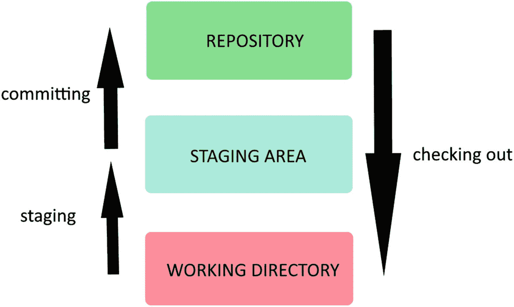

# 6.Git 最佳实践

前一章是这本书最重要的一章。每次你对提交有疑问的时候，一定要回来看看。阅读完之后，您应该能够毫无问题地制作、检查和修改项目快照。既然您已经了解了 Git 的基本特性，那么是时候学习最佳实践来使您(和您的队友)的生活更加轻松了。这些是我希望在第一次使用 Git 时就知道的东西。我们将讨论提交消息，Git 的注意事项，以及初学者最常犯的错误。然后我们将以 Git 如何工作的一个小提示来结束。

## 提交消息

提交消息是版本控制最重要的方面之一，也是最容易被忽视的方面之一。这些消息可以帮助您(和其他人)理解提交中做了哪些更改，最重要的是，为什么要做这些更改。干净易读的提交消息对于更好的 Git 体验至关重要。让我们从确定问题开始。

Git 面临的最常见的问题是，提交消息通常没有意义，没有传达任何有意义的信息。大多数时候，每次提交的信息越来越不清晰。这是因为对 Git 概念的误解:每次提交都必须袖手旁观自身；如果一个提交需要其他提交才有意义，它就不应该存在。你不应该承诺一个半途而废的项目。如果一个任务变得太大，把它分成几个逻辑块，每个部分都有自己的意义。在拆分任务时，知道您是否在错误的路径中的一个好方法是检查可能的提交消息:如果您考虑使用非常相似的提交消息，您可能在拆分任务时犯了错误。例如，如果您的任务是在一个大型网站中进行许多小的修改，那么将它分成更小的任务是有意义的，比如提交每个页面或提交每个页面类别。所以记住:你的提交必须是独立的、原子的和完整的。

许多初学者也有一个问题，就是在提交消息中传递了太多的信息，从而用不必要的细节堵塞了大多数屏幕。提交消息必须简明扼要。你不需要告诉所有改变了的事情，你只需要解释为什么要做这些改变。如果有人想查看发生了什么变化，他们可以使用 git show 命令，该命令显示提交中发生变化的文件的完整摘要。

请记住，您不是唯一会阅读您的代码或文本的人。你必须花一点时间来解释这些变化的背景以及为什么要这样做。对自己说“我会记住的”是谎言，永远不要去实践。对于每一次提交，你应该问自己:“如果另一个人看着我的项目，他们会仅仅通过看我的提交消息就理解项目中变更的时间线吗？”也要记住，另一个人可能就是几个月后的你；密码很容易忘记。

底线是你的 Git 消息应该告诉你为什么要做这些改变。如果有人想知道发生了什么变化，他们可以查看 Git diff。

### Git 提交最佳实践

为了获得更好的提交消息并避免前面列出的问题，这里有一些提示，您应该从现在开始遵循。这些建议会帮助你的同事，而且很有可能，在将来，你会清楚地知道为什么要犯错误。随着项目的进行，我们往往会忘记之前的步骤，所以在快节奏的开发中，拥有一个好的历史日志是必不可少的。

*   提交消息应该看起来很容易。

当您使用 git log 时，当消息太长时不会形成新行；因此用户必须滚动才能查看所有内容。这并不理想，因为您应该能够轻松地搜索和检索提交。

*   你写的信息不应该超过 50 个字符。

*   以大写字母开始信息。

*   不要以句号结尾。

*   利用现在的时间，扔掉不必要的文章。

*   提交消息应该一致。

因为 Git 消息在任何项目中都是基础，所以它们应该是一致的，并且不应该受到粗暴的改变。每次提交都应该使用相同的语言，并遵循其内部逻辑。在项目中期改变写作风格会使搜索提交变得非常困难。

*   这些信息必须清晰明了，并与上下文相关联。

当许多作者在不同的部分工作时，背景是大项目的关键。例如，许多开发人员通过变更所涉及的项目的上下文或区域开始他们的提交消息；但这只涉及非常大的项目。

不清楚或模糊的信息，如“更改 CSS”、“修复测试”、“热修复”、“小修复”和“更新”，应该不惜一切代价避免。它们经常误导用户，迫使用户去寻找不同之处。一定要包括为什么要做这些改变。永远不要强迫用户看你的代码变化来理解提交。

*   不要在细节上发疯。

您可以在主体中扩展您的提交消息，但是不要犯提供太多信息的错误。你唯一需要解释的是为什么要改变，而不是改变什么。

请记住:您的提交消息应该说明如果应用它，项目将会发生什么。所以你应该总是使用清晰的、现在时的、命令式的语言。最好的提交消息通常简短、直截了当、清晰明了。

没有比例子更好的方式来让它更清楚，所以让我们这样做。表格 [6-1](#Tab1) 是一个方便的工具，可以给你指出正确的方向。

表 6-1

最佳和最差提交消息的一些示例

<colgroup><col class="tcol1 align-left"> <col class="tcol2 align-left"> <col class="tcol3 align-left"></colgroup> 
| 

最好的

 | 

严重的

 | 

最差的

 |
| --- | --- | --- |
| [登录]修复数据库调用中的打字错误 | 修复了数据库调用中的打字错误 | 修复打字错误 |
| 重构登录函数以便重用 | 通过将声明移动到参数来更改登录函数 | 代码重构 |
| 为用户程序检查添加新的 API | 为用户程序检查添加新的 API | 新用户 API |

表 [6-1](#Tab1) 中给出的例子应该表明在编写提交消息时你是否处于良好的方向。

请注意，这些都是建议的行动，并不是一成不变的。如果真的有必要，你可以忽略其中的一些，如果这样能让信息更清晰的话。

## 做什么

让我们从列举使用 Git 时应该永远记住的良好实践开始。这对你的成功是必不可少的，因为它会为你节省一些时间。

要记住的最重要的事情是，提交是项目中独立的变更。您应该始终保持提交小且独立。提交的作用是(大部分时间)引入一个特性或修复一个 bug 它不是用来记录你所做的每一个改变。如果一个特性或错误修复需要大的独立步骤，那么将它们分成多次提交。例如，一个特性需要一个 API 端点和一个前端调用。没有必要在一次提交中完成所有这些更改，因为它们是独立的，没有任何逻辑联系。如果您在后端代码中犯了一个错误，您可以在不干扰前端代码的情况下恢复更改。通过多次提交来分隔它们还会使历史日志更易读，提交消息更清晰。

我们之前已经讨论过这个问题，但是因为它非常重要，所以让我们回头再讨论一下。每个提交消息必须回答“为什么？”为什么创建提交？它解决什么问题？请记住，在 Git 中，提交可以在许多用户之间交换。因此，提交消息必须回答这个问题:如果我选择并应用这个提交，它会做什么？这就是为什么提交时态应该是现在形式。很难摆脱用过去式写的需要，但是几个星期后，你应该会适应了。

就这样！使用 Git 要做的事情很少。只是要确保为你的小的、独立的提交写清楚信息。另一方面，不要做的事情列表如下。

## 不要做什么

这个列表比前一个列表长了一点。这是因为 Git 是一个非常强大的工具，它不会限制您可以做的事情。所以，犯错误是很容易的，尤其是当你认为这会节省你的时间的时候。不会的。糟糕的实践会给你带来更多的问题。最好是完全避免做那些事情。

大多数初学者容易犯的一个常见错误是一次提交解决多个问题。例如，当他们发现另一个 bug 时，他们正在修复一个 bug。他们解决了这两个问题，然后提交项目。这似乎很好，直到发现提交在代码库中引入了许多问题。因为只有一个提交，他们不知道是哪个更改导致了问题。这只是阻塞提交问题的一个方面。另一个原因是，它使得编写连贯清晰的提交消息变得困难。如果您发现自己在不同的上下文中提交了许多变更，那么可以考虑将这些提交分成更小的几个。

与前一个错误类似的另一个错误是合并没有任何共同点的提交。例如，代码重构不应该与错误修复或新特性在同一个提交中，而应该在它自己的提交中。这也是为了便于追踪 bug，并使历史日志更加清晰。

下一个错误来自对 Git 的根本性误用和一些公司的需求。就是把 Git 作为备份系统的错误。因为 Git 是一个分布式版本控制系统，所以存储库可以存储在远程服务器中。这促使一些开发人员在每天结束时提交他们的更改，不管这是否有意义。这也是因为需要显示您的日常进展，因为一些公司会查看生成的代码行数来衡量生产率。这是一种非常违反直觉的工作方式，因为它创建了许多试图解决同一问题的提交。它还会导致混乱的提交消息，随着时间的推移，这些消息越来越不清晰。不惜一切代价避免这种情况。你应该在工作准备好的时候提交，而不是因为你不得不提交。如果你需要提交，因为你的任务是做其他的事情，你将有机会借助分支或堆叠这样的概念来这样做。几章后你会学到这些。

Git 的另一个被滥用的特性是 amend 命令。避免修改提交来引入大的改变。修改应该只用于纠正错别字和添加忘记的文件或非常小的变化。如果变化太大，以至于您觉得有必要更新提交消息，只需再提交一次。但是这不是会把我的错误留在代码库中吗？是的，但是 Git 是用来跟踪版本和显示发生了什么变化的。你也需要记录你的错误，因为它们很容易忘记。不要为你的错误感到羞耻。试图抹去它们对任何人都没有帮助，当你再次面对同样的问题时，它会节省你很多时间。

这最后一个常见的错误已经在本书和无数电影中谈到过:永远不要试图改变历史。回到以前的版本并改变一些东西是非常诱人的。这是一个非常糟糕的想法，也是你能做的最危险的事情之一。如果你这样做，你的同事会讨厌你，你可能会把整个存储库搞得一团糟。改变某事的正确方法是重新承诺。过去的就过去了。放手吧。

### 注意

在本书的后面，你会学到如何回到过去，改变历史。我相信你永远不会这么做。

## Git 如何工作(再次)

我知道，我知道。我们已经讨论过这个了。但是在我们进入这本书的第二部分之前，我想确定你已经完全适应了。

还记得 Git 的三种状态吗？它们也被称为三棵树(事实上这是文献中的官方称谓)。让我们再复习一遍。图 [6-1](#Fig1) 将帮助您快速识别树木。

图 6-1

Git 的三种状态之间的关系

如图 [6-1](#Fig1) 所示，这里没有什么新东西，只是提醒一下。要跟踪项目中的变更，您需要拍摄整个项目的快照。Git 不跟踪变化；它跟踪版本。

您将只与工作目录交互，因为在那里您的文件可以自由编辑。没有什么特别要说的:这只是你的文件的当前状态。

当您准备好拍摄项目的快照时，临时区域是您放置文件的地方。任何尚未放入临时区域(或临时索引)的已更改文件都不会成为快照的一部分。但是，这些更改仍然可以在工作目录中使用。因此，有必要在将文件添加到暂存索引之前和之后检查工作目录的状态，以确保一切正常。

存储库是 Git 架构的数据库。你会发现你所有的提交和历史记录。你可以在“中找到它。git”文件夹(除非要调整配置，否则永远不要碰它)。提交操作会获取临时区域中的所有内容，并对其进行快照。这就是为什么我们说“提交项目”，而不是“提交文件”或“提交更改”过去提交的未更改文件已经在临时区域中。这就是为什么你不需要把所有东西都放在舞台上，只需要编辑好的文件。记住也要存放新的或删除的文件！

最后，签出会将项目的状态带回到之前的状态。工作目录将会改变以反映这些变化，所以确保没有任何未提交的文件。

所以使用 Git 的基本步骤是

*   (在工作目录中)进行更改

*   转移每个已更改的文件(在转移索引中)

*   提交项目(在存储库中)

就这么简单，但是在进入下一章之前，请务必理解这些状态之间的关系。本节之后的每一节都假设您对这些内容很熟悉。

但是提交在存储库中是什么样子的呢？很简单:它们看起来像链表。提交包含许多信息:内容和元数据。内容只是项目文件(更改的文件和对未更改文件的引用)。元数据包含其他非常重要的数据:提交日期、提交者身份和 Git 消息。提交中存在的另一个元数据是父指针或引用。它只是前一次提交的名称；如果为空，则意味着提交是第一个。因此，每个提交都以父子关系链接到下一个提交。

### 警告

由于提交的名称是通过散列其内容和元数据获得的，因此更改其中之一将导致名称的更改。如果名称更改，下一次提交将不会指向任何父对象，因为它的元数据中有父引用。这就是为什么改变历史是非常危险的。千万不要做。

## 摘要

这是一个充满概念和术语的章节。它不像其他的那么专业，但是它对你使用 Git 的成功至关重要。您现在应该知道什么时候是提交的正确时间，以及如何编写有用的提交消息。记住:你的目标是让跟踪项目变更变得更容易。提交消息应该足够清楚地回答这个问题:提交带来了什么？不要忘记历史日志也可能被非开发团队成员阅读。

要记住的主要事情是提交是你项目的基础，所以，每一个都必须是稳定和独立的。您的提交消息应该总是解释提交存在的原因，而不是做了什么。

这一章也有很多关于 Git 的注意事项。试着记住这些，因为它会节省你无数的调试时间。

这也是本书第一部分的结论。我们将要学习一个非常有用的工具:GitHub。我们至少可以分享和追踪我们的项目。您可能想知道我之前向您承诺的 Git 特性。不用担心；他们将在这部分之后来。我知道你很想开始，所以我们走吧！