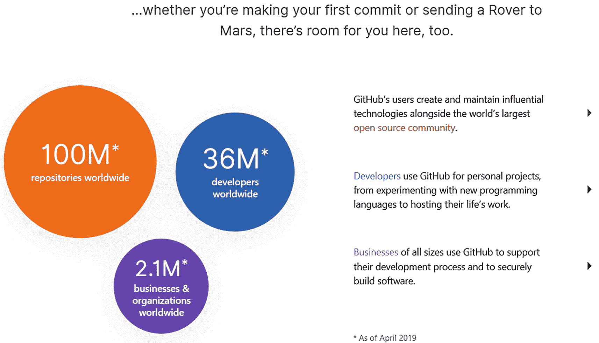

# 7\. 远程 Git

恭喜你完成了这本书的第一部分！现在，好戏开始了。第一部分向您介绍了 Git 的基本特性。您应该能够轻松地使用 Git 进行更改和跟踪。编写有意义的提交消息有点困难，但是如果你遵循上一章的建议，每次提交都会变得更好。您还应该能够查看以前的版本并查看历史日志；这些是所有后续章节需要的非常重要的特性。

现在，您已经准备好应对一个全新的挑战:离开您的本地存储库，使用远程存储库。在这一章中，你将学习为什么远程工作很重要，最重要的是，它是如何工作的。还将向您介绍典型的团队工作流程以及如何正确使用远程存储库。由于远程 Git 的概念有一点挑战性，您将看到一个简单的工具，它将在整个过程中对您有很大的帮助(提示:这是本书的名称)。我们上网吧！

## 为什么要远程工作

从本书开始，我们只在本地库上单独工作。但是 Git 是一个很好的团队合作工具；如果只在本地存储库上使用它，那就太可惜了。在这一节中，我们将看到什么是远程 Git，以及为什么有人想要使用它。

在本书的开头，我说过 Git 是一个分布式版本控制系统。这意味着存储库不是存储在单个服务器上，而是存储在许多本地存储库中。每个客户端都有自己的本地存储库，包含自己的提交和历史记录。这些提交可以自由交换，并且所有文件都可以随时编辑。这就是 Git 设法支持团队工作的方式。

因为团队工作是基于提交交换的，所以必须找到一种方法来确保所有的提交在任何时候都是可用的。在访问他们的提交之前，等待你的同事到达工作地点并启动他们的计算机是非常不方便的。显而易见的解决方案是让一个服务器托管存储库，每个人只需从它那里推和拉提交。但是这不是危险地接近 VCS 中心的工作流程吗？一点也不(嗯，有一点)。正如我们之前所讨论的，分布式 VCS 的创建是为了避免拥有中央存储库所带来的问题。每个客户都有自己的存储库，他们可以在任何需要的时候使用它；几乎所有的 Git 操作都是在本地完成的。远程服务器只是被指定为一个客户端，它有一个存储库，每个人都可以在那里提交他们的提交。这样，每个人都可以随时看到所有的更改。这种工作方式只是用来促进提交交换；它没有内置到 Git 中。对于 Git，所有的存储库都是平等的。开发人员只是认为一些存储库比其他的更平等。

### 注意

不需要中间服务器就可以共享提交。但这是一个如此糟糕的想法，我们甚至不会在这本书里教它。

即使您独自工作，除了本地存储库之外，拥有远程存储库仍然是一个好主意。这样，您就可以在一个安全的位置备份项目及其所有历史记录。您还可以随时访问您的项目，前提是您可以通过网络访问存储库所在的服务器。

### 警告

正如我们在上一章中所说的，仅仅因为 Git 可以用作备份系统并不能使它成为备份系统。将它用于这一唯一目的并不是一个好主意。

那么，你对那个远程存储库感兴趣吗？你当然是，太神奇了！让我们看看它是如何工作的。

## 它是如何工作的

使用远程服务器只是让一台计算机保存您的项目及其历史的副本。你不需要把你所有的提交都推给它，你只需要把你想分享的提交推给它。然后，您的同事提取他们感兴趣的提交，并将它们应用到他们自己的存储库中。基本上就是这样了！您使用远程服务器来复制存储库并推送和提取更改。让我们详细看看这一切是如何工作的。

要建立一个远程存储库，您首先需要一个能够运行 Git 软件的服务器。任何称职的计算机都可以运行 Git，因为它是一个非常小的软件。你也不需要很大的火力来正常运行它。即使像 Raspberry Pi 这样非常小的计算机对 Git 来说也绰绰有余。

现在您已经有了服务器，您必须找到一种与它通信的方法。对服务器的网络访问是必要的，以便多个客户机可以在同一个存储库之间进行推和拉。与服务器的通信应该非常安全。如果能够访问服务器的任何人都可以阅读和编辑存储库，那将是非常令人失望的。为了能够与存储库交互，用户必须在每次 Git 操作中验证自己。可以使用登录/密码 HTTPS 类型的认证，但是因为认证必须在每个操作之前，所以它会很快变得很累。对此的解决方案是使用 SSH 认证。SSH 验证的原理很简单:只有预先确定的客户机才能访问存储库。

基本上就是这样了！设置远程 Git 服务器是一项非常简单的任务。另一方面，维护和保护它…

### 注意

就像之前一样，Git 没有区分“服务器”和“客户端”它们只是开发者强加的社会结构。

如果您独自工作或者希望保持项目的私密性，那么使用您自己的服务器来托管您的 Git 项目是一个好主意。然而，当你和一个团队一起工作时，这就成了一种痛苦。每个团队成员必须能够通过网络访问 Git 服务器，所以如果您的团队在同一个工作空间，您需要建立一个本地网络。服务器还应该全天候运行，这样 Git 操作就不会有延迟。

如果你的一些同事在异地或不同的工作场所，会发生什么？嗯，你需要把你的服务器连上互联网。因此，你也需要提高你的安全游戏。您的同事越多，您需要管理的身份验证异常就越多。

使用你自己的 Git 服务器的另一个问题是你需要处理权限。正如在第 [1](01.html) 章中所看到的，并不是所有的开发人员都应该拥有对存储库的写权限。例如，初级成员在提交到存储库之前，需要由高级成员审查他们的提交。给他们直接访问项目是一个坏主意(因为他们贪得无厌地需要改变历史)。

这些都是维护自己的 Git 服务器所带来的问题。如果有一种工具可以帮我们处理这些事情就好了…

## 简单的方法

你猜怎么着？有一个工具可以帮我们处理所有这些事情！它的名字叫 GitHub！GitHub 是处理远程存储库时的首选工具；您可以将 GitHub 视为使用 Git 的项目的代码托管服务器。它就像你自己的 Git 服务器一样工作，但是没有那么麻烦。

它创建于 2008 年，用于托管 Git 项目，现在是微软的子公司，微软一直在开源社区投入大量资金。图 7-1 显示了他们在 github.com 的主页。

图 7-1

GitHub 主页

现在来说说数字。GitHub 拥有超过 3600 万用户构建的超过 1 亿个存储库。如图 [7-2](#Fig2) 所示，他们对这些数字感到非常自豪。

图 7-2

GitHub 的用户

GitHub 几乎涵盖了开发人员的所有需求，无论是希望共享软件的开源开发人员，还是希望不用自己的服务器就能私下工作的专业团队。

几乎像一个社交媒体，GitHub 也为开发者提供了一个空间来构建、分享和记录他们的项目。不再需要外部工具或网站。对于开源项目来说，GitHub 也是一个非常重要的工具，因为它旨在促进开发者关系和代码发布。用户可以查看彼此项目并提出更改建议。您甚至可以关注和贡献您最喜爱的存储库！

而且不限于开源项目！公司和开发者也可以创建私有存储库，只有他们可以访问。他们受益于 Git 的常用特性，但还不止这些。这就是 GitHub 如此受欢迎的原因:每个人都有适合自己的东西！

也有很多软件公司提供与 GitHub 非常相似的服务，最受欢迎的是 GitLab 和 BitBucket。

GitLab 的大部分功能与 GitHub 非常相似，有两个版本:社区版和企业版。GitLab Community Edition 是开源的，与 GitHub 非常相似，你可以毫无问题地阅读这本书的全部内容。GitLab 在 DevOps 圈子里也是很受推崇的，所以如果你对那个职业道路感兴趣，一定要去看看。

BitBucket 最初是为了托管 Mercurial 项目而创建的，自 2011 年以来，它增加了对 Git 项目的支持。由 Atlassian 开发，其业务模型与 Git 非常相似，并且提供相同的企业利益。

使用本地服务器有利也有弊；但是缺点的数量是如此之多，以至于我们将在本书中选择简单的方法。然而，您至少应该知道远程存储库是如何工作的，以及为什么需要它。如果你仍然想使用你自己的服务器，在这本书的一个附件里有一个关于如何做的指南。玩得开心，☺

## 摘要

本章只是远程存储库的一个非常简单的介绍。在本地工作很有趣，但团队合作需要分享你精心制作的承诺。您可以在自己选择的远程服务器上托管您的 Git 存储库，但是最简单的方法是使用 GitHub 这样的专门托管代码的服务。

但是 GitHub 做的远不止这些！在下一章，我们将详细讨论它的主要特性是什么，以及我们如何利用它们。我们将学习错误跟踪、访问控制、特性请求等等。让我们继续前进！