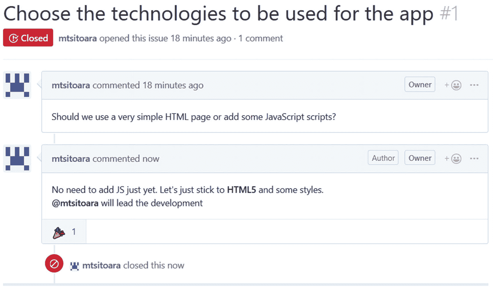

# 十、开始项目管理：问题

上一章，我们快速浏览了使用 GitHub 托管和共享我们的代码。但这还不足以描述 GitHub 能为您做什么；有很多特性可以帮助你的项目成熟。在这一章中，我们将开始学习如何用 GitHub 管理项目。因此，我们将从 GitHub 项目管理的基本形式开始:问题。

## 问题概述

要成功地管理一个项目，任何项目，你都要提前计划；仅仅对新的输入做出反应，通常做任何你想做的事情都是灾难的完美配方。GitHub 项目也不例外；你必须在考虑行动之前记录下你的行动。这就是为什么 GitHub 有一个很棒的功能叫做 Issues。我们将在本节中讨论它们，并学习如何正确管理它们。

在本书的所有章节中，你既是开发者又是项目经理；但是在一个大项目中，你可能不在计划阶段。但是现在，你暂时被提升为项目经理和首席开发人员(除了是唯一的开发人员)，恭喜你！项目经理的职责之一是提前计划所有需要完成的任务。计划还不需要非常精确(在现实世界中从来都不是)，但是有一个需要完成的所有任务的列表是必要的。这些任务可以是新特性、错误修复，或者只是团队讨论。在 GitHub 中，这些任务被称为问题。

问题用于跟踪团队成员提出的新功能开发、错误修复或新想法。他们是 GitHub 项目管理的基石；从理论上讲，不应该对附加的问题执行任何操作。你采取的每一个行动的目标都应该是解决一个问题。

通过无聊的团队会议来计划下一步的日子已经一去不复返了；现在你确切地知道你的下一步是什么，最重要的是知道其他人在做什么。向你的同事提出新想法比以往任何时候都容易；只需打开一个问题与您的团队讨论，无需使用电子邮件客户端的其他应用。使用 issues 的最大好处是历史可以永久保存——每个特性、每个 bug 和每个讨论。

## 制造问题

了解问题的最佳方式是直接与它们互动；所以，让我们回到我们的 GitHub 项目页面来处理它们。

当你打开你的 GitHub 项目页面时，你直接到达项目的“代码”部分。这是显示项目文件的部分。现在，你的项目页面应该看起来像我的，如图 [10-1](#Fig1) 所示。


图 10-1

项目页面在“代码”部分打开

就在项目名称下面，有许多选项卡显示项目的所有部分。你将主要处理“代码”、“问题”、“拉取请求”和“项目”但是现在，让我们把重点放在问题上。继续点击它开始。你应该到达一个如图 [10-2](#Fig2) 所示的空白部分，因为你的项目还没有问题。


图 10-2

问题部分

那里有许多关于制造新问题的行动呼吁。点击其中一个，你会看到一个类似于我的表单，如图 [10-3](#Fig3) 所示。


图 10-3

新问题表单

形式非常简单；只有标题是强制性的。如果你需要更多的空间来解释，在标题下面还有一个评论部分。让我们继续用基本的东西填充我们的第一期；暂时不要改变右边的值。

对于我们的第一期，我们开始讨论我们的产品将使用的技术。问题不仅仅是特性和 bug 跟踪所需要的；它们也被用来开始讨论和分享想法。继续填写你的第一期，就像我的一样，如图[10-4](#Fig4)；我把我的标题定为“选择应用要使用的技术”，因为这是任何项目的第一步。


图 10-4

我们的第一期

既然我们已经填写了问题的基本信息，请提交它。然后，您将被重定向到新问题的详细视图。它应该类似于图 [10-5](#Fig5) 中显示的我的问题。


图 10-5

问题的详细信息

首先要注意的是，您的问题已经有了一个编号。每期都有一个唯一的编号，这些编号不会被回收，这意味着即使您删除了一期，它的编号也不会被重复使用。这个数字很重要，您将在本节中看到。

详细信息页面还包括一个评论部分，团队成员可以在这里讨论这个想法。它甚至包括数量有限的表情符号，你可以用它来代替评论。例如，如果你同意某人的观点，向他们竖起大拇指比评论或写“我也是”更好！这会阻碍交流，拖延对话。

在页面的右下方，您可以看到一个订阅按钮。如果您选择订阅某个问题，您将收到有关该问题所做更改的通知。您还会收到关于里程碑事件的新评论和新闻。

既然你是团队的唯一成员，就不多做讨论了。只需添加评论或反应图片，然后关闭问题。关闭问题不会删除它；它只会将其标记为已完成。不建议删除问题，因为需要保留项目的历史记录，而问题是跟踪变更的最佳方式。记住:如果你的知识库是公开的，任何人都可以阅读你的评论；所以，请善待和倒带任何可能出现的不愉快。

评论并关闭问题后，您将返回到问题详细信息页面，它看起来与我的类似，如图 [10-6](#Fig6) 所示。



图 10-6

结案的问题

您可以继续对已结束的问题发表评论，但不鼓励这样做，因为每个人都认为问题已经解决并继续前进。一个问题也可以被锁定，没有人可以再对它发表评论；这被认为是维持和平的最后努力。我们都有自己的观点，在互联网上讨论这些观点从来都不容易，尤其是在一个开放的论坛上。但是任何时候都要保持专业，因为你说的每一句话都可能被任何人看到。

## 与问题互动

我们已经成功创建并关闭了一个问题，但是我们并没有过多地参与其中。如果一个问题对项目没有任何影响，那么它有什么好处呢？在这一节中，我们将直接与 GitHub 和我们的代码中的问题进行交互。

在这一部分的第一部分，你将保持你的项目经理的帽子，因为我们将需要计划我们的项目。到目前为止，我们的待办事项应用只是一个挨着一个的多个文本文件。然后我们决定用 HTML5 来更好的呈现它们。为了编码，我们需要一个行动计划；作为一个项目经理，你的工作就是美化这个计划。

因为这是一个简单的 HTML5 应用，我们不需要一个非常大的计划，只需要一些必要的要点。因此，要创建这个应用，我们需要

*   用 HTML5 写出 app 的骨架

*   用 CSS3 添加一些样式使它更漂亮

*   在 README.md 中描述应用

*   记录代码

*   为应用创建网页

这些是我们需要完成的一些基本步骤:发布一个 to do 应用。

既然您已经知道如何创建问题，我将让您为每个要点创建一个问题。完成后，你的问题页面应该看起来像我的，如图 [10-7](#Fig7) 所示。


图 10-7

所有未完成的任务

正如您所看到的，任务是按照它们被介绍的顺序显示的。除了它们的编号之外，也没有办法区分它们，如果问题太多，就很容易迷路。因此，为了更清楚地了解我们所有的任务，我们将使用标签。

### 标签

标签正是你所期望的:帮助你快速过滤问题的文本。让我们直接使用它们，这样您可以熟悉这个概念。

如图 [10-7](#Fig7) 所示，在问题页面中有一个搜索栏，您可以使用它来过滤问题。但是由于我们还没有任何标签，所以无法进行任何过滤；只是基本的搜索。点按搜索栏旁边的标签按钮以显示所有可用的标签。然后，您将看到可以使用的默认标签列表；查看图 [10-8](#Fig8) 中的示例。


图 10-8

默认标签列表

这些是开发者社区中最常用的标签。但这并不意味着它们是强制性的或不可改变的；你可以根据自己的喜好和需要改变它们。只有当你在做一个开源项目时，改变它们才是不明智的，因为大多数开发者已经习惯了它们。

但是因为这是你的个人项目，而你是项目经理，你可以添加、编辑或删除任何你想要的标签。例如，如果你在私人场合独自工作，那么“招聘”这个标签就没有用了。您还可以使用标签来标记问题的严重性；如果问题很严重，许多项目会使用“紧急”或“中断”这样的标签。如果项目足够大，标签也可以用来区分问题的来源。一个大项目可以使用标签“前端”、“后端”或“数据库”来将问题分成不同的组。

对标签进行更改后(尽管我建议只添加您需要的新标签，保留默认标签)，回到您的问题并打开详细信息页面。然后，通过单击“标签”按钮在每个标签上应用一个或多个标签。例如，您可以查看图 [10-9](#Fig9) 。


图 10-9

向问题添加标签

添加标签后，通知将出现在问题页面的评论部分。您可以查看图 [10-10](#Fig10) 中的示例。


图 10-10

关于新添加标签的通知

现在，仔细检查你的每一个问题，并在上面贴上一些标签。然后，完成后，返回到问题页面。看起来应该是我的，如图 [10-11](#Fig11) 所示。


图 10-11

标记的问题

完美！既然我们给问题贴上了标签，我们就可以过滤它们了。例如，要查看每个标有“增强”的问题，只需点击过滤器(如图 [10-12](#Fig12) 所示)，您将得到如图 [10-13](#Fig13) 所示类似于我的结果。


图 10-13

过滤的问题


图 10-12

按标签过滤

过滤不是很好玩吗？！但你知道什么更有趣吗？将问题分配给其他人！开始吧。

### 代理人

既然我们的问题已经被正确标记，是时候将它们分配给开发人员了。这是一项相当简单的任务，与标签没有太大区别。

您最多可以将一个问题分配给十名小组成员。但既然现在只有你一个人，你只能指派自己。开始吧！导航到标题为“用 HTML5 编写应用的框架”和“用 CSS3 添加一些样式使其更漂亮”的问题，并将它们分配给自己。将问题分配给团队成员的工作方式与添加标签完全一样。您可以查看图 [10-14](#Fig14) 中的示例。


图 10-14

分配问题

在您将这两个问题分配给自己后，您将会得到一个与我类似的结果，如您的问题页面上的图 [10-15](#Fig15) 所示。现在，您可以按标签和受托人过滤您的问题。


图 10-15

完整的问题列表

现在问题已经分配给你了，摘下经理的帽子，戴上开发人员的帽子。是时候把手弄脏了！

## 将问题与提交联系起来

正如我们在本章开始时所说的，你用 Git 采取的每一个行动都应该以解决问题为目标。大多数时候，在使用 Git 的时候，你会和 commits 一起工作；因此，这些提交中的每一个都应该与一个问题相关联。在本节中，我们将学习如何将我们的提交与问题联系起来。

首先，让我们决定我们将处理哪些问题。正如我们在图 [10-15](#Fig15) 中看到的，有两个问题分配给我们:“用 HTML5 编写应用的框架”和“用 CSS3 添加一些样式使它更漂亮。”我们将首先开始写框架，因为从这开始很有意义。所以打开这一期的详细页面，记下它的编号。如图 [10-16](#Fig16) 所示，我的是第 2 期。


图 10-16

问题编号 2 详细信息页面

### 处理提交

现在我们有了一个要解决的问题及其编号，是时候准备提交了。因为我们决定为这个应用使用简单的 HTML5，所以我们只需要一个文件作为框架。因此，在您的工作目录中创建一个名为 index.html 的文件，并粘贴以下代码:

```
<!doctype html>
<html>
    <head>
        <meta charset="utf-8">
        <title>TODO list</title>
    </head>
    <body>
        <h1>TODO list</h1>

        <h3>Todo</h3>
        <ul>
            <li>Buy a hat for the bat</li>
            <li>Clear the fogs for the frogs</li>
            <li>Bring a box to the fox</li>
        </ul>

        <h3>Done</h3>
        <ul>
            <li>Put the mittens on the kittens</li>
        </ul>
    </body>
</html>

```

现在，我将让您暂存新创建的文件，但不要提交它；我们必须讨论提交消息。

### 引用问题

我们准备在当前状态下提交项目，但是我们必须调整提交消息，以便提交可以链接到一个问题。将提交与问题相关联的最常见方式是在提交消息中提及问题编号。

到目前为止，我们只使用了非常短的提交消息，因为我们试图将它们保持在一行之内。但是因为我们需要空间来用一种更精细的方式来描述我们的提交，所以从现在开始，我们将按照这种方式来构造我们的提交消息:标题、主体和页脚用一个空行隔开。为了帮助您理解，您可以在图 [10-17](#Fig17) 中找到它的图示。


图 10-17

提交消息结构

### 警告

不要忘记提交消息的每个部分之间的空行。它们真的很重要。

正文和页脚是可选的；只有在必要的时候才使用它们，尤其是身体。人很懒；他们可能只会阅读标题并继续前进，所以即使没有正文也要特别清楚。

页脚是我们现在感兴趣的；这是为 GitHub 等问题跟踪者保留的部分。我们使用页脚引用问题的数字。例如，要引用我们正在处理的问题，我们只需将其编号放在页脚中，前面加“#”当 GitHub 看到这一点时，它会立即将提交与引用的问题联系起来。

### 注意

我们可以将对问题的引用放在提交消息中的任何地方，甚至放在标题中。但这种做法很难看，应该劝阻。

综合所有这些，让我们用一个合适的提交消息进行提交。以我的提交为例，如图 [10-18](#Fig18) 所示。


图 10-18

提交链接到问题#2 的消息

在我的提交消息中，我跳过了正文部分，因为它是不必要的。我只需要将这个提交链接到问题#2，所以我将这个数字放在页脚中。

现在，推它！如果你忘了怎么做，看一下上一章(提示:git push origin master)。

现在让我们回到本期的详细页面。您将注意到的第一件事是添加了一个新的注释:这是对我们的提交的引用。它应该看起来像图 [10-19](#Fig19) 中描绘的我的。


图 10-19

对我们上次提交的引用

这是 GitHub 的一个非常有用的特性，您肯定会经常用到:显示所有与特定问题相关的提交。这就是为什么不应该在没有绑定到某个问题的情况下进行提交；这样对项目的管理更好。

如果点击参考上显示的提交标题(见图 [10-19](#Fig19) ，您将看到一个熟悉的屏幕。我会让你自己发现图 [10-20](#Fig20) 中描绘的是哪个屏幕。


图 10-20

提交的详细视图

没错！这是“git show”视图。没有必要迷失在 Git 命令中去查看 commit 做了什么，你可以直接在 GitHub 中看到它！

既然我们已经成功解决了该问题，请返回其详细信息页面并关闭它。让我们解决下一个问题！

### 使用关键字结束问题

解决一个问题并结束它感觉很好，对吧？嗯，还有更有趣的事情:通过在提交消息中使用关键字来结束一个问题！

首先，我们必须决定要解决哪个问题。我们的下一期是“用 CSS3 添加一些样式使它更漂亮”，它的数字是 3。大家一起解决吧！打开 index.html，将内容更改为:

```
<!doctype html>
<html>
    <head>
        <meta charset="utf-8">
        <title>TODO list</title>
        <style>
            h1 {
                text-align:center;
            }
            h3 {
                text-transform: uppercase;
            }
            li {
                overflow: hidden;
                padding: 20px 0;
                border-bottom: 1px solid #eee;
            }
        </style>
    </head>
    <body>
        <h1>TODO list</h1>

        <h3>Todo</h3>
        <ul>
            <li>Buy a hat for the bat</li>
            <li>Clear the fogs for the frogs</li>
            <li>Bring a box to the fox</li>
        </ul>

        <h3>Done</h3>
        <ul>
            <li>Put the mittens on the kittens</li>
        </ul>
    </body>
</html>

```

暂存文件，但不要提交。关闭问题的关键词是

*   关闭

*   关

*   关闭的

*   固定

*   修理

*   固定的；不变的

*   分解

*   分解

*   断然的

使用这些单词中的一个后跟一个问题编号，会将其标记为已解决并关闭它。我们的提交将解决问题#3，因此我们将把它放在提交消息页脚中。你的提交消息应该看起来像我的，如图 [10-21](#Fig21) 所示。


图 10-21

通过提交消息解决问题

就像提交消息一样，问题引用应该使用命令式语气；所以最好用“resolve”而不是“resolved”现在，是时候推动我们的承诺并亲眼看看了！

导航到您处理的问题(您不会在打开的问题中找到它，请使用过滤器查看关闭的问题)并打开详细信息页面。你应该会看到一个和我一样的新评论，如图 [10-22](#Fig22) 所示。


图 10-22

按关键字关闭的问题

如果您单击提交名称，您将再次看到提交的“git show”视图。

GitHub 的这个小特性很有用，但是使用时要非常小心。仅当您完全确定问题已经解决时，才关闭该问题。关闭和重新打开问题会让人们感到困惑，并生成大量通知。不要错误地关闭不同的问题！83%的工作场所暴力是由于问题解决失误造成的。我刚刚发明了这个统计数据，但这并不意味着你应该认真对待它！

## 摘要

哦！那一章有点长，不是吗？我们学到了很多关于问题的知识，但最重要的是，如何将它们与提交联系起来。永远记住，在采取行动之前，要把所有的行动都放到问题中去。别忘了用标签和受托人对它们进行分类。

我们关于基本项目管理的章节到此结束。现在你应该知道如何在 GitHub 中计划你的下一步行动了。但是项目管理不仅仅是预先计划任务；你还应该对过去发生了什么以及达到了哪些里程碑有一个清晰的认识。因此，我们将对项目进行“适当的”项目管理；本节还包括 GitHub 工作流的大部分形式的非常简短的总结。走吧！