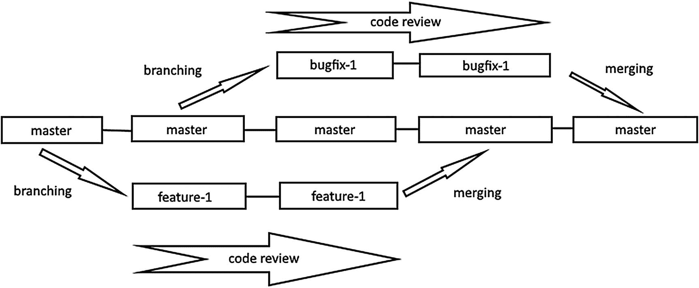

# 11.深入项目管理:分支

上一章，我们发现了问题并利用它们来计划我们的项目。我们还学习了如何将我们的提交与问题联系起来，这样我们就可以跟踪项目中的每个变更。我们的工作方式很简单:选择一个问题，做出可以解决它的承诺，然后推给 GitHub。该问题随后得到解决并关闭。但这种工作方式在大多数现实项目中并不太适应；搞砸的可能性太大了。

如果您需要多个提交来解决一个问题，该怎么办？如果其他团队成员提交了一个包含对您正在处理的相同文件的更改的提交，该怎么办？如何确保推送的提交真正解决了问题？所有这些都是不建议对项目进行直接变更的部分原因，即使你独自工作。

正如我们在上一章中所说的，通过提交消息中的关键字来结束一个问题是很酷的，但是你应该非常小心。只有你看过你的作品，它可能无法解决问题。或者它可能在项目中引入新的 bug。这就是为什么在接受修改之前，最好让别人来检查你的代码。

这就是我们在本章将要讨论的部分。首先，将向您介绍最常见的 GitHub 工作流(大多数团队如何在 GitHub 上工作)，然后我们将了解分支的概念。

但在我们开始这一章之前，有一件小事你应该永远记住:“你会犯错误。很多时候。所以你必须确保使用尽可能多的安全措施。”走吧！

## GitHub 工作流程

在本节中，我们将讨论开发人员使用 GitHub 的最常见方式。请记住，每个团队都有自己的做事方式，但是每种工作方式都受到我们将要介绍的基本工作流程的启发。

还记得关于犯错的小事实吗？这种错误无处不在的可能性就是你需要遵循 GitHub 工作流程的原因，所以即使错误发生了，你也要以可控的方式隔离它的影响。我们从上一章开始的工作方式是将一切直接提交给主项目，这是非常危险的。主项目大部分时间是“生产”线，客户看到和使用的版本。所以，这个版本必须非常干净，应该总是可利用的。如果任何错误出现在主版本中，客户将会遇到错误，并且会扰乱每个团队成员。

解决这个问题的一个方法是创建一个主项目的副本，并处理这个克隆。您对此副本所做的每个更改都不会影响主项目，因此您的任何错误都不会影响客户。当您(和其他人)完全确定所做的更改解决了问题时，您可以在主版本中重现这些更改。

主项目的那些副本被称为分支，将变更复制到另一个分支的概念被称为合并。您可以创建任意多的分支，并且可以在它们之间交换提交。当您第一次创建存储库时，Git 会为您创建一个新的分支；它叫“主人”大多数开发人员将他们的主版本或生产版本放在 master 中，只有当他们完全确定可以这样做时，才在那里重新创建更改。

就像树的分支一样，Git 分支可以有许多分支，这意味着您甚至可以从主分支之外的分支创建新的分支，即使很难维护这样的架构。大多数情况下，您会在处理问题时创建一个分支，并在问题解决后删除它。

为了正确看待这一切，我们将学习默认的或常见的 GitHub 工作流。如你所知，一切都应该从一个问题开始。我们已经讨论了最后一章，所以你已经很熟悉了。因此，我们将讨论工作流程的每个后续步骤。

当您打算通过更改代码来解决问题时，您应该首先创建项目的当前工作版本的副本:创建一个新的分支。

然后，像往常一样，您进行更改并提交项目的状态。您可以根据需要进行任意数量的提交；不会影响主枝。你也可以将你的提交推送到 GitHub，这样你的代码就可以被看到了。

然后，您将您的分支链接到主分支，这样其他人就可以比较更改并审查您的代码。这个链接称为“拉”请求:您请求将您的提交应用到主分支。

然后，其他团队成员可以在 GitHub 上审查您的代码并发表评论。然后，您会提交更多的提交来处理这些注释，直到所有问题都解决了。

如果每一方(开发人员、管理人员、测试人员或客户)都同意您的更改是可以的，并且解决了手边的问题，那么拉请求就被接受了。这意味着您在分支上进行的每个提交都将应用到主分支。然后，您可以删除您创建的分支。

就是这样！你可能想知道它与直接推入 master 有何不同。这是非常不同的，因为错误和遗漏是在将更改应用到生产版本之前发现的；这意味着生产缺陷的数量减少到了最低限度。这也使得你的团队中的不同成员能够在应用变更之前对其进行审核，这是大多数科技公司的标准工作方式。将变更捆绑到一个拉请求中也解决了多人同时提交解决不同问题的问题。它可以保持历史日志的整洁。

只有当您觉得您的工作已经完成时，您才可能想要打开“拉”请求。除非你做的工作很小很简单，否则不要等太久才打开一个 PR。通过在开发的早期进行公关，你可以在做出太多改变之前收到反馈。这对初学者来说非常有用，尤其是因为从一开始就走上错误的道路将需要很长时间来纠正，而且你会希望早点被告知正确的道路。打开一个拉请求并不意味着工作已经完成；这仅仅意味着您正在考虑将提交从一个分支应用到另一个分支。

### 注意

如前所述，您可以从任何分支创建分支，并打开对它的拉请求。不仅仅是留给主人的。

总结所有这些步骤，你可以在图 [11-1](#Fig1) 中找到一个小插图。



图 11-1

基本 Git 工作流程

如您所见，我们可以从项目中的任何分支创建分支。Git 在存储库初始化时为我们创建了一个名为 master 的分支。然后我们可以创建更多的分支(例如，一个 bugfix 分支或者一个 feature 分支)来引入主分支中的变更。

## 分支

正如我们之前所说的，分支是代码评审背后的主要特征。你要先做好自己的分支再发表作品，这样就不会被别人的改动所困扰。简单来说，一个分支只是你自己在某个时间对项目的独立拷贝。让我们看看它们是如何工作的，并创建和删除一些。

分支背后的逻辑很简单:获取项目的当前状态，并制作一个副本。在这个副本中，您可以在不影响其他人的情况下进行更改。您可以使用分支来获得不同的发布渠道，或者只是尝试项目中的新事物。

创建存储库时，默认情况下会得到一个分支:master。在做非常小的项目的时候，这个分支就够了；但是大多数项目需要更多的分支才能得到最好的结果。首先，他们需要一个生产分支，客户可以在那里获得软件的最新稳定版本；这是主分支。只有当项目确定稳定时，生产分支才会被更新，因为这是发布分支。然后是开发分支，在那里所有的进展都被记录，所有的提交都被测试。你将主要在开发分支工作，因为这是最有趣的地方。最后，在将提交合并到开发分支之前，您将创建短命的修补分支来保存您的提交。那些打补丁的分支生死与拉请求；您可以在解决问题时创建一个，然后删除它。

简单总结一下，你会(大部分时间)有三种分支:

*   生产分支，您将在这里发布项目的稳定版本

*   开发分支，您将在那里测试您的最新版本

*   修补分支，您将在那里处理您的问题

除非有非常紧急的重大问题需要立即解决，否则你永远不会直接向生产部门或开发部门提交任务。为了更新这些分支，您将使用 pull 请求，以便对变更进行检查和测试。有一些公司，每个开发人员都直接提交给开发分支，但是这是非常违反直觉的，因为如果发现了 bug，他们不知道是哪个提交引入的。此外，它迫使开发人员进行“一次完成”提交，这是一种反模式。全做提交是指尝试同时解决许多问题的提交，例如，修复一个错误并同时引入一个新功能的提交。这种做法通常是由开发人员的懒惰造成的，因为他们不想为另一个问题创建新的分支。这就产生了非常糟糕的拉请求，并且很难跟踪项目的进展。这也给测试人员带来了巨大的挑战，因为他们不知道哪个版本是稳定的。这是一个全方位的坏主意；即使是你的小项目也不要这样做。一直创建和删除分支似乎很累，但这是使用 Git 时最好的工作流程。

关于 Git 分支要记住的一件事是，它们只是提交的简单引用；这就是为什么创建和删除它们如此之快。还记得我们讨论过 Git 如何在链接中存储提交吗？嗯，分支只是对其中一个提交的引用。提交包含关于作者、日期、快照以及最重要的上一次提交的名称的信息。前一个提交的名称称为 parent，除了第一个提交之外，每个提交都至少有一个 parent。因此，每次提交都与前一次提交相关联，这样我们就可以重新创建项目的变更历史。

现在，您只有名为 master 的默认分支，它引用项目的最后一次提交。为了创建一个新的提交，Git 检查哪里是引用，并使用该提交中的信息在新提交和之前引用的提交之间建立链接。因此，每次提交时，引用都移动到新的提交，循环继续。因此，分支只是对提交的引用，而提交是下一个提交的父提交。

但是 Git 怎么知道我们在哪一个分支上呢？它使用了另一个名为 HEAD 的引用来引用当前的提交。如果在分支上，HEAD 引用该分支的最后一次提交。但是如果你正在签出一个先前的版本(就像我们使用“git checkout <commit_name>”)时所做的那样，HEAD 引用提交，你就处于一种被称为“分离 HEAD”的状态</commit_name>

### 警告

就像人体一样，如果可以避免，永远不要处于“脱头”的状态。发现自己处于非常危险的境地。

在大多数情况下，您可以将 HEAD 视为对当前分支的引用，并且您创建的每个提交都将使用该分支中的最后一个提交作为父提交。

当您将一个分支合并到另一个分支时，会创建一个具有两个父级的新提交:每个分支一个父级。因此，您可以通过提交类型的父类数量来识别提交类型:

*   没有父母:第一次提交

*   一个父级:分支中的正常提交

*   多个父级:由分支合并创建的提交

### 创建分支

现在你已经知道了很多关于分支的知识，让我们创建一个吧！这很容易；您只需要使用“git branch”命令，后跟分支名称。请记住，分行名称应该只包含字母数字值和破折号或下划线；不允许有空格。

```
$ git branch <name>

```

例如，让我们为我们的项目创建一个开发分支。我们把它命名为“开发”以下是如何做到这一点:

```
$ git branch develop

```

执行该命令后，您会注意到项目中没有任何变化。这是因为创建一个分支仅仅是创建一个对当前分支的最后一次提交的引用，除此之外别无其他。要开始使用分支，您必须切换到它。

### 切换到另一个分支

我们创建了我们的开发分支，现在是时候切换到它了。但问题是:我忘记了我给这个分支取的名字。现在，有人可能会建议，我们可以回头看看前面的部分，看看名字。但我有一个更好的主意:列出我们目前所有的分支机构。为此，只需执行不带任何参数的 git branch 命令。

```
$ git branch

```

这个命令将给出你当前拥有的分支列表，并在你当前所在的分支(头部)旁边放一个小星星。检查图 [11-2](#Fig2) 中的分支列表示例。


图 11-2

我们项目中的分支列表

您会注意到，我们仍然在主分支上，因为除了创建一个分支之外，我们没有做任何事情。现在我们切换到它。

您已经知道了在版本之间切换的命令。我们将使用相同的命令在分支之间导航。只需使用“git checkout ”,并将分支的名称作为参数。

```
$ git checkout <name>

```

因此，如果我们想切换到 develop 分支，我们必须执行:

```
$ git checkout develop

```

### 注意

就像我们在版本间导航时，如果你有未提交的变更文件，你不能切换分支。行动前提交。或者使用一种叫做“隐藏”的技术，我们将在后面的章节中看到。

在签出新的分支后，您将从 git 得到一条确认消息，您还可以检查 Git 状态的结果以确保这一点。图 [11-3](#Fig3) 显示了这些命令的结果。


图 11-3

切换分支

### 练习:创建测试分支

在我们开始下一场战斗之前做一个简单的练习。这很简单，因为所有的答案都在这一部分。这个练习将创建一个名为“testing”的分支，在将所有提交合并到主分支之前，我们将在这个分支中测试我们的项目。你必须这么做

*   回到主分支

*   创建一个名为“testing”的新分支

*   切换到新的分支

### 小费

要在创建分支后立即切换到新分支，可以在 git checkout 命令中使用选项“-b”。例如，“git 检验-b 测试”与“git 分支测试”和“git 检验测试”是一样的

### 删除分支

你喜欢创建测试分支吗？很好。是时候删除了，因为我们已经有了一个测试分支:开发。我们将在那里合并我们的修补分支，所有的测试都将在那里进行。

您可以删除推式分支，即远程存储库中存在的分支，方法是在创建拉式请求时选中“PR 合并后删除分支”。这将删除远程分支，但您的本地分支将保持不变。您必须手动删除本地分支。

要删除一个分支，只需使用与创建分支相同的命令，但要使用选项“-d”

```
$ git branch -d <name>

```

因此，要删除我们的测试分支，我们将使用

```
$ git branch -d testing

```

就像一个真正的树枝一样，你不会切断你现在站着的 Git 树枝。请在删除分支之前签出另一个分支；由于这个原因，一个项目中不能少于一个分支。如果您仍然尝试，您将得到如图 [11-4](#Fig4) 所示的错误。


图 11-4

删除当前分支

因此，您必须在删除测试分支之前检出主分支或开发分支。如果你做的正确，你应该得到一个如图 [11-5](#Fig5) 所示的结果。


图 11-5

删除一个分支(我们几乎不知道叶)

记下确认消息，它给出了您刚刚删除的分支的 SHA-1 名称。因为我们创建和删除的分支不包含提交，所以它只引用当前分支的最后一次提交。让我们检查历史日志来确认这一点。执行 git log 命令来获取最新提交的列表，如图 [11-6](#Fig6) 所示。


图 11-6

提交名称检查

您将看到最后一个提交名称和分支名称是相同的；这是因为我们还没有在我们的分支中进行任何提交。您还会在历史日志中看到分支的起始位置。在本例中，开发分支源自 80f145c 提交；是分支的母公司。

### 合并分支

我们在这一章中谈了很多关于合并分支的内容，但是我们还没有进行一次合并。让我们改变这一点。

假设您想通过添加一些信息来改进项目的自述文件。这项任务已经在我们的 GitHub 问题中列出，所以没有问题。下一步是从开发分支创建一个新的分支，这样我们可以在以后合并它们。您必须从 develop 分支而不是主分支创建一个新分支，因为我们不会触及主分支，直到一切都被正确测试。如果一切都清晰明了，我们将把开发分支合并到主分支中。

很明显，让我们创建新的分支，我们将在那里工作。我们把它命名为“改进-自述-描述”在从 develop 分支创建新的分支之前，不要忘记签出 develop 分支。因此，我们必须执行

```
$ git checkout develop
$ git branch improve-readme-description

```

现在已经创建了分支，切换到它，这样我们就可以开始工作了。要切换到新的分支，只需使用 checkout 命令。

```
$ git checkout improve-readme-description

```

完美！现在我们有了一个名为“改进-自述-描述”的分支，它源自于 develop 分支。我们如此喜欢树枝，以至于我们用树枝创造了树枝！

现在我们开始工作吧。打开 README.md 文件，将其内容更改为

```
# TODO list
A simple app to manage your daily tasks.
It uses HTML5 and CSS3.

## Features
* List of daily tasks

```

现在，存放文件并准备提交。我将让您选择提交消息，但是不要忘记引用您试图解决的问题！因此，接下来的步骤是

```
$ git add README.md
$ git commit

```

这里没有什么新的，因为每个命令在任何分支中都是一样的。唯一的细微变化是提交描述中的分支名称不同。你可以在图 [11-7](#Fig7) 显示的我的结果上看到。


图 11-7

提交到另一个分支

提交之后，检查 Git 历史记录，以便正确看待我们所做的一切。执行 git log 命令来查看我们的项目历史。

```
$ git log

```

### 小费

使用 git log 时使用选项“- oneline”可以获得更好的结果。

在你提交后，你的项目历史日志应该和我的一样，如图 [11-8](#Fig8) 所示。


图 11-8

提交分支后的历史日志

如图所示，HEAD 现在指向我们新分支的最后一次提交；这意味着我们将创建的每个提交都将有它作为父提交。您还会注意到主分支和开发分支没有改变；那是因为我们只在新成立的分公司工作。

既然我们对修复感到满意，让我们将分支合并到开发分支，这样我们就可以测试它了。要将我们的分支合并到 develop 中，我们首先必须检查它。因此，使用 git checkout 命令导航到那里。

```
$ git checkout develop

```

现在让我们试着将分支合并到开发分支。合并只是意味着将一个分支上的所有提交复制到另一个分支上。为此，我们将使用 git merge 命令，后跟要合并的分支的名称。

```
$ git merge <name>

```

因为我们希望将“改进-自述-描述”合并到“开发”中，所以我们要在开发分支上执行的命令是

```
$ git merge improve-readme-description

```

该命令将把您的提交从“改进-自述文件-描述”重新创建为“开发”因此，您将得到与提交确认类似的结果。查看图 [11-9](#Fig9) 中的示例。


图 11-9

合并结果

让我们重新检查一下 git 日志，以便更清楚地了解发生了什么。在执行如图 [11-10](#Fig10) 所示的“git log - oneline”后，您将得到与我类似的结果。

如您所见，HEAD 现在指向 develop，因为它是签出的分支。您还可以注意到 develop 和 improve-readme-description 现在指向相同提交；那是因为合并。


图 11-10

合并后的历史日志

恭喜你第一次合并！下一次就没那么容易了(提示:合并冲突，当同一行代码在不同的提交中被修改时就会出现)

### 将分支推到远程

分支不仅仅是为了在本地工作而创建的，您还可以通过将它们推送到远程存储库来将它们发布给全世界。例如，让我们将我们的开发分支推送到 GitHub，这样每个人都可以看到我们的进展。

将分支推到远程的命令是(你猜对了！)git 推送，就像我们上一章学的一样。命令是

```
$ git push <remote_name> <branch_name>

```

远程名称没有改变；还是“起源”这次不同的是分店名称。代替 master，我们将推动 develop 分支。因此，命令将是

```
$ git push origin develop

```

因为您之前已经推至远程，所以图 [11-11](#Fig11) 中所示的结果对您来说很熟悉。


图 11-11

推送到远程分支机构

正如您所看到的，结果有一点不同:它给了我们一个创建 pull 请求的链接，即请求允许在 develop to master 上复制提交。请注意这个链接，因为我们将在下一章学习拉请求。☺

如果您返回 GitHub 查看您的项目页面，您还会看到关于创建 pull 请求的行动号召按钮。现在忽略它们，转而在主分支和开发分支之间导航。您可以查看图 [11-12](#Fig12) 中新分支被推送后的项目页面示例。


图 11-12

我们的新项目页面

现在都是关于分支的。您现在知道如何创建、合并和删除它们。最重要的是，您对 GitHub 工作流有一个基本的了解:创建一个分支，处理这个分支，并创建一个 pull 请求。

现在，你可能会问自己:“但是你不是答应我们代码审查和拉请求吗？我们使用工作流程了吗？”你完全正确。我们没有使用工作流，因为我们使用了直接的方法:直接处理分支。在现实世界的项目中，你不会像我们之前所做的那样直接提交并推送到主项目或开发分支。相反，您将使用 Pull Request 将分支合并在一起。这样，在将您的工作合并到开发或主分支之前，您的同事可以审阅您的工作。

## 摘要

本章讨论了是什么让 Git 成为项目管理的强大工具:分支。在快节奏的开发中，分支是必要的，因为您可能会同时处理许多问题。将所有这些变化保持在同一个地方是一种灾难。比如，你需要在一个干净的环境中开始修复一个 bug 或者引入一个特性；试图同时做这两件事会严重增加引入更多 bug 的风险。

本章的主要内容是使用 Git 开发时使用工作流的重要性。这些工作流都使用分支来分离干净的问题解决所必需的不同类型的工作。

我们已经看到了如何创建、检出和删除一个分支。现在，让我们学习更多关于拉请求和代码审查的知识，这样我们就可以在我们的主分支中提出变更！