# 十二、更好的项目管理：拉取请求

在最后一章，我们了解了典型的 GitHub 工作流程；大多数公司在日常工作中使用这种工作流程的变体。我们也学到了很多关于树枝和如何使用它们的知识。但是有一点我们没有机会复习:如何将那两个概念结合起来。答案很简单:拉请求和代码审查。

前一章提供了许多使用传统的代码管理方法(每个人都提交到同一个分支)是个坏主意的原因。但是由于我们在当前的项目中单独工作，我们还没有看到不便之处。但是他们在这里，他们需要很多时间来解决；所以，相信我，还是跟着工作流程走比较好。

本章将向您展示如何实现前一章中介绍的工作流。我们将使用新创建的分支向旧分支引入变更。我们还将学习代码审查以及如何管理它们。

## 为什么使用拉取请求？

许多不遵循特定工作流程的开发人员说这是浪费时间，因为这会占用宝贵的开发时间。这句话是有道理的，因为遵循工作流意味着等待其他人来审查你的代码。但是你必须记住，你不必在等待审查的时候无所事事，你可以直接去解决另一个问题！这就是为什么分支在版本控制系统中如此强大；你可以同时处理多个问题。有了这个工作流程，你可以开始处理一个问题，向你的同事寻求一些想法或指导，然后在等待回复的时候处理另一个问题。收到必要的反馈后，您可以继续处理第一个问题，并重复此过程，直到所有问题都得到解决。使用工作流还可以让您开始处理某个问题，即使关于该做什么的信息尚未完成；你可以处理一个问题，中途停下来获取更多信息。最后一点:让别人重读你的代码是减少错误的最好方法；不到处追 bug 所获得的时间，比直接致力于 master 所获得的时间更大。

GitHub 工作流也是开源贡献者的首选工作方式。如果任何人都可以不经过任何审查就直接将提交推送到分支，那将是非常糟糕的。取而代之的是，每个贡献者都有一个项目的工作克隆，并且可以提出其他贡献者将审阅和讨论的变更。

因此，总之，使用 GitHub 工作流是最好的工作方式，使用它将大大减少您的错误。正如我们在上一章中看到的，使用分支只是第一步，所以您必须使用拉请求来完成工作流。让我们进一步了解他们吧！

## 拉取请求概述

拉请求虽然有用，但却是一个相当容易理解的概念。提交一个拉请求，或者 PR，只是请求将一个分支中的所有提交应用到另一个分支的许可。但是我们进展太快了。在了解拉请求之前，我们必须了解什么是“拉”。

### 拉

在 Git 术语中,“拉”正好是“推”的反义词(如果你猜对了，给自己一个击掌吧！).Push 获取您的分支，并将其所有提交复制到远程分支，如果服务器上还不存在该分支，则创建该分支。拉就是这样，但是向后:它查看一个远程分支，并将提交复制到您的本地存储库。这只是一个提交的交换:如果是从本地到远程，就推；如果是从远程到本地，就拉。

语法也非常相似:

```
$ git pull <remote_name> <branch_name>

```

因此，例如，如果您想从 GitHub 上的主分支获得提交，您必须在检出主分支时执行该命令:

```
$ git pull origin master

```

在运行任何命令之前，请确保始终位于与您正在拉动的分支相对应的分支上。因此，在这种情况下，您必须在运行 git pull 之前检查 master。执行该命令后，你会得到一个如图 [12-1](#Fig1) 所示的结果。

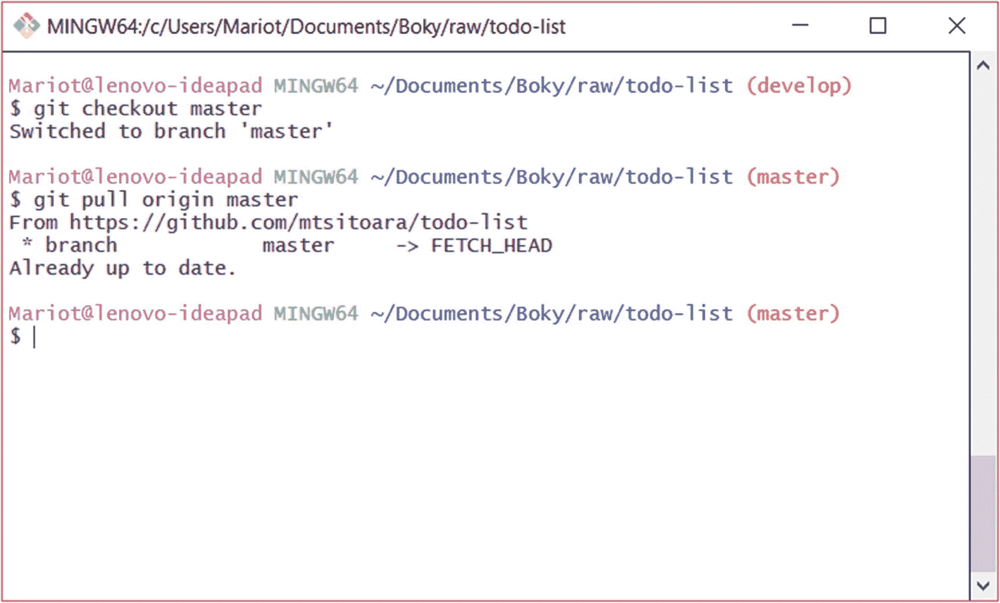

图 12-1

从原点拉主控形状

因为您在本地存储库和 GitHub 上有相同的提交，所以什么也没发生。但是一旦你开始和其他人一起工作，你将不得不在你的本地机器上拉动他们的分支来审查他们的变更或者仅仅是在 GitHub 上审查变更。

基本就是它了！拉只是将提交从远程分支复制到本地分支。别担心，你很快会有更多的机会玩 git pull。

### 公关是做什么的

现在我们对拉取有了更多的了解，我们对什么是拉取请求有了更清晰的概念。PR 只是请求在远程存储库上执行“拉”操作的权限。但是拉动一个分支还不足以完成动作:你还必须将分支合并在一起。

还记得我们将补丁分支合并到开发分支的时候吗？公关只是在请求允许这样做。您可以对您的本地分支做任何您想做的事情，但是当您与上游分支(远程存储库中的分支)打交道时，您必须使用一点礼貌并首先请求许可。这确保了主分支中提交的每个修复都经过了适当的测试和评审。

所以，把它放在一起，拉请求就是你让 GitHub 执行那些动作的请求:拉你的补丁分支，并把它与另一个分支合并。例如，在我们的项目中，我们目前有三个本地分支(master、develop 和 improve-readme-description)和两个远程分支(master 和 develop)。如果我们作出任何新的承诺，以改善-自述-描述，我们想把它与开发，我们会打开一个公关。在 PR 被接受后，GitHub 将执行以下操作:拉出 improve-readme-description 分支，然后将其与 develop 分支合并。

您可能会问自己:“如果拉请求的最终目的是合并分支，为什么不称之为合并请求呢？”嗯，很多人(包括 GitLab 等其他 Git 托管服务)称之为 Merge Request。意思是一样的。在本书中，我们将交替使用这两个术语。

### 创建拉取请求

言归正传！创建一个新的公关是非常容易的；你只需要两个分支:一个工作，另一个合并。开始吧！

首先，让我们创建一个要处理的问题。所以去 GitHub，创建一个名为“改善应用风格”的问题是的，我们以前也遇到过类似的问题，但是既然我们已经解决了那个问题，我们将打开一个新的问题。回收问题不是一个好主意，因为这将使你更难跟踪你的进展。

创建问题后，是时候回到终端了，因为每个 PR 都是以分支开始的。我们将从最新的开发分支 develop 中创建一个名为“improve-app-style”的分支。正如我们在上一章中看到的，从另一个分支创建新分支的方法是检出源分支并执行分支创建命令。因此，我们必须一个接一个地执行这些命令:

```
$ git checkout develop
$ git branch improve-app-style
$ git checkout improve-app-style

```

执行完这三个命令后，你会发现新的分支被检出，如图 [12-2](#Fig2) 所示。

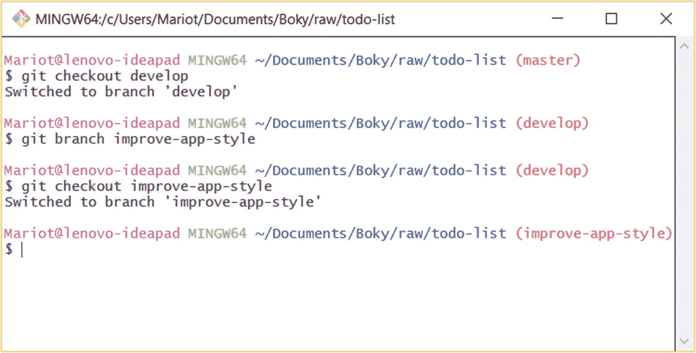

图 12-2

创建新的分支机构

在我们新成立的分支机构中，让我们来解决这个问题。打开 index.html 并将其内容替换为

```
<!doctype html>
<html>
    <head>
        <meta charset="utf-8">
        <title>TODO list</title>
        <style>
            h1 {
                text-align:center;
            }
            h3 {
                text-transform: uppercase;
            }
            ul {
                margin: 0;
                padding: 0;
            }
            ul li {
                cursor: pointer;
                position: relative;
                padding: 12px 8px 12px 40px;
                background: #eee;
                font-size: 18px;
                transition: 0.2s;
            }
            ul li:nth-child(odd) {
                background: #f9f9f9;
            }
            ul li:hover {
                background: #ddd;
            }
        </style>
    </head>
    <body>
        <h1>TODO list</h1>

        <h3>Todo</h3>
        <ul>
            <li>Buy a hat for the bat</li>
            <li>Clear the fogs for the frogs</li>
            <li>Bring a box to the fox</li>
        </ul>

        <h3>Done</h3>
        <ul>
            <li>Put the mittens on the kittens</li>
        </ul>
    </body>
</html>

```

然后，存放文件并准备提交。把非常简单的东西作为提交消息，不需要引用问题；我们以后再做这个。作为一个提交消息，你可以简单地说:“在项目行上添加基本的颜色变化。”像往常一样，在提交之后，您将得到如图 [12-3](#Fig3) 所示的确认消息。

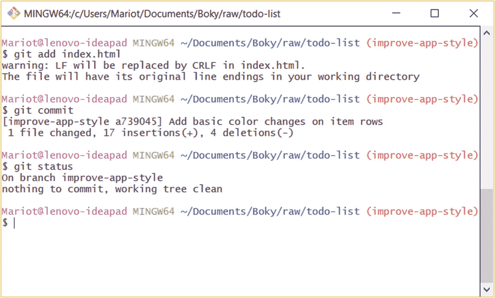

图 12-3

提交确认

现在该推到 GitHub 了。正如我们之前看到的，我们将不得不使用 git push 命令，后跟远程名称和分支名称。因此，命令将是

```
$ git push origin improve-app-style

```

在你把你的分支推送到 GitHub 之后，你会得到另一个熟悉的确认消息。你可以查看图 [12-4](#Fig4) 中的例子。

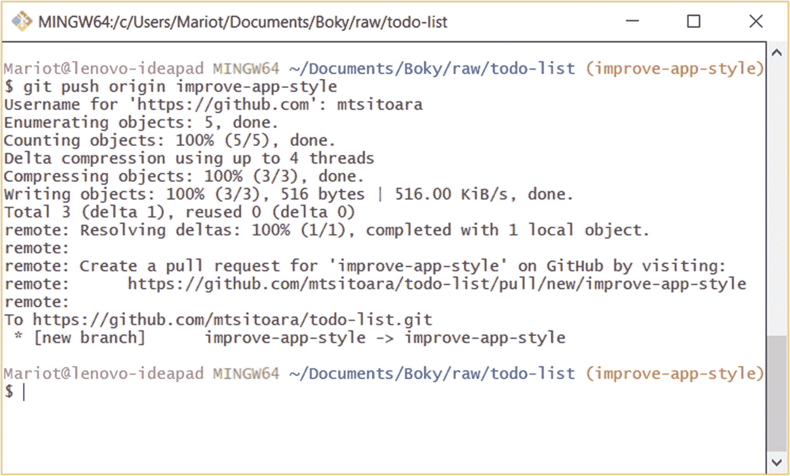

图 12-4

将分支推向 GitHub

正如您在确认消息中看到的，Git 直接向您显示一个链接，以便您可以创建一个 Pull 请求。但是让我们用另一种方式来创建一个 PR:直接在 GitHub 上。

转到您的项目页面，在演示文稿中寻找一些不同的东西。在最近推送到一个新的分支后，你的项目页面应该如图 [12-5](#Fig5) 所示。

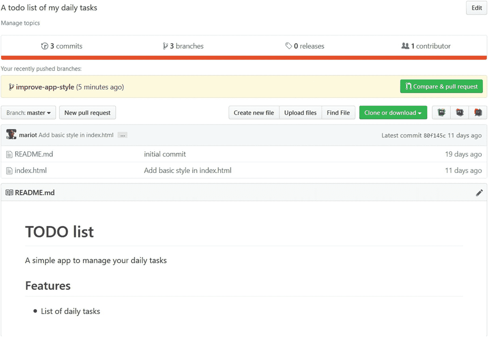

图 12-5

最近推送后的项目页面

如您所见，页面上有一个新的行动号召，就在分支列表的上方。它显示了您刚刚创建的分支机构的名称和一个用于创建 PR 的大按钮。单击按钮继续；您应该会看到拉取请求创建表单，如图 [12-6](#Fig6) 所示。

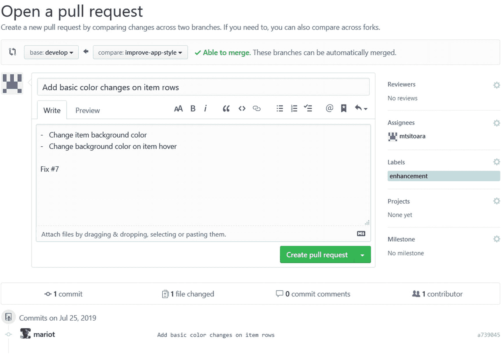

图 12-6

拉取请求创建表单

您可以注意到，PR 创建表单与 issue 创建表单非常相似。在右边，你可以找到关于受托人和标签的相同信息；它们的工作原理完全一样。在页面的底部，您可以看到 Pull 请求所应用的提交；如果你向下滚动，你会发现不同版本之间的差异。查看图 [12-7](#Fig7) 中的示例。

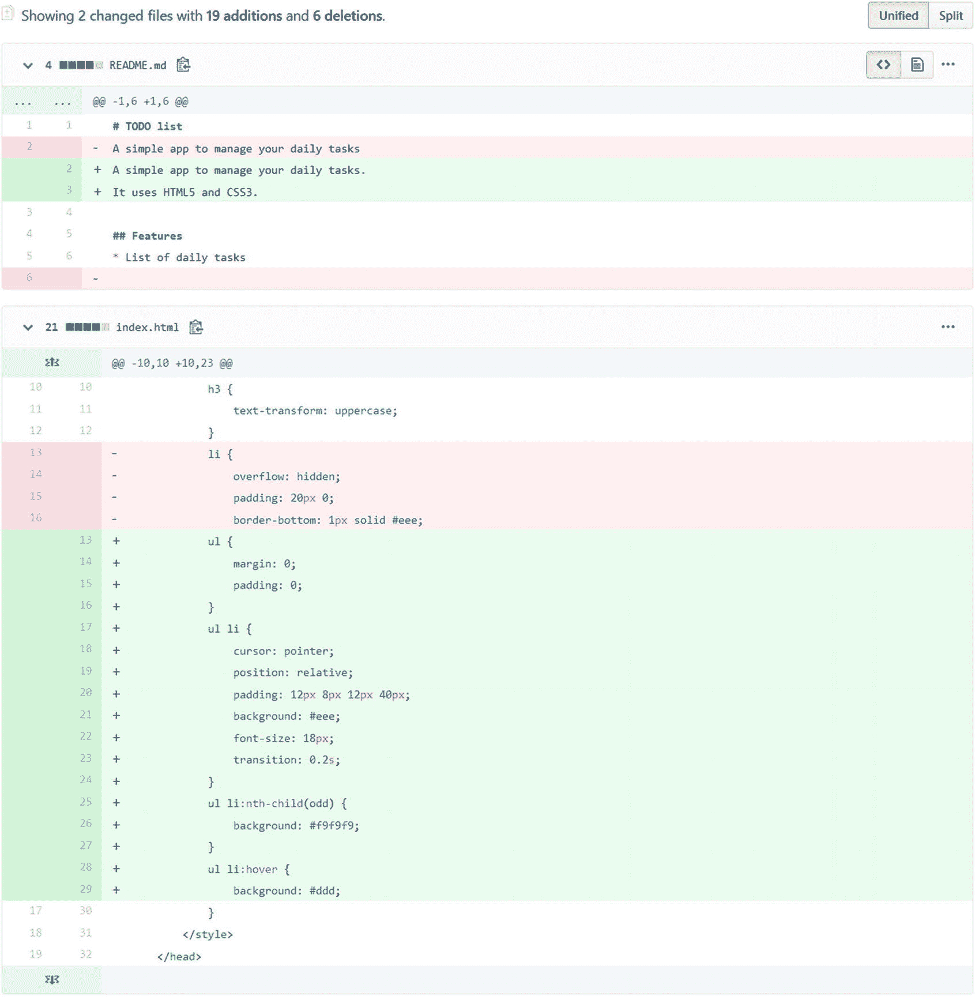

图 12-7

版本之间的差异

但是您可能会问自己为什么要应用两个提交。是因为目标分支。如果您仔细查看图 [12-6](#Fig6) ，您会发现 PR 的基本分支是 master。这不是我们想要的，因为我们的目标是开发分支。去吧，换个基地分支去发展。更改后，页面会重新加载，你会得到不同的结果，如图 [12-8](#Fig8) 所示。

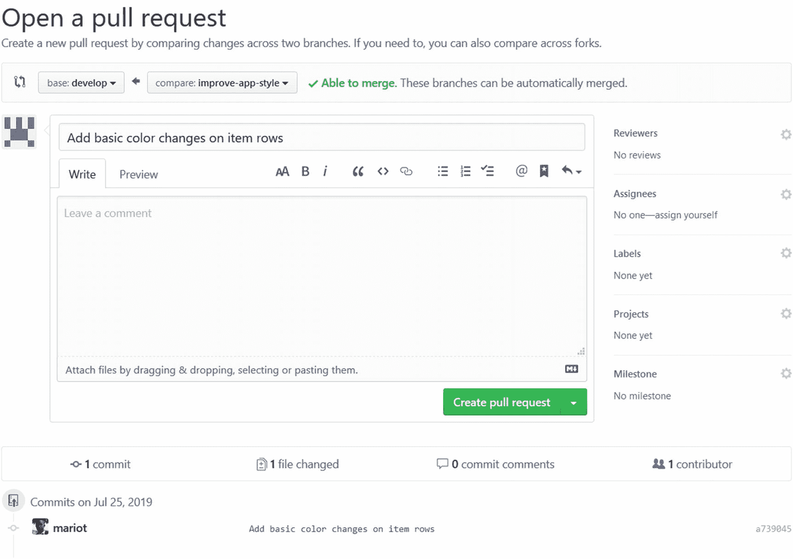

图 12-8

开发时拉取请求

当您更改它时，请注意 PR 名称也已更改；这是因为 PR 名称将最后一条提交消息作为默认名称。但是如果您愿意，您可以更改它，尤其是如果您在一个 PR 中有多个提交。记住关于 PR 名称的一件事:它应该像提交消息一样清晰、直截了当。你的 PR 名要回应这个问题:“如果我合并了这个 PR 会怎么样？”所以要好好保管你的 PR 名和描述，这样评审人员不用看你的代码就能知道你在试图解决哪个问题。

您可以在“描述”文本框中扩展您的 PR 说明，并毫不犹豫地提供有关变更的更多信息。你应该把结束问题的关键词放在那里。查看图 [12-9](#Fig9) 中的示例。


图 12-9

已完成的拉取请求

准备好后，点击“创建拉取请求”即可完成；您将到达一个类似于图 [12-10](#Fig10) 所示的页面。

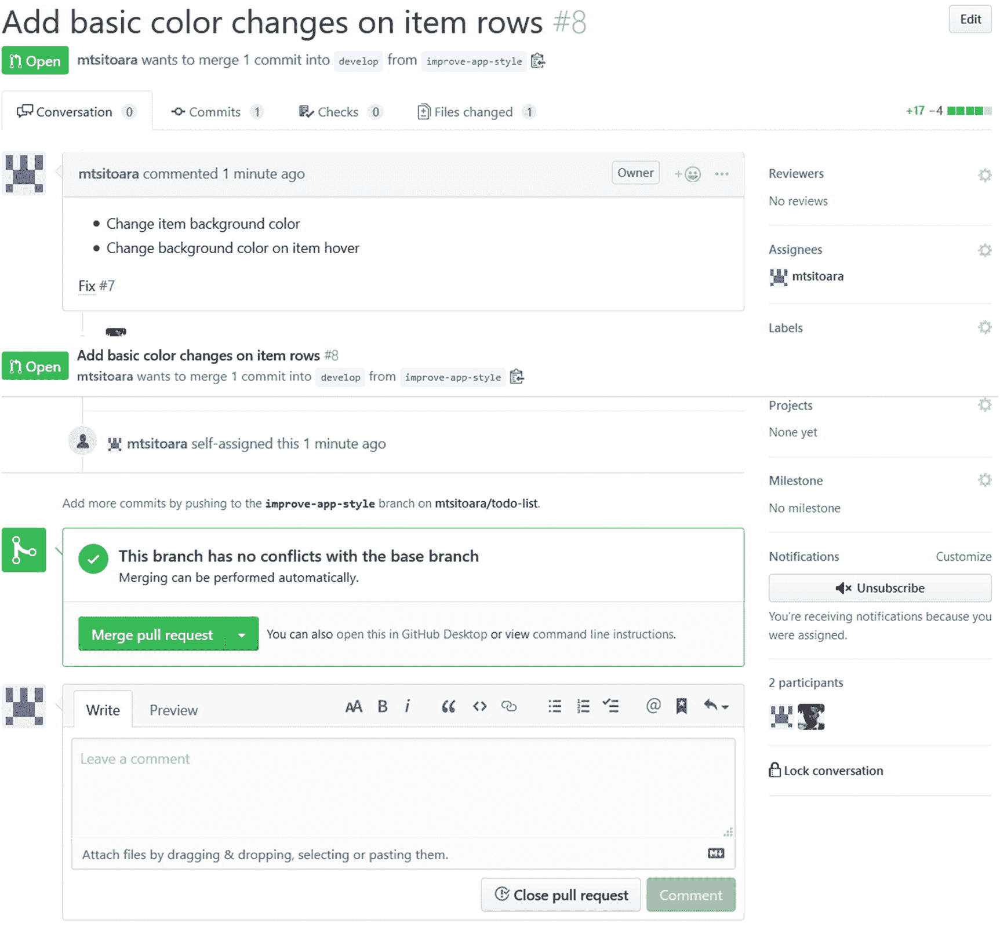

图 12-10

您的新拉动请求

同样，这个视图与它的 Issues 对应物非常相似，甚至 PR 号跟在 Issues 号后面。唯一的区别是合并拉请求的按钮。如果您点击此按钮，PR 将被接受，并且分支将被合并。但是先别这么做！在合并之前，让我们先玩玩我们的公关。

现在我们的 PR 提交了，是时候审核了！放下你的开发人员帽子，戴上你的技术领导帽子，是时候做代码审查了！

## 代码审查

代码审查是 GitHub 最好的特性之一。你不得不与你的技术主管安排一次一对一的会议，以便他们能检查你的代码，这样的日子已经一去不复返了。对于代码中的每个变更请求，不需要互相发送长长的电子邮件链(抄送列表上有一长串讨厌的人)。现在，一切都在 GitHub 中完成。让我们看看！

### 进行代码评审

在图 [12-9](#Fig9) 中，你可以看到代码评审过程。您看到了与当前版本相比对文件所做的所有更改，但是您还不能与它们进行交互。在本节中，您将学习如何评审您的共同贡献者的代码。

你可以在图 [12-10](#Fig10) 中看到，公关页面有许多部分，就像问题页面一样。您必须单击“文件已更改”来开始代码审查。然后你将到达一个类似于图 [12-11](#Fig11) 所示的页面。


图 12-11

代码审查部分

这个视图应该提醒您 git diff 结果，因为本质上是一样的。它向您详细展示了版本之间的差异，这意味着您将看到添加、删除或替换了什么。

### 留下评论

现在，让我们假装复习这段代码。在代码审查期间，您可以对整个更改或特定的一段代码进行注释。例如，让我们在第 17 行对“ul Li”CSS 定义进行注释。当您在代码评审变更上移动光标时，一个小的“加号”图标会跟随其后。这意味着你可以在那里发表评论。就这么办吧。将光标放在第 17 行，当“加号”图标出现时，单击它。它将打开一个小的评论区，如图 [12-12](#Fig12) 所示。

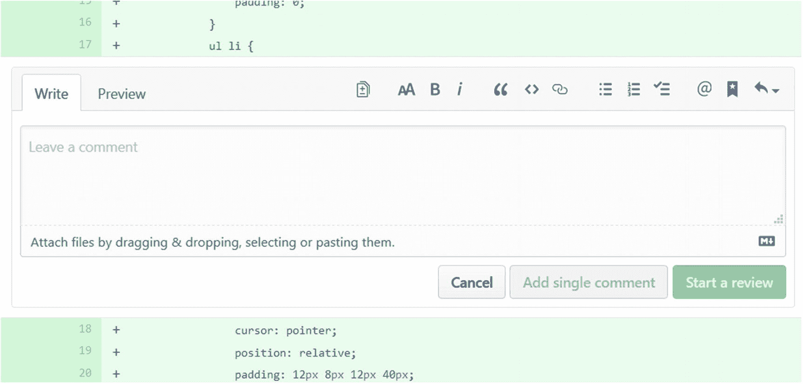

图 12-12

一行上的代码审查

和往常一样，您可以借助 Markdown 语法对这一部分进行各种各样的注释。对于这个例子，我们要加上这个注释:“为了一个更干净的 UX，使列表项不可选择。请使用“用户选择:无”你应该在离开评论前检查预览，就像图 [12-13](#Fig13) 一样。

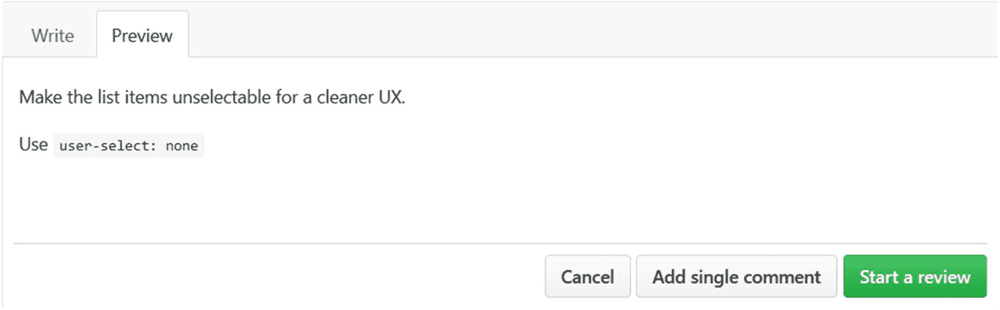

图 12-13

评论预览

如果您对自己的评论感到满意，请点击“开始评论”进入下一步。评论会显示在评论页面，评论上也会有回复按钮，就像图 [12-14](#Fig14) 所示的结果。

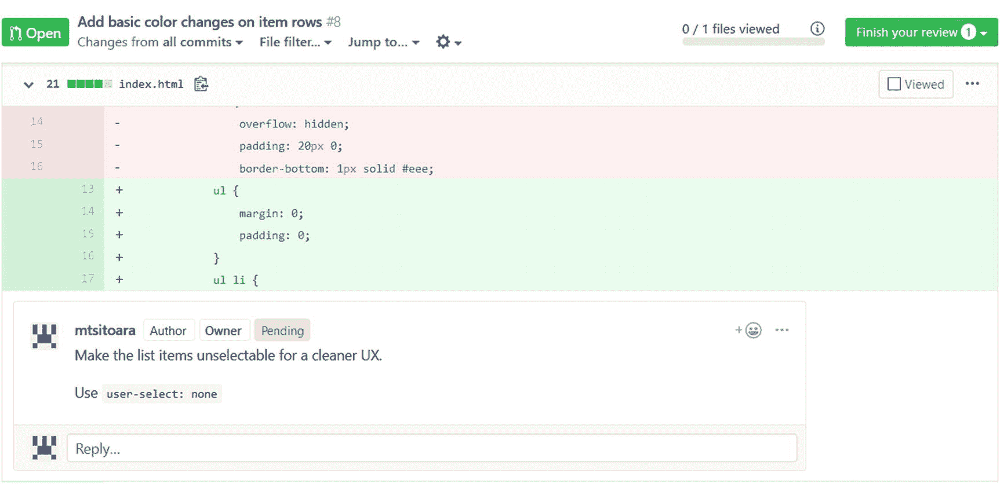

图 12-14

发布的评论

使用此按钮，开发人员可以在开始修改 PR 之前与审阅者讨论注释。如果您愿意，您可以添加更多的注释，因为注释是构成代码评审的基本要素。如果您满意，请点击页面顶部的“完成您的评估”按钮。您将再次看到一个小部分，如图 [12-15](#Fig15) 所示。

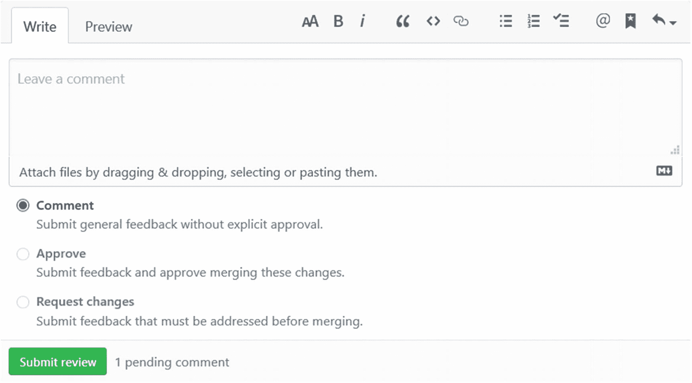

图 12-15

完成审查

完成审核后，您将有三个选择:评论、批准或请求更改。因为这是我们自己的拉取请求，我们不能批准或请求对它进行更改，所以我们将只选择默认选项，这是对更改的一般反馈。让我们把“不要忘记考虑不同的浏览器”作为评论并提交评论。您将再次返回到 PR 详细信息页面，如图 [12-16](#Fig16) 所示。

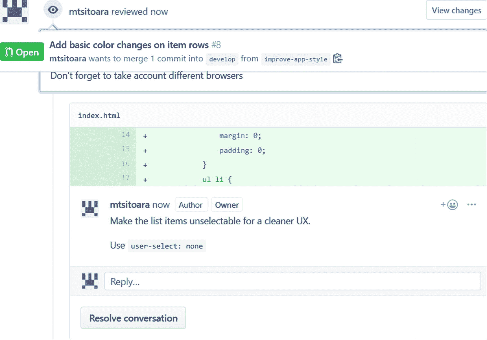

图 12-16

您完成的代码审查

PR 详细信息页面将向您显示审阅者留下的不同评论，以及整个 PR 的一般评论。让我们来解决这些评论。

## 更新拉取请求

评论者留下的评论建议我们应该在我们的 PR 被接受之前改变一些代码。所以，让我们这样做吧！让我们通过将新的提交推送到修补分支来更新我们的 PR。

### 注意

修补分支也称为主题分支，因为每个分支都应该有自己的主题要解决。

再次打开 index.html，将其内容更改为:

```
<!doctype html>
<html>
    <head>
        <meta charset="utf-8">
        <title>TODO list</title>
        <style>
            h1 {
                text-align:center;
            }
            h3 {
                text-transform: uppercase;
            }
            ul {
                margin: 0;
                padding: 0;
            }
            ul li {
                cursor: pointer;
                position: relative;
                padding: 12px 8px 12px 40px;
                background: #eee;
                font-size: 18px;
                transition: 0.2s;
                -webkit-user-select: none;
                -moz-user-select: none;
                -ms-user-select: none;
                user-select: none;
            }
            ul li:nth-child(odd) {
                background: #f9f9f9;
            }
            ul li:hover {
                background: #ddd;
            }
        </style>
    </head>
    <body>
        <h1>TODO list</h1>

        <h3>Todo</h3>
        <ul>
            <li>Buy a hat for the bat</li>
            <li>Clear the fogs for the frogs</li>
            <li>Bring a box to the fox</li>
        </ul>

        <h3>Done</h3>
        <ul>
            <li>Put the mittens on the kittens</li>
        </ul>
    </body>
</html>

```

再次暂存文件，并提交项目，同时显示消息:“使列表项不可选择。”然后，再次将分支推送到 GitHub。如果您在这个练习中迷路了，请查看前面的部分。提示:git push origin improve-app 风格。

推完分支后，再回到 PR 页面。您将在详细信息页面上看到一条新的评论。查看图 [12-17](#Fig17) 中的示例。

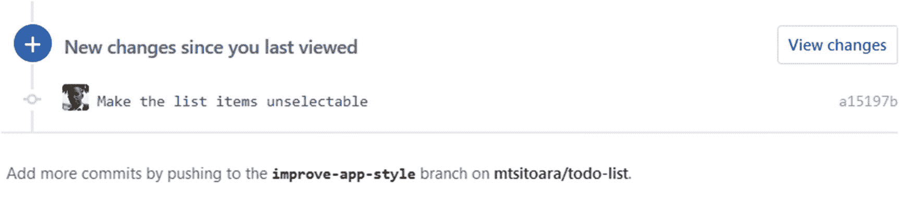

图 12-17

GitHub 检测到的新变化

每次提交后，GitHub 会更新 PR 来反映应用到分支的变更；单击“查看更改”以查看新的更改。您将再次到达代码审查页面，但是有一点小小的变化:您将只注意到新的变化，意味着您还没有看到的变化。这使得审阅者更容易跟踪 PR 的进展。

由于我们没有任何其他意见，请点击“完成审核”,然后给出一般性意见。在工作环境中，您不会审查您自己的代码，因此 Approve 选项是可用的。但是既然我们是单独工作，就给出一个一般性的评价，比如“干得好！”因为开发者真的很努力。与图 [12-18](#Fig18) 一样，一般意见将出现在 PR 详情页面上。

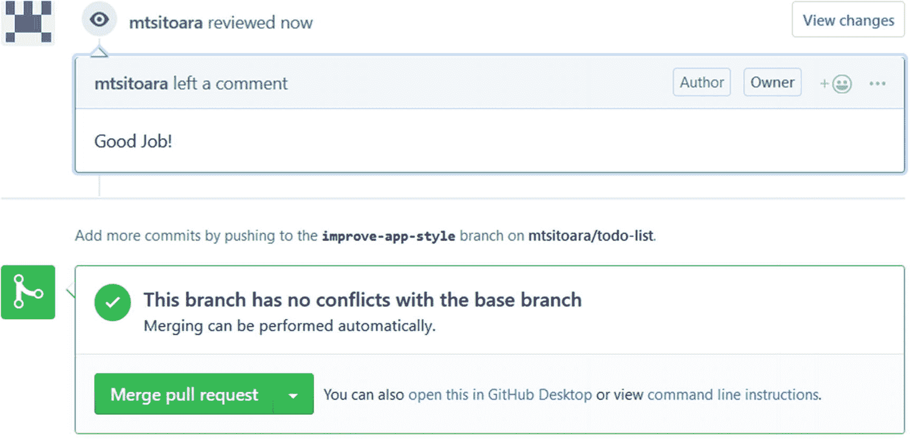

图 12-18

最后的评论已经完成

现在，我们可以安全地将我们的分支合并到基础分支，因为我们的代码已经过了适当的审查。单击绿色大按钮接受并合并 PR。在分支机构合并之前，您将被要求确认。确认后，分支机构将被合并，采购申请将被关闭。你甚至可以删除源分支，如图 [12-19](#Fig19) 所示。

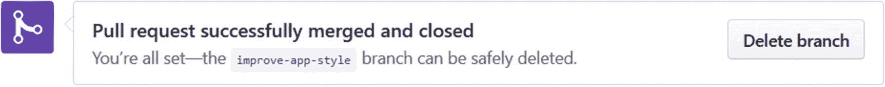

图 12-19

接受拉取请求

是否要删除该分支由您决定。有时，团队不会删除分支，直到测试人员确认一切正常。

“但为什么我的问题没有自动关闭？”你问。这是因为开发分支中的修复，而不是默认分支。只有在默认分支(主分支)中合并的修复才会自动关闭问题。但是既然你担心这个问题，让我们在进入下一章之前做一个小练习。

### 练习:将开发合并到主控形状中

让我们假设一个测试人员测试了我们的新特性，并说可以发布。所以，我们必须把发展融合成大师。这个练习是

*   返回到项目页面

*   打开一个 PR 以合并开发

*   接受 PR 并合并

## 摘要

祝贺您的第一份 PRs 被接受！(但如果你自己不接受他们，印象会更深刻)。这一章已经很长了，但是你需要完全理解它才能从 GitHub 的强大功能中获益。对于您的下一个问题，打开一个公关，而不是直接提交给主人。请记住，在大多数专业设置中，GitHub 不仅不鼓励在 master 上提交，还默认拒绝提交。每个变更必须来自拉取请求。

现在你应该已经习惯使用公关了；如果没有，重读本章的第一节。要记住的一件事是，拉请求只是请求允许在分支上应用提交的一种奇特方式。

你现在可能会有一些问题:“如果在我完成我的 PR 之前，有人在基础分支中推动了一些更改，该怎么办？”，“如果别人修改了和我一样的文件怎么办？”，或者“如果我在处理一份公关工作时被要求解决另一个问题，该怎么办？”这些问题确实非常中肯；这就是为什么我们将在下一章讨论它们。我们将处理合并冲突以及如何解决它们。但是在学习如何解决它们之前，我们将学习如何完全避免它们！走吧！