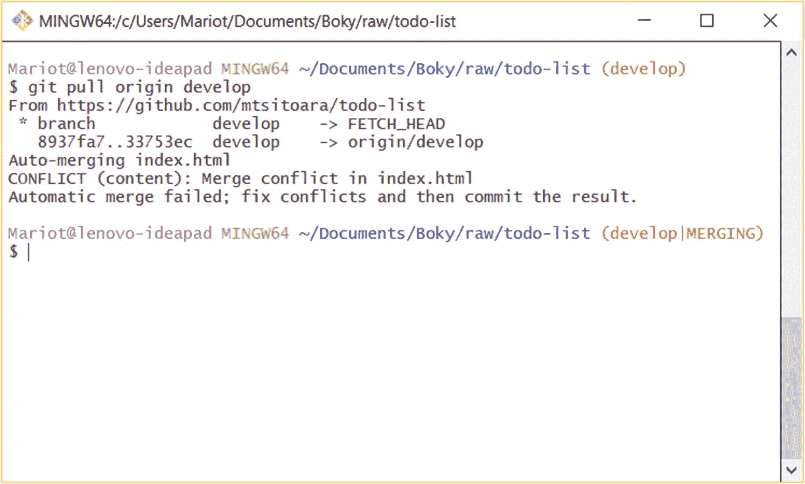

# 十三、冲突

最后一章向我们介绍了合并请求的奇妙世界。你应该知道它们的用途，以及为什么使用它们是个好主意。即使它们是一个很容易掌握的概念，它们也有一些难以忽视的缺点。

你的旅程已经基本结束；你已经走了很长的路。但是在独自继续你的道路之前，你仍然需要学习一些东西。你需要知道在这个过程中你会遇到什么问题。我们将在本章中讨论这些问题。首先，我们将回顾分支机构合并是如何工作的，然后我们将介绍你在职业生涯中最有可能遇到的问题。最后，我们将看到这些问题的通用解决方案。不要害怕冲突，因为它们很容易解决；他们只是很烦人。

## 合并是如何工作的

让我们倒回去一点，回到基础:合并做什么？合并将分支中的每个提交应用到另一个分支。简单吧？好吧，一个精心策划的合并在大多数情况下进展顺利。但是，即使你计划了每一个细节，也有你无法控制的事情:其他人做什么。

不要忘记 Git 是一个分布式版本控制系统，这意味着每个贡献者都有他们自己的项目副本，并且可以对他们的本地存储库做任何事情。每个人都可以更改每个文件，因为没有像某些 VCS 上那样的“文件锁”。这意味着存在多人对同一个文件进行更改的情况。将所有这些变化结合在一起需要一个合并。

在进入下一节之前，您必须记住一件事:只有当您确定一个分支中的提交是最终提交时，才合并该分支。合并包含未完成工作的分支违背了分支的目的——拥有清晰的历史。即使您不打算实际合并分支，也可以打开一个拉请求；但实际上合并它们并不完整。

如前所述，合并是从分支开始的。大多数时候，它是一个本地存储库中还没有的分支。因此，您必须从 origin(远程存储库的默认名称)中提取它。

### 拉

让我们第二次修改拉动命令。拉意味着将远程分支复制到本地存储库。例如，我们已经将一个分支合并到 develop 和 master 中，但是没有对我们的本地分支做任何事情。这意味着我们在历史时间线中“落后”,因为在远程存储库中有我们没有的提交。

事实上,“背后”这个词有点用词不当，因为正如我们所建立的，每个存储库都是独立的，Git 中没有中央存储库。我们选择有一个主远程存储库，因为它使团队工作更容易。但是，具体地说，你可以随意交换提交；“落后”这个概念的发明只是为了让开发者的生活更轻松。

让我们试着将 master 拉入我们的本地存储库。请记住，在进行本章的后续步骤之前，您需要完成上一章的练习(将 develop 合并到 master 中)。首先，检查你当地的总分行，确保它是干净的。

```
$ git checkout master
$ git status

```

如果你没有在你的工作目录上做任何有趣的事情，你应该得到如图 [13-1](#Fig1) 所示的结果:一个干净的目录。


图 13-1

在拉入之前，需要一个干净的目录

现在，让我们在进行任何更改之前检查一下历史日志。

```
$ git log --online

```

这将导致主分支机构历史记录的输出。它不会有我们最近所做的更改，因为那些更改现在只在远程存储库中。主历史日志应该如图 [13-2](#Fig2) 所示。


图 13-2

拉入前的历史日志

正如你在图 [13-2](#Fig2) 中所看到的，头部现在指向分支的最后一次提交(大部分时间都是这样)。根据这个结果，我们的本地主分支和远程主分支处于相同的级别，这意味着它们包含相同的提交。我们知道这不是真的，因为我们已经在远程主机上做了更改。我们的本地 Git 存储库不知道这一点，因为我们还没有从服务器获取任何提交。就这么办吧。

正如我们在上一章所看到的，pull 和 push 命令的工作方式是一样的:您只需要将远程存储库名称和远程分支名称作为参数传递。因此，命令将是

```
$ git pull origin master

```

在干净的工作目录上执行这段代码后，您将得到如图 [13-3](#Fig3) 所示的结果。


图 13-3

从原点拉主控形状

### 快进合并

当你把师父从原点拉出来后，你会得到一个操作摘要。您将看到已更改的文件数量和已完成的合并类型。这里的类型是“快进”，这是最简单的合并类型。快进意味着远程分支上的提交与本地分支在同一时间线上，所以 Git 只需移动到源分支的最后一次提交。还记得我们讨论过通过父子关系将提交链接到另一个提交吗？如果 Git 发现第一个分支上的提交和要合并的分支之间有链接，就会进行快速合并，这意味着只需要移动指针，这使得 Git 非常快。您应该始终努力使用快进作为合并的方法，因为它更容易，最重要的是，对历史日志来说最干净。

谈到历史日志，让我们检查一下它，看看我们从服务器获取的更改。再次使用“- oneline”选项来获得更好的结果。

```
$ git log --oneline

```

这将给出如图 [13-4](#Fig4) 所示的结果。


图 13-4

从原点提取后的历史日志

你有额外的承诺！来自远程分支的提交被合并到本地分支中。现在，您的本地主分支指向与原始分支相同的提交。

让我们把这些都打开。首先说一下树枝颜色。绿色分支是您的本地分支，而红色分支是远程分支。Remote 也有两个名称，因为它们的名称与远程存储库名称结合在一起。

可以看到，improve-readme-description，developer，origin/developer 在同一个层次上。我们知道这是不正确的，因为我们从 GitHub 改变了 develop。Git 不会知道发生了变化，直到您从原点拉出 develop 分支。

您会注意到在这个历史中有一些您没有提交的请求，即“来自 mtsitoara/improve-app-style 的合并请求#8”和“来自 mtsitoara/develop 的合并请求#9”它们被称为合并提交，由 Git 在合并两个或更多提交时创建。在我们的项目中，我们将 improve-app-style 合并为 develop，然后 develop 成为 master。这些合并中的每一个都会产生一个合并提交。

就像普通的提交一样，您可以使用 git show 命令显示关于它的更多信息。让我们展示第一个合并提交。

```
$ git show 33753ec

```

这将产生一个我们熟悉的视图:提交英特尔视图。您应该会得到如图 [13-5](#Fig5) 所示的相同结果。


图 13-5

合并提交的详细视图

这个视图并不特别有趣，因为它只显示了执行合并的提交父对象和用户。但是，有一点要记住，提交者和合并者可能是不同的人。您应该将解决问题的关键字放在合并提交消息中，而不是提交消息中。大多数时候，提交不足以解决问题；因此，将这些关键字放入“拉”请求消息中，这样只有在分支机构合并后，问题才会关闭。

图 [13-4](#Fig4) 中显示的历史日志很漂亮，但是它并没有真正显示分支和合并的概念。图形可能更合适，git log 命令中有一个参数。参数是"- graph "，您应该将它与"- oneline "一起使用，以获得最佳结果。

```
$ git log --oneline --graph

```

该命令将生成如图 [13-6](#Fig6) 所示的简单图形。


图 13-6

我们项目的历史图表

如您所见，日志图提供了我们项目的更详细的历史。一如既往，每个星号代表一次提交。但是在这张图上出现了一种新的元素类型:分支。你可以看到，我们从主分支中分支出来，创建了开发分支，开发分支又分成了改进应用风格的分支。我们对那个分支进行了两次提交，然后将它合并回去进行开发。之后，我们把 develop 合并成 master。

当您处理一个使用许多分支并经常合并的项目时(正如您应该做的)，最好使用图表视图，因为它比传统视图更清晰。还有，颜色很好看。

为了获得更清晰的历史日志，我建议您删除本地的 improve-readme-description 分支。

```
$ git branch -D improve-readme-description

```

删除已经合并的分支几乎没有风险；但是许多开发人员并不经常这样做，以防以后需要返工。大多数时候，这种情况不会发生。一个很好的经验法则是，只有当你确定不需要再次签出来测试某个东西时，才删除分支。

我们在这里做的是最简单的合并形式:快进。但是请记住，在您从一个分支分叉之后(就像我们在 master 和 develop 上所做的那样)，您就处于一个完全独立的区域。除非你向其他分支机构询问，否则你不会从他们那里得到任何更新。这也意味着其他分支将独立于您的分支进行评估。当您对分支发出拉请求时，它可能已经改变了。例如，多个贡献者可以开发新的分支，并致力于他们自己的问题。他们不会在同一时间完成，所以每个公关将被一个接一个地接受。这就是麻烦开始的地方:当你处理你的问题时，你的目标分支会在你的影响之外改变。当你完成你的改变时，你正在处理的现实可能会改变。可能多个人在各自的分支机构中更改了相同的文件。这在你的职业生涯中会经常发生，很多时候，一个公关不会像我们在本章中做的那样好。这些问题被称为“冲突”，解决这些问题对您的 Git 之旅至关重要。开始吧！

## 合并冲突

理解合并冲突的最好方法是创建一个合并冲突。所以，让我们搞砸我们的项目吧！首先，看看我们当地的发展分支。因为我们没有碰过这个树枝，所以它现在应该还是干净的。

```
$ git checkout develop

```

我们要做的第一件事是检查历史日志。

```
$ git log --oneline --graph

```

你会得到和以前一样的结果，因为我们还没有从原点出发。该结果如图 [13-7](#Fig7) 所示。


图 13-7

在拉取之前开发历史日志

这里没什么特别的，只是一根没有任何问题的旧木头。因为我们删除了 improve-readme-description 分支，所以开发历史日志中没有留下任何分支。

日志显示 develop 和 origin/develop 处于相同的状态；但这不是真的，因为我们是从 GitHub 改过来的。但是，我们不是从原点出发，而是首先在我们的分支中进行变更，这些变更会导致与原点的变更发生冲突。

打开 index.html 并用以下代码替换其内容:

```
<!doctype html>
<html>
    <head>
        <meta charset="utf-8">
        <title>TODO list</title>
        <style>
            h1 {
                text-align: left;
            }
            h3 {
                text-transform: capitalize;
            }
            li {
                overflow: hidden;
                padding: 22px 0;
                border-bottom: 2px solid #eee;
            }
        </style>
    </head>
    <body>
        <h1>TODO list</h1>

        <h3>Todo</h3>
        <ul>
            <li>Buy a hat for the bat</li>
            <li>Clear the fogs for the frogs</li>
            <li>Bring a box to the fox</li>
        </ul>

        <h3>Done</h3>
        <ul>
            <li>Put the mittens on the kittens</li>
        </ul>
    </body>
</html>

```

运行 git diff 来检查您的更改。我们只是做了些小改动，所以没什么大不了的，对吗？

```
$ git diff

```

这个结果对我们来说非常熟悉，因为我们在 GitHub 和 git show 上经常看到它。你的结果应该和我的一样，如图 [13-8](#Fig8) 所示。


图 13-8

开发目录和工作目录的区别

这里没什么新鲜的。让我们将更改后的文件添加到临时区域，然后提交当前项目。

```
$ git add index.html

```

### 小费

为每次提交打开文本编辑器是否令人厌烦？嗯，如果你赶时间的话可以跳过。要在跳过提交消息编辑阶段的同时提交项目，可以将提交消息作为参数传递:

```
$ git commit -m "<commit_message>"
Don't forget the `-m`!
$ git commit -m "Change CSS to introduce conflicts"

```

### 警告

使用 git commit 命令的简写形式可能会节省您几秒钟的时间，但是它更容易出错，因为您在提交之前没有机会检查您的更改。我强烈建议只在只有一个更改过的文件时使用它。另外，您不能用它来编写多行提交消息。

这不会产生任何我们没有见过的结果。正如你在图 [13-9](#Fig9) 中看到的，我们得到一个标准结果，因为还没有冲突。


图 13-9

将引入冲突的提交

为了产生冲突，我们需要在将分支合并到开发中时得到我们推进的提交。

### 从原点提取提交

我们已经看到了运行中的 pull 命令，但是，在这个场景中，我们会遇到一个小问题:我们在不同的提交中更改了同一个文件。这将产生冲突，我们必须在您完成拉动之前解决这些冲突。请记住，拉仅仅意味着将远程提交复制到您的本地存储库中。

先从原点直接拉 develop 开始吧。同样，该命令非常类似于 push 命令。您只需要远程存储库和分支名称。

```
$ git pull origin develop

```

我们得到的结果与我们之前看到的完全不同。我们得到的不是一个完整动作的结果，而是一个冲突，我们被困在两个状态之间。您可以查看图 [13-10](#Fig10) 中的示例。



图 13-10

执行 pull 命令时发生合并冲突

让我们一个一个的解开这个结果。首先，我们有用于拉取的 URL，所以这里没什么特别的。

接下来，Git 执行第一个动作。这个动作叫做“fetch”，它的作用是将选择的分支从远程复制到本地存储库中。然后，这个分支被存储到一个名为 FETCH_HEAD 的临时存储器中。就像 HEAD 是对我们正在处理的最后一个提交的引用一样，FETCH_HEAD 引用我们刚刚从 origin 获取的分支的顶端。

下一个动作是基本的合并，就像我们之前看到的一样。我们获取了远程分支，现在是时候将它与当前分支合并了。该操作详述了要执行的合并:分支 develop 和 origin/develop。它甚至指定了将要使用的提交。您的提交名称会有所不同，但是要验证第一次提交，您只需检查提交日志:

```
$ git log --oneline

```

您将在倒数第二个提交上找到提交名称，如图 [13-11](#Fig11) 所示。


图 13-11

倒数第二个提交将用于合并

请注意，合并不会使用最后一次提交，因为它是我们正在处理的提交，是引入了更改的提交。

图 [13-10](#Fig10) 也引用了合并的另一个提交，你可以在 origin/develop 上找到那个提交。转到 GitHub 上的项目页面，选择 develop 分支，查看远程分支的历史日志。你也可以通过 GitHub 链接直接访问，比如 [`https://github.com/mtsitoara/todo-list/commits/develop`](https://github.com/mtsitoara/todo-list/commits/develop) 。您将看到最后一次提交，如图 [13-12](#Fig12) 所示。


图 13-12

关于起源/开发的提交

如你所见，图 [13-10](#Fig10) 中引用的第二次提交是远程分支的最后一次提交，它是由我们之前在 GitHub 上的合并创建的。要获得更多信息，您可以单击它并获得提交的详细信息。查看图 [13-13](#Fig13) 中的示例。


图 13-13

有关合并提交的更多信息

在图 [13-13](#Fig13) 中可以看到，这个提交有两个父级；这是因为它是由两个分支的合并创建的提交。你还可以看到，图 [13-10](#Fig10) 中也引用了其中一个父节点，因为这是我们在 GitHub 上合并分支之前最后一次提交的。

让我们回到图 [13-10](#Fig10) 。在结果的下一部分，Git 试图“自动合并”分支，这意味着它试图自动合并分支。当不同的文件或文件的不同部分被分支改变为合并时，这可以顺利进行。但是由于发现了冲突，合并失败了。这要靠我们来解决。

Git 试图将我们的本地 develop 分支与 FETCH_HEAD 合并，但是由于两个分支都包含对 index.html 相同部分的更改，您必须决定保留哪些更改。我们将在下一节中看到如何做到这一点。

从图 [13-10](#Fig10) 中应该注意的最后一个信息是我们的本地存储库所处的状态。如果你观察控制台的左边部分，你会发现存储库处于“develop|merging”状态，而不是标准的“develop”分支。这意味着项目中仍然有未解决的冲突，合并(以及，通过扩展，拉)还没有完成。您可以检查状态，以了解关于存储库当前状态的更多信息。

```
$ git status

```

这会让你得到一个我们之前没有见过的新结果，如图 [13-14](#Fig14) 所示。


图 13-14

合并的状态

这个结果非常容易阅读，并为接下来的步骤提供了很好的建议。首先，它告诉我们接下来应该做的事情:解决冲突并提交项目。然后，它告诉我们如果我们决定退出冲突，中止当前合并的方法。在许多情况下，这是一个好主意，因为我们可以在本地分支工作，以解决我们知道会出现的冲突。例如，我们可以中止这个合并，恢复引入冲突的提交，然后再拉一次。然后我们将有一个没有任何冲突的自动合并。但是这对我们来说太简单太合理了，所以，让我们来点硬的吧！

接下来，我们有一个合并所涉及的文件列表。这里只涉及 index.html，并且在两个分支中都进行了修改。让我们打开它来看看冲突。如图 [13-15](#Fig15) 和图 [13-16](#Fig16) 所示。


图 13-16

维姆的 index.html


图 13-15

Visual Studio 代码中的 index.html

你会注意到文件中有三大行分隔你的代码。在每个代码冲突中，这些行总是相同的，但是不同的文本编辑器可能会呈现不同的内容。例如，像 Visual Studio 代码这样的 IDE 会用不同的颜色渲染代码，甚至会添加一些按钮来与代码进行交互(如图 [13-15](#Fig15) )。相比之下，一个非常简单的文本编辑器会将代码行显示为普通的代码行，可能会打乱您的配色方案。在图 [13-16](#Fig16) 中，我使用了 Vim，没有任何额外的工具，所以渲染有点平淡无奇；但是很多插件可以用来修复这个。

### 解决合并冲突

让我们从解释这三行是什么意思开始。“<<<<<<> > > > > >”线划定了有冲突的区域。请记住，一个文件可以有多个冲突区域。

这些区域由“=======”行分隔，显示了两个分支的代码。第一部分是您当前分支上的代码；第二部分是您试图合并的分支上的代码。

所以，我们的文件里有两个相互冲突的代码。第一个是关于开发的代码，第二个是关于起源/开发的代码。要解决合并冲突，我们必须编辑文件，使其只有一个变更集。这并不意味着你必须在两个变更集中做出选择，只是意味着最后只能剩下一个；如果需要，您可以合并它们。

在我们的情况下，最好保留第二部分的大部分内容，因为我们已经审查并接受了这些更改。但也有一些东西我们可以从第一部分保留下来。因此，最好的做法是从第一部分复制我们需要的代码，并将其复制到第二部分。代码将变成

```
<!doctype html>
<html>
    <head>
        <meta charset="utf-8">
        <title>TODO list</title>
        <style>
            h1 {
                text-align: left;
            }
            h3 {
                text-transform: capitalize;
            }
<<<<<<< HEAD
            li {
                overflow: hidden;
                padding: 22px 0;
                border-bottom: 2px solid #eee;
=======
            ul {
                margin: 0;
                padding: 0;
            }
            ul li {
                cursor: pointer;
                position: relative;
                padding: 12px 8px 12px 40px;
                background: #eee;
                font-size: 18px;
                transition: 0.2s;
                -webkit-user-select: none;
                -moz-user-select: none;
                -ms-user-select: none;
                user-select: none;
                overflow: hidden;
            }
            ul li:nth-child(odd) {
                background: #f9f9f9;
            }
            ul li:hover {
                background: #ddd;
>>>>>>> 33753ecaebae2ba1c3ffdc1e543d372385884c78
            }
        </style>
    </head>
    <body>
        <h1>TODO list</h1>

        <h3>Todo</h3>
        <ul>
            <li>Buy a hat for the bat</li>
            <li>Clear the fogs for the frogs</li>
            <li>Bring a box to the fox</li>
        </ul>

        <h3>Done</h3>
        <ul>
            <li>Put the mittens on the kittens</li>
        </ul>
    </body>
</html>

```

如你所见，我们只复制了第一部分的一行，因为第二部分已经快完成了。现在是清理文件中不必要部分的时候了。首先，我们可以删除代码冲突的第一部分(在<<<<<<< and =======) because we don’t need them anymore. Then we can just remove the remaining line (>> > > > > >之间)，因为它不再有意义了。该文件将变成

```
<!doctype html>
<html>
    <head>
        <meta charset="utf-8">
        <title>TODO list</title>
        <style>
            h1 {
                text-align: left;
            }
            h3 {
                text-transform: capitalize;
            }
            ul {
                margin: 0;
                padding: 0;
            }
            ul li {
                cursor: pointer;
                position: relative;
                padding: 12px 8px 12px 40px;
                background: #eee;
                font-size: 18px;
                transition: 0.2s;
                -webkit-user-select: none;
                -moz-user-select: none;
                -ms-user-select: none;
                user-select: none;
                overflow: hidden;
            }
            ul li:nth-child(odd) {
                background: #f9f9f9;
            }
            ul li:hover {
                background: #ddd;
            }
        </style>
    </head>
    <body>
        <h1>TODO list</h1>

        <h3>Todo</h3>
        <ul>
            <li>Buy a hat for the bat</li>
            <li>Clear the fogs for the frogs</li>
            <li>Bring a box to the fox</li>
        </ul>

        <h3>Done</h3>
        <ul>
            <li>Put the mittens on the kittens</li>
        </ul>
    </body>
</html>

```

文件恢复正常！合并冲突代码，不再有那三条大线。现在，您可以继续合并过程。如果您忘记了下一步，您可以再次运行 git status(或者检查图 [13-14](#Fig14) )。

现在，文件已经准备好了，我们必须转移它。

```
$ git add index.html

```

之后，您必须像往常一样提交项目。

```
$ git commit

```

您将会看到熟悉的提交消息视图，但是有一点小小的变化:提交消息已经编写好了。查看图 [13-17](#Fig17) 中的示例。


图 13-17

默认提交消息

当然，您可以随时修改提交消息，但是我建议保留默认消息，除非您遵循个人或公司的指导原则。您可以保存提交消息并继续。

如果你查看命令结果(如图 [13-18](#Fig18) 所示)，你会看到你回到了开发分支，不再处于“合并”状态。


图 13-18

回到正常状态

您还可以通过检查历史日志来检查合并是否已经完成。确保添加图形选项以获得漂亮的结果。

```
$ git log --oneline --graph

```

这将产生如图 [13-19](#Fig19) 所示的惊人视觉效果。


图 13-19

我们项目的近期历史

您可以在图中看到，当我们合并 origin/developer 分支时，我们导入了它的所有历史。所以，看起来我们有一个分支的分支。在大型 Git 项目中，这种情况经常发生。

## 摘要

这是这本书最大的一章。祝贺你到达那里！我们看到了如何从远程服务器获取代码，以及当相同的代码区域被两个不同的分支修改时如何解决冲突。

关于拉取的主要要点是，它实际上是两个相继执行的命令:

*   获取，将远程分支复制到临时分支

*   合并，将临时分支合并到当前分支

但是当两个分支包含相同代码的编辑时，合并有时会引发冲突。要解决这些冲突，您必须重新打开相关的文件，并决定保留哪个代码。然后，剩下的就是基本的了:准备和提交。

合并冲突是令人讨厌的事情之一，但不幸的是，在你的职业生涯中会发生很多，所以了解它们很重要。既然他们很讨厌，我们将在下一章学习如何减少他们的出现。坚持住！