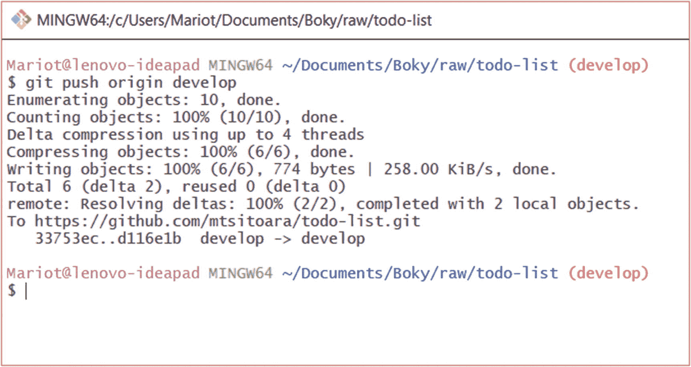
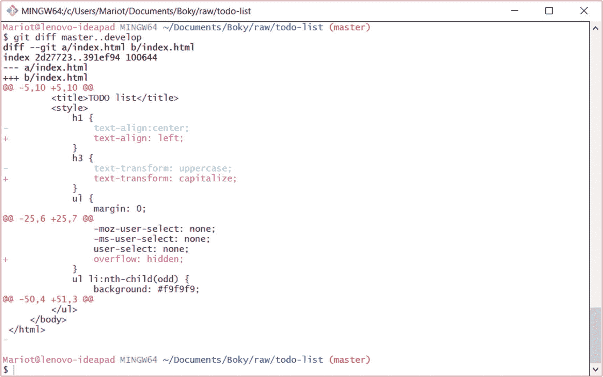

# 十四、关于冲突的更多信息

最后一章很紧张，不是吗？我们讨论了什么是合并冲突以及它们何时会发生。我们还了解了如何手动解决这些问题。别担心，这一章会容易消化很多。我们将讨论如何在合并冲突后将分支推到远程。此外，我们还将看到一些可以用来减少可能发生的冲突的策略。走吧！

## 推动冲突的解决

正如我们在前面章节中看到的，推送意味着将本地提交复制到远程分支。这意味着我们在本地的每一次提交都将被应用到远程存储库。

我们在上一节中看到，拉操作只是一个接一个执行的两个操作:将远程分支复制到临时位置的获取操作和将临时分支合并到本地分支的合并操作。因为拉和推的动作是一样的，但是方向不同，所以把本地分支推到原点的方式是一样的。

因此，推送操作也分为两个部分:将本地分支复制到远程分支，以及分支的合并。push 和 pull 动作之间的唯一区别只是哪个参与者执行动作的问题:您还是服务器。

在正常情况下，推送会顺利进行，因为合并是使用“快进”自动执行的当本地分支上的提交可以与远程分支上的提交直接链接时，快进是可能的。例如，简单地在我们的主分支上一个接一个地添加提交(就像我们到目前为止所做的那样),然后推送它们会产生一个快速前进的合并，不需要创建一个合并提交。

在我们的情况下，这也会发生，因为我们只在我们的开发分支上添加了新的提交。我们不会有任何问题，除非我们或其他人回到过去，改变历史。千万不要尝试这样做。

也就是说，让我们使用通常的命令来推进我们的开发分支。

```
$ git push origin develop

```

正如所料，我们将得到如图 [14-1](#Fig1) 所示的通常结果。



图 14-1

推动我们的发展分支

总之，在提取和合并变更之后将分支推回到原点不应该导致意外的行为。除非有人改变了历史。

## 合并前检查更改

在尝试任何合并之前，您要做的最重要的事情是检查您的分支将引入的所有更改。这是一个不应该被忽略的关键步骤，因为它将节省您与 Git 斗争的无数时间。

### 检查分支位置

你首先要确定的是你的位置。若要将两个分支合并在一起，您必须签出目标分支。例如，如果您打算将 develop 合并到 master 中，您将需要首先检查后者。因此，代码应该是(现在不要实际执行第二个命令):

```
$ git checkout master
$ git merge develop

```

### 审查分支差异

审查差异不仅仅是提交的专利！您还可以使用它来检查两个分支之间的差异，这在合并这样的微妙情况下非常方便。这个命令相当简单:

```
$ git diff branch1..branch2

```

注意两个分支名称之间的两个点。这将在一个熟悉的 diff 视图中显示两个分支之间的差异。让我们比较一下开发人员和硕士:

```
$ git diff master..develop

```

比较提交时，结果与我们的 diff 结果非常相似。查看图 [14-2](#Fig2) 中的示例。



图 14-2

分支之间的差异

如果你做了很多修改，不想滚动太多，你也可以在 GitHub 上查看这些修改。就推分支，开一个拉请求！

## 了解合并

我们已经看到了许多关于 Git 合并的概念，但是让我们回顾一下，以便更清楚地了解这个特性。正如我们前面看到的，合并是将两个分支合并的行为，或者更准确地说，是将一个分支注入另一个分支。

分支可以由任何其他分支形成，当一个分支被创建后，它将独立于其父分支。在合并之前，对任何一个分支所做的更改都不会影响到另一个分支。

让我们想象这样一种情况，您创建了一个子分支，并在这个新分支上提交。当合并的时候，会出现几种情况。

如果父分支没有改变(没有提交)并且您试图合并，将会发生“快进”合并。“快进”合并在技术上不是合并，而只是 Git 中的引用更改。请记住，Git 提交的行为类似于链表，这意味着一个提交包含对前一个提交的引用。事实上，如果父分支没有改变，Git 只是将对父分支的引用向前移动(遵循链表)，子分支中的最后一次提交成为父分支的最后一次提交。简单地说，Git 只是将子分支中的提交追加到父分支中。这是最简单的“合并”类型，但也是最不常见的，除非你独自工作。

相反，如果父分支已被更改(接收到提交)，则不能进行快速合并。将要发生的被称为“真正的合并”或“三方合并”这就是我们上一章看到的合并类型。这种类型的合并将创建一个新的提交，它包含子分支中的所有更改，并将该提交附加到父分支。这个提交被称为“合并提交”，它有两个父分支:父分支和子分支。如果来自父分支和子分支的不同提交修改了同一行代码，就会出现冲突，开发人员必须手动选择保留哪些更改。

因此，合并只是创建包含子分支中所有更改的提交并将其附加到父分支的一种奇特方式。清楚地了解这一点非常重要，这样我们就可以减少合并冲突的频率。

## 减少冲突

我们在上一章中看到，解决冲突可能会很痛苦，而且根据冲突的大小，可能会花费很多时间。因此，将它们的出现减少到最低限度对我们是有益的。在这一节中，我们将看到限制冲突的策略。

### 拥有良好的工作流程

如果你使用一个好的工作流程，你在 Git 和 GitHub 中会遇到的大多数问题都是可以避免的。在前面的章节中我们已经看到了最常见的 Git 工作流，但是让我们再回顾一下。

要记住的第一件事是不要直接承诺你的主要分支。简单来说:你打算引入到你的主或者开发分支的每一个改变都应该通过合并来完成。并且每个合并必须由一个拉请求引入。这样，你可以在工作的时候收到反馈。它也给测试人员一个更好的方法来跟踪项目变更。即使你独自工作，你也应该总是使用 PRs 来引入主要分支的变化。这将提供一个比简单的提交消息更清晰的项目历史日志。

每个拉取请求都应该以解决问题为目标。因此，一个公关应该只做一件事，无论是一个 bug 修复，一个特性提案，还是文档变更。不要试图用一个公关来解决几个问题。无所不能的拉请求是合并冲突的完美配方。

开发人员经常忽略的一点是行尾和文件格式。正如我们在第 [2](02.html) 章看到的，不同的操作系统使用不同的行尾。你的团队有必要讨论每个项目用哪些；大多数团队使用 Unix 风格的行尾，所以 Windows 用户应该相应地配置他们的 Git 客户端。至于格式，这取决于您的团队，但唯一的规则是，您必须对缩进和换行符使用相同的格式。

### 警告

当讨论制表符和空格时，事情可能会变得激烈。提前准备好你的论点。

### 中止合并

许多合并冲突不是来自代码冲突；许多将来自格式和空白差异。例如，即使代码没有更改，尾随的回车空格或缩进空格的数量也会引起冲突。

当遇到这种冲突时，最好的办法就是中止合并，恢复格式差异，然后再次尝试合并。正如您在前面看到的，中止合并的命令是

```
$ git merge --abort

```

这不会破坏你的任何提交，它只会取消合并，你会停留在你当前的状态。

### 使用可视化 Git 工具

当使用简单的文本编辑器时，可能很难解决冲突，因为大多数时候，它会打乱代码的配色方案。一个简单的解决方案是使用专门的 Git 工具。它们可以是专门为 Git 开发的 IDE 扩展或工具。让我们在下一章发现它们！

## 摘要

这一章简单地提醒了我们什么是合并以及如何使用它们。我们看到了各种类型的 Git 合并以及它们可能出现的情况。我们还回顾了合并是如何工作的，目标是什么:将提交从一个分支转移到另一个分支。

要记住的主要事情是减少合并冲突的各种方法。你可能永远也摆脱不了它们，但是遵循这些建议会让它们的出现降到最低。

在我们的 Git 之旅中，我们已经取得了很大的进步，但是我们是使用我们简单而乏味的控制台完成的。是时候在我们的 Git 项目中加入更多的色彩了，所以让我们来学习一下 Git GUIs 吧！