# 15\. Git 图形用户界面工具

在前面的章节中，我们已经看到了很多最重要的 Git 特性和概念。我们已经学习了提交、分支、拉请求和合并。使用这些概念，您已经可以在 Git 中完成几乎任何事情。不过，只有一个小问题:我们只使用了终端或控制台窗口。在这一章中，你不会学到任何新概念或新特性；你将学习如何运用你已经知道的☺风格

首先，我们将研究 Git 附带的默认工具，然后学习更多关于集成 Git 的 ide，最后看一些专门为 Git 制作的工具。

## 默认工具

如果您已经按照第 [2](02.html) 章中的安装步骤进行了操作，那么您的计算机上已经安装了这些工具。如果没有，你可以很容易地在我们常用的软件商店里找到它们。Git 附带了这些默认工具，为用户提供了非常简单的 GUI 来浏览他们的存储库和准备提交。它们几乎适用于任何操作系统，所以不要担心，它们对您都适用。它们在本书中出现是出于历史原因，也因为它们内置于 Git 中。

### 提交:git-gui

我们将要看到的第一个工具叫做 git-gui，它是 git 的图形化提交界面。您将使用它来提交您的项目并审查提议的更改。你可以在 [`https://git-scm.com/docs/git-gui`](https://git-scm.com/docs/git-gui) 上找到更多关于它的信息。

您可以像打开 Git Bash 一样打开它:通过命令行、上下文菜单或起始页。选择最适合你的选项。在基于 Windows 和 Debian 的操作系统上，您可以通过导航到存储库的目录并右键单击空白区域来打开 Git GUI。这样做会给你一个类似于图 [15-1](#Fig1) 的结果。

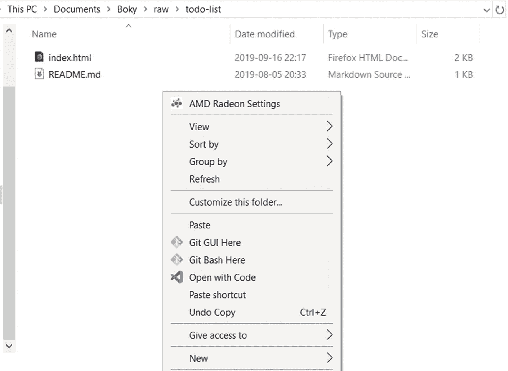

图 15-1

Windows 上下文菜单

如您所见，您可以在那里打开 Git GUI 和 Git Bash。继续并选择 Git GUI。你会看到一个小程序窗口，详细说明你当前的工作目录状态。该窗口如图 [15-2](#Fig2) 所示。

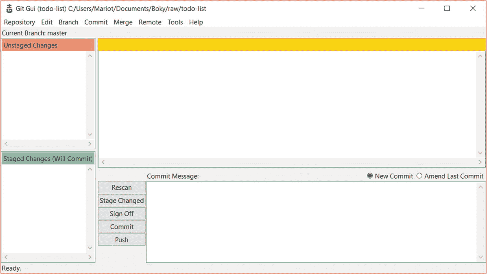

图 15-2

Git GUI 界面

如果您不想使用上下文菜单或者不能使用，您可以通过在 Git 存储库的位置打开一个终端并执行以下命令来打开它:

```
$ git gui

```

Git GUI 界面非常轻量级和直观；每个操作系统都一样，所以每个人都有宾至如归的感觉。它分为四个部分:

*   左上角是尚未暂存的已编辑文件列表。

*   左下角是已转移的文件列表。

*   右上方是一个不同的视图。

*   右下角是提交消息文本区域。

由于我们没有改变项目中的任何内容，所以所有内容都是空的。所以，让我们用额外的提交来打乱我们的项目。

首先，让我们确保我们在主分支中，然后从它创建一个新分支。转到“分支”菜单，选择“结帐…”；这将打开如图 [15-3](#Fig3) 所示的选择窗口。

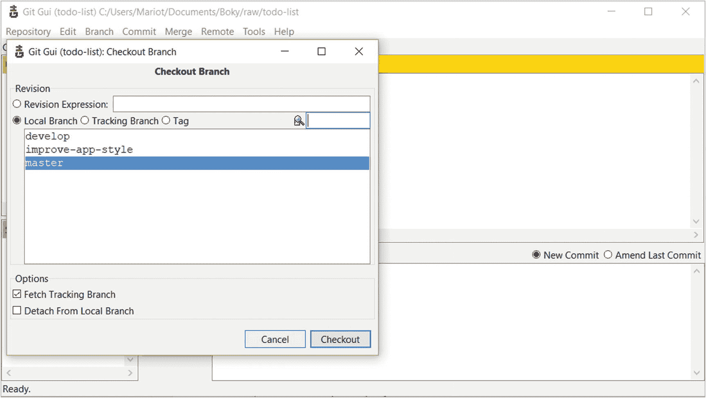

图 15-3

选择要签出的分支

您会注意到，当您的光标悬停在某个分支上时，会出现关于其上次提交的信息。它将帮助您找到正确的分支机构，但如果您有一个好的分支机构名称，就没有必要了。签出主分支，然后通过选择“分支”菜单上的“创建…”来创建一个新分支。你将得到如图 [15-4](#Fig4) 所示的分支创建窗口。

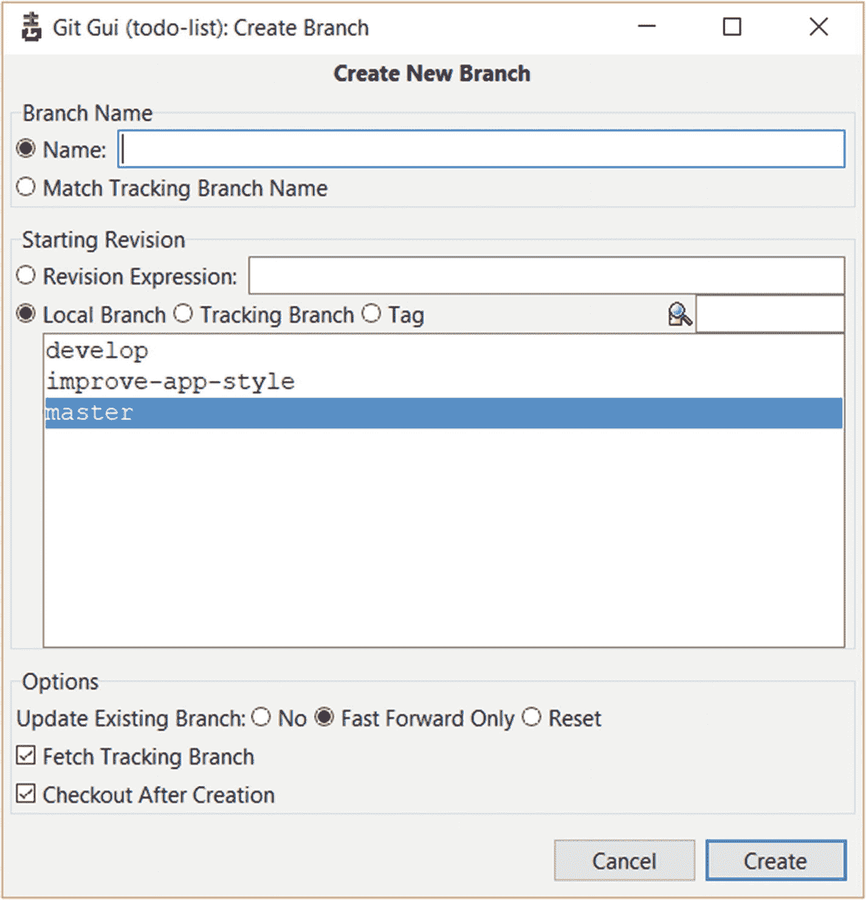

图 15-4

创建新的分支机构

第一个输入区域是最重要的:新分行的名称。将该分支命名为“分离代码和样式”

第二个输入是一个选择输入，您必须选择从哪里创建分支。在我们的情况下，我们将从本地主分支创建一个新分支；所以选择“本地分支”，选择“主”

第三部分是选项，我建议保留默认选项。使用默认选项，Git 将获取远程(跟踪)分支上的最新提交，然后签出新分支。

现在，您可以单击“创建”来查看结果。您将会看到左上角的小消息框现在将“单独的代码和样式”列为当前分支。为了让您看得更清楚，下面是我们刚才所做的命令等价物:

```
$ git checkout master
$ git branch -b separate-code-and-styles

```

现在我们进入了正确的分支，我们可以继续我们的提交了。还记得我们讨论 Git 工作流时的黄金法则吗？每次提交都必须以解决某个问题为目标。我会让你创造这个问题。

### 练习:创建一个问题

转到 GitHub 问题。

创建一个名为“分离代码和样式”的问题

记下发行号。

现在我们准备好提交了！在存储库中创建一个名为“style.css”的新文件，并粘贴以下代码:

```
h1 {
    text-align:center;
}
h3 {
    text-transform: uppercase;
}
ul {
    margin: 0;
    padding: 0;
}
ul li {
    cursor: pointer;
    position: relative;
    padding: 12px 8px 12px 40px;
    background: #eee;
    font-size: 18px;
    transition: 0.2s;
    -webkit-user-select: none;
    -moz-user-select: none;
    -ms-user-select: none;
    user-select: none;
}
ul li:nth-child(odd) {
    background: #f9f9f9;
}
ul li:hover {
    background: #ddd;
}

```

然后，打开“index.html ”,将其内容更改为

```
<!doctype html>
<html>
    <head>
        <meta charset="utf-8">
        <title>TODO list</title>
        <link rel="stylesheet" href="style.css" />
    </head>
    <body>
        <h1>TODO list</h1>

        <h3>Todo</h3>
        <ul>
            <li>Buy a hat for the bat</li>
            <li>Clear the fogs for the frogs</li>
            <li>Bring a box to the fox</li>
        </ul>

        <h3>Done</h3>
        <ul>
            <li>Put the mittens on the kittens</li>
        </ul>
    </body>
</html>

```

保存这两个文件，让我们跳到 Git GUI 来查看结果。你会看到…没什么新鲜的！因为 Git GUI 还不知道我们的更改。单击提交消息框附近的“重新扫描”以查看更改；您将得到如图 [15-5](#Fig5) 所示的结果。

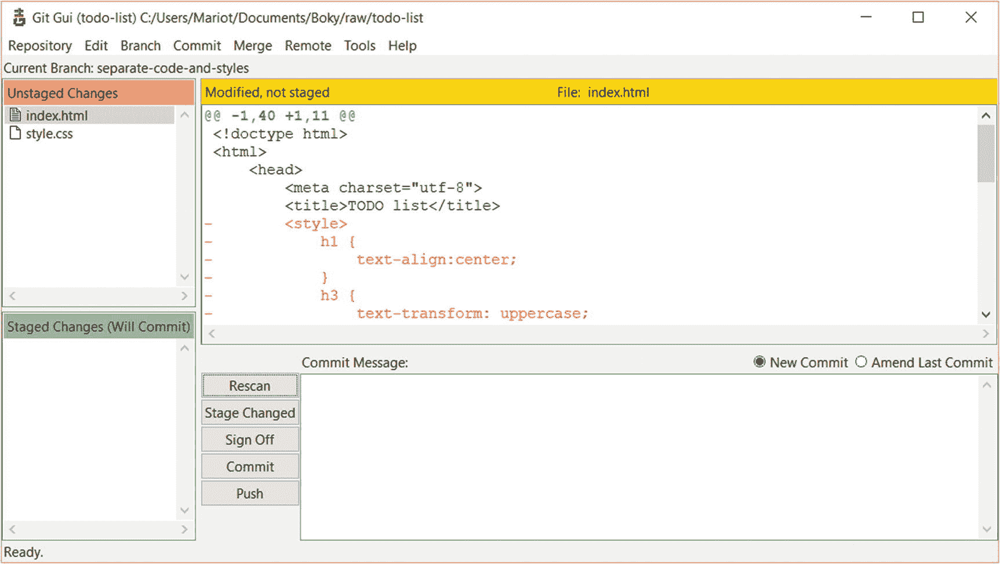

图 15-5

Git GUI 中显示的更改

现在我们有了我们的改变！您可以在 Git GUI 的左上方看到修改过的文件列表，这里是未登台的文件。您会注意到这些文件有不同的图标:

*   新文件的空文件图标(从未提交)

*   已修改文件的文件图标(以前是提交的一部分)

*   一个"？"已删除文件的图标(以前是提交的一部分)

那景色没有让你想起什么吗？嗯，当然是状态视图了！单击“重新扫描”等同于在终端上执行以下命令:

```
$ git status

```

在这里，我们修改了“index.html”并创建了“style.css .”如果您单击文件名(不是图标；先不要点击图标)，您将会看到 diff 视图的变化。查看图 [15-6](#Fig6) 中点击 style.css 后的结果示例。

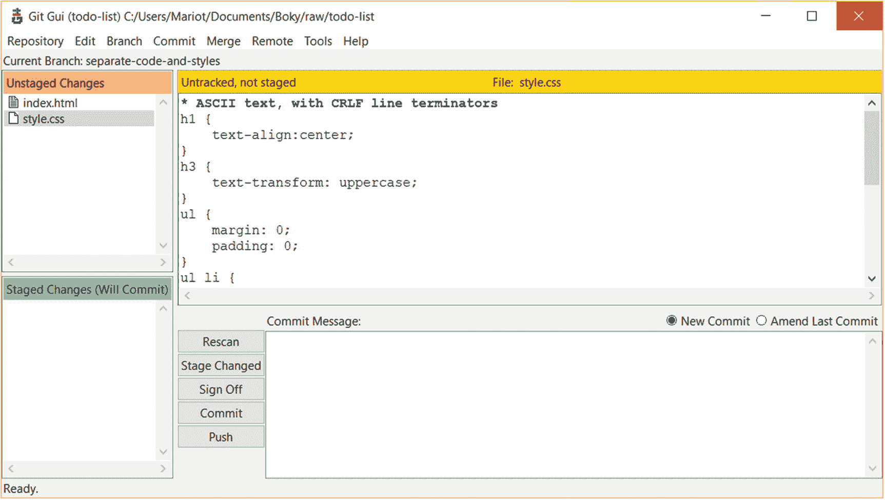

图 15-6

新创建的 style.css 文件的差异

这肯定比执行“git diff”要快！此外，如果你有很多修改过的文件，看起来更容易。因此，单击文件名相当于执行以下命令:

```
$ git diff index.html
$ git diff style.css

```

现在是准备提交文件的时候了。暂存和取消暂存文件非常简单:你只需点击它的图标。或者，您也可以选择要暂存的文件(通过单击其名称)，然后在“提交”菜单中选择“暂存以提交”。单击文件图标等同于执行以下命令:

```
$ git add index.html style.css
$ git reset HEAD index.html
$ git reset HEAD style.css

```

看到了吗？比输入命令要快得多！

我们终于可以提交我们的项目了！但是首先，确保您创建或修改的所有文件都是暂存的，这意味着它们位于左下部分。然后，您可以在 Git GUI 的右下部分编写提交消息，如图 [15-7](#Fig7) 所示。

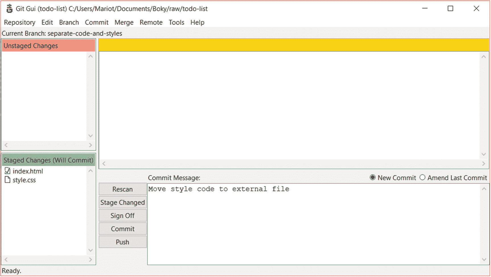

图 15-7

提交消息的写入

现在，我们的文件已暂存，提交消息已写入，我们准备好提交了。只需单击提交消息框旁边的“提交”按钮。这样做之后，Git GUI 回到正常的空状态。我们已经通过图形工具提交了！

因此，单击“提交”按钮会产生与此命令相同的结果:

```
$ git commit -m "Move style code to external file"

```

既然你是我最好的学生(不要告诉其他人)，我就让你在我们支部再干一次。

### 练习:再次提交

打开 README.md。

在文件末尾添加这一行:“许可证:麻省理工学院。”

创建名为 LICENSE 的新文件。

将 [`https://choosealicense.com/licenses/mit/`](https://choosealicense.com/licenses/mit/) 中的许可文本复制到许可文件中。

暂存这两个文件。

提交并显示消息“添加 mit 许可证”

哦！现在您的新分支上有两个提交，是时候将它们推送到远程存储库了。您肯定已经猜到了要单击哪个按钮；是“推”点击它将得到图 [15-8](#Fig8) 中的结果。

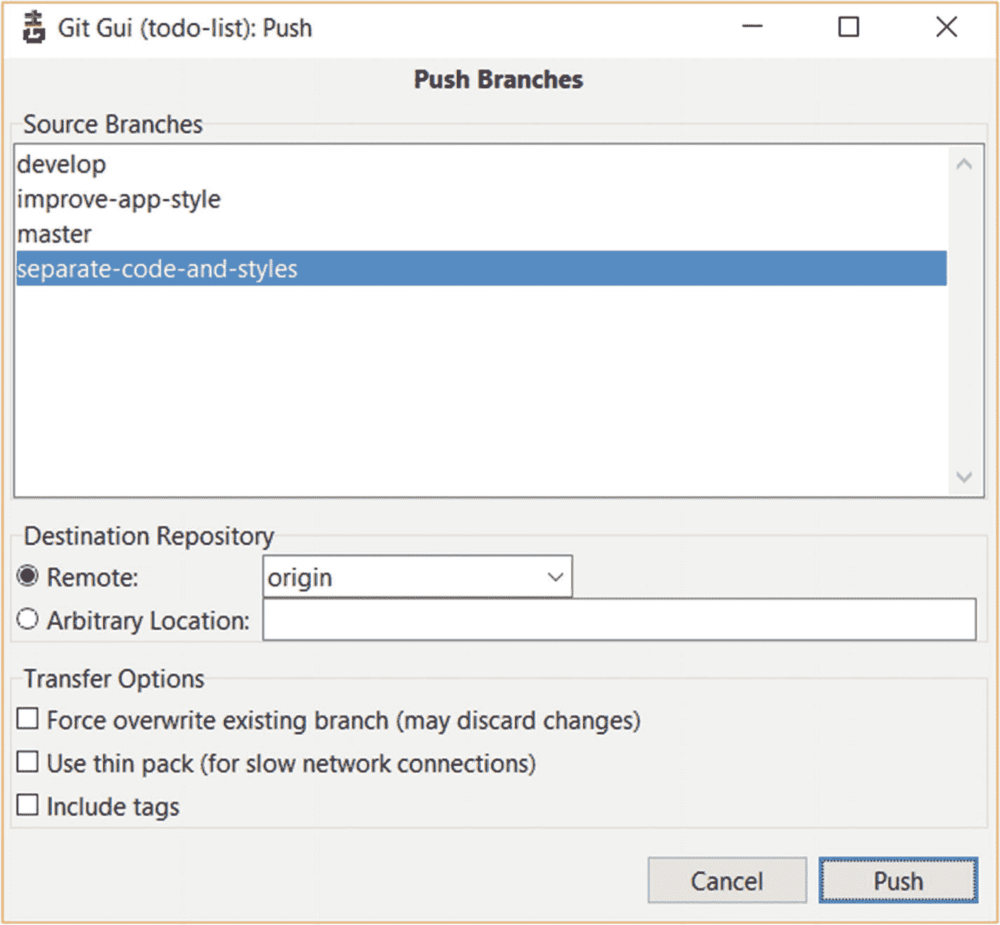

图 15-8

推树枝

这是一个简单的界面；你只需要选择你要推的分支和你要推的位置。

默认选择当前分支，所以我们不需要做任何改变。第二部分是目的地选择下拉列表；同样，我们不需要做任何更改，因为我们只有一个远程存储库。暂时忽略这些选项；我们将在后面的章节中看到它们。

点击推送推送！如果你使用 HTTPS 认证来连接 GitHub，你将被要求输入你的 GitHub 用户名和密码，然后得到如图 [15-9](#Fig9) 所示的结果。

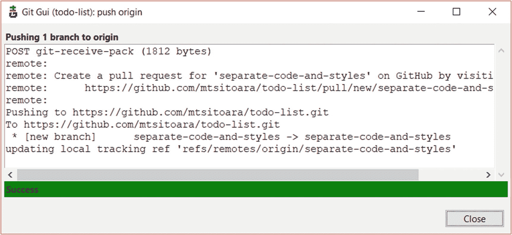

图 15-9

推送结果

### 小费

如果不想每次推送都写密码，可以缓存或者使用 SSL 认证；所有这些将在后面的章节中解释。

这里没有什么新东西，我们得到了与这个命令相同的结果:

```
$ git push origin separate-code-and-styles

```

### 练习:创建拉式请求

跟着推送后得到的链接走。

使用以下描述创建一个拉式请求:“修复#10”(用您之前创建的问题编号替换该编号)。

合并公关。

欢欣鼓舞。

这就是使用 Git GUI 提交的方式！简单吧？而且非常快。这是一个很棒的工具，可以在审查提交时节省您很多时间。谈到提交，让我们看看另一个默认工具！

### 浏览:gitk

在上一节中，我们讨论了很多关于创建和推送提交的内容。现在，我们将这些提交在它们的自然环境中可视化:存储库。gitk 是一个简单的工具，可以简单地查看您的项目历史。你可以把它想象成一个强大的“git log”命令。更多关于 gitk 的文档可以在 [`https://git-scm.com/docs/gitk`](https://git-scm.com/docs/gitk) 上找到。

既然已经打开了 git-gui，那就用它来打开 gitk 吧。只需从“存储库”菜单中选择“可视化所有分支历史”。这样做会打开 gitk，你会看到如图 [15-10](#Fig10) 所示的窗口。

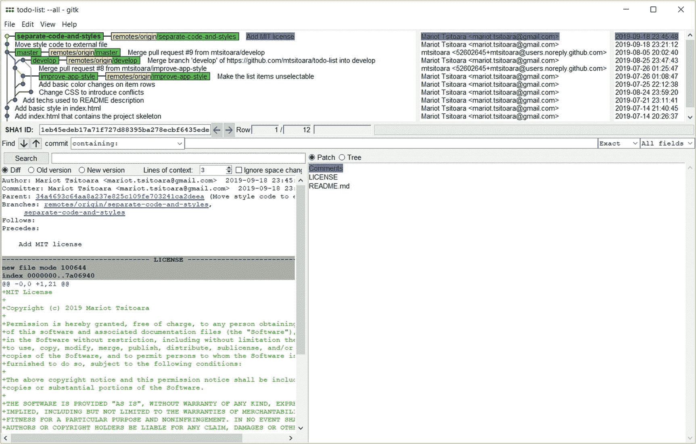

图 15-10

gitk 介面

在窗口的顶部，您会发现来自所有分支的所有项目提交的列表。它呈现在一个漂亮的图形视图中，您可以使用以下命令在控制台上再现它:

```
$ git log --oneline --graph

```

您可以单击提交以获得有关它们的更多信息。选择提交将更新窗口底部的视图。左下角也是一个不同的视图，但是有一点不同:你也可以选择查看文件的旧版本或新版本。右下部分是提交中更改的所有文件的列表。您可以单击它们来查看 diff 视图上的更改。单击提交相当于执行以下代码:

```
$ git show <commit_name>

```

Git 的默认浏览工具 gitk 就是这样！既然您现在可以使用默认的图形工具提交和浏览，那么是时候向您展示其他工具了。

## IDE 工具

正如我们在上一节中看到的，与在控制台中输入相比，使用图形工具提交非常快。但是仍然有一个问题:您必须离开您的集成开发环境才能使用它们。如果您可以直接从编辑器中使用图形工具，那不是很好吗？

对很多现代编辑来说这是可能的。我将向您介绍两个集成了 Git 的流行 ide，以便您可以在未来的开发中使用它们。如果你不想使用它们，或者你已经爱上了你当前的编辑器，如果足够现代的话，你的 IDE 也可以集成 Git 工具或插件。每个 IDE 都有自己的界面和用户体验，所以在这一节我就不赘述了。我只是想展示一下有哪些功能可用。

### Visual Studio 代码

一个非常流行的编辑器，Visual Studio Code，是微软支持的轻量级 IDE 你可以在 [`https://code.visualstudio.com/`](https://code.visualstudio.com/) 上找到它。它是新的，所以它集成了所有闪亮的新玩具；Git 是其中的核心。你可以在图 [15-11](#Fig11) 中看到 VS 代码的观感。

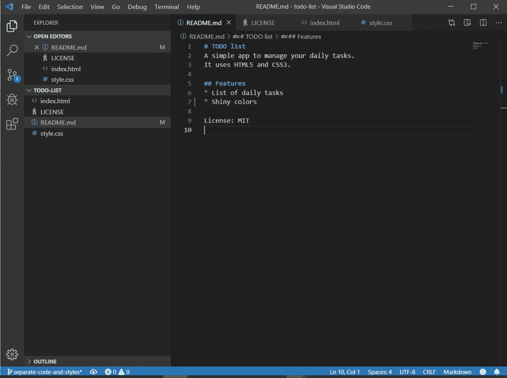

图 15-11

Visual Studio 代码

它与任何其他 IDE 具有相同的接口，但是有一点额外的好处:你可以到处看到 Git 的痕迹。第一，如果你更改了一个被跟踪的文件(此处为 README.md)，被编辑的部分会高亮显示；再也不需要执行 git diff 了！

并且在窗口的左下方，你有当前的分支名称；如果单击它，可以选择要导航到的分支或创建新分支。如果您有未分级的文件，在您的分支名称旁边会有一个小小的“⊙”符号，在相关的文件名旁边会有一个“M”图标。如果您已暂存未提交的推送文件，您会看到一个“+”号。

点击源代码控制图标进入 Git 选项卡，如图 [15-12](#Fig12) 所示。

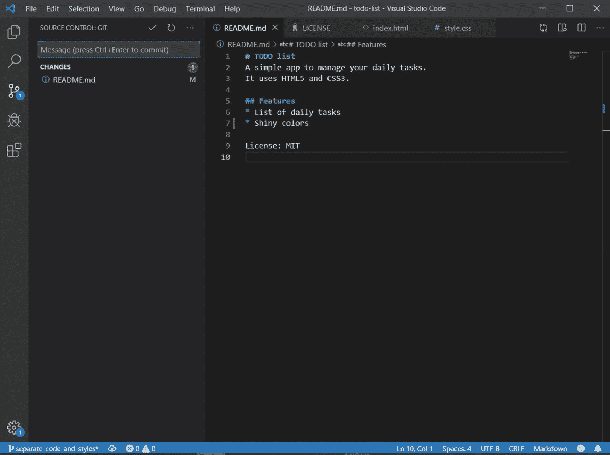

图 15-12

源代码管理视图

这个视图的外观和工作方式非常像 git-gui，所以我将让您自己去发现它！

### 原子

Atom 是 GitHub 推出的 IDE，也是开发人员非常喜欢的选择。你可以在 [`https://atom.io/`](https://atom.io/) 上查看。你可以在图 [15-13](#Fig13) 中看到它的界面。

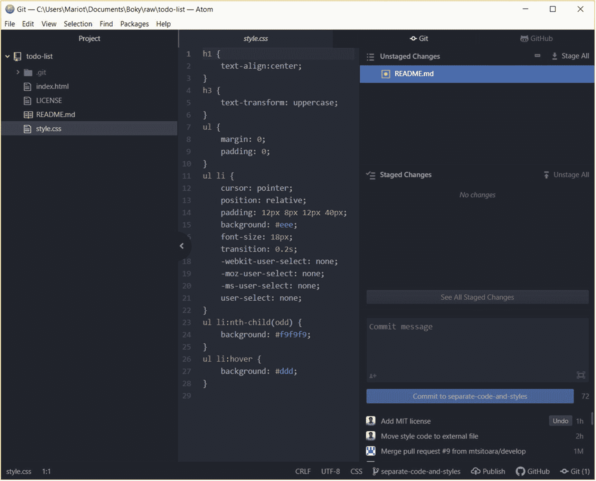

图 15-13

原子界面

它具有与 Visual Studio 代码相同的 Git 特性，但稍有改动:您可以将您的 GitHub 帐户链接到它，并直接从编辑器中创建 PR！同样，我会让你发现。

## 专用工具

我们看到了默认的 Git 工具和一些集成了 Git 的 ide。现在，我们来看一些专门为 Git 开发的工具。

### GitHub 台式机

如果你喜欢默认的 gitk 和 git-gui 工具，但讨厌它们的界面，GitHub Desktop 是你的完美工具。让我们面对它，默认的工具是伟大的，但他们的外观在现代感觉很奇怪。GitHub 桌面(在 [`https://desktop.github.com/`](https://desktop.github.com/) 上找到)已经被创造出来取代那些工具；它把它们所有的功能都集成在一个软件中。GitHub 桌面界面可以查看图 [15-14](#Fig14) 。

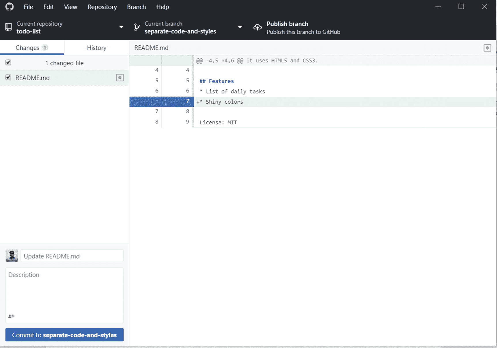

图 15-14

GitHub 台式机

### 基特克拉肯

GitKraken 是 Axolosoft 创建的 Git 客户端，越来越受欢迎。你可以在它的网站 [`www.gitkraken.com/`](http://www.gitkraken.com/) 上得到它。它比所有其他工具都更先进，因为它的目标是提高开发人员的生产力。它甚至有一个集成的代码编辑器！你可以在图 [15-15](#Fig15) 中看到它的界面。

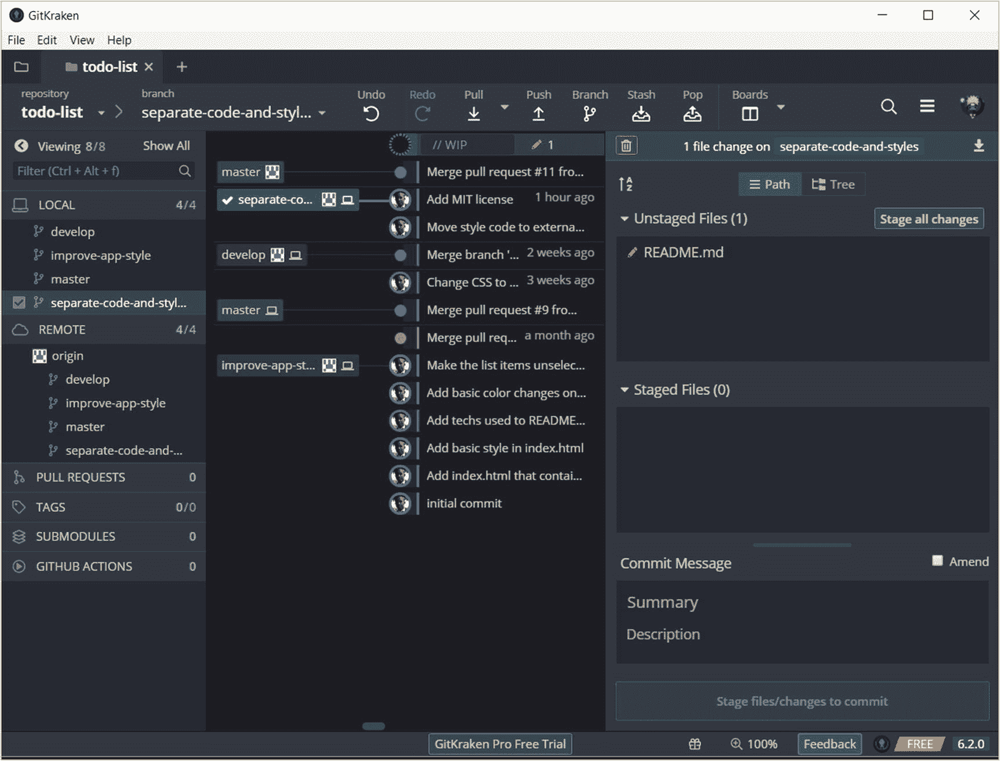

图 15-15

gitkraken 概览

同样，界面和其他的一样，但是让 GitKraken 与众不同的是它的美丽:美得令人疯狂！

## 摘要

这一章很有趣，不是吗？我们学到了很多关于如何使用图形工具来提交和浏览它们的知识。我们还发现了大量可供我们使用的新工具，无论是集成到 IDE 中的工具还是专用工具。我们怎么能忘记我们的旧默认工具呢？！

你可能会问自己为什么不从一开始就使用图形工具？这是因为在不了解工具背后的概念的情况下使用工具会适得其反，而且是浪费时间。相信我，学习使用终端是值得的！谈到终端，让我们回到更高级的 Git 命令！