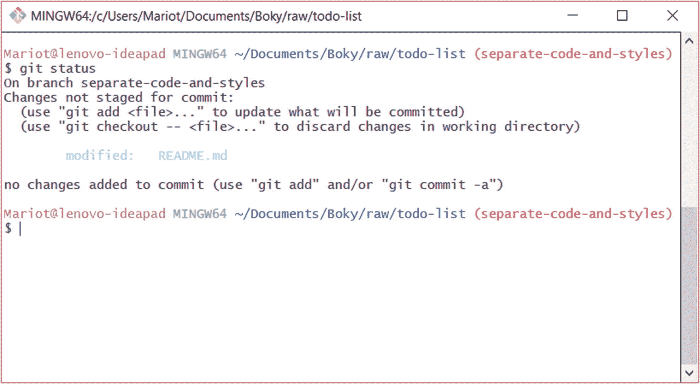
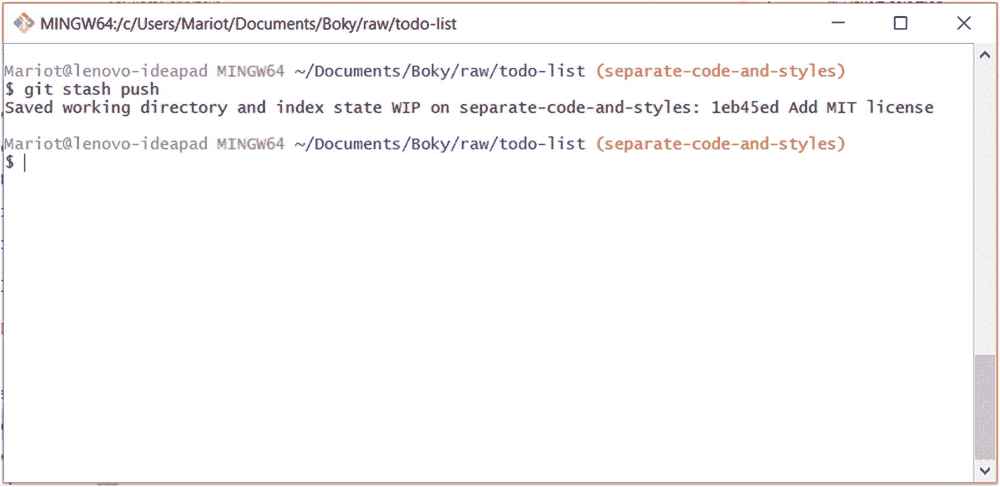
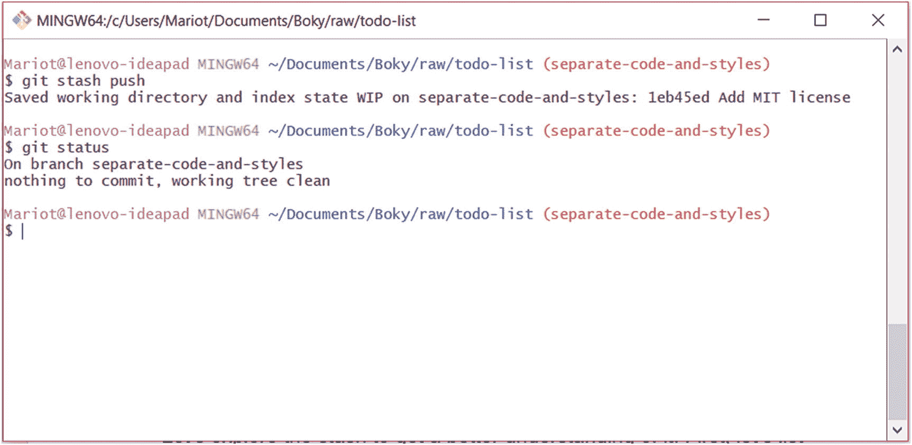
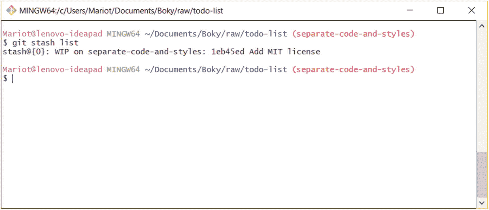
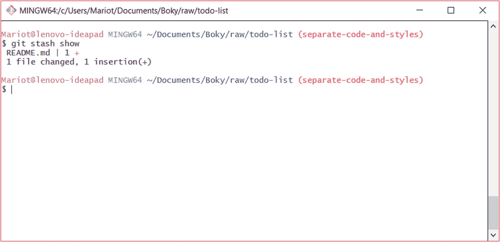
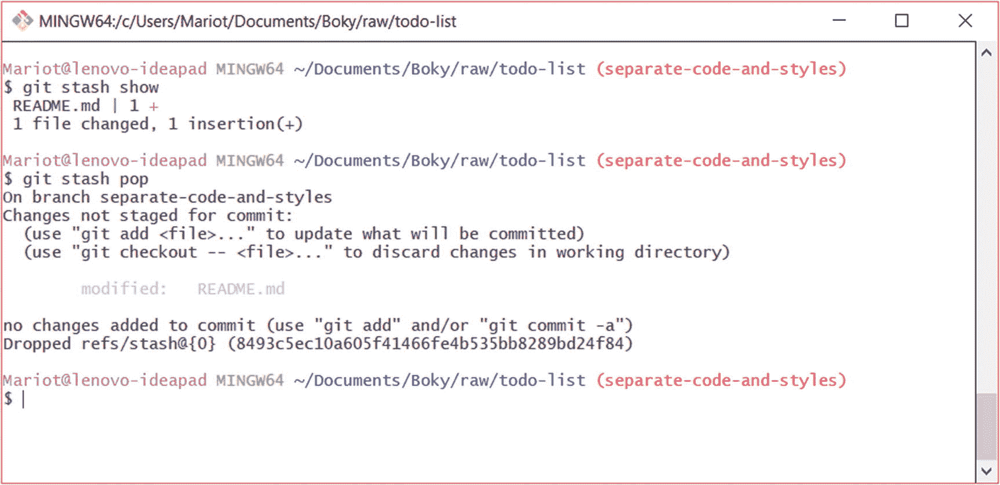
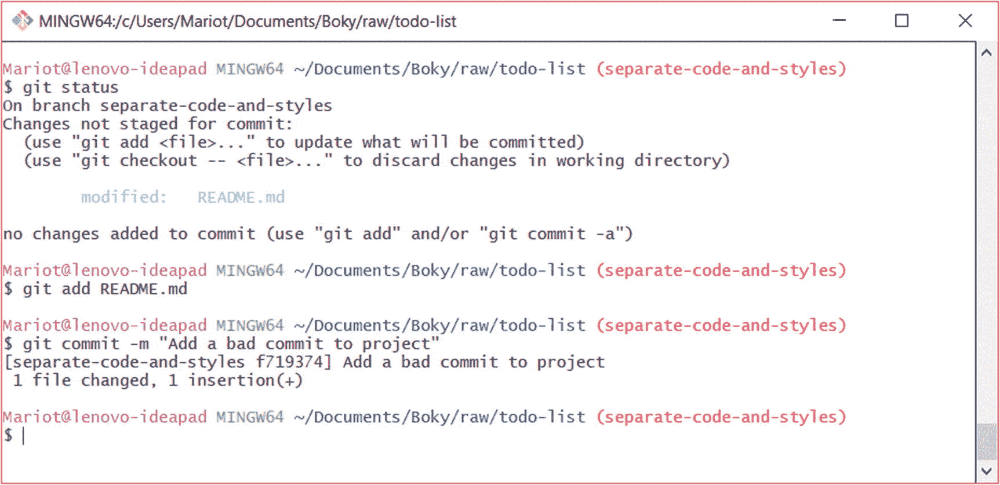
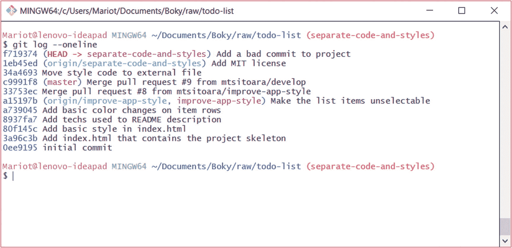
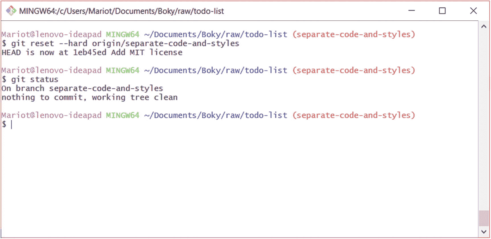

# 十六、高级 Git

上一章，我们学习了如何在图形环境中实现基本的 Git 特性。现在，让我们来看看更多的 Git 命令，这些命令您不会像其他命令一样经常使用，但是对于更好的工作效率来说是强大而必要的。这些都是非常容易学习的命令，如果您在使用 Git 时犯了错误，这些命令将对您非常有用。

我们将会看到一些你在使用 Git 几次后肯定会遇到的常见问题。然后我们将看到解决它们的最简单的方法。这是一个非常简单的章节，但是我们将学习一些强大的 Git 特性。

## 恢复

在前面的章节中，我们已经看到了如何恢复提交。但是大多数时候，您想要做的只是将单个文件恢复到以前的状态。这通常发生在当你编码了一段时间后才意识到你的整个策略是错误的时候。与其敲 Cmd-Z 几百次，不如还原文件。

您可能已经知道如何做到这一点，因为 git 会在您检查 Git 状态后告诉您如何做到这一点。首先，让我们打开 README.md，然后在其中添加一些文本。

```
# TODO list
A simple app to manage your daily tasks.
It uses HTML5 and CSS3.

## Features
* List of daily tasks
* Pretty colors

License: MIT

```

现在，让我们看看状态。

```
$ git status

```

像往常一样，您将看到您的存储库的状态(如图 [16-1](#Fig1) 所示)。



图 16-1

更改文件后的 Git 状态

这里没有什么新内容，但是请注意修改后的文件上面显示的指令。如您所见，将文件恢复到以前的状态只是意味着将其签出。命令是这样的

```
$ git checkout -- <file>

```

此命令将放弃您对特定文件所做的任何更改。使用时要小心，不要擦除有价值的代码。使用 GUI 可能会更好，这样您就可以在丢弃它们之前快速获得当前更改的详细视图。让我们用下面的命令尝试放弃对 README.md 的更改。

```
$ git checkout –- README.md

```

您不会从这个命令得到任何响应，但是如果您再次检查 git 状态，您会看到 README.md 回到了它以前的状态。

## 隐藏

很多时候，您想要在分支之间导航，但是因为您的工作目录是脏的而不能。在这种情况下，脏意味着您有未提交的已更改文件，无论它们处于已修改或暂存状态。改变分支的唯一方法是首先提交它们。但是大多数时候，你还没有准备好做出承诺，因为手头的问题还没有解决。

对此的一个解决方案是进行临时提交，改变分支，处理它，然后返回并修改临时提交。这种方法有很多问题:首先，当您提交时，您的工作目录将是干净的，这意味着您不再知道哪些文件被更改了。第二，这是一个简单的肮脏和丑陋的方法。这并不是创建 amend 命令的原因。

理想的解决方案是使用一种叫做“隐藏”的技术 Stashing 意味着将任何修改过的跟踪文件放在工作目录中，并放在一边以备后用。这意味着您将拥有一个干净的目录，并且可以在您的存储库中导航，而不必提交您的更改。这些变化存储在一个叫做“stash”的小数据库中。您可以将 stash 看作是未完成提交的临时存储库。它被设计成一个后进先出的数据库，这意味着你最后保存的更改将首先呈现给你。理解它的最好方法是尝试。所以，让我们再次更改我们的 README.md 文件。

```
# TODO list
A simple app to manage your daily tasks.
It uses HTML5 and CSS3.

## Features
* List of daily tasks
* Pretty colors

License: MIT

```

如果检查状态，您会看到 README.md 已被修改，但未转移。你会得到与先前相同的结果(图 [16-1](#Fig1) )。

现在让我们假设当你在处理这个问题的时候，有一个紧急的问题需要你的关注。显然，您现在不能检查主分支，因为您的工作目录是脏的，并且您不能恢复您当前的更改，因为您还没有完全完成。解决方案是把你当前的修改藏在某个地方，这样你就可以有一个干净的目录来工作。为此，您必须使用 stash 命令，这非常简单:

```
$ git stash push

```

### 注意

仅仅使用命令“git stash”和使用“git stash push”是一样的。建议使用完整命令，因为它更直观，更容易理解。

这个命令将获取您修改过的文件，暂存它们，并在存储中创建一个临时提交，保持您的工作目录干净。试试看，你会得到如图 [16-2](#Fig2) 所示的结果。



图 16-2

粉碎当前的变化

如您所见，您隐藏的更改被赋予了名称和描述，就像常规提交一样。这很正常，因为 stash 只是一个只有一个分支的临时存储库。如果您检查存储库状态，您将得到一个干净的工作目录(如图 [16-3](#Fig3) 所示)；你最终可以导航到其他分支。



图 16-3

存储推送产生一个干净的工作目录

因此，将改变放入存储库可以给你更多的行动自由，而不会丢失你当前的工作。在快节奏的开发中非常有用。

### 警告

即使这不是一本关于生产力的书，这里有一个小提示:如果你发现自己在问题之间来回跳跃，当然你的问题是你的优先事项，同时解决两个问题会花费你宝贵的时间。

由于 stash 只是一个小型存储库，因此您可以在其上执行大多数 Git 特性，比如检查历史日志或获得详细的变更视图。让我们探索一下藏毒之处，以便更好地了解它。首先，让我们使用 stash list 命令显示历史日志。

```
$ git stash list

```

这将为您提供一个熟悉但简化的历史日志视图，如图 [16-4](#Fig4) 所示。



图 16-4

隐藏的更改列表

正如我们前面所说的，这个数据库是基于后进先出的，所以如果我们对我们的工作目录做了其他的修改并保存了它们，它们将会出现在我们当前保存的目录之上。

你会注意到在图 [16-4](#Fig4) 中，每个贮藏都有一个数字。这种方式更容易与它们交互，不像提交时必须用名字来称呼它们。让我们通过使用命令 stash show 来查看我们隐藏的变更的详细视图。

```
$ git stash show

```

这个简单的命令将向您显示在存储区顶端更改的文件，这意味着最后的更改被推送到存储区。查看图 [16-5](#Fig5) 中的示例。



图 16-5

藏毒点的详细视图

stash show 命令只会向您显示包含在 stash 中的变更的描述，而不会显示其他内容。要查看更改，您必须应用存储。应用存储非常简单:只需执行下面的命令。

```
$ git stash pop

```

该命令将获取存储中的最新更改，并将其应用到当前分支。顾名思义，弹出更改会将它们从存储中取出。所以，如果你的储物袋里只有一套零钱，那么在你掏出小费后，它就会是空的。如果您执行前面的命令，您得到的结果将与您重新创建更改然后检查状态的结果相同(如图 [16-6](#Fig6) 所示)。



图 16-6

弹出最后一组更改

我们又回到了起点！但是，如果我们愿意，我们可以改变分支，提交，或推到原点，而不会丢失我们宝贵的变化。当您想将当前的更改放在一边，以便在其他地方进行快速更改时，隐藏特别有用。根据经验，如果您需要使用不止一组隐藏的变更，那么您的工作流就有问题。

## 重复定位

我希望你不要经常使用这个功能，因为它的破坏性很大！有时，你想放弃你所做的一切，重新开始工作，即使你已经提交了你的项目。为了更好地理解它，让我们创建一个提交，然后丢弃它。

在 README.md 上做一些修改，进行 stage，然后提交项目，如图 [16-7](#Fig7) 所示。



图 16-7

向项目添加错误的提交

为了正确理解这一点，让我们使用 git log 命令在提交之后检查当前的历史日志。

```
$ git log --oneline

```

该命令将显示该分支上的最新提交，如图 [16-8](#Fig8) 所示。



图 16-8

当前分支的历史日志

如您所见，我们的最新提交位于日志的顶部。注意，HEAD 引用指向它；这意味着我们的下一个提交(或分支)将该提交作为父提交。您还会注意到，远程分支来源/分离代码和样式没有改变；那是因为我们的项目还没推。

但是让我们想象一下，你对上一次提交完全不满意，想重做一次。然后，您唯一的选择是将分支重置回之前的状态。为了重置项目，我们使用 git reset 命令，后跟要重置到的项目状态。您必须使用选项"- hard "来实现这一点，因为这是一个非常危险的命令。例如，返回到与远程分支相同的状态将需要以下命令:

```
$ git reset --hard origin/separate-code-and-styles

```

此命令将删除所有内容，以便项目可以恢复到以前的状态。见图 [16-9](#Fig9) 其结果。



图 16-9

重置后项目的状态

由于“- hard”选项会覆盖其路径上的所有内容，因此在目标状态之后所做的提交、当前更改和暂存文件都将被删除。这是 Git 中最危险的命令，在使用之前应该仔细考虑。

复位只能在万不得已的情况下进行。如果可能的话，最好恢复提交，或者直接继续在新的分支上工作。如果使用不慎，重置可能会破坏您的数据。

## 摘要

这一章讨论了 Git 的一些高级概念，当你面对某些情况时，这些概念会对你有用。您需要使用 reset 来轻松地将文件恢复到以前的状态；当然，您也可以使用 GUI 恢复这些更改。如果你需要快速改变环境，藏起来也会非常有用。最后，硬复位是一个非常强大的功能，非常具有破坏性；不要，除非你没有其他选择。

我们关于高级 Git 命令的课程到此结束。现在让我们回到 GitHub，来发现更多可以帮助我们进行项目管理的特性。