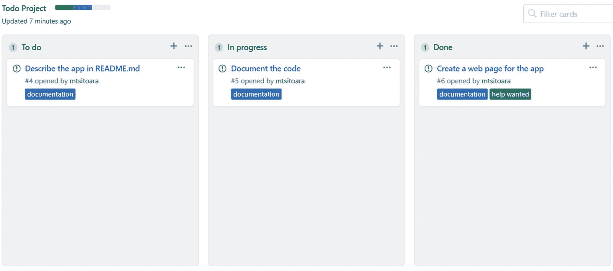

# 17.更多关于 GitHub 的信息

在前几章中，我们已经看到了几乎每一个你每天都会用到的 Git 特性。现在，让我们把目光转向 GitHub，它直到现在还只是一个代码托管站点。但是我们已经确定 GitHub 远不止于此。您可以使用它来托管项目文档和托管软件版本。您还将主要使用它作为项目管理工具和与合作者联系的方式。让我们来了解一下这些特性。

## 维基百科

你的项目可能是同类项目中最好的，但是如果其他人不知道如何使用它或如何工作，你将一事无成。这就是为什么文档很重要，尤其是在软件开发中。GitHub 提供了一个很好的方法来记录你的项目:wikis。

GitHub wikis 的工作方式与世界上最流行的 wiki: Wikipedia 基本相同。它的目标是提供关于你的项目的深入信息:它是做什么的，它是如何工作的，有人如何贡献…

让我们为我们的项目创建一个 wiki 页面，这样我们可以更好地理解它。只需进入你的项目主页，点击“wiki”；您将到达图 [17-1](#Fig1) 所示的页面。


图 17-1

Wiki 主页

你会在 wiki 主页上看到一个大的行动按钮，点击它创建你的第一个 wiki 页面。您将到达页面创建页面，如图 [17-2](#Fig2) 所示。


图 17-2

页面的创建

如您所见，这是一个非常简单的视图，分为三个部分:标题、内容和编辑消息。把标题想象成一个网页标题，所以它必须遵循同样的标准:它必须是清晰的、吸引人的。内容应该以 Markdown 格式编写，就像 README.md 一样。你可以选择以其他格式编写维基，但 Markdown 是推荐的选择，因为许多编辑已经在使用它，它更容易阅读。编辑消息就像提交消息一样，是对您提议的更改的简单描述。

更改您的维基中的内容；这里有一个例子:

```
# What is this

This is a simple app to track your daily goals

# Why another TODO app

Because that is never enough TODO apps in the world

# How does it work

Open `index.html` and update the goals as you wish

# How can I contribute to the project

You can contribute by forking the project and proposing Pull Requests. Check [Issues](https://github.com/mtsitoara/issues) to see the current areas that need help

```

保存更改，您将被重定向到 wiki 主页，如图 [17-3](#Fig3) 所示。


图 17-3

显示新创建的维基的维基主页

如您所见，您刚刚创建的 wiki 在您的项目页面上自动可见，并且您创建的每个页面将出现在右侧的侧边栏上。

你可以想做多少维基页面就做多少，但要确保它们是可理解的和有用的；别忘了添加图片和相关链接！

## github pages-github 页面

简而言之，GitHub Pages 是一个在 GitHub 上为你托管的网站。你可以用它来展示一个项目，管理你的作品集，或者只是把它作为你简历的在线版本。

GitHub 页面可以是你的个人账户(作品集和简历)，也可以是你的项目(展示)。如果你决定使用它作为你的帐户，你只能创建一个页面；但是如果是为了您的项目展示，您可以为其中任何一个项目创建一个页面。你可以查看 [`https://pages.github.com/`](https://pages.github.com/) 以获得更好的解释。

让我们假设您想要创建一个页面来展示您的待办事项列表项目。首先，你需要回到你的项目页面，点击“设置”；您将进入图 [17-4](#Fig4) 所示的页面。


图 17-4

设置页面

向下滚动到页面设置，如图 [17-5](#Fig5) 所示。


图 17-5

GitHub 页面设置

第一个选项是包含页面源位置的下拉列表。您必须在主分支上承载您的页面，但是您有两个位置来存放源文件。一个是直接上 master 另一个在 master 上一个名为“docs”的目录下。我推荐第二种选择，因为它对任何访问者来说都更清晰。然后，我们必须首先创建该目录。

使用 GitHub 或 Git 工具，在 docs 目录下创建一个名为 index.html 的文件。在文件中，只需编写一些基本的 HTML:

```
<!doctype html>
<html>
    <head>
        <meta charset="utf-8">
        <title>Docs</title>
    </head>
    <body>
        <h1>Docs</h1>
        <p>Example of documentation</p>
    </body>
</html>

```

这将是你的文件。因此你的主树枝必须看起来像我的，如图 [17-6](#Fig6) 所示。


图 17-6

文档文件夹和 index.html

然后，我们可以返回到设置页面，并选择文档的来源。选择 docs 文件夹作为源，页面将重新加载并显示如图 [17-7](#Fig7) 所示的链接。


图 17-7

页面已发布

如果你点击显示给你的链接，你会看到你的 GitHub 项目页面的壮丽景色！可能性是无限的，因为你可以像设计任何其他静态网站页面一样设计你的页面！如果想要更好的风格，勾选[`https://jekyllrb.com/`](https://jekyllrb.com/)；它可以帮助您立即生成 GitHub 页面！

### 小费

由于你的项目是一个静态的 HTML 页面，你可以指向它作为你的页面的位置；你会得到它的实时版本！

## 放

您的项目不会无限期地处于开发阶段；它迟早会被释放。还有什么平台比 GitHub 更适合发布你的应用呢？这很容易。

再次返回到您的项目页面，然后单击“发布”；您将看到如图 [17-8](#Fig8) 所示的主页面。


图 17-8

发布页面

让我们创建我们的第一个版本！点击行动号召按钮，您将看到发布创建视图，如图 [17-9](#Fig9) 所示。


图 17-9

发布创建表单

这是一个非常容易填写的表格，因为各个部分简单明了。要做的主要事情是通过将发布的二进制文件放到前面的表单上来上传它们。因为我们的应用是 HTML 格式的，所以让我们附上 master 分支的压缩版本。对于可安装的应用，它将是一个要执行的二进制文件；对于我们来说，它将是 zip 和 7z 文件。如果需要的话，不要忘记改变发布的目标。默认选项是主分支，但是您可以指向另一个分支或特定的提交！该表单将与图 [17-10](#Fig10) 所示的表单相同。


图 17-10

用二进制文件填充的发布表单

单击“发布”查看结果。您将被重定向回发布列表，并在那里看到您的新版本！查看图 [17-11](#Fig11) 中的示例。


图 17-11

所有版本的列表

如您所见，GitHub 也自动将源代码捆绑到您的发行版中！创建发布时要小心；务必正确测试和重新测试一切！

## 项目板

项目板是 GitHub 的一个非常有用的特性，因为它提供了一种跟踪和组织项目的方法。例如，您可以为您的任何新想法创建卡片，以便稍后与您的团队讨论。但是项目板的主要用途是跟踪项目的进展。它超越了问题，因为问题仅仅描述了一个特性或者一个需要解决的 bug 但是 Project Board 可以告诉你是否有人正在做，或者只是一个要执行的计划。

理解项目板的最好方法是直接用它们做实验。所以回到你的项目页面，选择“项目”您将得到如图 [17-12](#Fig12) 所示的空项目。


图 17-12

项目主页

项目主页仍然是空的，因为我们还没有创建任何项目。它还向您展示了您想要使用项目板的不同情况。单击“创建项目”继续；您将获得如图 [17-13](#Fig13) 所示的视图。


图 17-13

项目的创建

同样，这是一个非常简单的形式。但是请注意模板:它非常重要。作为初学者，你应该使用基本的看板模板，因为它是一个预填充的模板。您可以选择自己创建板，但现在，让我们坚持基础。创建项目，您将会看到如图 [17-14](#Fig14) 所示的半空板。


图 17-14

新项目已创建

如你所见，创建了三块板:“待办事项”、“进行中”和“完成”就像我们的 app 一样！在屏幕右侧，您可以看到我们未解决问题的列表。将这些问题拖放到各自的板上。在“待办事项”板上，你有一个你可以用你的板子做什么的小例子；它不仅适用于问题，也适用于拉取请求或简单的注释。在你把你的问题放在想要的板上后，你会得到如图 [17-15](#Fig15) 所示的结果。



图 17-15

我们的第一个项目板

一点小奖励:当你在棋盘上移动问题时，项目名称附近的彩色条会改变。这是一个跟踪你进步的好方法！

但是项目板不仅仅是一个项目进度追踪器！您可以为许多情况创建项目板:发布跟踪、会议记录、开发人员想法记录、用户反馈……您可以在图 [17-16](#Fig16) 中找到本书的项目板，您也可以在 [`https://github.com/mariot/boky/projects/1`](https://github.com/mariot/boky/projects/1) 上找到。


图 17-16

本书的当前项目板

我建议你在未来的项目中使用项目板，因为对自己的进展有一个清晰的认识是通往成功的必由之路。如果你感到无畏，你也可以检查自动看板，它会自动为你移动卡片！例如，每一个新问题将被填入“待办事项”下，而每一个已关闭的问题将被移至“已完成”

## 摘要

这一章让我们暂时离开 Git，把注意力放在 GitHub 上。我们已经看到 GitHub 不仅仅是一个代码存储库，而是一个管理和发布项目的完整工具。读完这一章后，你应该能够设计一个迷你网站，并拥有一些文档。你也应该有你的应用的第一个版本。

前面展示的最重要的特性是项目板。用它们来清楚地了解你做了什么，你要去哪里。它们看似简单，但在项目管理中非常有用。

您现在已经掌握了 Git 和 GitHub 的基础知识。但是在你的道路上仍然有障碍:你仍然不确定在真实世界的环境中等待着你的是什么。在下一章，我们将探讨你在与他人合作时肯定会面临的问题以及如何解决它们。敬请关注！