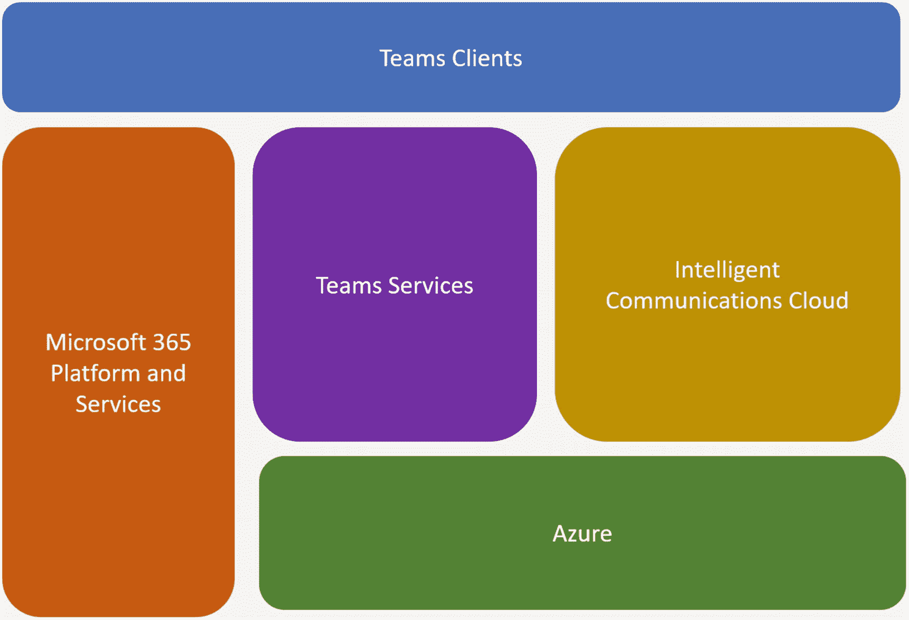

# 1.概述:微软团队开发平台

本章涵盖了组织工作的发展方式，以及员工如何与您的应用程序交互，以及您的应用程序如何与员工交互。我们将讨论团队的可扩展平台和能力，以及针对您的业务线的不同类型的业务解决方案机会。

我们还将发现高层架构，以及团队客户机和关键服务如何一起工作来交付团队功能。这包括对消息传递如何工作、数据存储在团队中的何处、数据如何流入和流出团队以及遵从边界在哪里的高级理解。

最后，这一章讲述了为什么你必须为团队开发应用程序，并投资为团队开发定制的解决方案。

## 目标

这本书有助于理解团队中可用的开发人员平台以及可以创建的应用程序类型。随着 Teams 与许多 Microsoft 365 服务的集成，我们需要了解 Teams 架构如何支持可扩展性，以及我们的应用程序如何使用现有的系统组件。接下来，我们将深入研究团队的解决方案开发。这本书解释了机器人，消息操作，消息扩展，任务模块，个人应用程序，等等。

下一步是通过使用加速器使开发变得轻量级。PowerApps 和 Flow 以及其他无到低代码工具帮助团队快速构建解决方案。您还可以利用 SharePoint 开发中的现有技能。

最后，我们将通过了解最佳实践、应用打包和发布以及通过商店提供应用来完善我们的学习，并了解开发人员在团队中可以做些什么。

## Microsoft 团队概述

如今的员工比以往任何时候都更具移动性、社会性和全球性。人们有不同的技术背景，对沟通和协作工具有不同的期望。但是不管人们更喜欢什么样的电话和会议工具，有一点是明确的:他们的大部分时间都花在了合作上。我们想让这变得更容易。

如果你不提供工具来支持这些新的工作方式，会发生什么？为了完成眼前的任务，最终用户下载消费级工具，这给最终用户带来了摩擦，因为他们必须管理多次登录并在不同的体验之间切换，并且随着影子 it 的发展，给组织带来了风险。

所有领导者关心的事情之一是确保他们所有的 IP 和信息是安全的。人们正在寻找一种协作解决方案，它适用于多样化的劳动力，包括社交用途的各个方面，基于现代和安全的东西，这就是团队和微软 365 所提供的。

Microsoft 365 有助于在团队内部与项目中的工作人员进行更有效的沟通。它使人们能够在任何设备上工作，无论是移动设备还是您的计算机。企业最重要的目标之一是自动化业务流程，作为一个平台，团队提供了实现这一目标的方法。

此外，人们真的希望定制他们的工作场所，尤其是当他们与一群人一起工作时，他们希望根据他们正在工作的内容定制空间。在做所有这些事情的同时，他们还在考虑如何保护对企业的访问，从而保护他们的信息并抵御网络威胁。

## 团队架构

当我们讨论架构、安全性和法规遵从性时，记住这三个原则很重要:

*   专为云设计

*   大规模敏捷性

*   扩大 Office 365 的价值

如果它是设计出来的，那它就是为云而建的。(它可以在内部运行吗？否)团队希望能够利用所有最新、最棒的 Microsoft 365 服务和功能。

团队架构的另一个优势是它可以大规模敏捷。快速交付和能够快速推出新功能是一些主要目标。如果你使用团队已经有一段时间了，你会经历这种快速发展。团队目前每周大约有一个构建。但不仅仅是新功能；如果也有一些东西需要修复，一个团队的工程团队可以很快地修复它，并把改变传达给客户。

如果您熟悉团队，您会知道它是一个以聊天为中心的工作区，是一个团队合作的中心，汇集了 Office 365 中的许多功能:组、规划器、Power BI、SharePoint、Office、Excel、Word、Visual Studio Teams 系统，以及您可以通过选项卡、连接器和机器人引入的合作伙伴服务。所有这些不同的部分将以一种方式集成，使它们更好地结合在一起，并允许您的团队使用它们进行协作。

### 团队加入微软 365 智能通信

从架构角度来看，Teams 将 Office 365 和 Skype 结合在一起，因此 Teams 位于 Office 365 和 Skype 之间，位于 Azure 之上。团队内部的服务实际上是一个编排层，它将其他部分汇集在一起，然后使您能够将一个现代组附加到一组聊天中，或者确保在您创建团队和任何人都可以使用的可扩展 Azure 基础架构时提供 SharePoint 站点。比如将一个现代群组附加到一组聊天中，或者确保在创建团队和可扩展的 Azure 基础架构时提供 SharePoint 站点，你们任何人都可以使用这些基础架构。见图 [1-1](#Fig1) 。

图 1-1

微软团队架构

From an architecture perspective, Teams brings together Office 365 and Skype, so Teams sits between Office 365 and Skype and on top of Azure. The services inside Teams are really an orchestration layer that brings the other pieces together and then enables you to attach a modern group to a set of chats or to make sure a SharePoint site is provisioned when you create a Team and scalable Azure infrastructure that can be used by anyone. Things like attach a modern group to a set of chats or to make sure a SharePoint site is provisioned when you create a Team and scalable Azure infrastructure that any of you can use. See Figure

### 团队服务

让我们仔细看看我们所说的“中间层”这些是团队工程团队为创建团队而构建的服务，而其他服务需要依赖关系。它是一组微服务的集合，每个微服务都有特定的功能。它被构建为允许它单独部署每个部分。参见图 [1-2](#Fig2) 。

图 1-2

团队服务

Let’s take a closer look at what we call the “middle tier.” These are the services that the Teams engineering team built to create Teams vs. the other services that take dependencies. It is a collection of microservices that all have a specific function. It has been built to allow it to deploy each piece separately. See Figure

其中大多数都有更多的编排组件。但团队所做的是，所有 O365 (Office 365)功能都被占用，所有现代 Skype 基础设施都被集中在这个以聊天为中心的现代工作空间，即团队合作的中心。它是一组前端服务器，允许 It 发送 HTML/JavaScript/TypeScript 有效负载，并使我们能够处理配置，以便您获得具有正确功能集的正确产品版本。

身份:Microsoft Teams 拥有并管理一个活动目录同步，以确保您的团队和现代团体保持同步。他们也有认证。这是一个神奇的地方，他们能判断出你是否有许可证，团队是否开启，或者你是否有权使用它。然后为了合规，他们拥有两个服务。一个叫做审计，另一个叫做保留挂钩。

审计服务是捕获来自团队的所有事件的地方，包括像创建团队、创建通道和删除通道这样的事件。所有这些都是您的 It 管理员想要了解的。团队将这些注入标准 O365 基础架构，因此您可以在安全和合规中心的审核日志中看到它们。团队保持持续的聊天，无限期地保存数据。但是一些组织认为这些数据是一种负担，一旦他们认为这些数据不再有用，就想把它们处理掉。

团队还处理通知。聊天服务中有一个消防水管，可以为我们提供每条消息，如果你在过去的 60/ 90 分钟内没有在线，但你有一条新消息，团队可以向你发送电子邮件或推送通知。

团队管理是完成所有管理工作的地方，如创建团队、创建 SharePoint 团队网站和创建 Office 365 组。对于可扩展性，Teams 有一组服务来支持，图形 API、选项卡和 bot 创建/管理。对于配置，Teams 将元数据存储在许多不同的位置，有些存储在 Skype 的聊天服务中，有些存储在组中，但也有一些特定的 Office 365 配置存储在用户设置、配置文件和租户映射中。

### 智能通信云

团队在很大程度上依赖于 Skype 所擅长的——聊天、会议、通话和所有支持它的服务。您在下图中看到的一组微服务是 Skype 和 Skype for Business 之间的下一代融合核心服务(图 [1-3](#Fig3) )。

因为 Teams 是以聊天为中心的，所以它对我们的许多 Skype 消息服务下了很大的赌注。Teams 有一个非常强大的搜索功能，在现代的 Skype 端有一套微服务——聊天、媒体——图片存储在那里。

图 1-3

智能通信云

Teams 也有 URL 预览服务，就像其他现代应用一样。当你输入网址时，Teams 会给你一个小小的预览，所以你可以很容易地分享网址，每个人都知道他们点击的是什么。通知中心让您知道新邮件何时到达您的客户端。

服务呼叫/会议都很重要，并为团队中的会议/呼叫体验提供动力。团队的目标是将 Skype 和 Skype for Business 的精华融合在一起，团队的工程团队由相同的开发人员工作并拥有这些产品。

例如，云记录服务将来自用户/客户端的内容聚合到正在记录的通话或会议中，将它们发送到正确的数据结构中，然后将它们发送到 Microsoft streams，在那里存储所有云记录供以后使用。

然后 Teams 提供身份和许可服务，这是 Teams 将 AAD 用户映射到 Skype 世界的方式，Skype 世界依赖于 Skype 令牌。许可服务是一个地方，例如，一些变化，使客人用户进行。

### 逻辑架构

图 [1-4](#Fig4) 是微软团队的逻辑架构。这张图表显示了一切是如何联系在一起的。每个团队都有一个 Microsoft 365 Group 和 SharePoint Team Site 作为其基础成员结构。对于公共频道，所有文件都存储在 SharePoint 工作组网站文档库文件夹中；对于聊天，私有频道将所有文件存储在单独的 SharePoint 网站和 OneDrive 中。

图 1-4

逻辑架构

#### 对话存储在哪里？

##### 聊天服务

*   提高内存处理速度

*   利用 Azure 存储(blob、表、队列)

团队背后有聊天服务，有自己的物理存储。但是你可以想象一下，当你把一个聊天信息从发送者发送到接收者时，你希望它立即到达那里。因此，大多数处理都发生在内存中，并由 Azure 存储提供支持。

##### 基底/交换

*   聊天和频道消息也被存储以换取信息保护。

Teams 将聊天信息存储在 Exchange 中，以实现信息保护。如果你在团队中聊天，那就要用到聊天服务。Teams 内部有一个被称为 substrate 的服务，它查看聊天并决定如何处理它。

有两种选择:

*   如果是数字聊天，那么它会被发布到每个聊天参与者邮箱中的隐藏文件夹中。

*   如果您在小组对话中，该小组对话会发布到与该小组相关联的组邮箱中的隐藏文件夹中。

##### 对话图像和媒体

内嵌图像/贴纸存储在媒体存储中，但 Giphys 不存储。

#### 文件存储在哪里？

##### 1: N 只猫

文件上传到 OneDrive for Business，并为聊天成员设置权限。

##### 团队对话

文件被上传到 SharePoint。一个文件夹与团队中的每个频道相关联。

##### 云存储

Dropbox，box，Citrix ShareFile，Google Drive。

### 团队如何实现 O365 信息保护

当你在团队中聊天时，这就变成了聊天服务(图 [1-5](#Fig5) )。然后 Teams 内部有一个服务，它称之为 s substrate。它会查看聊天内容并决定如何处理。如果您与某人进行一对一的聊天，那么该聊天会被发布到该对话的所有参与者的用户邮箱中的隐藏文件夹中。如果您有一个团队对话，该聊天将被发布到群组邮箱中。然后，文件(SharePoint 或 OneDrive for Business 和 OneNote/Wiki)也以物理方式存储在 SharePoint 中。

这样，您现在可能在 Exchange 和 SharePoint 中使用的所有信息保护工具都可供您使用。如今，信息保护功能仅在邮箱在线时才起作用(当邮箱在本地时，它不起作用)。

图 1-5

O365 信息保护

## 团队可扩展的平台功能

Teams 是办公室的单一中心，可以减少您每天收到的信息过载，并专注于与您最相关的内容，从而更好地完成您的工作。它将您的组织已经在使用的所有应用程序和工具整合到一个用户界面中；对 IT 部门而言，这意味着更好、更轻松的管理，减少安全威胁，让您有更多时间投入到有价值的前瞻性项目中。

这通过主动智能将超能力传递给人们，并且是团队平台可扩展性的核心。Teams 使用我们的 API 和/或我们的合作伙伴社区来提供智能体验，这些 API 和/或合作伙伴社区可以做到以下几点:首先，让工作中最困难、最浪费时间的任务变得简单。此后，将智慧传递给你的员工，让他们了解他们如何为组织增加更多价值，然后更高效、更快速地交付这些价值。参见图 [1-6](#Fig6) 。

图 1-6

可扩展平台

Teams 是一个非常可扩展的平台，具有许多功能。请将此视为您的员工与您的应用程序交互的方式，或者您的应用程序与员工交互的方式，无论是通过聊天、频道、通知，还是在他们的个人工作区或团队工作区。

其中一些是 T2 的机器人。大多数人对机器人都很熟悉。一个受欢迎的例子是，你可以通过启动一个机器人来提问和获得答案。机器人帮助用户在团队对话中完成任务。机器人可以做的事情包括启动工作流并提供工作流的状态，给予和接受团队成员的称赞，创建轻量级调查以衡量员工满意度，以及回答关于销售和客户使用数据的自然语言问题。

 **标签**为你提供了一个丰富的界面，你可以在标签中发布应用程序的任何信息，这样用户就可以直接看到，或者你也可以在标签中发布应用程序。

选项卡允许您在团队中展示丰富的内容，因此您可以将团队关心的工具和服务直接带入频道或私人聊天中。然后，您可以添加丰富的仪表板和数据可视化，在文档和笔记上进行协作，管理整个小组的任务，以及共享设计。

 **通知**通过订阅源通知吸引用户，无论是在订阅源中还是在频道中，这样您就可以通知人们，例如，如果您的应用程序发生了变化，您正在扩展到团队中，您可以向用户提供通知。

 **消息扩展**允许用户在对话中查询和分享丰富的卡片。消息传递扩展为人们提供了一种方式，让他们可以在对话中真正地获取、查询和分享丰富的卡片；顺便说一句，用户可以在这些卡片上采取行动，给你反馈，并根据这些反馈提供额外的信息。您拥有可以启动工作流源搜索内容的命令和操作。借助可操作的信息，您可以向连接器卡添加丰富的内容。

 **任务模块**让你从机器人卡片或标签打开一个对话框。当您需要做一些表单输入、查找或保持频道外的 1:1 交互时，弹出一个对话框。

 **连接器**帮助将有用的信息和丰富的内容从外部服务带入微软团队的渠道。您可以获得社交媒体通知、关于拉和推请求的更新以及新闻更新。

 **微软图形**是一个统一的 REST API 和全面的开发者体验，用于集成微软服务公开的数据和智能。

**——添加丰富的通话、会议自动化和媒体。**

 ** **自适应卡**是微软产品(包括机器人、Cortana、Outlook 和 Windows)中卡的一种新的跨产品规范。它们是新团队发展的推荐卡类型。您可以使用自适应卡、现有英雄卡、Office 365 卡和缩略图卡。

需要考虑的一件重要事情是，你有能力将一些东西放在团队环境中，例如，放在多人的频道中，或者你放在某人的个人频道中，这实际上是针对个人的，就你如何发布东西而言。Teams 允许你为测试和开发附加一些东西。如果它是一个完全定制的打包解决方案，您可以在团队应用商店中构建和发布；如果它是一个定制应用程序，实际上是为一个单独的客户定制的，您可以使用应用商店进行部署。想象一下，每个客户都有自己公司的私人应用商店，你可以在那里下载。

### 利用员工需要的工具，改进他们的工作方式

微软团队的魅力之一是，团队确实是人们完成工作的中心，因此他们希望确保他们需要的所有工具都是团队的一部分。这样他们就不必更换联系人，我们认为这是两种不同类型的应用。

自定义和扩展团队的第一部分是将您所知道的所有 Microsoft Office 应用程序集合在一起，允许您减少上下文切换并围绕内容创建对话。

这种工具融合的第二部分是您每天需要的所有其他应用程序和服务汇集在一起，以完成您的工作。微软团队商店目前拥有超过 250 个合作伙伴应用和集成，并且还在不断增加(图 [1-7](#Fig7) )。

图 1-7

团队应用的类型

这里的前两层是随时可用的应用程序，只要您下载了团队，IT 管理员就可以向您提供它们。

Microsoft Teams 还使您能够扩展您的体验，以利用您的组织为您构建的应用程序和服务；作为一名员工，这些是你每天都需要利用的工具，以完成工作，也是你职责的一部分。它被称为业务线(LOB)应用程序(自定义应用程序)。

### 不同行业和水平的应用场景

本节-不同行业和水平的应用场景的目的是给你一些想法，并开始思考你的客户需要什么(图 [1-8](#Fig8) )。

图 1-8

团队应用场景

围绕团队合作的这些类型的商业解决方案机会几乎是无穷无尽的:来自航空公司、零售、医疗保健、法律事务所、房地产、不同的行业和不同的职能部门。您可以与客户一起设想，了解他们的业务流程和团队合作需求，并将团队与他们每天使用的工具和服务联系起来，以帮助他们充分实现团队的价值。

## 为什么一定要给团队做 app？

微软团队平台是一个强大、灵活的平台，用于为微软团队创建应用程序。然而，这并不意味着它将适合所有场景。在本节中，我们将讨论团队应用程序的一些关键场景。

### 加强沟通和协作

当团队应用专注于增强协作和交流时，它们会大放异彩。大多数成功的 Teams 应用程序要么以某种形式从另一个系统获取信息，就此展开对话，并允许用户直接在 Teams 客户端内对该信息采取行动，要么根据外部系统中的事件或行动将信息推送给目标受众。

### 鼓励社会互动

专注于鼓励团队成员之间社交互动的应用程序发挥了作用。这些应用程序可以发送民意调查，让人们互相发送反馈，将他们联系在一起，或者只是为了好玩(不要低估一些“只是为了好玩”的应用程序对团队士气的影响)。团队是一个社交平台；定制的社交应用鼓励你的团队将你的公司文化扩展到你的协作空间。

### 启动和促进通用业务流程

团队可以是一个有效的平台，用于启动和促进通用业务流程的完成。创建和共享销售拜访报告、根据项目跟踪您的时间、保留公共资源、提交帮助台请求等等，都有助于开发高效的团队应用程序。通常已经有一些其他系统负责完成这些动作。在这些情况下，使用团队作为启动流程的桥梁，并在流程中进行沟通，可以创建一个有效的混合应用程序。

### 浮现部分(或全部)现有应用

如果你有一个现有的 web 应用程序、SharePoint 站点(或 SPFx 扩展)、PowerApps 或其他基于 web 的应用程序，在团队中启用其中的部分或全部可能是有意义的。只是一定要仔细考虑上下文和范围。如果你启用你的导航，并形成一个沉重的网站作为一个频道标签，它可能不会工作得很好。

### 带有标签和机器人的个人应用

一对一对话机器人是微软团队中最开放的可扩展性点之一。对话只是在机器人和用户之间进行，您可以灵活地包含任务模块，以简化复杂信息集的收集，并且您可以将它们与个人范围的选项卡相结合。使用这个画布，您可以在团队客户端中创建完整的传统应用程序体验。

### 为什么您必须投资为团队构建定制解决方案？

第一个原因是让你的报价与众不同。有许多合作伙伴正在围绕 Office 365 或微软团队进行部署，但构建定制解决方案并展示定制解决方案的合作伙伴实际上实现了两件事:

*   他们让客户感到兴奋，因为这向客户展示了微软团队能为他们做什么的真实愿景。

*   这有助于他们脱颖而出，从所有其他部署合作伙伴中脱颖而出。

它能让你提高盈利能力。微软与 Forrester 合作进行了一项研究，发现为微软团队构建定制解决方案可将您的盈利能力提高 17%，并且使您能够对利润更高的开发人员资源进行收费。

这有助于你接触到更广泛的受众。这使您能够与业务决策者和真正重视这一点的最终用户交谈，这有助于您真正为业务部门增加价值。这也有助于增加你与特定行业的相关性。

## 结论

在本章中，我们学习了组织工作发展的方式，并了解到我们正在构建一个平台，而团队是一个非常可扩展的平台，为您的业务线提供了许多功能和不同类型的业务解决方案机会。

我们还学习了高层架构，团队客户和关键服务如何一起工作来交付团队能力。我们还对消息传递的工作方式、数据在团队中的存储方式/位置、数据在团队中的流入和流出以及合规性边界有了更深入的了解。

最后，在这一章中，我们讨论了为什么你必须为团队开发应用程序，为什么你必须投资为团队开发定制的解决方案。

既然我们已经学习了微软团队开发平台的基础知识，我们将在接下来的章节中开始开发微软团队应用程序。**