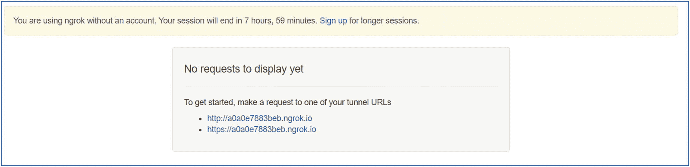
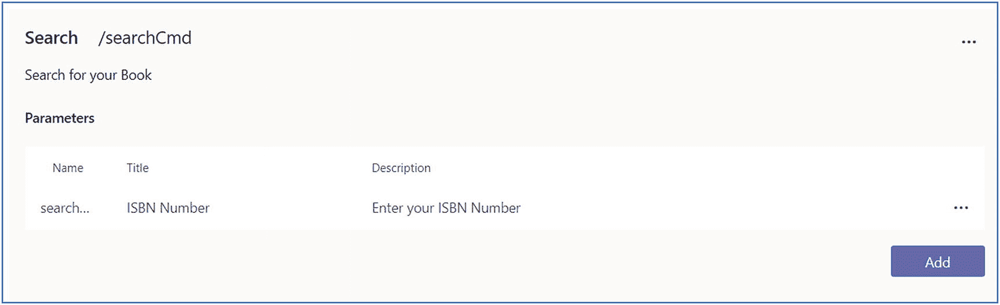

# 二、使用MSTeam构建应用和解决方案

本章介绍了设置环境，并解释了如何使用 Yeoman Generator 为MSTeam创建应用。NET 与 c#和 Nodejs。它还描述了关于团队应用业务线的各种上下文和场景。

## MSTeam开发者平台概述

Microsoft Teams developer platform 使您能够轻松扩展团队，并将您自己的应用和服务无缝集成到团队工作区中。然后，这些应用可以分发给您的企业或世界各地的团队。

要开始为团队开发，决定很多点是很重要的。首先，当你在构建任何应用时，你需要问自己，它真的为一个团队解决了一个现实世界的问题吗？你不想构建不能解决任何业务问题的东西，因为你的应用不会有用户。接下来，一个重要的决策点将是用户使用该应用的频率。如果你的应用价值主张和与之相关的努力和成本之间没有很好的平衡，那么你可能需要探索其他选择。

团队就是用户的体验和他们与工具的互动。如果你想让一个应用赢得人民选择奖，那么考虑用户角色，以及你的应用如何改善他们的生活。

以下是团队应用的集成点。

*   带有搜索命令的消息传递扩展
    *   搜索外部系统，并以互动卡的形式共享结果。

*   带有动作命令的消息传递扩展
    *   收集信息以插入数据存储或执行高级搜索。

*   制表符
    *   创建嵌入式 web 体验来查看、处理和共享数据。

*   连接器和网钩
    *   将数据推入团队客户端和从团队客户端发送数据的简单方法。

*   任务模块
    *   从任何需要的地方收集或显示信息的交互式模态表单。

## 为 Microsoft 团队设置开发环境

若要扩展 Microsoft Teams，您需要创建 Microsoft Teams 应用。Microsoft Teams 应用是您托管的 web 应用。然后，这个应用可以集成到团队中的用户工作区。

作为团队开发人员，您可以使用不同的方法和知识来扩展团队平台。你可以利用你之前的知识。Net 结合 C# / NodeJS / SPFx 开发团队应用。

您可以通过利用现有知识创建自定义应用来扩展 Teams developer platform 的功能。Microsoft Teams 开发平台目前支持三种语言:。Net、JavaScript 和 Python。参见图 [2-1](#Fig1) 。


图 2-1

Microsoft 团队应用支持的语言

此外，MSTeam开发平台支持六种不同的 ide 来开发MSTeam应用(图 [2-2](#Fig2) )。


图 2-2

MSTeam应用不同的 ide

1.  使用 C#/的MSTeam平台。NET 和 App Studio

2.  MSTeam平台与 Node.js 和 App Studio

3.  MSTeam平台与约曼发电机

4.  带有 SharePoint 框架的 Microsoft 团队平台

5.  用于 Visual Studio 代码的MSTeam工具包

6.  MSTeam平台与 Phyton 和 App Studio

### 准备好你的 Office 365 租户

让我们准备开发环境。确保为您要在其中构建应用的 Microsoft 365 组织启用了自定义应用上传。如果您需要专门的开发租户，请注册 Office 365 开发人员计划。确保你有一个可以上传和测试你的团队应用的环境。

1.  注册 Microsoft 365 开发人员订阅。

    关注本帖: [`http://jenkinsblogs.com/2020/03/06/set-up-a-microsoft-365-developer-subscription-for-learning/`](http://jenkinsblogs.com/2020/03/06/set-up-a-microsoft-365-developer-subscription-for-learning/)

2.  启用自定义团队应用并打开自定义应用上传。
    1.  有三种设置与启用自定义应用和自定义应用上传相关:
        *   组织范围的自定义应用设置➤允许与上的自定义应用➤进行交互

            此设置为您的组织启用或禁用自定义应用。它需要打开。

        *   **团队自定义应用设置➤允许成员上传自定义应用➤开/关**

        *   此设置适用于 Microsoft 团队中的每个团队。如果你想为一个特定的团队安装你的应用，这将需要为该团队打开。

        *   用户自定义应用策略➤用户可以上传自定义应用➤开/关

            此设置控制单个用户的权限。你需要为可以上传自定义应用的个人启用此功能。

接下来，根据您的知识和客户喜欢的方法准备您的开发环境。我们有四个不同的选项来开发MSTeam应用。

*   准备您的开发环境。网

*   为 NodeJS 准备开发环境

*   为约曼发电机准备您的开发环境

*   使用 Microsoft Teams Toolkit for Visual Studio 代码准备开发环境

根据您的知识，选择一个并准备您的开发环境。

### 准备您的开发环境。网

以下是步骤:

*   **安装 Visual Studio**
    *   [T2`https://www.visualstudio.com/downloads/`](https://www.visualstudio.com/downloads/)

    *   你可以安装免费的社区版。

*   **安装MSTeam应用**
    *   [T2`https://marketplace.visualstudio.com/items?itemName=TeamsDevApp.vsteamstemplate`](https://marketplace.visualstudio.com/items%253FitemName%253DTeamsDevApp.vsteamstemplate)

    *   直接从 Visual Studio 创建、调试和部署团队应用。

*   安装 Git
    *   [T2`https://git-scm.com/downloads`](https://git-scm.com/downloads)

如果在安装过程中看到将 git 添加到路径中的选项，请选择这样做。会得心应手。通过在终端窗口中运行以下命令来验证您的 git 安装:

```
$ git --version
git version 2.17.1.windows.2

```

确保启动最新版本的 Visual Studio 并安装任何更新(如果显示)。

Microsoft Teams Toolkit for Visual Studio

Microsoft Teams Toolkit 扩展使您能够直接从 Visual Studio 代码创建、调试和部署 Teams 应用。

特征

*   项目生成器

*   应用配置管理器

*   包验证器

*   从 Visual Studio 发布到您的租户应用目录

### 为 NodeJS 准备开发环境

以下是步骤:

*   安装 Git
    *   [T2`https://git-scm.com/downloads`](https://git-scm.com/downloads)

*   Node.js 和 NPM
    *   [T2`https://nodejs.org/dist/latest-v8.x/`](https://nodejs.org/dist/latest-v8.x/)

    *   您需要在您的机器上安装 NodeJS。你应该使用最新的 LTS 版本。

*   安装代码编辑器
    *   [T2`https://code.visualstudio.com/`](https://code.visualstudio.com/)

    *   获取任何文本编辑器或 IDE。您可以免费安装和使用 Visual Studio 代码。

如果在安装过程中看到将 git、节点、npm 和代码添加到路径的选项，请选择这样做。会得心应手。通过在终端窗口中运行以下命令，验证这些工具是否可用:

```
$ git --version
git version 2.19.0.windows.1

$ node -v
v8.9.3

$ npm -v
5.5.1

$ gulp -v
CLI version 4.0.2

```

您可能有这些应用的不同版本。这应该不是问题，除了 gulp。对于 gulp，您需要使用版本 4.0.0 或更高版本。如果你没有安装 gulp(或者安装了错误的版本)，现在可以在你的终端窗口中运行 ***npm 安装 gulp*** 来安装。

### 为约曼发电机准备您的开发环境

为了完整起见，下面是如何准备约曼发电机:

*   安装 NodeJS

*   安装一个代码编辑器(我也在使用 Visual Studio 代码)。

*   安装约曼和吞咽 CLI

    为了能够使用 Teams generator 搭建项目，您需要安装 Yeoman 工具以及 Gulp CLI 任务管理器。

    打开命令提示符，键入以下内容:

*   安装 Microsoft 团队应用生成器

    Microsoft Teams apps 的 Yeoman 生成器是使用以下命令安装的:

```
npm install yo gulp-cli typescript –global

```

```
npm install generator-teams –global

```

### 使用 Microsoft Teams Toolkit for Visual Studio 代码准备开发环境

Microsoft Teams Toolkit 扩展使您能够直接从 Visual Studio 代码创建、调试和部署 Teams 应用。

**先决条件**

*   Visual Studio 代码 v1.44 或更高版本
    *   [T2`https://code.visualstudio.com/download`](https://code.visualstudio.com/download)

*   NodeJS 6 或更新版本
    *   [T2`https://nodejs.org/en/`](https://nodejs.org/en/)

*   安装 Microsoft 团队工具包
    *   [T2`https://marketplace.visualstudio.com/items?itemName=TeamsDevApp.ms-teams-vscode-extension`](https://marketplace.visualstudio.com/items%253FitemName%253DTeamsDevApp.ms-teams-vscode-extension)

    *   直接从 Visual Studio 代码创建、调试和部署团队应用

### 托管应用

MSTeam中的应用是公开一个或多个功能的 web 应用。要让 Teams platform 加载您的应用，您的应用必须可从互联网访问。要使您的应用可从互联网访问，您需要托管您的应用。你可以将它免费托管在微软 Azure 中，或者使用 ngrok ( [`https://ngrok.com/`](https://ngrok.com/) )在你的开发机器上创建一个到本地进程的隧道。完成应用托管后，记下它的根 URL。它看起来会像下面这样:

*   [T2`https://yourteamsapp.ngrok.io`](https://yourteamsapp.ngrok.io)

*   [T2`https://yourteamsapp.azurewebsites.net`](https://yourteamsapp.azurewebsites.net)

#### 使用 ngrok 的隧道

为了快速测试，您可以在本地机器上运行应用，并通过 web 端点创建一个到它的隧道。Ngrok 是一个免费的工具，可以让你做到这一点。用 ngrok 你可以得到一个网址，比如 [`https://d0ac14a5.ngrok.io`](https://d0ac14a5.ngrok.io) (这个 URL 只是一个例子)。您可以为您的环境下载并安装 ngrok。确保将它添加到路径中的某个位置。

安装后，您可以打开一个新的终端窗口并运行以下命令来创建隧道。该示例使用端口 3333，因此请确保在此处指定它。

```
ngrok http 3333 -host-header=localhost:3333

```

Ngrok 将侦听来自互联网的请求，并将它们路由到运行在端口 3333 上的应用。你可以打开你的浏览器，进入 [`https://d0ac14a5.ngrok.io/hello`](https://d0ac14a5.ngrok.io/hello) 来加载你的应用的 hello 页面。请确保在您的控制台会话中使用 ngrok 显示的转发地址，而不是此 URL。

该应用仅在您的开发计算机上的当前会话期间可用。如果机器关闭或进入睡眠状态，该服务将不再可用。分享应用供其他用户测试时，请记住这一点。如果你必须重新启动服务，它将返回一个新的地址，你将不得不更新每个使用该地址的地方。付费版 ngrok 没有这个限制。

### MSTeam应用

每当我们想要创建一个应用时，首先我们要为团队注册一个新的 Bot 频道注册，而不是 Tabs。参见图 [2-3](#Fig3) 。


图 2-3

MSTeam应用

接下来，根据您的喜好，使用任何一种开发环境来开发应用。然后使用 App Studio 创建一个应用包。

## 练习 1:使用 Yeoman Generator 创建第一个MSTeam应用

创建和分发基于 Microsoft Teams 平台构建的应用涉及 Bot 渠道注册、在各种上下文中对应用进行分组、使用 App Studio 定义应用、决定构建什么、构建您的 web 服务、创建应用包，以及将该包分发到您的目标最终用户(图 [2-4](#Fig4) )。


图 2-4

构建团队应用流程

### 向微软 Azure 的机器人框架注册机器人

第一步是为您的 Microsoft Teams 应用创建一个新的 Microsoft Teams bot。

打开浏览器，导航到 Azure 门户( [`https://portal.azure.com/`](https://portal.azure.com/) )。使用您在 Azure 订阅中使用的**username@tenantname.onmicrosoft.com**登录。

在左侧导航栏中选择**创建资源**。见图 [2-5](#Fig5) 。


图 2-5

创建资源

在搜索市场输入框中输入资源组，然后选择资源组。参见图 [2-6](#Fig6) 。


图 2-6

资源组

在**资源组**页面，选择**创建**按钮，创建一个新的资源组。见图 [2-7](#Fig7) 。


图 2-7

创建资源组

选择一个有效的订阅，输入资源组**的名称，例如:Teams** ，并选择想要的区域。这些选择都不会影响机器人注册，这取决于你。见图 [2-8](#Fig8) 。


图 2-8

创建资源组表单

完成向导以创建资源组。参见图 [2-9](#Fig9) 。


图 2-9

资源组创建通知

Azure 完成资源组创建过程后，导航到资源组。

在资源组中，选择**添加**或**创建资源**按钮，如图 [2-10](#Fig10) 所示。


图 2-10

创建资源

#### Bot 渠道注册

在**搜索市场**输入框中输入 **bot** ，在返回的资源列表中选择 **Bot 频道注册**。然后在下一页选择 **Create** 开始注册新的 bot 资源。参见图 [2-11](#Fig11) 。


图 2-11

搜索机器人频道注册

在 **Bot 通道注册**页面，点击发起创建 Bot 通道注册。见图 [2-12](#Fig12) 。


图 2-12

Bot 渠道注册

在 **Bot 通道注册刀片**中，输入以下值，然后选择**创建**，如图 [2-13](#Fig13) 所示。


图 2-13

创建 Bot 渠道注册

*   **机器人句柄**:为机器人输入一个全局唯一的名称。

*   **订阅**:选择之前创建资源组时选择的订阅。

*   **资源组**:选择您之前创建的资源组。

*   **地点**:选择你喜欢的 Azure 地区。

*   **定价等级**:选择首选的定价等级；F0 层是免费的。

*   **消息传递端点** : `https://REPLACE_THIS.ngrok.io/api/messages`

    bot 注册需要知道实现 bot 的 web 服务的端点。这将在每次启动之前练习中使用的 ngrok 实用程序时发生变化。

*   **应用洞察**:关

*   **微软应用 ID 和密码**:自动创建应用 ID 和密码

Azure 将开始提供新资源。这需要一两分钟的时间。完成后，导航到资源组中的 bot 资源。参见图 [2-14](#Fig14) 。


图 2-14

Bot 渠道注册

#### 为机器人启用 Microsoft Teams 频道

为了让机器人与MSTeam交互，你必须启用如图 [2-15](#Fig15) 所示的团队通道。


图 2-15

选择团队频道

*   从 Azure 的 bot 资源中，选择左侧导航中的**通道**。

*   在**连接到频道**面板上，选择**MSTeam频道**，然后选择**保存**确认动作。


图 2-16

团队渠道服务条款

*   同意服务条款(图 [2-16](#Fig16) )。

一旦此过程完成，您应该会在您启用的频道中看到列出的网络聊天和MSTeam(图 [2-17](#Fig17) )。


图 2-17

连接到频道

#### 检索 Bot 应用 Id 和密码

当 Azure 创建这个机器人时，它还为这个机器人注册了一个新的 Azure 广告应用。您需要生成这个新的 bot 应用作为一个秘密，并复制应用的凭据。

从左侧导航栏中选择**设置**。向下滚动到 Microsoft App ID 部分。

复制机器人的 ID，因为你以后会需要它。参见图 [2-18](#Fig18) 。


图 2-18

应用标识

### 为应用创建客户端密码

点击**管理**链接，导航至 **Azure 广告应用**。

为了让守护程序应用在没有用户参与的情况下运行，它将使用应用 ID 和证书或密码登录 Azure AD。在本练习中，您将使用一个秘密。

从左侧导航面板中选择**证书&机密**。

选择客户端密码部分下的**新客户端密码**按钮(图 [2-19](#Fig19) )。


图 2-19

新客户机密

出现提示时，对密码进行描述，并选择提供的到期持续时间选项之一，例如:从不，然后选择**添加**。

Note

复制新的客户端密码值。在您执行另一个操作或离开此刀片后，您将无法取回它。

“证书和机密”页面将显示新的机密。复制该值很重要，因为它只显示一次；如果您离开页面并返回，它将仅显示为屏蔽值(图 [2-20](#Fig20) )。


图 2-20

新的客户端机密值

The Certificate & Secrets page will display the new secret. It’s important you copy this value as it’s only shown this one time; if you leave the page and come back, it will only show as a masked value (Figure

复制并存储秘密值的值，因为您以后会需要它。

## 各种环境下的团队应用

我们有三种类型的上下文可供团队应用使用。

*   团队和渠道

*   闲谈

*   个人的

**团队和渠道**

支持所有团队成员的公共协作和工作流。

**示例**:分享、讨论和获得有关新服务事件的通知

闲谈

1:1 或小组设置中的轻量级协作，没有复杂的权限

**示例**:经理和直接下属之间一对一的话题

**个人**

以用户为中心的视图，显示聚合内容以及私人机器人聊天

**示例**:分配给我的所有任务列表

**范围**

您的应用可能需要上下文信息来显示基于范围的相关内容。下面给出了从选项卡、机器人和连接器获取上下文的支持范围列表。

### 可配置选项卡

目前，可配置选项卡仅支持团队和群组聊天范围。也就是说，可配置选项卡仅在团队范围内受支持(非个人)，并且目前每个应用仅支持一个选项卡。

```
"scopes": ["team","groupchat"]

```

### 静态选项卡

目前，静态标签只支持个人范围，这意味着它只能作为个人体验的一部分来提供，也就是说，在个人范围内声明的静态标签总是固定在应用的个人体验中。目前不支持在团队范围内声明的静态选项卡。

```
"scopes": ["personal"]

```

#### 蝇蛆病

这指定了 bot 是在团队中的频道上下文中、在群组聊天(group chat)中提供体验，还是仅在单个用户范围内提供体验(个人)。这些选项是非排他性的。

```
"scopes": ["team","personal","groupchat"],

```

#### 机器人——命令列表

您必须为 bot 支持的每个范围定义一个单独的命令列表。这指定了命令列表的有效范围。选项包括团队、个人和群组聊天。

```
"scopes": ["team","groupchat"]
"scopes": ["personal", "groupchat"]

```

#### 连接器

这指定了连接器是在团队中的通道环境中提供体验，还是在单个用户范围内提供体验(个人)。目前，仅支持团队范围。

```
"scopes": ["team"]

```

## 使用约曼生成器创建一个应用

在本节中，您将使用 Yeoman generator 创建一个新的团队应用(yo teams):


图 2-21

使用 yo 团队创建团队应用

*   创建新的 web 部件项目

*   在您喜欢的位置创建一个新的项目目录

*   打开命令提示符

*   导航到一个新创建的目录，创建一个新文件夹“yoTeamsMessagingExtension”

*   通过运行以下命令来运行MSTeam的 Yeoman 生成器: **yo teams** *。*见图 [2-21](#Fig21) 。

约曼将发射并问你一系列问题。用以下数值回答问题(图 [2-22](#Fig22) ):


图 2-22

回答约曼问卷

*   您的解决方案名称是什么？:yo-团队-消息传递-扩展

*   您想将文件放在哪里？:使用当前文件夹

*   您的 Microsoft Teams 应用项目的标题？yoTeamsMessagingExtension 扩展

*   你(公司)的名字？(最多 32 个字符):JPOWER4

*   您希望使用哪个清单版本？1.6

*   如果您有 Microsoft Partner Id，请输入。(留空以跳过)

*   您希望在项目中添加哪些功能？消息扩展命令

*   您将在其中托管此解决方案的 URL？[T2`https://yoteamsmessagingextension.azurewebsites.net`](https://yoteamsmessagingextension.azurewebsites.net)

*   是否要包括测试框架和初始测试？不

*   您希望将 Azure Applications Insights 用于遥测吗？不

*   您的消息扩展托管在哪里？在一个新机器人里

*   消息扩展使用的 bot 的 Microsoft 应用 ID 是什么？00000000-0000-0000-0000-000000000000

*   什么类型的消息传递扩展命令？基于搜索的消息传递扩展

*   您想要邮件扩展的设置选项吗？是

*   您的消息扩展命令的名称是什么？searchCmd

*   描述一下你的消息扩展命令？从 google books api 搜索图书

Note

这些问题的大多数答案在创建项目后都可以更改。例如，在创建或测试项目时，项目所在的 URL 并不重要。

使用**代码** **打开 Visual Studio 代码。**在命令行提示。见图 [2-23](#Fig23) 。


图 2-23

Visual studio 代码 OOB

*   转到环境文件➤打开和更新

*   然后打开 SearchCmdMessageExtension.ts 文件，找到 const card = card factory . adaptive card(

*   将主体部分替换为下面的代码

    ```
     body: [
                        {
                            type: "TextBlock",
                            size: "Large",
                            text: "Title of the Item"
                        },
                        {
                            type: "TextBlock",
                            text: "Desc: Command Search Messaging Extension"
                        },
                        {
                            type: "Image",
                            url: `https://${process.env.HOSTNAME}/assets/icon.png`
                        }
                    ]

    ```

*   查找常量预览= {

*   将内容部分标题和文本替换为下面的代码

    ```
    title: "Title of the Item",
        text: "Desc: Command Search Messaging Extension",

    ```

```
MICROSOFT_APP_ID=1ad3a766-9629-44e5-b76c-c1256a8080ec
MICROSOFT_APP_PASSWORD=zstMrs0xaBYxZ-4195.m~-AWCszh9suL2z

```

### 测试消息传递扩展应用

打开命令提示符，导航到项目文件夹，并执行以下命令:

```
gulp ngrok-serve

```

这个 gulp 任务将运行许多其他任务，这些任务都显示在命令行控制台中。ngrok-serve 任务构建您的项目并启动一个本地 web 服务器(`http://localhost:3007`)。然后它用一个随机的子域启动 ngrok，这个子域会创建一个到本地 web 服务器的安全 URL。

在开发过程中，可以使用 ngrok 工具进行测试，该工具可以创建一个安全的可旋转的 URL，指向您的本地 HTTP 服务器。Ngrok 作为一个依赖项包含在项目中，所以不需要设置或配置任何东西。


图 2-24

ngrok-服务执行

Ngrok 已经创建了临时 URL 1d42b1a1cfc8.ngrok.io，它将映射到我们本地运行的 web 服务器(图 [2-24](#Fig24) )。

然后去 Azure 门户，打开 Bot 通道注册 App。使用临时 URL 36236469245b.ngrok.io 更新消息传递端点(图 [2-25](#Fig25) )。


图 2-25

更新消息传递端点

Note

ngrok 的免费版本会在您每次重新启动 web 服务器时创建一个新的 URL。测试应用时，确保每次重启 web 服务器时都更新 URL 的消息端点。

### 在 Microsoft 团队中安装自定义应用

现在让我们在MSTeam中安装应用。在浏览器中，导航到 [`https://teams.microsoft.com`](https://teams.microsoft.com) ，使用工作和学校帐户的凭据登录。

Microsoft Teams 可用作 web 客户端、桌面客户端和移动客户端。

使用应用栏导航菜单，选择更多添加的应用按钮。然后选择更多应用，接着上传自定义应用，然后为我或我的团队上传(图 [2-26](#Fig26) )。


图 2-26

向 MS 团队添加应用

在出现的文件对话框中，选择项目中的 Microsoft Teams 包。这个应用包是一个 ZIP 文件，可以在项目**中找到。/包**文件夹(图 [2-27](#Fig27) )。


图 2-27

上传应用

安装后，您将能够在应用列表中看到该应用(图 [2-28](#Fig28) )。


图 2-28

安装的应用

一旦包上传，MSTeam将显示应用的摘要。


图 2-29

将应用添加到团队和渠道

选择**添加**按钮安装 app(图 [2-29](#Fig29) )。

安装该应用后，MSTeam将带您与MSTeam应用进行一对一聊天。

转到您的团队对话部分(图 [2-30](#Fig30) )。


图 2-30

从通道访问消息传递扩展

选择项目并单击它；它会通过一个通道将详细内容发送给你的团队成员(图 [2-31](#Fig31) )。


图 2-31

将消息发送给团队成员

在本练习中，您已经使用 Yeoman generator for the Microsoft Teams 应用创建了一个简单的现成动作命令消息传递扩展。我们将在第 [4](04.html) 章中详细了解这一点以及更多消息传递示例。

## 练习 2:使用 Nodejs 创建消息扩展应用

Microsoft Teams developer platform 使您能够轻松扩展团队，并将您自己的应用和服务无缝集成到团队工作区中。然后，这些应用可以分发给您的企业或世界各地的团队。

若要扩展 Microsoft Teams，您需要创建 Microsoft Teams 应用。Microsoft Teams 应用是您托管的 web 应用。然后，这个应用可以集成到团队中的用户工作区。

消息传递扩展允许用户向您的服务查询或发布信息，并以卡片的形式将信息发布到消息中。

通过在终端窗口中运行以下命令，验证这些工具是否可用:

```
$ node -v
v8.9.3
$ npm -v
5.5.1
$ gulp -v
CLI version 4.0.2

```

在本练习中，我将使用 NodeJS 和公共 google books REST API 创建一个消息扩展应用，并向您展示如何使用 App Studio 并将该应用部署到 Microsoft 团队中。

### 步骤 1:创建新的 Nodejs 项目

首先，打开一个命令提示符，为您最喜欢的位置创建一个新目录，然后导航到该目录(图 [2-32](#Fig32) )。


图 2-32

正在为 nodejs 应用创建新文件夹

```
md nodeJSMessagingExtensions
cd nodeJSMessagingExtensions

```

通过使用以下命令创建 package.json 文件来创建一个新的 NodeJS 项目(图 [2-33](#Fig33) )。


图 2-33

使用 npm init 创建新应用

```
npm init

```

输入您的项目详细信息，然后安装 ngrok

```
npm install ngrok

```

然后使用 Visual studio 代码打开项目，键入下面的命令


图 2-34

package.json

```
code (Figure 2-34).

```

创建一个名为 getBooks.js 的文件，并粘贴以下代码:

```
const ngrok = require('ngrok');

var request = require('request');
var util = require("util");
var restify = require('restify');
var builder = require('botbuilder');
var teams = require('botbuilder-teams');

var connector = new teams.TeamsChatConnector({
    appId: "<update the bot ID>",
    appPassword: "<update the bot ID password>"
});

const port = 8080;

var server = restify.createServer();

server.listen(port, function() {
    console.log(`Node.js server listening on ${port}`);
    ngrok.connect(port, function(err, url) {
        console.log(`Node.js local server is publicly-accessible at ${url}`);
    });
    console.log('%s listening to %s', server.name, util.inspect(server.address()));
});

// this will reset and allow to receive from any tenants

connector.resetAllowedTenants();

var bot = new builder.UniversalBot(connector);

server.post('/api/composeExtension', connector.listen());
server.post('/api/messages', connector.listen());
server.post('/', connector.listen());

var composeExtensionHandler = function(event, query, callback) {
    var attachments = [];
    var url = "https://www.googleapis.com/books/v1/volumes?q=" + query.parameters[0].value + "&limit=100&offset=0";
    if (query.parameters[0].value == undefined | query.parameters[0].value == '') {
        url = "https://www.googleapis.com/books/v1/volumes?q=ISBN:9780789748591&limit=10";
    }
    request(url, {
        json: true
    }, (err, res, body) => {
        if (err) {
            return console.log(err);
        }
        var data = body;
        for (var o of data.items) {
            try {

                console.log(o.volumeInfo.title);

                var logo = {
                    alt: o.volumeInfo.title,
                    url: o.volumeInfo.imageLinks.thumbnail

                };

                var card = new builder.HeroCard()
                    .title("Title: " + o.volumeInfo.title)
                    .text("" + o.volumeInfo.description)
                    .subtitle("Publisher: " + o.volumeInfo.publisher)
                    .images([logo])
                    .buttons([{
                        type: "openUrl",
                        title: "View Image",
                        value: o.volumeInfo.imageLinks.thumbnail
                    }]);

                attachments.push(card.toAttachment());

            } catch (err) {
                console.log(err);
            }
        };

        var response = teams.ComposeExtensionResponse
            .result('list')
            .attachments(attachments)
            .toResponse();

        // Send the response to teams
        callback(null, response, 200);

        //}

    });

};

connector.onQuery('searchCmd', composeExtensionHandler);

var composeInvoke = function(event) {
    console.log(event);
};

connector.onInvoke('composeInvoke');

```

上面的代码相当简单；首先声明所需的模块，并创建一个 TeamChatConnector 来映射 **appId** 和 **appPassword** 。然后创建一个服务器，并使用 ngrok 进行本地监听。

接下来，使用 google books REST API 搜索图书并构建为英雄卡并通过附件对象发送到聊天窗口，用户可以通过 ISBN 号进行搜索。

Install restify 是一个框架，利用连接风格的中间件来构建 REST APIs:

```
npm install restify

```

MSTeam应用只支持微软 Bot Builder 框架，为此，我正在编译我们的 NodeJS 项目的 Bot 框架。

安装下面的标头以引用 BOT 框架:

```
npm install botbuilder@3.13.1
npm install botbuilder-teams

```

现在我们已经完成了 get books 消息传递扩展代码，接下来我们可以创建一个应用包来安装到 Microsoft 团队中。

### 步骤 2:使用 App Studio 为MSTeam创建应用

让我们使用 App Studio 来创建和集成我们的团队应用:


图 2-35

安装 App Studio

*   前往 [`https://teams.microsoft.com`](https://teams.microsoft.com)

*   使用您的 Office 365 凭据登录

*   转到 Apps 找到 App Studio，如果 App Studio 不可用，那么安装它。
    *   从商店获取 **App Studio**

    *   在团队中，点击应用按钮，搜索“App Studio”，安装(图 [2-35](#Fig35) )。


图 2-36

创建应用包

*   进入应用，找到 App Studio，创建一个应用包配置(图 [2-36](#Fig36) )。


图 2-37

清单编辑器

*   单击 App Studio 并打开它。

*   移至清单编辑器，并创建一个新的应用(图 [2-37](#Fig37) )。

*   **简称**:获取书籍 App

*   **全称:**使用 ISBN 号获取图书

*   点击**生成**按钮，创建 App Id

*   **包名**:jpower 4 . ms teams . messaging extension

*   **版本** : 1.0.0

*   **简短描述**:消息传递扩展团队应用开发

*   **详细描述**:消息传递扩展团队解决方案开发

*   **开发者** : JPOWER4

*   **网站** : [`https://github.com/jenkinsns`](https://github.com/jenkinsns)

*   **隐私声明** : [`https://github.com/jenkinsns`](https://github.com/jenkinsns)

*   **使用条款:** [`https://github.com/jenkinsns`](https://github.com/jenkinsns)

*   **品牌化:**上传全彩 192 x 192 图像，透明轮廓 32 x 32 图像，并选择主题颜色

选择功能下的**消息扩展**


图 2-38

为消息传递扩展创建新的 bot

*   点击设置，并给出一个机器人名称(图 [2-38](#Fig38) )。


图 2-39

新密码已生成

*   点击**创建**创建机器人

*   然后从消息传递扩展部分获取 bot ID 和 app 密码(生成新密码)(图 [2-39](#Fig39) )。


图 2-40

邮件扩展 AppID

*   生成 App Id 和 App 密码(图 [2-40](#Fig40) )。


图 2-41

创建 TeamsChatConnector

*   转到 getBooks.js 文件更新 **appID** 和**app password；**参见下一节(图 [2-41](#Fig41) )。

更新后，代码如下所示:

```
var connector = new teams.TeamsChatConnector({
    appId: "1dada9e1-3776-4056-bd24-eb595ff3b4d9",
    appPassword: "br~RN7iX6W.ckM93M8EU5Q-_v29IKtzF2~"
})

```

然后添加一个消息传递端点 URL 来获得一个带有 https 的公共 URL，因为我们需要 ngrok 在本地执行。

### 步骤 3:使用 ngrok 开始监听端口 8080

转到命令提示符并键入以下命令来启动应用(图 [2-42](#Fig42) ):


图 2-42

节点执行

```
node getBooks.js

```

然后打开一个新的浏览器并访问

`http://localhost:4040/inspect/http`

然后你就可以看到公开的网址: [`https://a0a0e7883beb.ngrok.io`](https://a0a0e7883beb.ngrok.io) (图 [2-43](#Fig43) )。



图 2-43

ngrok request url

然后去 App Studio，更新 Bot 端点地址(图 [2-44](#Fig44) )。

[T2`https://a0a0e7883beb.ngrok.io/api/messages`](https://a0a0e7883beb.ngrok.io/api/messages)


图 2-44

消息传递端点地址

然后点击命令部分下的添加按钮，并选择“允许用户查询您的服务信息并将其插入到消息中”(图 [2-45](#Fig45) )。


图 2-45

邮件扩展操作命令

然后填写新的命令表单:



图 2-46

消息传递扩展参数

*   命令 Id: searchCmd

*   标题:搜索

*   描述:搜索你的书

*   然后添加参数

*   名称:搜索关键字

*   标题:国际标准书号

*   描述:输入你的 ISBN 号(图 [2-46](#Fig46) )。

点击**完成**部分下的**测试分发**对 app 进行测试(图 [2-47](#Fig47) )。


图 2-47

测试和分发

然后从您的渠道下载应用包进行测试。

### 步骤 4:将应用安装到您的团队中

前往您的➤团队，导航至管理➤团队应用➤·莫尔应用(图 [2-48](#Fig48) )。


图 2-48

将应用上传至团队

上传自定义应用(选择下载的 zip 文件进行上传)。

然后点击**添加**按钮进行安装(图 [2-49](#Fig49) )。


图 2-49

将应用添加到团队

现在，谷歌图书搜索应用在您的团队中可用，因此请转到您的频道并访问该应用。

点击对话区的 **…** ，搜索下面高亮显示的消息扩展应用(图 [2-50](#Fig50) )。


图 2-50

搜索消息传递扩展应用

然后选择 app 它会加载一个图书列表，您可以选择并发送给您的团队成员(图 [2-51](#Fig51) )。


图 2-51

邮件扩展加载的图书列表

然后可以通过 ISBN 号进行图书检索，得到相关的书籍(图 [2-52](#Fig52) )。


图 2-52

通过 ISBN 号查找图书

选择这本书，它将为你的团队成员制作一张带有标题、出版商、图片和描述的英雄卡片。然后作为对话发送给你的团队成员(图 [2-53](#Fig53) )。


图 2-53

向团队成员发送消息传递扩展卡

## 结论

在本章中，您已经学习了各种生成器的不同 IDE 选项和设置环境。它还解释了如何使用 Yeoman Generator (yo teams)和 Nodejs 为MSTeam创建简单的定制应用。您还了解了有关团队应用业务线的各种上下文和场景，以及 Bot 渠道注册、App Studio 和将应用部署到团队中。

现在，您已经学习了如何使用 Yeoman generator 和使用 NodeJS 为MSTeam创建简单的定制应用。在接下来的章节中，你将开始学习MSTeam应用的不同选项和功能。