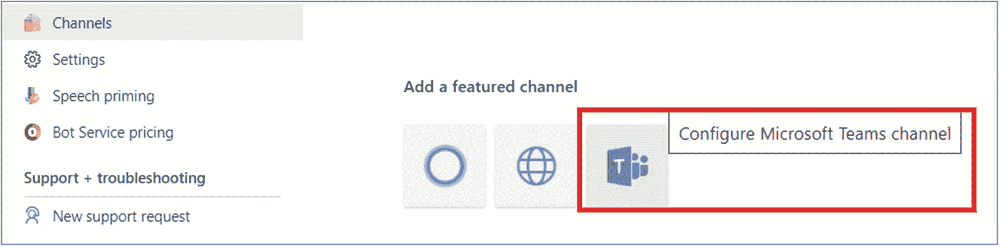
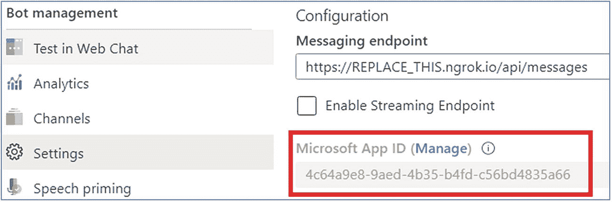

# 四、消息传递扩展和操作注释

消息传递扩展是在团队客户机中调用定制代码的好方法。这使得用户可以直接在他们的对话中与你的应用进行交互，而不必离开团队，使用自适应卡或英雄卡或消息来发布信息。

在本章中，您将了解消息传递扩展的各种功能，我们将通过示例指导用户解释如何创建消息传递扩展和命令操作。消息传递扩展允许人们与渠道共享内容、进行有意义的通信以及共享协作体验，与消息传递扩展操作命令一起，允许用户使用模式弹出从 API 搜索数据，然后处理他们的数据并将其发送回团队渠道对话区域以共享协作体验。

## 消息传递扩展概述

消息传递扩展使用户能够从外部系统执行搜索命令或操作命令。消息传递扩展由您托管的 web 服务组成，并在 manifest.json 文件中定义，您的 web 服务可以在 Microsoft 团队中从该文件中调用。您还需要在消息传递模式和安全通信协议的 bot 框架中将您的 web 服务注册为 Bot。

Microsoft Teams client 能够扩展开箱即用的功能，并与您现有的业务线应用集成。因此，这将有助于利用您现有的知识，并在集成业务线应用方面取得收益。它还将减少用户在应用之间移动的工作量。

以下是邮件扩展命令的类型:

1.  操作命令消息传递扩展

2.  搜索命令消息传递扩展

3.  用消息传送扩展链接展开的 URL

消息传递扩展命令的类型定义了 web 服务可用的 UI 元素和交互流。某些交互，如身份验证和配置，可用于这两种类型的命令。见图 [4-1](#Fig1) 。


图 4-1

撰写扩展

邮件扩展出现在撰写框的底部。有几个是内置的，比如 Emoji、Giphy、Sticker。选择“更多选项”(⋯)按钮以查看其他消息传递扩展，包括您从应用库添加的或自己上传的扩展。

### 撰写扩展

撰写扩展允许用户在对话中查询和共享丰富的卡片。当您创建聊天信息时，无论是新的对话还是回复现有信息，都可以使用信息扩展功能。消息扩展帮助您搜索内容并将其插入到您正在编写的聊天消息中。


图 4-2

可操作的消息

借助可操作的消息(图 [4-2](#Fig2) )，您可以向连接器卡添加丰富的内容。在设计可操作消息的实施时，关键是解决方案既要可扩展又要可靠，同时还要考虑服务的未来增长。

消息传递扩展是一种特殊的 Microsoft Teams 应用，它受 Bot 框架 v4 支持。

### 您将如何使用消息传递扩展？

邮件扩展有助于以下方面:

*   处理工作项目和错误

*   客户支持票据

*   使用图表和报告

*   图像和媒体内容

*   销售机会和销售线索

## Microsoft 团队消息扩展

消息传递扩展允许用户通过按钮事件使用 web 服务进行搜索，并从外部系统的撰写消息区域启动操作。您也可以使用命令框或直接从邮件中搜索。然后您可以使用自适应卡或英雄卡或消息显示结果(图 [4-3](#Fig3) )。


图 4-3

邮件扩展搜索

卡片是可操作的内容片段，可以通过机器人、连接器或应用添加到对话中。使用文本、图形和按钮，卡片可以让你与观众交流。卡片是简短或相关信息的用户界面容器。卡片可以有多个属性和附件。卡片可以包括可以触发卡片动作的按钮。参见图 [4-4](#Fig4) 。


图 4-4

信息扩展卡

你可以在这里找到更多关于如何使用卡的信息: [`https://docs.microsoft.com/en-us/microsoftteams/platform/task-modules-and-cards/cards/cards-reference`](https://docs.microsoft.com/en-us/microsoftteams/platform/task-modules-and-cards/cards/cards-reference)

### 邮件扩展如何工作

消息传递扩展在您的自定义 Microsoft Teams 应用清单中注册，该清单指定了可以从 Microsoft Teams 客户端中的何处调用该扩展。可以调用消息传递扩展的三个位置包括:

1.  **命令框**:这是MSTeam客户端顶部的区域

2.  **撰写消息框**:这是一对一聊天或群组聊天底部的区域，也是频道中对话选项卡底部的区域

3.  **消息的“更多操作”菜单**:**更多操作**菜单项可从...当您将鼠标悬停在对话中的一条消息上时

消息传递扩展被实现为使用 bot 框架注册为 Bot 的 web 服务。当调用消息传递扩展时，MSTeam将通过 Bot 框架的消息传递模式和安全通信协议调用您的 web 服务。

在创建命令之前，您需要决定:

*   动作命令可以从哪里触发？

*   如何创建任务模块？

*   最终的消息或卡片会从机器人发送到频道，还是会插入到撰写消息区域供用户提交？

### 使用 App Studio 创建命令

让我们做一个简单的例子。以下步骤假设您已经创建了一个消息传递扩展。


图 4-5

新命令

1.  从 Microsoft Teams 客户端，打开 App Studio 并选择 Manifest Editor 选项卡。

2.  如果您已经在 App Studio 中创建了应用包，请从列表中选择它。如果没有，您可以导入现有的应用包。

3.  单击命令部分中的添加按钮。

4.  选择允许用户在团队内部触发外部服务中的操作。

5.  如果要使用一组静态参数来创建任务模块，请选择该选项。否则，选择从 bot 获取一组动态参数。

6.  添加命令 Id 和标题。

7.  选择您想要触发动作命令的位置。

8.  如果您正在为任务模块使用参数，请添加第一个参数。

9.  单击保存。参见图 [4-5](#Fig5) 。

如果需要添加更多参数，请单击“参数”部分中的“添加”按钮来添加它们。

## 动作命令消息传递扩展

动作命令允许您向用户呈现一个模态弹出窗口，以收集或显示信息(图 [4-6](#Fig6) )。


图 4-6

从用户处收集信息

当他们提交表单时，您的 web 服务可以通过直接在对话中插入消息，或者通过在撰写消息区域插入消息并允许用户提交消息来做出响应。对于更复杂的工作流，您甚至可以将多个表单链接在一起。参见图 [4-7](#Fig7) 。


图 4-7

回复用户

它们可以从撰写消息区域、命令框或消息中触发。当从消息中调用时，发送给 bot 的初始 JSON 有效负载将包括调用它的整个消息。

## 搜索命令消息传递扩展

搜索命令允许用户在外部系统中搜索信息，然后将搜索结果插入到消息中。在最基本的搜索命令流中，初始调用消息将包括用户提交的搜索字符串。您将回复一个卡片列表和卡片预览。团队客户端将在列表中呈现卡片预览，供最终用户选择。当用户选择一张卡片时，全尺寸的卡片将被插入到撰写消息区域。

它们可以从撰写消息区域或命令框中触发。与动作命令不同，它们不能由消息触发。参见图 [4-8](#Fig8) 。


图 4-8

搜索命令查询

## 链接展开消息传递扩展

当在撰写消息区域粘贴 URL 时，您还可以选择调用您的服务。这个功能称为链接展开，允许您在包含域的 URL 被粘贴到撰写消息区域时订阅接收调用。您的 web 服务可以将 url“展开”到一个详细的卡片中，提供比标准网站预览卡更多的信息。您甚至可以添加按钮，让您的用户无需离开 Microsoft Teams 客户端即可立即行动。

## 练习 1 -创建动作命令消息传递扩展

在本练习中，您将学习如何在 Microsoft Teams 应用中创建和添加新的消息传递扩展，并从 Microsoft Teams 客户端与之交互。

在开始练习之前，请验证您的环境。在本练习中，我将使用安装在我的环境中的以下工具:

*   Node.js - v10.16.0

*   NPM - 6.9.0

*   吞咽
    *   CLI 版本:2.3.0

    *   本地版本:4.0.2

*   MS 团队的约曼生成器- 2.14.0

*   Visual Studio 代码

和

*   Microsoft Azure 订阅

*   Office 365 订阅

要为您的 Microsoft Team client 创建新的 Microsoft Teams bot 应用，请遵循以下步骤:

1.  向微软 Azure 的机器人框架注册机器人

2.  Bot 渠道注册

3.  为机器人启用 Microsoft Teams 频道

4.  检索 bot 应用 ID 和密码

5.  使用约曼生成器创建行动命令消息扩展 MS Teams 应用

6.  测试动作命令消息扩展应用

### 向微软 Azure 的机器人框架注册机器人

打开浏览器，导航到 Azure 门户( [`https://portal.azure.com/`](https://portal.azure.com/) )。使用您在 Azure 订阅中使用的**username@tenantname.onmicrosoft.com**登录。

点击创建资源，在**搜索市场**输入框中输入 **bot** ，在返回的资源列表中选择 **Bot 频道注册**。然后在下一页选择 **Create** 开始注册新的 bot 资源的过程(图 [4-9](#Fig9) )。


图 4-9

搜索机器人频道注册

在 **Bot 通道注册**页面，点击发起创建 Bot 通道注册(图 [4-10](#Fig10) )。


图 4-10

Bot 渠道注册

在 **Bot 通道注册刀片**(图 [4-11](#Fig11) )中，输入以下值，然后选择**创建**:


图 4-11

Bot 渠道登记表

*   Bot 句柄:输入 bot 的全局唯一名称。
    *   **例如:**消息扩展 Ch4

*   订阅:选择先前创建资源组时选择的订阅。

*   资源组:选择您之前创建的资源组，例如:团队

*   位置:选择你喜欢的 Azure 地区。

*   定价层:选择首选的定价层；F0 层是免费的。

*   消息传送端点:`https://REPLACE_THIS.ngrok.io/api/messages`

    bot 注册需要知道实现 bot 的 web 服务的端点。这将在每次启动之前练习中使用的 ngrok 实用程序时发生变化。

*   应用洞察:关闭

*   Microsoft 应用 ID 和密码:自动创建应用 ID 和密码

Azure 将开始提供新资源。这需要一两分钟的时间。完成后，导航到资源组中的 bot 资源。参见图 [4-12](#Fig12) 。


图 4-12

Bot 已创建

### 为机器人启用 Microsoft Teams 频道

为了让 bot 与 Microsoft 团队进行交互，您必须启用团队通道。



图 4-13

选择团队频道

*   从 Azure 的 bot 资源中，选择左侧导航中的**通道**。

*   在**连接通道**面板上，选择**MSTeam通道**，然后选择**保存**确认动作(图 [4-13](#Fig13) )。

*   同意服务条款

一旦此过程完成，您应该会在您启用的频道中看到列出的网络聊天和MSTeam(图 [4-14](#Fig14) )。


图 4-14

连接到频道

### 检索 Bot 应用 Id 和密码

当 Azure 创建机器人时，它还为机器人注册了一个新的 Azure AD 应用。您需要生成这个新的 bot 应用作为一个秘密，并复制应用的凭据。

从左侧导航栏中选择**设置**。向下滚动到 Microsoft App ID 部分。

复制机器人的 ID，因为您稍后会需要它(图 [4-15](#Fig15) )。



图 4-15

应用标识

### 为应用创建客户端密码

点击**管理**链接，导航至 **Azure 广告应用**。

为了让守护程序应用在没有用户参与的情况下运行，它将使用应用 ID 和证书或密码登录 Azure AD。在本练习中，您将使用一个秘密。

从左侧导航面板中选择**证书&机密**。

选择客户端密码部分下的**新客户端密码**按钮。

出现提示时，对密码进行描述，并选择所提供的有效期选项之一:例如，从不，然后选择**添加**(图 [4-16](#Fig16) )。

Note

复制新的客户端密码值。在您执行另一个操作或离开此刀片后，您将无法取回它。

“证书和机密”页面将显示新的机密。复制该值很重要，因为它只显示一次；如果您离开页面并返回，它将仅显示为一个屏蔽值。


图 4-16

应用客户端机密

The Certificate & Secrets

复制并存储秘密值的值，因为您以后会需要它。

### 使用约曼生成器创建MSTeam应用

在本节中，您将使用 Yeoman generator (yo teams)创建一个新的消息传递扩展团队应用。

在这个练习中，我使用 REST API (Google Books API)获取基于 ISBN 号的图书信息，并将其发送到一个通道对话。


图 4-17

哟团队

*   创建新的消息传递扩展应用项目

*   在您喜欢的位置创建一个新的项目目录

*   打开命令提示符

*   创建一个新文件夹“messagingExtensionCh4”

*   导航到新创建的目录

*   通过运行以下命令来运行MSTeam的 Yeoman 生成器: **yo teams** (图 [4-17](#Fig17) )。

约曼会发射并问你一系列问题(图 [4-18](#Fig18) )。用下列值回答问题:


图 4-18

回答约曼问卷

*   您的解决方案名称是什么？消息传递-扩展

*   您想将文件放在哪里？使用当前文件夹

*   您的 Microsoft Teams 应用项目的标题？消息传递扩展示例

*   你(公司)的名字？(最多 32 个字符)JPOWER4

*   您希望使用哪个清单版本？v1.6

*   如果您有 Microsoft Partner ID，请输入。(留空以跳过)

*   您希望在项目中添加哪些功能？消息扩展命令

*   您将在其中托管此解决方案的 URL？[T2`https://messagingextension.azurewebsites.net`](https://messagingextension.azurewebsites.net)

*   当你的应用/标签加载时，你想显示加载指示器吗？不

*   是否要包括测试框架和初始测试？不

*   您希望将 Azure Applications Insights 用于遥测吗？不

*   您的消息扩展托管在哪里？在一个新机器人里

*   消息扩展使用的 bot 的 Microsoft 应用 ID 是什么？4c 64 a9 e 8-9 aed-4b 35-b4fd-c56bd 4835 a66

*   什么类型的消息传递扩展命令？基于动作的消息传递扩展

*   你希望你的行动在什么样的背景下进行？撰写框、命令框、对话消息

*   您希望如何为您的操作从用户那里收集信息？使用适配卡

*   收集信息时需要配置或授权吗？不

*   您想要邮件扩展的设置选项吗？不

*   您的消息扩展命令的名称是什么？获取书籍

*   描述一下你的消息扩展命令？从 google API 获取图书

Note

这些问题的大多数答案在创建项目后都可以更改。例如，在创建或测试项目时，项目所在的 URL 并不重要。

使用**代码打开 Visual Studio 代码。在命令提示符下**(图 [4-19](#Fig19) )。


图 4-19

Visual studio 代码 OOB

*   打开。env 文件➤并添加了从新客户端拷贝的 *MICROSOFT_APP_PASSWORD 值*

```
MICROSOFT_APP_ID=4c64a9e8-9aed-4b35-b4fd-c56bd4835a66
MICROSOFT_APP_PASSWORD=_5Z_S2.0tU7cGOWmec1KH3pm3yFg5YOzc-

```

**第一步:**首先更新消息扩展命令的 Manifest.json 文件。

*   导航到。/src/manifest/manifest.json 文件并替换名称和描述部分。

*   并将“composeExtensions”标题下的“commands”部分更新为“Get Books”

```
"name": {
    "short": "Get Books App",
    "full": "To get books using ISBN number"
  },
  "description": {
    "short": "Messaging extension Teams App to get books",
    "full": "Messaging extension Teams App to get books using ISBN number"
  },

```

```
"commands": [{
            "id": "getBooksMessageExtension",
            "title": "Get Books",
            "description": "Add a clever description here",

```

**步骤 2** :请求用户给出 ISBN 号以获得更多详细信息。

*   导航到。/src/app/getBooksMessageExtension/getBooksMessageExtension . ts

*   转到“onFetchTask”方法并替换 value 部分，以获取用户的输入。

```
value: {
                title: "ISBN Number Selector",
                card: CardFactory.adaptiveCard({
                    $schema: "http://adaptivecards.io/schemas/adaptive-card.json",
                    type: "AdaptiveCard",
                    version: "1.0",
                    body: [
                        {
                            type: "TextBlock",
                            text: "Please enter an ISBN Number"
                        },
                        {
                            type: "Input.Text",
                            id: "isbn",
                      placeholder: "ISBN Number ISBN:9780789748591",
                            style: "email"
                        },
                    ],
                    actions: [
                        {
                            type: "Action.Submit",
                            title: "OK",
                            data: { id: "unique-id" }
                        }
                    ]
                })
            }

```

**第三步:**回复用户

*   转到“onSubmitAction”方法来替换下面的代码
    *   这个提交请求将根据 ISBN 号调用 google API ( [`https://www.googleapis.com/books/v1/volumes?q=ISBN-Number`](https://www.googleapis.com/books/v1/volumes%253Fq%253DISBN-Number) *)* ，并用第一本书的详细信息响应用户:
        *   标题

        *   描述

        *   图书封面

        *   出版者

        *   国际标准书号(供参考)

            ```
            const request = require("request");
                    const isbnnumber = value.data.isbn;
                    const url = "https://www.googleapis.com/books/v1/volumes?q=" + isbnnumber + "&limit=1&offset=0";

                    let title: string = "";
                    let description: string = "";
                    let publisher: string = "";
                    let imageurl: string = "";
                    let messagingExtensionResult;

                    return new Promise<MessagingExtensionResult>((resolve, reject) => {
                    request(url, {json: true}, (err, res, body) => {
                            if (err) {
                                return;
                            }
                            const data = body;
                            if (data.items) {
                                const item = data.items[0];
                                title = item.volumeInfo.title;
                                description = item.volumeInfo.description;
                                publisher = item.volumeInfo.publisher;
                                imageurl = item.volumeInfo.imageLinks.thumbnail;
                            }
                            const card = CardFactory.adaptiveCard(
                                {
                                    type: "AdaptiveCard",
                                    body: [
                                        {
                                            type: "Image",
                                            url: imageurl
                                        },
                                        {
                                            type: "TextBlock",
                                            size: "Large",
                                            text: "Title: " + title
                                        },
                                        {
                                            type: "TextBlock",
                                            size: "Medium",
                                            text: description
                                        },
                                        {
                                            type: "TextBlock",
                                            size: "Medium",
                                            text: "Publisher: " + publisher

                                        },
                                        {
                                            type: "TextBlock",
                                            size: "Medium",
                                            text: "ISBN Number: " + isbnnumber
                                        }
                                    ],
                                    $schema: "http://adaptivecards.io/schemas/adaptive-card.json",
                                    version: "1.0"
                                });

                            messagingExtensionResult = {
                                type: "result",
                                attachmentLayout: "list",
                                attachments: [card]
                            };
                            resolve(messagingExtensionResult);

                        });
                    });

            ```

该方法将首先加载书籍，然后加载模式的适配卡。最后，它返回一个类型为 *MessagingExtensionResult* 的对象，该对象为 Bot 框架定义了使用适配卡实现的任务模块。机器人框架将与MSTeam通信以显示卡片。

至此，action 命令的第一部分已经完成，它将提示用户输入 ISBN 号，并触发消息传递扩展。消息传递扩展的第二部分是使用输入的 ISBN 号来回复触发扩展的消息，其中包含图书的详细信息，或者，如果扩展是从撰写框触发的，它会将图书的详细信息添加到新消息中。

*   ***文件➤保存所有*** 保存的修改

*   至此，您的消息传递扩展已经准备好接受测试了！

### 测试消息传递扩展

打开命令提示符，导航到项目文件夹，并执行以下命令:

```
gulp ngrok-serve

```

这个 gulp 任务将运行命令行控制台中显示的许多其他任务。ngrok-serve 任务构建您的项目并启动一个本地 web 服务器(`http://localhost:3007`)。然后它用一个随机的子域启动 ngrok，这个子域会创建一个到本地 web 服务器的安全 URL。

在开发过程中，可以使用 ngrok 工具进行测试，该工具可以创建一个安全的可旋转的 URL，指向您的本地 HTTP 服务器。Ngrok 作为一个依赖项包含在项目中，所以不需要设置或配置任何东西。参见图 [4-20](#Fig20) 。


图 4-20

吞咽 ngrokserve 执行

Ngrok 已经创建了临时 URL 841c87a33afc.ngrok.io，它将映射到我们本地运行的 web 服务器。

然后去 Azure 门户，打开 Bot 通道注册 App。使用临时 URL 841c87a33afc.ngrok.io 更新消息端点(参见图 [4-21](#Fig21) )。


图 4-21

具有 ngrok url 的消息传递端点

Note

ngrok 的免费版本会在您每次重新启动 web 服务器时创建一个新的 URL。测试应用时，确保每次重启 web 服务器时都更新 URL 的消息端点。

### 在 Microsoft 团队中安装消息传递扩展

现在让我们在MSTeam中安装应用。在浏览器中，导航到 [`https://teams.microsoft.com`](https://teams.microsoft.com) ，使用工作和学校帐户的凭据登录。

Microsoft Teams 可用作 web 客户端、桌面客户端和移动客户端。

使用应用栏导航菜单，选择更多添加的应用按钮。然后选择更多应用，接着上传自定义应用，然后为我或我的团队上传(图 [4-22](#Fig22) )。


图 4-22

向 MS 团队添加应用

在出现的文件对话框中，选择项目中的 Microsoft Teams 包。这个应用包是一个 ZIP 文件，可以在项目**中找到。/包**文件夹(图 [4-23](#Fig23) )。


图 4-23

上传应用

安装后，您将能够在应用列表中看到该应用(图 [4-24](#Fig24) )。


图 4-24

安装的应用

一旦软件包上传，MSTeam将显示应用的摘要(图 [4-25](#Fig25) )。


图 4-25

将应用添加到团队和渠道

### 从 Microsoft Teams 客户端测试消息传递扩展应用


图 4-26

对话部分

*   单击添加按钮导航到与机器人聊天，以测试 1:1 消息传递扩展。

*   或者转到您的任何渠道添加此应用。

*   请注意，当应用加载时，消息传递扩展支持的命令显示在编写框中。让我们测试消息扩展！参见图 [4-26](#Fig26) 。


图 4-27

用户输入模式弹出

*   点击图标，将打开用户输入模态弹出窗口(图 [4-27](#Fig27) )。


图 4-28

响应输出

*   输入 ISBN 号，例如:ISBN:9780789748591，它支持任何 ISBN 号。

*   几秒钟后，它会在对话部分加载有关书籍的信息，您可以将这些信息发送给所有渠道用户(图 [4-28](#Fig28) )。

您还可以使用从聊天中的现有消息触发消息传送扩展...邮件右上角的菜单。选择模式动作，然后选择获取书籍选项(图 [4-29](#Fig29) )。


图 4-29

作用指令

在本练习中，您已经为自定义 Microsoft Teams 应用创建了一个 action command 消息传递扩展。

## 练习 2 -创建搜索命令消息传递扩展

在本练习中，您将学习如何从现有邮件中执行邮件扩展搜索命令。

在上一个练习中，您创建了一个 action messaging 扩展，该扩展使用户能够将图书的详细信息添加到消息中。在本节中，您将添加一个搜索消息传递扩展来查找特定的书籍。

### 更新应用的配置

首先，更新应用的清单以添加新的消息传递扩展。找到并打开。/src/manifest/manifest.json 文件。

接下来，找到 composeExtensions.commands 数组。将以下对象添加到数组中，以添加搜索扩展:

*   要查询的替换类型操作

*   要“编写”的上下文

*   对“搜索书籍”的描述

*   添加参数

更新后，代码如下所示:

```
"commands": [{
            "id": "getBooksMessageExtension",
            "title": "Get Books",
            "description": "Search for a Book",
            "initialRun": true,
            "type": "query",
            "context": [
                "compose"
            ],
            "parameters": [{
                "name": "searchKeyword",
                "description": "Enter ISBN number to search",
                "title": "ISBN Number"
            }],

            "fetchTask": true
        }]

```

### 更新消息传送扩展代码

然后找到 GetBooksMessageExtension.ts 文件。/src/app/GetBooksMessageExtension/GetBooksMessageExtension . ts

更新 botbuilder 包的导入语句，以包含 MessagingExtensionAttachment 对象

```
import { TurnContext, CardFactory, MessagingExtensionQuery, MessagingExtensionResult, MessagingExtensionAttachment} from "botbuilder";

```

接下来，将下面的方法" ***onQuery*** "添加到**getbookmessageextension**类

```
public async onQuery(context: TurnContext, query: MessagingExtensionQuery): Promise<MessagingExtensionResult> {
        let isbnnumber = "ISBN:9780789748591";
        if (query && query.parameters && query.parameters[0].name === "searchKeyword" && query.parameters[0].value) {
            isbnnumber = query.parameters[0].value;
        }

        const request = require("request");
        const url = "https://www.googleapis.com/books/v1/volumes?q=" + isbnnumber + "&limit=10&offset=0";

        let messagingExtensionResult;
        const attachments: MessagingExtensionAttachment[] = [];

        return new Promise<MessagingExtensionResult>((resolve, reject) => {
            request(url, { json: true }, (err, res, body) => {
                if (err) {
                    return;
                }

                const data = body;

                const searchResultsCards: MessagingExtensionAttachment[] = [];
                data.items.forEach((book) => {
                    searchResultsCards.push(this.getBookResultCard(book));
                });

                messagingExtensionResult = {
                    type: "result",
                    attachmentLayout: "list",
                    attachments: searchResultsCards
                };

                resolve(messagingExtensionResult);

            });
        });

    }

```

该方法将首先从MSTeam发送给机器人的查询中获取搜索关键字。然后，它将根据来自 Google Books API 的查询检索图书。

接下来，它将获取查询结果，将它们转换成卡片，并将它们添加到返回给 Bot 框架的 MessagingExtensionResult 中，最终返回给MSTeam。

然后将下面给出的私有方法添加到同一个类中绑定英雄卡。

*   ***文件➤保存所有*** 保存的修改

*   至此，您的消息传递扩展搜索命令已经准备好进行测试了！

```
private getBookResultCard(selectedBook: any): MessagingExtensionAttachment {
        return CardFactory.heroCard(selectedBook.volumeInfo.title, selectedBook.volumeInfo.description);
    }

```

### 保存并测试消息传递扩展搜索命令

流程是这样的:

*   从命令行导航到项目的根文件夹，并执行以下命令:


图 4-30

搜索命令

*   Ngrok 已经创建了临时 URL 956fce259023.ngrok.io，它将映射到我们本地运行的 web 服务器。

*   然后去 Azure 门户，打开 Bot 通道注册 App。使用临时 URL 956fce259023.ngrok.io 更新消息传递端点

*   转到您在上一节中安装了“应用”的频道

*   删除对话 app，在频道重新安装。(仅供参考:我们还可以更改应用的版本，更新应用。)

*   转到团队➤频道

*   在搜索框中输入 ISBN 号，等待几秒钟。MSTeam将执行搜索并返回结果(图 [4-30](#Fig30) )。

```
gulp ngrok-serve

```

在本练习中，您学习了如何从现有邮件中执行邮件扩展搜索命令。

## 练习 3 -实现一个链接展开消息传递扩展

在本练习中，您将学习如何将展开的链接添加到您的 Microsoft Teams 应用中，以及如何实现这种类型的消息传递扩展。

### 更新应用的配置

首先，更新应用的清单以添加新的消息传递扩展。找到并打开。/src/manifest/manifest.json 文件。

接下来，找到 composeExtensions 属性。在 commands 属性后添加以下属性，以添加 link unfurling messaging 扩展。

```
,
        "messageHandlers": [{
            "type": "link",
            "value": {
                "domains": [
                    "*. wikipedia.org"
                ]
            }
        }]

```

接下来，找到 validDomains 属性。将以下域添加到有效域数组中:" *.google.com "

```
"validDomains": [
        "{{HOSTNAME}}",
        "*. wikipedia.org"
    ],

```

### 更新消息传送扩展代码

然后找到 GetBooksMessageExtension.ts 文件。/src/app/GetBooksMessageExtension/GetBooksMessageExtension . ts

更新 botbuilder 包的导入语句，以包含对象 **AppBasedLinkQuery**

```
  import {
      TurnContext, CardFactory, MessagingExtensionAttachment, MessagingExtensionQuery, MessagingExtensionResult, AppBasedLinkQuery
} from "botbuilder";

```

接下来，将下面的方法" ***onQueryLink*** "添加到 **GetBooksMessageExtension** 类中

```
public async onQueryLink(context: TurnContext, query: AppBasedLinkQuery): Promise<MessagingExtensionResult> {

        let messagingExtensionResult;
        const attachments: MessagingExtensionAttachment[] = [];
        const url: any = query.url;
        const attachment = CardFactory.thumbnailCard(
            "Link unfurling", url, ["http://jenkinsblogs.com/wp-content/uploads/2018/04/cropped-icon.png"]);

        messagingExtensionResult = {
            attachmentLayout: "list",
            type: "result",
            attachments: [attachment]
        };

        return messagingExtensionResult;
    }

```

当与域匹配的 URL 在应用清单中列出时，Bot 框架调用此方法，并返回 MessagingExtensionResult 对象，该对象包含与现有消息的 URL 匹配的更新缩略图卡。

*   ***文件➤保存所有*** 保存的修改

*   至此，您的消息传递扩展链接展开就可以测试了！

### 保存并测试展开的消息传递扩展链接

现在是测试的时候了:

*   从命令行导航到项目的根文件夹，并执行以下命令:


图 4-31

链接展开

*   Ngrok 已经创建了临时 URL f95c9feee129.ngrok.io，它将映射到我们本地运行的 web 服务器。

*   然后去 Azure 门户，打开 Bot 通道注册 App。使用临时 URL f95c9feee129.ngrok.io 更新消息传递端点

*   转到您在上一节中安装了“应用”的频道

*   删除对话 app，在频道重新安装。(仅供参考:我们还可以更改应用的版本，更新应用。)

*   转到团队➤频道

*   将其中一个 wikipedia.org Ex:[`https://en.wikipedia.org/wiki/book`](https://en.wikipedia.org/wiki/book)的网址复制粘贴到撰写框中。请注意，消息已更新为包括卡片，当您发送消息时也会包括卡片(图 [4-31](#Fig31) )。

```
gulp ngrok-serve

```

在本练习中，您学习了如何将链接展开添加到 Microsoft Teams 应用中，以及如何实现这种类型的消息传递扩展。

## 结论

在本章中，您已经学习了消息传递扩展的各种功能，以及如何使用 Yeoman generator (yo teams)为 Microsoft 团队创建和添加消息传递扩展应用。它还介绍了如何使用自适应卡和带有动作命令的动作按钮，带有搜索命令的英雄卡，以及带有从应用展开的链接**的缩略图卡。**

您还学习了如何使用 Yeoman generator for Microsoft Teams 创建消息传递扩展应用。除此之外，在我们接下来的章节中，您将开始了解 Microsoft Teams 应用的不同选项和功能。