# 五、使用标签的嵌入式 Web 体验

当您想要将大面积的 web 内容或仪表板集成到用户中时，选项卡是 Microsoft 团队中的最佳选择。用户可以与页面交互并获得动态数据。选项卡内的对话将发布在团队的渠道中，并宣传您的选项卡。团队成员可以访问服务、渠道中的内容，或者在选项卡的聊天中访问。团队选项卡直接处理工具和数据，并就工具和数据进行对话，所有这些都在渠道或聊天的上下文中进行。

在本章中，您将了解选项卡的各种功能–它解释了如何为个人、组和团队上下文创建选项卡，并提供了指导用户的示例。标签是用户从 MSTeam 参与你的应用的一种强大而简单的方式。

## 选项卡概述

对于团队成员而言，选项卡始终位于屏幕顶部，每个人都可以轻松访问。Microsoft Teams 中的选项卡允许您像网页一样显示丰富的交互式 web 内容。这可以很容易地被描述为向你的私聊、群聊或团队频道添加更多相关信息的可能性。你可以在所有三种不同类型的对话中添加标签:团队、群聊或个人用户的个人应用。选项卡嵌入在 MSTeam 中，使用简单的 iframes 指向应用清单中声明的域。您还可以根据上下文轻松地向选项卡添加特定功能。

团队中有两种选项卡:

*   频道/组

    频道/群组选项卡向频道和群组聊天提供内容，是围绕基于网络的专用内容创建协作空间的绝佳方式。

*   个人的

    个人标签，以及个人范围的机器人，是个人应用的一部分，范围是单个用户。它们可以固定在左侧导航栏上，以便于访问。

    一个好的标签应该显示以下特征:

*   聚焦功能

    选项卡在满足特定需求时效果最佳。关注与选项卡所在频道相关的一小组任务或数据子集。

*   还原铬

    避免在一个选项卡中创建多个面板，添加导航层，或者要求用户在一个选项卡中进行垂直和水平滚动。换句话说，尽量不要在你的标签里有标签。

*   综合

    通过在对话中张贴卡片，找到通知用户标签活动的方法。

*   简化访问

    确保您在正确的时间授予正确的人访问权限。保持您的登录过程简单将避免对贡献和协作造成障碍。

*   个性

    Your tab canvas presents a good opportunity to brand your experience. Incorporate your own logos, colors, and layouts to communicate personality. Your logo is an important part of your identity and a connection with your users. So be sure to include it.
    *   将您的徽标放在左上角、右上角或底边。

    *   保持你的标志小而不显眼。

## 选项卡布局

选项卡是画布，您可以使用它们来共享内容、举行对话和托管第三方服务，所有这些都在团队的有机工作流中进行。当您在 Microsoft Teams 中创建选项卡时，它会将您的 web 应用放在突出位置，便于从关键对话中访问。

选项卡可以排列成列表、网格、列或单个画布，只要最适合您的应用即可。

### 单一画布

这是一个完成工作的大领域。OneNote 和 Wiki 遵循这种模式。如果你有一个不把内容分成更小的组件的应用，这将是一个很好的选择。见图 [5-1](#Fig1) 。

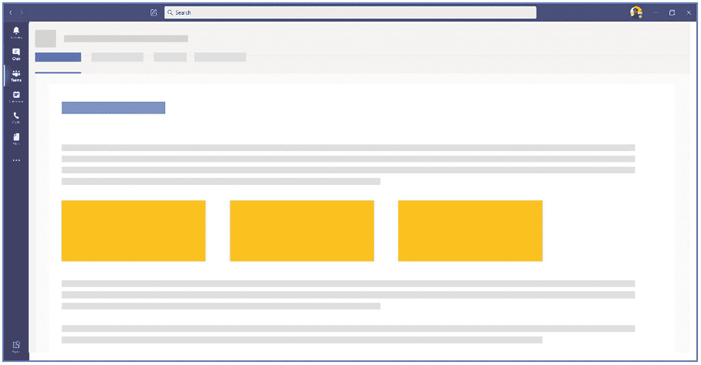

图 5-1

单一画布布局

### 圆柱

对于将项目从一列移动到另一列以指示新状态的工作流，列非常有用。考虑在这些情况下支持拖放。我们建议对详细视图使用对话框或内嵌扩展。见图 [5-2](#Fig2) 。

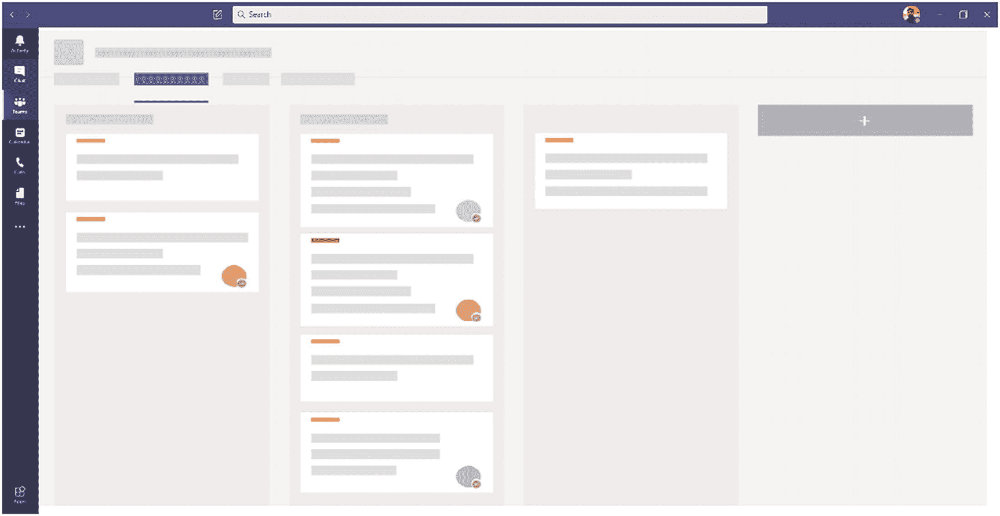

图 5-2

列画布布局

### 目录

列表对于排序和过滤大量数据以及将最重要的事情放在最上面非常有用。使用可排序的列很有帮助。可以向省略号菜单下的每个列表项添加操作。见图 [5-3](#Fig3)

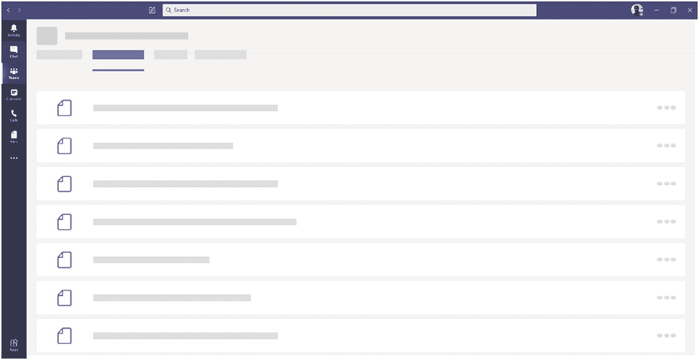

图 5-3

列表画布布局

### 格子

网格对于显示高度可视化的元素非常有用。它有助于在顶部包含一个过滤器或搜索控件(图 [5-4](#Fig4) )。

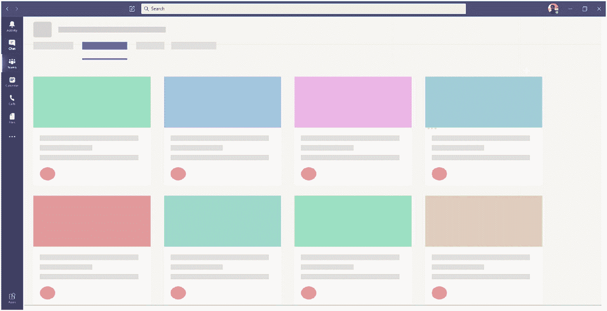

图 5-4

网格画布布局

## Microsoft 团队个人选项卡

在应用包的应用清单中声明了一个自定义选项卡。对于需要作为选项卡包含在应用中的每个网页，您需要定义一个 URL 和一个范围。

Microsoft Teams 支持两种不同类型的选项卡:

*   静态选项卡

*   可配置选项卡

静态选项卡只能使用个人范围，而可配置选项卡可以使用团队或“群聊”范围。*静态标签*为个人用户提供一个私人区域，用户不与团队的其他成员共享信息。

### 定义个人标签

个人应用是具有个人范围的团队应用。作为应用开发人员，您可以选择提供一个侧重于与单个用户交互的应用版本，一个提供嵌入式 web 体验的个人标签。个人应用使用户能够在一个地方查看他们选择的内容。

在应用包的应用清单中声明了一个自定义选项卡。对于需要作为选项卡包含在应用中的每个网页，您需要定义 URL 和范围。无论您选择在渠道/组或个人范围内显示您的选项卡，您都需要在您的选项卡中显示一个“IFramed”HTML 内容页面。对于个人选项卡，内容 URL 由“staticTabs”数组中的“content URL”属性直接在清单中设置。您的选项卡内容对所有用户都是一样的。

### 创建静态选项卡

要创建一个静态选项卡，您需要有一些想要在团队中公开的 web 内容。对于所有用户来说，这些内容应该是相同的。您需要创建一个“man feist . JSON”文件来表示您的静态选项卡。从下面描述的基本模板开始，然后添加用于创建静态选项卡的特定部分。

以下是个人选项卡清单示例:

<colgroup><col class="tcol1 align-left"> <col class="tcol2 align-left"></colgroup> 
| 

名字

 | 

描述

 |
| --- | --- |
| **entity yid** | 这是您选项卡的唯一标识符。 |
| **名称** | 您希望页面在团队中显示的显示名称。 |
| **contentUrl** | 这是作为选项卡内容呈现和显示的 URL。 |
| **网站 Url** | 替代 URL，当您的 contentUrl 呈现时，页面顶部会显示一个带有“转到网站”链接的图标。如果您想将用户引向另一种体验，可以为此链接指定不同的 URL。 |
| **范围** | 定义选项卡在团队客户端中的显示位置。注意:静态选项卡仅支持个人范围。 |

```
   "staticTabs": [
        {
          "entityId": "default-data",
          "name": "My Personal Tab",
          "contentUrl": "https://{{HOSTNAME}}/myPersonalTab/",
          "scopes": [
            "personal"
          ]
        }
      ]

```

个人选项卡的显示内容对所有用户都是相同的，并且在“staticTabs”数组中进行配置。您可以在一个应用中声明多达 16 个个人标签。

Note

移动客户端的个人选项卡目前在开发者预览版中可用。

## Microsoft 团队频道或组选项卡

频道或群组选项卡向频道和群组聊天提供内容，是围绕基于 web 的专用内容创建协作空间的绝佳方式。频道和“群聊”的可配置选项卡，这些选项卡除了包含主内容页面外，还包含一个配置页面。您需要创建一个额外的配置页面，允许您的用户配置您的内容页面 URL，方法是使用 URL 查询字符串参数为该上下文加载适当的内容。这是因为您的频道或群组选项卡可以添加到多个不同的团队或群组聊天中。在每次后续安装时，您的用户将能够配置选项卡，让您根据需要定制体验。当用户添加一个选项卡或配置一个选项卡时，就会有一个 URL 与团队 UI 中显示的选项卡相关联。配置一个选项卡只需向该 URL 添加额外的参数。

例如，当您添加 Azure DevOps 板选项卡时，配置页面允许您选择该选项卡将加载哪个板。配置页 URL 由应用清单中 configurableTabs 数组中的 configurationUrl 属性指定。

### 移动客户端

您的频道或群组选项卡出现在团队移动客户端上，为此， *setSettings* ()方法配置必须有一个用于 *websiteUrl* 属性的值。

### 创建可配置的选项卡

频道或“群聊”被添加到*可配置标签*阵列中。您只能在 configurableTabs 数组中声明一个频道或“群聊”。如果您需要根据不同用户或不断变化的环境而变化的内容，那么您需要一个可配置的选项卡。

下面是一个频道/组标签清单示例:

<colgroup><col class="tcol1 align-left"> <col class="tcol2 align-left"></colgroup> 
| 

名字

 | 

描述

 |
| --- | --- |
| **配置 Url** | 配置页面的 https:// URL。 |
| canupdateconfiguration | 一个值，指示选项卡配置的实例在创建后是否可由用户更新。默认值:true(布尔值) |
| **范围** | 可配置的选项卡仅支持团队和群组聊天范围。(枚举数组) |

```
   "configurableTabs": [
       {
         "configurationUrl": "https://{{HOSTNAME}}/myConfigurableTab/config.html",
         "canUpdateConfiguration": true,
            "scopes": [
           "team",
           "groupchat"
         ]
       }
     ],

```

Note

每个应用最多可以有一个频道或群组标签和十六个个人标签。

## 在自定义选项卡中实现身份验证

团队中的选项卡表示为“Iframes 因此，必须做出一些牺牲。如果是身份验证，那么如果没有正确设置权限，应用就无法导航到第三方提供者。

### 选项卡的 Microsoft 团队身份验证流程

OAuth 2.0 是 Azure AD 和许多其他身份提供者使用的一种开放的身份验证和授权标准。对 OAuth 2.0 的基本理解是在团队中使用身份验证的先决条件。标签和僵尸工具的认证流程略有不同，因为标签和网站非常相似，所以它们可以直接使用 OAuth 2.0 机器人不会也必须做一些不同的事情，但核心概念是相同的。见图 [5-5](#Fig5) 。

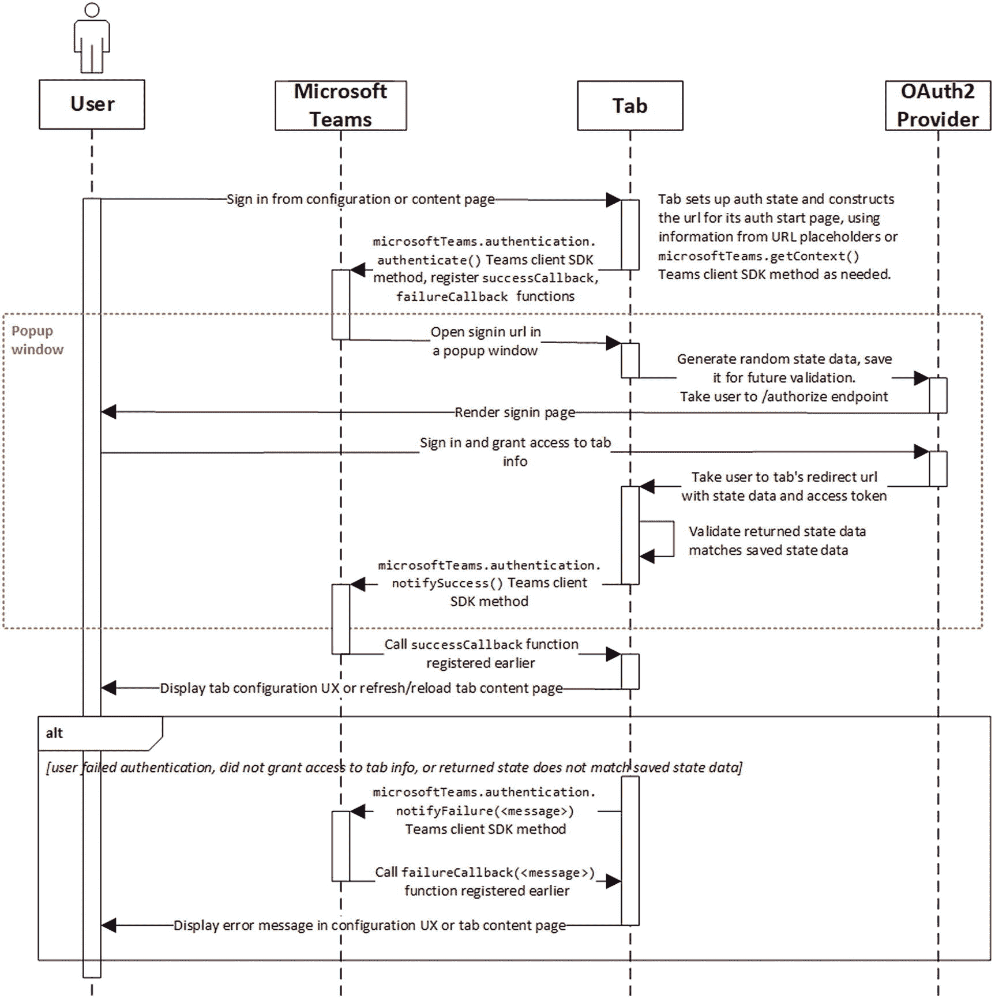

图 5-5

标签的流验证流

*   用户与选项卡配置或内容页面上的内容进行交互，通常是一个标记为“*登录*或“*登录”的按钮。*

*   选项卡为其身份验证起始页构造 URL，可选地使用来自 URL 占位符的信息或通过调用*Microsoft Teams . get context()*Teams 客户端 SDK 方法来简化用户的身份验证体验。

*   选项卡然后调用*Microsoft teams . authentic ation . authenticate()*方法，并注册 *successCallback* 和 *failureCallback* 函数。

*   Teams 在弹出窗口的 iframe 中打开起始页。起始页生成随机状态数据，将其保存以供将来验证，并重定向到身份提供者的/授权端点，如用于 Azure AD 的[`https://login.microsoftonline.com/<tenant`](https://login.microsoftonline.com/%253ctenant)ID>/oauth 2/authorize。用您自己的租户 id ( *context.tid* )替换<租户 id >。

*   与团队中的其他应用授权流一样，起始页必须位于其有效域列表中的域上，并且与登录后重定向页面位于同一域上。

*   要点:OAuth 2.0 隐式授权流在身份验证请求中调用状态参数，该参数包含唯一的会话数据，以防止跨站点请求伪造攻击。以下示例使用随机生成的 GUID 作为状态数据。

*   在提供商的站点上，用户登录并被授权访问该选项卡。

*   提供者使用访问令牌将用户带到选项卡的 OAuth 2.0 重定向页面。

*   选项卡检查返回的状态值是否与之前保存的相匹配，并调用*Microsoft teams . authentic ation . notify success()，*进而调用在步骤 3 中注册的 *successCallback* 函数。

*   团队关闭弹出窗口。

*   该选项卡显示配置 UI，或者刷新或重新加载选项卡内容，具体取决于用户的起始位置。

### 将选项卡上下文视为提示

尽管选项卡上下文提供了关于用户的有用信息，但不要使用这些信息来验证用户，无论您是通过选项卡内容 URL 的 URL 参数还是通过调用 Microsoft Teams client SDK 中的*Microsoft Teams . get context()*函数来获得这些信息。一个恶意的参与者可以使用自己的参数调用您的选项卡内容 URL，一个冒充 MSTeam 的网页可以在一个 iframe 中加载您的选项卡内容 URL，并将其自己的数据返回给 *getContext()* 函数。您应该将选项卡上下文中与身份相关的信息简单地视为提示，并在使用前验证它们。

### 使用 Azure AD 身份验证

您可能希望在团队应用中使用许多服务，其中大多数服务都需要身份验证和授权才能访问服务；服务包括脸书、推特和团队。团队的用户使用 Microsoft Graph 将用户配置文件信息存储在 Azure Active Directory (Azure AD)中，本节将重点介绍使用 Azure AD 访问这些信息的身份验证。

OAuth 2.0 是一个开放的认证标准，被 Azure AD 和许多其他服务提供商使用。理解 OAuth 2.0 是在 Teams 和 Azure AD 中使用身份验证的先决条件。下面给出的例子使用 OAuth 2.0 隐式授权流，目标是最终从 Azure AD 和 Microsoft Graph 读取用户的个人资料信息。

### 使用静默身份验证

Azure Active Directory (Azure AD)中的静默身份验证通过静默刷新身份验证令牌，最大限度地减少了用户需要输入登录凭据的次数。

？ADAL.js 库为 OAuth 2.0 隐式授权流创建了一个隐藏的 iframe，但它指定了 prompt=none，这样 Azure AD 就永远不会显示登录页面。如果因为用户需要登录或授予对应用的访问权限而需要用户交互，Azure AD 会立即返回 ADAL.js 的错误，然后报告给你的应用。此时，如果需要，您的应用可以显示一个登录按钮。

Note

目前，静默认证仅适用于选项卡。从 bot 登录时，它不起作用。

### 使用单点登录身份验证

用户通过他们的工作、学校或微软帐户“登录”MSTeam。您可以利用这一点，在桌面或移动客户端上允许单点登录来授权您的 Microsoft Teams 选项卡。因此，如果用户同意使用你的应用，他们不必在另一台设备上再次同意；他们将自动登录。

### 需要额外 Microsoft Graph 范围的应用

SSO 的当前实现只对用户级权限授予许可:电子邮件、配置文件、offline_access、OpenId，而不是其他 API，例如 user。阅读或邮件。

以下是一些可行的解决方法:

*   租户管理员同意

*   使用 Auth API 请求额外同意

## 练习 1 -创建自定义的 Microsoft 团队个人选项卡

Microsoft Teams Developer Platform 帮助您将业务线(LOB)应用和服务无缝地扩展到 Microsoft 团队中。如果您开发了通用功能应用，它还允许您将自定义应用分发给您的组织或公共用户。

在开始练习之前，请验证您的环境。在本练习中，我将使用安装在我的环境中的以下工具:

*   Node.js - v10.16.0

*   NPM - 6.9.0

*   吞咽
    *   CLI 版本:2.3.0

    *   本地版本:4.0.2

*   MS 团队的约曼生成器- 2.14.0

*   Visual Studio 代码

和

*   Microsoft Azure 订阅

*   Office 365 订阅

在本练习中，您将使用 Microsoft Teams Yeoman generator Visual Studio 代码和 App Studio 创建一个新的 Microsoft Teams 个人选项卡。

### 使用 Yeoman 生成器创建个人选项卡

在本节中，您将使用 Yeoman 生成器(yo teams)创建一个新的个人应用团队应用。本练习将指导您如何创建自定义个人选项卡。

要创建新的个人选项卡应用项目，请在您喜欢的位置创建新的项目目录(图 [5-6](#Fig6) ):

1.  打开命令提示符

2.  创建一个新文件夹“personaltabCh5”

3.  通过运行以下命令，导航到新创建的目录并运行 Yeoman generator for Microsoft Teams:

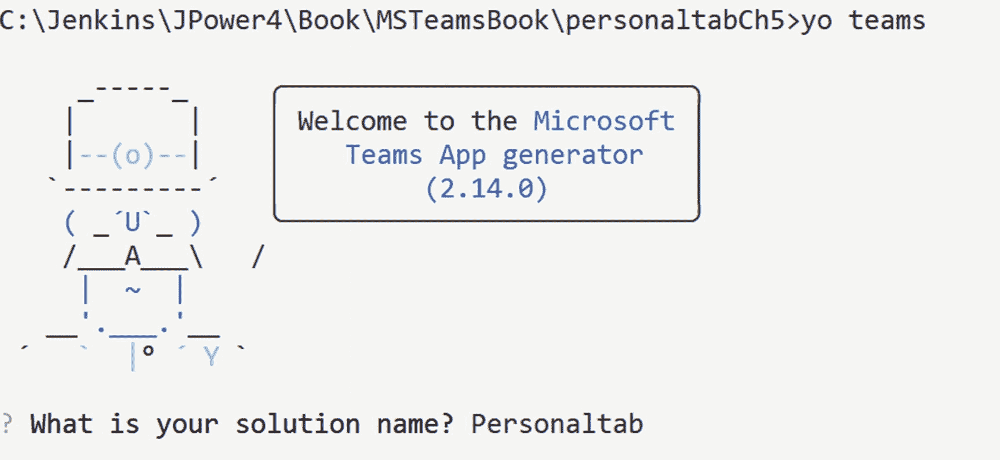

图 5-6

yo 团队发电机

```
yo teams

```

约曼将发射并问你一系列问题。用以下数值回答问题(图 [5-7](#Fig7) ):

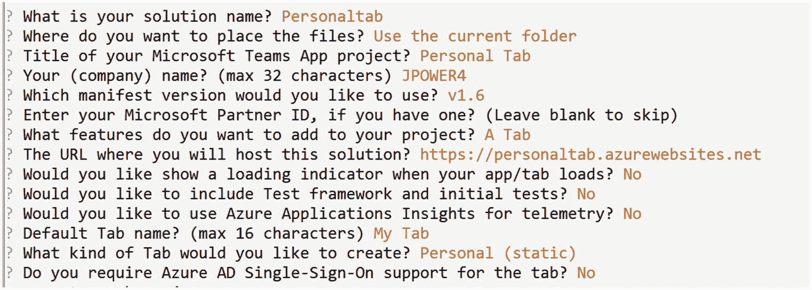

图 5-7

回答约曼问卷

*   您的解决方案名称是什么？个人选项卡

*   您想将文件放在哪里？使用当前文件夹

*   您的 Microsoft Teams 应用项目的标题？个人标签

*   你(公司)的名字？(最多 32 个字符)JPOWER4

*   您希望使用哪个清单版本？v1.6

*   如果您有 Microsoft Partner ID，请输入。(留空以跳过)

*   您希望在项目中添加哪些功能？一个标签

*   您将在其中托管此解决方案的 URL？[T2`https://personaltab.azurewebsites.net`](https://personaltab.azurewebsites.net)

*   当你的应用/标签加载时，你想显示加载指示器吗？不

*   是否要包括测试框架和初始测试？不

*   您希望将 Azure Applications Insights 用于遥测吗？不

*   默认选项卡名称？(最多 16 个字符)我的标签

*   您想创建哪种选项卡？个人(静态)

*   该选项卡是否需要 Azure AD 单点登录支持？不

Note

这些问题的大多数答案在创建项目后都可以更改。例如，在创建或测试项目时，项目所在的 URL 并不重要。

使用**代码打开 Visual Studio 代码。在命令提示符下**(图 [5-8](#Fig8) )。

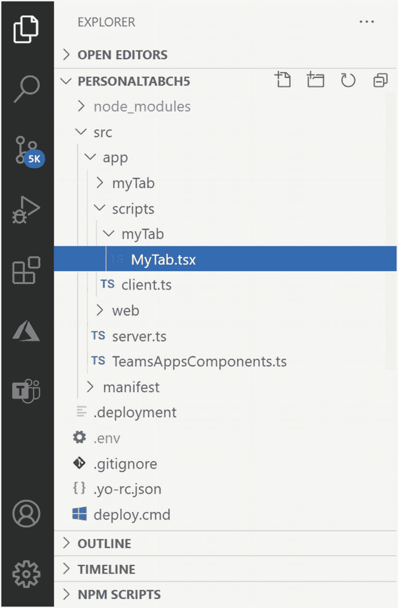

图 5-8

Visual studio 代码

**步骤 1:首先更新个人选项卡范围的** Manifest.json 文件:

*   导航到。/src/manifest/manifest.json 文件，并根据您的 tab 业务替换名称和描述部分。

*   找到“static tabs”:section 并将 entityid - default-data 替换为“personaldata”。

**步骤 2:** 更新 react 组件 MyTab.tsx(对用户的响应)

*   导航到。/src/app/scripts/MyTab/MyTab . tsx

*   找到导出接口 IMyTabState，定义 userEmailID 类型变量

    ```
    export interface IMyTabState extends ITeamsBaseComponentState {

    ```

*   转到 public async componentWillMount()方法，从选项卡上下文中获取用户电子邮件 Id。

```
    entityId?: string;
    userEmailID?: string;
}

```

*   然后转到 render 方法来呈现用户信息。

```
this.setState({
                    entityId: context.entityId,
                    userEmailID: context.upn
                });

```

```
replace <Text content={this.state.entityId} /> to
User Email ID: <Text content={this.state.userEmailID} />

```

该组件将向用户显示电子邮件 id 和样本按钮。这是用于选项卡的基于 TypeScript React 的类。找到 render()方法并添加用户业务线。

要添加更多 React fluent UI 控件**(@ fluent UI/React-north star**)，请参考 App Studio–控件库选项卡中的控件库部分。该选项卡展示了 Microsoft Teams UI 控件库。

以下是控件库中可用的 React 库:

*   **ms teams-UI-styles-core**-UI 组件的核心 CSS 样式。独立于任何 UI 框架。

*   **msteams-ui-icons-core** -团队图标的核心集合。独立于任何 UI 框架。

*   **ms teams-ui**-组件-React-React 绑定库。这取决于 msteams-ui-styles-core 和 React。

*   msteams-ui-icons-react -团队图标集合的 react 绑定库。这取决于 msteams-ui-icons-core 和 React。

前往➤团队应用工作室(图 [5-9](#Fig9) )。

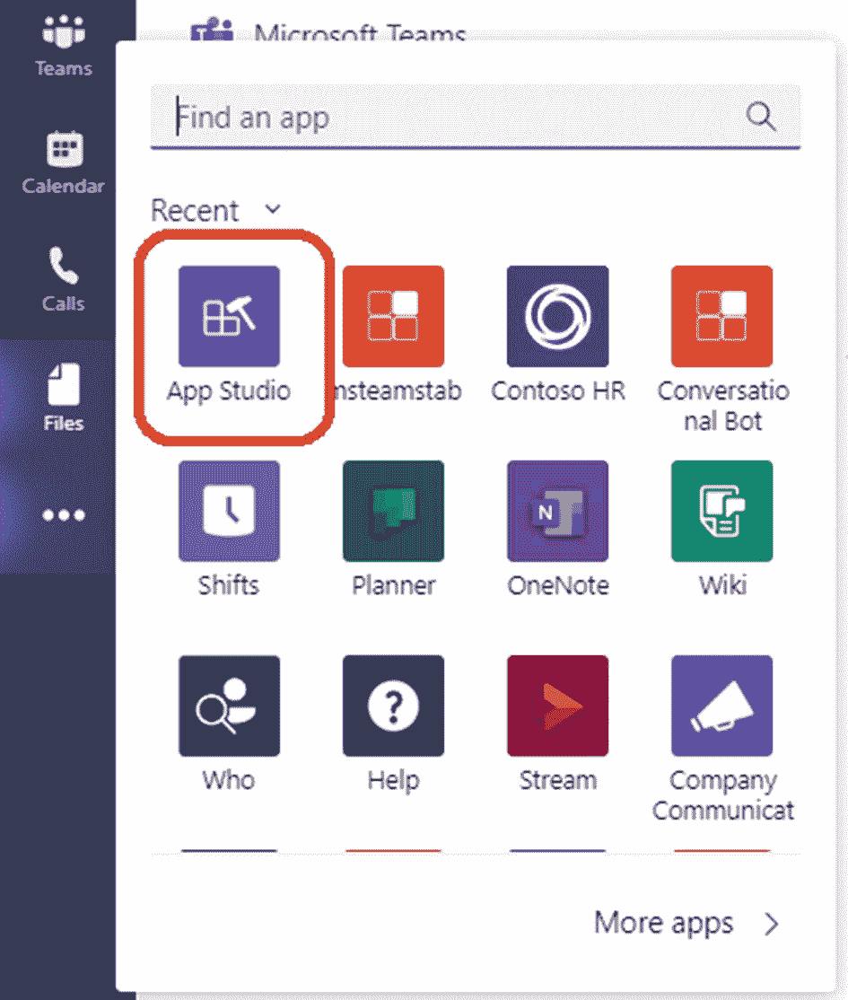

图 5-9

源编辑器

它会开放 App Studio 导航到控件库选项卡，并从 App Studio 获取使用控件库进行开发的示例代码(图 [5-10](#Fig10) )。

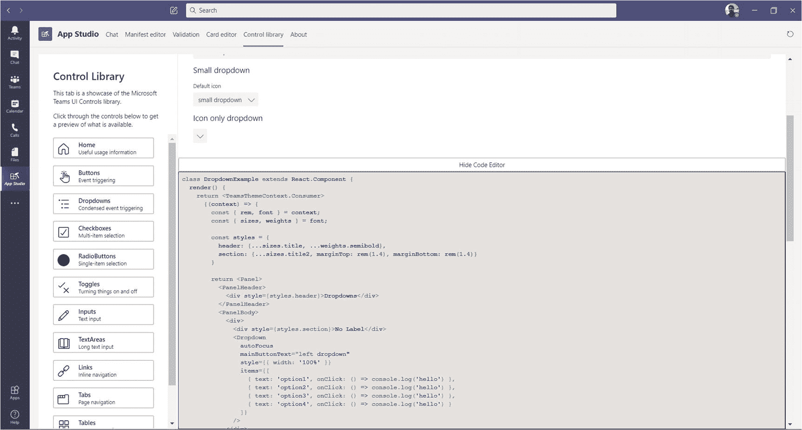

图 5-10

App Studio 控件库

*   ***文件➤保存所有*** 保存的修改

至此，您的个人选项卡已经准备好接受测试了！

### 在本地运行您的个人选项卡

打开命令提示符，导航到项目文件夹并执行以下命令；要运行您的选项卡，您可以使用 **gulp serve** 命令。

```
gulp serve

```

这将为您构建并启动一个本地 web 服务器来测试您的应用。每当您在项目中保存文件时，该命令也会重新生成应用。

您现在应该能够浏览*http://localhost:3007/MyTab/index . html*以确保您的选项卡正在呈现。见图 [5-11](#Fig11) 。

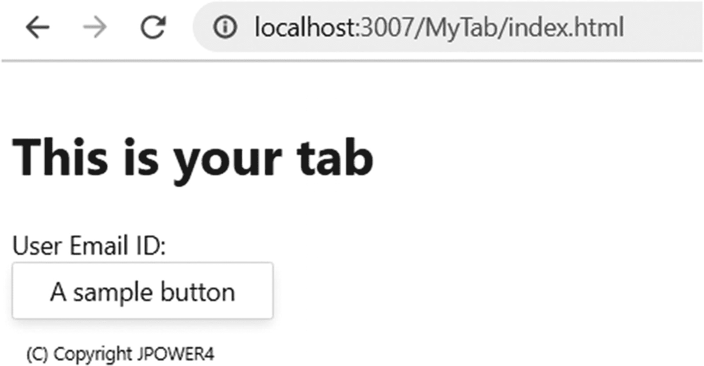

图 5-11

个人选项卡本地主机渲染

### 在团队中测试个人选项卡

打开命令提示符，导航到项目文件夹，并执行以下命令:

```
gulp ngrok-serve

```

这个 gulp 任务将运行命令行控制台中显示的许多其他任务。ngrok-serve 任务构建您的项目并启动一个本地 web 服务器(`http://localhost:3007`)。然后它用一个随机的子域启动 ngrok，这个子域会创建一个到本地 web 服务器的安全 URL。

在开发过程中，可以使用 ngrok 工具进行测试，该工具可以创建一个安全的可旋转的 URL，指向您的本地 HTTP 服务器。Ngrok 作为一个依赖项包含在项目中，因此不需要设置或配置任何东西(图 [5-12](#Fig12) )。

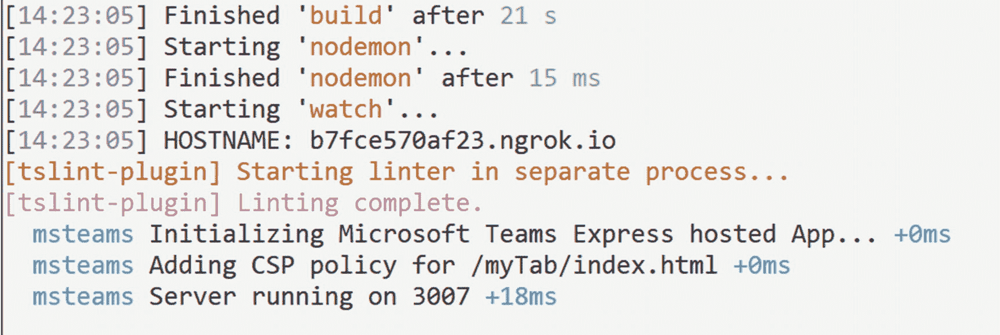

图 5-12

吞咽 ngrok 发球执行

Ngrok 已经创建了临时 URL b7fce570af23.ngrok.io，它将映射到我们本地运行的 web 服务器。

### 在 Microsoft 团队中安装个人选项卡

现在让我们在 MSTeam 中安装应用。在浏览器中，导航到 [`https://teams.microsoft.com`](https://teams.microsoft.com) ，使用工作和学校帐户的凭据登录。

Microsoft Teams 可用作 web 客户端、桌面客户端和移动客户端。使用应用栏导航菜单，选择更多添加的应用按钮。然后选择更多应用，接着上传自定义应用，然后为我或我的团队上传(图 [5-13](#Fig13) )。

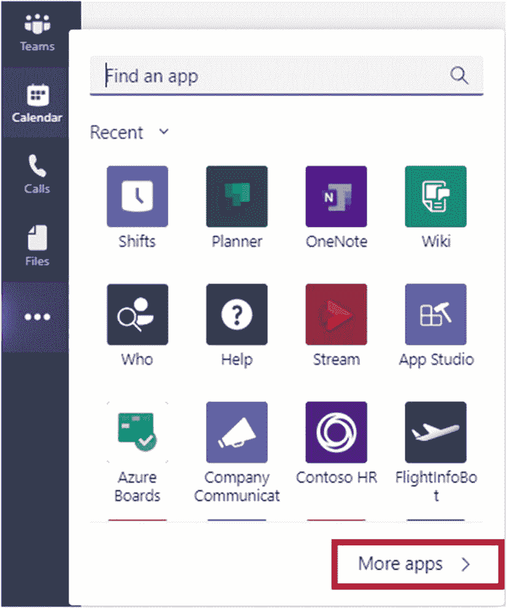

图 5-13

向 MS 团队添加应用

在出现的文件对话框中，选择项目中的 Microsoft Teams 包。这个应用包是一个 ZIP 文件，可以在项目**中找到。/包**文件夹(图 [5-14](#Fig14) )。

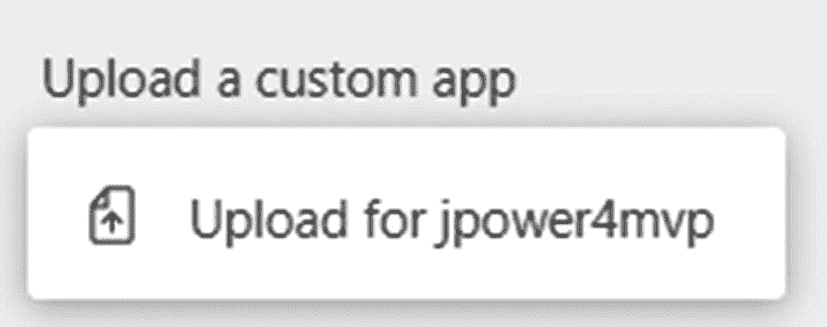

图 5-14

上传应用

安装后，您将能够在应用列表中看到该应用(图 [5-15](#Fig15) )。

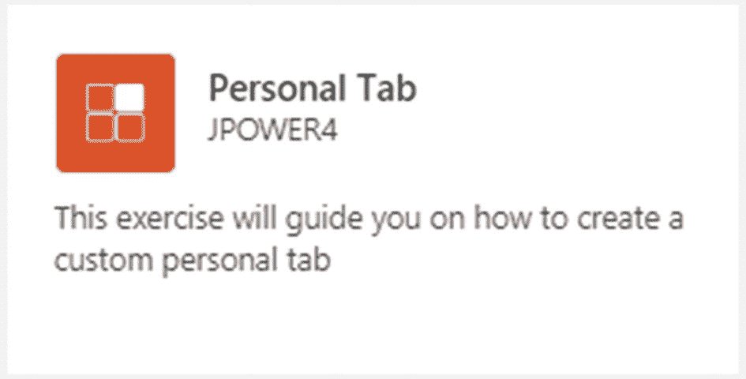

图 5-15

安装的个人应用

点击该应用，MSTeam 将显示该应用的摘要(图 [5-16](#Fig16) )。

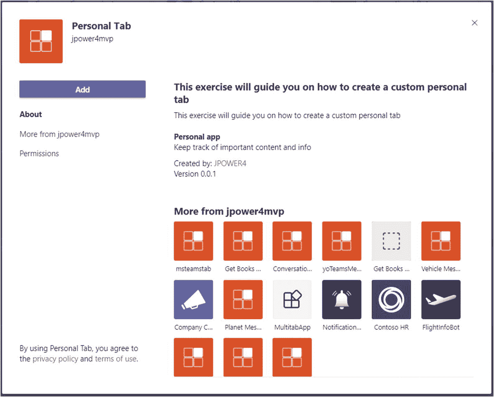

图 5-16

添加个人选项卡

### 在团队中安装个人选项卡应用

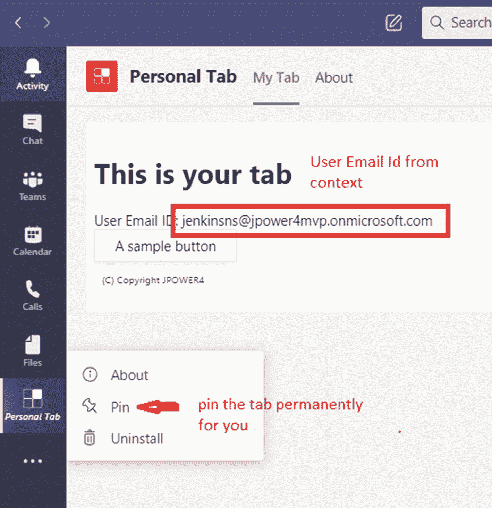

图 5-17

个人标签输出

*   单击“添加”按钮，导航到“个人”选项卡进行测试。

*   此外，您可以将个人选项卡永久固定在最左侧的导航栏中。

*   或者选择...菜单并从列表中选择您的应用(图 [5-17](#Fig17) )。

在本练习中，您已经为自定义 Microsoft Teams 应用创建了个人选项卡。

## 练习 2 -创建自定义的 Microsoft 团队频道或群组选项卡

在本练习中，您将使用 Yeoman 生成器(yo teams)为 Teams 应用创建一个新的可配置选项卡。本练习将指导您如何为频道或群组聊天创建自定义选项卡。

要创建新的可配置选项卡应用项目，请在您喜欢的位置创建一个新的项目目录。

1.  打开命令提示符并创建一个新文件夹“configurabletabCh5”

2.  导航到新创建的目录

3.  通过运行以下命令来运行 Yeoman generator for Microsoft Teams:

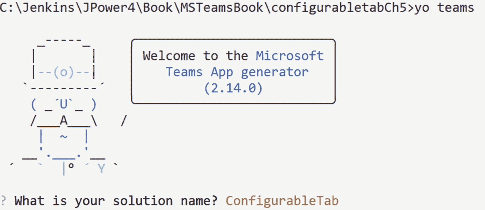

图 5-18

可配置选项卡的 yo 团队

1.  如果需要，修改解决方案名称。我已将其更改为“可配置选项卡”(图 [5-18](#Fig18) )。

```
yo teams

```

约曼将发射并问你一系列问题。用以下数值回答问题(图 [5-19](#Fig19) ):

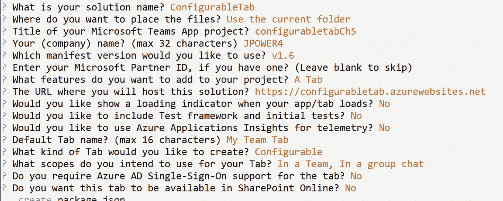

图 5-19

回答约曼问卷

*   您的解决方案名称是什么？可配置选项卡

*   您想将文件放在哪里？使用当前文件夹

*   您的 Microsoft Teams 应用项目的标题？可配置表 5

*   你(公司)的名字？(最多 32 个字符)JPOWER4

*   您希望使用哪个清单版本？v1.6

*   如果您有 Microsoft Partner ID，请输入。(留空以跳过)

*   您希望在项目中添加哪些功能？一个标签

*   您将在其中托管此解决方案的 URL？[T2`https://configurabletab.azurewebsites.net`](https://configurabletab.azurewebsites.net)

*   当你的应用/标签加载时，你想显示加载指示器吗？不

*   是否要包括测试框架和初始测试？不

*   您希望将 Azure Applications Insights 用于遥测吗？不

*   默认选项卡名称？(最多 16 个字符)我的团队选项卡

*   您想创建哪种选项卡？可配置的

*   您打算在您的选项卡上使用什么范围？**组队，群聊**(我选择了组队和群聊)

*   该选项卡是否需要 Azure AD 单点登录支持？不

*   是否希望此选项卡在 SharePoint Online 中可用？不

Note

这些问题的大多数答案在创建项目后都可以更改。例如，在创建或测试项目时，项目所在的 URL 并不重要

使用**代码打开 Visual Studio 代码。在命令提示符下**(图 [5-20](#Fig20) )。

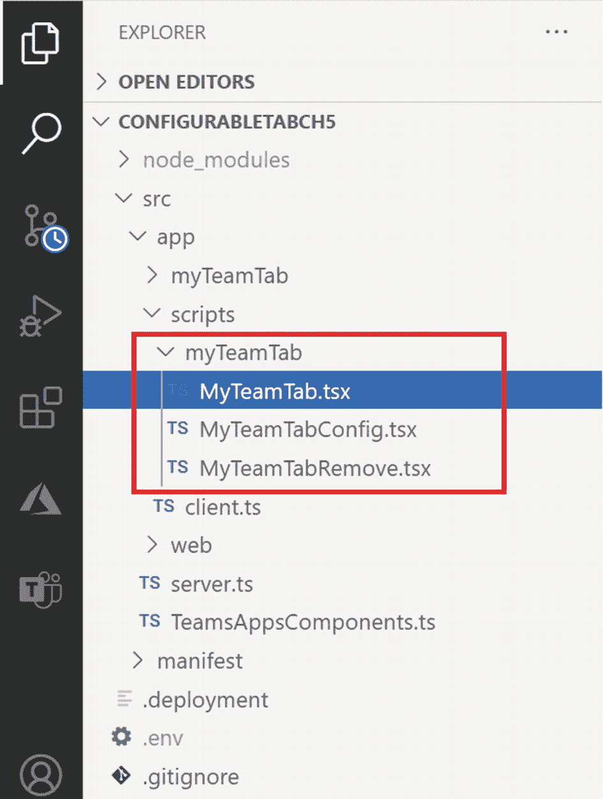

图 5-20

Visual studio 代码 OOB

可配置选项卡项目显示了三个文件:MyTeamTab、config 和 Remove react 组件。

*   myteamtab . tsx–自定义选项卡内容页面的实现

*   myteamtabconfig . tsx–我的团队选项卡配置页面的实现

*   MyTeamTabRemove.tsx -我的团队选项卡移除页面的实现

**步骤 1:** 更新 Manifest.json 文件配置可配置页签:

*   导航到。/src/manifest/manifest.json 文件，并根据您的 tab 业务替换名称和描述部分。

```
"configurableTabs": [{
        "configurationUrl": "https://{{HOSTNAME}}/myTeamTab/config.html",
        "canUpdateConfiguration": true,
        "scopes": [
            "team",
            "groupchat"
        ]
    }],

```

**第二步:**更新 react 组件 MyTeamTab.tsx(响应用户的自定义选项卡内容页面):

*   在您的项目中，导航到/src/app/scripts/MyTeamTab/MyTeamTab . tsx 文件

*   找到导出接口 IMyTeamTabState，定义 **useremail，TeamID，Teamname，ChannelID，ChannelName** 类型变量。

*   转到 public async componentWillMount()方法，从选项卡上下文中获取用户电子邮件 Id、团队和渠道详细信息。

```
export interface IMyTeamTabState extends ITeamsBaseComponentState {
    entityId?: string;
    useremail?: string;
    TeamID?: string;
    TeamName?: string;
    ChannelID?: string;
    ChannelName?: string;
}

```

*   然后转到 render 方法来呈现用户信息并找到这些信息:

```
this.setState({
                    entityId: context.entityId,
                    useremail: context.upn,
                    TeamID: context.teamId,
                    TeamName: context.teamName,
ChannelID: context.channelId, ChannelName: context.channelName

                });

```

*   将下面给出的代码添加到上述语句的旁边

```
"<div><Text content={this.state.entityId} /></div>"

```

```
<div>User Email ID : <Text content={this.state.useremail} /></div>
        <div>Team ID : <Text content={this.state.TeamID} /></div>
        <div>Team Name : <Text content={this.state.TeamName} /></div>
        <div>Chanel ID : <Text content={this.state.ChannelID} /></div>
        <div>Channel Name : <Text content={this.state.ChannelName} /></div>

```

该组件将显示用户电子邮件 id，团队和渠道信息，以及样本按钮。这是用于选项卡的基于 TypeScript React 的类。找到 render()方法并添加一个用户业务逻辑行。

要添加更多 react fluent UI 控件**(@ fluent UI/react-north star**)，请参考 App Studio–控件库选项卡中的控件库部分。该选项卡展示了 Microsoft Teams UI 控件库。

*   ***文件➤保存所有*** 保存的修改

*   至此，您的可配置选项卡已经准备好进行测试了！

### 在本地运行您的可配置选项卡

打开命令提示符。导航到项目文件夹并执行以下命令；要运行您的选项卡，您可以使用 **gulp serve** 命令。

```
gulp serve

```

这将为您构建并启动一个本地 web 服务器来测试您的应用。每当您在项目中保存文件时，该命令也会重新生成应用。

你现在应该能够浏览到*http://localhost:3007/MyTeamTab*以确保你的标签正在呈现(图 [5-21](#Fig21) )。

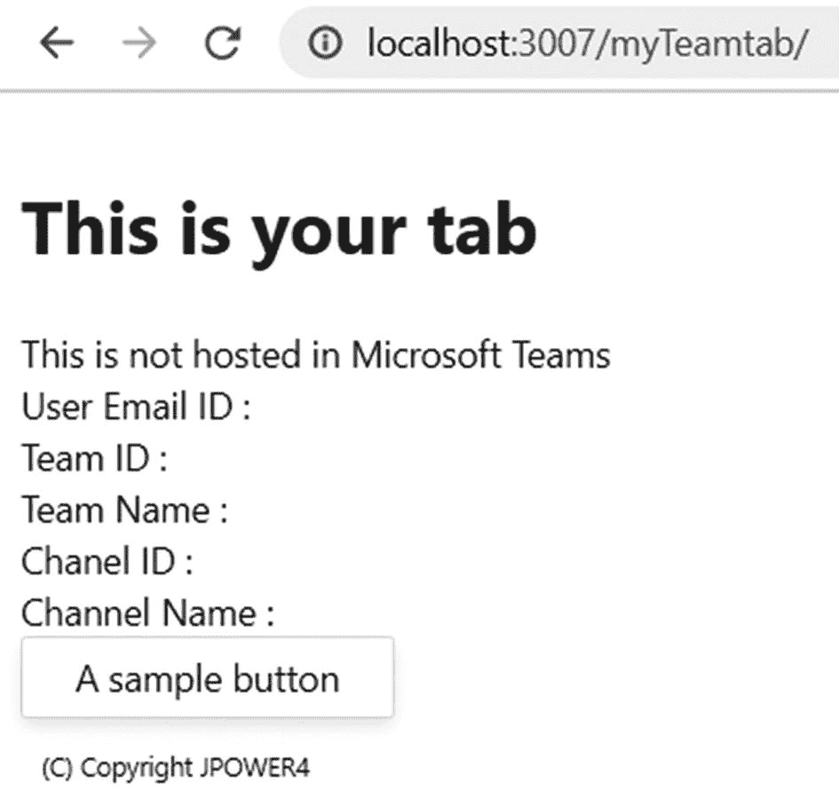

图 5-21

可配置选项卡本地主机执行

### 在团队中测试可配置选项卡

打开命令提示符，导航到项目文件夹，并执行以下命令:

```
gulp ngrok-serve

```

这个 gulp 任务将运行命令行控制台中显示的许多其他任务。ngrok-serve 任务构建您的项目并启动一个本地 web 服务器(`http://localhost:3007`)。然后它用一个随机的子域启动 ngrok，这个子域会创建一个到本地 web 服务器的安全 URL。

在开发过程中，可以使用 ngrok 工具进行测试，该工具可以创建一个安全的可旋转的 URL，指向您的本地 HTTP web 服务器。Ngrok 作为一个依赖项包含在项目中，因此不需要设置或配置任何东西(图 [5-22](#Fig22) )。

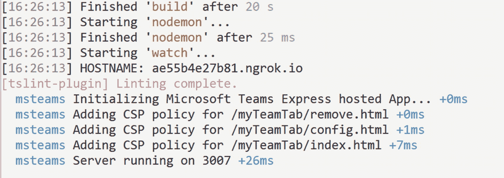

图 5-22

Ngrok 服务执行

Ngrok 已经创建了临时 URL b7fce570af23.ngrok.io，它将映射到我们本地运行的 web 服务器。

### 在 Microsoft 团队中安装可配置选项卡

现在让我们在 MSTeam 中安装应用。在浏览器中，导航到 [`https://teams.microsoft.com`](https://teams.microsoft.com) ，使用工作和学校帐户的凭据登录。

Microsoft Teams 可用作 web 客户端、桌面客户端和移动客户端。使用应用栏导航菜单，选择更多添加的应用按钮。然后选择更多应用，接着上传自定义应用，然后为我或我的团队上传。见图 [5-23](#Fig23)

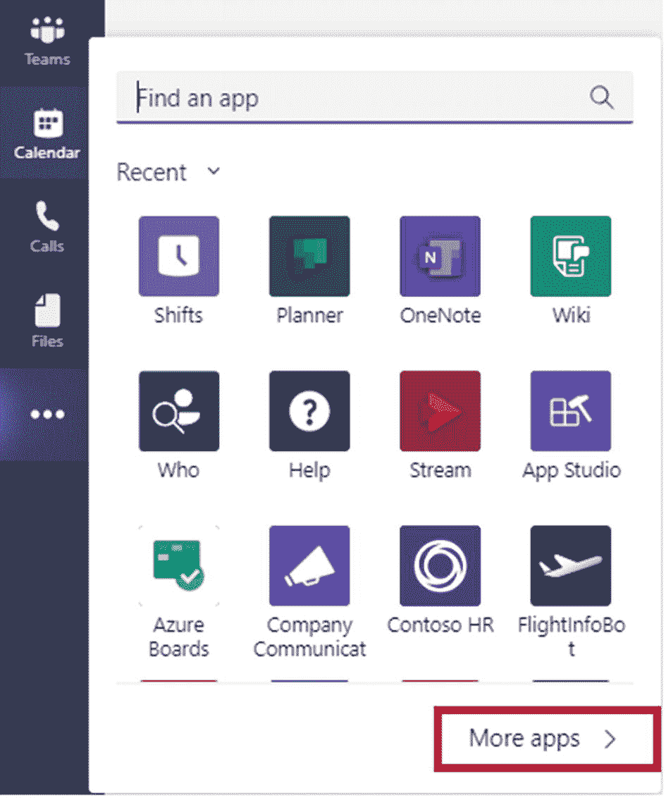

图 5-23

向 MS 团队添加应用

在出现的文件对话框中，选择项目中的 Microsoft Teams 包。这个应用包是一个 ZIP 文件，可以在项目**中找到。/包**文件夹(图 [5-24](#Fig24) )。


图 5-24

上传应用

安装后，您将能够在应用列表中看到该应用(图 [5-25](#Fig25) )。

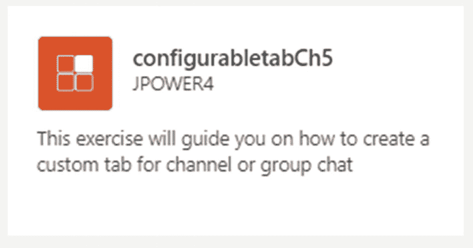

图 5-25

安装的应用

点击该应用，MSTeam 将显示该应用的摘要(图 [5-26](#Fig26) )。

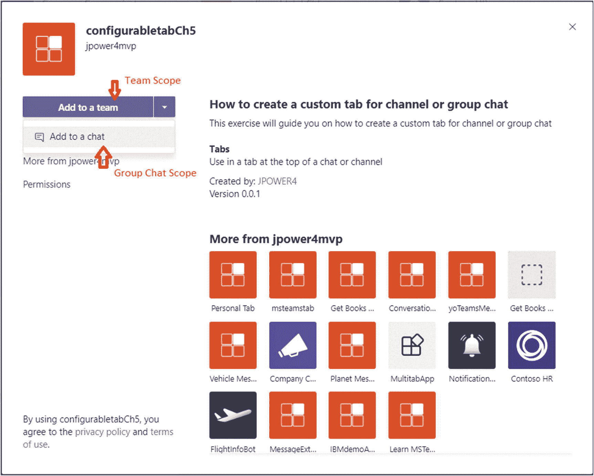

图 5-26

将应用添加到团队

### 在团队中安装可配置选项卡

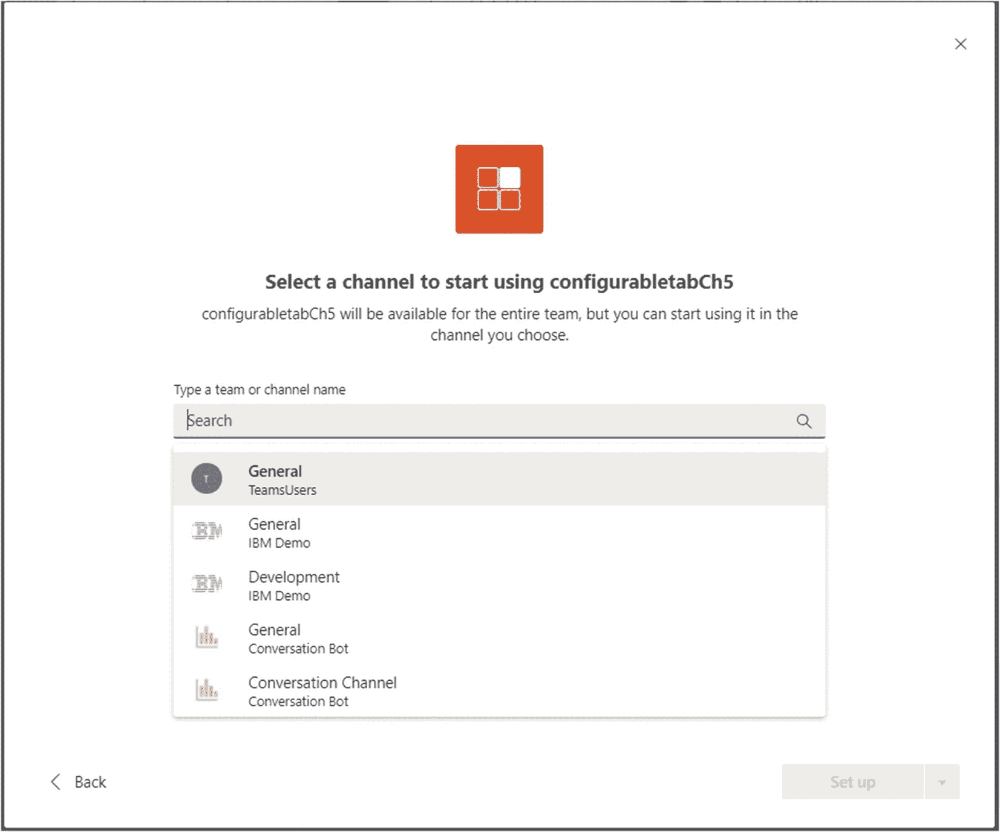

图 5-27

选择渠道团队

*   单击“添加到团队”按钮，导航到“配置”页面，在“频道”中添加该选项卡。

*   然后搜索并选择频道以设置选项卡(图 [5-27](#Fig27) )。

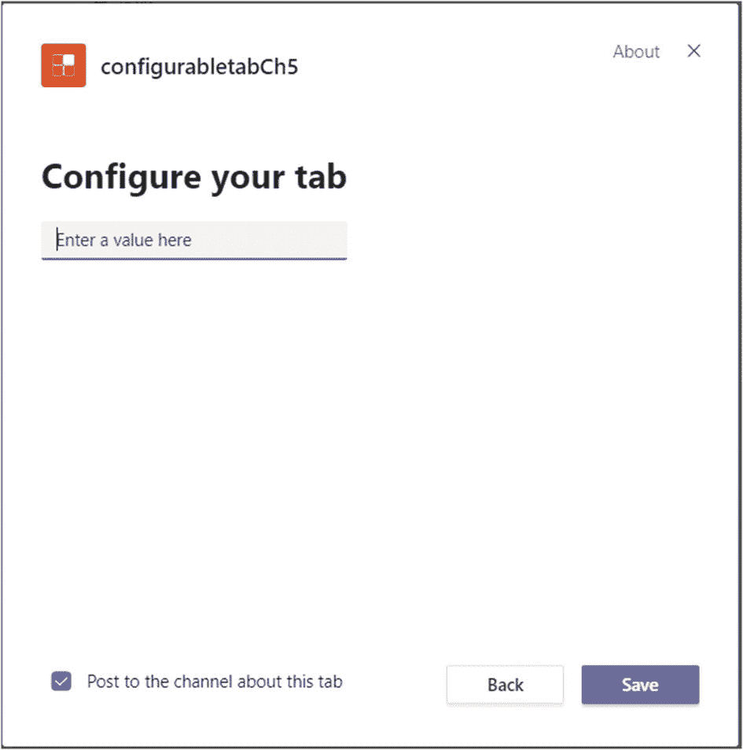

图 5-28

输入选项卡名称

*   输入选项卡名称“我的团队选项卡”并保存(图 [5-28](#Fig28) )。

它将在频道中添加选项卡，并通过选项卡显示所有信息，如下图 [5-29](#Fig29) 所示。

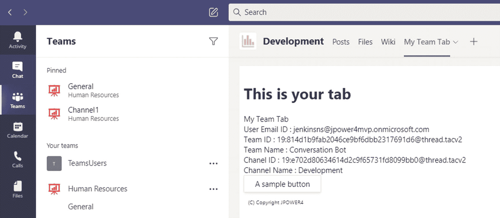

图 5-29

可配置的选项卡名称输出

在本练习中，您已经为自定义 Microsoft Teams 应用创建了一个可配置的选项卡。

## 结论

在本章中，您已经学习了选项卡的各种功能，以及如何使用 Yeoman generator (yo teams)创建个人和可配置的应用并将其添加到 Microsoft 团队中。它还介绍了如何在选项卡中使用静默身份验证、SSO 身份验证和 Azure AD 身份验证。

您还学习了如何使用 Yeoman generator for Microsoft Teams 创建选项卡。在接下来的章节中，你将开始学习 MSTeam 应用的不同选项和功能。