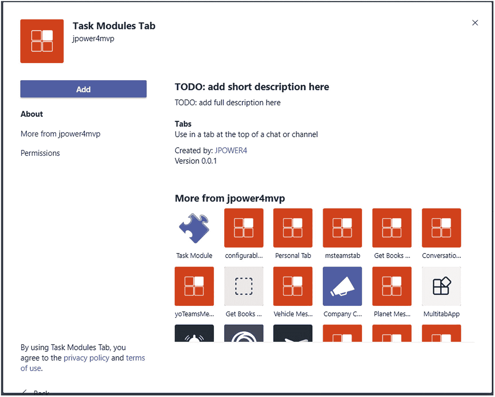
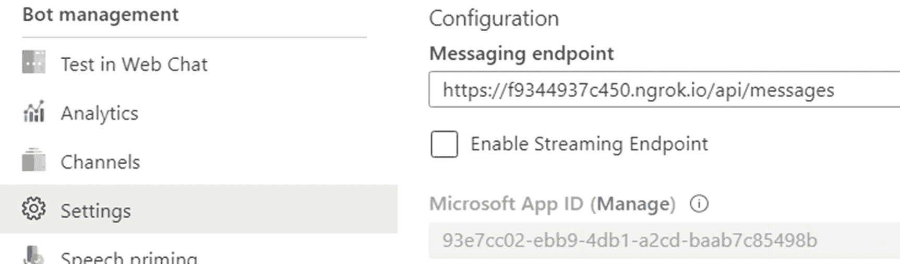

# 6.使用任务模块收集用户输入

任务模块是弹出的体验模式，因此您可以使用 JavaScript 内容或自定义 Microsoft Teams 应用程序的适配卡来填充 HTML。此外，您可以使用任务模块收集用户的输入。

在这一章中，你将学习任务模块的各种特性——它解释了如何为任务模块创建模态，并举例指导用户。任务模块是用户从 Microsoft 团队参与您的应用程序的一种强大而简单的方式。

## 任务模块概述

任务模块是从 tab 或 bot 团队的应用程序中收集输入或向用户显示信息的弹出窗口。任务模块加载在基于 iframe 的小部件中，并支持两种类型的呈现选项。第一个是用 JavaScript 脚本运行你的定制 HTML 页面，第二个是适配卡。Tabs 同时支持 HTML 页面和适配卡，但是 bot 只支持适配卡。然而，任务模块建立在 Microsoft Teams 选项卡之上，它们本质上是一个弹出窗口中的选项卡，用于收集用户输入或显示视频、表单或自适应卡。

可以通过三种方式调用任务模块:

*   频道或个人标签

    使用“Microsoft 团队”选项卡，您可以从选项卡上的按钮、链接或菜单中调用任务模块。

*   蝇蛆病

    从你的机器人发出的卡片上的按钮。当您不需要频道中的每个人都看到您在用机器人做什么时，这特别有用。

*   来自深层链接的团队之外

    您还可以创建 URL 来从任何地方调用任务模块。这里将详细介绍这一点。

图 [6-1](#Fig1) 显示了任务模块的样子。


图 6-1

任务模块视图

1.  你的应用程序的颜色图标。

2.  你的应用的简称。

3.  在“TaskInfo”对象的 title 属性中指定的任务模块的标题。

4.  适应性或 HTM 页面的标题。

5.  如果您使用“TaskInfo”对象的 URL 属性加载自己的网页，则橙色矩形是您的网页出现的位置。

6.  黄色矩形；如果您通过“TaskInfo”对象的 Card 属性显示自适应卡，则会为您添加填充。

7.  自适应卡按钮将在这里渲染。如果您使用自己的页面，您必须创建自己的按钮。

任务模块可以从标签、机器人或深层链接中调用，其中出现的内容可以是 HTML 或适配卡，因此在如何调用它们以及如何处理用户交互的结果方面有很大的灵活性。

## 使用选项卡中的任务模块收集用户输入

将任务模块添加到选项卡可以大大简化任何需要数据输入的工作流程。任务模块允许您使用带有 JavaScript 和自适应卡的 HTML 在团队感知的弹出窗口中收集他们的输入。

### 使用 JavaScript 和 HTML

*   使用 TaskInfo 对象调用 Teams 客户端 SDK 函数 tasks.startTask()。

*   对于使用 URL 属性的 html 和 JavaScript 任务信息:

*   使用 Teams 客户端 SDK 函数 tasks.startTask()和可选的 submitHandler(err，result)回调函数

```
const taskInfo = {
            url: this.appRoot() + `/taskModulesTab/getinfo.html`,
            title: "Custom Form",
            height: 300,
            width: 400
        };

```

*   在任务模块代码中，用户完成输入后，调用 Teams SDK 函数 tasks.submitTask()，将结果对象作为参数。如果在 tasks.startTask()中指定了 submitHandler 回调，Teams 将使用结果作为参数来调用它。

```
microsoftTeams.tasks.startTask(taskModuleInfo);

```

*   如果调用 tasks.startTask()时出现错误，则使用 err 字符串调用 submitHandler 函数。

```
const submitHandler = (err, result) => {
            this.setState(Object.assign({}, this.state, {
                name: `Name : ${result.name}`,
            }));
};

```

*   您还可以在调用 teams.startTask()时指定 completionBotId 在这种情况下，结果将发送给 bot。

```
microsoftTeams.tasks.startTask(taskInfo, submitHandler);

```

### 键盘和辅助功能指南

正如上一节所讨论的，任务模块允许您使用 HTML 或自适应卡在弹出绑定中收集用户输入；也就是说，任务模块呈现在 HTML 页面或适配卡中。在使用基于 HTML 的任务模块时，处理所有键盘事件是您的责任，但是自适应卡使用开箱即用的功能来处理键盘事件。

任务模块 HTML 文件位于项目文件夹下:

```
Ex: ...\taskModulesTab\src\app\web\taskModulesTab\index.html

```

要在 HTML 页面中呈现 tomnoddies 应用程序:

```
taskModulesTab.TaskModulesTab.render(document.getElementById('app'), {});

```

在 HTML 页面中，我们使用 JavaScript 来处理事件并将数据返回到用户选项卡应用程序。下面的代码初始化 Microsoft teams，处理 escape 键，并在 HTML 页面中验证输入表单。

```
   <script>
          microsoftTeams.initialize();

        //- Handle the Esc key
        document.onkeyup = function(event) {
            if ((event.key === 27) || (event.key === "Escape")) {
                microsoftTeams.tasks.submitTask(null);
//- this will return an err object to the completionHandler()
            }
       }

        function validateForm() {
            let customerInfo = {

                name: document.forms["customerForm"]["name"].value,
                email: document.forms["customerForm"]["email"].value,
                designation: document.forms["customerForm"]["designation"].value
            }

            microsoftTeams.tasks.submitTask(customerInfo, "");
            return true;
        }
   </script>

```

然后，微软团队将确保从任务模块标题到 HTML 的键盘导航正常工作，反之亦然。

### 使用适配卡

第二个选项是一个自适应卡，用于收集团队中任务模块的输入。为此，请遵循以下步骤。

*   使用 TaskInfo 对象和 TaskInfo.card 调用 Teams 客户端 SDK 函数 tasks.startTask()，task info . Card 包含要在任务模块弹出窗口中显示的适配卡的 JSON。

*   对于使用卡的自适应卡。

*   如果在 tasks.startTask()中指定了 submitHandler 回调，那么如果在调用 tasks.startTask()时出现错误，或者如果用户使用右上角的 X 关闭任务模块弹出窗口，Teams 将使用 err 字符串调用它。

```
const taskModuleInfo = {
            title: "Custom Form",
            card: adaptiveCard,
            width: 500,
            height: 500
        };

```

*   如果用户按下一个动作。Submit 按钮，那么它的数据对象将作为 result 的值返回。

```
microsoftTeams.tasks.startTask(taskInfo, submitHandler);

```

```
"actions": [{
        "type": "Action.Submit",
        "title": "Submit"
    }]

```

### 任务信息对象

taskInfo 对象包含告知 Microsoft 团队有关任务模块的属性。该对象包括以下属性:

*   **标题**(字符串):任务模块标题

*   **高度&宽度**(数字|字符串):任务模块弹出的模态高度和宽度尺寸或预定义的尺寸(小、中、大)。命名大小是显示任务模块的可用空间的预定义百分比。对于宽度，它们是 20%、50%和 60%，而高度值是 20%、50%和 60%。

```
   microsoftTeams.tasks.startTask(taskInfo, Callback);

   const taskInfo = {
               url: this.appRoot() + `/taskModulesTab/getinfo.html`,
               title: "Custom Form",
               height: 300,
               width: 400,
         failbackurl:   "",
         card: “adaptivecardjosnobj”
        };

```

**url**(string):URL 是任务模块 html 页面路径，作为任务模块内部的< iframe >加载，URL 域应该添加到清单包文件的 validDomains 数组部分

*   **failbackUrl** (string):如果 Teams 客户端不支持任务模块特性，那么这个 Url 将在浏览器选项卡中打开。

*   **卡**:如果你不是用 HTML 页面做任务模块，那么添加卡对象或者适配卡 bot 卡附件，如果你是用 bot 的任务模块，那么 HTML 不会支持，你必须有用户卡。

*   **completionBotId** (string):使用 bot 时，需要指定 bot APP ID 来发送用户与任务模块交互的结果。

## 任务模块中的深层链接

可以使用按钮和 Microsoft 团队中的其他类型的用户操作来调用任务模块。调用任务模块的另一种方式是使用深层链接。深层链接是包含特定值的 URL，Microsoft Teams 使用这些值来调用任务模块。

深层链接的格式如下:

*   JavaScript 和 HTML 的深层链接语法

```
https://teams.microsoft.com/l/task/<APP_ID>?url=<TaskInfo.url>&height=<TaskInfo.height>&width=<TaskInfo.width>&title=<TaskInfo.title>

```

*   自适应卡的深层链接语法

```
https://teams.microsoft.com/l/task/APP_ID?url=<TaskInfo.url>&height=<TaskInfo.height>&width=<TaskInfo.width>&title=<TaskInfo.title>&completionBotId=BOT_APP_ID

```

```
https://teams.microsoft.com/l/task/APP_ID?card=<TaskInfo.card>&height=<TaskInfo.height>&width=<TaskInfo.width>&title=<TaskInfo.title>&completionBotId=BOT_APP_ID

```

让我们来看看这些价值中的每一个:

*   **< APP_ID > :** 这是自定义微软团队应用的 ID。应用 ID，一个 GUID，可以在应用的 **manifest.json** 文件中找到。

*   **< TASKINFO。*>:**URL 查询字符串中的附加属性映射到 **taskInfo** 对象上的特定属性。

深层链接可以在任何地方使用，包括在微软团队渠道或外部应用程序中的对话。

## 使用任务模块的机器人

任务模块可以通过自适应卡和机器人框架卡上的机器人按钮触发，如英雄卡或缩略图卡或 Office 365 连接器。任务模块提供丰富的用户体验，多个对话步骤必须跟踪机器人状态，并允许用户中断或取消流程。机器人只支持自适应卡任务模块。

调用任务模块有两种方式:

*   一种新的调用消息任务/获取

    这是为 Bot 框架卡(动作)调用卡动作的新方法。从你的机器人中动态地获取任务模块模式弹出卡。

*   深层链接 URL

    深度链接 URL 支持 Bot 框架卡的打开 URL 卡操作(操作。OpenUrl)。使用深层链接 URL，任务模块 URL 避免了相对于任务/提取的服务器往返。

带有 bot ID 的深层链接语法:

```
https://teams.microsoft.com/l/task/APP_ID?card/url=<TaskInfo.card>&height=<TaskInfo.height>&width=<TaskInfo.width>&title=<TaskInfo.title>&completionBotId=BOT_APP_ID

```

基于实现，我们需要修改 card/url 和 fallbackUrl。

### 通过任务/提取调用任务模块

当用户单击按钮时，它会调用 card action (Action。提交)并调用发送给机器人的消息。然后，HTTP 响应对象使用任务信息对象调用消息，并显示给任务模块。

### 提交任务模块的结果

当用户完成任务模块并单击提交按钮时，返回给机器人的结果就像它使用选项卡的方式一样，但与 HTML 和自适应卡有一些不同。

#### HTML/JavaScript 和适配卡

在 HTML 中，它使用 JavaScript 验证用户输入的内容，并调用提交任务函数。如果您想要关闭没有任何参数的任务模块，但是请记住，总是需要从选项卡中为任务模块调用传递参数。若要正确处理 submitHandler 函数，请传递一个对象或字符串。然后团队将调用 submitHandler: function，error 将为 null，结果将是您传递给 submitTask 函数的对象或字符串。

在适配卡中，当用户点击提交按钮(动作)时，它使用任务/提交消息发送给机器人。提交)。与 HTML 相比，自适应卡可以轻松处理来自任务模块的数据。

### 任务/提交的灵活性

回应任务/提交消息时，您有几种选择:

*   团队将在弹出的消息框中显示该值。

*   允许您在向导/多步骤体验中将自适应卡序列“链接”在一起。

    ```
    {
      "task": {
        "type": "continue",
        "value": <TaskInfo object>
      }
    }

    ```

```
{
  "task": {
    "type": "message",
    "value": "Message text"
  }
}

```

### 机器人框架卡动作与自适应卡动作。提交操作

我们有两个卡动作:机器人框架卡动作和自适应卡动作。提交操作以及使用模式时的一个小差异。下面的语法显示了不同之处。

首先是机器人框架卡动作:

```
{
  "type": "invoke",
  "title": "Buy",
  "value": {
    "type": "task/fetch",
    <...>
  }
}

```

现在是自适应卡动作。提交操作:

```
{
  "type": "Action.Submit",
  "id": "btnBuy",
  "title": "Buy",
  "data": {
    <...>,
    "msteams": {
      "type": "task/fetch"
    }
  }

```

使用适配卡和机器人框架卡上的按钮，可以从微软团队机器人调用任务模块。在练习 5 中，您将学习如何在微软团队中使用带有机器人的任务模块。

## 练习 1 -向任务模块发送数据

Microsoft Teams Developer Platform 帮助您将业务线(LOB)应用程序和服务无缝地扩展到 Microsoft 团队中。如果您开发了通用功能应用程序，它还允许您将自定义应用程序分发给您的组织或公共用户。

在开始练习之前，请验证您的环境。在本练习中，我将使用下面提到的工具，这些工具安装在我的环境中:

*   Node.js - v10.16.0

*   NPM - 6.9.0

*   吞咽
    *   CLI 版本:2.3.0

    *   本地版本:4.0.2

*   MS 团队的约曼生成器- 2.14.0

*   Visual Studio 代码

和

*   Microsoft Azure 订阅

*   Office 365 订阅

在本练习中，您将学习 Microsoft Teams 中任务模块的基础知识，以及如何将输入发送到任务模块，即从选项卡获取用户的视频 ID，并将其发送到接受 YouTube 上视频 ID 的标准 HTML 页面。

当任务模块被调用时，它将使用 YouTube 嵌入式播放器显示视频。该任务模块将从查询字符串中获取视频 ID，但不会向选项卡返回任何信息。

在本练习中，您将使用 Microsoft Teams Yeoman 生成器、Visual Studio 代码和 App Studio 为任务模块创建一个新的 Microsoft Teams 个人选项卡。

### 创建 Microsoft 团队任务模块应用程序

在本节中，您将使用 Yeoman generator (yo teams)为 tab 创建一个任务模块应用程序。本练习将指导您如何从选项卡创建自定义任务模块。

要创建新的任务模块选项卡应用程序项目:


图 6-2

yo 团队发电机

*   在您喜欢的位置创建一个新的项目目录。

*   打开命令提示符。

*   创建一个新文件夹“taskModulesTab”

*   导航到新创建的目录。

*   通过运行以下命令运行微软团队的 Yeoman 生成器: **yo teams** (参见图 [6-2](#Fig2) )。

约曼将发射并问你一系列问题。用以下数值回答问题(图 [6-3](#Fig3) ):


图 6-3

回答约曼问卷

*   您的解决方案名称是什么？任务-模块-选项卡

*   您想将文件放在哪里？使用当前文件夹

*   您的 Microsoft Teams 应用程序项目的标题？任务模块选项卡

*   你(公司)的名字？(最多 32 个字符)JPOWER4

*   您希望使用哪个清单版本？v1.6

*   如果您有 Microsoft Partner ID，请输入。(留空以跳过)

*   您希望在项目中添加哪些功能？一个标签

*   您将在其中托管此解决方案的 URL？[T2`https://taskmodulestab.azurewe`](https://taskmodulestab.azurewe)

*   bsites.net

*   当你的应用程序/标签加载时，你想显示加载指示器吗？不

*   是否要包括测试框架和初始测试？不

*   您希望将 Azure Applications Insights 用于遥测吗？不

*   默认选项卡名称？(最多 16 个字符)任务模块

*   您想创建哪种选项卡？可配置的

*   您打算在您的选项卡上使用什么范围？在团队中

*   该选项卡是否需要 Azure AD 单点登录支持？不

*   是否希望此选项卡在 SharePoint Online 中可用？不

Note

这些问题的大多数答案在创建项目后都可以更改。例如，在创建或测试项目时，项目所在的 URL 并不重要。

*   第一步是安装 fluent UI 库，为此，在命令行中从项目的根文件夹执行以下命令:


图 6-4

Visual studio 代码

*   使用**代码**打开 Visual Studio 代码。在命令提示符下(图 [6-4](#Fig4) )。

```
npm i @fluentui/react

```

*   找到并打开包含项目中使用的 React 组件的文件。**..\ src \ app \ scripts \ taskModulesTab \ taskModulesTab . tsx**

*   将下面的 import 语句添加到 **TaskModulesTab.tsx** 文件中，以便从 fluent UI 中使用 Textfield 控件。

*   将组件的状态更新为新项目的属性。

*   在 ITaskModulesTabState 接口中添加一个新的属性 youTubeVideoId 来定义状态。

```
import { TextField, ITextFieldStyles } from "@fluentui/react";

```

*   找到 componentWillMount()方法以初始化 youTubeVideoId 属性。
    *   youtubevideo:" esj-dvp 83 ks "

*   添加后，它看起来像下面给出的语句:

```
export interface ITaskModulesTabState extends ITeamsBaseComponentState {
    entityId?: string;
    youTubeVideoId?: string;
}

```

*   然后找到 render()方法，用下面代码的 return 语句替换 flex 标记。render()方法返回语句现在将显示如下。

```
       this.setState({
                    entityId: context.entityId,
                    youTubeVideoId: "eSJ-dVp83ks"
                });

```

*   为“Textfield”添加样式，找到公共 render()方法，并将下面的代码添加为 render 方法的第一行。

```
return (
            <Provider theme={this.state.theme}>
                <Flex column gap="gap.smaller">
                    <Header>Task Module Demo</Header>
                    <TextField label="Enter your youtube Video ID" value={this.state.youTubeVideoId} styles={narrowTextFieldStyles} onChange={(event, value) => { this.setState({ youTubeVideoId: String(value) }); }} />
                    <Button content="Show Video" primary onClick={this.onShowVideo}></Button>
                </Flex>
            </Provider>
        );

```

*   下一步是添加 onShowVideo 方法。将以下方法添加到 TaskModulesTab 类中。该方法将处理任务模块功能，以根据 YouTube 视频 ID 打开 YouTube 视频。

```
const narrowTextFieldStyles: Partial<ITextFieldStyles> = { fieldGroup: { width: 250 } };

```

*   这段代码将使用任务模块的详细信息创建一个新的 taskModuleInfo 对象。然后，它将启动任务模块。这个任务模块不回复任何东西，只显示信息，所以我们不需要实现回调。

*   添加以下实用程序方法 approot()来获取主机名:

```
private onShowVideo = (event: React.MouseEvent<HTMLButtonElement>): void => {
        const taskModuleInfo = {
            title: "YouTube Player",
            url: this.appRoot() + `/taskModulesTab/player.html?vid=${this.state.youTubeVideoId}`,
            width: 1000,
            height: 700
        };
        microsoftTeams.tasks.startTask(taskModuleInfo);
    }

```

*   在下找到并创建一个文件“player.html”。\src\app\web\taskModulesTab

*   然后将下面的代码添加到 player.html

```
private appRoot(): string {
        if (typeof window === "undefined") {
            return "https://{{HOSTNAME}}";
        } else {
       return window.location.protocol + "//" + window.location.host;
        }
    }

```

```
<!DOCTYPE html>
<html lang="en">

<head>
    <title>YouTube Player Task Module</title>
    <style>
        #embed-container iframe {
            position: absolute;
            top: 0;
            left: 0;
            width: 95%;
            height: 95%;
            padding-left: 20px;
            padding-right: 20px;
            padding-top: 10px;
            padding-bottom: 10px;
            border-style: none;
        }
    </style>

</head>

<body>
    <div id="embed-container"></div>
    <script>
        function getUrlParameter(name) {
            name = name.replace(/[\[]/, '\\[').replace(/[\]]/, '\\]');
            var regex = new RegExp('[\\?&]' + name + '=([^&#]*)');
            var results = regex.exec(location.search);
            return results === null ? '' : decodeURIComponent(results[1].replace(/\+/g, ' '));
        };

        var element = document.createElement("iframe");
        element.src = "https://www.youtube.com/embed/" + getUrlParameter("vid");
        element.width = "1000";
        element.height = "700";
        element.frameborder = "0";
        element.allow = "autoplay; encrypted-media";
        element.allowfullscreen = "";

        document.getElementById("embed-container").appendChild(element);
    </script>
</body>

</html>

```

视频播放器任务模块将使用 YouTube 嵌入式播放器来显示指定的视频。加载 player.html 文件时，将在查询字符串中定义视频。在关闭`player.html file:`中的

### 测试视频播放器任务模块

从命令行导航到项目的根文件夹，并执行以下命令:

```
   gulp ngrok-serve

```

这个 gulp 任务将运行命令行控制台中显示的许多其他任务。ngrok-serve 任务构建您的项目并启动本地 web 服务器(http://localhost:3007)。然后它用一个随机的子域启动 ngrok，这个子域会创建一个到本地 web 服务器的安全 URL。

在开发过程中，可以使用 ngrok 工具进行测试，它可以创建一个安全的可旋转的 URL 到您的本地 HTTP 服务器。Ngrok 作为一个依赖项包含在项目中，因此不需要设置或配置任何东西(图 [6-5](#Fig5) )。


图 6-5

吞咽 ngrok 发球执行

Note

ngrok 的免费版本会在您每次重新启动 web 服务器时创建一个新的 URL。测试应用程序时，请确保每次重新启动 web 服务器时删除并安装应用程序。

### 在 Microsoft 团队中安装任务模块选项卡

现在让我们在微软团队中安装应用程序。在浏览器中，导航到 [`https://teams.microsoft.com`](https://teams.microsoft.com) ，使用工作和学校帐户的凭据登录。

Microsoft Teams 可用作 web 客户端、桌面客户端和移动客户端。

使用应用程序栏导航菜单，选择更多添加的应用程序按钮。然后选择更多应用，接着上传自定义应用，然后为我或我的团队上传(图 [6-6](#Fig6) )。


图 6-6

向 MS 团队添加应用

在出现的文件对话框中，选择项目中的 Microsoft Teams 包。这个应用程序包是一个 ZIP 文件，可以在项目**中找到。/包**文件夹(图 [6-7](#Fig7) )。


图 6-7

上传应用程序

安装后，您将能够在应用程序列表中看到该应用程序(图 [6-8](#Fig8) )。


图 6-8

安装的应用程序

去你的任何一个团队➤频道

然后点击+按钮，在您的频道中添加一个新标签(图 [6-9](#Fig9) )。


图 6-9

添加选项卡

搜索找到“任务模块页签”app，选择如图 [6-10](#Fig10) 所示。


图 6-10

选择选项卡

它将打开一个新窗口并显示关于该应用的所有详细信息，然后单击**添加**按钮来配置您的选项卡(图 [6-11](#Fig11) )。



图 6-11

在团队中添加选项卡

然后给出选项卡的名称，点击保存按钮(图 [6-12](#Fig12) )。


图 6-12

配置您的选项卡

它将创建选项卡，并显示一个输入控件和按钮，以显示视频。见图 [6-13](#Fig13)


图 6-13

任务模块演示

点击显示视频按钮(图 [6-14](#Fig14) )。

它将打开一个模态窗口并显示视频(图 [6-14](#Fig14) )。


图 6-14

任务模块 youtube 视频输出

现在，用户可以通过更新文本框中的视频 ID 来更改播放器任务模块中加载的视频。

为此，在文本框中输入新的 YouTube 视频 id，然后再次测试(图 [6-15](#Fig15) )。


图 6-15

新视频 ID

单击“显示视频”按钮。

它将打开一个模态窗口并显示新的视频(图 [6-16](#Fig16) )。


图 6-16

任务模块新的 YouTube 视频输出

在本练习中，您已经学习了 Microsoft Teams 中任务模块的基本知识，以及如何将数据从自定义“团队”选项卡发送到任务模块。

## 练习 2 -使用任务模块收集用户输入

在本练习中，您将学习 Microsoft Teams 中任务模块的基础知识，以及如何从任务模块中收集用户输入并从选项卡中进行处理。这个任务模块是使用 React 实现的，与使用 Yeoman generator for Microsoft Teams 实现定制选项卡的方式相同。此任务模块使您能够从用户那里收集用户输入并提交它，当用户提交他们的输入时，它将使用回调来关闭并将用户输入提交回选项卡。

在本练习中，您将使用 Microsoft Teams 应用程序项目和上一练习中的 Yeoman 生成器，该生成器包含本章上一练习中的一个选项卡。您将更新项目以添加一个新的任务模块，该模块用于从用户处收集数据。

### 向项目中添加代码

找到并打开包含项目中使用的 React 组件的文件..\ src \ app \ scripts \ taskModulesTab \ taskModulesTab . tsx

要将组件的状态更新为新项目的属性，请在 ITaskModulesTabState 界面中添加新的属性名称、电子邮件和名称来定义状态:

```
export interface ITaskModulesTabState extends ITeamsBaseComponentState {
    entityId?: string;
    youTubeVideoId?: string;
    name?: string;
    email?: string;
    designation?: string;
}

```

然后找到 render()方法，并将下面的代码添加到 **Showvideo** 按钮标签旁边。

```
    <Button content="Get information" primary onClick={this.ongetEmployeeInfo}></Button>
         <Text>{this.state.name}</Text>
         <Text>{this.state.email}</Text>
         <Text>{this.state.designation}</Text>

```

然后添加一个私有方法 ongetEmployeeInfo 来处理任务模块，并将下面的方法添加到 TaskModulesTab 类中。

```
private ongetEmployeeInfo = (event: React.MouseEvent<HTMLButtonElement>): void => {
const taskInfo = {

            url: this.appRoot() + `/taskModulesTab/getinfo.html`,
            title: "Custom Form",
            height: 300,
            width: 400,
        };

    const submitHandler = (err, result) => {

            this.setState(Object.assign({}, this.state, {
                name: `Name : ${result.name}`,
                email: `Email ID : ${result.email}`,
                designation: `Designation : ${result.designation}`
            }));

        };

        microsoftTeams.tasks.startTask(taskInfo, submitHandler);
}

```

这段代码将使用任务模块的详细信息创建一个新的任务信息对象。然后，它将启动任务模块。这个任务模块会回复用户对选项卡的输入，因此它可以为回调实现一个提交处理程序。从提交处理程序回调处理程序是处理用户输入的结果。

在下找到并创建一个文件“getinfo.html”。\src\app\web\taskModulesTab。

然后将下面给出的代码添加到 getinfo.html 中:

```
<!DOCTYPE html>
<html lang="en">
<head>
    <style>
        body {
            margin: 4px;
            padding-left: 4px;
            padding-right: 4px;
        }

        html,
        body,
        div.surface,
        div.panel {
            height: 100%;
            margin: 0;
        }

        div.panel {
            padding: 15px;
        }
    </style>
    <title>Microsoft Teams Task Module Tester - Custom Form</title>
    <script src="https://unpkg.com/@microsoft/teams-js@1.3.7/dist/MicrosoftTeams.min.js" integrity="sha384-glExfvkpce98dO2oN+diZ/Luv/5qrZJiOvWCeR8ng/ZxlhpvBgHKeVFRURrh+NEC" crossorigin="anonymous"></script>

</head>

<body class="theme-light">
    <script>
        microsoftTeams.initialize();

        //- Handle the Esc key
        document.onkeyup = function(event) {
            if ((event.key === 27) || (event.key === "Escape")) {
                microsoftTeams.tasks.submitTask(null); //- this will return an err object to the completionHandler()
            }
        }

        function validateForm() {
            let customerInfo = {
                name: document.forms["customerForm"]["name"].value,
                email: document.forms["customerForm"]["email"].value,
                designation: document.forms["customerForm"]["designation"].value
            }

            microsoftTeams.tasks.submitTask(customerInfo, "");
            return true;
        }
    </script>
    <div class="surface">
        <div class="panel">
            <div class="font-semibold font-title">Enter employee information:</div>
            <form method="POST" id="customerForm" action="/register" onSubmit="return validateForm()">
                <div>
                    <table>
                        <tr>
                            <td><label for="name">Enter the Name : </label></td>
                            <td><input class="form-control input-field" id="name" type="text" placeholder="Full Name" name="name" tabindex="1" autofocus></td>

                        </tr>
                        <tr>
                            <td><label for="email">Enter the Email ID : </label></td>
                            <td><input class="form-control input-field" id="email" type="email" placeholder="name@email.com" name="email" tabindex="2"></td>
                        </tr>
                        <tr>
                            <td><label for="designation">Enter the Designation: </label></td>
                            <td><input class="form-control input-field" id="designation" type="text " placeholder="designation" name="designation" tabindex="3" </td>
                        </tr>
                        <tr style="text-align: center;">
                            <td colspan="2"><button class="btn button-primary " type="submit " tabindex="5 ">Submit</button></td>
                        </tr>
                    </table>
            </form>
            </div>
        </div>
</body>

</html>

```

在上面给出的代码中，我添加了三个文本框——姓名、电子邮件和职务，并添加了一个提交按钮将数据发送回选项卡。你可以添加自己的风格，使应用程序看起来更漂亮。

### 测试收集输入任务模块

如果您没有停止 gulp ngrok-serve 执行，那么保存代码并转到团队并刷新选项卡。它将添加“获取信息”按钮(图 [6-17](#Fig17) )。


图 6-17

刷新应用程序

如果您已经停止了 gulp ngrok-serve 的执行，那么按照练习 1 测试中使用的相同步骤重新部署应用程序。


图 6-18

用于收集输入的任务模块自定义表单

*   单击获取信息按钮。

*   它打开一个模态弹出窗口，使用任务模块收集信息。参见图 [6-18](#Fig18) 。

输入姓名、电子邮件 id 和职务，然后提交表单。它会将数据发送到选项卡并显示给用户；使用这些数据，您将能够处理基于您的 LOB 的任何功能。参见图 [6-19](#Fig19) 。


图 6-19

用于收集输入的任务模块自定义表单

在本练习中，您学习了 Microsoft Teams 中任务模块的基本知识，以及如何收集用户输入并将其发送回 custom Teams 选项卡，以便使用任务模块处理功能。

## 练习 3 -使用适配卡

在本练习中，您将学习如何在自定义 Microsoft Teams 应用程序的自定义任务模块中使用自适应卡。这个任务模块是使用 React 实现的，与使用 Yeoman generator for Microsoft Teams 实现定制选项卡的方式相同。此任务模块使您能够从用户处收集用户输入并提交它；当用户提交输入时，它将使用回调关闭并将用户输入提交回选项卡。在这里，我使用自适应卡实现了与练习 2 相同的功能。

在本练习中，您将使用带有 Yeoman 生成器的 Microsoft Teams app 项目，该生成器包含本章上一练习中的一个选项卡。您将更新项目以添加一个新的任务模块，该模块用于从用户处收集数据。

### 向项目中添加代码

找到并打开包含项目中使用的 React 组件的文件:..\ src \ app \ scripts \ taskModulesTab \ taskModulesTab . tsx

然后找到 render()方法，并将下面的代码添加到 **Get information** 按钮标签旁边。

```
<Button content="Get information (AdaptiveCard)" primary onClick={this.onGetAdaptiveCard}></Button>

```

然后在 onGetAdaptiveCard 上添加一个私有方法来处理任务模块。将以下方法添加到 TaskModulesTab 类中:

```
private onGetAdaptiveCard = (event: React.MouseEvent<HTMLButtonElement>): void => {
        // load adaptive card
        const adaptiveCard: any = require("./customform.json");
        const taskModuleInfo = {
            title: "Custom Form",
            card: adaptiveCard,
            width: 500,
            height: 500
        };
        const submitHandler = (err: string, result: any): void => {
            this.setState(Object.assign({}, this.state, {
                name: `Name : ${result.name}`,
                email: `Email ID : ${result.email}`,
                designation: `Designation : ${result.designation}`
            }));

        };
        microsoftTeams.tasks.startTask(taskModuleInfo, submitHandler);
    }

```

这段代码将使用任务模块的详细信息创建一个新的任务信息对象。然后，它将使用适配卡启动任务模块。这个任务模块确实回复用户对选项卡的输入，因此它实现了回调的提交处理程序。通过提交处理程序回调，处理来自适配卡的结果，以处理用户输入。

在下找到并创建一个文件“customform.json”。\ src \ app \ scripts \ taskModulesTab。

然后将下面的代码添加到 customform.json 中:

```
{
    "$schema": "http://adaptivecards.io/schemas/adaptive-card.json",
    "type": "AdaptiveCard",
    "version": "1.0",
    "body": [{
            "type": "Container",
            "items": [{
                "type": "TextBlock",
                "text": "Custom Form",
                "weight": "bolder",
                "size": "extraLarge"
            }]
        },
        {
            "type": "Container",

            "items": [{
                    "type": "TextBlock",
                    "text": "Enter your name",
                    "weight": "bolder",
                    "size": "medium"
                },
                {
                    "type": "Input.Text",
                    "id": "name",
                    "value": ""
                },
                {
                    "type": "TextBlock",
                    "text": "Enter your Email",
                    "weight": "bolder",
                    "size": "medium"
                },
                {
                    "type": "Input.Text",
                    "id": "email",
                    "value": ""
                },
                {
                    "type": "TextBlock",
                    "text": "Enter your Designation",
                    "weight": "bolder",
                    "size": "medium"
                },
                {
                    "type": "Input.Text",
                    "id": "designation",
                    "value": ""
                }
            ]
        }
    ],
    "actions": [{
        "type": "Action.Submit",
        "title": "Submit"
    }]
}

```

在上面的 Adaptive Card 代码中，我添加了三个文本框——name、email 和 designation，并添加了一个 submit 动作来将数据发送回选项卡。

### 测试收集输入任务模块

如果您尚未停止 gulp ngrok-serve 执行，则保存代码并转到团队并刷新选项卡(图 [6-20](#Fig20) )。


图 6-20

刷新应用程序以获得新的更改

如果您已经停止了 gulp ngrok-serve 的执行，那么按照练习 1 测试中使用的相同步骤重新部署应用程序。

点击“获取信息(AdaptiveCard)”按钮

它将打开一个模态弹出窗口，使用适配卡和任务模块收集信息(图 [6-21](#Fig21) )。


图 6-21

任务模块适配卡

输入姓名、电子邮件 id 和职务，并提交适配卡。它会将它发送到选项卡并显示给用户；使用这些数据，您将能够处理任何功能。见图 [6-22](#Fig22)


图 6-22

任务模块自适应卡输出

在本练习中，您学习了 Microsoft Teams 中任务模块的基本知识，以及如何使用 Adaptive Card 收集用户输入，并将其发送回 custom Teams 选项卡，以便使用任务模块处理功能。

## 练习 4 -任务中的深层链接

可以通过选择 Microsoft Teams 体验中的按钮或使用深层链接来调用任务模块。深层链接允许您从团队外部或团队内部的对话中触发任务模块调用。

深层链接的格式如下:

[T0](https://teams.microsoft.com/l/task/%253cAPP_ID%253e%253Furl%253D%253cTaskInfo.url%253e%2526height%253D%253cTaskInfo.height%253e%2526width%253D%253cTaskInfo.width%253e%2526title%253D%253cTaskInfo.title)T1】

考虑一下您是否希望从一个对话中打开一个任务模块，该对话将显示下面的视频【Microsoft Teams development 入门。

正如您在练习 1 中所学，在播放器任务模块中显示视频的 URL 如下:

```
https://{{REPLACE_WITH_YOUR_NGROK_URL}}/ taskModulesTab/player.html?vid=eSJ-dVp83ks

```

启动视频播放器任务模块的深层链接如下(假设您的自定义 Microsoft Teams 应用程序的 ID 为 3fc 49350-e11d-11ea-ac20-5 FBC 213 e7a 43):

要查找应用 ID ->请转到。env 文件并复制 APPLICATION_ID

替换 ngrok-serve URL-[`https://``1f81e0623b36``.ngrok.io/`](https://1f81e0623b36.ngrok.io/)

```
https://teams.microsoft.com/l/task/3fc49350-e11d-11ea-ac20-5fbc213e7a43?url=https://1f81e0623b36.ngrok.io/taskModulesTab/player.html?vid=eSJ-dVp83ks&height=700&width=1000&title=Youtube Player

```

在 Microsoft teams 中，转到一个频道，选择“对话”选项卡，然后在消息对话框中选择“格式”按钮。见图 [6-23](#Fig23)


图 6-23

对话格式按钮

输入要发布到频道的消息。选择一些文本并使用链接功能将深层**链接**添加到消息中(图 [6-24](#Fig24) )。


图 6-24

带有深层链接的对话

现在，选择链接以查看任务模块的打开，而无需从自定义选项卡中触发它(图 [6-25](#Fig25) )。


图 6-25

任务模块深层链接

您的团队/渠道中的任何人都可以单击该链接并从对话中访问任务模块。

在本练习中，您学习了如何使用深层链接从 Microsoft 团队的任何地方调用任务模块。

## 练习 5 -通过机器人使用任务模块

在本练习中，您将学习在 Microsoft Teams 应用程序中创建和添加任务模块，并从 Microsoft Teams 客户端与之交互。要为您的 Microsoft Team client 创建新的 Microsoft Teams bot 应用程序，请遵循以下步骤。

*   向微软 Azure 的机器人框架注册机器人

*   Bot 渠道注册

*   为机器人启用 Microsoft Teams 频道

*   检索 bot 应用程序 ID 和密码

*   使用 Yeoman 生成器创建任务模块并通过机器人实现

*   用机器人的应用程序测试任务模块

创建应用程序包和向 Bot 框架注册 web 服务可以按任何顺序进行。因为这两个部分是如此的交织在一起，无论你以什么样的顺序做，你都需要返回来更新其他的部分。您的注册需要来自您部署的 web 服务的消息传递端点，并且您的 web 服务需要从您的注册创建的 Id 和密码。您的应用程序清单也需要该 Id 来将团队连接到您的 web 服务。

### 向微软 Azure 的机器人框架注册机器人

打开浏览器，导航到 Azure 门户( [`https://portal.azure.com/`](https://portal.azure.com/) )。使用您在 Azure 订阅中使用的**username@tenantname.onmicrosoft.com**登录。

点击创建资源，在**搜索市场**输入框中输入 **bot** ，在返回的资源列表中选择 **Bot 频道注册**。然后在下一页选择 **Create** 开始注册新的 bot 资源。

在 **Bot 通道注册**页面，点击发起创建 Bot 通道注册(图 [6-26](#Fig26) )。


图 6-26

搜索机器人频道注册

在 **Bot 通道注册刀片**中，输入以下值，然后选择**创建**。见图 [6-27](#Fig27) 。


图 6-27

Bot 渠道注册


图 6-28

Bot 渠道登记表

*   Bot 句柄:输入 bot 的全局唯一名称:
    *   **前** ：任务模块机器人

*   **订阅**:选择之前创建资源组时选择的订阅

*   **资源组**:选择您之前创建的资源组- **例如:**团队

*   **地点**:选择你喜欢的蔚蓝地区

*   **定价等级**:选择首选的定价等级；F0 层是免费的

*   **消息传递端点** : `https://REPLACE_THIS.ngrok.io/api/messages`

    bot 注册需要知道实现 bot 的 web 服务的端点。这将在每次启动之前练习中使用的 ngrok 实用程序时发生变化。

*   应用洞察:关闭

*   微软应用 ID 和密码:自动创建应用 ID 和密码(见图 [6-28](#Fig28) )。

Azure 将开始提供新资源。这需要一两分钟的时间。完成后，导航到资源组中的 bot 资源(图 [6-29](#Fig29) )。


图 6-29

Bot 已创建

### 为机器人启用 Microsoft Teams 频道

为了让 bot 与 Microsoft 团队进行交互，您必须启用团队通道。


图 6-30

选择团队频道

*   从 Azure 的 bot 资源中，选择左侧导航中的**通道**。

*   在**连接通道**面板上，选择**微软团队通道**，然后选择**保存**确认动作(图 [6-30](#Fig30) )。

*   同意服务条款

一旦此过程完成，您应该会看到 Web Chat 和 Microsoft 团队都列在您启用的频道中(图 [6-31](#Fig31) )。


图 6-31

连接到频道

### 检索 Bot 应用程序 Id 和密码

当 Azure 创建机器人时，它还为机器人注册了一个新的 Azure AD 应用程序。您需要生成这个新的 bot 应用程序作为一个秘密，并复制应用程序的凭据。

从左侧导航栏中选择**设置**。向下滚动到 Microsoft App ID 部分。

复制机器人的 ID，因为您稍后会需要它(图 [6-32](#Fig32) )。


图 6-32

应用 ID 创建

### 为应用程序创建客户端密码

点击**管理**链接，导航至 **Azure 广告应用。**

为了让守护程序应用程序在没有用户参与的情况下运行，它将使用应用程序 ID 和证书或密码登录 Azure AD。在本练习中，您将使用一个秘密。

从左侧导航面板中选择**证书&机密**。

选择客户端密码部分下的**新客户端密码**按钮。

出现提示时，给出密码的描述，并选择提供的一个过期时间选项。例如:从不选择**添加**(图 [6-33](#Fig33) )。

Note

复制新的客户端密码值。在您执行另一个操作或离开此刀片后，您将无法取回它。

“证书和机密”页面将显示新的机密。复制该值很重要，因为它只显示一次；如果您离开页面并返回，它将仅显示为一个屏蔽值。


图 6-33

应用程序客户端机密

The Certificate & Secrets page will display the new secret. It’s important you copy this

复制并存储秘密值的值，因为您以后会需要它。

### 使用约曼生成器创建微软团队应用程序

在本节中，您将使用 Yeoman generator (yo teams)通过 bot Teams 应用程序创建一个新的任务模块

创建新的 web 部件项目:


图 6-34

哟团队

*   在您喜欢的位置创建一个新的项目目录

*   打开命令提示符

*   创建一个新文件夹" **taskModuleBot** "

*   导航到新创建的目录

*   通过运行以下命令为微软团队运行 Yeoman Generator:**yo Teams**(图 [6-34](#Fig34) )。

约曼将发射并问你一系列问题。用以下数值回答问题(如图 [6-35](#Fig35) ):


图 6-35

回答约曼问卷

*   您的解决方案名称是什么？任务-模块-机器人

*   您想将文件放在哪里？使用当前文件夹

*   您的 Microsoft Teams 应用程序项目的标题？任务模块机器人

*   你(公司)的名字？(最多 32 个字符)JPOWER4

*   您希望使用哪个清单版本？v1.6

*   如果您有 Microsoft Partner ID，请输入。(留空以跳过)

*   您希望在项目中添加哪些功能？一个机器人

*   您将在其中托管此解决方案的 URL？[T2`https://taskmodulesbot.azurewebsites.net`](https://taskmodulesbot.azurewebsites.net)

*   当你的应用程序/标签加载时，你想显示加载指示器吗？不

*   是否要包括测试框架和初始测试？不

*   您希望将 Azure Applications Insights 用于遥测吗？不

*   你想用什么类型的机器人？一个新的框架

*   你的机器人叫什么名字？任务模块机器人

*   这个机器人的微软应用 ID 是什么？可以在 Bot 框架门户( [`https://dev.botframework.com`](https://dev.botframework.com) )中找到。93e7cc02-ebb9-4db1-a

*   2cd-baab7c85498b

*   你想给你的机器人添加一个静态标签吗？不

*   你想支持文件上传到机器人？不

Note

这些问题的大多数答案在创建项目后都可以更改。例如，在创建或测试项目时，项目所在的 URL 并不重要。

使用**代码打开 Visual Studio 代码。在命令提示符下**(图 [6-36](#Fig36) )。


图 6-36

Visual studio 代码 OOB

*   打开。env 文件➤打开，并添加从新的客户端密码值复制的 MICROSOFT_APP_PASSWORD

```
MICROSOFT_APP_PASSWORD= vmTMorc76SJt02_w6R-2yeD.YJ.F-g8dr_

```

### 更新机器人代码

流程是这样的:

*   转到。/src/app/taskModulesBot/taskModulesBot . ts 文件并添加以下代码。

*   首先，添加下面给出的标题:

*   然后包含 TaskModuleResponse，TaskModuleRequest，TaskModuleTaskInfo，对象引用现有的 **botbuilder** 包:

```
import * as Util from "util";
const TextEncoder = Util.TextEncoder;

```

*   转到 taskModulesBot 类，在公共构造函数(conversation state:conversation state)中找到处理程序 **this.onMessage()**

*   在 **this.onMessage()** 处理程序中，继续执行以下代码来处理一对一对话和通道对话。

*   找到下面给出的代码:

```
TeamsActivityHandler, TaskModuleResponse, TaskModuleRequest, TaskModuleTaskInfo
} from "botbuilder";

```

*   替换下面给出的 switch 语句代码:

```
switch (context.activity.type) {...}

```

```
switch (context.activity.type) {
    case ActivityTypes.Message:
      const card = CardFactory.heroCard("Learn Microsoft Power Platform", undefined, [
                    {
                    type: "invoke",
                    title: "Empowering Citizen Developers Using Power Apps",
    value: { type: "task/fetch", taskModule: "player", videoId: "eSJ-dVp83ks" }
                        }
                    ]);
                    await context.sendActivity({ attachments: [card] });
                default:
                    break;
            }

```

若要处理 TaskModule taskinfo，请在该类中添加 handleTeamsTaskModuleFetch 方法。每当用户点击按钮时，它将调用 player.html 按钮作为模态窗口来显示 YouTube 视频。

```
protected handleTeamsTaskModuleFetch(context: TurnContext, request: TaskModuleRequest): Promise<TaskModuleResponse> {
        let response: TaskModuleResponse;
        response = {
            task: {
                type: "continue",
                value: {
                    title: "YouTube Player",
                    url: `https://${process.env.HOSTNAME}/player.html?vid=${request.data.videoId}`,
                    width: 1000,
                    height: 700
                } as TaskModuleTaskInfo
            }
        } as TaskModuleResponse;

        return Promise.resolve(response);
    }

```

导航到。src/app/web/并创建一个新文件**player.html**。然后在 player.html 文件中添加下面给出的代码:

*   ***文件➤保存所有*** 保存的修改

*   至此，您的任务模块已经准备好接受测试了！

```
<!DOCTYPE html>

<html lang="en">

<head>
    <title>YouTube Player Task Module</title>
    <style>
        #embed-container iframe {
            position: absolute;
            top: 0;
            left: 0;
            width: 95%;
            height: 95%;
            padding-left: 20px;
            padding-right: 20px;
            padding-top: 10px;
            padding-bottom: 10px;
            border-style: none;
        }
    </style>
</head>

<body>
    <div id="embed-container"></div>
</body>
<script>
    function getUrlParameter(name) {
        name = name.replace(/[\[]/, '\\[').replace(/[\]]/, '\\]');
        var regex = new RegExp('[\\?&]' + name + '=([^&#]*)');
        var results = regex.exec(location.search);
        return results === null ? '' : decodeURIComponent(results[1].replace(/\+/g, ' '));
    };

    var element = document.createElement("iframe");
    element.src = "https://www.youtube.com/embed/" + getUrlParameter("vid");
    element.width = "1000";
    element.height = "700";
    element.frameborder = "0";
    element.allow = "autoplay; encrypted-media";
    element.allowfullscreen = "";

    document.getElementById("embed-container").appendChild(element);
</script>

</html>

```

### 测试 Bot 中的任务模块

打开命令提示符，导航到项目文件夹，并执行以下命令:

```
gulp ngrok-serve

```

这个 gulp 任务将运行命令行控制台中显示的许多其他任务。ngrok-serve 任务构建您的项目并启动本地 web 服务器(http://localhost:3007)。然后它用一个随机的子域启动 ngrok，这个子域会创建一个到本地 web 服务器的安全 URL。

在开发过程中，可以使用 ngrok 工具进行测试，该工具可以创建一个安全的可旋转的 URL，指向您的本地 HTTP 服务器。Ngrok 作为一个依赖项包含在项目中，因此不需要设置或配置任何东西(图 [6-37](#Fig37) )。


图 6-37

ngrok-服务执行

Ngrok 已经创建了临时 URL f9344937c450.ngrok.io，它将映射到我们本地运行的 web 服务器。

然后去 Azure 门户，打开 Bot 通道注册 App。使用临时 URL f9344937c450.ngrok.io 更新消息传递端点(图 [6-38](#Fig38) )。



图 6-38

更新消息传递端点

Note

ngrok 的免费版本会在您每次重新启动 web 服务器时创建一个新的 URL。测试应用程序时，确保每次重启 web 服务器时都更新 URL 的消息端点。

### 在微软团队中安装对话机器人

现在让我们在微软团队中安装应用程序。在浏览器中，导航到 [`https://teams.microsoft.com`](https://teams.microsoft.com) ，使用工作和学校帐户的凭据登录。

Microsoft Teams 可用作 web 客户端、桌面客户端和移动客户端。

使用应用程序栏导航菜单，选择更多添加的应用程序按钮。然后选择更多应用，接着上传自定义应用，然后为我或我的团队上传(图 [6-39](#Fig39) )。


图 6-39

向 MS 团队添加应用

在出现的文件对话框中，选择项目中的 Microsoft Teams 包。这个应用程序包是一个 ZIP 文件，可以在项目**中找到。/包**文件夹(图 [6-40](#Fig40) )。


图 6-40

上传应用程序

安装后，您将能够在应用程序列表中看到该应用程序(图 [6-41](#Fig41) )。


图 6-41

安装的应用程序

一旦软件包上传，微软团队将显示应用程序的摘要(图 [6-42](#Fig42) )。


图 6-42

添加聊天应用程序

### 将任务模块测试为个人机器人

下面是测试的方法:


图 6-43

Bot 对话响应

*   点按“添加”按钮以导航至与机器人聊天。

*   请注意，当应用程序加载时，bot 支持的命令会显示在编写框中。让我们测试一下机器人！

*   选择帮助命令，或在撰写框中手动键入任何内容，然后按 enter。我已经输入了你好。

*   几秒钟后，您应该会看到机器人用一个英雄卡来响应，上面有一个按钮:“使用 Power 应用程序增强公民开发者的能力”。

    见图 [6-43](#Fig43) 。

*   然后点击“使用 Power Apps 增强公民开发者的能力”按钮，它将打开一个模态窗口，并根据给定的视频 Id 加载 player.html 文件和 YouTube 视频。


在本练习中，您学习了如何使用 Bot 在 Microsoft 团队中调用任务模块。

## 结论

在本章中，您已经学习了带有选项卡和 bot 的任务模块的各种功能，以及如何将数据发送到任务模块和模式窗口，如何使用带有 JavaScript 和自适应卡的 HTML 从任务模块收集用户输入，并了解了可以通过选择 Microsoft Teams 体验中的按钮或使用深层链接来调用的任务模块。

您还学习了如何使用 Yeoman generator for Microsoft Teams 创建任务模块。在接下来的章节中，你将开始学习微软团队应用的不同选项和特性。