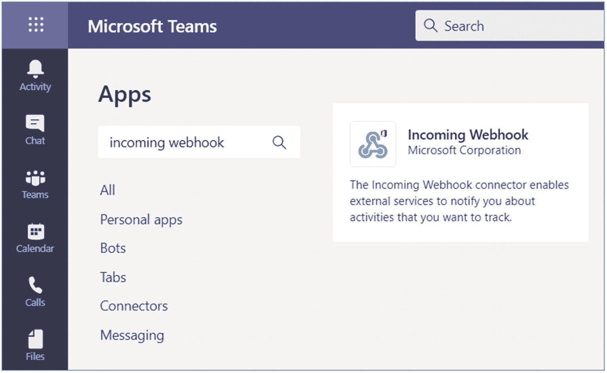
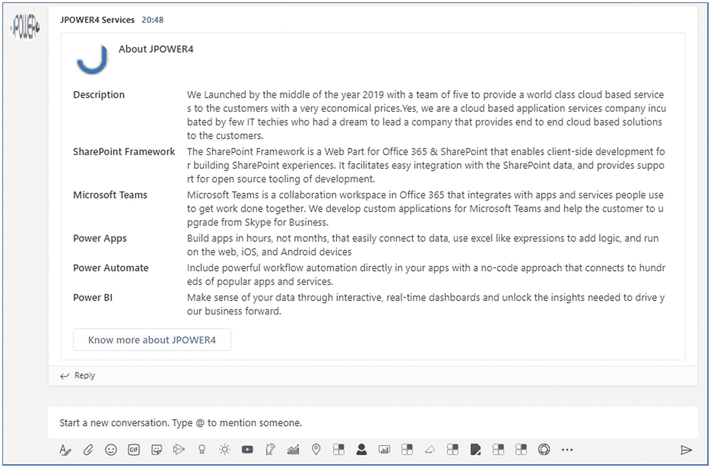

# 7.用 Webhooks 将 Web 服务连接到微软团队

Webhooks 和连接器是将您的 web 服务连接到微软团队内部的渠道和团队的简单方法。出站 webhooks 允许您的用户从一个通道向您的 web 服务发送文本消息。连接器允许用户订阅从您的 web 服务接收通知和消息。在微软团队中有两种类型的连接器可用:传入 webhooks 和 Office 365 连接器。在这一章中，你将学习 webhooks 和连接器，以及如何在微软团队渠道中实现它们。

## Web 服务和 Webhooks 概述

Web 服务和 webhooks 都在执行相同的功能，但是执行过程不同(参见图 [7-1](#Fig1) )。每当有人或其他应用调用 Webhooks 时，它就会执行一个特定的功能。它们允许接收入站数据或发送出站数据。Web 服务将数据从一个系统传送到另一个系统，因此接收应用可以存储或处理数据；您可以使用 web 服务或 webhooks 来自动化这个过程。

webhook 也称为 web 回调或 HTTP 推送 API。如图 [7-1](#Fig1) 所示，你可以看到 API 和 webhooks 之间的区别。Webhooks 只在需要的时候调用一次，但是 API 总是调用并验证状态。


图 7-1

API 和 webhooks 的区别

## 即将离任的 Webhooks 和微软团队

在第 [3](03.html) 章中，你学习了我们注册并实现的对话机器人。出站 webhooks 提供了一种简单的方法，允许用户向您的 web 服务发送消息，而不必经历通过 Microsoft Bot 框架创建 Bot 的整个过程。传出的 webhooks 将数据从团队发送到任何接受 JSON 有效负载的服务。一旦你注册了团队，外向的网络钩子就像一个机器人。它们将用于收听频道、@提及、发送通知服务，并且大部分用卡片来响应。

出站 webhooks 支持从一个通道向您的服务发送文本消息。您的 web 服务将有五秒钟的时间以文本或卡片的形式发送对消息的响应，而出站 webhooks 不适合大量的输入和响应。见表 [7-1](#Tab1) 。

表 7-1

外向 Webhook 主要功能

<colgroup><col class="tcol1 align-left"> <col class="tcol2 align-left"></colgroup> 
| 

特征

 | 

描述

 |
| --- | --- |
| 范围配置 | 出站 webhooks 的范围是团队级别的，您需要为每个团队添加出站 webhooks。 |
| 反应式消息传递 | 用户必须使用@ reference for web hook 来接收反馈消息，并且仅在公共渠道中支持出站 webhooks。 |
| 标准 HTTP 消息交换 | 标准 HTTP 消息交换响应将出现在与原始请求相同的链中。此外，它支持丰富的文本、图像、卡片和表情符号。它不支持卡片操作。 |
| 团队 API 方法支持 | 团队中的外发 webhooks 只支持 http post web 服务，不支持团队 API。 |

### 在应用的服务器上创建一个 URL，以接受和处理带有 JSON 有效负载的 POST 请求

您的 web 服务从 Azure bot 服务消息传递模式接收消息，或者 bot 框架连接器使您的服务能够通过 HTTPS 协议处理来自 Azure bit service API 的 JSON 格式消息的交换。如前所述，外发 webhooks 的范围是团队级别的，就像 bot 用户需要@提及要在通道中调用的外发 webhooks 的名称。传出的 webhooks 将数据从团队发送到任何接受 JSON 有效负载的服务

### 创建一个方法来验证传出的 Webhook HMAC 令牌

总是验证请求中包含的 HTTP HMAC 签名，作为一个头，并来自您的身份验证协议，以确保您的服务正在接收来自您的团队客户端的调用。

*   微软团队使用标准的 SHA256 HMAC 加密技术。您需要将消息体转换成 UTF8 格式的字节数组，以便从消息的请求体生成 HMAC 令牌。

*   当您在团队中注册出站 webhook 时，您应该从团队提供的字节数组安全令牌中计算散列，并使用 UTF-8 编码将散列转换为字符串。

*   最后，将字符串值与 HTTL 请求生成的值进行比较。

以下示例代码供您验证和转换消息时参考:

```
      const securityToken = process.env.SECURITY_TOKEN;
              if (securityToken && securityToken.length > 0) {
                  // There is a configured security token
                  const auth = req.headers.authorization;
                 const msgBuf = Buffer.from((req as any).rawBody, "utf8");
                 const msgHash = "HMAC " + crypto.
                     createHmac("sha256", Buffer.from(securityToken as string, "base64")).
                     update(msgBuf).
                     digest("base64");

                 if (msgHash === auth) {

```

### 创建发送成功或失败响应的方法

标准 HTTP 消息交换响应将出现在与原始请求相同的链中。当用户调用查询时，您的代码将有五秒钟的时间来响应消息，在连接超时和终止之前，Microsoft 团队将处理对您的服务问题的同步 HTTP 请求。

## 即将到来的 Webhooks 和微软团队

传入的 webhooks 与连接器或特殊类型的连接器相同。传入 webhooks 是最简单的连接器类型。传入的 webhooks 提供了一种从外部应用共享频道内容的简单方法，主要用作跟踪和通知工具。您可以选择使用 https 端点从通道发送数据，该端点将接受格式化的 JSON 并接收通道的消息。传入的 webhooks 是一种将通道连接到您的服务的快速而简单的方法。最好的例子是在 DevOps 通道中创建一个传入的 webhook，供您的应用构建、配置、部署、监控和发送警报。传入的 webhooks 是您想要发布的消息，通常采用卡片格式。卡片是用户界面容器，包含与单个主题相关的内容和动作，是以一致的方式从传入的 webhooks 呈现消息数据的一种方式。见表 [7-2](#Tab2) 。

表 7-2

传入的 Webhook 关键功能

<colgroup><col class="tcol1 align-left"> <col class="tcol2 align-left"></colgroup> 
| 

特征

 | 

描述

 |
| --- | --- |
| 范围配置 | 传入的 web hook 的作用域在通道级别，正如本章前面的会话中提到的，传出的 web hook 的作用域在团队级别。 |
| 安全资源定义 | 传入的 webhooks 消息被格式化为 JSON 有效载荷，它们将防止恶意代码的注入。 |
| 可操作的信息支持 | 可操作消息支持团队和传入网络挂钩通过卡片发送消息，并且仅支持可操作消息卡格式。 |
| 独立的 HTTPS 消息支持 | 传入的 webhook 发送 HTTPS 帖子请求可以使用卡片向团队发送消息。 |
| 降价支持 | HTML 标记将不支持可操作的消息卡，所以它们总是对所有测试字段使用基本的降价。 |

你有三个选择来分发你的网络钩子:

*   从您的频道设置一个传入的 webhook。

*   添加一个配置页面，并将传入的 webhook 包装在一个 O365 连接器中。

*   将传入的 webhook 打包并发布为连接器和 AppSource 提交的一部分。

## 连接器

连接器是将信息从第三方服务直接推送到您的 Microsoft 渠道。您可以从多个 Microsoft 365 渠道(如 Microsoft Teams、Yammer、Outlook 和 Microsoft 365 Groups)访问连接器发布的信息。连接器允许您为传入的 webhook 创建自定义配置。然后你可以把连接器分发给任何第三方和 app store。连接器总是使用卡，但是卡操作对 Office 365 连接器有限制。连接器在渠道级别配置，但在团队级别安装。

例如，找到一个天气连接器，允许用户输入位置和时间，并接收关于明天预测天气的天气报告。

在团队中，我们有 150 多个可用的连接器，它每天都在增长，您也可以将其发布到 Microsoft Store，供每个人使用。为此，您需要在 Office 365 开发人员门户中注册您的连接器。微软的审核流程分为三个阶段。

### 将连接器配置体验集成到团队客户端中

对于能够在不离开团队客户机的情况下完成连接器配置的用户，团队客户机将您的配置页面直接嵌入到 iframe 中。

从团队客户端配置连接器时，应遵循以下步骤:

*   转到团队客户端。

*   单击您的连接器开始配置过程。

*   它将加载所有连接器。

*   您可以通过 web 体验来完成配置。

*   用户按“保存”，这将在您的代码中触发回调。

*   您的代码将通过检索 webhook 设置来处理 save 事件。

此外，您可以重用配置或创建一个单独的版本，专门在团队中托管，为此您需要从代码中进行控制。Microsoft Teams JavaScript SDK 允许您的代码访问 API 来执行常见操作，如获取当前用户/渠道/团队上下文和启动身份验证流程。

*   通过调用 microsoftTeams.initialize()初始化 SDK

*   调用 Microsoft teams . settings . setvaliditystate(true)
    *   当您想要启用保存按钮时。

*   注册一个 Microsoft teams . settings . registersonsavehandler()事件处理程序，当用户单击“保存”时会调用该处理程序。

*   调用 Microsoft teams . settings . setsettings()保存连接器设置，它将帮助用户更新现有的配置。

*   重新配置时，您需要调用 Microsoft teams . settings . get settings()来获取 webhook 属性，参数如下:
    *   entityId -由您的代码在调用 setSettings()时设置。

    *   configName -由您的代码在调用 setSettings()时设置。

    *   contentUrl -配置页面的 Url。

    *   webhookUrl -为此连接器创建的 webhookUrl。

    *   appType -返回值。

    *   userObjectId -这是与启动连接器设置的 Office 365 用户相对应的唯一 Id。

*   注册一个 Microsoft teams . settings . registernremovehandler()事件处理程序，当用户删除连接器时会调用该处理程序。

*   registerOnRemoveHandler()事件让您的服务执行任何清理操作。

### 包括清单中的连接器

当使用 yo team 的生成器创建连接器时，它会从门户自动生成 Teams 应用清单。打开清单并验证连接器部分。

```
   "connectors": [
     {
       "connectorId": "{{CONNECTOR_ID}}",
       "configurationUrl":
    "https://{{HOSTNAME}}/myFirstTeamsConnector/config.html",
       "scopes": [
         "team"
       ]
     }
  ]

```

## 练习 1 -创建外向网络挂钩

Microsoft Teams Developer Platform 帮助您将业务线(LOB)应用和服务无缝地扩展到 Microsoft 团队中。此外，如果您开发了通用功能应用，您将能够向您的组织或公共用户分发您的自定义应用。

在开始练习之前，请验证您的环境。在本练习中，我将使用下面提到的工具，这些工具安装在我的环境中:

*   Node.js - v10.16.0

*   NPM - 6.9.0

*   吞咽
    *   CLI 版本:2.3.0

    *   本地版本:4.0.2

*   MS 团队的约曼生成器- 2.14.0

*   Visual Studio 代码

和

*   Microsoft Azure 订阅

*   Office 365 订阅

*   邮递员铬扩展

### 构建 Webhook

在本练习中，您将学习如何创建一个 web 服务，并将其注册为 Microsoft Teams 中的一个出站 webhook。

*   打开命令提示符，导航到要保存工作的目录。

*   创建一个新文件夹“OutgoingWebhooks”，并将目录更改到该文件夹中。

*   通过运行以下命令来运行 Yeoman generator for Microsoft Teams:


图 7-2

yo 团队发电机

```
yo teams (Figure 7-2).

```

约曼将发射并问你一系列问题。用以下数值回答问题(图 [7-3](#Fig3) ):


图 7-3

回答约曼问卷

*   您的解决方案名称是什么？出站 webhooks

*   您想将文件放在哪里？使用当前文件夹

*   您的 Microsoft Teams 应用项目的标题？外向网络挂钩

*   你(公司)的名字？(最多 32 个字符)JPOWER4

*   您希望使用哪个清单版本？v1.6

*   如果您有 Microsoft Partner ID，请输入。(留空以跳过)

*   您希望在项目中添加哪些功能？外向的网钩

*   您将在其中托管此解决方案的 URL？[T2`https://outgoingwebhooks.azurewebsites.net`](https://outgoingwebhooks.azurewebsites.net)

*   当你的应用/标签加载时，你想显示加载指示器吗？不

*   是否要包括测试框架和初始测试？不

*   您希望将 Azure Applications Insights 用于遥测吗？不

*   你的外网叫什么名字？我的出站 Webhook

我们的 web 服务还需要一个 NPM 包来简化数组中的数据查找。在命令提示符下从项目的根文件夹执行以下命令来安装库 **Lodash** :

*   微软团队的 Yeoman generator 为我们的输出 webhook 创建了一个存根 web 服务端点。

*   找到并打开文件。/src/app/myoutgoingewebhook/myoutgoingewebhook . ts .它在端点 **/api/webhook** 监听 HTTPS 请求。

*   在 MyOutgoingWebhook 类中找到 requestHandler()方法。该方法首先根据将 webhook 添加到团队时获得的安全令牌检查授权头中的 HMAC 值。

*   找到以下代码:

```
npm install lodash -S

```

*   这段代码只是将消息中输入的字符串回显给微软团队，这些字符串将被添加到触发 webhook 的消息的回复中。

*   更新此代码，使用 planets.json 数据和 Adaptive Card 添加一些真正的功能。

```
message.text = `Echo ${incoming.text}`;

```

在**中创建一个新文件‘planets . JSON’。/src/app/myoutgoingewebhook**文件夹，并在其中添加以下 JSON。该文件将包含一系列行星细节:

```
[{
        "id": "1",
        "name": "Mercury",
        "summary": "Mercury is the smallest and innermost planet in the Solar System. Its orbit around the Sun takes 87.97 days, the shortest of all the planets in the Solar System. It is named after the Roman deity Mercury, the messenger of the gods.",
        "solarOrbitYears": 0.24,
        "solarOrbitAvgDistanceKm": 57909050,
        "numSatellites": 0,
        "wikiLink": "https://en.wikipedia.org/wiki/Mercury_(planet)",
        "imageLink": "https://upload.wikimedia.org/wikipedia/commons/d/d9/Mercury_in_color_-_Prockter07-edit1.jpg",
        "imageAlt": "NASA/Johns Hopkins University Applied Physics Laboratory/Carnegie Institution of Washington [Public domain]"
    },
    {
        "id": "2",
        "name": "Venus",
        "summary": "Venus is the second planet from the Sun. It is named after the Roman goddess of love and beauty. As the second-brightest natural object in the night sky after the Moon, Venus can cast shadows and, rarely, is visible to the naked eye in broad daylight. Venus lies within Earth's orbit, and so never appears to venture far from the Sun, setting in the west just after dusk and rising in the east a bit before dawn.",
        "solarOrbitYears": 0.62,
        "solarOrbitAvgDistanceKm": 108208000,
        "numSatellites": 0,
        "wikiLink": "https://en.wikipedia.org/wiki/Venus",
        "imageLink": "https://upload.wikimedia.org/wikipedia/commons/e/e5/Venus-real_color.jpg",
        "imageAlt": "&quot;Image processing by R. Nunes&quot;, link to http://www.astrosurf.com/nunes [Public domain]"

]

```

接下来，在**中创建一个新文件 **planetDisplayCard.json** 。/src/app/myoutgoingewebhook**文件夹，并在其中添加以下 JSON。该文件将包含适配卡的模板，web 服务将响应:

```
{
    "$schema": "http://adaptivecards.io/schemas/adaptive-card.json",
    "type": "AdaptiveCard",
    "version": "1.0",
    "body": [{
            "id": "cardHeader",
            "type": "Container",
            "items": [{
                "id": "planetName",
                "type": "TextBlock",
                "weight": "bolder",
                "size": "medium"
            }]
        },
        {
            "type": "Container",
            "id": "cardBody",
            "items": [{
                    "id": "planetSummary",
                    "type": "TextBlock",
                    "wrap": true
                },
                {
                    "id": "planetDetails",
                    "type": "ColumnSet",
                    "columns": [{
                            "type": "Column",
                            "width": "100",
                            "items": [{
                                "id": "planetImage",
                                "size": "stretch",
                                "type": "Image"
                            }]
                        },
                        {
                            "type": "Column",
                            "width": "250",
                            "items": [{
                                "type": "FactSet",
                                "facts": [{
                                        "id": "orderFromSun",
                                        "title": "Order from the sun:"
                                    },
                                    {
                                        "id": "planetNumSatellites",
                                        "title": "Known satellites:"
                                    },
                                    {
                                        "id": "solarOrbitYears",
                                        "title": "Solar orbit (*Earth years*):"
                                    },
                                    {
                                        "id": "solarOrbitAvgDistanceKm",
                                        "title": "Average distance from the sun (*km*):"
                                    }
                                ]
                            }]
                        }
                    ]
                },
                {
                    "id": "imageAttribution",
                    "type": "TextBlock",
                    "size": "medium",
                    "isSubtle": true,
                    "wrap": true
                }
            ]
        }
    ],
    "actions": [{
        "type": "Action.OpenUrl",
        "title": "Learn more on Wikipedia"
    }]
}

```

将以下导入语句添加到**。/src/app/myoutgoingewebhook/myoutgoingewebhook . t**s 文件，就在现有的 import 语句之后:

```
   import { find, sortBy } from "lodash";

```

将下面的方法添加到 **MyOutgoingWebhook** 类中。 **getPlanetDetailCard** ()方法将使用提供的 planet 对象加载并填充自适应卡模板的细节:

```
private static getPlanetDetailCard(selectedPlanet: any): builder.Attachment {

        // load display card
        const adaptiveCardSource: any = require("./planetDisplayCard.json");

        // update planet fields in display card
        adaptiveCardSource.actions[0].url = selectedPlanet.wikiLink;
        find(adaptiveCardSource.body, { "id": "cardHeader" }).items[0].text = selectedPlanet.name;
        const cardBody: any = find(adaptiveCardSource.body, { "id": "cardBody" });
        find(cardBody.items, { "id": "planetSummary" }).text = selectedPlanet.summary;
        find(cardBody.items, { "id": "imageAttribution" }).text = "*Image attribution: " + selectedPlanet.imageAlt + "*";
        const cardDetails: any = find(cardBody.items, { "id": "planetDetails" });
        cardDetails.columns[0].items[0].url = selectedPlanet.imageLink;
        find(cardDetails.columns[1].items[0].facts, { "id": "orderFromSun" }).value = selectedPlanet.id;
        find(cardDetails.columns[1].items[0].facts, { "id": "planetNumSatellites" }).value = selectedPlanet.numSatellites;
        find(cardDetails.columns[1].items[0].facts, { "id": "solarOrbitYears" }).value = selectedPlanet.solarOrbitYears;
        find(cardDetails.columns[1].items[0].facts, { "id": "solarOrbitAvgDistanceKm" }).value = Number(selectedPlanet.solarOrbitAvgDistanceKm).toLocaleString();

        // return the adaptive card
        return builder.CardFactory.adaptiveCard(adaptiveCardSource);
    }

```

接下来，将下面的方法添加到**myoutgoingewebhook**类中。**processauthenticedrequest()**方法获取传入的文本，并使用它在 **planets.json** 文件中查找行星。如果找到一个，它调用**getplanetailcard()**方法来获得一个适配卡，并将其作为一个活动返回，该活动将被发送回微软团队。如果找不到行星，它只会在请求回复中回显文本:

```
private static processAuthenticatedRequest(incomingText: string): Partial<builder.Activity> {
        const message: Partial<builder.Activity> = {
            type: builder.ActivityTypes.Message
        };

        // load planets
        const planets: any = require("./planets.json");
        // get the selected planet
        const selectedPlanet: any = planets.filter((planet) => (planet.name as string).trim().toLowerCase() === incomingText.trim().toLowerCase());

        if (!selectedPlanet || !selectedPlanet.length) {
            message.text = `Echo ${incomingText}`;
        } else {
            const adaptiveCard = MyOutgoingWebhook.getPlanetDetailCard(selectedPlanet[0]);
            message.type = "result";
            message.attachmentLayout = "list";
            message.attachments = [adaptiveCard];
        }

        return message;
    }

```

将下面的 **scrubMessage** ()方法添加到 **MyOutgoingWebhook** 类中。用户必须@提及一个传出的 webhook，以便向它发送消息。该方法将删除> < /at >处的<文本和任何空格，以提取行星名称:

```
private static scrubMessage(incomingText: string): string {
        const cleanMessage = incomingText
            .slice(incomingText.lastIndexOf(">") + 1, incomingText.length)
            .replace("&nbsp;", "");
        return cleanMessage;
    }

```

然后，更新 **requestHandler** ()方法:

*   找到下面的代码，将消息声明从一个**常量**更改为 **let** ，因为您将更改这个值。

*   找到并替换以下代码:

```
let message: Partial<builder.Activity> = {
            type: builder.ActivityTypes.Message
        };

```

```
message.text = `Echo ${incoming.text}`;

```

使用以下代码:

```
const scrubbedText = MyOutgoingWebhook.scrubMessage(incoming.text);
                message = MyOutgoingWebhook.processAuthenticatedRequest(scrubbedText);

```

### 测试传出的 Webhook

以下是测试方法:


图 7-4

管理团队

*   将传出的 webhook 添加到 Microsoft Teams 中的团队。在浏览器中，导航到 [`https://teams.microsoft.com`](https://teams.microsoft.com) ，使用工作和学校帐户的凭据登录。

*   登录后，选择要添加网络挂钩的团队。

*   点击并选择管理团队(图 [7-4](#Fig4) )。


图 7-5

创建一个出站 webhook

*   选择应用，然后点击底部的“创建外发网页挂钩”(图 [7-5](#Fig5) )。


图 7-6

创建一个出站 webhook 表单

*   在创建外发 webhook 对话框中，输入以下值并选择创建(图 [7-6](#Fig6) ):
    *   **名称**:星球详情

    *   **回调 URL** : `https://{{REPLACE_NGROK_SUBDOMAIN}}.ngrok.io/api/webhook`

    *   **描述**:星球详情外网挂钩

    *   **上传图像以识别**

创建外发 webhook 后，微软团队将显示一个安全令牌(图 [7-7](#Fig7) )。


图 7-7

传出 webhook 安全令牌

*   复制这个值，并在。/.项目中的 env 文件。

*   从命令行导航到项目的根文件夹，并执行以下命令:

```
gulp ngrok-serve

```

在控制台中，找到 ngrok 创建的动态 URL(图 [7-8](#Fig8) )。


图 7-8

吞咽 ngrok 发球执行


图 7-9

传出的 webhook 应用

*   前往➤团队精选应用。

*   选择行星细节网页挂钩(图 [7-9](#Fig9) )。


图 7-10

编辑传出 webhook 应用配置

*   单击以打开和更新 ngrok 动态 URL 并保存它。参见图 [7-10](#Fig10) 。


图 7-11

传出 webhook 应用测试

*   也就是说，用您动态创建的 Ngrok URL ( **b73772b97945** )的值替换**{ { REPLACE _ NGROK _ SUBDOMAIN } }**

*   现在你可以测试 webhook 了。转到团队内的频道对话选项卡，输入消息 **@Planet Details** 。请注意，当您键入消息时，微软团队会检测网络挂钩的名称(图 [7-11](#Fig11) )。


图 7-12

传出 webhook 应用添加参数

*   输入 Mercury 并点击发送图标(图 [7-12](#Fig12) )。


图 7-13

Bot 通知

*   提交消息后几秒钟，您将看到对您的消息的回复，其中包含定制的适配卡，其中包含有关该星球的详细信息，并发送通知。参见图 [7-13](#Fig13) 。

然后图 [7-14](#Fig14) 显示了使用卡输出的 webhook 消息输出。


图 7-14

传出 webhook 输出

您已经成功测试了您的出站 webhook！

在本练习中，您学习了如何创建一个外发 webhook 并在 Microsoft 团队中注册它。无需 bot 注册，您就可以获得自定义 bot 对对话的回复。

## 练习 2 -创建传入的网络挂钩

在本练习中，您将学习如何在 Microsoft Teams 频道中注册一个传入的 webhook 并向其发布消息。

### 注册新的传入 Webhook

将传出的 webhook 添加到 Microsoft Teams 中的团队。在浏览器中，导航到 [`https://teams.microsoft.com`](https://teams.microsoft.com) ，使用工作和学校帐户的凭据登录。


图 7-15

管理团队

*   登录后，选择要添加到传入网络挂钩的团队。

*   点击并选择管理团队(图 [7-15](#Fig15) )。


图 7-16

更多应用

*   选择应用并点击右上方的“更多应用”(图 [7-16](#Fig16) )。



图 7-17

MS 团队应用列表

*   在应用页面上，搜索传入的 webhook 应用。

*   点击“传入 web hook”app 并打开(图 [7-17](#Fig17) )。


图 7-18

加入团队

*   选择添加到团队按钮(图 [7-18](#Fig18) )。


图 7-19

为传入 webhook 设置连接器

*   输入要添加 webhook 的频道名称，选择“**设置连接器**”(图 [7-19](#Fig19) )。

在传入 Webhook 配置屏幕上:


图 7-20

配置传入 webhook

*   输入名称“JPOWER4 Services”

*   上传图片。

*   选择创建按钮(您可能需要在对话框中向下滚动，因为创建按钮在默认情况下是不可见的，如图 [7-20](#Fig20) 的屏幕截图所示)。


图 7-21

复制传入的 webhook URL

*   创建传入的 webhook 后，对话框将添加一个新的输入框，其中包含您要发布到的端点。复制该值(图 [7-21](#Fig21) )。


图 7-22

传入的 webhook 已添加到频道

*   复制的 URL 如下所示:

    [T2`https://outlook.office.com/webhook/fe4183ab-49ea-4c1b-9297-2658ea56164c@f784fbed-7fc7-4c7a-aae9-d2f387b67c5d/IncomingWebhook/4d2b3a16003d47b080b7a083b5a5e533/74f315eb-1dde-4731-b6b5-2524b77f2acd`](https://outlook.office.com/webhook/fe4183ab-49ea-4c1b-9297-2658ea56164c%2540f784fbed-7fc7-4c7a-aae9-d2f387b67c5d/IncomingWebhook/4d2b3a16003d47b080b7a083b5a5e533/74f315eb-1dde-4731-b6b5-2524b77f2acd)

*   它将在通道中向其他通道成员添加一个关于传入 webhook 配置的对话(图 [7-22](#Fig22) )。

### 测试传入的 Webhook

让我们来测试一下:


图 7-24

邮递员请求正文内容

*   在配置了传入的 webhook 之后，下一步是向它提交一个 post 以在通道中显示一条消息。通过向提供的 webhook 端点提交一个 HTTPS 请求来实现这一点。

*   使用免费工具**邮递员** [`https://www.postman.com/`](https://www.postman.com/) ，创建一个新的请求到点端点(图 [7-23](#Fig23) ):
    *   将**请求**设置为**发布**

    *   将**端点**设置为您在前一节末尾复制的 webhook 端点

    *   set the **Content-Type** header to **application/json** on the Headers tab

        

        图 7-23

        邮递员配置

    *   然后将下面的 JSON 添加到 **Body** 选项卡，并选择 raw 选项。

    *   **注**:此 JSON 包含 Office 365 连接器卡。

    *   传入 webhook 仅支持 Office 365 连接器卡。

    *   向传入的 webhooks 发送消息时，不支持适配卡。见图 [7-24](#Fig24)



图 7-25

传入的 webhook 输出

*   单击通过选择“发送”按钮将卡片发送给 Microsoft 团队。

*   它将处理请求并向通道发送消息卡。

*   转到 Microsoft Teams，并导航回安装了传入 webhook 的频道中的 Conversations 选项卡。您可以在您的消息卡(Office 365 连接器卡)中看到下面给出的消息。参见图 [7-25](#Fig25) 。

```
{
    "@type": "MessageCard",
    "@context": "http://schema.org/extensions",
    "summary": "JPOWER4",
    "sections": [{
      "activityTitle": "About JPOWER4",
      "activityImage": "http://www.jpower4.cimg/favicon.png",
      "facts": [
        {
          "name": "Description",
          "value": "We Launched by the middle of the year 2019 with a team of five to provide a world class cloud based services to the customers with a very economical prices.Yes, we are a cloud based application services company incubated by few IT techies who had a dream to lead a company that provides end to end cloud based solutions to the customers."
        },
        {
          "name": "SharePoint Framework",
          "value": "The SharePoint Framework is a Web Part for Office 365 & SharePoint that enables client-side development for building SharePoint experiences. It facilitates easy integration with the SharePoint data, and provides support for open source tooling of development."
        },
        {
          "name": "Microsoft Teams",
          "value": "Microsoft Teams is a collaboration workspace in Office 365 that integrates with apps and services people use to get work done together. We develop custom applications for Microsoft Teams and help the customer to upgrade from Skype for Business."
        },
        {
          "name": "Power Apps",
          "value": "Build apps in hours, not months, that easily connect to data, use excel like expressions to add logic, and run on the web, iOS, and Android devices"
        },
        {
          "name": "Power Automate",
          "value": "Include powerful workflow automation directly in your apps with a no-code approach that connects to hundreds of popular apps and services."
        },
        {
          "name": "Power BI",
          "value": "Make sense of your data through interactive, real-time dashboards and unlock the insights needed to drive your business forward."
        }
      ]
    }],
    "potentialAction": [{
      "@context": "http://schema.org",
      "@type": "ViewAction",
      "name": "Know more about JPOWER4",
      "target": ["http://www.jpower4.com/"]
    }]
  }

```

在本练习中，您学习了如何在 Microsoft Teams 频道中注册一个传入的 webhook，并向其发布一条带有 Office 365 Connector 卡的消息。

## 结论

在这一章中，你已经学习了 webhooks 的各种特性。出站 webhooks 允许您的用户从一个通道向您的 web 服务发送文本消息。连接器和传入 webhooks 允许用户订阅从您的 web 服务接收通知和消息。我们了解了 Office 365 连接器卡，可以通过从 postman 扩展发送它们来调用，就像我们能够从自己的应用中使用它一样。在接下来的章节中，你将开始学习微软团队应用的不同选项和特性。