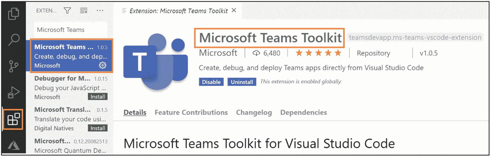
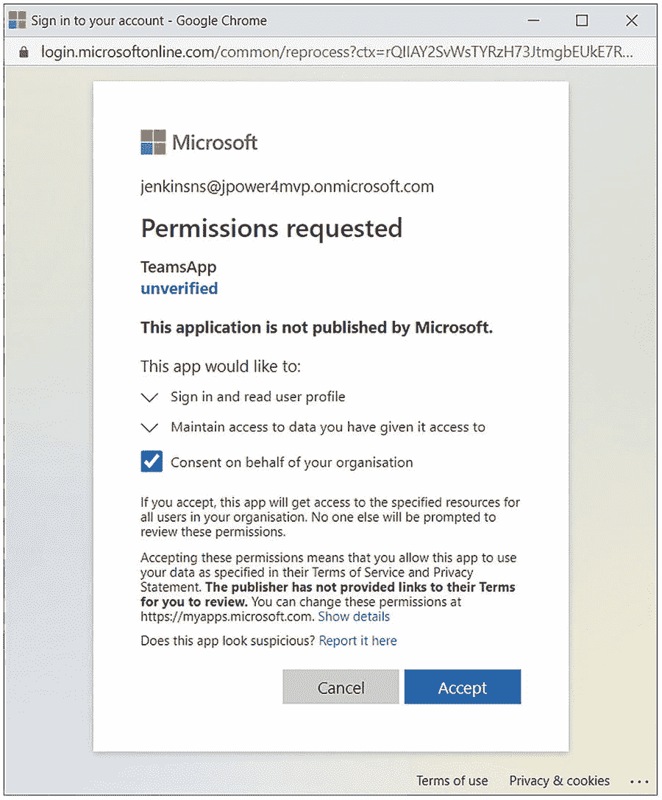

# 8.使用 Microsoft Graph 扩展您的解决方案

在这一章中，我将介绍团队生命周期管理的自动化、消息、webhooks 和特定于资源的许可同意。Microsoft Graph 是用于处理数据的统一 API 端点，因此 SharePoint、团队、交换和规划各种不同的 Microsoft 产品都有一个图形端点，所有这些都在一个公共 API 端点下公开。团队允许你建立各种不同的应用，如标签，机器人，连接器等。

## 图形 API 概述

Microsoft Graph 是访问微软应用中所有数据的统一 REST API，Microsoft Teams 是 Office 365 中团队合作的中心，允许您通过聊天消息、在线会议和电话进行交流。它允许您与所有这些 Office 365 应用协作。

API 使您能够访问 Microsoft 云服务资源。注册应用并获得用户或服务的身份验证令牌后，您可以向 Microsoft Graph API 发出请求。它公开 REST APIs 和客户端库来访问以下 Microsoft 365 服务上的数据:


图 8-1

Microsoft Graph–一个端点

*   Office 365 服务:Delve、Excel、Microsoft Bookings、Microsoft Teams、OneDrive、OneNote、Outlook/Exchange、Planner、SharePoint

*   企业移动和安全服务:高级威胁分析、高级威胁保护、Azure Active Directory、Identity Manager 和 Intune

*   Windows 10 服务:活动、设备、通知(图 [8-1](#Fig1) )。

## 团队图形 API

Microsoft Graph 提供了用于访问数据的 API，您可以从选项卡、机器人、网站和服务中调用 Graph API，这些工具没有用户界面，甚至在您的命令行工具中没有 Graph API。

Microsoft Teams Graph API 允许您创建新团队并向这些团队添加频道，向团队添加成员，以及向您创建的频道添加选项卡。一旦团队完成了它的生命周期，你就有了一个功能齐全的团队。然后，您可以使用该功能的图形 API 来存档或删除团队。此外，人们用第一个图形 API 构建了不同的东西；例如，他们批量调配团队——在年初，每个部门可能有 100 个团队。

第二件事是你可以创建临时团队。例如，如果你是一家航空公司，你想每天飞行一个航班，并为每个航班配备一个团队，你可以在午夜钟声敲响时这样做。第三件事是人们创造了许多管理工具；他们只是管理他们的团队，所以团队的 PowerShell 命令就是建立在这个基础上的。现代的管理门户也是建立在 Graph API 之上的，因此开发人员可以开始使用 teams Graph API 来管理所有的团队管理活动。

你现在有一堆 API 来做这件事(表 [8-1](#Tab1) )，并且你可以访问团队资源。您可以读取、写入、添加、移除、更新、删除以及枚举成员所拥有的团队。您拥有用于操作成员资格、向成员资格列表添加和删除人员、向所有者列表添加和删除人员以及枚举那些所有者和成员的 APIs 并获得关于他们的附加信息，例如他们的全名、电子邮件地址、用户照片等。

表 8-1

目前可供微软团队使用的 API

<colgroup><col class="tcol1 align-left"> <col class="tcol2 align-left"></colgroup> 
| 

资源

 | 

方法

 |
| --- | --- |
| 组 | 列出您的团队、列出所有团队、创建、阅读、更新，删除、克隆、存档、取消存档 |
| 组 | 添加成员，删除成员，添加所有者，删除所有者，获取文件，获取笔记本，获取计划，获取日历 |
| 引导 | 列出、创建、读取、更新、删除 |
| teamstar | 列出、创建、读取、更新、删除 |
| 团队快照 | 列出、发布、更新、删除 |
| 团队安装 | 列出、安装、升级、删除 |
| 聊天消息 | 发送 |
| 呼叫 | 回答、拒绝、重定向、静音、取消静音、更改屏幕共享角色、列出参与者、邀请参与者 |
| 安排 | 创建或替换、获取、共享 |
| 计划组 | 创建、列出、获取、替换、删除 |
| 变化 | 创建、列出、获取、替换、删除 |
| 休假 | 创建、列出、获取、替换、删除 |
| 超时原因 | 创建、列出、获取、替换、删除 |

团队设置是另一个你可以访问的东西——读取和写入团队设置。有了通道，我们完全有能力添加、读取、更新、删除通道，以及枚举团队中的通道。您可以向这些频道发布频道消息。

## 用于生命周期管理的图形 API

使用 Graph APIs 可以做的最强大的事情之一是自动化团队的生命周期。因此，您可以创建一个团队，然后向该团队添加成员和所有者，向该团队添加一些频道，配置团队设置，向该团队发布欢迎消息，然后让您的用户加入该团队，当他们完成后，当您尝试向该团队提出的业务问题得到解决时，您可以继续删除该团队(图 [8-2](#Fig2) )。


图 8-2

图表可以自动化团队生命周期[REF–MSDN]

### 团队和小组

微软 365 群组解决了群组协作的各种需求，并拥有 19 个微软 365 应用端点，包括微软团队。所有 Microsoft group 功能都适用于 Microsoft 团队。与组相关联的每个团队都在特定团队的上下文中进行交流。群组成员通过群组对话进行交流，群组对话是在 Outlook 中的群组环境中进行的电子邮件对话。为了区分与团队相关联的组，任何具有团队的组都有一个包含“团队”的'**resourceprovisionoptions '**属性不要从'**resource provisioning options '**属性中更改“团队”，否则当您列出所有团队时，结果将会不正确。

以下是团队和组在 API 级别上的差异:

*   持续聊天仅适用于 Microsoft 团队。该功能由频道和“聊天消息”资源分层表示。

*   群对话仅对 Microsoft 365 群可用。此功能由对话、“conversationThread”和帖子资源分层表示。

*   “列出加入的团队”方法仅适用于 Microsoft 团队。

*   呼叫和在线会议 API 仅适用于 Microsoft 团队。

您可以创建团队:

*   从头开始，使用你自己的团队

*   来自现有的 O365 组

*   通过克隆现有团队

*   从模板

下面是语法:

```
POST https://graph.microsoft.com/v1.0/teams
Content-Type: application/json
{
  "template@odata.bind": "https://graph.microsoft.com/beta/teamsTemplates('standard')",
  "displayName": "My Sample Team",
  "description": "My Sample Team’s Description",
  "owners@odata.bind": [
    "https://graph.microsoft.com/beta/users('userId')"
  ]
}

```

### 团队模板

使用预配置的模板快速组建新团队，这些模板包括频道、所有者设置和预装应用等内容。

现成的模板:

*   标准

*   教育(班级、员工或 PLC)

*   零售店(基础或经理协作)

*   医疗保健(病房或医院)

### 使用图形 API 设置您的团队

您可以在创建团队或以后更新团队时对其进行配置。

配置如下内容:

*   显示名称和描述

*   来宾和成员权限

*   能见度

*   消息权限

*   创建频道

*   添加成员和角色

下面是语法:

```
PATCH https://graph.microsoft.com/v1.0/teams/{id}
Content-type: application/json
Content-length: 211
{
  "memberSettings": {
    "allowCreateUpdateChannels": true
  },
  "messagingSettings": {
    "allowUserEditMessages": true,
    "allowUserDeleteMessages": true
  },
  "funSettings": {
    "allowGiphy": true,
    "giphyContentRating": "strict"
  },
  "discoverySettings": {
    "showInTeamsSearchAndSuggestions": true
  }
}

```

### 使用图形 API 添加应用和标签

预安装应用，添加选项卡，并配置您的选项卡以便为您的团队安装应用:

*   您的应用必须位于您的组织应用目录或公共应用商店中。

*   要为您的团队添加选项卡:
    *   必须先安装应用。

    *   您可以预先配置它们，或者让它们在用户第一次与选项卡交互时进行配置。

    *   预配置选项卡可能很有挑战性，请确保使用文档( [`https://docs.microsoft.com/en-us/graph/teams-configuring-builtin-tabs`](https://docs.microsoft.com/en-us/graph/teams-configuring-builtin-tabs) )。

下面是语法:

```
POST https://graph.microsoft.com/v1.0/teams/{team-id}/channels/{channel-id}/tabs
{
    "displayName": "Document%20Library1",
    "teamsApp@odata.bind": "https://graph.microsoft.com/v1.0/appCatalogs/teamsApps/com.microsoft.teamspace.tab.files.sharepoint",
    "configuration": {
        "entityId": "",
        "contentUrl": "https://microsoft.sharepoint.com/teams/WWWtest/Shared%20Documents",
        "removeUrl": null,
        "websiteUrl": null
    }
}
POST https://graph.microsoft.com/v1.0/teams/{id}/installedApps
Content-type: application/json
{
"teamsApp@odata.bind":"https://graph.microsoft.com/v1.0/appCatalogs/teamsApps/12345678-9abc-def0-123456789a"
}

```

### 存档您的团队

当时机成熟时，使用 Graph 以敏捷的方式归档您的团队，如果有必要，取消团队的归档。

常见归档操作:

*   检索和存档重要频道中的消息(测试版)

*   将团队存档

*   将 SharePoint Online 工作组网站设置为只读(或删除该组)

*   存档或移动存储的文件

下面是语法 **:**

```
GET https://graph.microsoft.com/v1.0/teams/{id}/channels
GET https://graph.microsoft.com/beta/teams/{id}/channels/{id}/messages/delta
GET https://graph.microsoft.com/beta/teams/{id}/channels/{id}/messages/{id}/replies
POST https://graph.microsoft.com/v1.0/teams/{id}/archive
{
    "shouldSetSpoSiteReadOnlyForMembers": true
}

```

### 图形和机器人:一起更好

带有机器人的团队应用可以主动向聊天或频道发送消息。它只能向对话发送消息。如果它有一对一聊天的正确信息，该机器人需要安装在用户所在的群聊或频道中，或者作为该用户的个人应用安装。当用户意识到他们时，机器人必须存储对他们引用。

借助 Graph，您可以为任何用户安装该应用，无论该应用之前安装在何处，您都可以主动发送消息。这在您需要可靠地传递大部分组织信息的情况下特别有用。

机器人只能读取消息，它们被@提到:

*   使用消息传递 API 来获取 bot 的附加信息

*   获取回复链中的根消息

*   检索邮件的所有回复

*   从聊天线程中获取以前的消息

## 微软图形工具包

Microsoft Graph Toolkit 是一组可重用的、框架无关的 web 组件，以及用于访问和使用 Microsoft Graph 的助手。这些组件开箱即用，功能齐全，具有内置的提供程序，可验证 Microsoft Graph 并从中获取数据。Microsoft Graph Toolkit 使在应用中使用 Microsoft Graph 变得很容易。

```
   <mgt-login></mgt-login>
   <mgt-agenda></mgt-agenda>

```

### 微软图形工具包里有什么？

#### 成分

Microsoft Graph Toolkit 包括一组 web 组件，用于由 Microsoft Graph APIs 支持的最常见的构建体验。

<colgroup><col class="tcol1 align-left"> <col class="tcol2 align-left"></colgroup> 
| 

成分

 | 

描述

 |
| --- | --- |
| 注册 | 一个按钮和一个弹出控件，用于使用 Microsoft Identity platform 对用户进行身份验证，并在登录时显示用户的个人资料信息。 |
| 人 | 按照片、姓名和/或电子邮件地址显示一个人或联系人。 |
| 人 | 按照片或姓名首字母显示一组人或联系人。 |
| 议程 | 显示用户或组日历中的事件。 |
| 任务 | 显示并允许添加、删除、完成或编辑 Microsoft Planner 或 Microsoft 待办事项中的任务。 |
| 人物挑选器 | 提供搜索人员和呈现结果列表的能力。 |
| 个人卡 | 人员组件上使用的弹出按钮，用于显示有关用户的更多配置文件信息。 |
| **获取** | 直接在 HTML 中对任何 Microsoft Graph API 进行 GET 查询。 |
| 频道选择器 | 提供搜索 Microsoft 团队频道的功能，以便从呈现的结果列表中选择一个频道。 |

#### 提供者

这些组件在与提供程序一起使用时效果最佳。提供者启用身份验证，并提供获取访问令牌的实现，以便调用 Microsoft Graph APIs。

<colgroup><col class="tcol1 align-left"> <col class="tcol2 align-left"></colgroup> 
| 

提供者

 | 

描述

 |
| --- | --- |
| -你好 | 使用 MSAL.js 登录用户并获取令牌以用于 Microsoft Graph。 |
| 平台 | 验证并提供对 SharePoint web 部件内部组件的 Microsoft Graph 访问。 |
| 组 | 验证并提供对 Microsoft Teams 选项卡内组件的 Microsoft Graph 访问。 |
| 代理 | 通过将所有呼叫通过后端路由到 Microsoft Graph，允许使用后端身份验证。 |
| 习俗 | 创建自定义提供程序，以便使用应用的现有身份验证代码对 Microsoft Graph 进行身份验证和访问。 |

### 为什么要使用微软图形工具包？

Microsoft Graph Toolkit 使您能够快速轻松地将 Microsoft Graph 支持的常见体验集成到您自己的应用中。

#### 缩短开发时间

连接到 Microsoft Graph APIs 并在看起来和感觉上都像 Microsoft 365 体验的 UI 中呈现数据的工作已经为您完成，不需要任何定制。

#### 无处不在

所有组件都基于 web 标准，可以与任何现代浏览器和 web 框架(React、Angular、Vue 等)无缝协作。).

#### 漂亮但灵活

这些组件被设计成外观和感觉都像微软 365 体验，但也可以使用 CSS 自定义属性和模板进行自定义。

#### Microsoft Graph Toolkit 中的样式组件

使用 CSS 自定义属性修改组件样式。每个组件都记录了一组 CSS 自定义属性，您可以使用这些属性来更改某些元素的外观。例如:

```
    mgt-person {
      --avatar-size: 34px;
    }

```

除非提供 CSS 自定义属性，否则不能设置组件内部元素的样式。组件子元素托管在一个阴影 dom [`https://developer.mozilla.org/en-US/docs/Web/Web_Components/Using_shadow_DOM`](https://developer.mozilla.org/en-US/docs/Web/Web_Components/Using_shadow_DOM) 中。

### Microsoft Graph 工具包中的模板

使用自定义模板修改组件的内容。所有 web 组件都支持基于<template></template>

#### 数据类型

每个组件可以有多个可以模板化的部分。

例如，在 mgt-agenda 组件中，您可以模板化单个事件、单个部分标题、加载视图、无数据视图等等。若要指示模板，请在模板上使用数据类型属性。

```
   <mgt-agenda>
     <template data-type="event"> </template>
   </mgt-agenda>

```

如果没有指定数据类型，整个组件将被模板替换。出于同样的目的，您也可以使用 data type="default"。

#### 绑定数据

许多模板允许绑定作为数据上下文传递给模板的数据。例如，mgt-agenda 组件中的事件模板传递一个可以在模板中直接使用的{event}对象。为了扩展一个表达式，例如 event，主语使用双花括号。

```
<template data-type="event">
  <div>{{event.subject}}</div>
</template>

```

这种格式也可以用在属性中:

```
<template data-type="event">
  <a href="{{ event.onlineMeetingUrl }}" />
</template>

```

#### 更改绑定语法

默认情况下，要展开表达式，可以使用双花括号({{expression}})。但是，对于已经使用了双花括号语法的环境，您可以更改此语法。例如，以下示例使用双方括号([[表达式]])。

```
import { TemplateHelper } from '@microsoft/mgt';
TemplateHelper.setBindingSyntax('[[', ']]');

```

#### 数据上下文帮助程序属性

以下属性也可用于模板中的数据上下文对象。

<colgroup><col class="tcol1 align-left"> <col class="tcol2 align-left"></colgroup> 
| 

财产

 | 

描述

 |
| --- | --- |
| $索引 | 使用数据循环时呈现的项的数字索引。 |
| $parent | 如果模板在另一个模板中呈现，此属性允许您访问父数据上下文。 |

以下示例显示了如何在 data-for 循环中使用$index 属性。

```
<mgt-person>
  <mgt-person-card>
    <template data-type="additional-details">
      <span data-for="language in languages">
        {{ language.displayName }}<span data-if="$index < languages.length - 1">, </span>
      </span>
    </template>
  </mgt-person-card>
</mgt-person>

```

#### 条件渲染

您可能只希望在基于数据上下文的条件为真或假时呈现元素。data-if 和 data-else 属性可以计算表达式，并且仅当它们为 true 或 false 时才进行呈现。

```
<mgt-person person-query="john doe">
  <template>
    <div data-if="person.image">
      
    </div>
    <div data-else>
      {{ person.displayName }}
    </div>
  </template>
</mgt-person>

```

#### 环

有些情况下，数据上下文对象包含一个循环，您需要对数据进行循环。对于这种情况，请使用 data-for 属性。

```
<template data-type="event">
  <ul>
    <li data-for='attendee in event.attendees'>
      {{ attendee.displayName }}
    </li>
  </ul>
</template>

```

#### 模板上下文

在需要转换绑定中的数据、绑定到事件或者只是在模板的绑定中使用外部数据的情况下，模板支持绑定到外部数据上下文。有两种方法可以添加额外的模板上下文。

##### 直接在组件上

每个组件都定义了 *templateContext* 属性，您可以使用该属性将附加数据传递给组件中的任何模板。

```
   document.querySelector('mgt-agenda').templateContext = {

     someObject: {},
      formatDate: (date: Date) => { /* format date and return */ },
     someEventHandler: (e) => { /* handleEvent */  }

   }

```

*templateContext* 对象中的属性现在可用于模板中的绑定表达式。

##### 全局适用于所有组件

TemplateHelper 类公开 globalContext 对象以添加应该对所有组件全局可用的数据或函数。

```
   import { TemplateHelper } from '@microsoft/mgt';
   TemplateHelper.globalContext.someObject = {};
   TemplateHelper.globalContext.formatDate = (date: Date) => { /* format date and return */ };
   TemplateHelper.globalContext.someEventHandler = (e) => { /* handleEvent */  }

```

#### 转换器

在许多情况下，您可能希望在将数据显示在模板中之前对其进行转换。例如，您可能希望在呈现日期之前正确设置日期格式。在这些情况下，您可能需要使用模板转换器。

要使用模板转换器，首先需要定义一个执行转换的函数。例如，您可以定义一个函数来将事件对象转换为格式化的时间范围。

```
    document.querySelector('mgt-agenda').templateContext = {

     getTimeRange: (event) => {
       // TODO: format a string from the event object as you wish
       // timeRange = ...

        return timeRange;
     }
  }

```

要在模板中使用转换器，就像在代码中使用函数一样使用它。

```
    <template data-type="event">
      <div>{{ getTimeRange(event) }}</div>
    </template>

```

#### 事件或属性绑定

data-props 属性允许您直接在模板中添加事件侦听器或设置属性值。

```
   <template>
        <button data-props="{{@click: myEvent, myProp: value}}"></button>
   </template>

```

data-props 为您可能想要设置的每个属性或事件处理程序接受逗号分隔的字符串。若要添加事件处理程序，请在事件名称前加上@前缀。事件处理程序需要在元素的 *templateContext* 中可用。

```
   document.querySelector('mgt-agenda').templateContext = {

      someEventHandler: (e, context, root) => { /* handleEvent */  }
   }
   <template>
        <button data-props="{{@click: someEventHandler}}"></button>
    </template>

```

模板的事件参数、数据上下文和根元素作为参数传递给事件处理程序。

#### 模板呈现事件

在某些情况下，您可能希望获得对呈现元素的引用。如果您想要自己处理内容的呈现，或者想要修改呈现的元素，这可能会很有用。

在这种情况下，您可以使用 *templateRendered* 事件，该事件在模板呈现后触发。

```
let agenda = document.querySelector('mgt-agenda');
agenda.addEventListener('templateRendered', (e) => { });

```

事件细节将包含对正在呈现的元素、数据上下文对象和模板类型的引用。

```
agenda.addEventListener('templateRendered', (e) => {
  let templateType = e.detail.templateType;
  let dataContext = e.detail.context;
  let element = e.detail.element;

  if (templateType === 'event') {
    element.querySelector('.some-button').addEventListener('click', () => {});
  }
});

```

### 微软图形工具包游乐场

要找到一个用于与 Microsoft Graph Toolkit 交互的工具，请尝试这个游戏场的组件: [`https://mgt.dev`](https://mgt.dev) 。见图 [8-3](#Fig3) 。


图 8-3

图形工具包游乐场

### Microsoft 图形浏览器

微软图形浏览器是一个探索图形 API 的工具，你可以在图 [8-4](#Fig4) 中看到我捕捉到的微软图形浏览器的截图。如您所见，该控制台为您提供了一个选项，您可以键入 API 或您正在查找的特定实体类型或对象的地址，然后您还需要使用有权查询该特定 API 的特定帐户登录，接下来它还会向您显示一些示例查询，您可以使用这些查询来了解 explorer。您可以通过 [`https://developer.microsoft.com/graph/graph-explorer`](https://developer.microsoft.com/graph/graph-explorer) 访问图形浏览器

以下示例显示了一个请求，该请求返回关于我的租户中的 *joinedteams* 的信息。


图 8-4

图形 API 浏览器

发送请求后会显示状态代码和消息，并且响应会显示在“响应预览”选项卡中。

### 邮递员

Postman 是一个 API 开发的协作平台，您可以使用它来构建和测试 Microsoft Graph API 请求。可以从 [`https://www.getpostman.com`](https://www.getpostman.com) 下载邮差。要在 Postman 中与 Microsoft Graph 交互，可以使用 Microsoft Graph 集合。想了解更多关于邮差的信息，参考这里: [`https://learning.postman.com/`](https://learning.postman.com/)

### 用于 Visual Studio 代码的微软团队工具包

Microsoft Teams Toolkit 扩展使您能够直接从 Visual Studio 代码创建、调试和部署 Teams 应用。

先决条件:

*   Visual Studio 代码 v1.44 或更高版本

*   NodeJS 6 或更新版本

**访问微软团队工具包:-** [`https://marketplace.visualstudio.com/items?itemName=TeamsDevApp.ms-teams-vscode-extension`](https://marketplace.visualstudio.com/items%253FitemName%253DTeamsDevApp.ms-teams-vscode-extension) 。见图 [8-5](#Fig5) 。


图 8-5

微软团队工具包

## 练习–使用 Microsoft Graph Toolkit 的 Microsoft 团队选项卡

在本练习中，您将学习 Microsoft 团队中的 Microsoft Graph 基础知识，以及如何使用 Microsoft Graph API 工具包、Microsoft Graph Explorer 和 AAD 权限实现。本练习使用 Microsoft Teams Toolkit for Visual Studio 代码进行开发。

在开始练习之前，请验证您的环境。在本练习中，我将使用下面提到的工具，这些工具安装在我的环境中:

1.  Visual Studio 代码

2.  微软团队工具包

3.  恩格罗克账户

使用 Microsoft Graph API 工具包构建团队选项卡的步骤:

1.  安装 Microsoft Teams Toolkit extension for Visual Studio 代码

2.  建立 Microsoft 团队选项卡
    *   实施微软图形工具包
        *   登录组件:使用 Microsoft Identity platform 验证用户身份的登录按钮

        *   团队提供者:微软团队标签，方便认证

        *   人员组件:显示用户

3.  为隧道设置 ngrok

4.  在 Azure Active Directory 中注册你的应用

5.  执行应用

6.  在微软团队中测试你的应用

### 启用 Microsoft Teams Toolkit Extension for Visual Studio 代码

在 Visual Studio 代码中，从左侧栏的“扩展”选项卡安装 Microsoft Teams Toolkit。参见图 [8-6](#Fig6) 。



图 8-6

Microsoft 团队工具包安装

### 建立 Microsoft 团队选项卡

步骤如下(图 [8-7](#Fig7) ):


图 8-7

Microsoft 团队工具包登录

1.  打开 Visual Studio 代码

2.  在 Visual Studio 代码中选择左侧栏上的 Microsoft Teams 图标，然后**登录**

3.  使用您的租户帐户登录


图 8-8

创建新应用

1.  导航至“创建新团队应用”并点击输入新应用名称(图 [8-8](#Fig8) )


图 8-9

选择新标签应用

1.  按“回车”选择应用路径

2.  选择**选项卡**创建微软团队选项卡(图 [8-9](#Fig9)


图 8-10

选择个人应用

1.  单击下一步按钮

2.  选择个人选项卡(图 [8-10](#Fig10)


图 8-11

Microsoft 团队选项卡应用已创建

1.  点击完成按钮创建团队应用(图 [8-11](#Fig11)

### 实施微软图形工具包

让我们来实现它:

*   在 **src** 文件夹下添加一个新文件，命名为 **auth.js**

*   然后在其中添加下面的代码:

*   在公共文件夹下添加一个新文件，文件名为**auth.html**

*   然后添加以下代码

```
import React from 'react';
import ReactDOM from 'react-dom';
import './index.css';
import App from './components/App';
import { Provider, themes } from '@fluentui/react-northstar'

ReactDOM.render(
    <Provider theme={themes.teams}>
        <App />
    </Provider>, document.getElementById('auth')
);

```

*   将下面的代码添加到**index.html、**内<体>标签中:

```
<!DOCTYPE html>
<html>
<head>
    <meta charset='utf-8'>
    <meta http-equiv='X-UA-Compatible' content='IE=edge'>
    <title>Auth Tab</title>
    <meta name="viewport" content='width=device-width, initial-scale=1'>
    <link rel="stylesheet" type='text/css' media="screen" href='main.css'>
    <script src='main.js'></script>
</head>

<body>
    <div id="auth"></div>
    <script src="https://unpkg.com/@microsoft/teams-js/dist/MicrosoftTeams.min.js" crossorigin="anonymous"></script>
    <script src="https://unpkg.com/@microsoft/mgt/dist/bundle/mgt-loader.js"></script>
    <script>
        mgt.TeamsProvider.handleAuth();
    </script>
</body>

</html>

```

```
<div id="root"></div>
    <script src="https://unpkg.com/@microsoft/teams-js/dist/MicrosoftTeams.min.js" crossorigin="anonymous"></script>
    <script src="https://unpkg.com/@microsoft/mgt/dist/bundle/mgt-loader.js"></script>
    <mgt-teams-provider client-id=" YOUR-CLIENT-ID" auth-popup-url="YOUR-NGROK-URL/auth.html"></mgt-teams-provider>
    <mgt-login></mgt-login>

    <mgt-person id="with-presence" person-query="me" person-card="hover" view="twoLines" show-presence></mgt-person>

```

### 为隧道设置 Ngrok

请遵循以下步骤:


图 8-12

配置 ngrok 身份验证令牌

*   前往 ngrok( [`https://ngrok.com/`](https://ngrok.com/) )网站，使用您的租户 id 登录

*   下载 ngrok.exe 并完成设置和安装指南

*   从 ngrok 站点复制 Authtoken

*   将 Authtoken 保存在默认配置文件**C:\ Users \[用户名]\。恩罗克** >(图 [8-12](#Fig12) )


图 8-13

Ngrok 创造了隧道

*   运行下面的脚本(图 [8-13](#Fig13) )为`https://localhost:3000`创建一个 ngrok 隧道

```
ngrok http -host-header="localhost:3000" 3000

```


图 8-14

在中更新 URL。环境文件

*   转到您的项目**。发布> Development.env** ，用 ngrok URL 替换 baseUrl0(图 [8-14](#Fig14) )， [`https://51d71653c83c.ngrok.io`](https://51d71653c83c.ngrok.io)


图 8-15

更新索引文件中的 URL

*   转到你的项目**public>index.html**，用**mgt-teams-provider>auth-popup-URL**中的 ngrok URL [`https://51d71653c83c.ngrok.io`](https://51d71653c83c.ngrok.io) 替换你的-NGROK-URL(图 [8-15](#Fig15) )。

*   导航终端➤新终端

*   运行解决方案(图 [8-16](#Fig16) )。默认团队选项卡将运行`https://localhost:3000`


图 8-16

编译了应用

```
npm install
npm start

```

### 在 Azure Active Directory 中注册你的应用

现在我们注册应用:


图 8-17

应用注册

1.  转到 Azure 门户，然后转到 Azure Active Directory ➤应用注册，并选择新建注册

2.  Azure 动态门户网址- [`https://aad.portal.azure.com/`](https://aad.portal.azure.com/)

3.  注册

4.  单击 Azure Active Directory

5.  选择应用注册

6.  然后点击新注册(图 [8-17](#Fig17) )


图 8-18

注册申请

1.  填写注册应用的详细信息:
    *   名称:teamstabapp

    *   支持的帐户类型:任何组织目录中的帐户(任何 Azure AD 目录-多租户)和个人 Microsoft 帐户(例如 Skype、Xbox)

    *   网站的重定向 URL:`https://REPLACE_NGROKDOMAIN.ngrok.io/auth.html`

    *   点击“注册”按钮注册一个应用(图 [8-18](#Fig18)


图 8-19

证明

1.  进入认证选项卡*和*，通过选择*访问令牌和 ID 令牌*启用隐式授权(图 [8-19](#Fig19) )


图 8-20

请求 API 权限

1.  单击保存

2.  进入 API 权限选项卡(图 [8-20](#Fig20) ，选择**添加权限➤微软图形➤委托权限，添加权限**
    1.  *日历。阅读*

    2.  *日历。读写*

    3.  *目录。AccessAsUser.All*

    4.  *目录。全部阅读*

    5.  *目录。ReadWrite.All*

    6.  *用户。阅读*

    7.  *用户。全部阅读*

    8.  *用户。ReadWrite.All*

    9.  *邮件*。*阅读*


图 8-21

授予管理员许可

1.  然后，选择授予管理员许可(图 [8-21](#Fig21) )


图 8-22

应用客户端 ID

1.  转到概览选项卡，复制**应用(客户端)ID** (图 [8-22](#Fig22) )


图 8-23

更新索引文件中的客户端 ID

1.  然后转到您的项目 public > index.html，在 mgt-teams-provider > auth-popup-URL 中将您的-CLIENT-ID 替换为 Application (client) ID(图 [8-23](#Fig23) )。

### 在微软团队中测试你的应用

是时候检验它了:


图 8-24

打开 App Studio

1.  去**微软团队** ( [`https://teams.microsoft.com`](https://teams.microsoft.com) )

2.  前往… ➤开 **App 工作室**(图 [8-24](#Fig24) )


图 8-25

导入现有应用

1.  选择清单编辑器并选择导入现有应用(图 [8-25](#Fig25)


图 8-26

导入 Development.zip 文件

1.  选择项目文件夹➤下的 Development.zip。发布(图 [8-26](#Fig26)


图 8-27

安装应用进行测试

1.  向下滚动选择**测试分发**，然后点击**安装**(图 [8-27](#Fig27) )


图 8-28

添加应用进行测试

1.  点击添加按钮安装应用(图 [8-28](#Fig28)


图 8-29

登录应用

1.  点击使用 AAD 注册的应用登录进行认证(图 [8-29](#Fig29)


图 8-31

使用图形 API 工具包获取用户信息



图 8-30

同意 AAD

1.  同意您创建的 AAD 注册应用(图 [8-30](#Fig30)

1.  成功认证后，您的个人资料信息电子邮件和姓名应出现在您的选项卡中(图 [8-31](#Fig31)

在本练习中，您学习了如何在 Microsoft Teams for a tab 应用中使用 Microsoft Teams Toolkit for Visual Studio 代码和 Microsoft Graph API toolkit。

## 结论

在本章中，您已经学习了 Microsoft Teams Toolkit、Microsoft Graph API Toolkit 和 Graph API 的各种功能，并举例说明了我们可以在自己的定制应用中使用的功能。在接下来的章节中，你将开始学习微软团队应用的不同选项和功能。