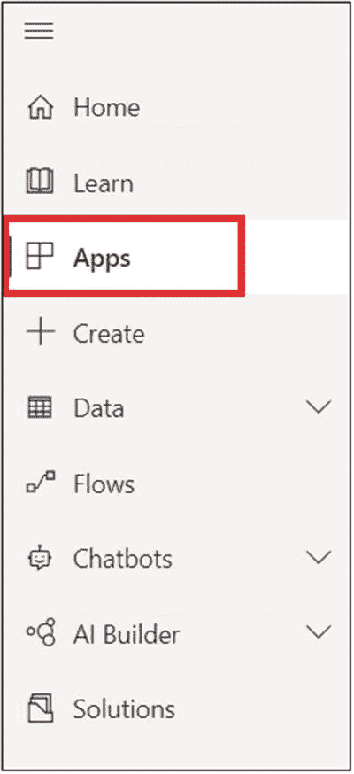
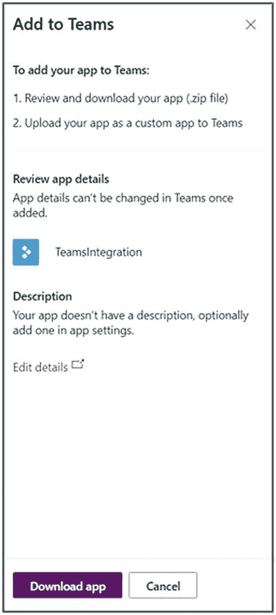

# 9.使用解决方案加速器构建团队应用

本章涵盖了使用解决方案加速器构建团队应用、使用 power 应用构建团队应用、power automate 与团队的集成、应用模板和团队移动平台可扩展性。今天，使用低代码方法来构建应用程序，而不是在 Visual Studio 等 IDE 中编写代码，您实际上可以将您的应用程序绘制成一幅图片，我们负责在后端生成您需要的代码，以使您的应用程序实际工作。最好的部分是不用写代码就能构建应用程序，并轻松地将它们添加为标签或将应用程序集成到团队中。

## 解决方案加速器概述

每个客户都希望应用程序开发和部署能够运行得更快，按照自己的节奏升级，同时保持对解决方案设计的完全控制，并定制已部署的服务来满足他们的需求。Microsoft Teams 是 Microsoft 365 中团队合作的中心，使人们能够一起工作，并将所有应用程序集成在一起，而无需重新开发。这就是为什么解决方案加速器是重用现有应用程序的最佳解决方案。如今，客户的工作方式发生了变化；所有人都在远程工作，需要在几分钟内快速访问信息。

## 电源平台概述

微软的 Power 平台为用户提供了创建加速业务发展的解决方案所需的工具。Microsoft Power Platform 是一个产品系列，在一个无缝集成的平台上提供创新的业务解决方案。Power Platform 提供了一个图形用户界面，该界面采用拖放组件和模型驱动逻辑(与传统的计算机编程相反)，使日常用户能够快速创建几乎不需要编码的应用程序(也称为低代码界面)。同时，它还为专业开发人员提供了一套强大的工具来创建高级定制应用程序。

Power Platform 支持的业务应用和流程自动化可以迅速成为组织应用生态系统的一部分。因此，企业管理员必须了解什么是 Power Platform，以及其公民开发人员如何利用其功能来连接到作为托管企业环境一部分的服务和数据。

图 9-1

动力平台

动力平台系列包含四个关键产品(参见图 [9-1](#Fig1) ):

1.  商业智能

2.  电源应用程序

3.  电力自动化

4.  强大的虚拟代理

### 电源应用程序

Microsoft PowerApps 是一种将商业专业知识转化为定制应用程序的强大新方法。使用 PowerApps，您可以快速轻松地创建应用程序，而无需编写任何代码。PowerApps 有一个直观的设计界面，在您为团队或业务创建应用程序时全程指导您，您的应用程序可以与您已经拥有的数据集成，或者使用我们的业务线应用程序。Power Apps 是一套基于云的应用、服务、连接器和数据平台，为组织提供快速应用开发环境，以构建满足其业务需求的定制应用。通过使用 Power 应用程序，用户可以快速构建自定义业务应用程序，这些应用程序连接到存储在底层内置数据平台(称为公共数据服务)或各种在线和内部数据源(如 SharePoint、Excel、Office 365、Dynamics 365、SQL Server 等)中的业务数据。

### 电力自动化

Power Automate 是一项帮助用户为其应用和服务创建自动化工作流的服务，然后可以与微软团队集成在一起工作。

### Power BI(商业智能)

Power BI 是一款可视化工具，可帮助您创建令人惊叹的报告和仪表盘，帮助您深入了解您的业务并做出更好的业务决策。此外，您还可以将 Power BI 报告作为选项卡或应用程序集成到微软团队中，以便协同工作并做出明智的决策。

### 超级虚拟代理

Power Virtual Agents 使我们能够轻松创建聊天机器人:也就是说，通过简单易用的图形界面轻松构建强大的转换机器人，并将对话机器人集成到您的 Microsoft Teams 渠道中。

## PowerApps 集成

### 每个 PowerApps 都是团队应用

我们有三个选项可以让您的 PowerApps 成为团队应用:

*   选项 1:添加为频道选项卡

*   选项 2:在团队中嵌入应用程序

*   选项 3:上传到租户应用目录，并使用设置策略配置为个人应用

### 利益

PowerApps 在已经开展关键工作和协作的团队中可用，因此 IT 管理员可以通过将 PowerApps 发布到团队中的租户应用目录来以可扩展的方式分发 PowerApps，一线员工可以在团队移动中访问 power apps。

虽然我们还有很长的路要走，但是已经有很多很好的例子可以说明客户是如何利用团队中加载的 PowerApps 来运营他们的业务的——让我们在这里分享一些例子。

#### 教育:塔科马公立学校

塔科马学区的助理校长——没有任何技术经验！–为教师构建了强大的应用程序来跟踪学生的阅读理解，并提供更有帮助的建议。图 [9-2](#Fig2) 引用了这一客户体验。

图 9-2

塔科马公立学校

#### 电信:澳大利亚电信

澳大利亚电信提供商 Telstra 开发了一些工具，使其现场技术人员能够更有效地工作，例如访问知识文档、向领导层提交问题以及更好地记录损坏索赔。图 [9-3](#Fig3) 引用了这一点进行实施

图 9-3

Telstra 通信

#### 非营利:美国红十字会

美国红十字会已经将他们的供应链数字化，允许更好地管理和跟踪重要资源。图 [9-4](#Fig4) 引用了这一点进行实施。

图 9-4

美国红十字会

## 练习 1–将 PowerApps 应用程序添加为渠道应用程序

以下是将 PowerApps 应用程序添加为频道选项卡所涉及的步骤:

图 9-5

SharePoint 列表

1.  使用 SharePoint 创建数据源
    1.  创建包含名称、照片和描述的 SharePoint 列表“UserInfo ”(图 [9-5](#Fig5) )

    2.  然后添加几条记录

图 9-12

在团队选项卡中添加了 PowerApps

1.  Create a Canvas app in Power Apps ([`https://powerapps.microsoft.com`](https://powerapps.microsoft.com)) (Figure [9-6](#Fig6)):
    *   保存并发布应用程序

    

    图 9-8

    设计画布应用程序

    *   添加标题

    *   添加垂直图库并选择数据源作为 SharePoint 列表“UserInfo”

    *   然后添加显示表单并选择数据源作为 SharePoint 列表' UserInfo '

    *   添加画廊 1。在显示表单中选择项目属性(图 [9-8](#Fig8)

    

    图 9-7

    画布应用程序从空白

    *   输入应用名称

    *   选择数位板格式

    *   点击创建按钮创建一个应用程序(图 [9-7](#Fig7)

    

    图 9-6

    创建高级应用程序

    *   前往 [`https://powerapps.microsoft.com`](https://powerapps.microsoft.com)

    *   签到

    *   单击创建➤从空白中选择画布应用程序

2.  Add the Power Apps to Teams as tab (Figure [9-9](#Fig9))
    *   单击〖保存〗按钮，将 Power Apps 作为标签添加(图 [9-12](#Fig12) )

    

    图 9-11

    从现有应用中选择

    *   单击添加按钮将高级应用添加到您的频道

    *   选择“团队整合”应用程序(图 [9-11](#Fig11)

    

    图 9-10

    添加选项卡

    *   搜索电源并选择 PowerApps(图 [9-10](#Fig10) )

    

    图 9-9

    在频道中添加标签

    *   前往团队( [`https://teams.microsoft.com`](https://teams.microsoft.com) )

    *   选择团队，转到您的团队并选择渠道

    *   点按频道中的+

在本练习中，您学习了如何将 Integrate Power Apps 用作 tab 应用程序的 Microsoft 团队中的团队。

## 练习 2–power apps 应用在团队中嵌入应用

您可以通过将您创建的应用程序直接嵌入到 Microsoft 团队来共享该应用程序。完成后，用户可以选择+将你的应用添加到你所在团队的任何团队频道或对话中。该应用程序在您团队的选项卡下显示为磁贴。此外，管理员可以上传应用程序，以便它在所有选项卡部分下显示您租户中的所有团队。

### 下载应用程序

我们开始吧。

图 9-13

PowerApps 应用程序列表

*   登录 [`https://powerapps.microsoft.com`](https://powerapps.microsoft.com) ，然后在菜单中选择应用(图 [9-13](#Fig13) )。

图 9-14

选择 PowerApps 应用程序

*   选择更多操作(...)的应用程序，然后选择添加到团队(图 [9-14](#Fig14) )。

图 9-15

下载应用程序

*   在添加到团队面板中，选择**下载**。然后，Power Apps 将使用你已经在应用中设置的应用描述和徽标来生成你的团队清单文件(图 [9-15](#Fig15) )。

### 将应用程序添加为个人应用程序

现在我们需要添加它。

图 9-16

上传自定义应用程序

*   要将应用添加为个人应用或任何频道或对话的标签，请选择左侧导航栏中的**应用**，然后选择**上传自定义应用**(图 [9-16](#Fig16) )。

*   上传下载的 zip 文件

*   选择添加将应用程序添加为**个人应用程序，或选择添加到团队将应用程序添加为现有频道或对话中的标签**。

在本练习中，您学习了如何在 Microsoft Teams for a tab 应用程序中将 Power Apps 应用程序用作团队应用程序(即，将应用程序嵌入团队)。

## 电力自动化集成

Power Automate 是一项服务，可以帮助用户在他们喜爱的应用程序和服务之间创建自动化的工作流，以同步文件、结束通知、收集数据等。工作流，简称为 Power Automate 中的流程，由触发事件、条件和操作组成。

当触发事件发生时，流程开始。触发器可以包括创建记录、发生预定的活动，甚至是 Power Automate 移动应用程序的按钮点击。触发流程后，工作流逻辑会检查流程中定义的条件，对于任何为真的条件，都会执行与该条件相关联的操作。

这创建了使用 Power Automate 自动执行重复性工作任务的流程——并直接从您的 Microsoft 团队数据中触发。

## 练习 3–增强与团队的自动化集成

按照以下步骤在 Microsoft 团队中安装 Power Automate 应用程序。

图 9-17

选择团队应用

*   登录 Microsoft 团队。

*   点击团队导航栏左下方的**应用**图标(图 [9-17](#Fig17) )。

图 9-18

搜索流程

*   搜索**流程**(图 [9-18](#Fig18) )。

*   选择**流程** app。

图 9-19

添加流量应用程序

*   选择并点击**添加➤添加到团队**按钮进行安装(图 [9-19](#Fig19) )。

*   Power Automate 现已安装。

图 9-20

设置流量应用程序

*   选择团队和渠道(图 [9-20](#Fig20) )。

图 9-21

将流量应用程序设置为选项卡

*   点击设置选项卡或设置机器人(图 [9-21](#Fig21) )。

*   我选择了设置选项卡。

*   现在您可以从团队中创建一个流程。

此外，您可以设置为 bot 并从对话中访问。

图 9-22

将流添加为 bot

*   转到团队菜单中的(…)(图 [9-22](#Fig22) )

图 9-23

将流应用程序设置为机器人

*   选择列表流

*   它显示我的所有流程(图 [9-23](#Fig23)

## 团队应用的应用模板

应用程序模板是面向 Microsoft 团队的生产就绪型应用程序，由社区成员开发并由 Microsoft 发布。这款应用的模板是开源的，可以在 GitHub 中获得。所有应用程序模板都包含详细的部署说明和截图。此外，微软测试并发布了这些应用，因此您可以将它们直接部署到您的组织租户，或者根据您的业务范围修改源代码。这些应用程序模板对于团队的大多数日常活动非常有用。无论你是开发人员还是 IT 专业人士，你都可以部署和使用这款应用，无需微软或社区成员的任何帮助。

### 什么是 App 模板？

今天，我们有 30 多个由微软提供的应用模板，这些模板是可在您的租户中部署的生产就绪型应用。所有这些应用程序都解决了大多数现实世界中的一般性问题。无需为您的应用程序额外付费。它们附带了功能文档、部署文档和完整的源代码。任何时候，你都可以根据你的 LOB 修改源代码(图 [9-24](#Fig24) )。

图 9-24

应用程序模板定制能力

#### 主要优势

**即插即用体验**

应用程序模板附带了带有详细文档的部署脚本，但不要求开发人员使用它来部署应用程序。

**生产就绪代码**

所有应用模板都遵循最佳实践、安全性、合规性和标准治理。此外，微软在发布之前测试了社区提交的应用程序模板。

**可定制可扩展**

他们提供完整的代码给你，也就是开源。代码和部署脚本都可以根据您的业务线进行定制和扩展。

**详细的文档和支持**

应用模板包含在端到端文档中，其中包含屏幕截图和解决方案架构、部署脚本以及配置步骤。如果您发现任何问题，可以在 GitHub 上提出。微软和社区成员可以提供帮助。

## 应用程序模板

截至 2020 年 9 月，我们有 30 多个可用的应用程序模板，并且根据社区提交的内容每天都在增加。此外，该社区在同一个应用程序模板中添加了新功能，因此，如果这些功能适合您的组织，您可以轻松升级它。

**生产就绪 app 模板**转到 [`https://aka.ms/teamsapptemplates`](https://aka.ms/teamsapptemplates) 。它包含所有可用应用程序模板的概述，以及 GitHub repos 的链接(图 [9-25](#Fig25) )。

图 9-25

应用程序模板列表

### 如何部署 App 模板？

部署应用程序模板非常容易，不需要任何开发人员。你只需要遵循文档。首先设置先决条件和配置，然后就可以进行一键部署了。要了解更多关于应用部署的信息，请阅读文档说明和架构图(图 [9-26](#Fig26) )。

图 9-26

部署应用程序模板

### 常见问题？

1.  这些应用安全吗？

    应用模板符合安全和基础设施方面的建议最佳实践，所有社区提交的更改都经过审核，以确保持续符合要求。

2.  将这些应用程序部署到我的租户需要什么？

    所有应用程序模板都附有详细的部署说明，只需几分钟即可完成设置。您不需要开发人员部署和使用这些现成的应用程序模板。

3.  大家可以部署这些 app 模板吗？

    通常，组织有自己的审核流程来将应用上传到内部目录。拥有这些权限的任何人都可以部署这些应用程序。

4.  这些应用程序需要付费吗？

    这些应用程序模板可以免费使用，因为它们是开源的。他们可能会产生 Azure 消费费用，但有免费试用。

### 许可证

这个应用程序模板是根据麻省理工学院许可条款提供的。除了这些条款之外，使用本应用程序模板意味着您同意以下内容:

*   您有责任遵守内部或外部隐私和安全法规。

*   您应对所有与数据相关的事件负责。

*   Microsoft 不授予您使用任何 Microsoft 名称、徽标或商标的权利。

*   使用此模板并不保证团队应用商店接受您的应用。

## 团队移动平台可扩展性

团队平台从一开始就被设计成允许外部服务的特性看起来像是团队的本地特性，包括微软服务和来自第三方的服务。2019 年，微软发布了组织拥有自己的私有应用目录来发布 LOB 应用的能力。正如您稍后将听到的更多内容，我们有丰富的基于 Teams 平台的行业垂直解决方案可供选择(图 [9-27](#Fig27) )。

图 9-27

移动平台[参考–MSDN]

Teams platform 由一组不同的功能组成，这些功能根据用户的交互方式分类到一个 2 x 2 的网格中:在个人或组上下文中，或者在对话界面或外部服务拥有的专用画布中。

连接器只是一种在外部系统发生某种情况时将卡片发布到对话中的方法。

### 破冰船机器人

破冰者机器人允许一个群体中的用户与其他成员联系和联网。在团队 app 模板中有: [`https://docs.microsoft.com/en-us/microsoftteams/platform/samples/app-templates#icebreaker`](https://docs.microsoft.com/en-us/microsoftteams/platform/samples/app-templates) 。它还利用了其他功能，如“会议日程的深层链接”或“聊天的深层链接”。参见图 [9-28](#Fig28) 。

图 9-28

破冰船应用程序移动视图[REF–MSDN]

### 赞美信息扩展

赞美信息扩展应用程序用于向人们发送赞美，它在移动平台上可用。通过认可人们的努力，你可以让他们更快乐、更有效率。团队移动平台完全支持该应用程序(图 [9-29](#Fig29) )。

图 9-29

赞美信息扩展[REF–MSDN]

## 结论

在本章中，您已经通过示例了解了 Microsoft Teams 与应用程序模板、移动应用程序和 Power 平台集成的各种功能，现在我们可以在自己的应用程序中使用它们。在接下来的章节中，你将开始了解微软团队应用的不同选项和功能。