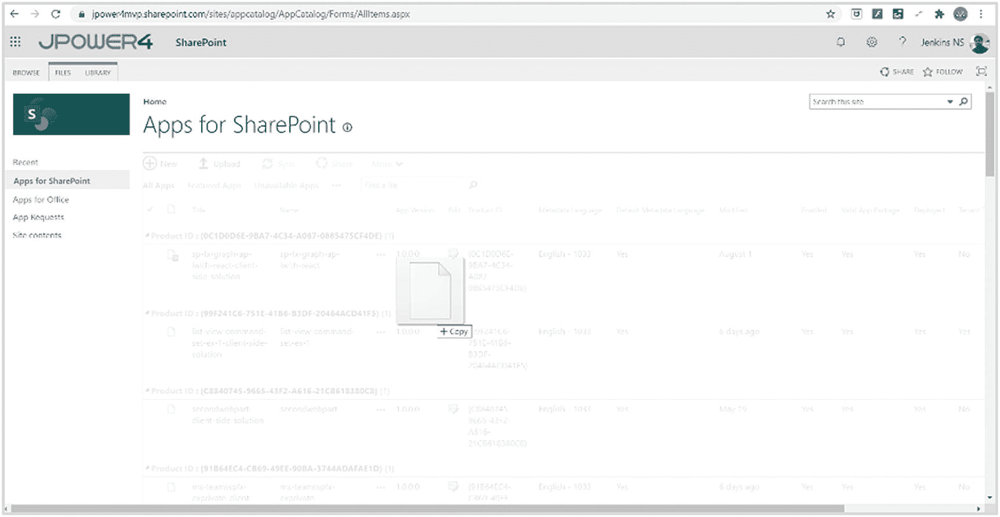
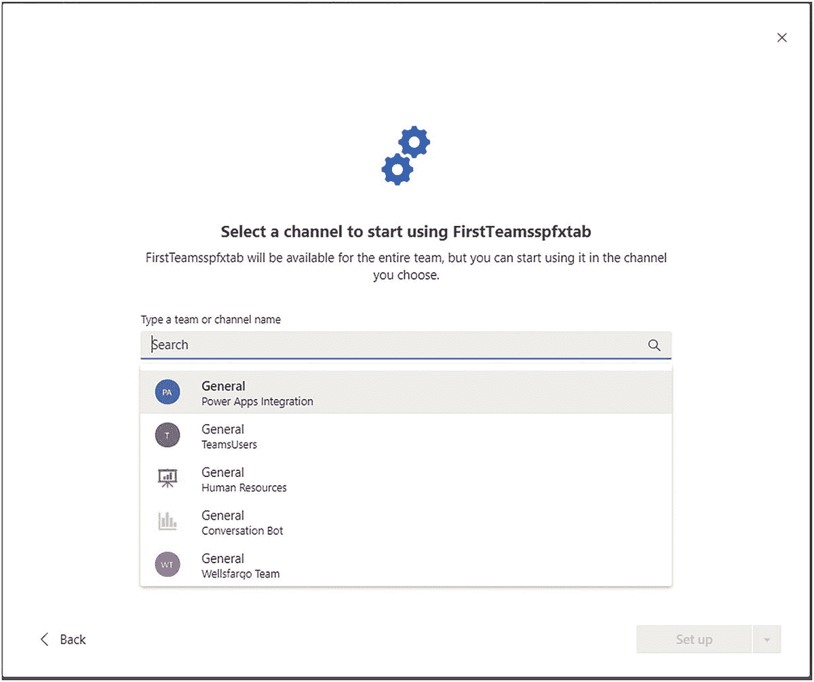
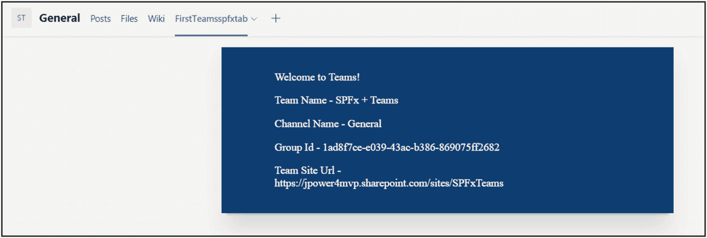

# 十、SharePoint 和团队：一起改进

在本章中，我们将了解如何使用 SharePoint 框架构建 Microsoft Teams 自定义。我们将了解MSTeam的发展以及使用 SharePoint 框架扩展MSTeam的好处。接下来，我们将学习如何在 Microsoft 团队中展现 SharePoint Framework 自定义。Microsoft teams 为创建团队应用提供了许多不同的可扩展性选项，其中可能包含一个自定义选项卡。正如您在前面章节中了解到的，它还可以利用机器人的消息传递扩展和连接器，或者您也可以构建一个自定义机器人来回复和接收来自用户的消息，以便与您的用户进行良好的交互体验。

## 什么是 SharePoint 框架？

SharePoint Framework (SPFx)是完全受支持的客户端 SharePoint 客户端 web 部件或扩展或库。借助 SharePoint Framework，我们可以使用 SharePoint 列表和库，并将 SPFx web 部件扩展到 Microsoft Teams、Microsoft Outlook web apps 和其他 Microsoft 365 应用。您可以使用基于首选 JavaScript 库的现代工具链 web 技术和工具。此外，所有 SharePoint Framework web 部件都具有响应性和移动就绪性。

## 向团队展示 SharePoint 框架

将 SharePoint Framework web 部件扩展到 Microsoft 团队，无需任何代码更改。您可以利用现有的知识，重用相同的业务线。如果已经为 SharePoint 开发了 SPFx web 部件，并且您希望在团队中使用相同的功能，那么您可以将 SPFx web 部件作为选项卡添加到 Microsoft 团队中。

### 将 SPFx 解决方案引入团队选项卡


图 10-1

将 SPFx 解决方案引入团队选项卡

图 [10-1](#Fig1) 代表 SPFx solutions to Teams 选项卡，详情如下:

*   首批 SPFx 团队解决方案使用租户应用目录部署到 Office 365 租户。

*   您有两种选择:一种是将 web 部件同步到团队，或者创建自定义清单文件并作为应用在团队中部署。

*   然后，用户选择 SPFx 应用，就像 MS Teams“添加选项卡”体验中的任何其他选项卡一样。

*   将显示配置面板，一旦保存，信息将存储在连接到该组的 SharePoint Online 网站中。


图 10-2

将 SPFx 解决方案引入团队选项卡

图 [10-2](#Fig2) 表示“团队”选项卡中的 SPFx web 部件负载，详细信息如下:

*   加载时，SPFx 组件呈现在一个专用的 _layout 页面中，该页面在团队中被 iFramed。

*   开发人员可以使用工作组和 SharePoint 网站上下文，并且您可以验证 web 部件的加载位置以及它是 SharePoint 还是工作组。

*   代码是从上载包时部署它的 SharePoint 资产库中加载的。

*   此外，代码可以在不同的 CDN 位置运行，如 Azure、SharePoint 库等。，基于您部署代码的位置。

### 共同需求

为什么需要 SharePoint Framework web 部件来扩展到团队？在这里，我们将讨论基于最终用户或 IT 管理员或开发完美。

#### 最终用户

不管工具/工作量如何，团队关心的信息应该是可用的，并使团队协作和外部交流成为可能。

#### IT 管理员

它可以减少为最终用户管理和部署解决方案的位置和方式。

#### 开发商

他们可以通过一个解决方案处理多种工作负载，减少开发人员的概念和经验。

#### 解决办法

为此，微软支持用户围绕 SharePoint 和团队中的相同内容进行协作，并提供集中的管理体验和工具，包括 LOB 应用分发和通用开发人员框架，用于构建针对 SharePoint 和团队体验的解决方案。见图 [10-3](#Fig3) 。


图 10-3

表面 SPFx 和团队解决方案

For this,

### SharePoint 框架目标团队选项卡

*   SPFX 是企业开发人员和 SIs 跨 SharePoint 和团队开发“O365 托管”解决方案的标准方式。

*   开发者将能够“瞄准”‘manifest . JSON’中的环境。

*   应用目录中的单点治理。

*   SPFx 的标准“功能”
    *   工具链

    *   证明

    *   SP、图形和 Web API 访问

    *   CDN 托管

    *   配置体验

    *   解决方案托管

*   组件可以获得正确的应用上下文。

### 目录同步

使用熟悉的技术构建您的应用，在应用目录中部署和托管它，并通过一键同步与团队同步:

*   开发在 SPFx 开发人员熟悉的环境中进行:
    *   自耕农

    *   新公共管理理论

    *   Visual Studio 代码

*   创建包后，管理员会将其部署到 SharePoint 租户应用目录中。

*   可用于同步 SPFx 组件的“同步到团队”选项在团队 LOB 目录中标记为在团队中工作。
    *   团队清单是即时创建的，包含所有特定于租户的信息。

### 为什么使用 SharePoint Framework 为 Microsoft 团队构建？

使用 SharePoint 框架为 Microsoft 团队构建有两个主要好处:

*   托管体验的单一平台

*   自动解决方案托管

#### 托管体验的单一平台

构建您的解决方案以跨团队、SharePoint、Outlook 和所有 Office 应用运行。见图 [10-4](#Fig4) 。


图 10-4

托管体验的单一平台

#### 自动解决方案托管

当你为MSTeam构建应用时，你需要在 Azure 或 app store 中托管应用。我们需要额外的基础设施，也需要额外的预算资金。如果您已经使用您喜欢的技术开发了相同功能的 SPFX web 部件，那么我们不需要为 Microsoft 团队开发和部署。此外，如果您启用了 Office 365 CDN，您的团队选项卡和个人应用的资产将从 CDN 提供，为您的用户提供显著更好的体验，而无需任何额外的成本或配置。它也不需要任何额外的开发成本。

#### 证明

Microsoft Teams 解决方案要求您在使用任何 API 之前连接并验证它们。当您自己构建 Microsoft Teams 应用时，您需要确保所有 API 都安全连接。但是在 SharePoint 框架中，它已经与 SharePoint 管理中心中的管理 API 权限访问相集成。它包含与 Microsoft Graph 和其他 API 通信的现成库。使用这些类，您可以访问 API 而不用担心身份验证。事情会是这样的:

*   团队富客户端和 SharePoint 之间的静默身份验证
    *   Teams 向 SharePoint 提供令牌客户端。

    *   它将其转换到 cookie 服务器端。

    *   托管 SPFx 解决方案的 _layout 系统页面显示:不需要额外的身份验证。

    *   对 SharePoint REST APIs 的完全访问权限。

*   如果组件要求您访问图形/Web API:
    *   您从客户端获得 auth 令牌:这里没有权限，我们将它用作引导令牌。

    *   SPFx 客户端库知道这个调用来自一个团队的富客户端环境。

    *   使用“代表”流将引导令牌发送给 AAD，以获得所请求资源的访问令牌，作为对引导令牌的交换。

    *   AAD 将访问令牌返回给 SPO。组件现在可以执行 Web API 调用了。

## 使用 SharePoint 框架构建 Microsoft 团队选项卡

从 SharePoint Framework v1.8 版，您可以使用 SharePoint Framework 工具为 Microsoft 团队构建选项卡，并将 SharePoint 用作您的解决方案的宿主。但是您需要手动部署 manifest.json 文件。作为 SharePoint Framework v1.10 的一部分，您还可以将您的解决方案发布为 Microsoft Teams 个人应用并自动同步。

使用 SharePoint 框架作为 Microsoft 团队选项卡平台的好处包括:

*   开发平台类似于 SharePoint Framework web 部件，不需要单独的开发环境。

*   所有 SharePoint Framework web 部件都可以同步，并作为选项卡或个人应用添加到 Microsoft 团队中。

*   还控制 Teams/SPFx 上下文和范围，以将自定义选项卡作为 web 部件公开，并使用 this . context . sdks . Microsoft Teams 获取 Teams 上下文。

*   您的“团队”选项卡将在特定团队背后的基础 SharePoint 网站的上下文中执行。这意味着您可以在 web 部件中利用任何 SharePoint 特定的 API 或功能，也就是说，从您的选项卡中利用这些 API 或功能。

### 显色法

从 SharePoint Framework 1.8 或更高版本，您可以开始开发 Microsoft 团队选项卡。入门的高级步骤如下:

*   使用客户端 web 部件创建 SharePoint 框架解决方案。

*   将“ **TeamsTab** ”添加到 webpart 清单文件的 **supportedHosts** 属性中，以将其用作频道中的选项卡:

*   将“TeamsPersonalApp”添加到 web 部件清单的 supportedHosts 属性中，以将其用作个人应用:

```
"supportedHosts": ["SharePointWebPart", "TeamsTab"],

```

*   使用租户范围的部署选项将 web 部件部署到 SharePoint 应用目录。那么它适用于所有团队。

*   激活您部署的 SharePoint 框架解决方案，并在应用目录中选择 **Sync to Teams** 按钮。

```
"supportedHosts": ["SharePointWebPart", "TeamsPersonalApp"],

```

### 启用上传自定义应用

作为 SharePoint 框架团队选项卡开发人员的一部分，您需要将 Microsoft Teams 应用显式部署到 Microsoft Team 中的团队。您的租户还需要支持MSTeam的自定义应用的侧加载，以便您可以将应用部署到特定团队并使用它。


图 10-5

启用上传自定义应用

*   前往 [`https://admin.teams.microsoft.com`](https://admin.teams.microsoft.com)

*   选择团队应用

*   然后选择设置策略

*   添加新的安装策略

*   启用“上传自定义应用”

*   管理用户(图 [10-5](#Fig5)

### 部署选项

有两个选项可用于部署 Microsoft Teams 选项卡或作为个人应用从 SharePoint Framework 部署到 Microsoft Team。由于 SharePoint 和 Microsoft 团队都有自己的应用目录，部署需要在两种服务上运行。新功能的可见性可以通过所采取的部署步骤来控制。

*   与租户团队同步

*   手动部署

#### 租户部署

您可以使用应用目录功能区中的**与团队同步**按钮，这将自动创建 Microsoft Teams 应用清单和应用包，并将其安装在 Microsoft Teams 商店中。这将使您的解决方案对您的租户和 Microsoft 团队中的所有用户可用。然后，您可以从频道中将 web 部件添加为选项卡。

#### 手动部署

有一种手动方式来部署您的解决方案，例如，允许您将解决方案仅提供给租户中的一个特定团队。有关如何创建清单的详细信息，请参见为 web 部件手动创建 Microsoft 团队清单并将其部署到 Microsoft 团队: [`https://docs.microsoft.com/en-us/sharepoint/dev/spfx/web-parts/guidance/creating-team-manifest-manually-for-webpart`](https://docs.microsoft.com/en-us/sharepoint/dev/spfx/web-parts/guidance/creating-team-manifest-manually-for-webpart)

*   以标准方式构建您的 SharePoint 框架解决方案:

*   您将能够在'中看到两个图像文件。/teams '文件夹。

*   为团队创建自定义清单文件，并参考下面的 url:
    *   [T2`https://docs.microsoft.com/en-us/sharepoint/dev/spfx/web-parts/guidance/creating-team-manifest-manually-for-webpart`](https://docs.microsoft.com/en-us/sharepoint/dev/spfx/web-parts/guidance/creating-team-manifest-manually-for-webpart)

*   为 web 部件手动创建 Microsoft 团队清单，并将其从 Microsoft 团队部署到此文件夹。该文件应命名为“*manifest.json”，您可以添加一个 webpart 组件 ID，以便从“团队”选项卡中引用。

*   将清单添加到。/teams '文件夹中，将两个图像文件和 manifest.json 一起压缩成一个 zip 文件。这意味着 zip 文件应该只包含 manifest.json 和两个图像。

*   您可以将其作为应用直接部署到MSTeam。

*   另外，将代码部署在 Microsoft 365 CDN 或您首选的 CDN 中。

```
gulp bundle --ship
gulp package-solution --ship

```

### 检测 Web 部件是否在团队上下文中

web 部件中的上下文包含对 Teams JavaScript SDK 对象的引用，因此当您的 web 部件呈现为选项卡时，您可以轻松访问 Teams 上下文。

*   属性**this . context . Microsoft teams**在 SharePoint Framework v1.10 版本中已被弃用，Microsoft 从 SPFx v1.10 引入了 this . context . sdks . Microsoft teams

*   你应该使用**this . context . sdks . Microsoft teams**为所有用 **SharePoint Framework v1.10 和更高版本**创建的解决方案服务。

```
this.context.sdks.microsoftTeams

```

## 练习–创建 SPFx Web 部件并分发给团队

在开始练习之前，请验证您的 SharePoint 框架开发环境。

### 设置您的 SharePoint 框架开发环境

您可以使用 Visual Studio 或您自己的自定义开发环境来构建 SharePoint 框架解决方案。您也可以使用 Mac、PC 或 Linux 环境。

### 安装 Node.js

安装最新版本的 **Node.js LTS 10.x** 。

如果您按照第 [2](02.html) 章中的应用开发设置进行安装，请验证版本。SharePoint Framework 开发目前不支持 Node.js v9.x、v11.x 和 v12.x。

### 安装吞咽

Gulp 是一个基于 JavaScript 的任务运行器，用于自动化重复任务。SharePoint Framework 构建工具链使用 Gulp 任务来构建项目、创建 JavaScript 包以及用于部署解决方案的结果包。

如果您已经按照第 [2](02.html) 章中的说明进行了安装，则无需再次安装。

输入以下命令安装 Gulp:

```
npm install gulp –global

```

### 安装约曼

约曼帮助您启动新项目，并提供最佳实践和工具来帮助您保持高效率。SharePoint 客户端开发工具包括一个用于创建新 web 部件的 Yeoman 生成器。生成器提供了通用的构建工具、通用的样板代码和一个通用的操场网站来托管用于测试的 web 部件。

输入以下命令安装 Yeoman:

```
npm install yo –global

```

### 安装约曼 SharePoint 生成器

您可以使用 Yeoman SharePoint webpart 生成器来创建 SharePoint 客户端解决方案项目。

要全局安装 SharePoint Framework Yeoman 生成器，请输入以下命令:

```
npm install @microsoft/generator-sharepoint –global

```

### 信任自签名开发人员证书

当使用 gulp serve 在本地运行 SharePoint Framework web 部件时，默认情况下它使用 HTTPs 执行，并通过使用开发自签名 SSL 证书来实现。默认情况下，自签名证书在您的开发环境中不受信任。

若要信任开发环境，请在项目文件夹中执行以下命令:

```
gulp trust-dev-cert

```

**创建项目**

在本练习中，您将学习如何创建 SharePoint Framework web 部件，以及如何在无需任何额外代码的情况下部署/同步到 Microsoft 团队。

*   打开命令提示符，导航到要保存工作的目录

*   创建新的项目目录

*   导航到 teamsspfx-tab 文件夹

```
md teamsspfx-tab

```

*   通过运行 Yeoman SharePoint 框架生成器创建新的解决方案:

```
cd teamsspfx-tab

```

*   出现提示时，输入以下值:
    *   您的解决方案名称是什么？ **teamsspfx-tab**

    *   您希望组件以哪些基准包为目标？**仅 SharePoint Online(最新)**

    *   您想将文件放在哪里？**使用当前文件夹**

    *   您是否希望租户管理员能够选择立即将解决方案部署到所有站点，而无需运行任何功能部署或在站点中添加应用？**是**

    *   解决方案中的组件是否需要访问 web APIs 的权限，这些 API 是唯一的，并且不与租户中的其他组件共享？**否**

    *   创建哪种类型的客户端组件？**web 部件**

    *   向解决方案添加新的 Web 部件？ **teamsspfx-tab**

    *   您的 Web 部件名称是什么？**firtteamsspfxtab**

    *   您的 Web 部件说明是什么？**第一队 SPFx 标签**

    *   您想使用哪个框架？**没有 JavaScript 框架**

```
yo @microsoft/sharepoint

```

此时，Yeoman 安装了所需的依赖项并搭建了解决方案文件。创建解决方案可能需要几分钟时间。Yeoman 搭建了项目的框架，将您的 **FirstTeamsspfxtab** web 部件也包含在内。见图 [10-6](#Fig6) 。


图 10-6

teamsspfx-tab web 部件已创建

*   输入**代码。**以及以下在 Visual Studio 中打开 webpart 项目的代码:


图 10-7

溶液结构

*   SharePoint Framework v1.8 版和更高版本的项目将包括。解决方案结构中的/teams 文件夹(图 [10-7](#Fig7)

```
code

```

*   Teams 文件夹包含以下两个文件:
    *   [componentId]_color.png:选项卡的默认小图片

    *   [componentId]_outline.png:选项卡#的默认大图片

这些图像将在MSTeam中用作图标。您可以用自定义映像替换它们，但是您需要使用相同的名称，以确保它们与解决方案部署一起正确打包。

对于租户部署，请转至**。/config/package-solution.json，**添加属性“skipFeatureDeployment”:**true**如下图。

```
   {
     "$schema": "https://developer.microsoft.com/json-schemas/spfx-build/package-solution.schema.json",
     "solution": {
       "name": "teamsspfx-tab-client-side-solution",
       "id": "f9892e3b-9a82-4fc6-83fb-bae21492b82e",
       "version": "1.0.0.0",
       "includeClientSideAssets": true,
       "skipFeatureDeployment": true,
       "isDomainIsolated": false
     },
     "paths": {
       "zippedPackage": "solution/teamsspfx-tab.sppkg"
     }
   }

```

如果您在`"skipFeatureDeployment": false,`中输入 false，则您必须将此解决方案单独添加到 MS 团队网站集。还要考虑以下几点:

*   确保团队-团队和 SharePoint 网站相同。

*   在团队中部署 web 部件之前，先在 SharePoint 网站中部署它。

在本练习中，我选择了**skip feature deployment:true**。

### 更新 web 部件清单，使其对 Microsoft 团队可用

找到**。/src/web parts/firsteamsspfxtab/firsteamsspfxtabweb part . manifest . JSON**文件，并修改 supportedHosts 属性以包含“ **TeamsTab** 参见图 [10-8](#Fig8) 。


图 10-8

支持的主机

```
"supportedHosts": ["SharePointWebPart","TeamsTab"]

```

从 SharePoint Framework v1.10 版开始，您可以将 SharePoint Framework web 部件用作个人 Microsoft Teams 应用。这可以通过在 supportedHosts 值中包含“ **TeamsPersonalApp** ”来控制。个人应用 SPFx web 部件没有配置选项。

### 更新代码以了解 Microsoft Teams 上下文

*   打开**。/src/web parts/hello world/first teams spfxtabweb part**。如果将解决方案用作选项卡，则需要进行必要的编辑，以使解决方案了解 Microsoft Teams 上下文。

*   按如下方式更新 render()方法。

*   我们如何呈现不同的内容取决于代码是在 Microsoft Team 中呈现为选项卡还是在 SharePoint 中呈现为 web 部件。我们可以通过检查**this . context . sdks . Microsoft Teams**属性来检测该解决方案是否由MSTeam托管。

*   然后用下面的代码替换 render()方法:

*   当您将 spfx web 部件添加为选项卡时，上面的代码显示了小组名称、频道名称、小组 ID 和小组网站 URL。

*   在 SharePoint 中添加 spfx web 部件时，同样会显示“欢迎使用 SharePoint”。

```
public render(): void {
    let teamsMessage: string = `<p class="${styles.description}">Welcome to SharePoint!</p>`;

    if (this.context.sdks.microsoftTeams) {
    teamsMessage = `
    <p class="${styles.description}">Welcome to Teams!</p>
    <p class="${ styles.description}">Team Name - ${escape(this.context.sdks.microsoftTeams.context.teamName)}</p>
<p class="${ styles.description}">Channel Name - ${escape(this.context.sdks.microsoftTeams.context.channelName)}</p>
<p class="${ styles.description}">Group Id - ${escape(this.context.sdks.microsoftTeams.context.groupId)}</p>
<p class="${ styles.description}">Team Site Url - ${escape(this.context.sdks.microsoftTeams.context.teamSiteUrl)}</p>`;
    }

    this.domElement.innerHTML = `
      <div class="${ styles.firstTeamsspfxtab }">

        <div class="${ styles.container }">
          <div class="${ styles.row }">
            <div class="${ styles.column }">
              <p class="${ styles.description }">${teamsMessage}</p>
            </div>
          </div>
        </div>
      </div>`;
  }

```

### 将 Web 部件打包并部署到 SharePoint



图 10-9

部署 Spfx Web 部件

1.  返回到命令提示符。

2.  执行以下命令来构建和捆绑您的解决方案。这将创建一个发布版本并映射一个动态标签作为您的资产的主机 URL。
    *   吞咽构建

    *   吞咽包–运输

3.  执行以下任务来打包您的解决方案。这将在 **sharepoint/solution** 文件夹中创建一个 **teamsspfx-tab.sppkg** 包。
    *   吞咽包装-溶液-装运

4.  然后将生成的包部署到租户应用目录。

5.  转到您的租户的 SharePoint 应用目录。

6.  上传或者拖拽 **teamsspfx-tab.sppkg** 到 App 目录(图 [10-9](#Fig9) )。

这将部署客户端解决方案包。由于这是一个完全信任的客户端解决方案，SharePoint 会显示一个对话框，要求您信任要部署的客户端解决方案。参见图 [10-10](#Fig10) 。


图 10-10

信任 SPFx Web 部件


图 10-11

已部署的 Spfx Web 部件

*   信任该解决方案，并确保选中了“使该解决方案对组织中的所有网站可用”选项，以便可以从 Microsoft 团队端使用该 web 部件。

*   然后单击 Deploy 按钮来部署 web 部件(图 [10-11](#Fig11) )。

### 同步并使 Web 部件在 Microsoft 团队中可用

在 SharePoint 租户应用目录 web 部件解决方案列表中选择**teamsspfx-tab-client-side-solution**包，并在文件选项卡的功能区中选择**同步到团队**按钮。参见图 [10-12](#Fig12) 。


图 10-12

同步到团队

*   在右上角可以看到确认状态消息。

您的 SharePoint Framework web 部件已成功部署并同步到团队(图 [10-13](#Fig13) )。


图 10-13

已成功同步到团队

Your SharePoint Framework web

### 无法将解决方案同步到团队

如果您收到**未能将解决方案同步到团队**的通知，该通知可能出现在您页面的右上角，请按照以下步骤从 Microsoft 团队中删除您的应用，然后尝试再次同步:

打开 Microsoft 团队。

*   查看您的团队频道时，单击+添加选项卡。

*   选择顶部的更多应用链接。

*   在列表中找到您的应用，然后点击...菜单。

*   选择“删除”以从 Microsoft 团队中移除该应用。

*   您现在可以将新版本同步到 Microsoft 团队。

### 将 SPFx Web 部件作为选项卡添加到 Microsoft 团队中


图 10-14

团队检查可用的应用

*   等待几分钟–由于缓存，同步到团队可能需要几分钟时间。

*   然后打开MSTeam客户端，通过从左侧导航栏选择**应用**来检查应用目录状态(图 [10-14](#Fig14) )。


图 10-15

为您的组织构建

*   单击应用并选择为 jpower4mvp(租户名称)构建。参见图 [10-15](#Fig15) 。


图 10-16

从团队中查找 web 部件

*   您可以在团队的应用目录中看到您的**firsteamsspfxtab**web 部件(图 [10-16](#Fig16) )。


图 10-17

加入团队

*   选择**firtteamsspfxtab**应用

*   点击**加入团队**按钮(图 [10-17](#Fig17)



图 10-18

选择要设置的团队和渠道

*   选择您要测试解决方案的团队和渠道。

*   然后点击**设置标签**按钮，确认要选择的标签(图 [10-18](#Fig18) )。


图 10-19

将应用保存到频道

*   点击**保存**按钮，确认要在通道上安装的标签(图 [10-19](#Fig19)



图 10-20

团队中的自定义应用插件

*   您的自定义选项卡已添加到 Microsoft Teams 频道，现在您可以看到代码在 Microsoft Teams 上下文中的反应。默认情况下，web 部件的主题来自基础 SharePoint 站点(图 [10-20](#Fig20) )。

您已经成功地将 SPFx web 部件部署到 Microsoft Teams 选项卡。

## 结论

在本章中，您学习了如何将 SharePoint Framework Web 部件作为选项卡呈现给 Microsoft 团队；现在我们可以在自己的应用中使用它。除此之外，你将在下一章开始学习MSTeam应用的部署选项。