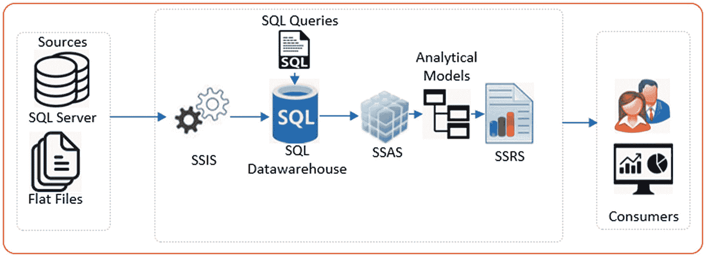
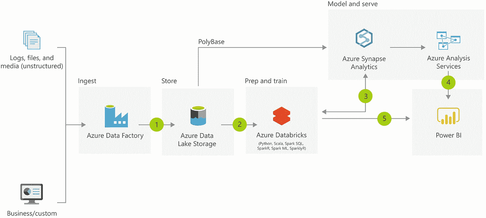
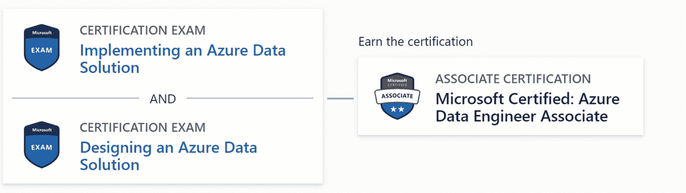
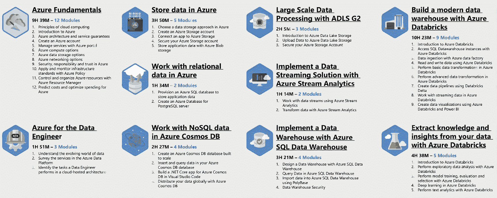
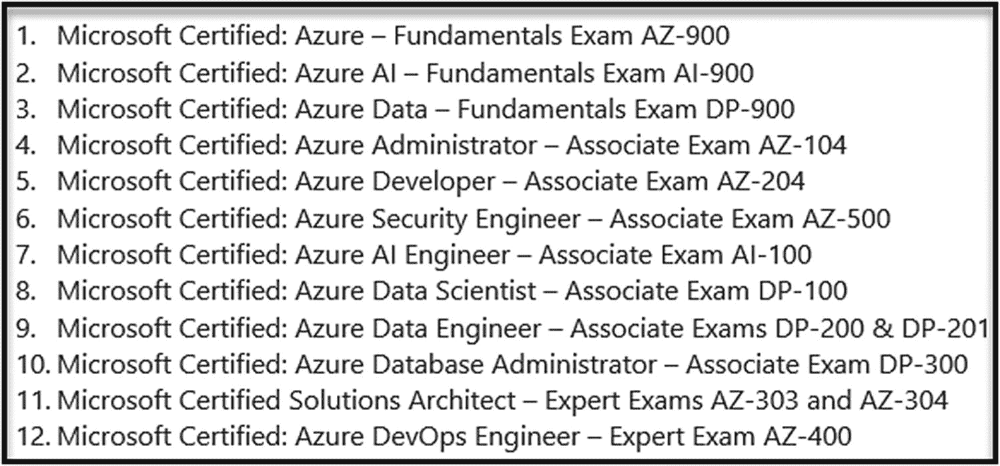
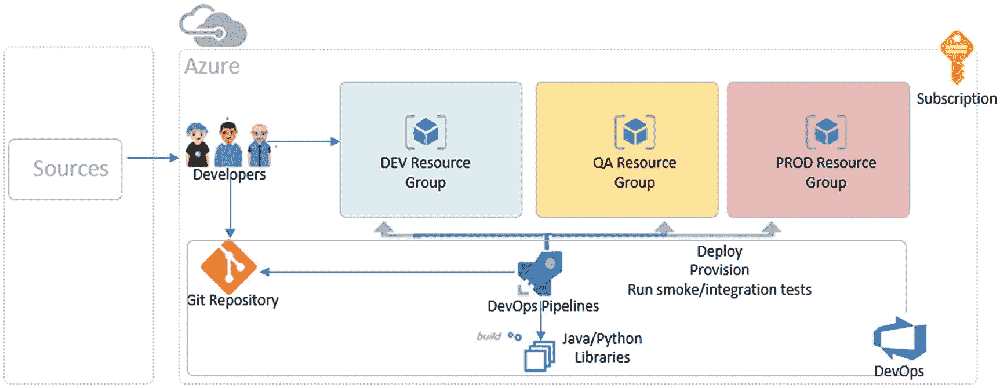
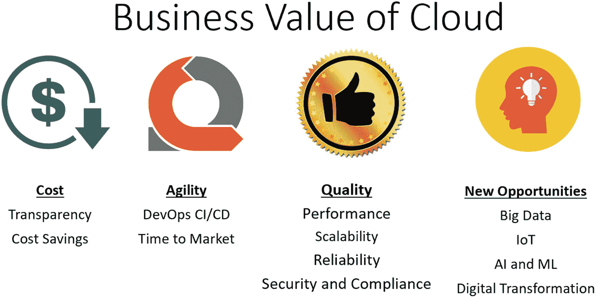
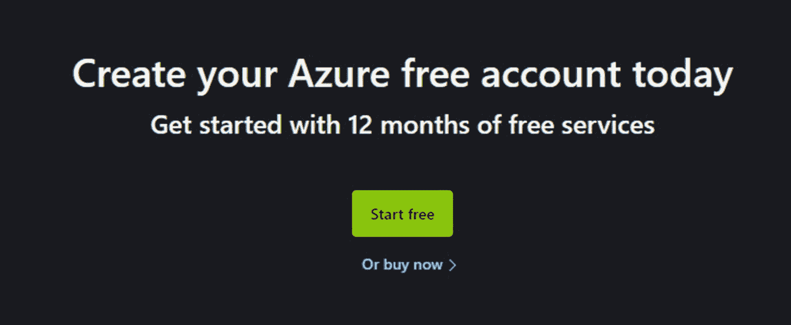

# 1.工具和先决条件

本章将通过让你掌握传统的微软商业智能(BI)栈，涵盖一些 Azure 数据工程入门的关键技巧。本章将帮助您了解 Azure 的现代企业数据和分析平台、各种大数据选项和性能调整建议，以及 Azure 数据工程师助理认证的基本要求。最后，这一章将涵盖扩展你的其他 Azure 专业知识的价值，以解决 Azure 数据解决方案的商业价值，并向你介绍通过 Azure Portal 开始 Azure 数据工程的选项。这一章将以对本书将涉及的 Azure 服务以及未涉及的 Azure 服务的介绍结束。

## 掌握传统的微软商业智能堆栈

Azure 的许多数据平台工具都源于传统的微软 SQL Server BI 平台。例如，Azure Data Factory(ADF)的映射数据流(MDF)很像 SQL Server Integration Services(SSIS)，而 Azure Analysis Services 则植根于 SQL Server Analysis Services (SSAS)。虽然 Azure 有许多微软传统 BI 堆栈中不常见的复杂性，但对 SSIS、SSRS、SSAS、T-SQL、C#、数据仓库等的深刻理解将有助于更好地理解 Azure 的数据服务。许多组织都有多年使用传统微软 BI 堆栈的相似历史，可能会寻找 Azure 数据工程师来帮助开拓他们进入现代企业数据和分析平台的旅程。通过对这些组织目前拥有的传统工具的了解和经验，您将能够很好地适应环境，并展示对传统 Microsoft BI 堆栈以及数据仓库概念的掌握。例如，了解如何设计和实现将数据从内部 SQL 数据库增量同步到 Azure Data Lake Storage gen 2(ADLS gen 2)的过程是许多组织正在寻求的技能，也是本书在未来章节中涉及的主题。

有许多在线资源和书籍可以帮助您掌握传统的 Microsoft BI 技能。例如，Ralph Kimball 的 [*数据仓库工具包*](https://www.kimballgroup.com/data-warehouse-business-intelligence-resources/books/data-warehouse-dw-toolkit/) 提供了维度建模的权威指南。还有许多其他学习微软商务智能的在线资源，从付费视频课程到免费的 YouTube 教程，例如来自 [WiseOwlTutorials](https://www.youtube.com/user/WiseOwlTutorials) 、 [TechBrothersIT](https://www.youtube.com/channel/UCtoDB5EEbt8C9fX72xjacLg/videos) 等等。图 [1-1](#Fig1) 描绘了传统微软 BI 数据架构的典型端到端流程。

图 1-1

在微软商务智能平台中使用 SSIS、SSAS 和 SSRS

## 了解 Azure 的现代企业数据和分析平台

虽然微软 Azure 拥有大量的资源，但现代企业数据和分析平台中最常见的组件在图 [1-2](#Fig2) 中列出。作为一名 Azure 数据工程师，能够设计和实现一个端到端的解决方案是至关重要的，这个解决方案遵循这个架构过程或它的定制变体，同时考虑安全性、高可用性等等。理解多种数据存储和数据集成选项之间的差异和相似之处也很重要。

图 1-2

现代 Azure 数据架构平台

在下一章中，我们将讨论如何在 Azure Data Factory、SQL Server Integration Services(SSIS)和 Azure Databricks 之间进行选择，以了解如何根据特定的用例及场景为工作选择正确的 ETL(提取-加载-转换)工具，并帮助您选择最适合工作的工具。了解何时选择 Azure Synapse 分析数据仓库(DW)还是 Azure SQL 数据库(ASQLDB)也是一种很好的做法。Melissa Coates 的以下文章详细讨论了这些不同的选项:

" Azure SQL 数据仓库是一个很好的选择吗？"( [`www.bluegranite.com/blog/is-azure-sql-data-warehouse-a-good-fit-updated`](http://www.bluegranite.com/blog/is-azure-sql-data-warehouse-a-good-fit-updated)

最后，对新的和现有的 Azure 数据资源的最近趋势、功能更新、可用性版本等有很好的理解，只会帮助你在构建更多 Azure 数据工程解决方案时做出更有教养、更有经验、更深思熟虑的决策。 [Azure 更新](https://azure.microsoft.com/en-us/updates/)*(*[`https://azure.microsoft.com/en-us/updates/`](https://azure.microsoft.com/en-us/updates/)*)*是找到这些更新的好地方，你可以过滤产品类别到数据工程特定的资源。还有许多其他免费的学习资源，从文章到视频教程，都有助于了解 Azure 数据平台的最新动态。

## 了解如何使用 Azure 管理大数据

有许多数据存储选项可用，鉴于 MPP(大规模并行处理的缩写)和 Spark 之间的相似性，客户经常会问如何选择和决定一个何时适合另一个。

在 20 世纪 90 年代引入 MPP 之前，自 20 世纪 70 年代以来，分析数据库市场一直由 SMP 架构主导。SMP 在规模、可扩展性、工作负载管理、弹性和可用性方面存在缺陷。

MPP 架构解决了 SMP 在性能、可伸缩性、高可用性和读/写吞吐量方面的许多缺点。

然而，MPP 有与成本相关的缺点；它对数据分发有着迫切的需求，添加新节点和重新分发数据需要停机时间，按需扩展计算资源以满足实时处理需求的能力有限，并且由于将存储与计算隔离的限制，有可能出现容量过剩。

Spark 中的 RDD 类似于 MPP 中的分布式表，因为许多 RDD 操作都有等效的 MPP 操作。然而，RDD 确实为实时处理需求提供了更好的选择，并且能够纵向扩展节点以进行批处理，同时还能独立于计算经济高效地扩展存储(数据湖)。此外，对于高度非结构化的数据处理(文本、图像、视频等)，推荐使用 MPP。此外，它还提供了大规模高级分析(人工智能、ML[机器学习]、文本/情感分析等)的能力。

Spark 和 MPP 都有很好的互补性，两者之间的选择取决于用例。Spark 非常适合大数据工程、ETL、AI/ML、实时数据处理和非报告/非查询用例，而 MPP 非常适合需要大量查询和性能功能的大数据报告和 BI 分析平台，因为它基于传统的 RDBMS，并带来了 SQL Server 的最佳功能，如自动查询调优、数据洗牌、分析平台管理的简便性，甚至基于主键的数据分布等等。

虽然 Spark 非常适合大数据处理，但是小文件会导致查询性能下降。此外，Spark 中缺乏数据重组会导致性能问题。由于 Spark 是为大数据批处理而设计的，所以当从报告仪表板查询数据时，它的性能也可能很差。

Azure Synapse Analytics 中的 Apache Spark 试图通过将 Spark 和 MPP 的优势结合到一个统一的分析平台中，来弥合 MPP 和 Spark 之间的鸿沟。

随着围绕大数据的大肆宣传，以及 Azure 中可用的多种大数据产品和资源，大数据主题对许多组织来说变得越来越重要。作为一名 Azure 数据工程师，这些组织将把你视为他们在大数据领域的常驻专家。很好地理解以下内容将是关键:

*   大数据架构

*   调整 ADF 复制活动的性能和可伸缩性

*   [创建和配置数据块火花簇](https://docs.databricks.com/clusters/configure.html)

*   [性能调整 ADF 的映射数据流](https://docs.microsoft.com/en-us/azure/data-factory/concepts-data-flow-performance)

## 了解对数据工程师助理的基本要求

有这么多的微软 Azure 认证可供有志成为 Azure 专家的人使用，很明显关于 Azure 还有很多东西要学。数据工程师助理认证路径与 Azure 数据工程师最相关，最初包括通过两个考试，如图 [1-3](#Fig3) 所示:DP-200(实施 Azure 数据解决方案)和 DP-201(设计 Azure 数据解决方案)。

图 1-3

原始 Azure 数据工程师助理认证考试要求

获得数据工程师助理认证的学员通常要花大约 80 个小时来准备考试，同时有 3 个小时来完成每项考试。微软提供在线(免费)和教师指导的培训项目来准备这些考试。然后可以在线安排考试，并在远程或现场考试中心进行。完成这个认证将有助于获得 Azure 数据工程领域的基础知识。此外，对于那些为微软合作伙伴工作的人来说，成本可以完全报销，甚至可能包括通过考试的奖金，以及成为微软认证 Azure 数据工程师助理的荣耀。

Note

微软最近计划用一个考试 DP-203 取代考试 DP-200 和 DP-201，因为他们正在努力淘汰原来的考试。

图 [1-4](#Fig4) 展示了微软对 Azure 数据工程师的学习路径，包括使用 Azure 数据资源设计和实现数据的管理、监控、安全和隐私。

图 1-4

Azure 数据工程师的学习路径

## 跨 Azure 专业扩展您的知识

虽然 Azure 数据工程师角色涵盖了很多内容，但 Azure 中还有许多其他专业，包括 DevOps、安全、AI、数据科学、Azure 管理、数据库管理等等。虽然拥有跨这些领域的专业化很好，但获取这个知识库可能需要时间，并且它将有助于对 DevOps CI/CD、安全性、基础架构作为代码最佳实践、订阅和计费管理等有一个基本的了解，以及它如何与 Azure 中的数据工程相关联，以从角色基础之外的整体角度来拥抱 Azure。图 [1-5](#Fig5) 列出了其他可用的相关 Azure 认证及其相应的考试。

图 1-5

其他相关 Azure 认证列表

有了免费的在线视频教程，以及微软丰富的知识库文档，了解端到端架构流程以及它与连接性、安全性、基础设施代码、Azure 管理、DevOps CI/CD 以及计费和成本管理的关系，将有助于增强您对 Azure 的整体理解，帮助您的组织和团队宣传 Azure 数据工程并引领他们的云计算之旅。图 [1-6](#Fig6) 展示了一个包含多个组件的图，以及从架构的角度来看这些组件是如何联系在一起的。在本书的后续章节中，我们将讨论 DevOps CI/CD 的其他主题。

图 1-6

使用 DevOps CI/CD 的 Azure 数据架构的高级图表

## 能够解决 Azure 数据平台的商业价值

Azure 数据工程师支持并挑战组织大规模接受数字化转型。通常，Azure 数据工程师会参与到与组织中 C 级高管的对话中，并可能被要求参与涵盖成本、安全性以及 Azure 解决方案如何为组织带来真正商业价值的业务需求文档。能够谈论 Azure 数据和人工智能数字化转型解决方案的商业价值对于许多组织来说是一项宝贵的资产。图 [1-7](#Fig7) 展示了一些影响云商业价值的因素。

图 1-7

云的商业价值

微软有一门五小时(八个模块)的课程，涵盖了如何“学习微软 Azure 的商业价值” *(* [`https://docs.microsoft.com/en-us/learn/paths/learn-business-value-of-azure/`](https://docs.microsoft.com/en-us/learn/paths/learn-business-value-of-azure/) *)。*此外，为了全面了解如何监控和控制你的 Azure 支出以及优化 Azure 资源的使用，微软提供了以下课程:用 Azure 成本管理+计费来控制 Azure 支出和管理账单 *(* [`https://docs.microsoft.com/en-us/learn/paths/control-spending-manage-bills/`](https://docs.microsoft.com/en-us/learn/paths/control-spending-manage-bills/) *)。*

## 通过 Azure 门户获得 Azure 数据工程实践

获得 Azure 数据工程实践的最佳方式之一是通过 Azure Portal 探索和创建这些资源。为了快速上手 Azure，您可以[在 Azure Portal 中创建一个免费试用帐号](https://azure.microsoft.com/en-us/free/)*(*[`https://azure.microsoft.com/en-us/free/`](https://azure.microsoft.com/en-us/free/)*)*，如图 [1-8](#Fig8) 所示。本书后续章节中的演示、练习和教程都是实践性的，所以如果你能够按照自己的叙述进行，这可能会补充你的学习经验。如果你没有 Azure 门户帐户，那么这本书作为 Azure 数据工程的权威指南仍然会有所帮助。

图 1-8

立即创建您的 Azure 免费帐户

## 本书涵盖的 Azure 服务

微软的 Azure 云平台有超过 6000 种服务，并且还在增加。本书旨在探索和深入研究这些资源中特定于数据提取、转换和摄取、开发运维、高级分析和治理的功能。本节将描述本书中涵盖的 Azure 数据服务，以及本书中如何使用这些服务的一些上下文。

### 数据湖存储第二代

Azure Data Lake Storage Gen2 是一组专用于大数据分析的功能，构建于 [Azure Blob Storage](https://docs.microsoft.com/en-us/azure/storage/blobs/storage-blobs-introduction) 之上。Data Lake Storage Gen2 的一个基本部分是向 Blob 存储添加了一个[层次名称空间](https://docs.microsoft.com/en-us/azure/storage/blobs/data-lake-storage-namespace)。分层命名空间将对象/文件组织到目录的层次结构中，以实现高效的数据访问。在第三章[中，我将详细讨论如何有效地设计 Azure Data Lake Storage Gen2 账户(ADLS Gen2)。在随后的许多章节中，您将通过 ETL 演示和练习更加熟悉 ADLS Gen2，了解它如何在数据接收和转换管道中用作源和接收器。](03.html)

### 数据工厂

Azure Data Factory (ADF)是 Azure 的云 ETL 服务，用于横向扩展的无服务器数据集成和数据转换。它提供了一个无代码的用户界面，用于直观的创作和单一控制台监控和管理。您还可以将现有的 SSIS 包转移到 Azure，并在 ADF 中完全兼容地运行它们。本书的大部分章节，从第 [4](04.html) 章到第 [15](15.html) 章，涵盖了围绕 Azure Data Factory 及其强大功能的深入主题。

#### 摄取和加载

作为接收和加载过程的一部分，Data Factory 支持 90 多个源和接收器。在后续章节中，您将学习如何在 ADF 中创建管道、数据集、链接服务和活动:

*   **管道:**共同执行任务的活动的逻辑分组。

*   **活动:**定义对数据执行的操作(例如，复制数据活动、ForEach 循环活动等。)

*   **数据集:**数据的命名视图，它简单地指向或引用您希望在管道内的活动中使用的数据

*   **链接服务:**很像连接字符串，它定义了数据工厂连接到外部资源所需的连接信息

在 ADF 中，集成运行时(IRs)是用于提供数据集成功能(如数据流和数据移动)的计算基础设施。ADF 有以下三种 IR 类型:

1.  **Azure integration runtime****:**底层基础设施的所有修补、扩展和维护都由微软管理，IR 只能访问公共网络中的数据存储和服务。

2.  **自托管集成运行时** **:** 基础设施和硬件由您管理，您需要解决所有的修补、扩展和维护问题。IR 可以访问公共和私有网络中的资源。

3.  运行 SSIS 引擎的虚拟机允许你本地执行 SSIS 软件包。所有的修补、扩展和维护都由微软管理。IR 可以访问公共和私有网络中的资源。

#### 为转换和聚合映射数据流

映射数据流是 Azure Data Factory 中可视化设计的数据转换。数据流允许数据工程师在不编写代码的情况下开发数据转换逻辑。产生的数据流作为 Azure 数据工厂管道中的活动执行，这些管道使用横向扩展的 Apache Spark 集群。在第[11](11.html)–[15](15.html)章中，我们将探讨使用 SCD Type I、大数据湖聚合、增量插入和 Delta Lake 进行数据仓库 ETL 时映射数据流的一些功能。关于映射数据流的功能，还有许多其他用例没有在本书中介绍(例如，动态地将大文件分割成多个小文件、管理小文件问题、解析转换等等)，我鼓励您研究映射数据流的许多其他功能。

此外，可以通过 ADF 的常规复制数据活动中的存储过程活动来转换数据。

在映射数据流时，有三种不同的集群类型可用——通用、内存优化和计算优化:

*   **通用:**当您打算平衡性能和成本时，请使用默认的通用集群。该集群非常适合大多数数据流工作负载。

*   **内存优化:**如果您的数据流有许多连接和查找，请使用成本更高的每核内存优化集群，因为它们可以在内存中存储更多数据，并将您可能遇到的任何内存不足错误降至最低。如果在执行数据流时遇到任何内存不足的错误，请切换到内存优化的 Azure IR 配置。

*   **计算优化:**针对非内存密集型数据转换，如过滤数据或添加派生列，使用每内核价格更便宜的计算优化集群。

#### 争论不休的数据流

Data Factory 中的数据争论允许您在本地构建交互式 Power Query 混搭，然后在 ADF 管道中大规模执行这些混搭。这本书将不会涉及这个介绍部分之外的争论数据流的主题。

#### 计划和监控

对于触发的管道，您可以在 Azure 数据工厂用户体验中计划和监控所有管道运行。此外，您可以创建警报并接收与失败、成功或自定义管道执行状态相关的文本和/或电子邮件。

#### ADF 限制

目前，ADF 有一些限制。这些限制包括以下内容:

1.  无法将 ForEach 活动或 Switch 活动添加到 If 活动中。

2.  无法嵌套 ForEach 循环、If 和 Switch 活动。

3.  查找活动最多有 5，000 行，最大大小为 4 MB。

4.  无法为模块化调度添加 CRON 功能。

其中一些限制要么在 ADF 产品团队未来增强的路线图上，要么有定制的解决方案和变通办法。例如，单一管道中缺乏模块化调度可以通过利用 Azure 函数、逻辑应用、Apache Airflow 等工具来弥补。确保您有一个具有许多管道的模块化设计，以解决其他限制，例如每个管道 40 个活动的限制。其他限制包括每个管道 100 个排队运行，每个 Azure 集成运行时区域的每个订阅 1000 个并发管道活动运行。

### 大数据

Azure Databricks 是一个针对微软 Azure 云服务平台优化的数据分析平台。在本书的整个过程中，我们将探索 Databricks，除了它围绕图形分析(第 [21](21.html) 章)和机器学习(第 [23](23.html) 章)等用例的高级分析功能之外，它还是一种数据摄取和转换工具。此外，第 [17](17.html) 章将讨论如何通过 Spark compute 使用 Databricks 进行实时物联网分析。

### Synapse 分析

Azure Synapse Analytics 与 Databricks 非常相似，是一种企业服务，可以加快跨数据仓库和大数据系统的洞察速度。Azure Synapse 汇集了企业数据仓库中使用的最佳 SQL 技术、用于大数据的 Spark 技术、用于数据集成和 ETL/ELT 的管道，以及与 Power BI、Cosmos DB 和 Azure ML 等其他 Azure 服务的深度集成。在使用 Azure 数据工厂的 ELT 的后续章节中，我们将探讨如何动态加载 Azure Synapse Analytics DW。此外，在第 [22](22.html) 章中，我们将探讨如何开始使用 Azure Synapse 分析工作区示例来提升自助服务和高级分析功能。

对于客户来说，在 Synapse Analytics 和 Databricks 之间做出选择可能是一个挑战。尽管 Databricks 作为 Azure 中基于 Apache Spark 的分布式计算的行业标准已经达到了成熟和受尊重的水平，但 Synapse 正在缓慢但肯定地赶上成为一个统一的数据和分析平台，与其他 Azure 服务的集成可能比 Databricks 更紧密。随着 Synapse Analytics 的功能和产品不断成熟，许多在 Azure 中开始新项目的客户对探索其功能非常感兴趣。

### 数码宝贝/CD

CI/CD 管道用于自动化持续集成和持续部署的过程。管道通过构建、测试、合并和部署等阶段促进软件交付过程。Azure DevOps Server 是一款微软产品，提供版本控制、报告、需求管理、项目管理、自动化构建、测试和发布管理功能。它涵盖了整个应用生命周期，并支持 CI/CD 等开发运维功能。在第 [19](19.html) 章中，我们将探索如何使用 DevOps CI/CD 将数据工厂部署到多个环境，在第 [20](20.html) 章中，我们将探索如何使用 DevOps CI/CD 管道将 Azure SQL 数据库部署到多个环境。

### 物联网中心

物联网中心是一种托管在云中的平台即服务(PaaS)托管服务，充当物联网应用与其管理的设备之间双向通信的中央消息中心。在第 [16](16.html) 章中，我们将建立一个物联网中心，它将从设备模拟器收集事件，以促进对即将到来的事件的实时分析和洞察。

在选择物联网中心之前，了解各种物联网中心选项之间的功能差异，并将它们与活动中心进行比较。表 [1-1](#Tab1) 列出了活动中心和物联网中心选项的功能。

表 1-1

物联网中心与活动中心

<colgroup><col class="tcol1 align-left"> <col class="tcol2 align-left"> <col class="tcol3 align-left"> <col class="tcol4 align-left"></colgroup> 
| 

物联网能力

 | 

物联网中心标准层

 | 

物联网中心基础层

 | 

活动中心

 |
| --- | --- | --- | --- |
| 设备到云的消息传递 | 是 | 是 | 是 |
| 协议:HTTPS，AMQP，AMQP | 是 | 是 | 是 |
| 协议:MQTT，MQTT over webSockets | 是 | 是 |   |
| 每个设备的身份 | 是 | 是 |   |
| 从设备上传文件 | 是 | 是 |   |
| 设备供应服务 | 是 | 是 |   |
| 云到设备的消息传递 | 是 |   |   |
| 设备配对和设备管理 | 是 |   |   |
| 设备流(预览) | 是 |   |   |
| 物联网边缘 | 是 |   |   |

### 流分析

Azure Stream Analytics 是一个实时分析和复杂事件处理引擎，旨在同时分析和处理来自多个来源的大量快速流数据。模式和关系可以在从包括设备、传感器、点击流、社交媒体源和应用在内的许多输入源提取的信息中识别。在第 [16](16.html) 章中，我们将探索特定于异常检测的流分析的实际使用案例，该案例可用于检测欺诈。

在时间流场景中，对时间窗口中包含的数据执行操作是一种常见的模式。流分析具有对窗口功能的本机支持，使开发人员能够以最少的工作量创作复杂的流处理作业。

Stream Analytics 中提供了以下窗口函数:

*   **滚动窗口**允许你将数据分割成不同的时间段(每 10 秒计算每个时区的推文数量)。

*   **会话窗口**允许对在相似时间到达的流媒体事件进行分组，并且不过滤任何数据(对彼此在 5 分钟内发生的推文进行计数)。

*   **跳转窗口**向后看以确定事件何时发生(每 5 秒，计算最近 10 秒内的推文数量)。

*   **滑动窗口**在事件发生时产生输出(过去 10 秒内单个主题的 tweets 计数)。

*   **快照窗口**对具有相同时间戳的事件进行分组。您可以通过添加系统来应用快照窗口。时间戳()添加到 GROUP BY 子句中。

### 商业智能

Power BI 是微软 Power 平台的一部分，是一个提供交互式可视化和商业智能功能的报告平台，它使最终用户能够创建自己的报告和仪表板。在第 [16](16.html) 章中，我们将探讨如何构建一个 Power BI 仪表盘，用于实时监控和分析来自设备模拟器的传入物联网事件。

考虑电源 BI 时，有几个选项可供选择。这些选项包括高级版和专业版，它们都有自己的功能和价位。表 [1-2](#Tab2) 显示了 Power BI Pro 和 Premium 之间的并排比较，有助于根据您的报告需求选择合适的功能。

表 1-2

超级商务智能专业版与高级版

<colgroup><col class="tcol1 align-left"> <col class="tcol2 align-left"> <col class="tcol3 align-left"> <col class="tcol4 align-left"></colgroup> 
| 

特征

 | 

Power BI Pro

 | 

Power BI 高级版

 | 

Power BI 高级版

 |
| --- | --- | --- | --- |
| 

每个用户

 | 

单位容量

 |
| --- | --- |
| **协作和分析** |
| 移动应用访问 | 是 | 是 | 是 |
| 发布报告以共享和协作 | 是 | 是 |   |
| 分页(RDL)报表 |   | 是 | 是 |
| 无需每用户许可证即可使用内容 |   |   | 是 |
| 使用 Power BI 报告服务器进行内部报告 |   |   | 是 |
| **数据准备、建模和可视化** |
| 模型大小限制 | 1 GB | 100 GB | 400 GB |
| 刷新率 | 8/天 | 48/天 | 48/天 |
| 连接到 100 多个数据源 | 是 | 是 | 是 |
| 使用 Power BI Desktop 创建报告和可视化效果 | 是 | 是 | 是 |
| 嵌入 API 和控件 | 是 | 是 | 是 |
| ai 视觉 | 是 | 是 | 是 |
| 高级人工智能(文本分析、图像检测、自动机器学习) |   | 是 | 是 |
| XMLA 端点读/写连接 |   | 是 | 是 |
| 数据流(直接查询、链接和计算实体、增强的计算引擎) |   | 是 | 是 |
| 分析 Azure 数据湖存储中存储的数据 |   | 是 | 是 |
| **治理和行政** |
| 数据安全和加密 | 是 | 是 | 是 |
| 内容创建、消费和发布的指标 | 是 | 是 | 是 |
| 应用生命周期管理 |   | 是 | 是 |
| 多地区部署管理 |   |   | 是 |
| 自带钥匙(BYOK) |   |   | 是 |
| 自动扩展附件可用性(预览) |   |   | 是 |
| 最大存储量 | 10gb/用户 | 100 TB | 100 TB |
| **持续集成和部署** |
| 部署管道(包括分页报告管理) |   | 是 | 是 |

### 范围

azure without 是一个统一的数据治理服务，通过自动数据发现、敏感数据分类和端到端数据沿袭，创建一个全面、最新的数据环境图，帮助您轻松管理和治理数据。它使数据消费者能够找到有价值、值得信赖的数据，并可以与本书中涵盖的许多服务集成，包括 Synapse Analytics、SQL 数据库、数据工厂等。在第 [24](24.html) 章中，我们将通过一个详细的练习来探索一个实现权限的实际例子。

### 雪花

雪花是一家云提供商，提供比传统产品更快、更易用、更灵活的数据存储、处理和分析解决方案。雪花数据平台不是建立在任何现有的数据库技术或“大数据”软件平台上，如 Hadoop。相反，雪花结合了一个全新的 SQL 查询引擎和一个为云设计的创新架构。雪花围绕数据共享、数据仓库和数据应用提供了一些非常好的功能。在第 [10](10.html) 章中，您将了解更多关于如何使用数据工厂和数据块动态加载雪花 DW 的信息。

### SQL 数据库

Azure SQL Database 是一种云计算数据库服务(数据库即服务)，由微软 Azure 平台提供，有助于在云中托管和使用关系型 SQL 数据库，而无需安装任何硬件或软件。我们将在本书的许多章节中使用标准 Azure SQL 数据库作为源、接收器和元数据驱动的控制数据库。

#### 购买模型(SQL DTU 与 vCore 数据库)

Azure 中有大量的 SQL 数据库选项，包括 DTU 和 vCore。DTU 和 vCore 是 Azure SQL 的两种不同购买模式，包括计算、内存、存储和 I/O 的变化。Azure Pricing Calculator 可以帮助将成本和功能与适当的 SQL 数据库解决方案相匹配。

DTU 单元是 CPU、内存和读写操作的组合，并且可以在需要更多功率时增加。如果您有一个预配置的资源配置，其中资源消耗在 CPU、内存和 I/O 之间保持平衡，这将是一个很好的解决方案。一旦达到分配资源的限制并遇到节流，您可以增加保留的 dtu 数量，这将导致性能下降或超时。

dtu 的缺点是不能灵活地只扩展特定的资源类型，比如内存或 CPU。正因为如此，你最终可能会为不需要或不使用的额外资源付费。

vCore 模型允许您独立扩展每个资源(CPU、内存、IO)。您可以根据数据库需要多少 GB 的存储空间来扩大和缩小存储空间，还可以扩展核心(vCores)的数量。缺点是不能独立控制内存的大小。此外，需要注意的是，vCore 无服务器计算资源的价格是调配计算资源价格的两倍，因此持续的高负载在无服务器中的成本要高于调配计算资源的成本。vCore 可以使用您在本地环境中获得的 SQL Server 许可证。

#### 部署模型

Azure SQL 数据库有两种可用的部署模型:

*   **单一数据库**代表一个完全管理的、隔离的数据库。如果您有需要单一可靠数据源的现代云应用和微服务，您可能会使用此选项。单个数据库类似于 [SQL Server 数据库引擎](https://docs.microsoft.com/en-us/sql/sql-server/sql-server-technical-documentation%253Ftoc%253D%252fazure%252fsql-database%252ftoc.json)中的[包含的数据库](https://docs.microsoft.com/en-us/sql/relational-databases/databases/contained-databases%253Ftoc%253D%252fazure%252fsql-database%252ftoc.json)。

*   **弹性池**是[单个数据库](https://docs.microsoft.com/en-us/azure/azure-sql/database/single-database-overview)的集合，具有一组共享的资源，如 CPU 或内存，单个数据库可以移入和移出弹性池。

#### 服务等级

Azure SQL 数据库有三个可用的服务层:

*   [**通用/标准**](https://docs.microsoft.com/en-us/azure/azure-sql/database/service-tier-general-purpose) 服务层专为常见工作负载而设计。它提供以预算为导向的平衡计算和存储选项。

*   [**关键业务/高级**](https://docs.microsoft.com/en-us/azure/azure-sql/database/service-tier-business-critical) 服务层专为具有高事务率和最低 I/O 延迟的 OLTP 应用而设计。它通过使用几个独立的副本来提供最高的故障恢复能力。

*   [**超大规模**](https://docs.microsoft.com/en-us/azure/azure-sql/database/service-tier-hyperscale) 服务层专为大数据 OLTP 数据库以及适度扩展存储和计算的能力而设计。

### 宇宙数据库(Cosmos DB)

Azure Cosmos DB 是一个完全托管的 NoSQL 数据库，用于现代应用开发。个位数毫秒级响应时间和自动即时可扩展性保证了任何规模的速度。通过由 SLA 支持的可用性和企业级安全性来确保业务连续性。在第 [18](18.html) 章中，我们将在为 Cosmos DB 建立实时 Synapse 分析链接的背景下探索 Cosmos DB，以了解在 Cosmos DB 中对交易数据进行实时分析的能力。Azure Synapse Link for Azure Cosmos DB 是一种云原生混合事务和分析处理(HTAP)功能，使您能够对 Azure Cosmos DB 中的运营数据运行近实时分析。Azure Synapse Link 在 Azure Cosmos DB 和 Azure Synapse Analytics 之间创建了紧密的无缝集成。

在决定何时为您的数据解决方案选择 SQL 或 NoSQL 数据库时，请确保考虑以下比较因素，如表 [1-3](#Tab3) 所示。

表 1-3

SQL vs. NoSQL

<colgroup><col class="tcol1 align-left"> <col class="tcol2 align-left"> <col class="tcol3 align-left"></colgroup> 
|   | 

结构化查询语言

 | 

NoSQL

 |
| --- | --- | --- |
| 定义 | SQL 数据库主要称为 RDBMSs 或关系数据库。 | NoSQL 数据库主要被称为非关系数据库或分布式数据库。 |
| 设计用于 | 传统的 RDBMS 使用 SQL 语法和查询来分析和获取数据以获得进一步的见解。它们用于 OLAP 系统。 | NoSQL 数据库系统由多种数据库技术组成。这些数据库是应现代应用开发的需求而开发的。 |
| 查询语言 | 结构化查询语言 | 没有声明性查询语言 |
| 类型 | SQL 数据库是基于表的数据库。 | NoSQL 数据库可以是基于文档、键值对、图形数据库。 |
| 计划 | SQL 数据库有一个预定义的模式。 | NoSQL 数据库对非结构化数据使用动态模式。 |
| 扩展能力 | SQL 数据库是垂直可伸缩的。 | NoSQL 数据库是水平可伸缩的。 |
| 例子 | Oracle、Postgres 和 MS SQL。 | 蒙戈布、里兹、尼欧 4j、卡珊德拉、巴舍。 |
| 最适合 | 复杂的查询密集型环境的理想选择。 | 它不太适合复杂的查询。 |
| 分级数据存储 | SQL 数据库不适合分层数据存储。 | 更适合分层数据存储，因为它支持键值对方法。 |
| 变化 | 一种稍有变化的类型。 | 许多不同的类型，包括键值存储、文档数据库和图形数据库。 |
| 开发年份 | 它是在 20 世纪 70 年代开发的，用来处理平面文件存储的问题。 | 开发于 21 世纪后期，旨在克服 SQL 数据库的问题和限制。 |
| 一致性 | 它应该被配置为具有很强的一致性。 | 这取决于 DBMS，因为有些 DBMS 提供很强的一致性，如 MongoDB，而有些 DBMS 只提供最终的一致性，如 Cassandra。 |
| 最适用于 | RDBMS 是解决 ACID 问题的正确选择。 | NoSQL 最适合用于解决数据可用性问题。 |
| 重要 | 应该在数据有效性超级重要的时候使用。 | 当快速数据比正确数据更重要时使用。 |
| 最佳选择 | 当您需要支持动态查询时。 | 当您需要根据不断变化的需求进行扩展时使用。 |
| 酸与碱模型 | ACID(原子性、一致性、隔离性和持久性)是 RDBMS 的标准。 | BASE(基本可用、软状态、最终一致)是许多 NoSQL 系统的模型。 |

Cosmos DB 中提供了以下 API:

*   **SQL:** 为熟悉 SQL 查询的数据用户提供功能。尽管数据是以 JSON 格式存储的，但是可以使用类似 SQL 的查询很容易地对其进行查询。

*   **MongoDB** **:** 现有的 MongoDB 实例可以毫不费力地迁移到 Azure Cosmos DB。

*   **Gremlin** **:** 可用于存储和执行图形数据操作，支持图形建模和遍历的原生能力。

*   **Cassandra****:**为 Apache Cassandra 创建的应用的专用数据存储，用户可以通过 CQL (Cassandra 查询语言)与数据进行交互。

*   **表:**可以由本地准备的应用使用，以便与 Azure 存储表紧密协作。

## 未涵盖相关 Azure 服务

有大量相关的 Azure 服务不会在本书中涉及。我鼓励你对这些服务有一个基本的了解，因为它们经常是现代 Azure 数据平台架构堆栈的一部分。本节将对其中一些服务进行基本介绍。

### 分析服务

Azure Analysis Services 是一个完全托管的平台即服务，在云中提供企业级数据模型。使用高级混搭和建模功能来组合来自多个数据源的数据，定义指标，并在单个可信的表格语义数据模型中保护您的数据。Analysis Services 与 Logic 应用集成良好，也可以与 Azure 数据工厂和 Azure 函数集成，用于模型的增量处理。

在考虑分析服务时，可以将它与 Power BI Premium 进行比较，因为 Power BI Premium 有望提供一系列功能。

目前，在 Power BI Premium 和 Analysis Services 之间进行选择时，可以使用表 [1-4](#Tab4) 中的以下功能考虑因素来比较利弊。

表 1-4

Power BI Premium 与 Azure 分析服务

<colgroup><col class="tcol1 align-left"> <col class="tcol2 align-left"> <col class="tcol3 align-left"></colgroup> 
|   | 

Power BI 高级版

 | 

Azure 分析服务

 |
| --- | --- | --- |
| 无限强大的商务智能内容查看 | 是 | 不 |
| 分页报告 | 是 | 不 |
| 数据流 | 是 | 不 |
| 人工智能工作量 | 是 | 不 |
| 多模式内存管理 | 是 | 不 |
| 预聚合表 | 是 | 不 |
| 复合模型 | 是 | 不 |
| 自动增量刷新 | 是 | 不 |
| 大型数据集 | 是 | 是 |
| 第三方应用支持 | 是 | 是 |
| 自带钥匙 | 是 | 不 |
| 向外扩展 | 还没有 | 是 |
| 元数据翻译 | 还没有 | 是 |
| 对象级安全性 | 还没有 | 是 |
| 观点 | 还没有 | 是 |

### 认知服务

认知服务通过 API 将 AI 带给开发者，并提供各种服务，为 AI 提供看、听、说、搜索、理解的能力，并将决策加速到应用中。所有技能水平的开发人员和那些不具备机器学习专业知识的开发人员都可以轻松地将人工智能功能添加到他们的应用中。

当前可用的认知服务包括以下内容。

#### 决定

*   [**异常检测器**](https://azure.microsoft.com/en-in/services/cognitive-services/anomaly-detector/) **:** 及早发现潜在问题。

*   [**内容版主**](https://azure.microsoft.com/en-in/services/cognitive-services/content-moderator/) **:** 检测潜在的攻击性或不想要的内容。

*   [**度量指导:**](https://aka.ms/GualalaACOM) 监视度量并诊断问题。

*   [**个性化器**](https://azure.microsoft.com/en-in/services/cognitive-services/personalizer/) **:** 为每个用户创造丰富的个性化体验。

#### 语言

*   [**沉浸式阅读器**](https://azure.microsoft.com/en-in/services/cognitive-services/immersive-reader/) **:** 利用视听提示帮助理解文本。

*   [**语言理解**](https://azure.microsoft.com/en-in/services/cognitive-services/language-understanding-intelligent-service/) **:** 在 app 中构建自然语言理解。

*   [**QnA Maker**](https://azure.microsoft.com/en-in/services/cognitive-services/qna-maker/)**:**在数据上创建对话式问答层。

*   [**文本分析**](https://azure.microsoft.com/en-in/services/cognitive-services/text-analytics/) **:** 检测情感、关键短语和命名实体。

*   [**翻译器**](https://azure.microsoft.com/en-in/services/cognitive-services/translator/) **:** 检测并翻译超过 90 种支持的语言。

#### 演讲

*   [**语音转文本**](https://azure.microsoft.com/en-in/services/cognitive-services/speech-to-text/) **:** 将音频语音转录成可读文本。

*   [**文本到语音**](https://azure.microsoft.com/en-in/services/cognitive-services/text-to-speech/) **:** 将文本转换为逼真的语音，实现自然的界面。

*   [**语音翻译**](https://azure.microsoft.com/en-in/services/cognitive-services/speech-translation/) **:** 将实时语音翻译集成到 app 中。

*   [**说话人识别**](https://azure.microsoft.com/en-in/services/cognitive-services/speaker-recognition/) **:** 根据音频识别和验证说话。

#### 视力

*   [**计算机视觉**](https://azure.microsoft.com/en-in/services/cognitive-services/computer-vision/) **:** 分析图像和视频中的内容。

*   [**自定义视觉**](https://azure.microsoft.com/en-in/services/cognitive-services/custom-vision-service/) **:** 自定义图像识别，满足您的业务需求。

*   [**人脸**](https://azure.microsoft.com/en-in/services/cognitive-services/face/) **:** 检测和识别图像中的人和情感。

*   [**表单识别器**](https://azure.microsoft.com/en-in/services/cognitive-services/form-recognizer/) **:** 从文档中提取文本、键值对、表格。

*   [**视频索引器**](https://azure.microsoft.com/en-in/services/media-services/video-indexer/) **:** 分析视频的视听，索引内容。

#### 搜索

*   **搜索****:**Azure Cognitive Search 是一项云搜索服务，为开发人员提供 API 和工具，用于在 web、移动和企业应用中构建丰富的私有异构内容搜索体验。

### 天蓝色机器学习

Azure 机器学习是一项提供完整数据科学平台的服务。它支持代码优先和低代码体验。Azure Machine Learning Studio 是 Azure Machine Learning 中的一个 web 门户，包含用于项目创作和资产管理的低代码和无代码选项。Azure 机器学习与 Databricks 和 Data Factory 等其他 Azure 服务集成得很好。

三种主要的机器学习技术包括以下内容。

#### 监督学习

算法基于您提供的一组带标签的示例进行预测。当您知道结果应该是什么样子时，这种技术很有用。

#### 无监督学习

算法通过组织数据或描述其结构来为您标记数据集。当您不知道结果应该是什么样时，这种技术很有用。

#### 强化学习

算法从结果中学习，并决定下一步采取什么行动。在每一个动作之后，算法接收反馈，帮助它确定它做出的选择是正确的、中立的还是不正确的。对于需要在没有人类指导的情况下做出许多小决定的自动化系统来说，这是一种很好的技术。

### 班长

Azure Monitor 通过允许您监控基础架构和网络，帮助您最大限度地提高应用的性能和可用性，并在几秒钟内主动识别问题。

### 日志分析

通过日志分析，您可以从 Azure Monitor 日志收集的数据中编辑和运行日志查询，并交互式地分析它们的结果。您可以使用日志分析查询来检索符合特定标准的记录，确定趋势，分析模式，并提供对数据的各种见解。

### 活动中心

Event Hubs 是一个大数据流平台和事件摄取服务。它每秒可以接收和处理数百万个事件。发送到事件中心的数据可以通过使用任何实时分析提供程序或批处理/存储适配器进行转换和存储。

### 数据共享

Azure 数据共享使组织能够简单安全地与多个客户和合作伙伴共享数据。只需几次点击，您就可以提供新的数据共享帐户、添加数据集，并邀请您的客户和合作伙伴加入您的数据共享。数据提供者总是控制着他们共享的数据。值得注意的是，许多其他的多云平台(如 Snowflake)也提供了强大的数据共享机制和平台，这些机制和平台为被称为数据网格的现代架构模式做出了贡献。数据网格联合了领域数据所有者之间的数据所有权，这些所有者负责将他们的数据作为产品提供，同时还促进了不同位置的分布式数据之间的通信。

### 逻辑应用

Logic Apps 是一种云服务，当您需要跨企业或组织集成应用、数据、系统和服务时，它可以帮助您计划、自动化和协调任务、业务流程和工作流。

### 高级应用

Power Apps 是微软 Power 平台的一部分，它是一套应用、服务、连接器和数据平台，提供了一个快速的应用开发环境来构建满足您业务需求的定制应用。这些应用有两种风格:画布应用和模型驱动应用。

画布应用为您提供了一个空白画布，您可以在上面以任何形式拖放组件来设计用户界面。模型驱动的应用基于公共数据服务(CDS)中存储的底层数据，这是一个安全的基于云的存储空间，组织可以使用它来存储业务应用数据。Canvas 应用非常适合构建基于任务或基于角色的应用。另一方面，模型驱动的应用更适合创建端到端的解决方案。

### 应用服务

Azure App Service 是一个完全托管的 web 托管服务，用于构建 web 应用、移动后端和 RESTful APIs。

### SQL 托管实例

SQL 托管实例是 Azure SQL 数据库的一个部署选项，提供了与最新的 SQL Server 本地(企业版)数据库引擎的接近 100%的兼容性，一个解决常见安全问题的本机[虚拟网络(VNet)](https://docs.microsoft.com/en-us/azure/virtual-network/virtual-networks-overview) 实现，以及一个有利于本地 SQL Server 客户的[业务模型](https://azure.microsoft.com/pricing/details/sql-database/)。

### 数据盒子

Azure Data Box 可以让你以一种快速、廉价和可靠的方式将万亿字节的数据传入和传出 Azure。通过为您提供专有的数据盒存储设备，可以加速安全的数据传输。每个存储设备的最大可用存储容量为 80 TB，并通过区域运营商运输到您的数据中心。该设备有一个坚固的外壳，可以在传输过程中保护数据。

### 数据同步

Azure SQL 数据同步是一项服务，用于将 Azure SQL 数据库中的表复制到另一个 Azure SQL 数据库或本地数据库。数据可以单向或双向复制。

### 数据网关

网关作为一座桥梁，在内部数据源与您的逻辑应用、Power BI、Power 应用、Microsoft Flow 和 Analysis Services 之间提供快速数据传输和加密。

### 成本管理+计费

Azure 成本管理+计费帮助您了解您的 Azure 账单，管理您的计费帐户和订阅，监控和控制 Azure 支出，并优化资源使用。

### 数字双胞胎

Azure Digital Twins 是一个物联网(IoT)平台，使您能够创建真实世界的事物、地点、业务流程和人员的数字表示。获得洞察力，帮助您开发更好的产品、优化运营和成本，并创造突破性的客户体验。

### 移动的

Azure Mobile Services 为构建 Windows Store、Windows Phone、Apple iOS、Android 和 HTML/JavaScript 应用提供了可扩展的云后端。

### 建立关系网

Azure Networking 提供您需要的连接和规模，而不需要您构建或管理光纤。此外，它允许您使用 Azure App Gateway 管理应用的流量，使用 Azure WAF 进行保护，使用 Azure Front Door 定义和监控全局路由，以及使用 Azure Firewall 获得交钥匙防火墙功能。

### 安全

Azure Security Center 是一个统一的基础设施安全管理系统，它可以为您在云中的混合工作负载提供高级威胁保护，并加强您的数据中心的安全立场。

### 身份

Azure Active Directory (Azure AD)是微软基于云的身份和访问管理服务，它可以帮助您的员工登录和访问资源，如您公司网络和内部网的应用，以及您自己的组织开发的任何云应用。

### 忽必烈忽必烈忽必烈忽必烈忽必烈忽必烈忽必烈忽必烈忽必烈忽必烈

Azure Kubernetes Service (AKS)通过将运营开销卸载到 Azure，简化了在 Azure 中部署托管的 Kubernetes 集群。作为托管的 Kubernetes 服务，Azure 处理关键任务，如健康监控和维护。

### 功能

Azure Functions 是一种按需服务，为 Azure 提供无服务器计算，可用于构建 web APIs，响应数据库变化，处理物联网流，管理消息队列等。此外，函数可以从 Azure 数据工厂管道中调用并集成到其中。

### HVR 实时数据复制

HVR for Azure 可用于将 Azure 数据与内部系统集成，以及云间集成和迁移，以及与 Azure 之间的零停机迁移，因为它提供了 Azure 中的实时异构数据复制，并允许您更快地移动大量数据，并以低延迟体验内部和云中的连续数据流。

## 摘要

在这一章中，我通过强调传统微软 BI 栈的重要性及其在 Azure 现代企业数据和分析平台中的重要作用，介绍了 Azure 数据工程入门技巧。我还介绍了关于性能调优建议的大数据选项的概念，以及 Azure 数据工程师助理认证的基本要求。此外，本章还介绍了在其他 Azure 专业领域扩展知识的价值，以解决 Azure 数据解决方案的商业价值，并向您介绍了通过 Azure Portal 开始 Azure 数据工程的选项。最后，本章向您介绍了本书将涉及的一些 Azure 资源，也讨论了本书将不会涉及的 Azure 资源。