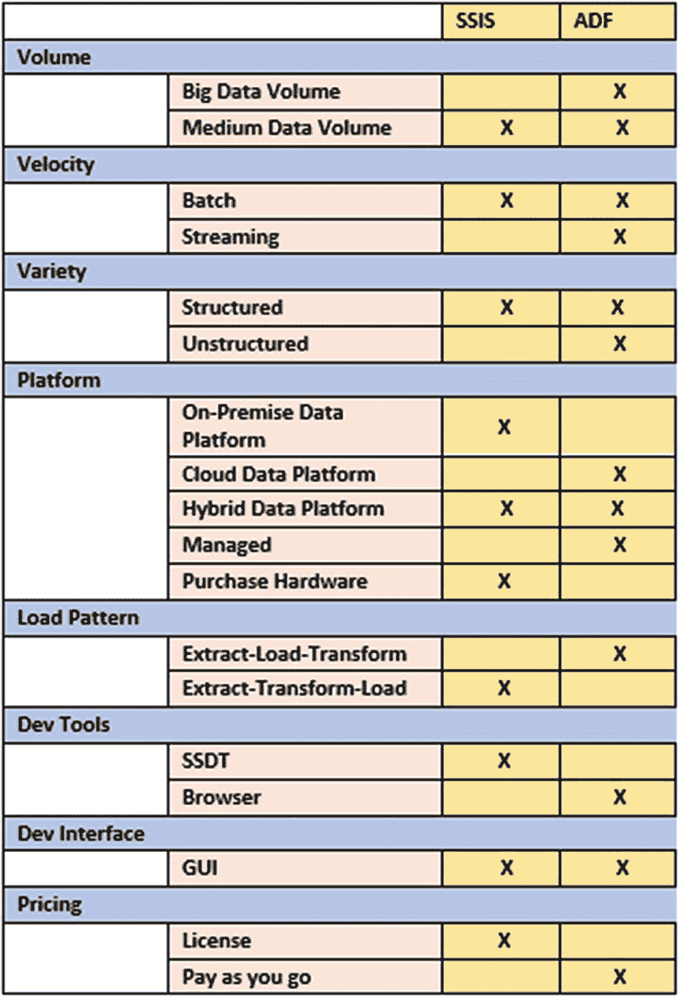
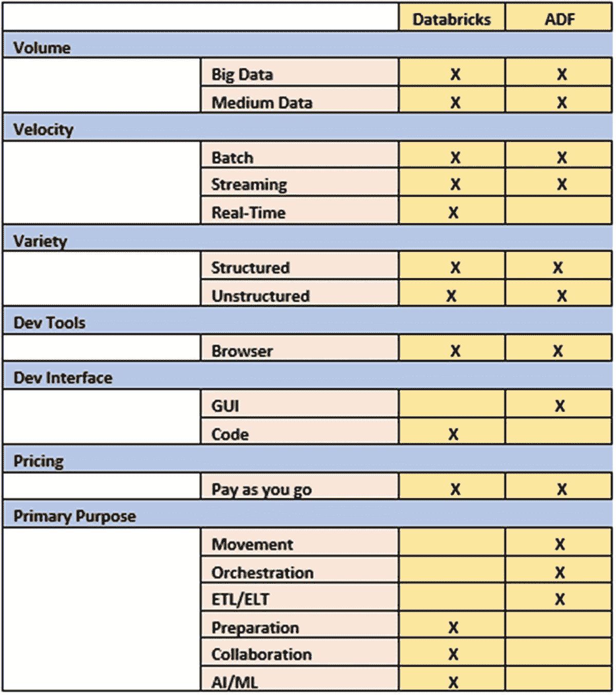

# 二、数据工厂 vs. SSIS vs .DataBricks

基于来自微软不断增长的 Azure 数据工程和集成生态系统的许多数据集成产品，选择正确的 ELT 工具可能是困难的。从数据工程师到数据分析师的技术专业人员都对为工作选择正确的 ELT 工具感兴趣，并且在确定何时为他们的数据集成项目在 Azure Data Factory (ADF)、SQL Server Integration Services(SSIS)和 Azure Databricks 之间进行选择时，经常需要指导。

SSIS 和 ADF 都是健壮的 GUI 驱动的数据集成工具，设计用于 ELT 和 ETL 工作流、管道和操作，具有到多个源和汇的连接器。SSIS 开发托管在 SQL Server 数据工具中，而 ADF 开发是基于浏览器的体验；两者都有强大的调度和监控功能。借助 ADF 的映射数据流，通过聚合、派生列、模糊查找和其他类似于 SSIS 的可视化设计的数据转换来转换数据是一种允许数据工程师以无代码方式构建 ELT 的能力。ADF 的映射数据流和数据块都利用 Spark 集群来转换和处理 Azure 中的大数据和分析工作负载。本章旨在介绍 ADF、SSIS 和 Databricks 之间的相似之处和不同之处，并提供一些指导来帮助您确定如何在这些不同的数据集成服务之间进行选择。

## 选择正确的数据集成工具

当在 Azure Data Factory (ADF)和 SQL Server Integration Services(SSIS)之间为一个新项目做出选择时，了解您的组织是否有 Azure 足迹至关重要，如果有，您的数据集成项目能否在 Azure 中托管？如果答案是肯定的，那么 ADF 是这项工作的完美工具。另一方面，如果出于安全原因或因为已经存在 SSIS 生态系统，新项目必须在内部完成，那么 SSIS 是首选工具。通常，组织通过提升和转移场景获得将 SSIS 与 ADF 相结合的好处，在这些场景中，他们利用 ADF 的基于云的计算服务来调度、运行和执行 SSIS 包。

SSIS 是 SQL Server 的几个版本的一部分，价格从免费(Express 和 Developer editions)到每核约 14K 美元(Enterprise)，SSIS 集成运行时节点在 Azure 上每小时 0.84 美元起。也就是说，当使用 SSIS 运行大数据工作负载时，从价格和性能的角度来看，数据量可能会成为一个问题，因为需要购买硬件并经常维护。

Azure Data Factory V2 公司的现收现付计划起价为每 1000 次协调运行 1 美元，每 1000 次自托管 IR 运行 1.5 美元。对于拥有数百个 SSIS 包的组织来说，ADF 将是一个很好的资源，他们不希望在 ADF 中重写这些包，但希望通过利用 Azure 来降低运营成本、提高高可用性和增加可伸缩性。对于这种情况，混合[将 SSIS 工作负载转移到云](https://docs.microsoft.com/en-us/sql/integration-services/lift-shift/ssis-azure-lift-shift-ssis-packages-overview%253Fview%253Dsql-server-ver15)将是理想的选择。

从数据速度的角度来看，除了计划批处理触发器之外，ADF 本身还支持基于事件和滚动窗口触发器，而 SSIS 本身只支持批处理，能够为接近实时的数据流构建自定义触发器。例如，[为 SQL Server Integration Services 开发一个文件监视器任务](https://www.mssqltips.com/sqlservertip/4668/developing-a-file-watcher-task-for-sql-server-integration-services/)将在处理传入文件之前自动检查它们的目录。

从数据多样性的角度来看，ADF 可以本机连接到 90 多个数据源，从 REST API 到 CRM 系统，再到复杂的 JSON 结构，而 SSIS 更适合结构化数据源，但可以很好地集成到 JSON、REST API 等的第三方或自定义 C#连接器。

从可编程性的角度来看，Azure Data Factory 没有原生编程 SDK，但通过 PowerShell 在没有任何第三方组件的情况下支持自动化，而 SSIS 有编程 SDK，以及通过 BIML 和各种其他第三方组件的自动化。图 [2-1](#Fig1) 列出了 SSIS 和 ADF 的各种异同。

图 2-1

SSIS 和澳大利亚国防军的能力

## 何时使用 Azure Data Factory、Azure Databricks 或同时使用两者

对于大数据项目，Data Factory 和 Databricks 都是基于 Azure 云的数据集成工具，在微软 Azure 的数据生态系统中可用，可以处理大数据、批量/流数据和结构化/非结构化数据。两者都有基于浏览器的界面和现收现付的定价方案。

ADF 的映射数据流使用横向扩展的 Apache Spark 集群，这与 Databricks 的底层架构类似，并且在大数据聚合和转换方面表现相似。值得注意的是，映射数据流目前不支持与本地数据源的连接。此外，ADF 的原始复制活动不使用 Spark 集群，而是自托管集成运行时，并允许连接到本地 SQL 服务器。基于这些连接到本地 SQL 服务器的选项，Databricks 确实具有连接到本地数据源的能力，并且可能在大数据工作负载上优于 ADF，因为它利用了 Spark 集群。

从速度的角度来看，ADF 和 Databricks 都支持批处理和流选项。ADF 本身不支持实时流功能，因此需要 Azure 流分析。Databricks 支持结构化流，这是一个 Apache Spark API，可以处理实时流分析工作负载。

从开发界面的角度来看，ADF 的拖放式 GUI 与 SSIS 非常相似，对于熟悉 SSIS 的无代码界面的开发人员来说，这有助于降低学习难度，并且易于使用。此外，Spark 计算环境中的集群类型、核心和节点可以通过 ADF activity GUI 进行管理，以提供更多处理能力来读取、写入和转换数据。

Databricks 确实需要致力于学习 Spark、Scala、Java、R 或 Python 来进行数据工程和数据科学相关的活动。对于传统的 MS SQL BI 开发人员来说，这相当于一个更高的学习曲线，他们已经在 SSIS ETL 过程中扎根了十多年。对于熟悉和熟悉 Databricks 编程语言的数据工程师和科学家来说，Databricks 提供了一种通过笔记本编写和管理代码的整洁和有组织的方法。

ADF 和 Databricks 之间最后也是最显著的区别与它们的主要用途有关。ADF 在许多方面与 SSIS 相似，主要用于 ETL/ELT、数据移动和编排，而 Databricks 可用于数据工程师、数据科学家等之间的实时数据流和协作，以及支持数据科学家设计和开发 AI 和机器学习模型。

例如，Databricks 的 MLflow 通过在可再现的环境中跟踪多个用户之间的实验运行来简化机器学习生命周期，并管理模型到生产的部署。此外，Databricks 支持各种第三方机器学习工具。在随后的章节中，我们将详细介绍 MLflow 的功能以及 Databricks 的各种其他高级特性。

一旦开发了这些数据块模型，就可以将它们集成到 ADF 的数据块活动中，并链接到复杂的 ADF ETL/ELT 管道中，再加上将参数从 ADF 传递到数据块的无缝体验。此外，可以通过 ADF 安排和监控 Databricks 型号。我们将在以后的章节中探讨这些不同的组合管道和参数传递能力。图 [2-2](#Fig2) 列出了 Databricks 和 ADF 的各种异同。

图 2-2

数据块和 ADF 的功能

## 摘要

在这一章中，我探讨了 ADF、SSIS 和 Databricks 之间的区别和相似之处，并就何时选择其中一个以及何时一起使用它们提出了建议。该解决方案确实取决于许多不同的因素，如性能、成本、偏好、安全性、功能等。在接下来的章节中，我们将结合使用 ADF 和 Databricks 来演示真实的端到端工作流和管道。