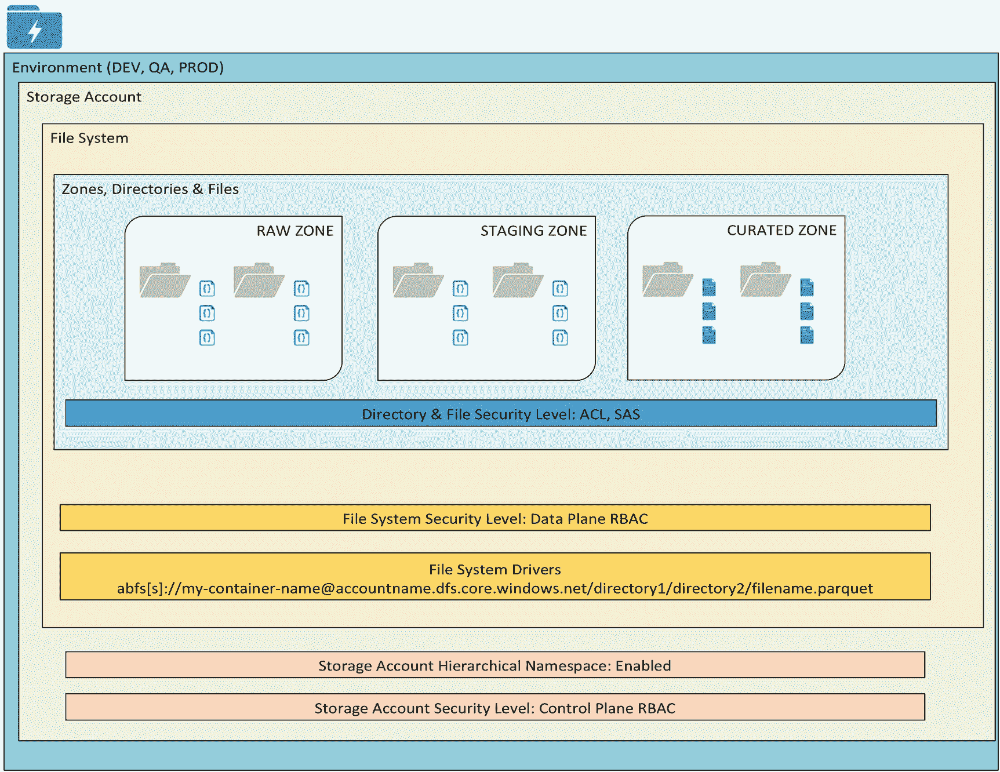
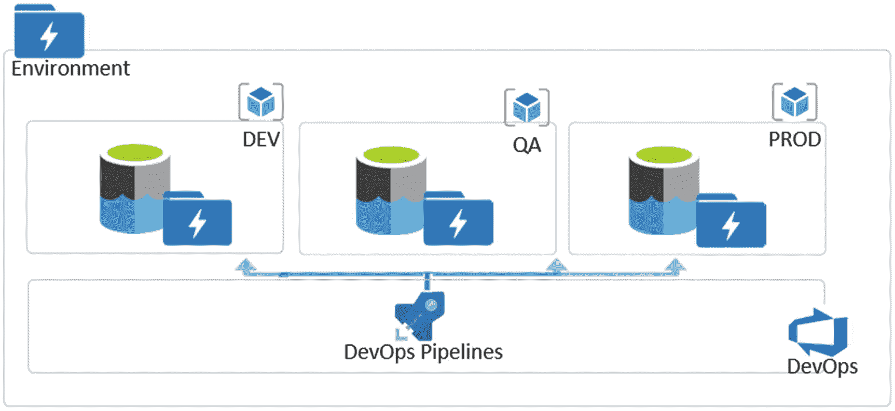
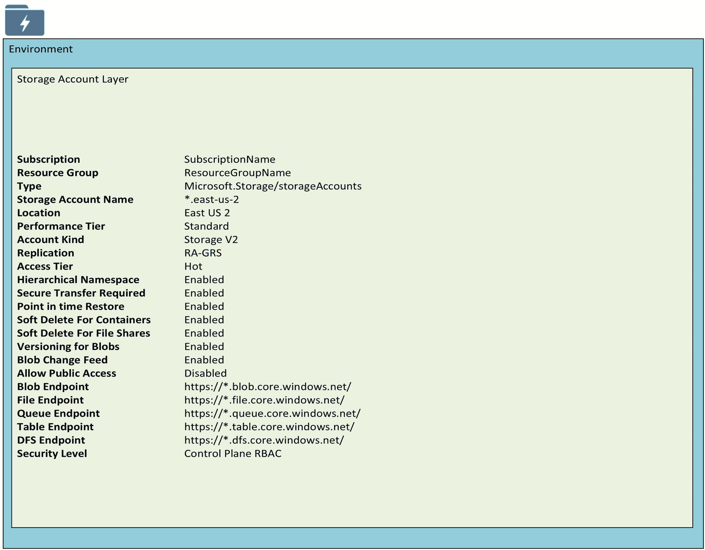
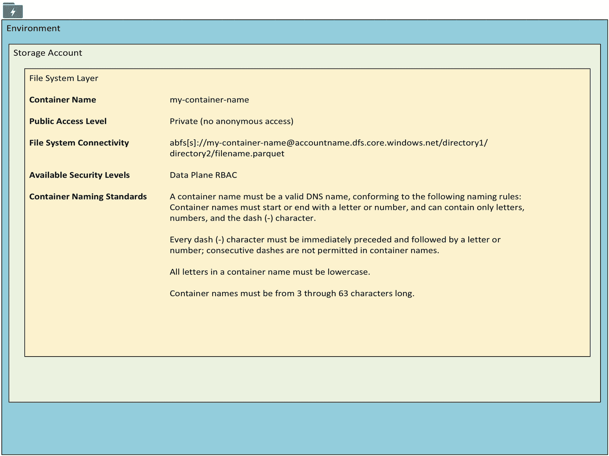
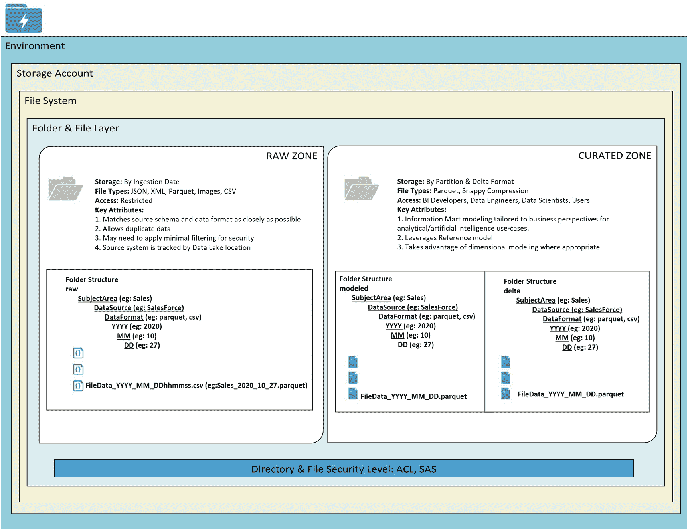
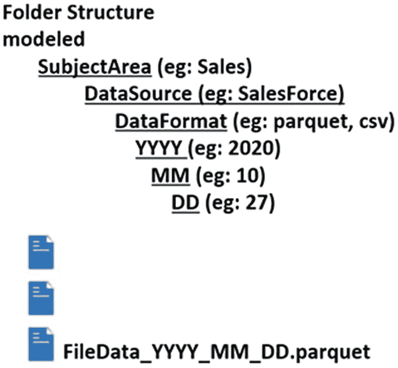

# 3.设计数据湖存储第二代客户

在设计和架构 Azure Data Lake Storage Gen2 帐户时，有各种注意事项需要考虑。这些考虑因素包括安全性、区域、文件夹和文件结构、数据湖层等等。

本章将解释在设计 Azure 数据湖存储 Gen2 帐户时要考虑的各种因素。将涉及的主题包括

*   数据湖图层及其一些属性

*   区域、目录和文件的设计注意事项

*   不同级别的安全选项和注意事项

## 数据湖层

Azure Data Lake Storage Gen2 提供了将存储库划分为多个层的灵活性。这些层有助于轻松地组织、保护和管理数据湖。图 [3-1](#Fig1) 概述了在设计数据湖时可以考虑的数据湖中的各个层。这些层包括

*   环境

*   存储帐户

*   文件系统

*   区域

*   目录

*   文件

后续部分将更详细地讨论这些层。



图 3-1

数据湖中的各种层

### 环境

环境定义了设计数据湖时需要考虑的顶层。例如，如果需要开发、QA 和生产环境，那么这些环境还必须包括一个或多个 ADLS 第二代存储客户。图 [3-2](#Fig2) 描述了如何通过 Azure DevOps 管道来管理和编排这个多环境。



图 3-2

由 DevOps 管道协调的开发、QA、生产环境

### 存储帐户

创建 Azure Data Lake 存储帐户时需要配置几个属性，如图 [3-3](#Fig3) 所示。此外，在设计存储帐户时，考虑存储帐户的限制和容量对于确定是否拥有多个存储帐户至关重要。存储帐户级别的安全性将由控制平面 RBAC(基于角色的访问控制)定义，更多详细信息将在“安全性”部分介绍。



图 3-3

存储帐户图层属性

以下是可在存储帐户级别配置的各种属性:

*   **性能层**:标准存储帐户由磁性驱动器支持，每 GB 成本最低。它们最适合需要大容量存储或不常访问数据的应用。高级存储客户以固态硬盘为后盾，可提供一致的低延迟性能。它们最适合 I/O 密集型应用，如数据库。此外，所有磁盘都使用高级存储的虚拟机符合 99.9%的 SLA，即使在可用性集之外运行也是如此。存储帐户创建后，不能更改此设置。

*   **帐户种类**:通用存储帐户在一个统一的帐户中为 blobs、文件、表和队列提供存储。Blob 存储帐户专门用于存储 blob 数据，并支持选择访问层，这允许您指定访问帐户中数据的频率。选择符合您的存储需求并优化成本的访问层。

*   **复制**:您的 Azure 存储帐户中的数据总是被复制，以确保持久性和高可用性。选择符合您持久性要求的复制策略。存储帐户创建后，某些设置不能更改。

*   **时间点恢复**:使用时间点恢复将一个或多个容器恢复到以前的状态。如果启用了时间点还原，则还必须启用版本控制、更改馈送和 blob 软删除。

*   **容器的软删除**:软删除使您能够恢复先前标记为删除的容器。

*   **文件共享的软删除**:软删除使您能够恢复之前标记为删除的文件共享。

*   **blob 的版本控制**:使用版本控制来自动维护 blob 的先前版本，以便进行恢复和复原。

*   **Blob 更改反馈**:跟踪您帐户中 Blob 的创建和删除更改或修改。

*   **连接方法**:您可以通过公共 IP 地址或服务端点公开连接到您的存储帐户，也可以使用私有端点秘密连接到您的存储帐户。

*   **路由偏好**:微软网络路由将引导您的流量尽快从源头进入微软云。互联网路由将引导你的流量进入更靠近 Azure 端点的微软云。

*   **需要安全传输**:安全传输选项仅允许通过安全连接向存储帐户发送请求，从而增强了存储帐户的安全性。例如，当调用 REST APIs 来访问您的存储帐户时，您必须使用 HTTPS 进行连接。启用“需要安全传输”时，任何使用 HTTP 的请求都将被拒绝。当您使用 Azure 文件服务时，没有加密的连接将失败，包括使用 SMB 2.1、没有加密的 SMB 3.0 以及一些 Linux SMB 客户端的场景。因为 Azure storage 不支持自定义域名的 HTTPS，所以在使用自定义域名时，此选项不适用。

*   **允许公共访问**:启用“允许公共访问”时，允许配置容器 ACL(访问控制列表)以允许匿名访问存储帐户内的 blobs。禁用后，无论底层 ACL 配置如何，都不允许匿名访问存储帐户中的 blobs。

*   **分层命名空间**:ADLS 第二代分层命名空间加速了大数据分析工作负载，并支持文件级访问控制列表(ACL)。

### 文件系统

文件系统也称为容器，包含用于日志和数据的分层文件系统。图 [3-4](#Fig4) 显示了可以配置的容器级属性。数据平面 RBAC 安全级别将在“安全”一节中详细讨论。



图 3-4

文件系统属性

可以在容器级别配置以下属性:

*   **公开访问级别**:指定容器中的数据是否可以公开访问。默认情况下，容器数据是帐户所有者的私有数据。使用“Blob”允许对 Blob 的公共读取访问。使用“容器”允许对整个容器的公共读取和列表访问。

*   **不可变策略**:不可变存储提供了以一写多读(WORM)状态存储数据的能力。一旦数据被写入，数据将变得不可擦除和不可修改，并且您可以设置一个保留期，以便在该期限过去之前不能删除文件。此外，可以对数据进行合法保留，以使数据不可擦除和不可修改，直到保留被移除。

*   **存储访问策略**:建立存储访问策略用于对共享访问签名进行分组，并为受策略约束的签名提供附加限制。您可以使用存储的访问策略来更改签名的开始时间、到期时间或权限，或者在签名发布后撤销它。

### 区域、目录和文件

在文件夹和文件层，存储帐户的容器定义区域、目录和文件，类似于图 [3-5](#Fig5) 中的图示。目录和文件层的安全级别包括 ACL 和 SAS。这些安全级别将在“安全”一节中介绍。



图 3-5

文件夹和文件级区域、目录和结构

#### 区域

区域定义了数据湖容器中的根级文件夹层次结构。区域可以由存储帐户中的多个容器或容器中的多个文件夹来定义。表 [3-1](#Tab1) 中的以下示例区域描述了它们的用途和典型用户群。

区域不需要总是驻留在同一个物理数据湖中，也可以作为单独的文件系统或不同的存储帐户驻留，甚至可以驻留在不同的订阅中。如果预计单个区域中的大吞吐量需求超过每秒 20，000 的请求速率，那么不同订阅中的多个存储帐户可能是一个好主意。

表 3-1

数据湖区域、访问和描述

<colgroup><col class="tcol1 align-left"> <col class="tcol2 align-left"> <col class="tcol3 align-left"></colgroup> 
| 

区域

 | 

接近

 | 

描述

 |
| --- | --- | --- |
| 生的 | 服务帐户(只读) | 没有转换；原始格式；按摄入日期储存 |
| 脚手架 | 科学家、工程师 | 一般分期；增量准备 |
| 当（博物馆、美术馆、图书馆）馆长 | 分析师、科学家、工程师 | 数据市场；数据湖标准 |
| 敏感的 | 选择性访问 | 需要提升和选择性访问的敏感数据 |
| 实验室 | 科学家、工程师 | 探索性分析；沙盒区域 |
| 瞬态/温度 | 服务帐户 | 支持数据摄取的临时区域。此区域的一个使用情形是，如果您要跨网络移动大量压缩数据，您可能希望解压缩此区域中的数据。数据应该是短暂的，因此被称为瞬态的。 |
| 主/参考 | 分析师、科学家、工程师 | 参考数据；存档数据 |

#### 目录(文件夹)

设计数据湖文件夹结构时，图 [3-6](#Fig6) 中的层次结构针对分析查询进行了优化。每个源系统将被授予数据源文件夹级别的写权限，并指定默认 ACL。这将确保在创建新的日常文件夹和文件时继承权限。



图 3-6

样本数据湖文件夹结构

图 [3-6](#Fig6) 中所示的分层文件夹格式可以动态参数化并编码到数据块或数据工厂中的 ETL 解决方案中，以根据定义的层次自动创建文件夹和文件。以下代码片段定义了图 [3-6](#Fig6) 中相同的文件夹结构，并且可以添加到 ADF 管道的配置中。我将在以后的章节中更详细地讨论这一点:

```
\Raw\DataSource\Entity\YYYY\MM\DD\File.extension

```

原始层中的敏感子区域可以由顶层文件夹分隔。这将允许您定义单独的生命周期管理策略。以下代码通过在原始区域中引入子区域来进一步对数据源进行分类，展示了先前文件夹结构的变体:

```
\Raw\General\DataSource\Entity\YYYY\MM\DD\File.extension
\Raw\Sensitive\DataSource\Entity\YYYY\MM\DD\File.extension

```

#### 文件

Azure Data Lake Storage Gen2 针对基于 Spark 的处理进行了优化，可以更好地处理每个文件大约 65mb-1gb 的较大文件。Azure 数据工厂压缩作业可以帮助实现这一点。此外，Databricks Delta 格式的优化或自动优化功能有助于实现这种压缩。借助事件中心，[捕获特性](https://docs.microsoft.com/en-us/azure/event-hubs/event-hubs-capture-overview)可用于根据大小或定时触发来保存数据。

对于需要读取优化的高性能分析的策划或建模区域，Parquet 和 Databricks Delta 等列格式将是利用谓词下推和列修剪来节省时间和成本的理想选择。

表 [3-2](#Tab2) 捕获了一些样本文件类型及其功能和大概的压缩率。

表 3-2

数据湖文件类型、功能和压缩率

<colgroup><col class="tcol1 align-left"> <col class="tcol2 align-left"> <col class="tcol3 align-left"></colgroup> 
| 

样本文件类型

 | 

能力

 | 

压缩比

 |
| --- | --- | --- |
| 欧罗欧欧欧罗欧欧欧欧欧欧欧欧欧欧欧欧欧欧欧欧欧欧欧欧欧欧欧欧欧欧欧欧欧欧欧欧欧 | 可压缩；可拆分的；将架构存储在文件中；适用于非结构化和模式差异数据 | ~91.24% |
| 镶木地板 | 分栏格式；可压缩的 | ~97.5% |
| CSV/文本 | 几乎在每个组织中都普遍使用；容易解析；通常是批量处理的良好用例；根据使用情况，并不总是 Spark 的最佳选择 |   |

表 [3-3](#Tab3) 列出了一些示例压缩类型及其功能和示例用途。

表 3-3

数据湖压缩类型、功能和示例用途

<colgroup><col class="tcol1 align-left"> <col class="tcol2 align-left"> <col class="tcol3 align-left"></colgroup> 
| 

压缩类型

 | 

能力

 | 

样本使用

 |
| --- | --- | --- |
| Bzip2 | 高压缩；低速；适用于存档目的，而不是 HDFS 查询 | 归档用例；对于某些文件类型，比 Gzip 压缩得更好 |
| Gzip | 中压缩；中速 | 不经常访问的 Avro/Parquet 格式的冷数据 |
| 机场 | 高速；较低的压缩；适用于文本文件 | 经常被访问的文本格式的热数据 |
| 时髦的 | 高速；低压缩 | 经常访问的 Avro/Parquet 格式的热数据 |

## 安全

保护数据是设计数据湖的一个重要组成部分。在您的数据湖中可以配置许多权限和控制。以下部分描述了设计数据湖时必须考虑的安全特性。

### 控制平面权限

控制平面基于角色的访问控制(RBAC)权限旨在仅在 Azure 资源级别授予安全主体权限，不包括任何数据操作。授予用户“读取者”角色不会授予对存储帐户数据的访问权限，因为需要额外的 ACL 或数据平面 RBAC 权限。一种好的做法是将控制平面 RBAC 与文件夹/文件级 ACL 结合使用。

### 数据平面权限

为安全主体处理数据平面 RBAC 权限时，所有其他 ACL 都将被忽略，并且将阻止对文件和文件夹分配权限。

数据平面 RBAC 权限可以应用到低至存储帐户级别。

可以分配的内置数据平面 RBAC 角色列表包括:

*   **存储 Blob 数据所有者:**用于为 Azure Data Lake 存储 Gen2 设置所有权和管理 POSIX 访问控制。

*   **存储 Blob 数据贡献者:**用于授予对 Blob 存储资源的读/写/删除权限。

*   **存储 Blob 数据读取器:**用于授予对 Blob 存储资源的只读权限。

*   **存储队列数据贡献者:**用于向 Azure 队列授予读/写/删除权限。

*   **存储队列数据读取器:**用于向 Azure 队列授予只读权限。

*   **存储队列数据消息处理器:**用于授予查看、检索和删除 Azure 存储队列中消息的权限。

*   **存储队列数据消息发送方:**用于向 Azure 存储队列中的消息授予添加权限。

### 类似 POSIX 的访问控制列表

ADLS 第二代中的文件和文件夹级访问由 ACL 授予。无论 ACL 权限如何，控制平面 RBAC 权限都需要与 ACL 结合使用。作为最佳做法，建议在存储帐户/容器级别为安全主体分配一个 RBAC 读者角色，然后在文件和文件夹级别继续执行限制性和选择性 ACL。

这两种类型的 ACL 包括**访问 ACL**，它控制对文件或文件夹的访问，以及**默认 ACL**，它由子文件或文件夹中分配的访问 ACL 继承。

### 共享访问签名

共享访问签名(SAS)支持有限的访问能力，例如用户对容器的读、写或更新。此外，可以应用时间盒来确定签名何时有效。这允许临时访问您的存储帐户，并方便地管理组织内外用户的不同访问级别。

### 数据加密

数据在移动和静止时都是安全的，ADLS Gen2 自动管理数据加密、数据解密和数据放置。ADLS Gen2 还提供了允许数据湖管理员管理加密的功能。

Azure Data Lake 使用存储在 Azure 密钥库中的主加密密钥来加密和解密数据。用户管理的密钥提供了额外的控制和灵活性，但是除非有令人信服的原因，否则建议将加密留给数据湖服务来管理。

### 网络传输

配置网络规则后，只有通过指定网络集请求数据的应用才能访问存储帐户。对您的存储帐户的访问可以限制为来自指定 IP 地址或 IP 范围的请求，或者来自 Azure 虚拟网络(VNet)中的子网列表的请求。

可以为您的存储帐户创建一个专用端点，该端点将您的虚拟网络中的专用 IP 地址分配给存储帐户，并保护虚拟网络和存储帐户之间通过专用链路的所有流量。

## 摘要

在本章中，我介绍了如何设计、实现和保护 Azure Data Lake Storage Gen2 帐户。随着我们在后续章节中开始探索 Azure Data Factory 和 Databricks ELT 模式，对如何实现和保护您的数据湖有了这样的理解和基线，将在我们读取和/或写入数据湖时提供有用的考虑。