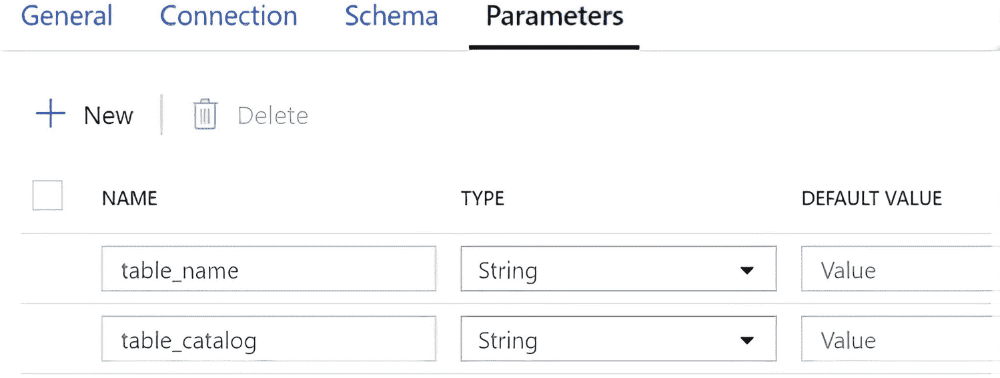
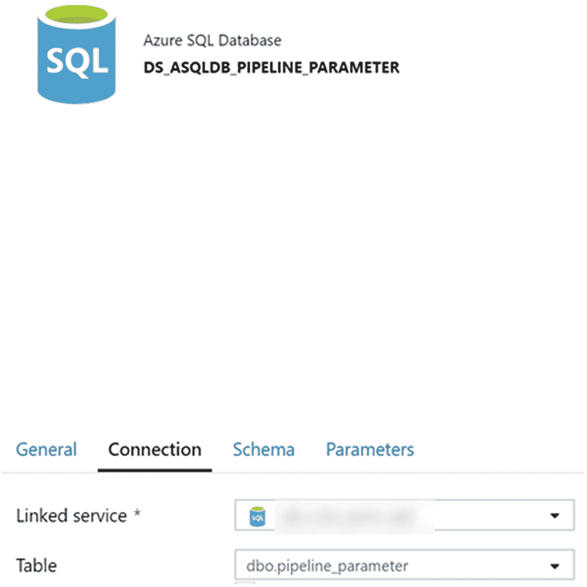
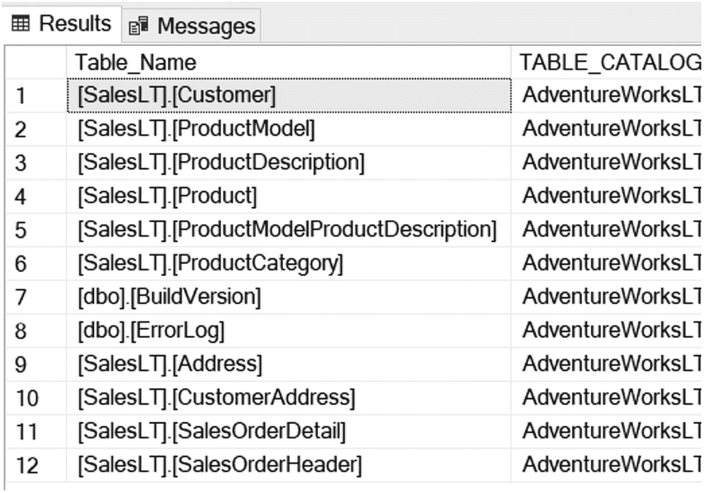
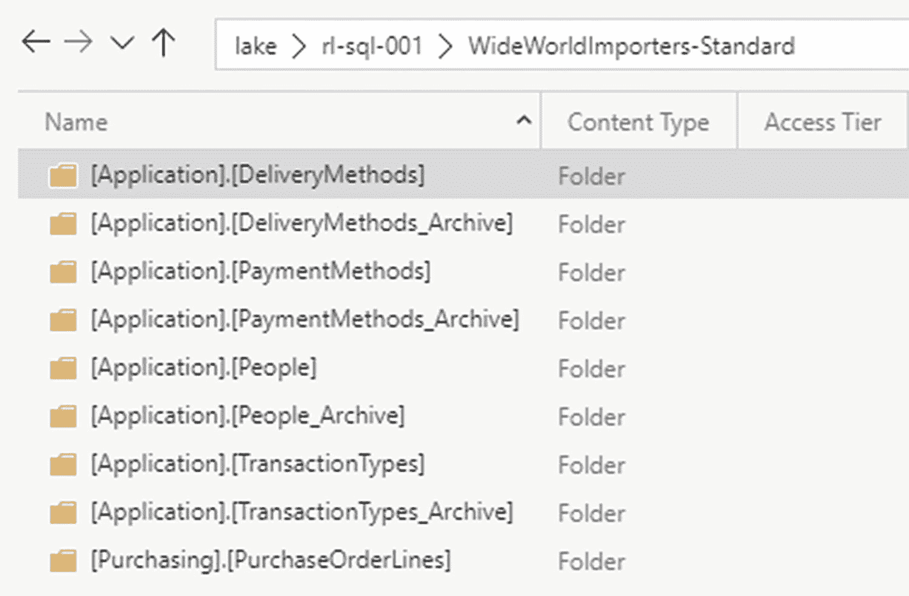

# 4.将 SQL 数据库动态加载到数据湖存储 Gen2

将数据从内部 SQL Server 或 Azure SQL Server 移动到 Azure 数据湖存储的过程已经成为许多企业日益增长的重要需求。拥有大量内部 SQL 服务器以及这些服务器中数百个数据库的客户有兴趣利用 Azure 的数据服务来构建 ELT 和/或 ETL 流程，以便在结构化、分区和可重复的流程中为其 SQL Server 生态系统中的一个或多个服务器完全加载其 Azure 数据湖存储帐户和内部 SQL Server 数据库和表。获取本地关系数据，将它们放入数据湖中的文件，然后使用分布式和多云计算技术(如 Databricks ),这是一种流行的现代架构模式。这种模式通过引入 AI 和 ML 等高级分析功能，使客户能够提高他们在 Azure 云之旅中的成熟度级别，这些功能在他们现有的内部环境中无法轻松实现。

Azure Data Factory 已经成为许多使用 Azure 数据平台的数据工程师选择的重要 ELT 和 ETL 工具。在 ADF 管道中利用动态 SQL 和参数的能力允许无缝的数据工程和可伸缩性。在本章中，您将通过一个实际练习来了解这一过程，即创建一个端到端的数据工厂管道，通过几个利用动态参数的管道将所有本地 SQL Server 对象(包括数据库和表)移动到 Azure Data Lake Storage Gen2。

## Azure 必备资源

在第 [3](03.html) 章中，我讨论了如何设计和实现 Azure 数据湖存储 Gen2 账户。本章将基于这些知识，使用数据湖作为最终需要加载到 Azure SQL 数据库中的 transit parquet 文件的目标目的地(sink)。

Parquet 是 Hadoop 生态系统中提供的一种文件格式，与基于行的文件(如 CSV 或 TSV 文件)相比，它旨在提供高性能、高效率的数据平面列存储格式。

Parquet 没有使用简单的嵌套名称空间展平，而是使用记录分解和组装算法。Parquet 具有不同的高效数据压缩方式和编码类型，并针对批量处理复杂数据进行了优化。这种方法最适合需要从大型表中读取某些列的查询。Parquet 只能读取需要的列，这样可以最小化 I/O。

图 [4-1](#Fig1) 展示了从源 SQL 数据库(Azure 或内部部署)到数据湖的数据流架构。此外，图 [4-1](#Fig1) 中也描述了所需的部件。


图 4-1

SQL 数据库到数据湖存储第二代体系结构图

在设计和实现图 [4-1](#Fig1) 中的架构时，将需要以下 Azure 资源列表。微软提供了许多教程、演示和资源，描述如何通过 Azure 门户 UI 或代码创建这些资源。通读以下列表，了解图 [4-1](#Fig1) 中列出的每个组件的用途，并在本章构建 ADF 管道之前在您的 Azure 订阅中创建它们:

*   **Azure Data Lake Storage Gen2** :数据将存储在 Azure Data Lake Storage gen 2(ADLS gen 2)中。为此，你需要[创建一个 Azure Data Lake Storage Gen2 存储帐户。创建此帐户时，请记住应用第 3 章中的知识，并确保在帐户创建设置中启用“分层名称空间”，以便创建第二代帐户](https://docs.microsoft.com/en-us/azure/storage/common/storage-account-create%253Ftabs%253Dazure-portal)。

*   Azure Data Factory V2:Azure Data Factory(ADF)将被用作 ETL 编排工具，因此您可以[使用 Azure Data Factory UI 创建数据工厂。](https://docs.microsoft.com/en-us/azure/data-factory/quickstart-create-data-factory-portal)

*   **Azure Data Factory 自托管 IR** :如果您决定使用本地 SQL Server，那么自托管 IR 将在本地资源和 Azure 服务之间创建一个链接，并允许您连接到 ADF 中的本地数据。还需要注意的是，将托管自托管 IR 的本地机器必须安装有[64 位 Java 运行时环境(JRE)来创建 parquet 文件](https://docs.microsoft.com/en-us/azure/data-factory/format-parquet)。

*   **本地 SQL Server 或 Azure SQL 数据库**:在本练习中，为了简单起见，源数据可以存储在本地 SQL Server 或 Azure SQL 数据库中，并演示端到端架构流程。您可以随时[在本地或云中试用 SQL Server](https://www.microsoft.com/en-us/sql-server/sql-server-downloads)以获得 SQL Server 的开发版、快速版或试用版。

*   **Azure SQL 数据库(标准)**:最后，使用 Azure SQL 数据库(ASQLDB)来存放 ADF 管道参数值、控制和日志表。此外，这个 Azure SQL 数据库也可以用作这个练习的源。在为此流程创建 Azure SQL 数据库时，记得将您的客户端 IP 地址授予 SQL Server 的防火墙规则。此外，请记住允许 Azure 服务和资源访问此服务器。

## 准备并验证 SQL Server 数据库对象

通过将示例 SQL 数据库导入 Azure SQL 数据库来准备流程。[有许多免费的 SQL Server 数据库示例版本可供下载](https://github.com/microsoft/sql-server-samples/tree/master/samples/databases)，如 AdventureWorks 或 WideWorldImporters 示例数据库( [`https://github.com/microsoft/sql-server-samples/tree/master/samples/databases`](https://github.com/microsoft/sql-server-samples/tree/master/samples/databases) `)` *)。*添加示例数据库后，导航到 SQL Server Management Studio (SSMS)并连接到包含两个 OLTP SQL 数据库的本地 SQL Server(或 Azure SQL 数据库)，如图 [4-2](#Fig2) 所示。


图 4-2

OLTP 源数据库的 SSMS 视图

图 [4-3](#Fig3) 展开了 WideWorldImporters 数据库中的详细信息，以验证两个数据库中都有表。


图 4-3

源 WideWorldImporters 数据库中的表列表

同样，图 [4-4](#Fig4) 扩展了 AdventureWorksLT 数据库中的详细信息，以验证两个数据库中都有表。


图 4-4

源 AdventureWorksLT 数据库中的表列表

## 准备并验证 Azure SQL 数据库对象

接下来，创建一个名为 ADF_DB 的 Azure SQL 数据库以及一个表来存储表名、目录名和进程标志，这将在运行时驱动管道配置。该表也称为控制表。以下代码可用于创建元数据驱动的 ELT 流程所需的基表:

```
USE [ADF_DB]

go

SET ansi_nulls ON

go

SET quoted_identifier ON

go

CREATE TABLE [dbo].[pipeline_parameter1]
  (
     [parameter_id]  [INT] IDENTITY(1, 1) NOT NULL,
     [table_name]    [NVARCHAR](500) NULL,
     [table_catalog] [NVARCHAR](500) NULL,
     [process_type]  [NVARCHAR](500) NULL,
     PRIMARY KEY CLUSTERED ( [parameter_id] ASC )WITH (pad_index = OFF,
     statistics_norecompute = OFF, ignore_dup_key = OFF, allow_row_locks = on,
     allow_page_locks = on, optimize_for_sequential_key = OFF) ON [PRIMARY]
  )
ON [PRIMARY]

go

```

图 [4-5](#Fig5) 显示了创建数据库和表后，这些数据库对象在 SSMS 中的外观。


图 4-5

SSMS ADF _ DB 数据库和表格视图

## 准备 Azure 数据湖存储 Gen2 容器

还需要一个用于根级别层次结构的 ADLS Gen2 容器和文件夹，它将位于服务器级别。因此，根文件夹将是服务器的名称，如图 [4-6](#Fig6) 所示。


图 4-6

Azure 数据湖容器和根文件夹

图 [4-7](#Fig7) 确认服务器级文件夹中没有现有数据。


图 4-7

深入根文件夹以确认不存在任何数据。

## 创建 Azure 数据工厂管道资源

此时，通过导航到 Azure 数据工厂资源并单击 Author & Monitor，开始创建 Azure 数据工厂管道，如图 [4-8](#Fig8) 所示。


图 4-8

Azure 数据工厂管道创建的作者和监控者

一旦 Azure 数据工厂画布加载，点击“创建管道”，如图 [4-9](#Fig9) 所示，将创建一个新的管道和空白画布。


图 4-9

创建 Azure 数据工厂管道。

### 创建自托管集成运行时

如果您将本地服务器链接到 ADF，那么您将需要创建一个自托管集成运行时`(` [`https://docs.microsoft.com/en-us/azure/data-factory/create-self-hosted-integration-runtime`](https://docs.microsoft.com/en-us/azure/data-factory/create-self-hosted-integration-runtime) )。

自托管集成运行时可以在云数据存储和私有网络中的数据存储之间运行复制活动。它还可以针对内部网络或 Azure 虚拟网络中的计算资源分派转换活动。自托管集成运行时的安装需要一台本地机器或私有网络中的一台虚拟机。

创建自托管 IR 后，验证其是否处于“运行”状态，如图 [4-10](#Fig10) 所示。自托管集成运行时可以在云数据存储和私有网络中的数据存储之间运行复制活动。


图 4-10

自承载集成运行时处于运行状态

### 创建链接服务

创建自托管 IR 后，可以创建所有需要的链接服务，包括 SQL Server、Azure SQL 数据库和 Azure Data Lake Storage Gen2，如图 [4-11](#Fig11) 所示。


图 4-11

已创建的链接服务

### 创建数据集

ADF 管道将需要三个数据集，如图 [4-12](#Fig12) 所示。第一个 DS_ADLS2 数据集将连接到接收器 Azure 数据湖存储 Gen2 帐户。第二个 DS_ASQLDB_PIPELINE_PARAMETER 数据集将连接到 ADF_DB 中的`pipeline_parameter`表。最后，第三个 DS_SQLSERVER 数据集将是到源 SQLSERVER 数据库的连接。


图 4-12

已经创建的数据集

#### S7-1200 可编程控制器

接下来，将 ADLS 第二代数据集配置为拼花格式，如图 [4-13](#Fig13) 所示。此外，图中是参数化的文件路径连接，允许我们通过“文件路径”部分中列出的`YY-MM-DD-HH`对数据进行分区。下页也提供了该代码。还要记住将压缩类型设置为“snappy ”,以提高性能。请忽略黄色警告图标，因为这种图标经常出现在动态和参数化的内容中，尤其是当字符串可能比预期的要长时。


图 4-13

ADLS2 数据集连接属性

作为参考，图 [4-13](#Fig13) 中的 ADLS 第二代数据集连接属性使用了以下代码。

```
@concat('rl-sql001/',dataset().table_catalog)

@{item().Table_Name}/@{formatDateTime(utcnow(),'yyyy')}/@{formatDateTime(utcnow(),'MM')}/@{formatDateTime(utcnow(),'dd')}/@{item().Table_Name}@{formatDateTime(utcnow(),'HH')}

```

ADF 允许您解释字符串中的表达式，以便轻松地将计算、参数和字段值作为字符串的一部分。现在，通过字符串插值，您可以使用类似这些示例的表达式生成超级简单的字符串求值。ADF 管道中实现的许多代码都使用字符串插值。

在该数据集中，添加图 [4-14](#Fig14) 所示的参数，这些参数将在稍后阶段使用。



图 4-14

需要 ADLS2 参数

#### DS_SQLSERVER

接下来，将数据集连接添加到本地 SQL Server。同样将表设置为“None ”,以允许遍历 SQL Server 中的所有表，如图 [4-15](#Fig15) 所示。


图 4-15

SQL Server 连接属性

#### DS _ ASQLDB _ 管道参数

最终的数据集将连接到 Azure SQL 数据库中的`pipeline_parameter`表，如图 [4-16](#Fig16) 所示。这就完成了继续创建管道所需的所有数据集。



图 4-16

Azure SQL 数据库连接属性

## 创建 Azure 数据工厂管道

既然已经创建了数据集，那么是时候创建 ADF 管道来将数据移动到湖中了。该管道将利用到内部网络的自托管 IR 连接来转换 SQL 数据库表，并将它们作为 parquet 文件动态加载到数据湖中。此外，此管道将使用 ADF_DB，它是在本章的上一节中创建的。

### p _ 插入 _ 基本 _ 表格 _ 信息

P_Insert_Base_Table_Info 管道将查询本地`information_Schema.tables`作为其来源，以获取表和数据库名称，然后将结果输出到 Azure SQL 数据库中的基本参数表。这个过程的目的是填充`pipeline_parameter`表，通过它的元数据字段驱动其余的管道。

要创建此管道，请向管道画布添加一个复制活动，如图 [4-17](#Fig17) 所示，并将源设置为本地 SQL Server 数据集。还要添加本节中包含的查询代码作为源代码。该查询将查询指定的数据库，并列出可在其余过程中使用的表。现在，为每个需要加载和执行管道的数据库手动更改数据库名称。图 [4-17](#Fig17) 显示了该代码块在复制活动中的位置。


图 4-17

ADF 复制活动中的源查询

以下是添加到图 [4-17](#Fig17) 中查询部分的 SQL 查询:

```
USE adventureworkslt

SELECT Quotename(table_schema) + '.'
       + Quotename(table_name) AS Table_Name,
       table_catalog
FROM   information_schema.tables
WHERE  table_type = 'BASE TABLE'

```

尽管出于本练习的目的，我们手动将代码粘贴到 ADF 中的 source query 部分，但作为产品开发和部署的最佳实践，我建议在 SQL 数据库环境中创建存储过程，然后在 ADF 源代码中将它们作为存储过程而不是硬编码查询来调用。这将有助于简化代码的维护和管理。此外，在添加活动和设计 ADF 管道时，一定要正确、合理地命名 ADF 活动、管道和数据集。

作为命名 ADF 管道、活动和数据集的最佳实践，我建议遵循表 [4-1](#Tab1) 中列出的命名约定。

表 4-1

Azure 数据工厂命名约定

<colgroup><col class="tcol1 align-left"> <col class="tcol2 align-left"></colgroup> 
| 管道 | PL_ |
| 映射数据流 | MDF_ |
| 复制活动 | C_ |
| 链接服务 | LS_ |
| 资料组 | DS_ |
| ForEach 循环 | FE_ |
| 检查 | L_ |
| 存储过程 | SP_ |

现在您已经配置了源，是时候通过切换到 sink 选项卡并选择您在上一节中配置的`pipeline_parameter`数据集来设置 Sink 了，如图 [4-18](#Fig18) 所示。


图 4-18

接收器数据集属性

最后，确保源到目的地的映射是准确的，如图 [4-19](#Fig19) 所示。通常，源和目标之间的一对一命名约定会自动映射，您也可以手动改变这种映射。


图 4-19

ADF 管道源到目标的映射

产生的`pipeline_parameter` Azure SQL 表应该看起来类似于图 [4-20](#Fig20) 中所示的插图。



图 4-20

ADF 管道参数表

### P_SQL_to_ADLS

在下一部分中，我们的目标是创建 SQL Server 到 ADLS Gen2 数据编排管道。将 Lookup 和 ForEach 活动添加到管道画布中，如图 [4-21](#Fig21) 所示。


图 4-21

ADF 管道查找和 ForEach 活动

查找活动只是查找先前管道中填充的管道参数表，如图 [4-22](#Fig22) 所示的设置。


图 4-22

查找活动的 ADF 管道设置

接下来，在 ForEach 活动的设置中，确保将“Items”设置为以下内容:

```
@activity('Get-Tables').output.value

```

此外，确保“顺序”保持未选中状态，以便表可以并行执行。目前，ForEach 活动支持最多 50 个批次的顺序批次计数，留空时默认批次计数为 20，如图 [4-23](#Fig23) 所示。


图 4-23

ForEach 活动的 ADF 管道设置

此外，在 ForEach 活动的“活动”选项卡中，添加一个复制活动。点击【编辑活动】查看详细信息，如图 [4-24](#Fig24) 所示。


图 4-24

ForEach 活动的 ADF 管道活动

源数据集是如图 [4-25](#Fig25) 所示的本地 SQL 服务器。


图 4-25

复制活动的 ADF 管道源和查询

此外，使用下面的动态源查询，它将查找`Table_Catalog`和`Table_Name`:

```
USE @{item().Table_Catalog} SELECT * FROM @{item().Table_Name}

```

您的接收器数据集将是指定的 ADLS Gen2 帐户容器和文件夹结构，在本章的上一节中已创建为 DS_ADLS2。另外在创建 DS_ADLS2 数据集时已经配置好的数据集属性中添加`@{item().Table_Name}`和`@{item().Table_Catalog}`，如图 [4-26](#Fig26) 所示。


图 4-26

ADF 管道接收器数据集属性

这个管道现在已经完成，可以运行了。

## 运行数据工厂管道并验证 Azure 数据湖存储 Gen2 对象

运行 ADF 管道，从图 [4-27](#Fig27) 中可以看到，已经为两个数据库创建了两个数据库级文件夹。


图 4-27

ADLS2 数据库级文件夹

还要注意，在您的 ADLS Gen2 帐户中已经创建了适当的表格级文件夹，如图 [4-28](#Fig28) 所示。



图 4-28

ADLS2 表级文件夹

此外，在钻取文件夹时，请注意图 [4-29](#Fig29) 中的文件夹被适当地进行了时间分区，并且已经创建了 Parquet 格式的表格级文件。


图 4-29

ADLS 第二代实木复合地板文件

## 摘要

在这一章中，我介绍了 Azure Data Factory 及其在现代基于云的 ETL 环境中的作用，它是许多使用 Azure 数据平台的数据工程师的首选工具。我还演示了一个实际的例子，说明如何创建一个端到端的数据工厂管道，用几个利用动态参数的管道将所有本地 SQL Server 对象(包括数据库和表)移动到 Azure Data Lake Storage Gen2。

这个练习展示了 ADF 为大容量、高速度和多种多样的数据接收构建动态的、元数据驱动的 ELT 管道的能力。这些管道可以将数据从各种源系统(包括内部数据库)移动到 ADLS Gen2 和其他低成本存储帐户，以进行进一步处理、清理、转换、探索和高级分析使用案例。