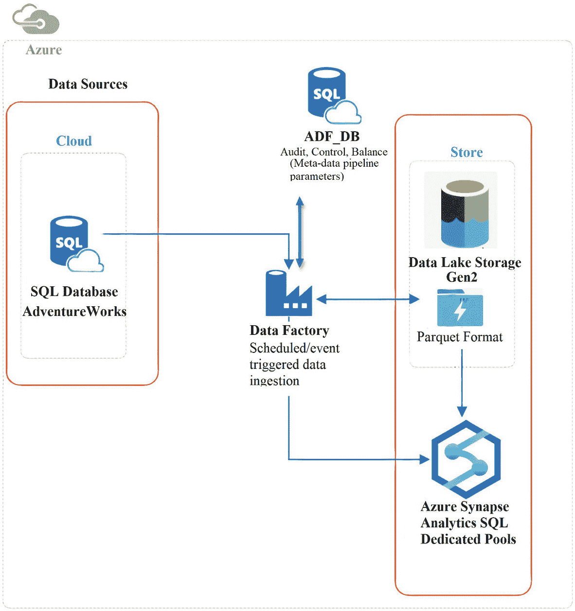
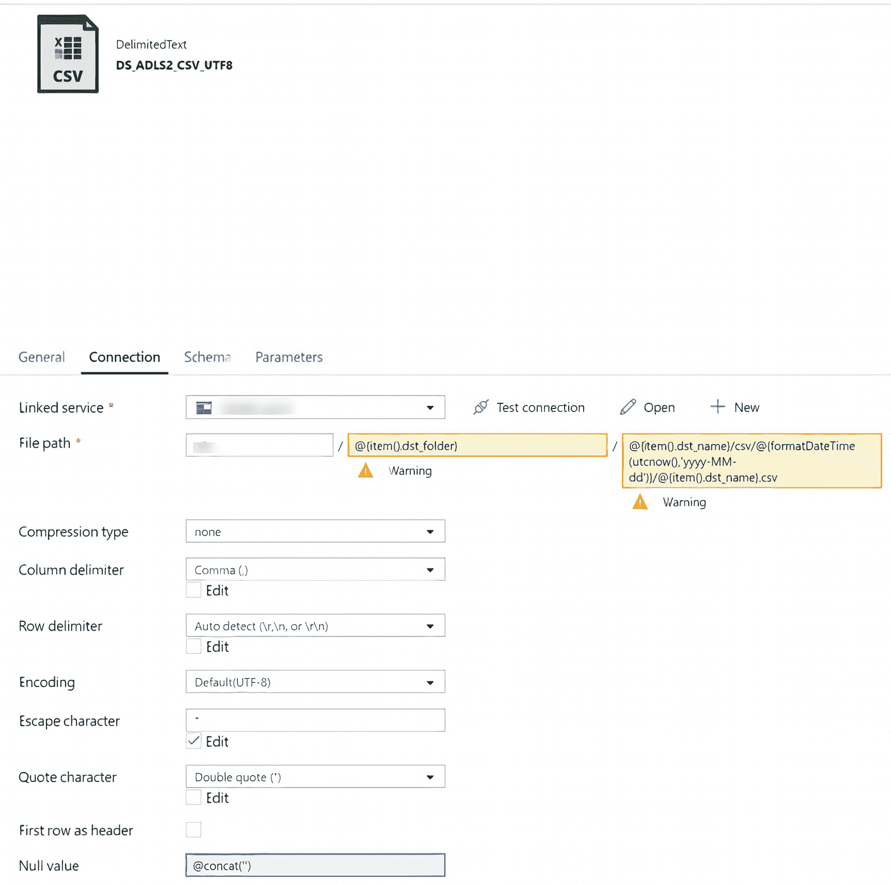
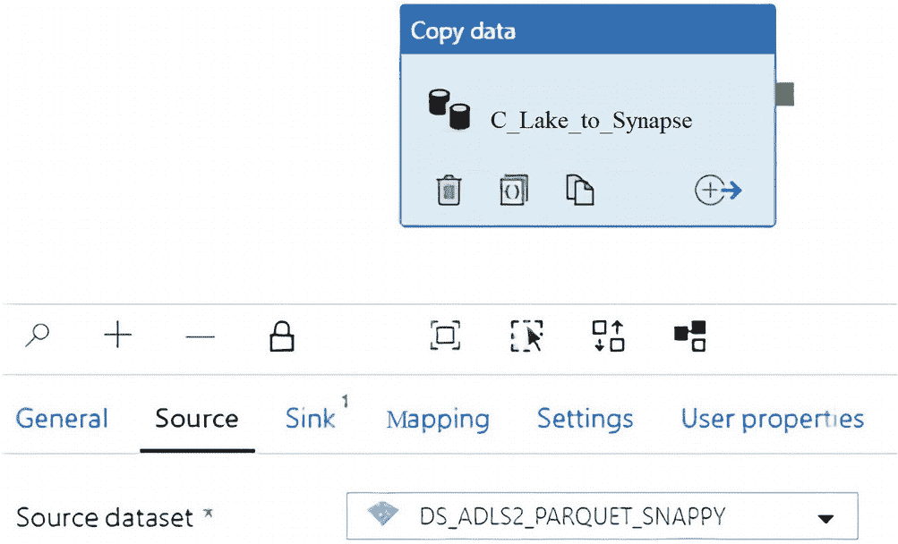
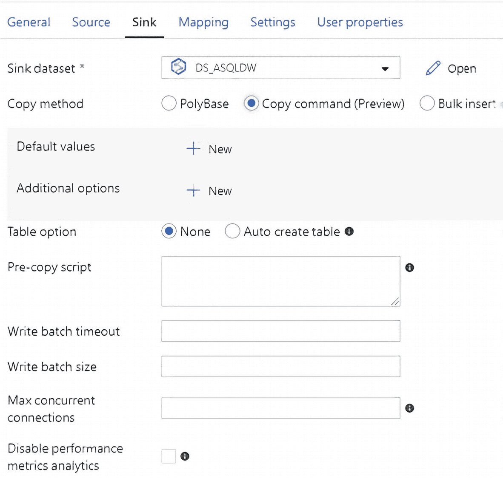

# 5.使用复制到加载 Synapse Analytics 专用 SQL 池

在第 [4](04.html) 章中，我向您展示了如何将 snappy 压缩的 parquet 文件从本地 SQL Server 加载到 Data Lake Storage Gen2 中。本章将向您介绍用于将 ADLS Gen2 的拼花文件完全加载到 Synapse Analytics 专用 SQL 池表中的基本机制和技术。此外，本章还将详细介绍 COPY INTO 命令，该命令提供了许多好处，包括消除了数据加载过程中的多个步骤，并减少了该过程所需的数据库对象的数量。此外，与 PolyBase 不同，COPY INTO 不需要对 sink SQL pool 表的控制访问权限，只需要插入和管理数据库批量操作权限。本章将演示使用复制到命令的一些常见场景。

Azure Synapse Analytics 是一项无限的分析服务，它将数据集成、企业数据仓库和大数据分析结合在一起。它让你可以自由地使用无服务器或专用资源来查询数据。Azure Synapse 将这些世界与统一的体验结合在一起，以摄取、探索、准备、管理和提供数据，满足即时的 BI 和机器学习需求。专用 SQL 池指的是 Azure Synapse Analytics 中提供的企业数据仓库功能。专用 SQL 池代表使用 Synapse SQL 时调配的分析资源的集合。

图 [5-1](#Fig1) 类似于第四章 [4](04.html) 的图 [4-1](04.html#Fig1) 所示的架构图，增加了一个 Synapse Analytics 专用 SQL 池作为我们创建并存储在 ADLS Gen2 中的拼花文件的最终目的地。



图 5-1

第二代数据湖存储到 Synapse 专用 SQL 池架构图

在更详细地研究 COPY INTO 命令之前，您需要为目标 SQL 数据仓库创建一个 Synapse Analytics 专用 SQL 池。此外，您需要创建一个与列名、列顺序和列数据类型相匹配的目标表。您可以使用 Azure Portal 在[S](https://docs.microsoft.com/en-us/azure/synapse-analytics/sql-data-warehouse/create-data-warehouse-portal)[ynapse Analytics 中](https://docs.microsoft.com/en-us/azure/synapse-analytics/sql-data-warehouse/create-data-warehouse-portal)[创建一个](https://docs.microsoft.com/en-us/azure/synapse-analytics/sql-data-warehouse/create-data-warehouse-portal) [专用 SQL 池。](https://docs.microsoft.com/en-us/azure/synapse-analytics/sql-data-warehouse/create-data-warehouse-portal)

## “复制到”命令的功能

Synapse Analytics 中的复制命令功能为用户提供了一个简单、灵活、快速的界面，用于 SQL 工作负载的高吞吐量数据接收。“复制到”命令支持以下参数:

```
FILE_TYPE = {'CSV' | 'PARQUET' | 'ORC'}
FILE_FORMAT = EXTERNAL FILE FORMAT OBJECT
CREDENTIAL = (AZURE CREDENTIAL)
ERRORFILE = http(s)://storageaccount/container]/errorfile_directory[/]
ERRORFILE_CREDENTIAL = (AZURE CREDENTIAL)
MAXERRORS = max_errors
COMPRESSION = { 'Gzip' | 'DefaultCodec'|'Snappy'}
FIELDQUOTE = 'string_delimiter'
FIELDTERMINATOR =  'field_terminator'
ROWTERMINATOR = 'row_terminator'
FIRSTROW = first_row
DATEFORMAT = 'date_format'
ENCODING = {'UTF8'|'UTF16'}
IDENTITY_INSERT = {'ON' | 'OFF'}

```

请注意，在这个列表中，可以在每个参数中选择和配置多个选项来定制配置参数。

## 数据准备技巧

在 ADLS Gen2 中创建拼花文件之前，源数据的数据准备将是一个重要且必要的过程。以下部分提供了一些数据准备技巧，以确保拼花文件可以通过 COPY INTO 命令运行。

### 技巧 1:删除列名中的空格

在将拼花文件加载到 Synapse Analytics 专用 SQL 池时，经常会出现包含空格的列名的明显问题。如果您正在使用内部源系统，则可以通过创建一个视图并为名称中包含空格的列分配一个别名来处理这些列名称中的空格。

或者，作为一个更复杂的解决方案，可以通过利用 sys columns 和 sys tables 以及下面的[脚本来删除所有表](https://blog.sqlauthority.com/2015/12/26/sql-server-script-remove-spaces-in-column-name-in-all-tables/)中的列名中的空格，从而从多个源表中删除列名空格:

```
SELECT 'EXEC SP_RENAME ''' + B.NAME + '.' + A.NAME
       + ''', ''' + Replace(A.NAME, ' ', '')
       + ''', ''COLUMN'''
FROM   sys.columns A
       INNER JOIN sys.tables B
               ON A.object_id = B.object_id
                  AND Objectproperty(b.object_id, N'IsUserTable') = 1
WHERE  system_type_id IN (SELECT system_type_id
                          FROM   sys.types)
       AND Charindex(' ', a.NAME) <> 0

```

如果您的源系统是基于云的源，那么您可能还想考虑使用映射数据流，通过模式、规则和派生列动态地从源列中删除空格。我将在第 [11](11.html) 章和第 [12](12.html) 章讲述映射数据流的一些附加功能。

### 技巧 2:将 VARCHAR(MAX)转换为 VARCHAR(4000)

通常，需要考虑数据类型的容量限制和各种其他组件的最大值。请注意，随着时间的推移，这可能会改变并成为受支持的功能。Azure Synapse Analytics 过去不支持 varchar(max)数据类型，因此，您可以根据需要在源系统上使用以下 CONVERT 函数将 varchar(max)数据类型转换为 varchar(4000)数据类型。这可以通过使用以下 CONVERT 函数将源表的数据类型转换为 select 语句或视图来实现:

```
CONVERT(VARCHAR(length) , varchar_column_name)

SELECT column1                                AS column1,
       column2                                AS column2,
       CONVERT(VARCHAR(4000), varchar_column) AS varchar_column
FROM   dbo.table_name

```

## 使用拼花文件复制到

对于大数据工作负载，使用 COPY INTO 命令的首选方法是使用 snappy Parquet 作为定义的 FILE_FORMAT 来读取 parquet (snappy compressed)文件。此外，对于这种情况，请使用托管身份凭据。

以下是 snappy parquet 文件的复制到 SQL 语法，您必须在 Synapse Analytics 专用 SQL 池中运行这些文件:

```
COPY INTO [Table1]
FROM 'https://lake.dfs.core.windows.net/lake/staging/Table1/parquet/*.parquet'
WITH (
    FILE_FORMAT = [snappyparquet],
    CREDENTIAL = (IDENTITY='Managed Identity')
)

```

运行该命令，您会注意到 snappy parquet 文件从 ADLS Gen2 复制到 Synapse Analytics 专用的 SQL 池表中，每 100 万行大约需要 30 秒。

此外，在执行数据准备步骤后，以下数据类型没有错误:DATETIME、INT、NVARCHAR(4000)。此外，文本字段中的空整数、逗号和引号对于这种时髦的拼花格式来说不是问题。

## 使用 CSV 文件复制到

某些情况下可能需要 CSV 格式的源文件。对于这种情况，需要对源数据集进行更多的设置。

首先在数据工厂中配置一个 CSV 数据集，并选择以下连接属性，如图 [5-2](#Fig2) 所示:



图 5-2

ADF 中的 CSV 连接配置属性

*   **列分隔符**:逗号(，)。

*   **行分隔符**:自动检测。

*   **编码**:默认(UTF-8)。这需要为 CSV 文件设置。或者，可以在 COPY INTO 命令语法中指定“编码”。

*   **转义字符**:' '(注意，该设置允许文本字段中使用双引号和逗号)。

*   **引号字符**:双引号(")(注意，该设置允许文本字段中使用双引号和逗号)。

*   **Null 值** : @concat(')(注意这个设置将允许 NULL int 数据类型)。

确保 ADF 源连接选项卡包含所有配置的属性。

图 [5-2](#Fig2) 中用于动态文件路径的代码如下:

```
@{item().dst_folder}

@{item().dst_name}/csv/@{formatDateTime(utcnow(),'yyyy-MM-dd')}/ @{item().dst_name}.csv

```

以下示例代码显示了可在 Synapse Analytics 专用 SQL 池中运行的 CSV 文件的复制到 SQL 语法。请注意，语法中的编码被指定为 UTF8，逗号作为字段终止符:

```
COPY INTO [Table1]
FROM 'https://sdslake.dfs.core.windows.net/lake/staging/Table1/csv/*.csv'
WITH (
    FILE_TYPE = 'CSV',
    CREDENTIAL = (IDENTITY='Managed Identity'),
    ENCODING = 'UTF8',
    FIELDTERMINATOR = ','
)

```

类似于使用 snappy Parquet 语法复制到，运行命令并注意 CSV 文件在大约 12 秒内从 ADLS Gen2 复制到 Azure Synapse Analytics 专用 SQL 池表，用于 300K 行。此外，在执行数据准备步骤后，以下数据类型没有遇到错误:DATETIME、INT、NVARCHAR(4000)。此外，在配置 CSV 数据集属性后，文本字段中的空整数、逗号和引号对于此 CSV 文件类型来说不是问题。

## 使用从数据工厂复制到

要使用数据工厂中的 COPY INTO 命令，请创建 Synapse Analytics 专用 SQL 池数据集，以及包含复制活动的新管道，如图 [5-3](#Fig3) 所示。将源设置为包含 ADLS Gen2 存储帐户的数据集，将接收器设置为 Synapse Analytics 专用 SQL 池数据集。



图 5-3

用于复制到配置中的 ADF 源设置

图 [5-4](#Fig4) 显示了将接收器数据集配置到 Synapse Analytics 专用 SQL 池数据集后将显示的各种复制方法。



图 5-4

用于复制到配置中的 ADF 接收器设置

请注意，选项包括聚合库、复制命令和批量插入。通过选择“Copy command”，请注意，如果您可能需要在完全重新加载之前截断临时表，可以选择添加预拷贝脚本。此外，还有一个“自动创建表格”选项。当 ADF 管道运行时，来自 ADLS Gen2 的 snappy parquet 文件将从数据工厂管道加载到 Synapse Analytics 专用 SQL 池。

## 摘要

在本章中，我讨论了用于将 ADLS Gen2 的拼花文件完全加载到 Synapse Analytics 专用 SQL 池表中的基本机制和技术。此外，我还演示了 COPY INTO 命令的用法，该命令消除了数据加载过程中的多个步骤，并减少了该过程所需的数据库对象的数量。