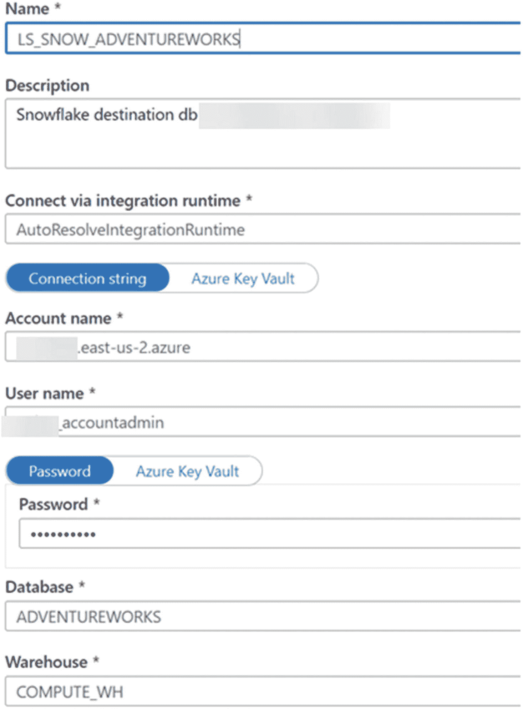
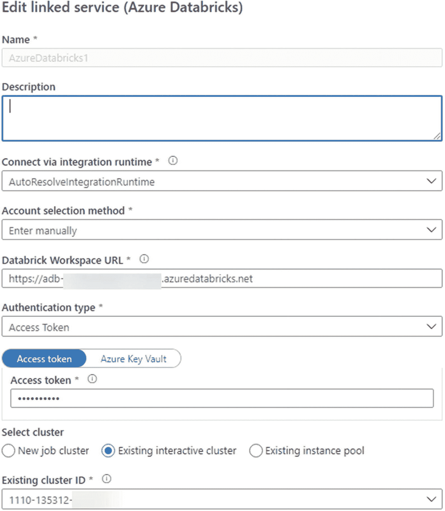
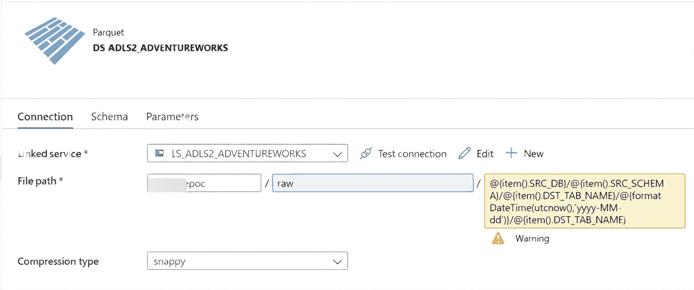
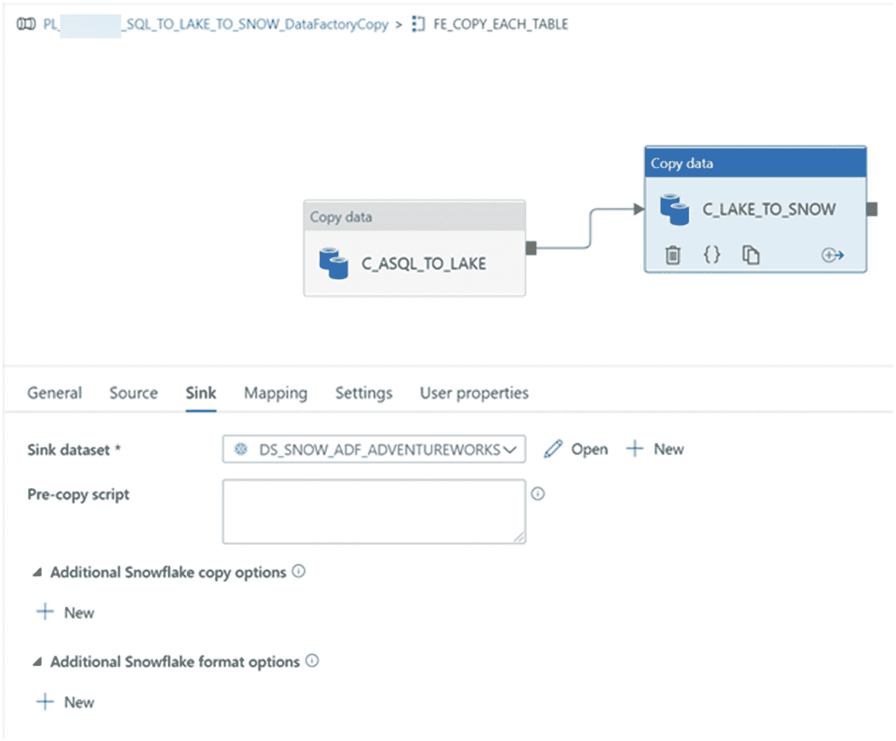
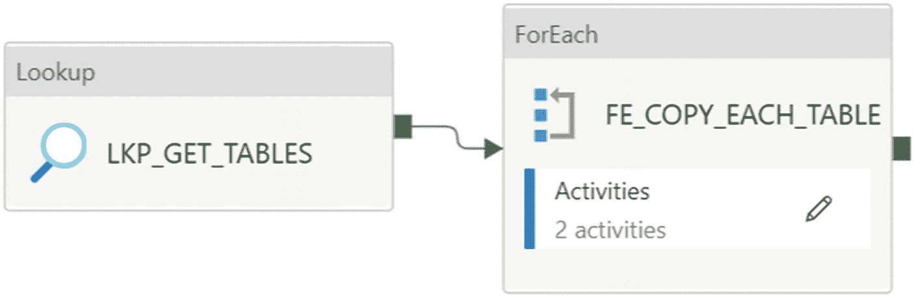

# 10.动态加载雪花数据仓库

许多组织和客户正在考虑将雪花数据仓库作为 Azure 的 Synapse Analytics 专用 SQL 池的替代方案。在应用第 [7](07.html) 章中介绍的相同模式的同时，本章将着重向您展示如何通过使用数据块和数据工厂将数据加载到雪花 DW 中。

在现代 Azure 数据平台中，将 ADLS 第二代数据动态加载到雪花型数据仓库有多种选择。您将在本章中了解到的一些选项包括

*   ADF 管道中的参数化数据块笔记本

*   数据工厂的常规复制活动

*   数据工厂的映射数据流

在对这些不同的选项进行了详细的端到端练习之后，我将讨论基于各种 ADF 管道执行运行中的选项的功能和限制的建议。

图 [10-1](#Fig1) 中的架构图说明了 Azure 资源正在被评估，以动态地将数据从 SQL 数据库(AdventureWorks)加载到 ADLS Gen2 帐户，使用数据工厂作为 ELT，雪花数据库`(ADF_DB)`作为控制和记录表。请注意，`ADF_DB`已经在前面包含元数据管道参数表和错误表的章节中创建。在学习本章的过程中，将探索将数据加载到雪花数据仓库的各种选项，以便将 ADLS Gen2 文件动态加载到雪花数据仓库中。


图 10-1

用于在雪花数据仓库中动态加载数据的 Azure 数据流架构

## 链接服务和数据集

最初，您需要在 ADF 中创建一些链接的服务和数据集来构建管道。链接的服务将包括源、接收器、控制数据库和数据块记事本，它们将是 ADF 管道流程的一部分。

### 基础链接服务

要开始这个过程，请在数据工厂中创建如图 [10-2](#Fig2) 所示的以下链接服务。


图 10-2

将数据加载到雪花所需的基本链接服务

如图 [10-3](#Fig3) 所示，一个 ADLS Gen2 链接服务将作为 snappy 压缩文件的容器和登陆区。


图 10-3

ADLS Gen2 的连接属性

一个示例`AdventureWorks` Azure SQL 数据库将作为源 SQL 数据库，图 [10-4](#Fig4) 显示了用于生成本章示例的数据库的连接属性。


图 10-4

Azure SQL DB 的连接属性

雪花图`ADF_DB`将被用作控制数据库，用于存放 ADF 管道中的控制、日志和审计表。图 [10-5](#Fig5) 显示了一些示例连接属性。


图 10-5

雪花控制表的连接属性

图 [10-6](#Fig6) 显示了雪花`AdventureWorks` DB，它将作为所有`AdventureWorks`表将要到达的目的地/目标雪花 DB。



图 10-6

雪花目标数据仓库的连接属性

创建图 [10-7](#Fig7) 所示的数据块链接服务是为了处理包含 Scala 代码的数据块笔记本，该代码将 ADLS Gen2 文件推送到雪花目标表。



图 10-7

Azure 数据块的连接属性

### 资料组

一旦创建了链接的服务，还需要创建图 [10-8](#Fig8) 中的数据集。这些是将在管道中使用的数据集。


图 10-8

ADF 管道所需的数据集

图 [10-9](#Fig9) 所示的 ADLS Gen2 数据集也包含由控制表和动态输入文件驱动的参数化文件夹路径和结构。



图 10-9

ADLS 第二代数据集的连接属性详细信息

以下是图 [10-9](#Fig9) 中文件路径部分包含的代码:

```
poc/raw/@{item().SRC_DB}/@{item().SRC_SCHEMA}/@{item().DST_TAB_NAME}/@{formatDateTime(utcnow(),'yyyy-MM-dd')}/ @{item().SAT_TAB_NAME}

```

需要设置图 [10-10](#Fig10) 中的参数。这些参数由包含详细元数据信息的雪花控制表填充，在 ADF 管道和数据集中称为动态参数。


图 10-10

ADLS 第二代数据集的参数属性详细信息

接下来，请创建如图 [10-11](#Fig11) 所示的`AdventureWorks`数据集。这是我们到`AdventureWorks2019LT`数据库的源数据库连接，它将驻留在 Azure SQL 数据库上。我们将使用这个数据库提取这些表，并将它们加载到 Data Lake Storage Gen2，然后使用 Databricks 笔记本将它们移动到 Snowflake DW，这将由 ADF 编排和调用。


图 10-11

Azure SQL 数据库的连接属性详细信息

需要创建如图 [10-12](#Fig12) 所示的动态参数化雪花数据库数据集。


图 10-12

动态雪花 DW 目标表的连接属性详细信息

此外，确保在目标雪花数据库中创建一个包含控制表的`ADF_DB`，这些控制表可以用作图 [10-13](#Fig13) 所示的数据集。


图 10-13

雪花 DW 控制数据库和表的连接属性详细资料

雪花中的`ADF_DB`控制表包含如下图 [10-14](#Fig14) 所示的模式，可以根据需要进一步更新和编辑。


图 10-14

雪花型 ADF_DB 控制表方案

## 雪花控制数据库和表格

在第 [4](04.html) 章中，我向您展示了如何通过元数据驱动和参数化流程实现用于控制 ADF 管道的控制数据库和表格。在本章中，遵循雪花型数据仓库中控制数据库和表的相同概念。与 T-SQL 相比，SnowSQL 语法会有一些变化，我将提供您需要在 Snowflake DW 上执行的 SnowSQL 代码。

图 [10-15](#Fig15) 显示了被称为`ETL_PIPELINE_CTL`的`ADF_DB`管线控制表。


图 10-15

雪花 ADF_DB。ETL _ 管道 _CTL 控制表

此外，以下是用于在雪花中创建控制和审计表的脚本。确保在您的`ADF_DB`数据库的 ETL 模式中运行该脚本。该脚本将创建两个表—`PIPELINE_CTL`和`AUDIT_TAB`:

```
CREATE OR replace TABLE pipeline_ctl
  (
  parameter_id                       number(38,0) NOT NULL autoincrement,
  server_name                        varchar(500),
  src_type                           varchar(500),
  src_schema                         varchar(500),
  src_db                             varchar(500),
  src_tab_name                       varchar(500),
  dst_type                           varchar(500),
  dst_tab_name                       varchar(500),
  include_pipeline_flag              varchar(500),
  process_type                       varchar(500),
  load_snowflake                     varchar(500),
  load_frequency                     varchar(500),
  dst_folder                         varchar(500),
  file_type                          varchar(500),
  lake_dst_folder                    varchar(500),
  dst_schema                         varchar(500),
  distribution_type                  varchar(500),
  asql_to_lake_pipeline_date         timestamp_ntz(9),
  asql_to_lake_pipeline_status       varchar(500),
  load_snow_etl_pipeline_date        timestamp_ntz(9),
  load_snow_etl_pipeline_status      varchar(500),
  load_snow_curated_pipeline_date    timestamp_ntz(9),
  load_snow_curated_pipeline_status  varchar(500),
  load_delta_pipeline_date           timestamp_ntz(9),
  load_delta_pipeline_status         varchar(500),
  partition_field                    varchar(500),
  priority_lane                      varchar(500),
  spark_flag                         varchar(500),
  swim_lane                          int,
  PRIMARY KEY (parameter_id)
   );

 CREATE OR replace TABLE audit_tab
   (
  pipeline_name                      varchar(100),
  db_name                            varchar(20),
  sch_name                           varchar(20),
  table_name                         varchar(50),
  source_count                       number(38,0),
  adls_count                         number(38,0),
  snowflake_count                    number(38,0),
  load_time timestamp_ntz(9)         DEFAULT CURRENT_TIMESTAMP()
   );

```

## 管道

既然已经创建并填充了基本元数据驱动的 ETL 控制表，那么就按照几个关键步骤开始创建 ADF 管道。首先，您需要设计并执行 ADF 管道来将 Azure SQL 数据库加载到 ADLS Gen2。下一步将是加载 ADLS 第二代到雪花。在将 ADLS Gen2 加载到雪花的第二步中，您将了解一些不同的选项来完成这个摄取任务。

### 步骤 1:设计并执行一个 ADF 管道，将 Azure SQL 数据库加载到 Data Lake Storage Gen2

本节记录了从 Azure SQL DB 到 ADLS Gen2 的数据迁移。作为参考，在第 [4](04.html) 章中已经详细讨论和演示了将数据加载到 Synapse Analytics 专用 SQL 池中的过程，而本章重点介绍了作为目标数据仓库的雪花。

一旦创建了数据集和链接服务，图 [10-16](#Fig16) 中所示的以下查找活动将查找控制表中定义的表列表，并将它们传递给 ForEach 循环活动，该循环活动将遍历源表列表(一次最多并行 50 个批处理计数)。确保在“常规”选项卡中对查找活动进行如下配置。


图 10-16

ADF 管道查找和外部 ForEach 循环活动常规属性

还要确保查找活动的配置如图 [10-17](#Fig17) 中的设置选项卡所示。


图 10-17

ADF 管道查找和外部 ForEach 循环活动设置

最后，确保在设置选项卡中配置外部 ForEach 循环活动，如图 [10-18](#Fig18) 所示。


图 10-18

ADF 管道外部 ForEach 循环活动设置

然后，ForEach 循环的内部复制活动将以 Parquet 格式将数据复制到 ADLS Gen2 中。确保在如图 [10-19](#Fig19) 所示的常规选项卡中进行配置。


图 10-19

ADF 管道复制活动常规连接属性

还要确保复制活动的源数据集属性的配置如图 [10-20](#Fig20) 所示。


图 10-20

ADF 管道复制活动源数据集属性

以下是添加到图 [10-20](#Fig20) 中的源查询部分的代码:

```
SELECT * FROM @item().SRC_SCHEMA}.@item().DST_TAB_NAME}

```

最后一个配置步骤是确保复制活动的汇数据集属性如图 [10-21](#Fig21) 所示进行配置。


图 10-21

ADF 管道复制活动接收器数据集属性

一旦管道成功执行，我们可以看到所有的表都以 Parquet 格式成功加载到 ADLS Gen2 中。图 [10-22](#Fig22) 显示了成功的管道活动运行的成功确认。


图 10-22

ADF 管道活动运行确认执行成功

图 [10-23](#Fig23) 显示 ADLS Gen2 中的文件夹结构与预期一致。


图 10-23

从 ADF 管道创建的 ADLS Gen2 文件夹

如图 [10-24](#Fig24) 所示，文件与 ADLS Gen2 中的文件一致。


图 10-24

从 ADF 管道创建的 ADLS Gen2 文件

### 步骤 2:设计数据湖存储 Gen2 到雪花 ADF 管道

一旦文件以 snappy 压缩文件格式进入 ADLS Gen2，有几个选项可以将拼花文件加载到雪花中。对于湖泊到雪花的摄取过程，本章评估了以下 ADF 管道选项，如图 [10-25](#Fig25) 所示。


图 10-25

将拼花文件加载到雪花中的选项

#### 选项 1:使用 Azure Databricks 将 ADLS Gen2 加载到雪花的 ADF 管道

使用 Databricks 的 ADLS Gen2 到雪花 ADF 管道是一个选项，可以将参数从数据工厂传递到参数化 Databricks 笔记本，并确保两个服务之间的连接和集成，如图 [10-26](#Fig26) 所示。


图 10-26

选项 1 的 ADF 管道数据流

在 ForEach 循环活动中，添加 Databricks notebook 活动，并将其连接到我们在图 [10-27](#Fig27) 所示的前一部分中运行的复制数据活动。


图 10-27

ADF 管道 Azure 数据块连接属性

请注意图 [10-28](#Fig28) 中的设置选项卡，笔记本路径引用数据块笔记本，该笔记本包含代码以及将值动态传递到数据块笔记本以供进一步处理所需的基本参数。


图 10-28

具有数据块笔记本路径和参数设置的 ADF 管道

图 [10-28](#Fig28) 所示的数据块笔记本设置部分中的基本参数值使用的代码如下:

```
@item().DST_TAB_NAME}

@{item().DST_SCHEMA}

raw/AdventureWorksLT2019/SALESLT/@{item().DST_TAB_NAME}/@{formatDateTime(utcnow(),'yyyy')}-@{formatDateTime(utcnow(),'MM')}-@{formatDateTime(utcnow(),'dd')}/

```

在 Databricks 中，笔记本将包含以下 Scala 代码，如图 [10-29](#Fig29) 所示，它动态地接受来自 ADF 复制活动的参数，然后将它们传递给数据帧，该数据帧根据动态参数读取拼花文件，然后将其写入雪花表:


图 10-29

Databricks 笔记本包含将数据从 ADLS Gen2 加载到雪花的代码，从 ADF 管道活动中调用

```
import org.apache.spark.sql.{SaveMode, SparkSession}
spark.conf.set(
  "fs.azure.account.key.adl001.dfs.core.windows.net",
  "ENTER-ACCOUNT-KEY-HERE"
)

val DST_TAB_NAME = dbutils.widgets.get("DST_TAB_NAME")
val DST_SCHEMA = dbutils.widgets.get("DST_SCHEMA")
val FOLDER_PATH = dbutils.widgets.get("FOLDER_PATH")

var options = Map(
  "sfUrl" -> "px.east-us-2.azure.snowflakecomputing.com",
  "sfUser" -> "USERNAME",
  "sfPassword" -> "PW",
  "sfDatabase" -> "ADVENTUREWORKS",
  "sfSchema" -> DST_SCHEMA,
  "truncate_table" -> "ON",
  "usestagingtable" -> "OFF",
  "sfWarehouse" -> "COMPUTE_WH"
)

val df = spark.read.parquet("abfss://poc@gze2np1adl001.dfs.core.windows.net/"+FOLDER_PATH+DST_TAB_NAME)

df.write
    .format("snowflake")
    .options(options)
    .option("dbtable", DST_TAB_NAME)
    .mode(SaveMode.Overwrite)
    .save()

```

#### 选项 2:使用 ADF 复制活动将 ADLS Gen2 加载到雪花的 ADF 管道

下一个 ADLS Gen2 到 Snowflake ADF 管道选项将使用所有使用常规复制活动的数据工厂原生工具。ADF 管道的高层数据流如图 [10-30](#Fig30) 所示。


图 10-30

选项 2，将使用数据工厂的本地工具，使用常规的复制活动

此外，该选项将要求创建和配置 Blob 存储服务，并且仅要求对 Blob 链接服务连接进行 SAS URI 认证，图 [10-31](#Fig31) 中显示了一个配置示例。


图 10-31

Blob 存储连接属性

确保已经配置了以下复制数据活动源设置，如图 [10-32](#Fig32) 所示。


图 10-32

复制数据源数据集属性

图 [10-33](#Fig33) 确认以下复制数据活动接收器设置已正确配置。



图 10-33

复制数据接收器设置详细信息

请注意，在图 [10-34](#Fig34) 的设置部分，需要启用暂存并链接到服务。


图 10-34

复制数据设置详细信息

#### 选项 3:使用映射数据流将 ADLS Gen2 加载到雪花的 ADF 管道

这个 ADLS Gen2 到雪花 ADF 管道选项将在映射数据流中使用所有数据工厂原生工具以及 Spark compute。图 [10-35](#Fig35) 显示了这个高级 ADF 数据流的样子。



图 10-35

在映射数据流中使用所有数据工厂原生工具和 Spark 计算的选项

在 ForEach 循环活动中，确保数据流活动连接到复制数据活动，并如图 [10-36](#Fig36) 所示配置设置。


图 10-36

映射数据流设置

在映射数据流活动中，有一个到 ADLS Gen2 帐户的源连接需要配置，如图 [10-37](#Fig37) 所示。


图 10-37

将数据流活动来源连接映射到 ADLS Gen2

还要确保引用目标雪花账户的目的地配置如下，如图 [10-38](#Fig38) 所示。


图 10-38

映射数据流活动接收器雪花连接属性

请注意，在图 [10-39](#Fig39) 的目标设置中，我们指定了一个“重建表格”动作。


图 10-39

指定“重新创建表格”操作的目标设置

图 [10-40](#Fig40) 显示了在映射部分中有其他有价值的特性来跳过重复。


图 10-40

映射部分中跳过重复项的功能

此外，图 [10-41](#Fig41) 显示有优化分区的选项。


图 10-41

优化分区的选项

## 比较各种 ADLS 第二代和雪花摄入选项

在本章的前几节中，我已经演示了几种将数据加载到雪花中的方法。在这一节中，我将比较这些不同的摄取选项，总结这些选项的优缺点。

表 [10-1](#Tab1) 显示了所有三项活动的执行管道的一些比较，比较了稳定、可扩展和成功摄取管道的关键组成部分。

表 10-1

比较各种 ADLS 第二代和雪花摄入选项

<colgroup><col class="tcol1 align-left"> <col class="tcol2 align-left"> <col class="tcol3 align-left"> <col class="tcol4 align-left"></colgroup> 
|   | 

参数化数据块笔记本

 | 

数据工厂映射数据流

 | 

数据工厂复制活动

 |
| --- | --- | --- | --- |
| **数据类型映射问题** | AdventureWorks 示例表中没有记录。 | 二进制数据类型会导致错误。 | 二进制数据类型会导致错误。 |
| **动态自动创建表格能力** | 是的(目前，自动创建表的过程正在最大限度地利用雪花中的数据类型)。 | 是的(目前，自动创建表的过程正在最大限度地利用雪花中的数据类型)。 | 否(目前，没有现成的动态自动创建表的功能)。 |
| **动态自动截断功能** | 是 | 是 | 是 |
| **管道活动审计捕获能力** | 是 | 是 | 是 |
| **需要中间斑点阶段** | 不 | 不 | 是 |
| **需要 SAS URI 认证** | 不 | 不 | 是 |
| **所需的集群预热时间或运行状态** | 是(Databricks 集群预热大约需要 5 分钟；指定核心数量、计算类型和生存时间的能力)。 | 是(映射数据流群集预热大约需要 5 分钟；指定核心数量、计算类型和生存时间的能力)。 | 不 |
| **指定计算和内核数量的能力** | 是 | 是 | 不适用(本活动不使用 Spark 计算)。 |
| **管理模式漂移/演变的能力** | 是 | 是 | 不适用的 |
| **优化分区的能力** | 是 | 是 | 不适用的 |
| **追加库(罐子、鸡蛋、轮子)的能力** | 是 | 是 | 不适用(本练习不使用 Spark 计算，因此没有附加库功能)。 |
| **运行并行活动的能力** | 是 | 是 | 是 |

## 泳道

由于 ADF 目前能够通过其 ForEach 循环管道活动同时并行运行 50 个表，如果需要并行运行大量的表，您可以向雪花控制表添加一个名为`swim_lane`的自定义属性，然后运行下面的代码，该代码将为一组表分配一个唯一的编号，然后通过对`swim_lane`列进行筛选，这些表可以通过一个活动集运行。使用这种方法，您可以在 ADF 管道中使用多个 ForEach 循环拥有多个泳道。

以下代码将更新该表以创建`swim_lane`列:

```
UPDATE adf_db.etl.pipeline_ctl PL1
SET    swim_lane = 2
FROM   (SELECT src_tab_name,
               Row_number()
                 OVER (
                   ORDER BY src_tab_name ) AS rn
        FROM   adf_db.etl.pipeline_ctl) b
WHERE  PL1.src_tab_name = b.src_tab_name
       AND b.rn > 5

```

## 数据有效性

有必要通过验证从源 Azure SQL 数据库服务器复制到 ADLS Gen2 并从那里复制到雪花目标表集的最终目的地的行数来执行基本的完整性检查。

这种级别的详细信息可以在您的雪花环境中的控制表中捕获，并可以命名为`AUDIT_TAB`。该表将接受来自 ADF 和 Databricks 笔记本的动态传递的参数。请参见第 [8](08.html) 章和第 [9](09.html) 章，了解如何在 ADF 中构建一个健壮的日志记录框架，然后将其与本章的知识相结合，以将该日志记录流程与 ADF、Databricks 和雪花集成。

以下代码可用于在雪花 DW 中创建日志表:

```
CREATE OR replace TABLE audit_tab
 (
   pipeline_name   varchar(100),
   src_db_name     varchar(20),
   dest_db_name    varchar(20),
   sch_name        varchar(20),
   table_name      varchar(50),
   source_count    number(38,0),
   adls_count      number(38,0),
   snowflake_count number(38,0),
   load_time timestamp_ntz(9) DEFAULT CURRENT_TIMESTAMP()
 );

```

## 摘要

在本章中，我演示了一个两步流程，该流程在一个 ADF 管道中链接在一起，用于(1)将数据从 Azure SQL 数据库加载到 Data Lake Storage Account Gen2，以及(2)将数据从 Data Lake Storage Gen2 加载到雪花数据仓库。在该过程的第 2 部分(ADLS Gen2 到雪花)，我演示了三个选项:数据块、ADF 复制活动和映射数据流。我还介绍了通过利用从第 [8](08.html) 章和第 [9](09.html) 章学到的知识，将 ADF 管道指标记录到雪花表格中的想法。最后，我比较了三个选项，以了解每个选项的优缺点。