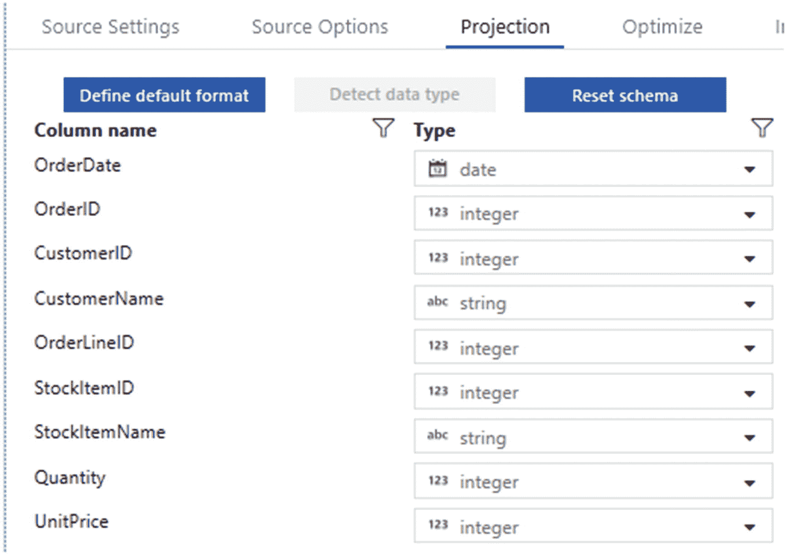

# 十二、使用映射数据流聚合和转换大数据

在数据湖中清理和转换大数据集的过程已经成为现代企业数据架构中越来越受欢迎和关键的一步。微软推出了几种大数据分析和编排工具，以满足大数据湖提取-加载-转换(ELT)的需求。客户正在寻求基于云的服务，这些服务可以轻松地清理、转换和聚合非常大的数据集，并且学习曲线较低。他们正在寻求了解哪些工具和技术可能符合大数据湖清理和转换的要求。

Azure Data Factory 的映射数据流已经成为大数据湖清理和转换的一个有前途的解决方案。在第 [11](11.html) 章中，我讨论了现代数据仓库的概念，并展示了一个为企业数据仓库转换映射数据流的实际例子。在本章中，我将继续演示映射数据流的其他数据清理和聚合功能，特别是处理作为分层文件存储在 Azure Data Lake Storage Gen2 中的大数据文件。

## 将文件和文件夹添加到 Azure 数据湖存储二代

通过使用最佳实践来正确构建数据湖存储是关键。当数据存储在 Data Lake Storage Gen2 中时，文件大小、文件数量和文件夹结构会对性能产生影响。

### 文件大小

根据使用数据的服务和工作负载，文件的合适大小是 256 MB 或更大。如果在数据湖存储中无法对文件大小进行批处理，您可以进行单独的压缩作业，将这些文件合并成更大的文件。

### 文件夹结构

文件夹和文件的组织结构可以帮助某些查询只读取数据的子集，这通过优化较大的文件大小和每个文件夹中合理的文件数量来提高性能。了解性能调优和优化技术，以及文件夹和文件结构建议。

在本练习中，您将学习如何创建一个名为**湖**的 ADLS Gen2 容器，以及一些用于组织 2016 年数据的附加文件夹。首先，请确保您已经设置了 ADLS Gen2 帐户和 ADF 帐户。接下来，您需要将 2016 年的销售文件从以下 GitHub 账户`(` [`https://github.com/ronlesteve/sales-datasets`](https://github.com/ronlesteve/sales-datasets) `)`上传到如图 [12-1](#Fig1) 所示的 ADLS Gen2 文件夹结构中。

从图 [12-1](#Fig1) 中我们可以看到，在 2016 年的销售文件夹中，额外的文件夹是按月份编号组织的。


图 12-1

按月份编号组织的 2016 年销售文件夹

每个月内，有**。按天整理保存的 txt** 文件，如图 [12-2](#Fig2) 所示。


图 12-2

按月日文本文件组织的 2016 年销售文件夹

最后，在打开其中一个文本文件时，请注意图 [12-3](#Fig3) 中的数据结构，该数据结构由以下选中的列组成。


图 12-3

文本文件的结构

## 创建 Azure 数据工厂资源

既然数据湖文件和文件夹已经被结构化了，是时候创建必要的 Azure 数据工厂资源了。数据工厂打开后，开始创建新的管道，如图 [12-4](#Fig4) 所示。


图 12-4

创建新的 ADF 管道

接下来，添加一个新的数据集，该数据集将引用具有以下连接属性的 **lake** 容器。请注意，图 [12-5](#Fig5) 中的目录和文件属性被留空，因为这可以在映射数据流属性中动态设置。另外，将列分隔符设置为**制表符(\)** 。


图 12-5

ADLS 第二代数据集连接属性

发布资源后，图 [12-6](#Fig6) 中的工厂资源部分将可用。这些资源由管道和数据集组成。


图 12-6

ADF 管道和数据集资源

在新创建的管道中，从 Activities 中展开 **Move & Transform** ，然后将如图 [12-7](#Fig7) 所示的**数据流活动**拖到画布上。


图 12-7

ADF 数据流活动

## 创建映射数据流

现在您已经准备好创建如图 [12-8](#Fig8) 所示的数据流活动。


图 12-8

ADF 销售订单数据流

首先，将图 [12-9](#Fig9) 中所示的源连接添加到上一节中创建的 **SalesOrderDataset** 中。


图 12-9

与 SalesOrderDataset 的 ADF 数据流源连接

确保**允许模式漂移**，因为文件中可能会有更改的列。此外，选择**推断漂移柱类型**允许自动检测漂移柱类型。这些选项如图 [12-10](#Fig10) 所示。


图 12-10

ADF 源数据流设置

将 2016 年参数化，这样就可以在硬编码路径之外维护这些值。要添加参数，单击映射数据流画布中的空白区域，然后选择并添加所需的参数，如图 [12-11](#Fig11) 所示。


图 12-11

ADF 源数据集参数

添加参数后，返回到“源选项”选项卡。在源选项下，在**通配符路径**中添加 2016 sales 文件夹的路径。此设置将覆盖数据集中设置的文件夹路径，从容器根目录开始。 ****** 将允许递归目录嵌套。最后，使用 ***.txt.** 指定所有需要的文本文件。信号源选项选项卡的这些设置已在图 [12-12](#Fig12) 中列出。


图 12-12

ADF 源选项

以下是添加到图 [12-12](#Fig12) 中源选项选项卡的通配符路径字段的代码:

```
'DataLakeCleansing/raw/sales/'+$Year+'/**/*.txt'

```

在图 [12-13](#Fig13) 所示的投影选项卡中，验证并更改列模式。



图 12-13

ADF 数据流源投影

接下来，添加一个如图 [12-14](#Fig14) 所示的**选择**模式修饰符来删除需要的列。为此，单击源活动旁边的+图标，并添加 Select schema 修饰符。请注意，还有许多其他选项可以用来转换数据和模式。


图 12-14

ADF 映射数据流“选择”修饰符活动

也可以选择跳过重复的选项，如图 [12-15](#Fig15) 所示。


图 12-15

ADF 数据流“选择设置”以跳过重复项

接下来，添加一个**派生列**模式修饰符来添加两个新列，如图 [12-16](#Fig16) 所示:


图 12-16

ADF 数据流派生列

1.  基于`OrderDate`的订单月数

2.  年数也基于`OrderDate`

派生列非常适合通过表达式的力量进行数据清理。

### 正则表达式(Regex)

正则表达式是指定搜索模式的字符序列。通常，字符串搜索算法使用这种模式对字符串进行“查找”或“查找和替换”操作，或者进行输入验证。它是在理论计算机科学和形式语言理论中发展起来的一种技术。正则表达式函数与映射数据流兼容，可以添加到 ADP 管道内的活动中。以下是一些示例正则表达式及其预期用途:

*   `RegexReplace(Address,`^a-zA-Z\d\s:`,'')`:删除所有非字母数字字符

*   `RegexReplace(Address,`[ ]{2}|\.`,' ')`:获取包含街道地址字符串的地址字段，并替换任何出现的两个空格或点“.”只有一个空格。

*   `Regex_extract(Address, `^(\d+)`, 1)`:使用街道地址提取门牌号。

### 桑迪克斯

Soundex 是一种[语音算法](https://en.wikipedia.org/wiki/Phonetic_algorithm)，用于[通过声音索引](https://en.wikipedia.org/wiki/Index_%2528publishing%2529)姓名，如[在英语中发音为](https://en.wikipedia.org/wiki/Pronunciation)。目标是将[同音字](https://en.wikipedia.org/wiki/Homophone)编码[为相同的表示，这样即使](https://en.wikipedia.org/wiki/Encoding)[拼写](https://en.wikipedia.org/wiki/Spelling)有微小差异，它们也可以匹配。

当在湖中处理半结构化或非结构化数据时，这是一个很好的表达方式，可以用来解决在没有键的情况下连接和清理数据的问题。

接下来，添加一个如图 [12-17](#Fig17) 所示的**聚合**模式修饰符来聚合单价*数量。


图 12-17

ADF 数据流聚合架构修饰符

请记住按图 [12-18](#Fig18) 中所示的以下各列对该聚合进行分组。


图 12-18

按聚合设置分组的 ADF 数据流

图 [12-19](#Fig19) 显示了您需要输入总计算值的位置。


图 12-19

ADF 数据流聚合

现在聚合已经完成，添加一个 [Windows 模式修饰符](https://docs.microsoft.com/en-us/azure/data-factory/data-flow-window)，如图 [12-20](#Fig20) 所示。

窗口转换是在数据流中定义基于窗口的列聚合的地方。在表达式生成器中，您可以定义基于数据或时间窗口(SQL OVER 子句，如 LEAD、LAG、NTILE、CUMEDIST、RANK 等)的不同类型的聚合。).将在您的输出中生成一个包含这些聚合的新字段。您还可以包括可选的分组依据字段。


图 12-20

ADF 数据流窗口架构修饰符

图 [12-21](#Fig21) 展示了如何通过`CustomerName`对总数进行排序。


图 12-21

“结束”的 ADF Windows 设置

图 [12-22](#Fig22) 显示了如何按降序排列总数，从最高到最低排列总数。


图 12-22

“排序”的 ADF 窗口设置

将范围 by 设为**无界**，如图 [12-23](#Fig23) **所示。**


图 12-23

“范围依据”的 ADF 窗口设置

接下来，在总数中添加一个密集排名函数。请注意，有一些秩和行数函数适合特定的需求和用例。

### 等级函数

RANK 函数用于根据 ORDER BY 子句的条件检索已排序的行。

表 12-1

秩函数样本输出

<colgroup><col class="tcol1 align-left"> <col class="tcol2 align-left"> <col class="tcol3 align-left"></colgroup> 
| 

易名中国

 | 

盐

 | 

等级

 |
| --- | --- | --- |
| 史密斯 | eight hundred | one |
| 詹姆斯 | Nine hundred and fifty | Two |
| 亚当斯 | One thousand one hundred | three |
| 马丁 | One thousand two hundred and fifty | four |
| 病房 | One thousand two hundred and fifty | four |
| 车工 | One thousand five hundred | six |

下面是一个包含 RANK 函数的示例查询:

```
SELECT ename,
       sal,
       Rank()
         OVER (
           ORDER BY sal) RANK
FROM   emp;

```

表 [12-1](#Tab1) 显示了在样本数据集上运行的 RANK 函数的样本输出。

### 稠密秩函数

DENSE_RANK 函数类似于 RANK 函数。但是，如果前面记录的等级之间存在关联，DENSE_RANK 函数不会跳过任何等级。

以下是包含 DENSE_RANK 函数的示例查询:

```
SELECT ename,
       sal,
       Dense_rank()
         OVER (
           ORDER BY sal) DEN_RANK
FROM   emp;

```

表 [12-2](#Tab2) 显示了在样本数据集上运行的 DENSE_RANK 函数的样本输出。

表 12-2

DENSE_RANK 函数示例输出

<colgroup><col class="tcol1 align-left"> <col class="tcol2 align-left"> <col class="tcol3 align-left"></colgroup> 
| 

易名中国

 | 

盐

 | 

等级

 |
| --- | --- | --- |
| 史密斯 | eight hundred | one |
| 詹姆斯 | Nine hundred and fifty | Two |
| 亚当斯 | One thousand one hundred | three |
| 马丁 | One thousand two hundred and fifty | four |
| 病房 | One thousand two hundred and fifty | four |
| 车工 | One thousand five hundred | five |

### 行数函数

与 RANK 和 DENSE_RANK 函数不同，ROW_NUMBER 函数只返回从 1 开始排序的记录的行号。ADF 中映射数据流转换任务的窗口设置如图 [12-24](#Fig24) 所示。


图 12-24

“窗口栏”的 ADF 窗口设置

窗口功能完成后，添加一个 sink 将丰富的结果存储在数据湖中，如图 [12-25](#Fig25) 所示。


图 12-25

用于存储丰富数据的 ADF 数据流接收器

使用图 [12-26](#Fig26) 中所示的以下 sink 数据集设置，并记住选中允许模式漂移选项。Azure Data Factory 本身支持灵活的模式，这些模式会随着执行的不同而变化，因此您可以构建通用的数据转换逻辑，而无需重新编译您的数据流。

模式漂移是数据源经常改变元数据的情况。可以动态地添加、删除或更改字段、列和类型。如果不处理模式漂移，您的数据流将很容易受到上游数据源更改的影响。当传入的列和字段发生变化时，典型的 ETL 模式会失败，因为它们往往与那些源名称联系在一起。

为了防止模式漂移，作为一名数据工程师，让数据流工具中的设施允许您

*   定义具有可变字段名、数据类型、值和大小的源。

*   定义可以处理数据模式而不是硬编码字段和值的转换参数。

*   定义理解模式的表达式以匹配传入字段，而不是使用命名字段。


图 12-26

ADF 数据流接收器数据集连接属性

另外，将设置配置为输出到单个文件并指定文件名，如图 [12-27](#Fig27) 所示。


图 12-27

ADF 数据流接收器设置

映射数据流的好处之一是**数据流调试**模式，它允许预览转换后的数据，而不必手动创建集群和运行管道。

记得打开调试模式以便预览如图 [12-28](#Fig28) 所示的数据，然后在退出 Azure Data Factory 之前关闭它。请注意，调试模式将在一段时间后自动终止。


图 12-28

ADF 数据流调试触发器

按客户排序的总结果将类似于图 [12-29](#Fig29) 中显示的结果。


图 12-29

按客户排列的总结果

下一个练习将向您展示如何将总计分割成一个新的分支，以创建一个具有不同窗口函数的新文件，这次将按月对总计进行排序，并将结果输出到数据湖中的不同文件，如图 [12-30](#Fig30) 所示。


图 12-30

将总聚合拆分为新分支

确保新窗口功能的设置如图 [12-31](#Fig31) 所示。


图 12-31

按月排列总数并将结果输出到文件的设置

一旦映射数据流完成，它将如图 [12-32](#Fig32) 所示。


图 12-32

完整的端到端 ADF 映射数据流

## 摘要

在本章中，我演示了如何创建一个指向数据湖容器的数据集。接下来，我向您展示了如何向 2016 sales 文件夹中的所有文本文件添加参数化通配符路径。然后，我向您展示了如何选择相关的列，添加几个关键的派生列，执行聚合，添加窗口函数，分割分支，以及将所需的结果导出到数据湖中的富文本文件。

输出数据集包含按客户名称和月份进行聚合和降序排列的总计(单价*数量)。所有这些都是通过利用 Azure Data Factory 的映射数据流特性完成的，并使用数据流调试功能进行了测试。