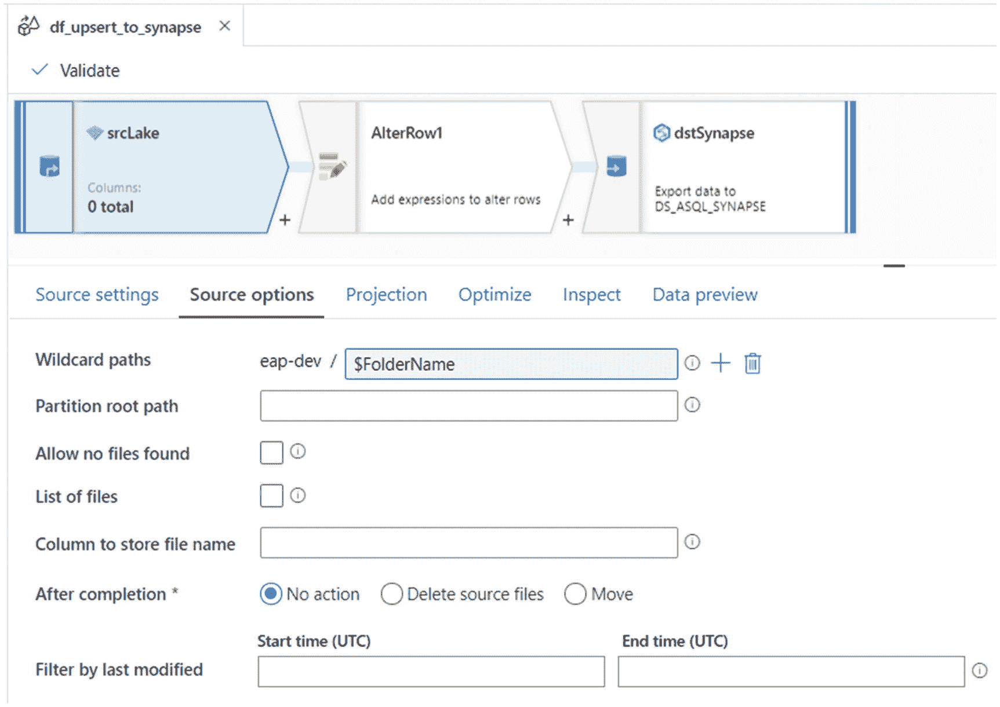
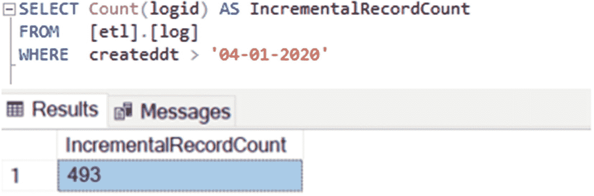
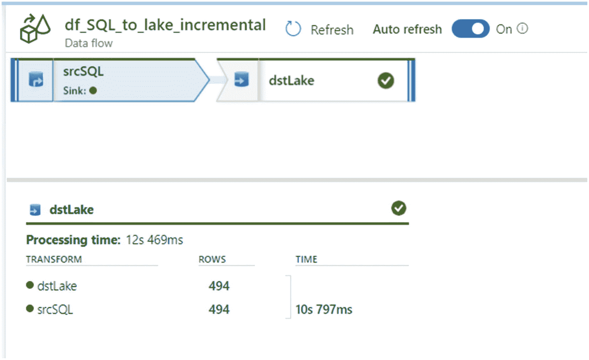

# 十三、增量插入数据

如果你还记得从第 [4](04.html) 到第 [6](06.html) 章，我演示了如何做到以下几点:

*   从 SQL 数据库完全加载 Azure 数据湖存储二代。

*   使用 Azure Data Factory 的复制活动，使用数据湖存储二代parquet 文件完全加载 Azure Synapse Analytics DW。

这个 ELT 过程由元数据方法驱动，使用 SQL 表中填充的管道参数。虽然这是一种有用的 ELT 方法，但本章将重点推进这一过程，以解决以下问题:

*   从 SQL 源增量加载 Azure 数据湖存储。

*   将增量记录更新并插入 Azure Synapse Analytics 数据仓库目标。

在这一章中，我将演示 Azure Data Factory 的映射数据流的内置 upsert 功能，以更新 Azure Data Lake Storage gen 2 parquet 文件中的数据并将其插入 Azure Synapse Analytics DW。值得注意的是，映射数据流目前不支持本地数据源和接收器。因此，本练习将利用 Azure SQL 数据库作为创建数据集的源。此外，我将演示如何使用一种定制方法，根据 Azure SQL 数据库中的创建日期，用 parquet 文件增量填充 Data Lake Storage Gen2。本章假设您熟悉本书前面的章节，这些章节讨论了使用 Azure Data Factory 的元数据驱动的 ETL 方法。

## 创建参数表

让我们从在 Azure SQL 数据库中创建一个`pipeline_parameter`表开始这个过程。您已经在前面的章节中创建了它，您只需要添加下面列出的附加列。正如我们在前面章节中回忆的那样，此表将包含用于控制 ADF 管道的参数值:

*   **upsert_key_column** :这是映射 upsert 流程的数据流必须使用的键列。它通常是一个 ID 列。

*   **incremental _ watermark _ value**:必须用源 SQL 表的值填充，以驱动增量过程。这通常是主键 ID 或创建/最后更新日期列。它可以通过存储过程进行更新。

*   **incremental _ watermark _ column**:这只是填充在`incremental_watermark_value`列中的值的列名。这通常是主键 ID 或创建/最后更新日期列。它可以通过存储过程进行更新。

*   **process_type** :必须设置为 incremental，ADF 才能知道这个表中哪些记录是增量的。

以下是复制更新后的`pipeline_parameter`表的 SQL 代码:

```
SET ansi_nulls ON

go

SET quoted_identifier ON

go

CREATE TABLE [dbo].[pipeline_parameter]
  (
     [parameter_id]                       [INT] IDENTITY(1, 1) NOT NULL,
     [server_name]                        [NVARCHAR](500) NULL,
     [src_type]                           [NVARCHAR](500) NULL,
     [src_schema]                         [NVARCHAR](500) NULL,
     [src_db]                             [NVARCHAR](500) NULL,
     [src_name]                           [NVARCHAR](500) NULL,
     [dst_type]                           [NVARCHAR](500) NULL,
     [dst_name]                           [NVARCHAR](500) NULL,
     [include_pipeline_flag]              [NVARCHAR](500) NULL,
     [partition_field]                    [NVARCHAR](500) NULL,
     [process_type]                       [NVARCHAR](500) NULL,
     [priority_lane]                      [NVARCHAR](500) NULL,
     [pipeline_date]                      [NVARCHAR](500) NULL,
     [pipeline_status]                    [NVARCHAR](500) NULL,
     [load_synapse]                       [NVARCHAR](500) NULL,
     [load_frequency]                     [NVARCHAR](500) NULL,
     [dst_folder]                         [NVARCHAR](500) NULL,
     [file_type]                          [NVARCHAR](500) NULL,
     [lake_dst_folder]                    [NVARCHAR](500) NULL,
     [spark_flag]                         [NVARCHAR](500) NULL,
     [dst_schema]                         [NVARCHAR](500) NULL,
     [distribution_type]                  [NVARCHAR](500) NULL,
     [load_sqldw_etl_pipeline_date]       [DATETIME] NULL,
     [load_sqldw_etl_pipeline_status]     [NVARCHAR](500) NULL,
     [load_sqldw_curated_pipeline_date]   [DATETIME] NULL,
     [load_sqldw_curated_pipeline_status] [NVARCHAR](500) NULL,
     [load_delta_pipeline_date]           [DATETIME] NULL,
     [load_delta_pipeline_status]         [NVARCHAR](500) NULL,
     [upsert_key_column]                  [NVARCHAR](500) NULL,
     [incremental_watermark_column]       [NVARCHAR](500) NULL,
     [incremental_watermark_value]        [DATETIME] NULL,
     PRIMARY KEY CLUSTERED ( [parameter_id] ASC )WITH (statistics_norecompute =
     OFF, ignore_dup_key = OFF) ON [PRIMARY]
  )
ON [PRIMARY]

go 

```

## 为 ADF 管道创建源查询

现在您已经创建了`pipeline_parameter`，编写一个定制的 SQL 查询，它将被用作 ADF 管道的源。注意添加了`SQLCommand`和`WhereValue`，它们可以用于根据流程类型是完整的还是增量的来动态创建定制的 SQL 语句和 where 子句。出于本练习的目的，仅对增量值应用过滤器，但是该查询展示了将全部负载合并到同一源查询中的灵活性。我们的疑问是:

```
SELECT src_schema,
       src_db,
       src_name,
       dst_schema,
       dst_type,
       dst_name,
       dst_folder,
       process_type,
       file_type,
       load_synapse,
       distribution_type,
       upsert_key_column,
       incremental_watermark_column,
       CASE
         WHEN process_type = 'FULL' THEN 'select * from ' + src_schema + '.' +
                                         src_name
                                         + ' where  1 = '
         WHEN process_type = 'Incremental' THEN
         'select * from ' + src_schema + '.' + src_name
         + ' where  ' + incremental_watermark_column
         + ' > '
       END                               AS SQLCommand,
       CASE
         WHEN process_type = 'FULL' THEN '1'
         WHEN process_type = 'incremental' THEN Cast(
         Isnull(incremental_watermark_value, 'yyyy-MM-dd') AS VARCHAR(50))
       END                               AS WhereValue,
       dst_folder + '/' + dst_name + '/' + file_type + '/'
       + Format(Getdate(), 'yyyy-MM-dd') AS FolderName,
       dst_name + '.' + file_type        AS FileName
FROM   dbo.pipeline_parameter
WHERE  load_synapse = 1
       AND process_type = 'incremental'

```

请注意，在本练习中，源查询将嵌入到 ADF 管道中。作为最佳实践，考虑将查询转换为存储过程，以便更容易地维护 ADF 管道之外的集中式 SQL 数据库中的 SQL 代码。

图 [13-1](#Fig1) 显示了在 SQL Server Management Studio (SSMS)中，在用一个您想要通过 ADF 管道运行的增量记录填充`pipeline_parameter`之后，执行查询的结果。请注意，`SQLCommand`列构建了将由 ADF 管道使用的增量源查询。


图 13-1

将用作 ADF 管道源的自定义 SQL 查询

以下是包含在图 [13-1](#Fig1) 中的`SQLCommand`列中的 SQL 查询。这个`SQLCommand`在与`WhereValue`结合时动态形成源 SQL 查询，该查询可以作为 ADF 管道中的参数进行集成和调用。创建此流程的目的是展示动态构建源 SQL 查询，然后将它们集成到 ADF 管道中的强大功能:

```
select * from db.Log where CreatedDt >

```

## 添加 ADF 数据集

接下来，转到 ADF 并创建以下小节中描述的数据集。您需要创建三个数据集。您需要 Azure SQL 数据库中的源数据集、用于映射数据流的 Azure Data Lake Storage Gen2 数据集，以及最终作为目标的 Azure Synapse Analytics 数据集。

### 蓝色数据库

将需要 Azure SQL 数据库作为 ADF 管道中数据集的源。出于本练习的目的，您将需要使用驻留在这个 Azure SQL 数据库上的日志表。图 [13-2](#Fig2) 很好地展示了这个源连接在创建后在数据集视图中的样子。


图 13-2

ADF Azure SQL DB 源数据集

### Azure 数据湖存储第二代

此外，还需要 Azure Data Lake Storage Gen2 数据集在映射数据流中使用，以创建拼花文件。这个 ADLS Gen2 帐户将作为来自 SQL 数据库的拼花文件的登录区。图 [13-3](#Fig3) 展示了一旦成功创建，该连接和文件路径设置将如何显示。注意参数化的文件夹名称，它来自源查询中的`FolderName`列。


图 13-3

Azure 数据湖存储第二代数据集

还将以下参数添加到拼花配置部分，如图 [13-4](#Fig4) 所示。`FolderName`和`FileName`都来自前面几节中列出的源 SQL 查询。


图 13-4

拼花地板配置参数

### Azure Synapse 分析数据仓库

最后，您将需要一个 Azure Synapse Analytics DW 目标数据集来存储从源系统中识别的初始和增量数据。将使用 ADF 中的映射数据流来构建这个转换步骤。图 [13-5](#Fig5) 显示了成功连接到 Synapse 分析数据集的情况。注意，表名有一个动态定义，模式将被一致地定义为“etl”。


图 13-5

Azure Synapse 分析数据仓库目标数据集

## 创建 ADF 管道

现在，您已经创建了所需的数据集，是时候开始配置 ADF 管道活动了，方法是添加一个查找活动来获取表列表，添加一个 ForEach 循环活动来复制每个表，添加一个映射数据流活动来将数据从 ADLS Gen2 增量复制到 Synapse Analytics DW。该管道将展示使用 ADF 的映射数据流将数据从源向上插入到接收器的端到端能力。

### 添加一个查找活动来获取表的列表

首先，向 ADF 管道画布添加一个查找活动，以获取 ADF 管道所需的表。图 [13-6](#Fig6) 显示了您需要添加在前面步骤中创建的查询的位置。


图 13-6

ADF 源数据集设置

### 添加一个 ForEach 活动来迭代和复制每个表

当连接到查找活动时，ForEach 循环活动将遍历每个表，并将该表从 ADLS Gen2 复制到 Synapse Analytics DW。图 [13-7](#Fig7) 显示了如何在 ADF 管道中配置 ForEach 循环活动设置。


图 13-7

ADF ForEach 循环设置

### 将 SQL 的数据流映射到 Lake 增量 ADF 管道

现在，您可以开始为从源 Azure SQL 数据库到接收器数据湖存储二代parquet 文件夹和文件的增量负载构建映射数据流。`FolderName`和`FileName`是在源 ADLS Gen2 拼花数据集内创建的，并在制图数据流中用作源，如图 [13-8](#Fig8) 所示。


图 13-8

ADF SQL 到湖数据流设置

参数为`SQLCommand`、`WhereValue`、`FileName`，如图 [13-9](#Fig9) 所示。这些参数将用于生成源增量查询字符串。


图 13-9

ADF SQL 到湖数据流参数

映射数据流的源设置如图 [13-10](#Fig10) 所示:


图 13-10

ADF SQL 到湖数据流源连接设置

*   **允许模式漂移**:如果源列经常改变，则选择允许模式漂移。此设置将允许来自源的所有传入字段通过转换流向接收器。

*   **推断漂移列类型**:允许自动检测漂移列类型。

*   **验证模式**:如果 Projection 选项卡中定义的任何列和类型与传入数据不匹配，设置该选项将导致数据流失败。

*   **采样**:如果投影选项卡中定义的任何列和类型与输入数据不匹配，设置此选项将导致数据流失败。

数据流的源选项配置如图 [13-11](#Fig11) 所示，使用映射数据流 ( [`https://docs.microsoft.com/en-us/azure/data-factory/concepts-data-flow-expression-builder`](https://docs.microsoft.com/en-us/azure/data-factory/concepts-data-flow-expression-builder) )内的[字符串插值表达式特性。注意，`SQLCommand`和`WhereValue`字段被连接起来形成一个动态 SQL 查询。](https://docs.microsoft.com/en-us/azure/data-factory/concepts-data-flow-expression-builder)


图 13-11

ADF SQL 到湖数据流源选项

接下来，配置映射数据流的目的 sink，如图 [13-12](#Fig12) 所示。


图 13-12

ADF 数据流目标接收器连接属性

图 [13-13](#Fig13) 中显示的设置将指示从本章前面章节中列出的 SQL 查询生成的`FileName,`的单个文件输出。


图 13-13

ADF 数据流目标设置

在优化选项卡中使用单一分区，如图 [13-14](#Fig14) 所示。


图 13-14

ADF 数据流目标分区优化属性

单一分区将所有分布式数据合并到一个分区中。这是一个非常慢的操作，还会显著影响所有下游转换和写入。Azure Data Factory 强烈建议不要使用此选项，除非有明确的业务原因。

通过选择 Set Partitioning 选项，您将看到以下分区选项。

#### 一系列

循环调度在分区之间平均分配数据。当您没有合适的关键字候选来实现可靠的分区策略时，您可以使用循环法，因为循环法将数据平均分布在各个分区上，并允许您设置物理分区的数量。

#### 混杂

ADF 创建列的散列来产生统一的分区，以便具有相似值的行落在同一个分区中。当您使用 Hash 选项时，测试可能的分区倾斜是很重要的。此外，您可以设置物理分区的数量。

#### 动态量程

动态范围基于您提供的列或表达式使用 Spark 动态范围。您可以设置物理分区的数量。

#### 固定范围

构建一个表达式，为分区数据列中的值提供固定的范围。为了避免分区倾斜，在使用这个选项之前，您应该对您的数据有一个很好的了解。您为表达式输入的值用作分区函数的一部分。您可以设置物理分区的数量。

#### 钥匙

如果您对数据的基数有很好的理解，那么键分区可能是一个不错的策略。键分区为列中的每个唯一值创建分区。您不能设置分区数量，因为该数量基于数据中的唯一值。

默认情况下，选择“使用当前分区”,指示 Azure Data Factory 保持转换的当前输出分区。由于对数据进行重新分区需要时间，因此在大多数情况下，建议使用当前分区。

通过单击映射数据流画布的空白区域，将出现映射数据流参数选项卡。增加如图 [13-15](#Fig15) 所示的以下参数。


图 13-15

ADF 映射数据流参数

### 将数据流映射到从 Lake 到 Synapse Analytics 数据仓库的增量插入

既然您已经创建并配置了 SQL 到 lake 的增量映射数据流管道，那么是时候创建并配置 lake 到 Synapse 的增量上插管道了，如图 [13-16](#Fig16) 所示。


图 13-16

ADF 数据流湖到 Synapse 增量向上插入管道设置

务必为`FolderName`和`upsert_key_column`配置以下数据流参数，如图 [13-17](#Fig17) 所示。这些参数将用于增量数据摄取过程。


图 13-17

ADF 数据流湖到 Synapse 增量向上插入管道参数

该数据流将包含以下三项活动:

1.  **SrcLake** :这是到 ADLS Gen2 账户的源连接。

2.  **AlterRow** :这是通过识别哪些行需要向上插入到接收器中来开始向上插入过程的步骤。

3.  **dstSynapse** :这是 Synapse Analytics DW 的接收连接。

首先配置湖源的设置，如图 [13-18](#Fig18) 所示。


图 13-18

ADF 数据流源设置

接下来，确保源选项选项卡包含参数化的`FolderName`，如图 [13-19](#Fig19) 所示。



图 13-19

ADF 数据流源选项

图 [13-20](#Fig20) 显示了如何添加一个 AlterRow 转换活动，然后在行条件等于`true()`时将 alter row 条件设置为 Upsert。


图 13-20

AlterRow 转换活动设置

在图 [13-21](#Fig21) 所示的优化选项卡中，使用当前分区，但也要注意可能有机会探索为大数据工作负载设置分区并提高性能。


图 13-21

AlterRow 转换活动分区优化选项

最后，配置目标 Synapse Analytics DW 数据集，如图 [13-22](#Fig22) 所示。


图 13-22

ADF 数据流接收器连接属性

在设置选项卡中，如图 [13-23](#Fig23) 所示，选择“允许上插”作为更新方法，并添加您创建并填充在管道参数表中的`upsert_key_column`。在本练习中，您可以选择不启用转移，但这对于性能优化来说可能是一个不错的选择。


图 13-23

ADF 数据流接收器设置

最后，确保映射数据流参数包含图 [13-24](#Fig24) 所示的`FolderName`和`upsert_key_column,`。要获得这些参数，请记住单击映射数据流画布的空白区域。


图 13-24

ADF 数据流参数

## 运行 ADF 管道

现在 ADF 管道已经构建好了，是时候运行它们了，以便测试和验证 Azure SQL 到 ADLS Gen2 管道和 ADLS Gen2 到 Synapse Analytics DW 管道的结果。此外，作为验证步骤，本节将使用 SSMS 对源数据库和接收数据库运行 SQL 计数，以进一步测试、验证和确认结果的准确性。

### 验证增量 SQL 到 Lake 管道结果

运行此管道后，注意图 [13-25](#Fig25) 中端到端管道成功复制了一个表，因为`pipeline_parameter`表中只有一条记录。


图 13-25

“成功”的 ADF 增量管道状态

图 [13-26](#Fig26) 显示管道从源 Azure SQL 数据库表复制了 493 行到 ADLS Gen2 中的一个 parquet 文件。


图 13-26

ADF 数据流增量管道处理详细信息

### 验证增量上插湖到 Synapse ADF 管道结果

是时候验证增量 ADF 管道已经将相关数据从 ADLS Gen2 转移到 Synapse Analytics DW。图 [13-27](#Fig27) 显示来自 ADLS Gen2 的增量 upsert 复制了超过 493 行到 Synapse Analytics DW。


图 13-27

ADF 数据流增量向上插入管道处理详细信息

### 验证源 SQL 记录计数

之所以有 493 行，如图 [13-28](#Fig28) 所示，是因为源包含 493 行，其创建日期大于 2020 年 4 月 1 日，并且由于这是您在`pipeline_parameter`表中定义的`incremental_watermark_value`，这就是 ADF 管道预计增量加载的记录数。


图 13-28

用于验证的 SSMS 记录计数

以下是图 [13-28](#Fig28) 中显示的 SQL 查询:

```
SELECT Count(logid) AS IncrementalRecordCount
FROM   [dbo].[log]
WHERE  createddt > '04-01-2020'

```

### 验证湖文件夹和拼花文件路径

还要确认 ADLS Gen2 文件夹和一个拼花文件已经创建，如图 [13-29](#Fig29) 所示。


图 13-29

包含来自 ADF 管道的拼花文件的 ADLS Gen2 文件夹

### 验证目标 Synapse 记录计数

最后，在目标 Synapse Analytics DW 表上运行 SQL count 语句后，图 [13-30](#Fig30) 中显示的计数确认有 493 条记录，证明增量管道按预期工作。



图 13-30

接收器中增量管道记录的 SSMS 计数

以下是图 [13-30](#Fig30) 中显示的 SQL 查询:

```
SELECT Count(logid) AS IncrementalRecordCount
FROM   [etl].[log]
WHERE  createddt > '04-01-2020'

```

### 插入源 SQL 记录

既然您已经确认了 Synapse Analytics DW 管道的增量 SQL 按预期工作，那么还需要通过向源 SQL 表添加一条创建日期大于 2020 年 4 月 1 日的额外记录来验证 Upsert 命令的插入部分是否按预期工作。

添加记录并运行计数后，请注意查询现在返回 494 条记录，而不是 493 条，如图 [13-31](#Fig31) 所示。


图 13-31

插入源记录的 SQL 计数

以下是图 [13-31](#Fig31) 中显示的 SQL 查询:

```
SELECT Count(logid) AS IncrementalRecordCount
FROM   [dbo].[log]
WHERE  createddt > '04-01-2020'

```

### 验证 Lake ADF 管道结果的增量 SQL

再次运行管道，注意新的管道日志结果从 SQL 到 lake 返回计数 494，如图 [13-32](#Fig32) 所示。



图 13-32

ADF 数据流增量管道执行详细信息

### 验证增量上插湖到 Synapse ADF 管道结果

此外，请注意，新的管道日志结果从 lake 向 Synapse Analytics DW 返回 494 的计数，如图 [13-33](#Fig33) 所示。


图 13-33

ADF 数据流增量向上插入管道执行详细信息

### 验证目标 Synapse Analytics 数据仓库记录计数

最后，图 [13-34](#Fig34) 中所示的目标 Synapse Analytics DW 表也包含 494 条记录，这证实了插入按预期工作。


图 13-34

目标 Synapse Analytics 数据仓库记录的 SQL 计数

以下是图 [13-34](#Fig34) 中显示的 SQL 查询:

```
SELECT Count(logid) AS IncrementalRecordCount
FROM   [etl].[log]
WHERE  createddt > '04-01-2020'

```

### 更新源 SQL 记录

运行最后一个测试，以确保映射数据流 upsert 的更新命令按预期工作。对于这个测试，更新表，将`FacilityId`设置为等于 100，其中创建日期大于 2020 年 4 月 1 日。图 [13-35](#Fig35) 显示了这个脚本如何更新源 SQL 表中的两行。


图 13-35

更新源记录的 SQL

### 验证目标 Synapse Analytics 数据仓库记录计数

正如所料，目标 Synapse Analytics DW 表当前没有`FacilityID` = 100 的记录，如图 [13-36](#Fig36) 所示。


图 13-36

验证目标表上的预更新的 SQL

以下是图 [13-36](#Fig36) 中显示的 SQL 查询:

```
SELECT Count(logid) AS IncrementalRecordCount
FROM   [etl].[log]
WHERE  facilityid = 100

```

再次运行管道后，请注意图 [13-37](#Fig37) 中的目标 Synapse Analytics DW 表仍然包含 494 行，并且有两条记录的`FacilityId`已经更新为 100。这最终确认了更新和插入命令以及从源 SQL 表到 ADLS Gen2 并最终到 Synapse Analytics DW 的增量加载都按预期工作。


图 13-37

验证目标表的更新记录的 SQL

以下是图 [13-37](#Fig37) 中显示的 SQL 查询:

```
SELECT Count(logid) AS IncrementalRecordCount
FROM   [etl].[log]

SELECT Count(logid) AS IncrementalRecordCount
FROM   [etl].[log]
WHERE  facilityid = 100

```

## 摘要

在这一章中，我展示了 Azure Data Factory 的 Mapping Data Flows upsert 特性的一些功能，这些功能用于更新数据并将数据从 Azure Data Lake Storage gen 2 parquet 文件插入 Azure Synapse Analytics DW。我向您展示了如何构建一个定制方法，根据 Azure SQL 数据库中的创建日期用 parquet 文件增量填充 Data Lake Storage Gen2，并测试和验证结果。值得一提的是，这种从源到接收器递增加载数据的定制方法是可以使用的许多可能方法之一。Microsoft、ADF 产品团队和各种社区贡献者经常在博客上讨论使用 ADF 从源到接收器增量加载数据的替代方法。