# 十四、将 Excel 表加载到 Azure SQL 数据库表中

将 Excel 电子表格中的数据加载到 SQL 数据库中是许多组织多年来的一项长期需求。以前，诸如 VBA、SSIS、C#等工具被用来执行这个数据摄取编排过程。微软 Azure 的[Excel connector](https://docs.microsoft.com/en-us/azure/data-factory/format-excel)`(`[`https://docs.microsoft.com/en-us/azure/data-factory/format-excel`](https://docs.microsoft.com/en-us/azure/data-factory/format-excel)`)`for Azure Data Factory(ADF)是一个很有前途的基于云的连接器，它允许使用 Excel 的易用、低代码体验，很像内部部署的 SSIS Excel 连接器。

Azure Data Factory 中的 Excel 连接器提供了利用动态和参数化管道的能力，以便使用 ADF 将 Excel 电子表格加载到 Azure SQL 数据库表中。在这一章中，我将演示如何动态地将包含多个工作表的 ADLS Gen2 帐户中的 Excel 电子表格加载到单个 Azure SQL 表中，以及每个工作表的多个表中。

## 先决条件

成功创建端到端 ADF 管道以将 Excel 文件加载到关系 SQL 数据库需要几个设置步骤。首先，您需要做一些准备工作来创建所需的 Excel 电子表格。然后你需要把它上传到 ADLS 第二代账户。最后，您需要在 ADF 中创建相应的链接服务和数据集，为 ADF 管道的创建做准备。

### 创建 Excel 电子表格

图 [14-1](#Fig1) 中的图像显示了一个包含四个工作表的 Excel 电子表格示例，每个工作表都包含相同的标题和模式，您将需要在 ADF 管道中使用它们来加载 Azure SQL 表中的数据。期望这四个表都有相同的模式、列顺序和标题。该过程不测试极限情况，例如模式漂移、Excel 文件中的嵌入图像等等。你可以在我的 GitHub repo 中找到一个样本 Excel 文件，SampleExcelFiles，在下面: [`https://github.com/ronlesteve/SampleExcelFiles`](https://github.com/ronlesteve/SampleExcelFiles) 。

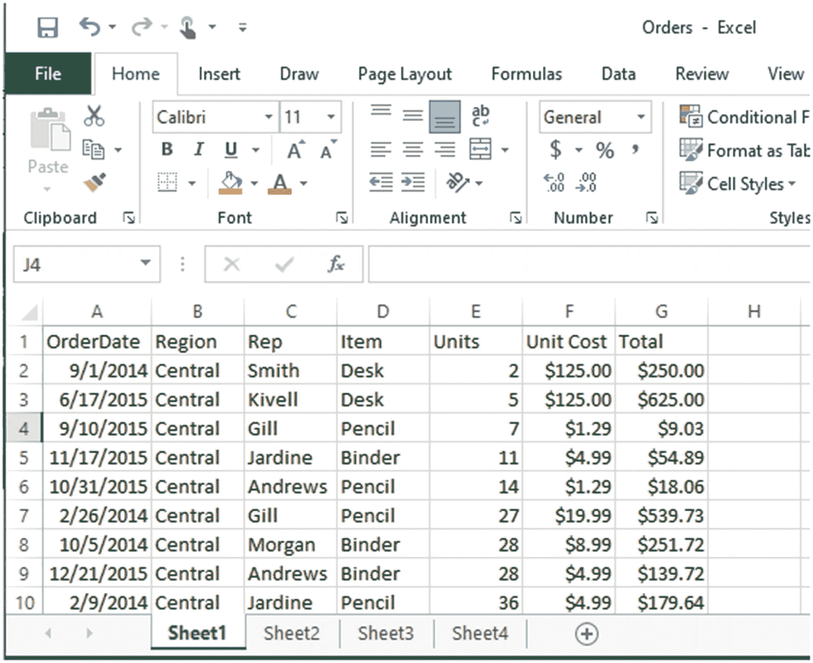

图 14-1

包含四张数据工作表的 Excel 电子表格示例

### 上传到 Azure 数据湖存储二代

创建 Excel 电子表格后，将电子表格上传至您的 ADLS Gen2 账户，如图 [14-2](#Fig2) 所示。

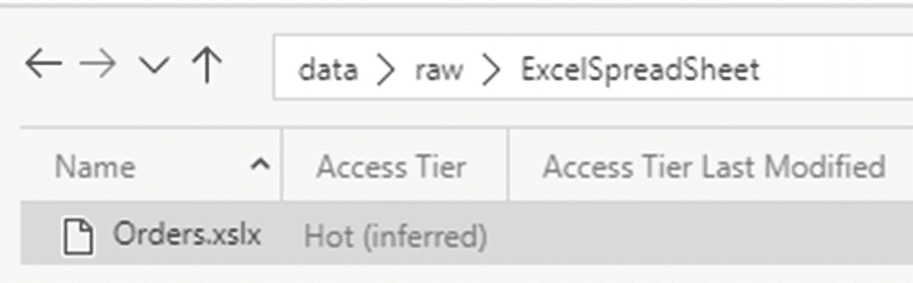

图 14-2

Excel 文件已加载到 ADLS Gen2

### 创建链接的服务和数据集

在数据工厂中，为 Excel 电子表格的文件路径添加一个 ADLS Gen2 链接服务，该服务已经添加到`data/raw/ExcelSpreadSheet`文件夹路径中，如图 [14-3](#Fig3) 所示。提醒一下，由于 ADLS Gen2 是一个分层的文件系统，ADF 管道将能够轻松地遍历多个文件夹层次结构来定位文件。

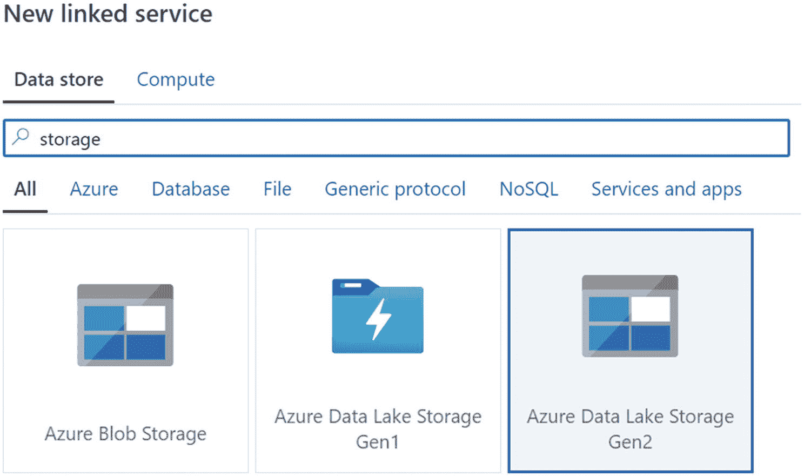

图 14-3

Excel 电子表格位置的 ADLS Gen2 链接服务

图 [14-4](#Fig4) 显示了 ADLS 第二代连接的正确配置属性。确保 ADLS 第二代链接服务凭据配置准确。

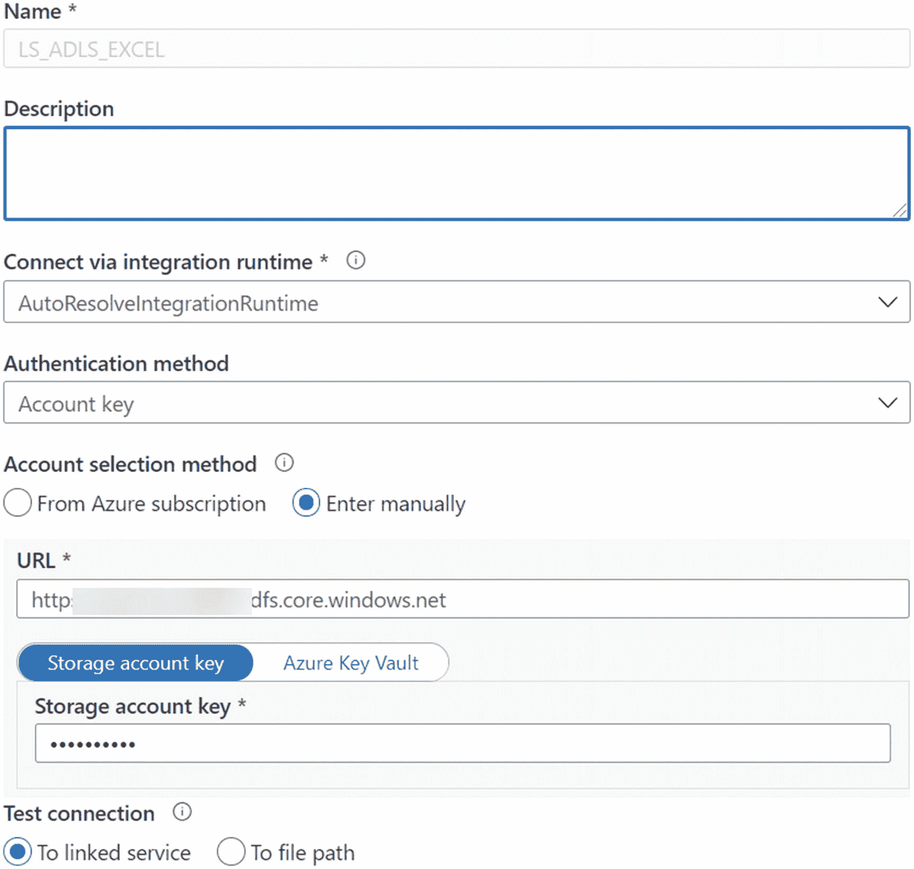

图 14-4

ADLS 第二代链接服务凭据

创建新数据集时，注意图 [14-5](#Fig5) 中我们有一个 Excel 格式的选项，可以选择。

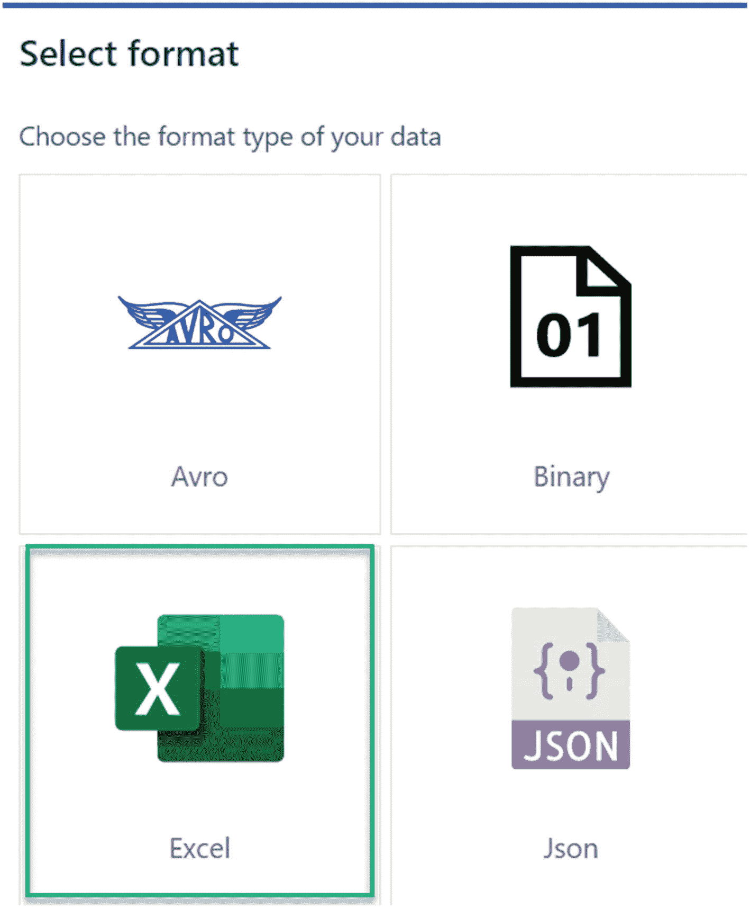

图 14-5

Excel 数据集格式

Excel 数据集的连接配置属性可在图 [14-6](#Fig6) 中找到。工作表名称属性需要用动态参数化的`@dataset().SheetName`值进行配置。此外，由于文件中存在标题，请选中“第一行作为标题”同样，本练习假设电子表格中没有浮动图像。此外，本练习中没有测试模式漂移和额外的头。

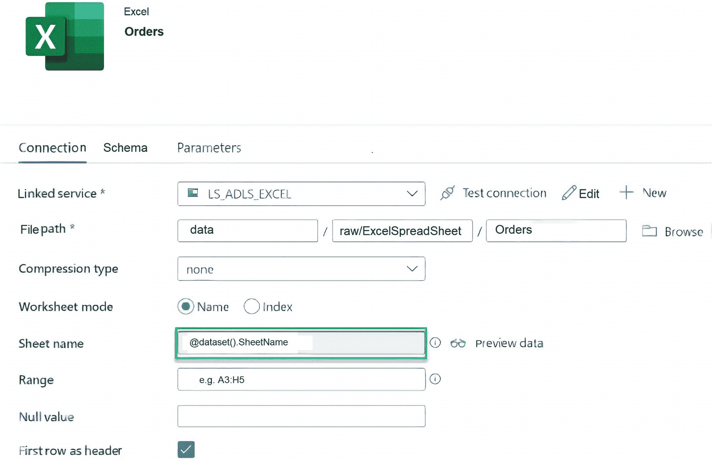

图 14-6

Excel 数据集连接属性

在参数页签内，添加`SheetName`，如图 [14-7](#Fig7) 所示。该参数将在 Excel 文件中存储工作表的名称，该文件提供 ForEach 循环活动，该循环活动遍历每个工作表并将它们加载到 SQL 数据库中。

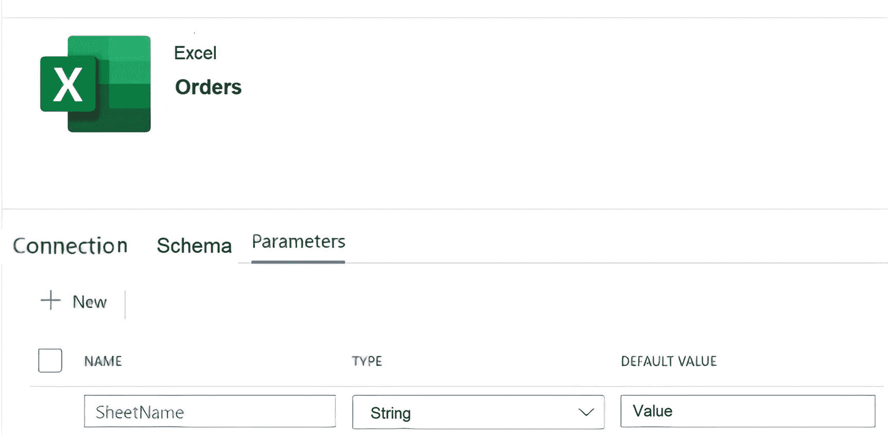

图 14-7

Excel 数据集参数属性

接下来，将一个接收数据集添加到目标 Azure SQL 表，并连接到适当的链接服务，如图 [14-8](#Fig8) 所示。请注意，虽然您已经指定了包括模式和表名的硬编码表路径，但是您不需要担心在 SQL 数据库中创建这个对应的表。在 ADF 中，当在管道中配置接收器数据集属性时，您需要启用一个属性，以便根据源 Excel 文件的传入架构“自动创建”表，您将在本章后面了解该属性。

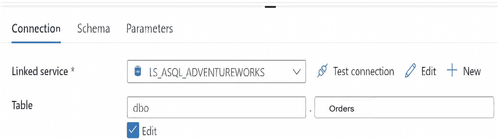

图 14-8

Azure SQL 接收器数据集连接属性

概括地说，在本节中，您已经创建了必要的先决条件，包括创建 Excel 电子表格并将其上传到 ADLS Gen2，以及创建数据集和链接服务。至此，您已经准备好进入下一部分，在这里您将学习如何创建实际的 ADF 管道来将 Excel 电子表格加载到 Azure SQL 数据库表中。

## 创建一个管道，将电子表格中的多个 Excel 表加载到单个 Azure SQL 表中

现在，让我们创建一个管道，将单个电子表格文件中的多个 Excel 表加载到单个 Azure SQL 表中。在 ADF 窗格中，创建一个新管道，然后将 ForEach 循环活动添加到管道画布中。接下来，单击管道中画布的空白区域，添加一个名为`SheetName`的新数组变量，该变量包含电子表格中从 Sheet1 到 Sheet4 的所有工作表的默认值，如图 [14-9](#Fig9) 所示。

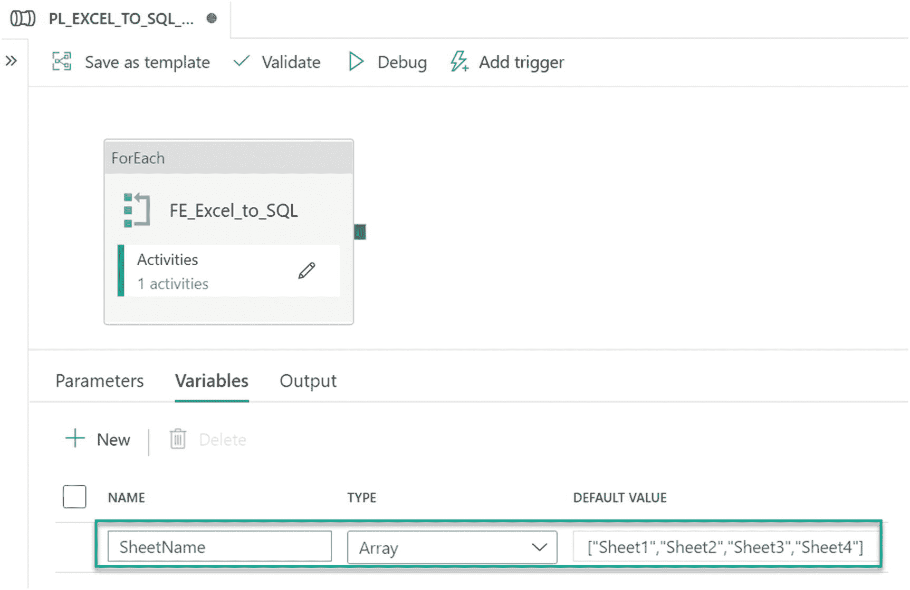

图 14-9

ADF ForEach 循环连接变量

接下来，点击 ForEach 循环活动将其启用，然后将`@variables('SheetName')`添加到 ForEach 循环活动的设置页签的 Items 属性中，如图 [14-10](#Fig10) 所示。

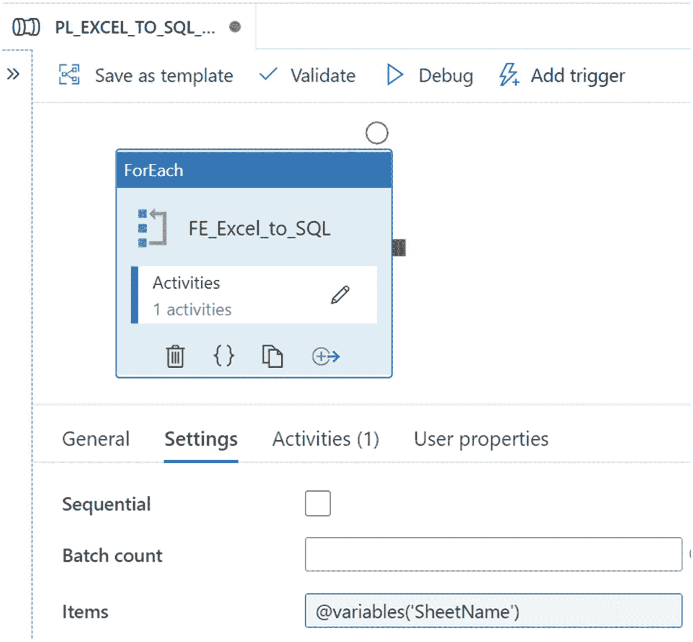

图 14-10

ADF ForEach 连接设置

接下来，点击图 [14-10](#Fig10) 中的 Activities 选项卡，导航至 ForEach 循环活动。或者，您可以通过单击 ForEach 循环活动中显示的铅笔图标来访问活动。添加一个带有源配置的复制数据活动，如图 [14-11](#Fig11) 所示。

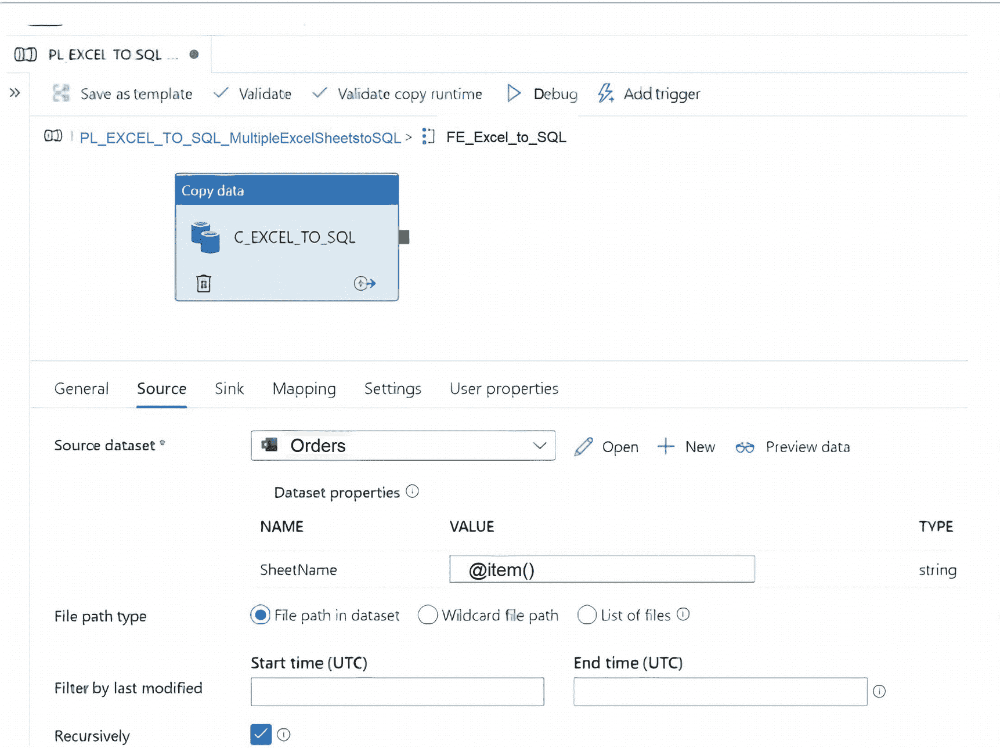

图 14-11

ADF 复制数据源数据集连接属性

在图 [14-12](#Fig12) 所示的水槽配置中，将表格选项属性设置为“自动创建表格”，因为表格尚未创建。

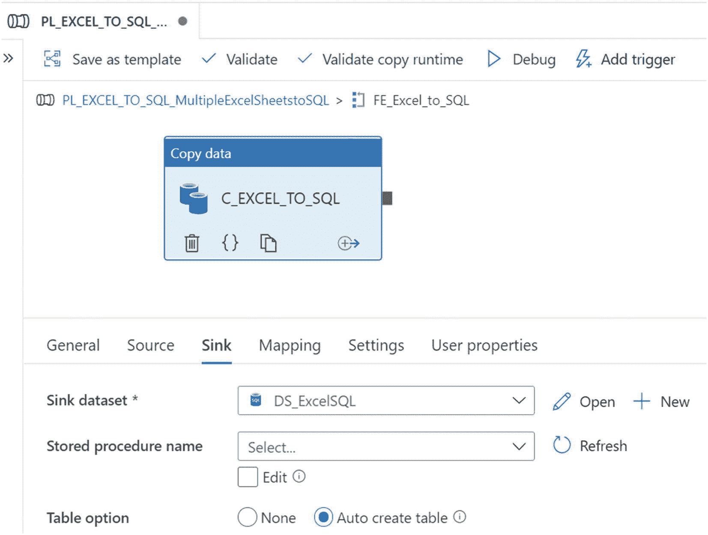

图 14-12

ADF 复制活动接收器连接属性

在执行管道之后，注意图 [14-13](#Fig13) 中的四张表已经被加载到 Azure SQL 表中。

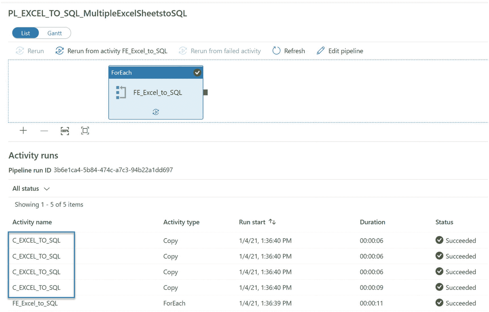

图 14-13

成功的 ADF Excel 到 SQL 管道执行状态

导航到 Azure SQL 表并查询它。注意在图 [14-14](#Fig14) 中，所有 Excel 表中的数据都被加载到一个 Azure SQL 表中。

以下是在图 [14-14](#Fig14) 中执行的 SQL 查询:

```
SELECT [orderdate],
       [region],
       [rep],
       [item],
       [units],
       [unit cost],
       [total]
FROM   [dbo].[orders]

```

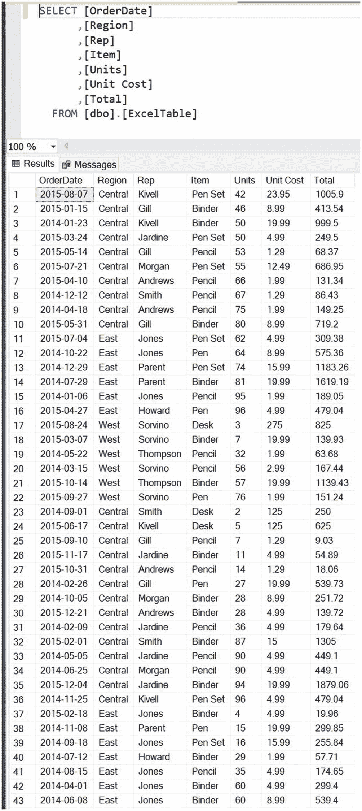

图 14-14

从 SSMS 查询 Azure SQL 表以确认数据可用

## 创建一个管道将电子表格中的多个 Excel 表加载到多个 Azure SQL 表中

在下一个示例中，让我们测试将多个 Excel 工作表从一个 Excel 电子表格加载到同一个数据库中的多个 Azure SQL 表中。首先，创建一个新的 Excel 查找表，如图 [14-15](#Fig15) 所示，包含`SheetName`和`TableName`，将被动态 ADF 管道参数使用。

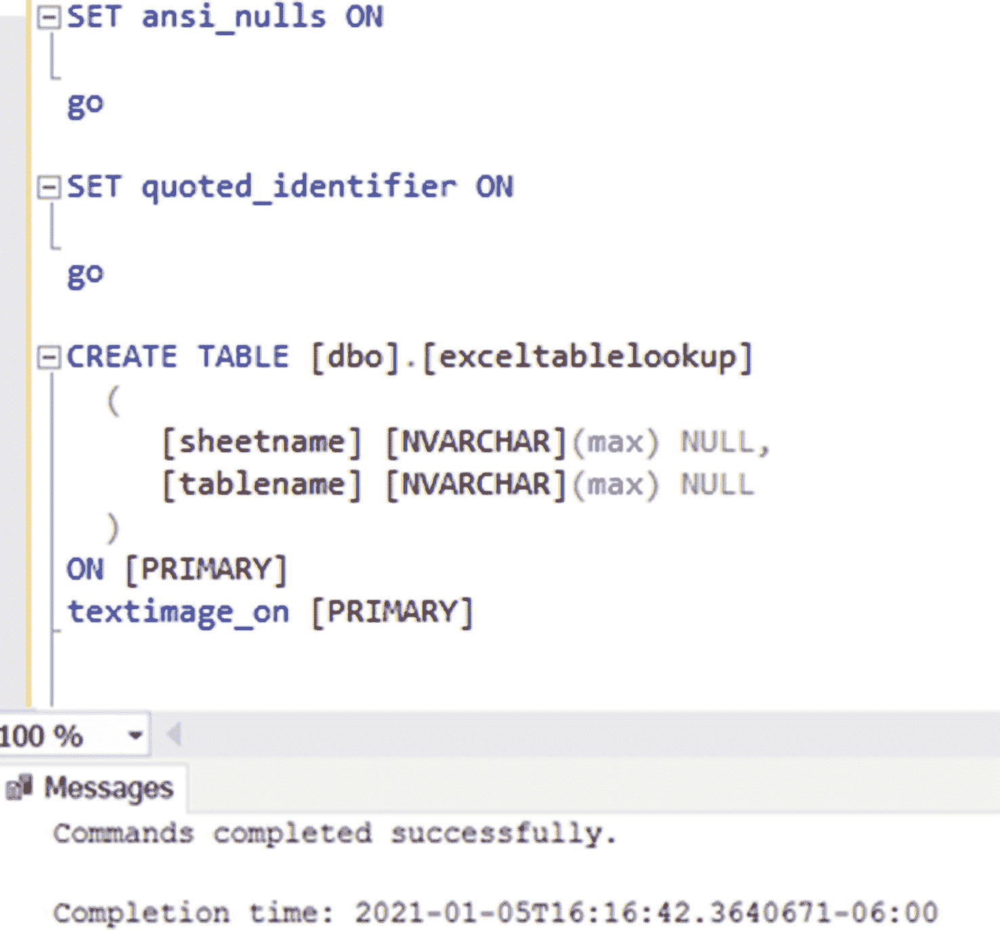

图 14-15

创建包含 SheetName 和 TableName 的 Excel 查找表

以下脚本用于创建图 [14-15](#Fig15) 中的查找表:

```
SET ansi_nulls ON

go

SET quoted_identifier ON

go

CREATE TABLE [dbo].[exceltablelookup]
  (
     [sheetname] [NVARCHAR](max) NULL,
     [tablename] [NVARCHAR](max) NULL
  )
ON [PRIMARY]
textimage_on [PRIMARY]

```

表格创建完成后，将`SheetNames`和相应的`TableNames`插入表格，如图 [14-16](#Fig16) 所示。

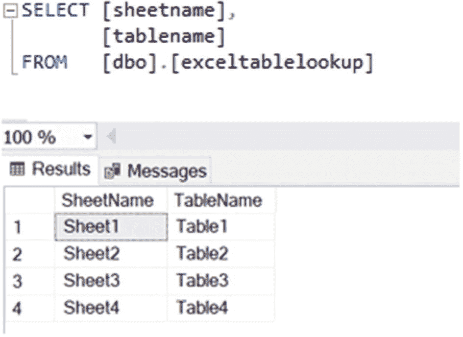

图 14-16

将工作表名称和相应的表格名称插入表格

以下是已经在图 [14-16](#Fig16) 中执行的 SQL 查询:

```
SELECT [sheetname],
       [tablename]
FROM   [dbo].[exceltablelookup]

```

接下来，添加一个连接到 Excel 查找表的新数据集，如图 [14-17](#Fig17) 所示。

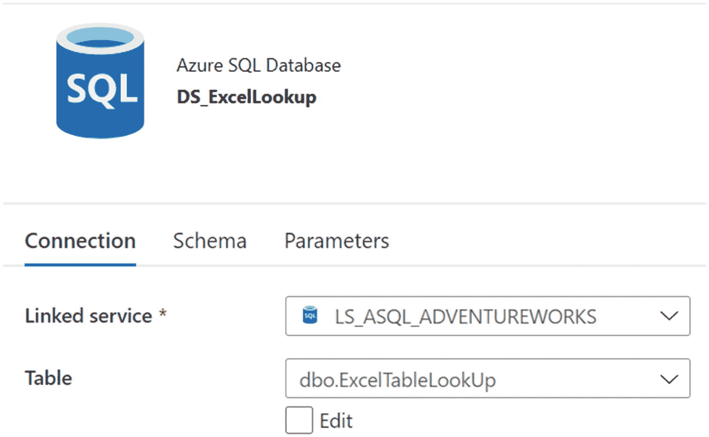

图 14-17

查找表的 ADF 数据集连接属性

图 [14-18](#Fig18) 显示 Excel 电子表格的连接属性将类似于之前我们参数化`SheetName`的管道。


图 14-18

ADF Excel 数据集连接属性

在这个场景中，为 Azure SQL 数据库数据集连接中的`TableName`添加一个参数，如图 [14-19](#Fig19) 所示。

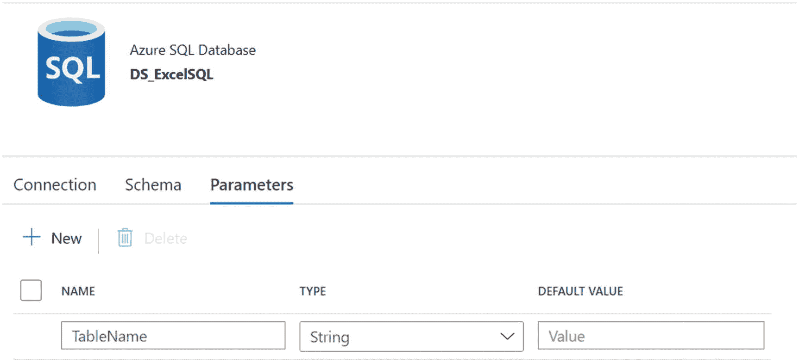

图 14-19

Azure SQL 数据库连接参数

在 Azure SQL DB Connection 选项卡中，将模式保留为硬编码，并为`TableName`添加参数，如图 [14-20](#Fig20) 所示。

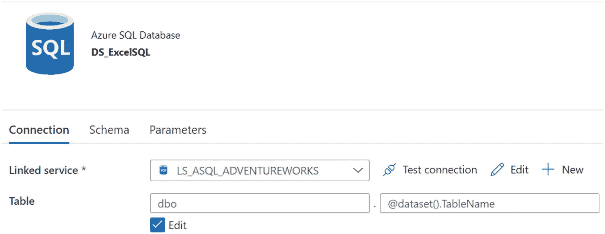

图 14-20

Azure SQL 数据库参数化连接

在这个管道中，将需要一个查找表，它将通过对表的`select *`查找来服务于在 SQL 查找表中查找值的目的，如图 [14-21](#Fig21) 所示。

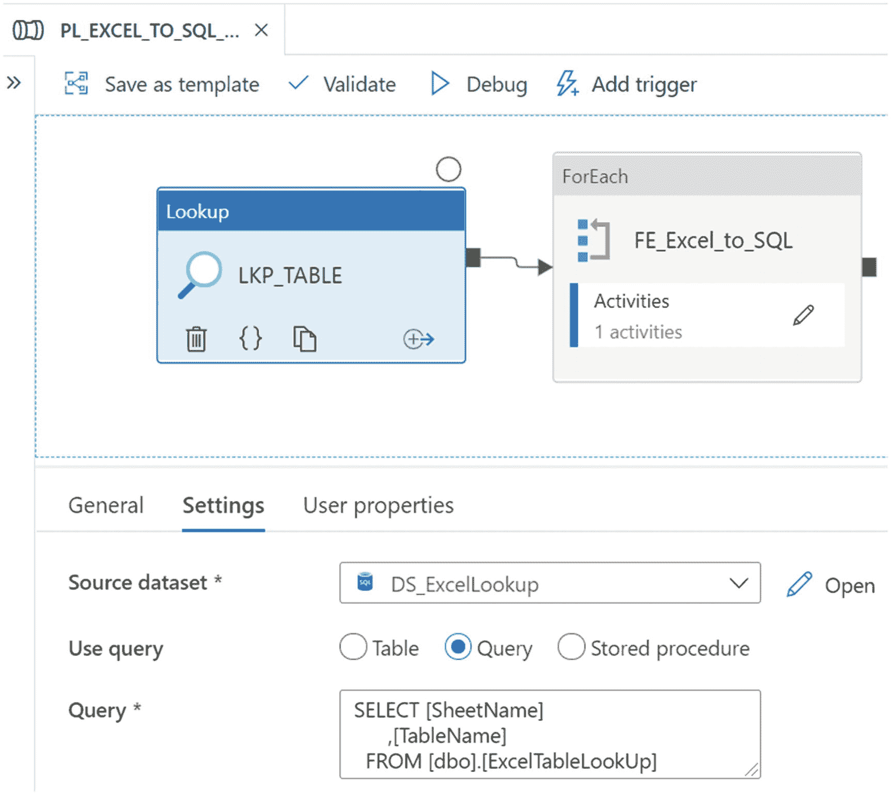

图 14-21

ADF 查找设置

Note

出于本练习的目的，已经选择了查询选项，并且嵌入了源 SQL 查询。作为 ADF 管道中低嵌入式 SQL 代码维护的替代选项，可以考虑使用表或存储过程查询选项类型。

图 [14-22](#Fig22) 显示了如何将查找的值传递给设置选项卡的 ForEach 循环活动的项目属性。

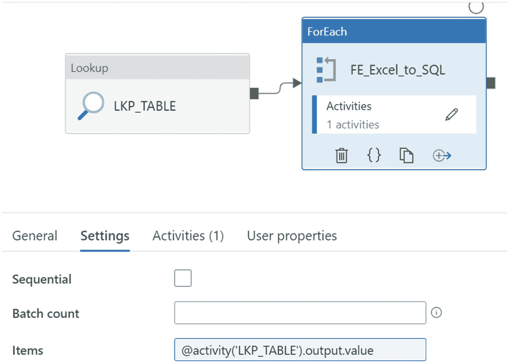

图 14-22

ADF ForEach 循环设置

接下来，在 ForEach 循环活动中，添加一个复制数据活动，其源数据集属性包含参数化的`SheetName`值，如图 [14-23](#Fig23) 所示。

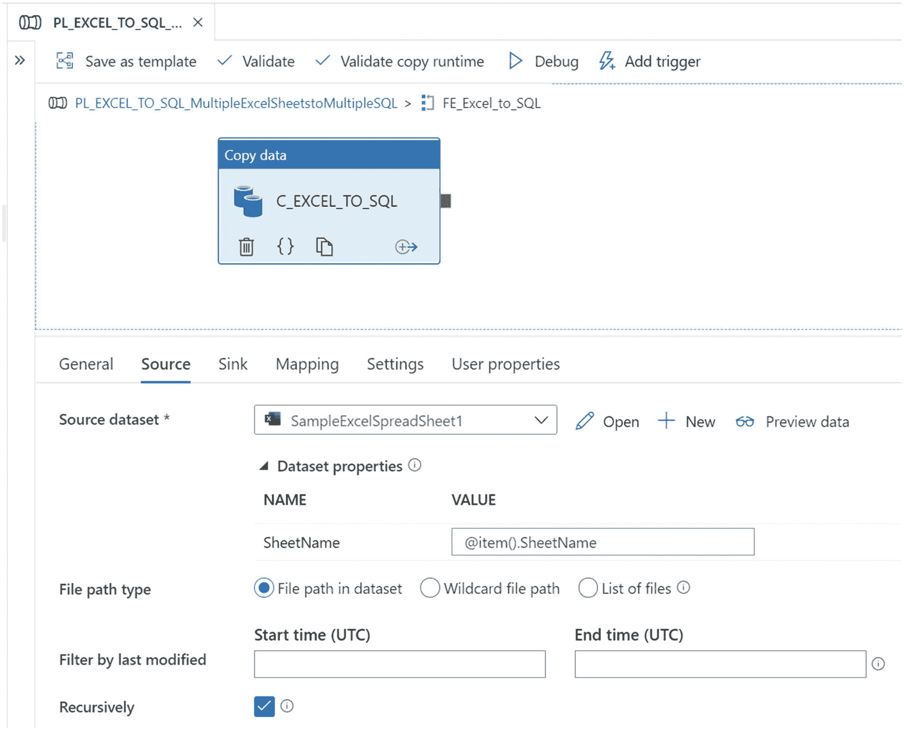

图 14-23

ADF 复制数据源数据集连接属性

接下来，sink 数据集属性还需要包含参数化的`TableName`值，如图 [14-24](#Fig24) 所示。请注意，表选项再次设置为“自动创建表”，这将基于源 Excel 文件的传入模式创建表。

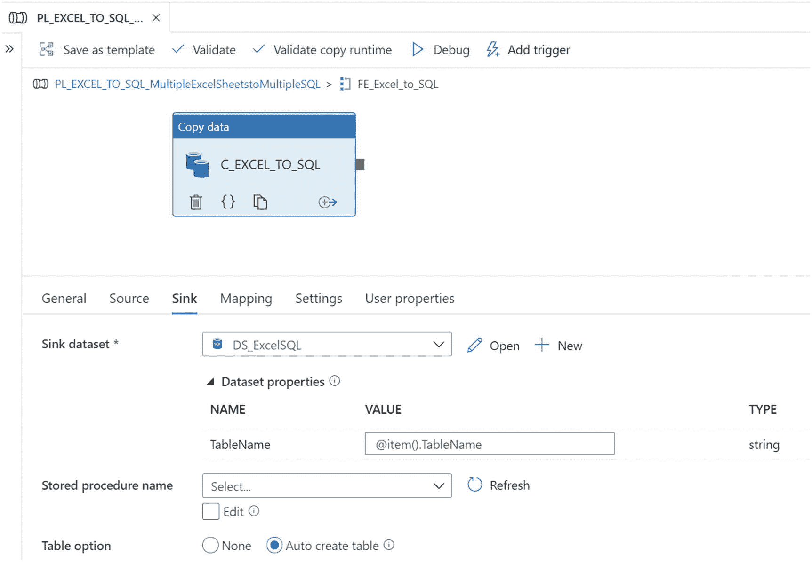

图 14-24

ADF 接收器数据集连接属性

在您完成这个 ADF 管道的执行之后，请注意图 [14-25](#Fig25) 中的管道成功了，并且在您的 Azure SQL 数据库中创建了四个表。

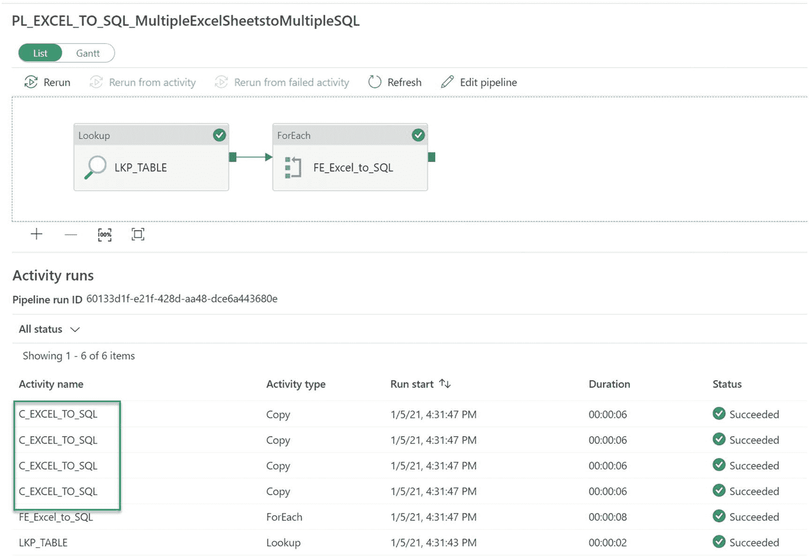

图 14-25

成功的 ADF Excel 到 SQL 管道状态

导航到 Azure SQL 数据库，注意在图 [14-26](#Fig26) 中，所有四个表都是基于您在 SQL 查找表中定义的`TableName`值用适当的名称创建的。

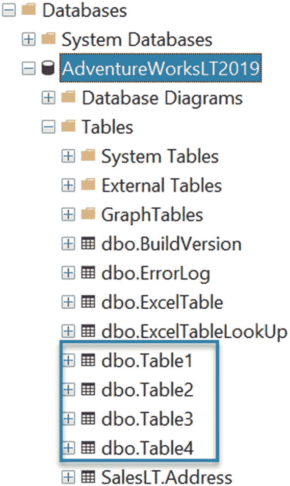

图 14-26

从 Excel 表加载到 Azure SQL 数据库的表格的 SSMS 视图

作为最后一项检查，查询图 [14-27](#Fig27) 中所示的所有四个表格，注意它们都包含来自 Excel 表格的数据，这确认了管道成功执行，表格到多个表格的正确映射在查找表中定义。

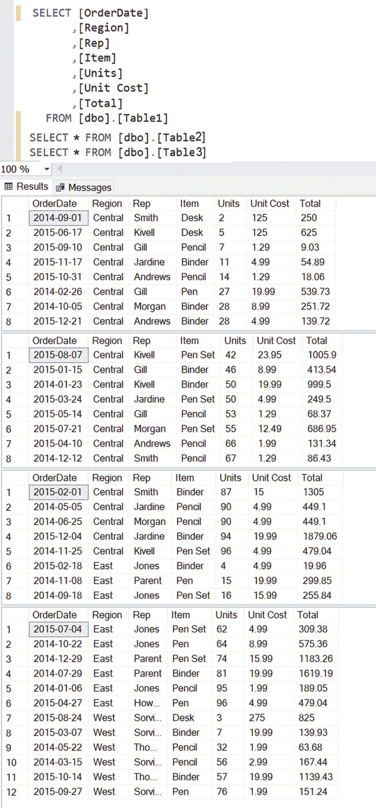

图 14-27

所有表的 SSMS 视图，以验证数据是否存在

以下是已经在图 [14-27](#Fig27) 中执行的 SQL 查询:

```
SELECT [orderdate],
       [region],
       [rep],
       [item],
       [units],
       [unit cost],
       [total]
FROM   [dbo].[table1]

SELECT [orderdate],
       [region],
       [rep],
       [item],
       [units],
       [unit cost],
       [total]
FROM   [dbo].[table2]

SELECT [orderdate],
       [region],
       [rep],
       [item],
       [units],
       [unit cost],
       [total]
FROM   [dbo].[table3]

```

## 摘要

在本章中，我演示了如何使用 Azure Data Factory 的 Excel 连接器以及参数化管道，将位于 ADLS Gen2 中的包含多个工作表的 Excel 电子表格动态加载到单个 Azure SQL 表中，以及每个工作表的多个表中。